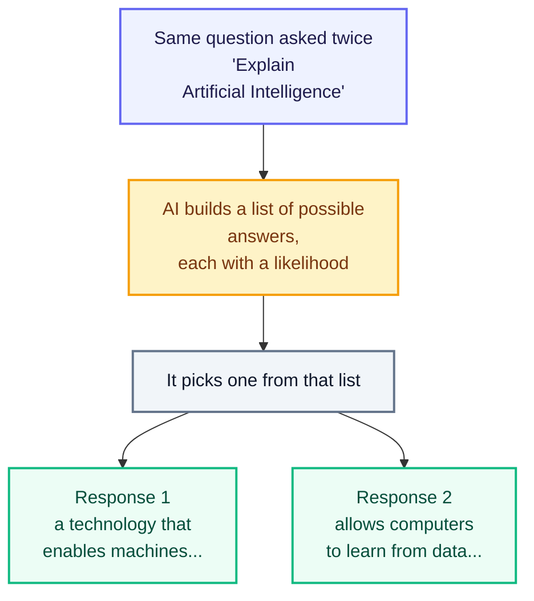

# Foundations of Computation

Computation is the process of taking an input, processing it using instructions, and producing an output. While all computer systems perform computation, they do not all behave the same way — some are deterministic, giving the same output for the same input every time, while others are probabilistic, where the output can vary, as seen in AI systems. Understanding this difference is the first step toward learning how AI works and why AI can generate different responses to the same question.

## What Is Computation?

Computation simply means solving a problem by following steps. A computer does not "think" like a human. It takes something given to it, follows instructions, and produces a result.

**Given information + Steps to follow = Result**

Imagine making tea. You start with water, milk, tea powder, and sugar. You follow steps such as boiling, mixing, and filtering. The final result is a cup of tea. Computation works in a similar way: it starts with information, follows steps, and gives a result.

The same shape sits underneath everything a computer does.

- A calculator takes numbers and an operation as input, then produces an answer.
- A search engine takes keywords as input, then returns relevant results.
- An AI chatbot takes a question as input, then generates a response.

Computation is not magic. It is a step-by-step process. In AI, the steps are more advanced because the system learns patterns from data, but the basic idea is still the same: information is processed to produce an answer.

## Deterministic Systems — Same Input Always Gives the Same Output

A deterministic system always gives the same output when it receives the same input. There is no randomness involved. The rules are fixed, so the result is predictable and repeatable.

- If you enter 2 + 2 in a calculator, the answer will always be 4.
- If a traffic signal is programmed to turn green after 60 seconds, it will follow that rule every time.
- If a login system checks whether a password matches, the result will be either access granted or access denied based on fixed rules.

## Probabilistic Systems — Same Input Can Give Different Outputs

A probabilistic system can give different outputs for the same input because it works with likelihoods instead of fixed rules. It does not always choose one guaranteed answer; it chooses from possible answers based on probability.

- A weather forecast may say there is a 70% chance of rain, but the exact outcome is uncertain.
- A recommendation system may suggest different movies to users based on changing patterns and preferences.

## Deterministic vs. Probabilistic Systems — At a Glance

| Feature | Deterministic System | Probabilistic System |
|---|---|---|
| Output for same input | Always the same | Can vary each time |
| Based on | Fixed rules and logic | Probabilities and patterns |
| Predictability | Fully predictable and repeatable | Uncertain; varies by context |
| Randomness | None | Present (intentional) |
| Examples | Calculator, traffic signal, login system | AI chatbot, weather forecast, recommendation system |
| Used in | Traditional software | Modern AI systems |
| Advantage | Reliable, consistent, easy to test | Flexible, handles uncertainty, generates creative responses |

## From Rules to AI — How Computing Evolved

We have now seen two types of system: deterministic (fixed rules) and probabilistic (likelihoods). But how did we go from rule-based computers to modern AI? This section traces that journey — and shows why it was not a sudden leap, but a natural progression driven by one simple problem: rules alone are not enough for real-world complexity.

### The Problem with Pure Rules

Early computers were entirely deterministic — every program was a fixed set of instructions. If this happens, do that. This worked brilliantly for calculators, ATMs, and booking systems: tasks with clear, bounded rules.

But some problems completely resisted rules:

- How do you write a rule for "recognise a cat in a photo"?
- How do you write a rule for "translate this sentence naturally"?
- How do you write a rule for "reply helpfully to any question a human might ask"?

Engineers tried. The result was brittle, limited, and exhausting to maintain. A spam filter based on rules would block any email containing the word "free" — including a perfectly normal message from a friend saying "feel free to call me." The rule had no sense of context. It just matched a word and fired.

This is the core limitation of pure rules: the real world is messy, and no one can write enough rules to cover every situation.

### The Shift — Let the System Learn from Examples

The key insight of modern AI is simple: instead of writing the rules yourself, show the system millions of examples and let it discover the patterns on its own.

This is called machine learning. And because the system is working from patterns — not fixed rules — its answers always come with some uncertainty. That uncertainty is not a flaw. It is what allows the system to handle situations it has never seen before.

To see how this plays out in something you already use every day, look at autocorrect.

### Autocorrect — From Rules to Patterns

Autocorrect is the clearest example of this shift, because you've used it thousands of times without thinking about it.

**Old autocorrect — pure rules:**

It had a fixed dictionary. "Teh" always became "The." No exceptions, no context. One rule, one outcome, every time.

The problem: it had no idea what you were actually trying to say. It just matched wrong spellings to right ones — and failed the moment something fell outside its dictionary.

**Modern autocorrect — learned patterns:**

Try typing "I'll meat you at the" on your phone. It suggests "meet" — not because someone wrote a rule that said "replace meat with meet after I'll," but because the system has seen millions of real sentences and learned that "meet you" appears far more often in this context than "meat you."

Now open a recipe app and type the same word. It might not correct it at all — because in that context, "meat" is exactly right.

Same word. Different context. Different output.

This is the shift from rules to patterns. The system isn't following a fixed instruction — it's making a probability-based judgement about what makes the most sense given everything around it.

### From Autocorrect to AI — The Same Idea, Much Bigger

Once you understand modern autocorrect, you already understand the core of how a Large Language Model like Claude works. The difference is scale, not concept.

Autocorrect looks at a few words around what you typed and predicts the most likely correction.

An LLM looks at your entire conversation — every message, every instruction, all the context — and predicts the most likely next response. It does this across a vastly larger vocabulary, with a far richer understanding of language, generating one token at a time until the response is complete.

Both are doing the same fundamental thing: looking at context and making a probability-based judgement about what comes next.

This is the direct path from rule-based computing to modern AI:

Fixed rules → Learning from examples → Autocorrect → Large Language Models

Each step made the system better at handling situations it had never been explicitly programmed for. And each step made it more probabilistic — which is exactly why AI gives different answers to the same question, which the next section covers in detail.

## Why AI Gives Different Answers to the Same Question

Imagine asking three different teachers: "What is Machine Learning?"

All three know the answer — but each may explain it differently.

- One may use a definition.
- One may give an example.
- One may draw a diagram.

The answer changes, but the concept remains the same. AI behaves in a similar way. Ask it to explain artificial intelligence twice, and you might get these two replies.

Response 1: Artificial Intelligence is a technology that enables machines to perform tasks that normally require human intelligence.

Response 2: Artificial Intelligence allows computers to learn from data and solve problems like humans.

Both answers are correct. They simply explain the same idea in different ways. AI is not broken when it gives a different answer — it is working exactly as designed. It samples from many possible correct responses, just as a teacher might pick any one of several good explanations.

This is exactly why asking Claude the same question twice can give you two different — but both reasonable — answers. The model is sampling from probabilities, not looking up a fixed answer in a table.

This behaviour is controlled by a setting called temperature:

- Low temperature — the model plays it safe, picks the most probable response every time, output is predictable and consistent
- High temperature — the model takes more risks, picks less obvious continuations, output is more varied and creative

You will explore temperature and sampling in much more detail later in this program — including the math behind how it works and how to tune it for different tasks. For now, the one thing to hold onto is this: an LLM's core behaviour is probabilistic by design, not by accident or flaw. It is not broken when it gives you two different answers — it is working exactly as intended.

## Human vs Machine Problem-Solving

We have seen what the machine does: it takes an input, processes it, and produces an output. That leaves an obvious question. If the machine does the processing, what is left for the human to do?

Imagine you want to travel to a new city. A maps app can find the fastest route in seconds — that is the processing. But the app did not decide that you should travel, choose the city, or decide whether "fastest" mattered more than "cheapest." You did all of that. And if the trip goes wrong, the app does not answer for it. You do.

Solving a problem currently requires a human to do the following:

- **Notice the problem** — decide that something is worth solving at all
- **Understand the goal** — work out what a good result would actually look like
- **Decide what matters** — separate the details that count from the ones that can be ignored
- **Break it down** — split one large problem into parts small enough to handle
- **Choose an approach** — pick one path out of many possible ones
- **State it clearly** — turn a vague intention into instructions precise enough to act on
- **Check the result** — decide whether the output is correct, useful, and safe to use
- **Take responsibility** — answer for the consequences if the result turns out to be wrong

A machine can help with some of these steps, but not all of them.

| Step | Human | Machine |
|---|---|---|
| Notice the problem | Yes | No |
| Understand the goal | Yes | No |
| Decide what matters | Yes | No |
| Break it down | Yes | Partly, once told what to break down |
| Choose an approach | Yes | Partly, once given the goal |
| State it clearly | Yes | No |
| Do the work | Sometimes | Yes, quickly and at scale |
| Check the result | Yes | Partly, never for accountability |
| Take responsibility | Yes | Never |

The machine is fast at doing. It cannot decide what is worth doing, and it cannot answer for the result afterwards. Those two ends of the list stay with the human.

This is why the rest of this module exists. Deciding what matters and breaking a problem down are covered in Unit M1.2. Choosing an approach and stating it clearly are covered in Units M1.3 and M1.4. Checking the result and taking responsibility return later, in Module M3.

## Key Takeaway

Traditional software is often deterministic: the same input gives the same output. Modern AI systems are often probabilistic: the same input can lead to different outputs because the system works with probabilities, patterns, and context. Understanding this difference helps students use AI more effectively and evaluate its answers more carefully.

## References

- [IBM: What is Machine Learning?](https://www.ibm.com/think/topics/machine-learning)
- [AWS: What is Generative AI?](https://aws.amazon.com/what-is/generative-ai/)
