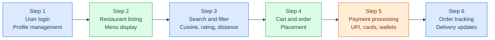
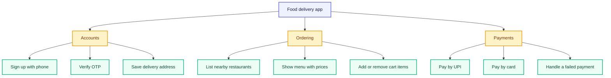
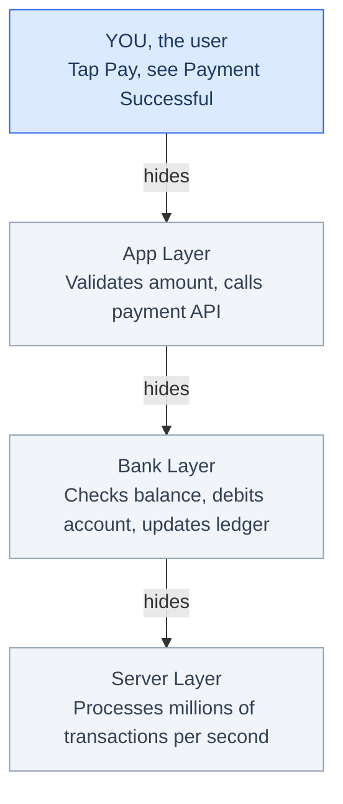
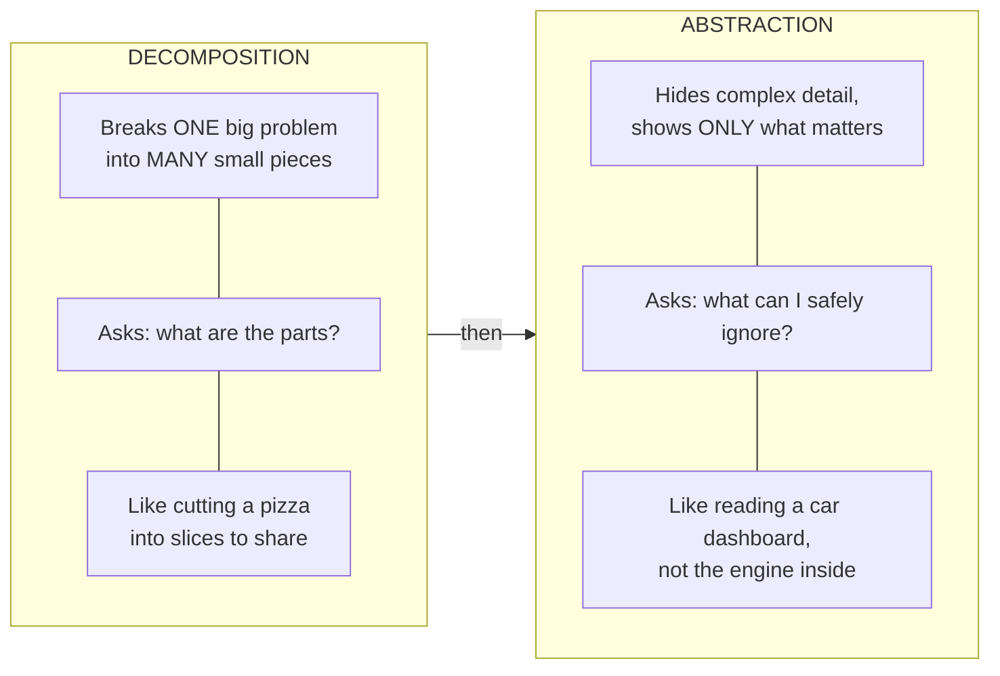
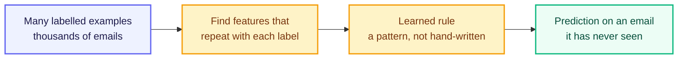

# Core Computational Thinking Skills

Every big problem feels overwhelming when you look at it all at once. "Build an app like Swiggy" sounds huge and scary, but no engineer — and no AI — solves a big problem in one jump. They always break it down first, and this unit covers the four skills behind that: decomposition, abstraction, pattern recognition, and algorithmic thinking.

## Decomposition

Decomposition means splitting one big, complex problem into smaller, self-contained sub-problems, each of which is easy enough to understand, build, and test on its own. When each of those sub-problems is built as a clean, reusable block, that property is called **modularity**.

You cannot eat an entire pizza in one bite. But cut it into 8 slices and eat one at a time, and it is easy. Decomposition is cutting the pizza. Modularity is the fact that each slice is self-contained — you can pick up one slice without the whole pizza falling apart.

"Build a food delivery app like Swiggy" sounds overwhelming as one task. Watch what happens when you decompose it.

Six clear sub-problems. Each one is small enough to build and test on its own, and different engineers can work on different steps at the same time. That is decomposition.

And notice — the payment module built for Swiggy can be picked up and plugged into Zomato or Blinkit tomorrow without rewriting it from scratch. That reusability is modularity. The two ideas go hand in hand: decomposition breaks the problem apart, modularity ensures each piece stands on its own.

### Building a Task Tree

Six boxes in a row is a good start, but it is not the whole picture. "Payment processing" is still far too big for one person to sit down and build, so you decompose again, and again, until every piece at the bottom is a single buildable task. The result is a **task tree**: the original problem at the top, sub-problems in the middle, and concrete work items at the bottom.

Building one takes four moves. Write the whole problem as a single box at the top. Split it into three to six major areas, because any more than that means you are listing tasks rather than areas. Take each area and split it again, and keep going while a box still feels too big to hand to one person. Stop when every bottom box — a **leaf** — describes one thing that can be built and tested on its own.

You know a leaf is small enough when you can say out loud what goes in, what comes out, and how you would check it worked. "Handle a failed payment" passes: the input is a failed transaction, the output is a clear message plus an unchanged wallet balance, and you test it by forcing a failure. "Payments" does not pass, which is exactly why it sits one level up.

You will build a task tree for your own semester domain in Lab M1.2, so pay attention to where the levels stop.

### What a Good Split Looks Like

Three rules decide whether a decomposition will hold up once people start building from it.

- Each sub-problem must be **independent enough** — it can be worked on and tested without waiting for the others.
- Each sub-problem must be **small enough to fully understand**, but not so tiny that you end up with hundreds of meaningless fragments.
- Put all the pieces back together and they must **fully solve the original problem**. Nothing from the original request should go missing.

Break any of the three and the split fails in one of three recognisable ways. A split that is too shallow leaves sub-problems still too big and vague — writing "handle payments" without specifying what that involves: UPI? Cards? Wallet? Failure cases? A split that is too deep breaks the work into such tiny fragments that you lose sight of the goal, making "validate the first digit of the phone number" a separate step. And an incomplete split produces sub-problems that, combined, do not cover the whole original request, because some part has been forgotten.

## Abstraction

Your task tree now has every part of the problem visible. That is exactly what you do not want to put in front of a customer.

Abstraction means hiding all the complicated internal details and showing only what is relevant to the person using the system right now. The hidden complexity does not disappear — it is simply kept out of sight until someone needs it.

When you use an ATM, you press "Withdraw ₹500" and get your cash. You never see the bank's servers, the account balance check, or the cash-dispensing mechanics. All that complexity is hidden underneath a simple interface. That is abstraction.

When you tap "Pay ₹200" on Google Pay and see "Payment Successful ✅", a lot is happening that you never see. Here is how the same action looks at each layer.

Each layer hides the one below it. You see only the top layer. The app developer sees the top two. The bank's engineering team sees all four. Same system, completely different views — that is abstraction.

### Getting the Level Right

Always decompose first, then decide what to abstract, because you cannot hide detail sensibly until you know what the parts are. Then match the abstraction to your audience: a user needs simplicity, while a developer maintaining the system needs more detail visible. The same judgement applies when you hand a task to an AI system — decide clearly what the AI needs to know and what it can treat as already handled.

That judgement can go wrong in both directions, and both directions hurt.

Hide too much and you take away details the user actually needs. Showing only "Payment Failed" without saying why leaves them stuck — was it the wrong PIN? An expired card? Insufficient balance?

Hide too little and you push internal detail at someone who cannot act on it. Displaying a raw database error message such as "NullPointerException at line 42" helps nobody, where "Something went wrong, please try again" does.

## Decomposition vs. Abstraction

These two concepts work together, but they answer completely different questions. Here is a clear side-by-side view.

| Aspect | Decomposition | Abstraction |
|---|---|---|
| Core action | Splits a big problem into smaller pieces | Hides unnecessary detail from a viewer |
| Question it answers | "What are the parts of this problem?" | "What detail can I safely ignore right now?" |
| Direction | Breaks a whole apart | Simplifies one part for a specific audience |
| App example | Breaking Swiggy into: browse → cart → pay → track | Showing "Order Placed ✅" instead of database logs |
| When to use | At the start, before you build anything | After decomposing, to decide what each audience sees |
| Used together? | Yes, always decompose first | Yes, then abstract each piece for its audience |

Decomposition is cutting the pizza into slices. Abstraction is putting each slice in a box so the delivery person does not need to see the whole kitchen.

If you are ever asked in an interview to design a system, start by saying "let me first decompose this problem", then for each part describe what you would abstract away from the end user. That immediately demonstrates computational thinking, a skill most freshers do not show.

## Pattern Recognition

Look at the task tree again and something jumps out. Several of those pieces are the same shape. "Verify OTP at sign-up" and "verify OTP at payment" are not two problems — they are one problem appearing twice.

Noticing that is pattern recognition: spotting similarities, repetitions, and regularities so you can solve one thing once instead of many things separately. The first time you take a new bus route you read every stop name carefully. By the tenth time you read nothing, because you know your stop comes two after the flyover. You stopped processing the details and started using the pattern.

### Patterns Across Sub-Problems

Once your problem is decomposed, look for pieces that share a shape.

| Sub-problems that look different | The pattern underneath |
|---|---|
| Verify phone at sign-up, verify phone at checkout | One "send and check an OTP" module |
| Search restaurants, search dishes, search past orders | One "search a list by keyword and filter" module |
| Card payment failed, UPI timed out, wallet balance low | One "payment failure → clear message → safe retry" flow |

Three modules instead of nine. That is pattern recognition doing the work decomposition set up for it.

### Patterns in Data

This is the one that matters for AI. Unit M1.1 showed the shift from writing rules by hand to letting a system learn them from examples, and pattern recognition is the name of that shift.

Take spam detection. Writing rules by hand fails fast — block the word "free" and you also block your friend saying "feel free to call me". So instead of writing rules, you show the machine examples that have already been labelled.

| Email | Contains "prize" | ALL CAPS subject | Unknown sender | Label |
|---|---|---|---|---|
| 1 | Yes | Yes | Yes | Spam |
| 2 | No | No | No | Not spam |
| 3 | Yes | No | Yes | Spam |
| 4 | No | No | Yes | Not spam |

Nobody told the machine that "prize + unknown sender" means spam. It counted, across thousands of examples, which combinations of features kept showing up alongside the "Spam" label, and built its own rule out of what repeated.

That last arrow is the whole point. A hand-written rule only handles cases someone thought of in advance. A learned pattern handles the email that arrives tomorrow, worded in a way nobody predicted. It is also why the answer comes with a probability attached rather than a guarantee — the machine is saying "this looks like the spam I have seen before", not "this is definitely spam".

### When a Pattern Is Not a Pattern

A pattern is only worth trusting when it survives three checks. It needs enough examples, and varied ones, because a pattern found in ten emails is a coincidence while a pattern found in ten thousand is a rule. It needs features that actually matter, since "unknown sender" carries signal and "email arrived on a Tuesday" almost certainly does not. And it must be tested on data the system has never seen, because a pattern that only works on the examples you trained with has not been learned, it has been memorised.

Skip those checks and three things go wrong, all of which look like success at first.

A coincidence gets mistaken for a pattern. Ice-cream sales and drowning incidents both rise in summer, but neither causes the other; a third thing, hot weather, causes both. Things happening together is not the same as one explaining the other.

The system memorises instead of generalising. It nails every training example and fails on real ones, because it learned the answer sheet rather than the subject.

The sample is biased. Train a food recommender only on orders from one city and it will confidently recommend biryani to someone who wants idli. The pattern is real, it just came from the wrong crowd.

Pattern recognition is the bridge between the two halves of this programme. Everything before it is you thinking. Everything after it — machine learning, LLMs, the models you will use in later modules — is a machine doing this one skill at enormous scale.

## Algorithmic Thinking

You have broken the problem down, hidden what each audience does not need, and noticed what repeats. One thing is still missing. Knowing that "handle a failed payment" is a leaf on your tree does not tell anyone what to actually do when a payment fails.

An **algorithm** is a finite sequence of well-defined, unambiguous steps that takes some input and produces a specific output, solving a particular problem. The word sounds fancy, but you have been using algorithms your whole life. Every time you follow a recipe, use Google Maps, or stand in a queue, that is algorithmic thinking in action. And when you use AI tools like Claude or GitHub Copilot, you are essentially asking them to follow or generate algorithms — think algorithmically and you will know how to give them better instructions, and catch it when they mess up.

The key word in that definition is **well-defined**, because not every list of steps is an algorithm. "Cook something nice for dinner" is not one: it is vague, it has no clear stopping point, and it does not guarantee a specific result, so your friend and your neighbour would cook completely different things. "Boil 2 cups of water. Add 1 tsp salt. Add 100g rice. Cook for 12 minutes. Drain." is one, because every step is precise and anyone following it gets the same result every time.

That predictability is what makes algorithms so powerful. Computers cannot do "cook something nice". They can absolutely do "boil for exactly 12 minutes".

### Algorithms You Already Use

Algorithms did not start with computers — humans have used them for thousands of years. Here are three you have probably used this week.

**Making Maggi** takes noodles, water and tastemaker as input, boils, adds and cooks for an exact time, and outputs your 2 AM snack, done every time.

**Google Maps** takes your hostel and your destination as input, evaluates all possible routes using distance, traffic and road closures, and outputs the fastest path plus an ETA.

**The IRCTC queue or a ticket counter** takes people arriving over time as input, applies one rule — first come, first served — and outputs an ordered sequence of service.

All three follow the same shape: input, defined steps, output. This is the structure of every algorithm ever written.

### The Five Properties: F.D.I.O.E.

Not every set of steps qualifies. For something to truly be an algorithm it must have all five of these properties, and it is worth memorising them as F.D.I.O.E. because you will be asked this in exams and interviews.

**F — Finite.** The algorithm must have a definite end and cannot run forever. If steps could loop endlessly with no guaranteed stop, it is not a valid algorithm. This matters a lot when writing loops in code, where an infinite loop is one of the most common beginner bugs.

**D — Definite.** Every step must have exactly one clear meaning, with zero room for interpretation. Words like "quickly", "a bit", "properly" or "as needed" are not allowed. "Add 1/4 tsp salt" is definite; "add a bit of salt" is not.

**I — Input.** The algorithm must accept zero or more well-defined inputs. Even "print numbers 1 to 10" has an implicit input, the range 1–10, and recognising hidden inputs is a skill that makes you a better programmer.

**O — Output.** The algorithm must produce at least one clear, expected result. An algorithm that runs but produces nothing useful is pointless. The output can be an answer, a decision, an action, or transformed data.

**E — Effectiveness.** Every step must be simple enough to actually be carried out in a finite amount of time. A step that cannot be executed in practice, no matter how well defined, makes the algorithm useless. In AI this is critical, because an algorithm that takes 1,000 years to run is technically correct but practically worthless.

If an interviewer asks you what an algorithm is, immediately name all five properties. Saying "finite, definite, input, output, effective" signals that you actually studied, where most candidates just say "a set of steps".

### Testing F.D.I.O.E.: Maggi vs Vibes-Based Cooking

Two recipes for the same dish. One is an algorithm and one only looks like one.

| Maggi noodles | Vibes-based cooking |
|---|---|
| 1. Boil 2 cups of water | 1. Cook the noodles until they taste good |
| 2. Add noodles. Cook for 2 minutes | 2. Serve when ready |
| 3. Add the tastemaker. Mix well | |
| 4. Cook 1 more minute. Serve hot | |

Run both through the five checks and they come apart.

| Property | Maggi noodles ✅ | Vibes-based cooking ❌ |
|---|---|---|
| Finite | Yes, clearly ends at step 4 | Fail, "until they taste good" has no defined stopping point |
| Definite | Yes, "2 cups" and "2 minutes" are totally precise | Fail, "taste good" and "ready" are subjective |
| Input | Yes, water, noodles, tastemaker | Pass, noodles exist as input |
| Output | Yes, a plate of cooked Maggi | Technically pass, but it is undefined |
| Effective | Yes, every step can be carried out immediately with basic kitchen tools | Fail, "taste good" cannot be measured or executed consistently |

This is why casual speech does not work for programming. When giving instructions to an AI or writing code, you need to think at the Maggi level of precision, not the vibes level.

### Worked Example: Library Book Return

Now design an algorithm for returning a book at your college library, then verify it against F.D.I.O.E.

1. Student arrives at the library counter
2. Librarian asks: is the book lost?
3. IF book is lost:
   - Calculate replacement cost
   - Collect payment from student
   - Update library system: mark book as "lost"
   - Give student a lost book receipt
   - END
4. ELSE take the book from the student
5. Scan the book's barcode
6. IF returned after due date: calculate fine at ₹2 per late day, then collect the fine
7. Update library system: mark book as "available"
8. Give student a return receipt
9. END

It is finite, because both paths — lost and returned — reach a clear END. It is definite: "₹2 per late day", "scan barcode" and "replacement cost" leave no vague words anywhere. Its inputs are the book or lost report, the barcode, the return date and the due date. Its outputs are an updated library record and a receipt in both scenarios. And it is effective, because every step can be carried out immediately by any library staff member.

Two completely different situations, a lost book and a normal return, handled cleanly in one algorithm. That is exactly what good algorithmic thinking looks like: every path is covered, nothing is left undefined. Notice that steps 3 and 6 handle two real edge cases. Beginners often forget edge cases, but a real algorithm must specify what happens in every situation, including the awkward ones. Because this passes all five F.D.I.O.E. checks, a developer or an AI tool could implement it in code with zero guesswork.

You wrote that algorithm in plain English and it worked, but plain English gets slippery fast once there are three nested conditions. Unit M1.3 gives you two cleaner ways to write the same thing down: pseudocode and flowcharts.

## The Four Skills Together

One last look at the whole picture, using the app you have been decomposing all unit.

| Skill | Question it answers | On the food delivery app |
|---|---|---|
| Decomposition | "What are the parts of this problem?" | Split the app into accounts, ordering and payments, then into leaves |
| Abstraction | "What detail can I safely ignore right now?" | The user sees "Payment Successful ✅", not the bank ledger |
| Pattern recognition | "What repeats, and what can I reuse?" | One OTP module serves sign-up and checkout |
| Algorithmic thinking | "What are the exact steps?" | On payment failure: retry twice, then show a clear reason and restore the cart |

Decompose, abstract, spot the pattern, write the steps. Always in that order, because you cannot abstract sensibly until you know what the parts are, you cannot spot what repeats until the parts are visible, and you cannot write precise steps until you know which part you are writing them for. That sequence is the same whether you are briefing a teammate or an AI.

## Labs

**Lab M1.2: Decompose your domain** — Choose your semester domain and decompose the problem into a task tree in Excalidraw.

## References

- [BBC Bitesize: Introduction to Computational Thinking](https://www.bbc.co.uk/bitesize/guides/zp92mp3/revision/1)
- [Google for Education: Exploring Computational Thinking](https://www.google.com/edu/resources/programs/exploring-computational-thinking/)
- [GeeksforGeeks: Introduction to Algorithms](https://www.geeksforgeeks.org/introduction-to-algorithms/)
