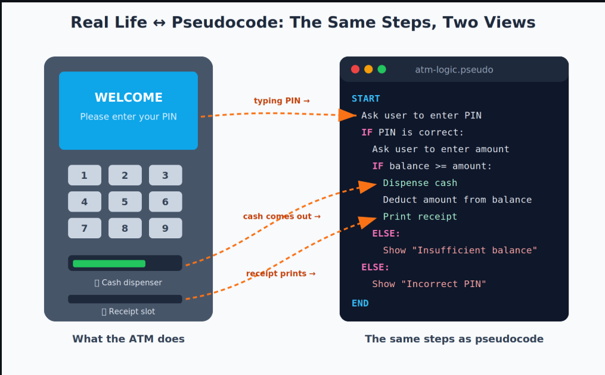
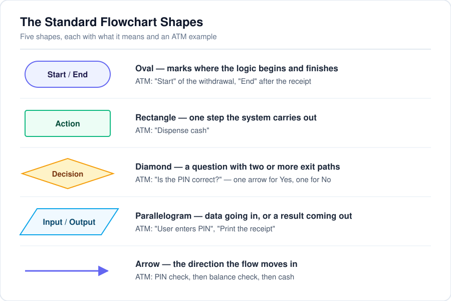
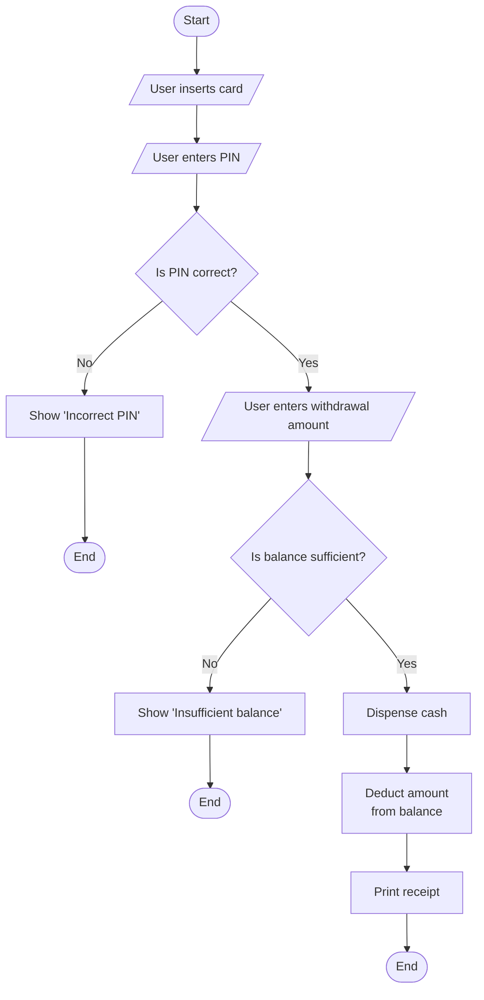

# Expressing Logic

Breaking a big problem into smaller pieces is only half the job. The next step is to describe **exactly how each piece should work — step by step — before writing any actual code.**

Think of it this way. Before a builder constructs a house, they draw a blueprint. Before a director shoots a film, they write a script. You do the same thing before writing code. You plan the logic first.

There are two friendly tools for this: **pseudocode** (writing the logic in plain, structured English) and **flowcharts** (drawing the logic as a picture using boxes, diamonds, and arrows). Neither of them runs on a computer. They are **thinking tools** — used to plan and communicate logic so clearly that a teammate, a manager, or even an AI system can understand it perfectly. Catching a mistake in pseudocode takes 10 seconds. Catching the same mistake after writing 200 lines of code takes much longer.

This also connects directly to AI. When you type a detailed instruction into ChatGPT or any AI tool, you are basically writing pseudocode — just in plain English. The more precise and step-by-step your instruction is, the better the AI understands it, and the better the result you get back. Vague in, vague out. Clear in, clear out.

## Pseudocode — Writing Logic in Plain English Before Writing Code

### What Is Pseudocode?

Pseudocode is a way of describing the steps of a solution using **plain, structured language** that *looks* a bit like code, but does not follow the strict rules of any real programming language. It is **language-agnostic** — meaning it belongs to no specific programming language, so you can write it whether you know Python, Java, or no programming language at all.

**Simple formula:** Clear thinking + Plain English + A little structure = Pseudocode

**Daily-life example:** Think of a recipe card for making Maggi. It says: "Boil 1 cup water. Add noodles. Add masala. Cook for 2 minutes. Serve." That recipe is not written in any "kitchen programming language" — it is just clear, ordered steps that anyone can follow. Pseudocode is exactly that: a recipe for logic.

**Beginner-friendly way to remember:** Pseudocode is *fake code with real thinking*. The computer never reads it — humans do. Its only job is to make your logic crystal clear before the real coding begins.

### The Building Blocks of Pseudocode

| Term | Simple Meaning |
|---|---|
| **Step** | One instruction or action (e.g., "Ask user to enter PIN"). |
| **Condition** | A yes/no check that decides which path to follow (e.g., "IF balance ≥ amount"). |
| **Loop** | A block of steps that repeats (e.g., "FOR each item in the cart, add its price to the total"). |
| **START / END** | Markers showing where the logic begins and finishes. |

### Example — Pseudocode for an ATM Cash Withdrawal

You have probably used an ATM (or watched someone use one). Think about what actually happens: the machine checks your PIN, then checks your balance, and only then gives you cash. Here is that exact logic as pseudocode:

*Figure 1: Pseudocode is just "real life written as ordered steps" — every line maps to something the ATM actually does.*

Notice how it reads almost like English, but with structure: a clear START, clear IF...ELSE branches, and a clear END. A vague sentence like "handle the withdrawal properly" is not enough — pseudocode forces you to spell out what "properly" means in *every* situation.

### Rules for Writing Good Pseudocode

- Use simple, consistent keywords: `START`, `END`, `IF...ELSE`, `FOR EACH`, `WHILE`.
- Write **one clear action per line** — never cram multiple actions together.
- Cover **all realistic paths**, including failures (wrong PIN, low balance, user cancels).
- Keep the language simple enough that a non-programmer friend could follow it.

### Common Beginner Mistakes

- Writing steps so vague they don't specify anything (e.g., "check the balance and do the needful" — what *exactly* happens if the balance is low?).
- Forgetting edge cases (What if the ATM has no cash left? What if the user cancels midway?).
- Writing pseudocode in strict programming syntax — that defeats its whole purpose of being simple and language-independent.

## Flowcharts — Visualising Logic with Standard Shapes and Arrows

### What Is a Flowchart?

A flowchart is a **diagram** that shows a process or logic visually, using standard shapes connected by arrows that show the order in which steps happen.

**Daily-life example:** Have you seen the emergency evacuation map in a cinema hall or hostel? It doesn't *describe* the exit route in paragraphs — it *shows* it with arrows. Flowcharts do the same thing for logic: they turn written steps into a visual map you can follow with your eyes.

**Why flowcharts exist:** Some people — and some situations, like presenting to a large team or a non-technical manager — understand a *picture* of logic far faster than written steps.

### The Standard Flowchart Shapes

*Figure 2: The five standard flowchart shapes, each with a friendly ATM example.*

### Example — The Same ATM Logic as a Flowchart

Remember the ATM pseudocode that we discussed earlier? Here is the **exact same logic**, drawn as a flowchart. Trace it with your finger: start at the top, and every diamond asks you a question that decides which arrow to follow.

### Pseudocode vs Flowchart — At a Glance

| Aspect | Pseudocode | Flowchart |
|---|---|---|
| Format | Plain structured text | Visual diagram (shapes + arrows) |
| Best for | Detailed step-by-step logic with many conditions | Quickly showing the overall shape of a process |
| Easy to share with | Technical teammates, documentation | Non-technical stakeholders, presentations |
| Effort to update | Quick — just edit the text | Slower — may need redrawing |
| Use with AI systems | Mirrors how you describe expected behaviour to an AI | Great for reviewing overall logic at a glance |

**Beginner-friendly way to remember:** Pseudocode is the **story**; the flowchart is the **map**. Same journey, two different views — and great engineers use both together.

### Best Practices

- Every decision diamond must show **all** its outcomes — a Yes/No diamond with only one exit arrow is a mistake.
- Keep flowcharts readable — if you need more than 15–20 shapes, break the problem into smaller flowcharts.
- Use them together: sketch a flowchart for the big picture, then write pseudocode for each box that needs precise detail.

### Common Beginner Mistakes

- Missing the "No" path from a decision diamond (What happens when the answer is No? Always show it!).
- Making a flowchart so detailed it becomes as hard to read as code — the whole point is clarity.
- Using a rectangle where a diamond belongs — a decision must always be a question with multiple possible answers.

## Key Takeaway

Pseudocode and flowcharts are two views of the same thing: **your logic, made visible.** Pseudocode gives you precise step-by-step detail in plain English; flowcharts give you the big picture at a glance. Neither runs on a computer — they run in *human minds*, which is exactly why they are so powerful. Every decision must show all its paths, every failure case must be covered, and clarity always beats cleverness. Master these two tools now, and you have already learned the core skill of AI-Native Engineering: **expressing exactly what you want, so precisely that even a machine cannot misunderstand you.**

**Interview tip:** Interviewers often ask you to "walk through your logic" before coding. Being fluent in pseudocode lets you do this confidently — it is one of the most asked-about skills in fresher interviews.

## References

- [Khan Academy: Expressing an Algorithm (Pseudocode and Flowcharts)](https://www.khanacademy.org/computing/ap-computer-science-principles/algorithms-101/learning/apcsp-algorithms/a/expressing-an-algorithm)
