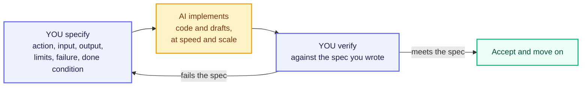

# Specifying for AI

You've now covered the core building blocks of computational thinking — breaking problems apart, hiding unnecessary detail, expressing logic clearly, and understanding what makes a proper algorithm. This topic asks you to take all of that and apply it to something personal: **a domain you actually care about.**

Over the next 15 weeks, you'll build toward a Capstone project — a complete, working AI-powered system that you design and build yourself. That project has to start somewhere. It starts here, by choosing a domain and writing a precise **problem statement** before you touch a single line of code or an AI tool.

Why now, before you've even opened Python? Because a vague starting point always leads to a vague product. "I want to build something with AI in healthcare" sounds exciting but means nothing actionable. A sharp, well-scoped problem statement — written with the same discipline you just learned — sets you up to succeed at every later stage.

From there the unit takes one more step: turning that problem statement into a **specification** precise enough to hand to an AI, and knowing when not to hand it anything at all.

## Choosing Your Domain

A domain is simply an area or industry where a real problem exists — healthcare, banking, education, agriculture, transport, food delivery, or anything else.

You don't need to be an expert. You just need some familiarity or genuine curiosity. Here's how to pick one:

- Pick something you've personally experienced or observed — your own college life, a family member's business, a local community issue
- Prefer domains with real, observable problems — not abstract or theoretical ones
- Good starting areas for BTech freshers: student life and education, UPI and FinTech, healthcare, agriculture, railway booking, food delivery apps, or regional-language AI

The key point: AI-Native Engineers don't build "AI in general." They build AI-powered solutions for a specific problem, for specific users, in a specific context. Your domain gives your learning direction — every new concept from here (specifications, evaluation, agents) becomes easier when you can picture it in a context you actually care about.

## Writing a 3-Sentence Problem Statement

A problem statement is a short, precise description of a real problem — written clearly enough that anyone reading it understands exactly what the issue is, who faces it, and why it matters. Crucially, it does **not** describe how you'll solve it. That comes later.

Beginners almost always jump straight to the solution — "I'll build a chatbot!" — without ever clearly stating the problem that chatbot is supposed to solve. Writing the problem first, and forcing it into just three sentences, makes you decompose your idea down to its essential core before you get distracted by implementation.

**The 3-sentence structure:**

- **Sentence 1** — Who faces this problem, and what specifically goes wrong or is difficult for them today?
- **Sentence 2** — Why does this problem matter — what is the cost or consequence of leaving it unsolved?
- **Sentence 3** — What would "solving" this look like in plain terms, without yet mentioning the technology?

### Weak vs Strong — Side by Side

**Weak problem statement:**

> "Students have trouble with their studies. AI can help them learn better. We should build something for this."

This fails the Definite test from the Algorithmic Thinking topic. Which students? What specific difficulty? "Learn better" could mean a thousand different things.

**Strong problem statement:**

> "First-year engineering students in Tier-2 and Tier-3 Indian colleges often struggle to get quick answers to basic doubts outside class hours, since teaching assistants are not always available. This leads many students to either fall behind silently or rely on unverified answers from random online forums. A good solution would let a student ask a doubt in their own words, at any time, and receive an accurate, syllabus-aligned explanation they can actually understand."

Notice how this version applies everything from previous topics:

- **Decomposition** — it narrows "students" down to a specific group and a specific difficulty, not "education in general"
- **Definite language** — no vague words like "better" or "help" without explanation
- **Input / Output framing** — clear input (a student's doubt) and a clear desired output (an accurate, understandable explanation)

### Rules for a Good Problem Statement

- Name a **specific** group of people — not "everyone" or "students" in general
- Describe a **specific, observable** difficulty — not a general dissatisfaction
- Do **not** mention your intended solution or technology — no "using AI, we will build a chatbot that…"
- Keep it to exactly **three sentences** — this constraint forces clarity and prevents rambling

### Common Beginner Mistakes

- Writing a solution statement instead of a problem statement — jumping straight to "I will build an AI chatbot" without stating the actual problem
- Choosing a domain so broad ("healthcare") that a specific problem never gets identified
- Describing a problem no one actually experiences — always ground it in something real and observable

## Worked Example — Railway Travel

**Step 1 — Start broad (too vague):**

> "Train travel in India can be improved with AI."

Fails immediately — not decomposed, not definite.

**Step 2 — Decompose "train travel" into specific sub-areas:**

- ticket booking
- platform information
- delays and schedule updates
- luggage safety
- food quality

**Step 3 — Pick one specific, real sub-problem:**

Passengers on waitlisted tickets often don't know their real chances of confirmation and check repeatedly out of anxiety.

**Step 4 — Write the 3-sentence problem statement:**

> "Passengers with waitlisted railway tickets often have no clear sense of whether their ticket will be confirmed, so they repeatedly refresh the IRCTC app out of anxiety in the days before travel. This uncertainty causes unnecessary stress and makes it hard for passengers to plan backup travel options in time. A good solution would give waitlisted passengers a clear, realistic, and regularly updated sense of their confirmation chances well before the journey date."

**Step 5 — Verify against F.D.I.O. from the Algorithmic Thinking topic:**

- **Finite** — scoped to a specific window before the journey date, not open-ended
- **Definite** — names a specific group (waitlisted passengers) and a specific difficulty (no confirmation-chance visibility)
- **Input** — the passenger's ticket status and history are the implied input
- **Output** — a realistic, updated confirmation chance is the clear, expected output

This problem statement is now specific enough to carry forward into the next section, where you'll turn it into a full, testable AI specification.

## What Makes a Good Specification

Your problem statement says what is wrong. It still does not say what to build. Hand that waitlist statement to an AI tool as it stands and it has to guess three things: a percentage or a word like "likely"? for which trains? what to say when there is no data at all? It will guess all three, confidently.

A **specification** closes that gap. It is a precise description of what a solution must do, written before any building starts. A good one has three properties — remember them as **T.B.O.**

- **Testable** — you can say in advance what counts as pass and what counts as fail. "Sound professional" is not testable; "no sentence longer than 20 words" is
- **Bounded** — it has edges: a length, a format, the inputs it must handle, and what is out of scope. This is the Finite property of F.D.I.O. applied to a task
- **Observable** — what you ask for must appear in the output. You cannot inspect an AI's "understanding", only what it produced

Written out for the waitlist problem, the whole specification fits in five lines:

- **Action** — estimate the confirmation chance for one waitlisted ticket
- **Input** — train number, class, quota, waitlist position, journey date, and last year's confirmation history for that train
- **Output** — one percentage from 0 to 100, plus one label: Likely, Uncertain, or Unlikely
- **Failure** — if the history is missing, return "Not enough data", never a guessed number
- **Done when** — of 100 past tickets, at least 80 of those labelled "Likely" actually got confirmed

That last line is the one beginners skip, and it is the difference between "I built something" and "I can prove it works."

## Bad Spec vs Good Spec

A beginner writes an instruction like this:

> "Make it better."

An engineer writes this:

> "Rewrite this paragraph at a Grade 8 reading level, in at most 80 words, keeping every number and name unchanged."

"Make it better" fails all three T.B.O. checks. Not testable — better for whom, judged how? Not bounded — nothing limits the length or how much may change. Not observable — "better" lives in the reader's head, not in the output. So the AI guesses, and might shorten your text, triple it, or rewrite the numbers. The second version is checkable line by line: Grade 8 is a measurable reading level, 80 words is countable, unchanged numbers are verifiable.

| Vague instruction | Specification you can actually check |
|---|---|
| "Summarise this article" | "Summarise in exactly three bullets, each under 15 words, using only facts stated in the article" |
| "Clean this data" | "Drop rows where age is blank, negative, or above 120, and report how many rows were dropped" |
| "Reply to this complaint" | "Reply in under 120 words, apologise once, state the refund window as 5–7 working days, and do not offer compensation" |

Fixing a vague instruction takes four moves: name the action with **one verb**, name the **input and output shape**, add **measurable limits**, then state the **failure behaviour and done condition**.

### Common Beginner Mistakes

- Writing limits you cannot check yourself, such as "sound human" or "be creative"
- Forgetting the failure path, so the system invents an answer instead of admitting it has no data
- Leaving out the done condition, so you can never say the work is finished — only that you are tired of looking at it

## The 70/30 Rule

AI does roughly 70% of the implementation. You keep the 30% that decides whether that 70% is worth anything: **you specify, the AI implements, you verify.**

Verifying is not reading the output and feeling satisfied. It is three checks against the spec you wrote:

- Does the output respect every limit you set — length, format, allowed values?
- Feed it a bad or empty input on purpose. Does your failure message appear, or does it invent an answer?
- Is anything fabricated — a number, a citation, a function name? Fluent output is not correct output

Two warnings. The 70/30 split describes **effort, not importance**: a wrong specification does not make the output 30% wrong, it makes 100% of it useless, produced very efficiently. And the 30% is exactly the part people try hardest to hand over — asking an AI to write its own specification and then grade its own work is marking your own exam paper.

## When NOT to Use AI

Being AI-Native also means knowing where the tool stops working. Three situations are permanent no-go zones.

**Privacy.** Never paste real personal or confidential data into an external AI tool — patient records, Aadhaar or PAN numbers, customer phone numbers, bank statements, or passwords. Once sent, it is outside your control and cannot be recalled. Use anonymised or made-up samples instead.

**Precision.** An LLM produces the most plausible next thing, not a computed result. So never let it *be* the calculator for invoice totals, EMI figures, or the exact wording of a law or a syllabus clause — it will hand you a number shaped exactly like a correct one. Let it write the code or the formula, then run that, because code is deterministic.

**Legal accountability.** Diagnosis, legal advice, loan and hiring decisions, and exam submissions need a human who can be held answerable. A model cannot be sued or sacked. It may draft; a named human verifies, decides, and signs.

Three questions before you send any task to an AI:

- Would a leak of this input harm someone? Then it does not go in
- Does this need a computed answer rather than a written one? Then use code, and let AI write the code
- Can I verify the result against my specification? If not, I cannot use the output at all

## Key Takeaways

- A good problem statement describes the **problem, not the solution** — never mention your intended technology in it, and keep it to exactly **3 sentences**: who + what's difficult, why it matters, what "solved" would look like
- A vague problem statement guarantees a vague and often useless AI solution later — precision here saves enormous effort down the line, and this statement is the seed of your **Capstone project**
- A **specification** goes one step further and says what to build: it must be **testable, bounded, and observable**, with a failure path and a done condition, or you can never prove it works
- The **70/30 rule** — AI implements roughly 70%, you keep the 30% that is specifying and verifying — and never reach for AI where **privacy**, exact **precision**, or **legal accountability** is at stake

> **Interview tip:** Being able to clearly articulate "the problem, not just the solution" is one of the most valued skills interviewers look for in junior AI and software engineering roles. Most freshers jump straight to "I'll build a chatbot" — knowing how to define the problem first makes you stand out.

## References

- [Asana: How to write a problem statement](https://asana.com/resources/problem-solving-strategies)
- [NIST: AI Risk Management Framework](https://www.nist.gov/itl/ai-risk-management-framework)
