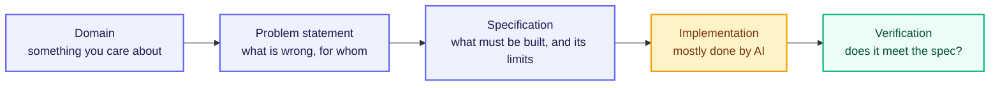
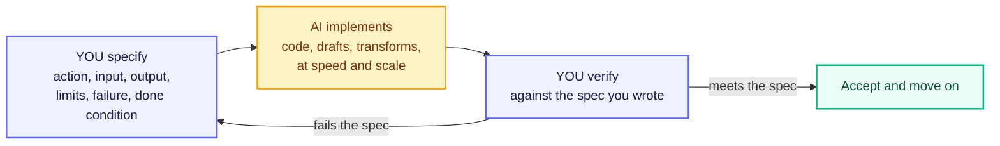
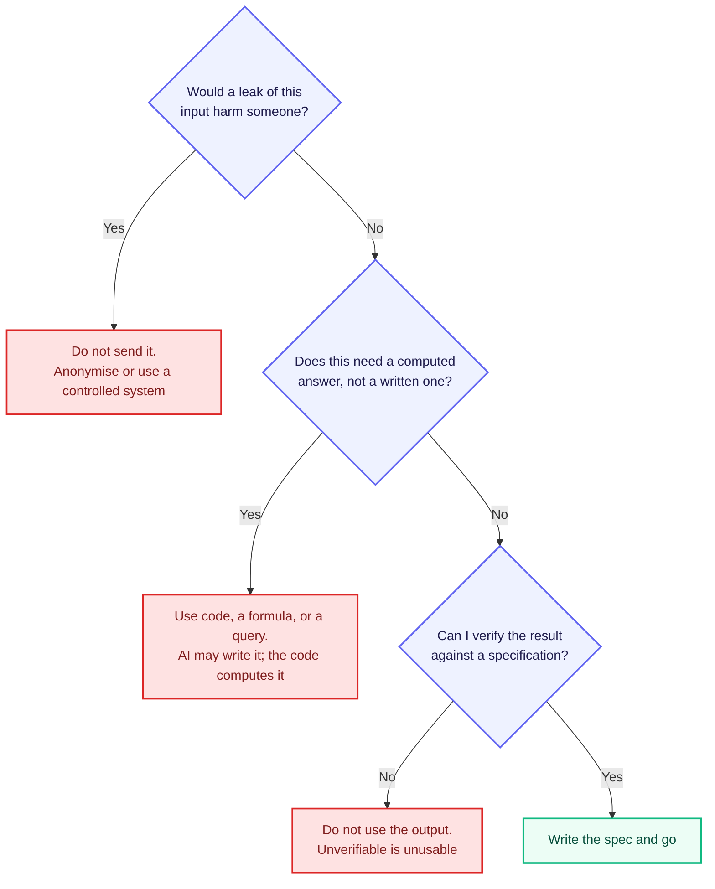

# Specifying for AI

## Learning Objectives

By the end of this unit, you should be able to:

- Pick a real-world domain you actually care about — healthcare, education, transport, banking, or anything else
- Apply decomposition, abstraction, and algorithmic thinking from the previous topics to a real problem in that domain
- Write a clear, focused 3-sentence problem statement
- Tell the difference between a strong, specific problem statement and a vague one
- Explain why getting the problem statement right early makes everything else in this program easier
- Turn that problem statement into a specification that is **testable, bounded, and observable**
- Rewrite a vague instruction like "make it better" into one that can actually be checked
- Apply the **70/30 rule** — AI implements, you specify and verify — and explain why the 30% cannot be handed over
- Recognise the three situations where AI is the wrong tool: privacy, precision, and legal accountability

---

## Overview

You've now covered the core building blocks of computational thinking — breaking problems apart, hiding unnecessary detail, expressing logic clearly, and understanding what makes a proper algorithm. This topic asks you to take all of that and apply it to something personal: **a domain you actually care about.**

Over the next 15 weeks, you'll build toward a Capstone project — a complete, working AI-powered system that you design and build yourself. That project has to start somewhere. It starts here, by choosing a domain and writing a precise **problem statement** before you touch a single line of code or an AI tool.

Why now, before you've even opened Python? Because a vague starting point always leads to a vague product. "I want to build something with AI in healthcare" sounds exciting but means nothing actionable. A sharp, well-scoped problem statement — written with the same discipline you just learned — sets you up to succeed at every later stage.

The unit then takes one more step. A problem statement says what is wrong. It does not yet say what a solution must *do*. Turning "here is the problem" into "here is exactly what to build, and here is how I will check it" is called writing a **specification**, and it is the single most important skill in this entire module — because from here on, most of the implementation work will be done by an AI, and the quality of what you get back is decided almost entirely by the quality of what you asked for.

---

## Choosing Your Domain

A domain is simply an area or industry where a real problem exists — healthcare, banking, education, agriculture, transport, food delivery, or anything else.

You don't need to be an expert. You just need some familiarity or genuine curiosity. Here's how to pick one:

- Pick something you've personally experienced or observed — your own college life, a family member's business, a local community issue
- Prefer domains with real, observable problems — not abstract or theoretical ones
- Good starting areas for BTech freshers: student life and education, UPI and FinTech, healthcare, agriculture, railway booking, food delivery apps, or regional-language AI

The key point: AI-Native Engineers don't build "AI in general." They build AI-powered solutions for a specific problem, for specific users, in a specific context. Your domain gives your learning direction — every new concept from here (specifications, evaluation, agents) becomes easier when you can picture it in a context you actually care about.

---

## Writing a 3-Sentence Problem Statement

A problem statement is a short, precise description of a real problem — written clearly enough that anyone reading it understands exactly what the issue is, who faces it, and why it matters. Crucially, it does **not** describe how you'll solve it. That comes later.

Beginners almost always jump straight to the solution — "I'll build a chatbot!" — without ever clearly stating the problem that chatbot is supposed to solve. Writing the problem first, and forcing it into just three sentences, makes you decompose your idea down to its essential core before you get distracted by implementation.

**The 3-sentence structure:**

- **Sentence 1** — Who faces this problem, and what specifically goes wrong or is difficult for them today?
- **Sentence 2** — Why does this problem matter — what is the cost or consequence of leaving it unsolved?
- **Sentence 3** — What would "solving" this look like in plain terms, without yet mentioning the technology?

### Weak vs Strong — Side by Side

**Weak problem statement:**

> "Students have trouble with their studies. AI can help them learn better. We should build something for this."

This fails the Definite test from the Algorithmic Thinking topic. Which students? What specific difficulty? "Learn better" could mean a thousand different things.

**Strong problem statement:**

> "First-year engineering students in Tier-2 and Tier-3 Indian colleges often struggle to get quick answers to basic doubts outside class hours, since teaching assistants are not always available. This leads many students to either fall behind silently or rely on unverified answers from random online forums. A good solution would let a student ask a doubt in their own words, at any time, and receive an accurate, syllabus-aligned explanation they can actually understand."

Notice how this version applies everything from previous topics:

- **Decomposition** — it narrows "students" down to a specific group and a specific difficulty, not "education in general"
- **Definite language** — no vague words like "better" or "help" without explanation
- **Input / Output framing** — clear input (a student's doubt) and a clear desired output (an accurate, understandable explanation)

### Rules for a Good Problem Statement

- Name a **specific** group of people — not "everyone" or "students" in general
- Describe a **specific, observable** difficulty — not a general dissatisfaction
- Do **not** mention your intended solution or technology — no "using AI, we will build a chatbot that…"
- Keep it to exactly **three sentences** — this constraint forces clarity and prevents rambling

### Common Beginner Mistakes

- Writing a solution statement instead of a problem statement — jumping straight to "I will build an AI chatbot" without stating the actual problem
- Choosing a domain so broad ("healthcare") that a specific problem never gets identified
- Describing a problem no one actually experiences — always ground it in something real and observable

---

## Worked Example — Railway Travel

**Step 1 — Start broad (too vague):**

> "Train travel in India can be improved with AI."

Fails immediately — not decomposed, not definite.

**Step 2 — Decompose "train travel" into specific sub-areas:**

- ticket booking
- platform information
- delays and schedule updates
- luggage safety
- food quality

**Step 3 — Pick one specific, real sub-problem:**

Passengers on waitlisted tickets often don't know their real chances of confirmation and check repeatedly out of anxiety.

**Step 4 — Write the 3-sentence problem statement:**

> "Passengers with waitlisted railway tickets often have no clear sense of whether their ticket will be confirmed, so they repeatedly refresh the IRCTC app out of anxiety in the days before travel. This uncertainty causes unnecessary stress and makes it hard for passengers to plan backup travel options in time. A good solution would give waitlisted passengers a clear, realistic, and regularly updated sense of their confirmation chances well before the journey date."

**Step 5 — Verify against F.D.I.O. from the Algorithmic Thinking topic:**

- **Finite** — scoped to a specific window before the journey date, not open-ended
- **Definite** — names a specific group (waitlisted passengers) and a specific difficulty (no confirmation-chance visibility)
- **Input** — the passenger's ticket status and history are the implied input
- **Output** — a realistic, updated confirmation chance is the clear, expected output

This problem statement is now specific enough to carry forward into the next section, where you'll turn it into a full, testable AI specification.

---

## From Problem Statement to Specification

Read that waitlist problem statement once more and try to hand it to an AI tool as-is. "Give waitlisted passengers a realistic sense of their confirmation chances" — what should the AI actually produce? A percentage? A word like "likely"? For which trains? What should it say when it has no data at all? You cannot answer any of those from the problem statement, which means neither can the AI, which means it will simply invent answers to all three.

That gap is what a specification closes. A **specification** is a precise description of what a solution must do — the action, the input, the output, the limits, and the way you will check it — written before any building starts.

Notice which boxes are yours. The problem statement narrowed the world down to one real difficulty. The specification narrows it down to one buildable, checkable task. Everything you learned in Unit M1.2 feeds straight into this: decomposition tells you which single leaf of your task tree you are specifying, abstraction tells you what the AI does *not* need to know, and F.D.I.O.E. is the sanity check on what you wrote.

A specification is not the same thing as a prompt. But a good prompt is just a specification written in a sentence or two — which is why students who can write specs get dramatically better results out of AI tools than students who cannot.

---

## What Makes a Good Specification

Three properties decide whether a specification will hold up once someone — or something — starts building from it. Remember them as **T.B.O.**

**T — Testable.** You can state in advance what would count as pass and what would count as fail. Somebody else should be able to check the result without asking you what you meant. "Rewrite this to sound professional" is not testable, because two people would judge it differently. "Rewrite this with no exclamation marks and no sentence longer than 20 words" is testable — anyone can check it, including a program.

**B — Bounded.** The specification has edges: a length, a format, a scope, a time limit, a list of inputs it must handle, and an explicit statement of what is out of scope. Boundaries are what stop an AI from confidently wandering off and solving a bigger, different problem than the one you asked about. This is the Finite property from F.D.I.O.E., applied to a task instead of an algorithm.

**O — Observable.** Whatever you are asking for must show up in the output where you can see it. Internal qualities are not observable — you cannot inspect an AI's "understanding" or its "effort". You can only inspect what came out. So specify things that appear in the result: a number in a range, a label from a fixed list, a word count, a required field, a specific refusal message.

| Property | Question it answers | What goes wrong when it is missing |
|---|---|---|
| Testable | "How will I know whether this is right?" | Endless rounds of "hmm, not quite what I wanted" with no way to say why |
| Bounded | "Where does this task start and stop?" | Scope creep — you asked for a summary and got a 900-word essay |
| Observable | "Can I actually see this in the output?" | You judge on vibes, so the same output passes on Monday and fails on Friday |

### The Six Parts of a Specification

In practice a specification has six parts. Here they are, filled in for the railway waitlist problem you just scoped.

| Part | Question it answers | Waitlist example |
|---|---|---|
| Action | What exactly should be done? | Estimate the confirmation chance for one waitlisted ticket |
| Input | What does it receive? | Train number, class, quota, current waitlist position, journey date, and the last 12 months of confirmation history for that train and class |
| Output | What comes back, in what shape? | One percentage from 0 to 100, plus exactly one label: Likely, Uncertain, or Unlikely |
| Limits | What are the boundaries? | Only trains with at least 20 past journeys of history; only journey dates 1 to 30 days ahead; no advice about alternative trains |
| Failure behaviour | What happens when it cannot do the job? | If history is missing or too thin, return "Not enough data" — never a guessed number |
| Done condition | How will I know it worked? | Of 100 past tickets whose real outcome is known, at least 80 of the ones labelled "Likely" actually got confirmed |

Every one of those rows is testable, bounded, and observable. That last row is the one beginners skip and the one that matters most: it is the difference between "I built something" and "I can prove it works."

> **Interview tip:** When an interviewer gives you a vague task, do not start coding. Say "let me first write down the input, the output, the limits, and how I'd verify it." Stating the done condition out loud is the single fastest way to look like someone with real engineering experience.

---

## Bad Spec vs Good Spec

Here is the classic pair, side by side.

**Bad spec:**

> "Make it better."

**Good spec:**

> "Rewrite this paragraph at a Grade 8 reading level, in at most 80 words, keeping every number and name exactly as written."

Run "make it better" through T.B.O. and it fails all three. It is not testable, because "better" has no pass or fail — better for whom, judged how? It is not bounded, because nothing limits the length, the style, or how much of the text may change. And it is not observable, because "better" is a feeling in the reader's head, not something visible in the output. So the AI does what any system does with an under-specified request: it guesses. It might shorten your text, or triple it, or cheerfully rewrite the numbers.

The good version fails none of them. Grade 8 is a measurable reading level. Eighty words is countable. "Numbers and names unchanged" is checkable line by line. Three sentences of care up front replace four rounds of frustrated re-prompting later.

| Vague instruction | Why it fails | Specification you can actually check |
|---|---|---|
| "Make it better" | No pass/fail, no limits, "better" is invisible | "Rewrite at a Grade 8 reading level, max 80 words, keep all numbers and names unchanged" |
| "Summarise this article" | How long? Whose facts? | "Summarise in exactly three bullets, each under 15 words, using only facts stated in the article" |
| "Clean this data" | "Clean" means something different to everyone | "Drop rows where age is blank, negative, or above 120, and report how many rows were dropped" |
| "Write a friendly reply to this complaint" | Unbounded promises, no tone you can measure | "Reply in under 120 words, apologise once, state the refund window as 5–7 working days, and do not offer compensation" |
| "Predict waitlist confirmation" | No output shape, no data floor, no failure path | The six-part specification in the table above |

### Turning a Vague Instruction Into a Spec — Four Moves

You will not always be handed a good specification. Usually you will be handed "make it better" by a client, a manager, or your own brain at 2 AM. Four moves fix it every time.

1. **Name the action with one verb.** Rewrite, summarise, classify, extract, estimate, translate, validate. If you cannot pick one verb, the task is still two tasks — decompose it first.
2. **Name the input and the output shape.** What goes in, and what precisely comes back — a number, a label from a fixed list, three bullets, a JSON field, a file.
3. **Add measurable limits.** Length, reading level, format, allowed values, time, and what is explicitly out of scope.
4. **State the failure behaviour and the done condition.** What should happen when the input is bad or the data is missing, and what test would prove the result is acceptable.

Watch it work on "make the app faster". Move 1: the verb is *reduce*. Move 2: input is the search screen, output is a load time in milliseconds. Move 3: reduce the average search-results load time from 2.5 s to under 1 s, on a 4G connection, without removing any filter option. Move 4: if a search takes longer than 3 s, show a retry option instead of a blank screen; done when 20 test searches all complete under 1 s. Same intention, now buildable and checkable.

### Common Beginner Mistakes

- Specifying the *solution's internals* instead of its behaviour — "use a neural network" tells you nothing about what the output must look like
- Writing limits you cannot check yourself, such as "sound human" or "be creative"
- Forgetting the failure path, so the system invents an answer instead of admitting it has no data — the most dangerous bug in any AI feature
- Leaving out the done condition, which means you can never say the work is finished, only that you are tired of looking at it

---

## The 70/30 Rule

Here is how the work actually splits once AI is in the picture: **the AI does roughly 70% of the implementation, and you keep the 30% that decides whether that 70% is worth anything at all.** Your 30% is specifying and verifying.

You have already seen this split once. The Human vs Machine table in Unit M1.1 showed that a machine can do the work quickly but cannot notice the problem, decide what matters, state the task clearly, or answer for the result. The 70/30 rule is that same table turned into a working habit.

| Stage | Whose job | Why |
|---|---|---|
| Notice the problem, pick the domain | Yours | A model has no stake in anything and no reason to care |
| Write the problem statement | Yours | Requires knowing real users and real consequences |
| Write the specification | Yours | This is where all the judgement lives |
| Write the code, draft, or transformation | AI's | Fast, tireless, and genuinely good at this |
| Verify against the specification | Yours | The AI cannot be the judge of its own output |
| Answer for the result | Yours | Accountability cannot be delegated to software |

Two warnings about the numbers. First, 70/30 describes **effort, not importance**. A wrong specification does not make the output 30% wrong — it makes 100% of it useless, produced very efficiently. Second, the 30% is exactly the part people try hardest to hand over. Asking an AI to write its own specification and then grade its own work is marking your own exam paper: you will get a confident pass every time, and it will mean nothing.

### What "Verify" Actually Means

Verification is not reading the output and feeling satisfied. It is three specific checks against the specification you already wrote:

- **Limits** — does the output respect every boundary? Word count, allowed values, format, things declared out of scope.
- **Failure path** — feed it a bad or empty input on purpose. Does it return your specified failure message, or does it invent something plausible?
- **Confident wrongness** — are any facts, numbers, citations, or function names fabricated? Fluent output is not evidence of correct output, and this failure mode is the reason the whole 30% exists.

If you cannot perform those three checks on a task, you are not supervising the AI — you are trusting it. Which brings us to the tasks where trusting it is not an option.

---

## When NOT to Use AI

An AI-Native Engineer is not someone who uses AI for everything. It is someone who knows exactly where the tool stops working, and reaches for something else there. Three situations are permanent no-go zones.

**Privacy.** Do not put real personal or confidential data into an external AI tool — patient records, Aadhaar or PAN numbers, customer phone numbers, bank statements, passwords, private keys, or unreleased company material. Once it leaves your machine it is outside your control, it may be stored or logged, and there is no un-send. The rule is simple: if a leak of this input would harm a real person or your organisation, it does not go in. Work on anonymised or synthetic samples instead, or keep the data inside systems your organisation actually controls.

**Precision.** Unit M1.1 established that LLMs are probabilistic — they produce the most plausible next thing, not a computed result. So never ask one to *be* the calculator for anything that must be exact: invoice totals, interest and EMI figures, payroll sorting, tax rules, or the exact wording of a law or a syllabus clause. It will hand you a number shaped exactly like a correct answer. The right move is to let the AI write the code, the formula, or the query — and then run that code, because code is deterministic and repeatable in a way the model's own arithmetic is not.

**Legal accountability.** Some decisions require a human who can be held answerable: medical diagnosis, legal advice, loan approvals, hiring rejections, academic submissions, and anything that gets signed. A model cannot be sued, cannot be sacked, and cannot take responsibility. It can draft, summarise, and suggest — but a named human verifies and owns the final call, every time.

| Situation | Why AI is the wrong tool | Do this instead |
|---|---|---|
| Real patient records, Aadhaar/PAN, passwords, unreleased internal data | Leaves your control the moment it is sent; may be retained; cannot be recalled | Use anonymised or synthetic samples; keep real data in controlled systems |
| Invoice totals, EMI and interest, payroll sorting, exact legal or syllabus wording | Probabilistic output gives a plausible number, not a computed one | Use a calculator, formula, database query, or code — have AI write the code, then run it |
| Diagnosis, legal advice, loan and hiring decisions, exam submissions | Responsibility cannot be transferred to software | AI drafts at most; a named human verifies, decides, and signs |

### Three Questions Before You Send Any Task to an AI

That third question is the 30% again, wearing a different hat. If you cannot check the answer, it does not matter how good the answer looks — you have no way to tell the difference between correct and confidently wrong, and neither does anyone reading your work.

---

## Key Takeaways

- Choose a domain you have some familiarity with or genuine curiosity about — healthcare, education, banking, agriculture, transport, and food delivery are all rich with real problems
- A good problem statement describes the **problem, not the solution** — never mention your intended technology in it
- Use exactly **3 sentences**: who + what's difficult, why it matters, what "solved" would look like
- Apply the discipline from this whole unit — decomposition to narrow the problem, definite language to avoid vagueness, F.D.I.O. as a sanity check
- A vague problem statement guarantees a vague and often useless AI solution later — precision here saves enormous effort down the line
- Ground your problem in something real — ideally something you've observed or experienced directly, not a guess
- This problem statement is the seed of your **Capstone project** — the more precise it is now, the smoother the rest of the course will be
- A problem statement says what is wrong; a **specification** says what must be built and how you will check it — you need both, in that order
- Every specification must be **testable, bounded, and observable** (T.B.O.), and should name six things: action, input, output, limits, failure behaviour, and done condition
- "Make it better" is not an instruction. Fix any vague request with four moves: one verb, input and output shape, measurable limits, failure behaviour plus done condition
- The **70/30 rule** — AI implements roughly 70% of the work; you keep the 30% that is specifying and verifying, and that 30% decides whether the other 70% has any value
- Verification means three concrete checks against your spec: limits respected, failure path honoured, nothing confidently fabricated
- Do not use AI for **privacy**-sensitive inputs, for anything requiring exact **precision**, or where **legal accountability** rests on a human — and if you cannot verify an output, do not use it

> **Interview tip:** Being able to clearly articulate "the problem, not just the solution" is one of the most valued skills interviewers look for in junior AI and software engineering roles. Most freshers jump straight to "I'll build a chatbot" — knowing how to define the problem first makes you stand out.

## Labs

**Lab M1.4: Five specifications** — Write five task specifications — one each for health, transport, education, food, and scheduling.

**Lab M1.5: Spec checker** — Write `check_spec(text)` returning `True` if the text has more than five words and contains an action verb; test with three inputs.

**Lab M1.6: Spec scoring** — Score each spec for length, measurable output, and a failure condition; store scores in a dictionary and print the highest-scoring spec.

## References

- [Asana: How to write a problem statement](https://asana.com/resources/problem-solving-strategies)
- [Google PAIR: People + AI Guidebook](https://pair.withgoogle.com/guidebook/)
- [NIST: AI Risk Management Framework](https://www.nist.gov/itl/ai-risk-management-framework)
