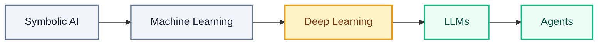

# What AI Is and Isn't

---

A customer named Maria writes to an online bookstore at midnight. "My order still has not arrived and I need it by Friday. Can I get a refund?" Nobody is at the support desk at that hour. A piece of software reads her message, works out what she wants, writes back a warm and accurate reply, checks her order, and starts the refund.

That software is what most people mean when they say **artificial intelligence** — software that carries out tasks we would call intelligent if a person did them, such as reading a message, recognising a face, or writing a reply.

Keep Maria in mind. Her message runs through the whole file: where this technology came from, what happens inside the model while her reply is being written, what it does well, what it gets wrong, and how to tell a real capability from a marketing claim.

## History of AI

AI did not appear the day chatbots became popular. It arrived in five stages across seventy years, and each stage handed more of the thinking to the machine.

Think about teaching a computer to spot a cat in a photo. The first way is to type the rules yourself: pointy ears, whiskers, four legs. That works until a cat curls up and hides its ears. The second way is to show the computer thousands of photos already marked *cat* or *not a cat*, and let it work out the difference on its own. The third way is to state the goal — put all my pet photos in one folder — and let it choose the steps.

Each way asks less of you and hands more of the thinking to the machine. That shift is the whole history of AI in miniature, and it happened in five stages.



Software passed through all five stages, and you can watch Maria's message being handled differently at each one.

- **Symbolic AI** — engineers typed every rule by hand. If the message contains the word "refund", send reply number four. The rules worked when the words matched and broke the moment Maria wrote "money back" instead
- **Machine Learning** — instead of writing rules, engineers show the system many past messages that have already been labelled by topic, and the system works out the pattern itself. Those labelled examples are called **training data**. Now "money back", "refund", and "return my payment" all reach the same place
- **Deep Learning** — machine learning built from **neural networks**, which are layers of simple calculations stacked on top of each other. The layers work out for themselves which parts of the input matter. Handwriting and speech became readable, so Maria can phone the store instead of typing
- **LLMs** — a **Large Language Model** is one very large model trained on an enormous amount of text. A **model** is the finished program that training produces. This one writes Maria's reply from scratch rather than choosing a stored answer. Text a model writes rather than looks up is what people mean by **generative AI**
- **Agents** — an LLM given memory, tools, and a repeating loop, so it can take several steps towards a goal: find Maria's order, check the delivery status, work out the refund, and draft the email

The same thing changed at every stage: how much a person has to spell out. First we wrote the rules. Then we handed over labelled examples and the machine worked out the rules. Now we state the goal and the machine works out the steps.

The LLM sits at the centre of everything you will build, so it is worth opening it up and watching Maria's message travel through it.

## How LLMs Work

An LLM is a program that predicts the next piece of text, over and over, until an answer is complete. Four words explain the whole machine: tokens, training, parameters, and inference.

### Tokens

Think about reading a word you have never seen before, such as *unbelievable*. You do not take it in as one shape. You break it into chunks — un, believ, able — and read the chunks.

A model does the same, and it does it to everything. Before a model reads anything, the text is cut into **tokens**. A token can be a whole word, part of a word, or a single character.

Maria's message is broken up before anything else happens:

```
Message:  Where is my order?
Tokens:   [Where] [ is] [ my] [ order] [?]
Count:    5 tokens
```

Five short pieces, five tokens. Longer and rarer words split into more pieces, so an average email of 200 words becomes somewhere near 260 tokens. This matters for a practical reason: AI services measure and charge by the token, so Maria's message and the reply both carry a cost.

### Training

Think about a fill-in-the-blank game. You read *the cat sat on the ___* and say *mat*. Nobody taught you a rule for that. You have read enough sentences to know which word usually comes next.

**Training** is that game played at an enormous scale. The model is shown huge amounts of text with pieces hidden. It guesses each hidden token, checks its guess against the real one, and nudges its internal numbers a little whenever it was wrong. That loop runs billions of times.

Three things follow from this:

- Training happens once, before anyone uses the model
- It costs a large amount of computing power and electricity
- It produces a finished model that does not change afterwards, so the model learns nothing from your conversation with it

### Parameters

Think about the settings on your phone — screen brightness, volume, font size. Nobody handed you the correct numbers. You slid each one up and down until the screen felt comfortable, and now your phone is tuned to you.

**Parameters** are those dials, and a modern model has billions of them. Training is what sets them. They hold learned patterns, not stored text.

This is the single most important sentence in this file: **there is no filing cabinet inside the model.** The store's returns policy is not in there. When the model states a policy, it is writing text that sounds the way a policy sounds. That is why it can be completely wrong and still read like an official document. The failure has a name — a **hallucination**, an answer that is fluent, confident, and false.

### Inference

Think about typing a message on your phone. You type "see you to" and the keyboard offers "tomorrow" above the keys. Tap it, and it offers the next word, and the next. Your phone is not reading your mind. It is guessing the most likely next word from everything you have typed so far.

**Inference** is what happens when Maria's message reaches the model. The message, together with any instructions you attach to it, is called the **prompt**. The prompt goes in, the model predicts the most likely next token, adds it to the reply, and repeats.


The apology Maria receives was never stored anywhere. It was built one token at a time, each token chosen because it was probable after the tokens before it.

Two consequences follow, and both will shape what you build:

- Send the same message twice and the two replies can differ. The model picks from several likely options each time instead of fetching one fixed answer
- Every model has a **knowledge cutoff**. Its training ended on a particular date, so it knows nothing that happened after that — and it cannot tell that it does not know

A machine that predicts probable text is remarkable at some jobs and hopeless at others. The line between the two is not where most people expect it.

## The Jagged Frontier

Most people assume AI is good at what humans find easy and bad at what humans find hard. It does not work that way. The same assistant writes a polished apology in two seconds and then miscounts the letters in a short word.

Think about a pocket calculator. It multiplies eight-digit numbers faster than anyone in the room, and it cannot tell you whether a sentence sounds rude. Nobody finds that strange, because a calculator obviously has uneven skills. AI has uneven skills too. The difference is that AI *sounds* even — it talks like a person about every subject, so you assume it is equally good at every subject.

Now draw a line around everything AI does well. Inside the line it is excellent; outside it, unreliable. The catch is the shape of that line. It is not a smooth curve you can predict — it cuts in and out, which is why it is called a **jagged frontier**. AI can beat an expert at one task and lose to a ten-year-old at the next, and looking at the task will not tell you which one you have.

The term comes from a 2023 study by Harvard Business School and Boston Consulting Group, run with 758 consultants. On eighteen realistic business tasks that sat inside the frontier, the consultants using AI completed 12.2% more tasks and produced work rated around 40% higher in quality. On a task chosen to sit outside the frontier, the same AI made their answers worse. From the outside, both kinds of task looked equally difficult.

Here is where the bookstore assistant sits on that frontier.

| Task in the support inbox | How the assistant does |
|---|---|
| Draft a warm apology to Maria about the delay | Excellent, in seconds |
| Summarise a 40-page returns policy the store supplies | Excellent |
| Translate the reply into Spanish for another customer | Very good |
| Explain what the refund code on the website does | Very good |
| Count how many times the letter r appears in *strawberry* | Often wrong |
| Work out Maria's exact refund to the cent | Often wrong |
| Quote the store's return window from memory | May hallucinate a convincing number |
| Say where Maria's parcel is right now | Cannot — that happened after training |

### Before the Calculation

Maria bought three books at $12.50, $8.99, and $15.25, with a 15% discount on the order. Ask the assistant for her refund and it answers at once, and with confidence: **$31.24**.

Decide what you expect before reading on. The model predicts text and has no calculator inside it, so a number that is close but not exact is the likely outcome.

Check it yourself. The books come to `12.50 + 8.99 + 15.25 = 36.74`. A 15% discount means Maria pays 85% of that, so `36.74 × 0.85 = 31.229`, which is **$31.23** once money is rounded to cents.

Was that what you expected? The assistant is out by one cent. That sounds harmless until the store issues ten thousand refunds and the accounts stop balancing — and nobody spots it, because the wrong number arrives in exactly the same confident tone as a right one.

The reason for the jaggedness is simple. The model learned the patterns of *language*. Anything shaped like language goes well. Counting characters, exact arithmetic, and today's facts are not language patterns, so they go badly — and they go badly in silence. Test the exact task you care about before you depend on it, because you cannot see the edge of the frontier from the outside.

Knowing where that edge sits also explains which real-world uses of AI have lasted.

## AI Today

Maria got an answer at midnight because a machine wrote the first draft and a human approved the refund in the morning. The machine removed the waiting; the expert kept the deciding. Every use of AI that has lasted follows that same pattern, and three fields show it clearly.

| Field | What the wait used to cost | What AI changed | Who still decides |
|---|---|---|---|
| **Healthcare** | An eye photograph or a chest scan sits for weeks until the nearest specialist visits, and early disease keeps progressing | The photograph is checked within seconds of being taken, so the worrying cases move to the front of the queue instead of the back | A doctor confirms every finding before a patient is told anything |
| **Agriculture** | A farmer waits days for a field visit while a leaf disease spreads across the crop | A photo of one leaf returns a likely cause and a treatment to consider, the same afternoon | The farmer weighs that advice against the field in front of them |
| **Vernacular translation** | A form, a prescription, or a helpline exists only in a language the person cannot read, so they guess or go without | The same words arrive in the language spoken at home, including spoken questions and answers | A person checks anything legal, medical, or financial before it is acted on |

*Vernacular* means the everyday language people actually speak at home rather than the official one a service was written in.

Read the last column again. Not one of these systems removed the expert. Each removed the wait in front of the expert. That is a smaller claim than the headlines make, and a far more useful one.

There is also a gap here, and it is where your own work will come from. Models learn from text that is common on the internet. Widely written languages, mainstream topics, and well-documented industries are served well. Smaller languages, local processes, and specialist trades are served thinly, because there was little text about them to learn from. Those thinly served problems are the ones worth building for.

There is a wide gap between what these systems really do and what is claimed for them. Reading that gap accurately is a professional skill.

## Capability vs Hype

Think about the trailer for a video game. Every shot in it is real footage — captured on the best hardware, at the best moment, by someone who has played that level a hundred times. Nothing in the trailer is a lie, and the game you install still looks different. Treat every AI claim as that trailer, and your own test as the game you actually install.

**What today's AI genuinely does well:** writing and rewriting text, summarising long documents you supply, translating, drafting and explaining code, pulling structure out of messy text, and answering questions from material you hand it.

**What it cannot do, whatever the marketing says:** know anything after its knowledge cutoff, perform reliable exact arithmetic, guarantee that a statement is true, understand meaning the way a person does, remember your last conversation unless someone built that memory around it, or take responsibility for an outcome.

Three claims you will meet, and the honest reading of each:

- *"The assistant understands your customers."* It predicts likely text. There are no beliefs or intentions behind the sentence it wrote to Maria, however human it sounds
- *"AI will replace all programmers."* It writes code quickly. Someone still has to state what the code must do and check that it does it, and that someone answers for the result when it is wrong
- *"This model is 99% accurate."* Accurate on which data, measured how, and what does the remaining 1% look like? A 1% failure rate is fine for suggesting book covers and unacceptable for issuing refunds

One more phrase deserves its own warning. Everything working today is **narrow AI** — a system built and trained for one kind of task, such as handling text or reading medical scans. **Artificial general intelligence (AGI)** would be a single system that picks up any new task the way a person can, without being built for it. It does not exist today. When a product says it is close to AGI, that is an ambition being described, not a feature you can buy.

The accurate summary is unglamorous and useful. Today's AI is a fast, fluent assistant that works from probability, superb inside a jagged frontier and unreliable outside it.

## Best Practices

- Give the model the facts it must not invent. Paste the store's real returns policy into the prompt rather than trusting the model's memory of one
- Keep exact numbers away from the model. Let it draft Maria's email, and let ordinary code calculate the refund figure that goes into it
- Check every output against something you can measure — a policy document, a database record, or a calculation you ran yourself
- Test the specific task before you rely on it. Run twenty real customer messages through the assistant and read every reply
- Keep a person between the model and the customer whenever money, health, or a promise is involved
- Design the path for "I do not know" yourself, so the model has an honest answer available when it has no information

## Common Beginner Mistakes

- Treating a fluent answer as a correct answer. Confidence in the wording tells you nothing about accuracy
- Asking the model for arithmetic, totals, or counts, and accepting the number without checking it
- Trusting a policy, statistic, or source that the model produced from memory, without confirming that it exists
- Assuming the model knows today's date, today's news, or the current status of Maria's parcel
- Testing on three easy examples, seeing three good answers, and concluding the system works
- Believing a demonstration you have watched instead of a test you have run

## Key Takeaways

- **Symbolic AI → Machine Learning → Deep Learning → LLMs → Agents** is one long trend: first a person wrote the rules, then a person supplied the examples, now a person states the goal
- **Tokens** are the pieces text is broken into, **training** sets the model's numbers by predicting hidden tokens, **parameters** are those billions of numbers, and **inference** is the model building a reply one token at a time
- There is no filing cabinet inside a model. It holds patterns, not facts, which is why a **hallucination** sounds exactly like a correct answer
- Every model has a **knowledge cutoff** and cannot tell that it does not know what happened afterwards
- Capability is a **jagged frontier** — excellent at language-shaped work, unreliable at counting, exact arithmetic, quoted sources, and anything recent
- Maria's one-cent refund error is the real risk in miniature: a wrong number that looks right, repeated at scale, with nobody checking
- The uses of AI that last in healthcare, agriculture, and vernacular translation remove the wait, not the expert
- Everything in use today is **narrow AI**, built for one kind of task. **AGI**, a system that picks up any task the way a person can, does not exist
- Judge any AI claim by what it does on your own task in your own test, never by what it is said to do

> **Interview tip:** When you are asked how a language model works, walk through Maria's message from end to end — it is split into tokens, the model predicts the reply one token at a time using parameters shaped during training, and nothing is looked up anywhere. Then name one thing it cannot do, such as calculating her refund to the cent, and explain that you would handle that part in ordinary code instead. Mention hallucination and the knowledge cutoff by name. Candidates who can state a limitation and a fix stand out from those who only say "it is trained on lots of data".

## Reference Links

- 📎 [Google for Developers: What is Machine Learning?](https://developers.google.com/machine-learning/intro-to-ml/what-is-ml)
- 📎 [Google for Developers: What is a Large Language Model?](https://developers.google.com/machine-learning/crash-course/llm/transformers)
- 📎 [AWS: What is Generative AI?](https://aws.amazon.com/what-is/generative-ai/)
- 📎 [Stanford HAI: Brief Definitions of Key Terms in AI](https://hai.stanford.edu/policy/brief-definitions-of-key-terms-in-ai)
- 📎 [Our World in Data: Artificial Intelligence](https://ourworldindata.org/artificial-intelligence)
- 📎 [Stanford HAI: AI Index Report](https://hai.stanford.edu/ai-index)
