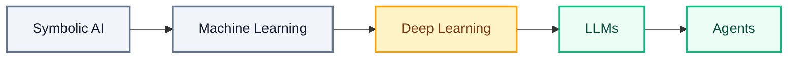

# What AI Is and Isn't

---

A customer named Maria writes to an online bookstore at midnight. "My order still has not arrived and I need it by Friday. Can I get a refund?" Nobody is at the support desk at that hour. A piece of software reads her message, works out what she wants, writes back a warm and accurate reply, checks her order, and starts the refund.

That software is what most people mean when they say **artificial intelligence** — software that carries out tasks we would call intelligent if a person did them, such as reading a message, recognising a face, or writing a reply.

Maria's message stays with you through everything that follows: where this technology came from, what happens inside the model while the reply appears on screen, which tasks it handles better than any human and which it gets wrong in the same confident tone, where it earns its place in real work today, and how to tell a genuine capability from a marketing claim.

## History of AI

AI did not appear the day chatbots became popular. It arrived in five stages across seventy years, and each stage handed more of the thinking to the machine.

Think about how someone learns to cook at home. On day one they follow a recipe line by line and burn anything the recipe forgot to mention. After a few months of watching meals being made, they can copy a dish without opening the recipe. A year later someone says "make something light, it is hot today" and they plan the meal themselves. Each stage gives the cook more freedom and gives you less control over the details.



Software passed through all five stages, and you can watch Maria's message being handled differently at each one.

- **Symbolic AI** — engineers typed every rule by hand. If the message contains the word "refund", send reply number four. The rules worked when the words matched and broke the moment Maria wrote "money back" instead
- **Machine Learning** — instead of writing rules, engineers show the system many past messages that have already been labelled by topic, and the system works out the pattern itself. Those labelled examples are called **training data**. Now "money back", "refund", and "return my payment" all reach the same place
- **Deep Learning** — machine learning built from **neural networks**, which are layers of simple calculations stacked on top of each other. The layers work out for themselves which parts of the input matter. Handwriting and speech became readable, so Maria can phone the store instead of typing
- **LLMs** — a **Large Language Model** is one very large model trained on an enormous amount of text. A **model** is the finished program that training produces. This one writes Maria's reply from scratch rather than choosing a stored answer
- **Agents** — an LLM given memory, tools, and a repeating loop, so it can take several steps towards a goal: find Maria's order, check the delivery status, work out the refund, and draft the email

Read the arrows as one long trend. We moved from writing the rules, to supplying the examples, to naming the goal.

The LLM sits at the centre of everything you will build, so it is worth opening it up and watching Maria's message travel through it.

## How LLMs Work

An LLM is a program that predicts the next piece of text, over and over, until an answer is complete. Four words explain the whole machine: tokens, training, parameters, and inference.

### Tokens

Think about reading a word you have never seen before, such as *unbelievable*. You do not take it in as one shape. You break it into chunks — un, believ, able — and read the chunks.

A model does the same. It never sees letters or whole words. Text is broken into **tokens**, and a token can be a whole word, part of a word, or a single character.

Maria's message is broken up before anything else happens:

```
Message:  Where is my order?
Tokens:   [Where] [ is] [ my] [ order] [?]
Count:    5 tokens
```

Five short pieces, five tokens. Longer and rarer words split into more pieces, so an average email of 200 words becomes somewhere near 260 tokens. This matters for a practical reason: AI services measure and charge by the token, so Maria's message and the reply both carry a cost.

### Training

Think about preparing for an exam by working through ten years of past question papers. You are not memorising those papers. You are picking up how the questions get asked, so a new question feels familiar even though you have never seen it.

**Training** is that reading month at enormous scale. The model is shown vast amounts of text with pieces hidden, and it guesses the hidden tokens. Every wrong guess adjusts its internal numbers a little. Training happens once, consumes an enormous amount of computing power and electricity, and produces a finished model that does not change afterwards.

### Parameters

Think about the settings on your phone — screen brightness, volume, font size. Nobody handed you the correct numbers. You slid each one up and down until the screen felt comfortable, and now your phone is tuned to you.

**Parameters** are those dials, and a modern model has billions of them. Training is what sets them. They hold learned patterns, not stored text.

This is the single most important sentence in this file: **there is no filing cabinet inside the model.** The store's returns policy is not in there. When the model states a policy, it is producing text that fits the pattern of a policy, which is why it can sound authoritative and be entirely wrong. That failure has a name — a **hallucination**, an answer that is fluent, confident, and false.

### Inference

Think about typing a message on your phone. You type "see you to" and the keyboard offers "tomorrow" above the keys. Tap it, and it offers the next word, and the next. Your phone is not reading your mind. It is guessing the most likely next word from everything you have typed so far.

**Inference** is what happens when Maria's message reaches the model. The message, together with any instructions you attach to it, is called the **prompt**. The prompt goes in, the model predicts the most likely next token, adds it to the reply, and repeats.


The apology Maria receives was never stored anywhere. It was built one token at a time, each token chosen because it was probable after the tokens before it.

Two consequences follow, and both will shape what you build. Send the same message twice and the two replies can differ, because the model chooses among likely options instead of looking up a fixed answer. And every model has a **knowledge cutoff** — its training ended on a particular date, so it knows nothing that happened after that and cannot tell that it does not know.

A machine that predicts probable text turns out to be astonishing at some jobs and hopeless at others. The dividing line is not the one most people expect.

## The Jagged Frontier

You cannot work out what AI will be good at by asking how hard the task feels to a human. Capability is not a smooth slope from easy to hard. It is a **jagged frontier**: superhuman on one task, then beaten by a ten-year-old on the next.

The term comes from a 2023 Harvard Business School study of 758 consultants working on eighteen realistic business tasks. Some tasks sat inside the frontier, where AI help improved both speed and quality. Others sat outside it, where the same AI help made results worse — and the tasks looked equally difficult from the outside.

Think about the friend in your class who writes the best essays anyone has read, and still counts on their fingers when the bill has to be split. You would ask them to check your assignment. You would not ask them to work out who owes what.

Here is where the bookstore assistant sits on that frontier.

| Task in the support inbox | How the assistant does |
|---|---|
| Draft a warm apology to Maria about the delay | Excellent, in seconds |
| Summarise a 40-page returns policy the store supplies | Excellent |
| Translate the reply into Spanish for another customer | Very good |
| Explain what the refund code on the website does | Very good |
| Count how many times the letter r appears in *strawberry* | Often wrong |
| Work out Maria's exact refund to the cent | Often wrong |
| Quote the store's return window from memory | May hallucinate a convincing number |
| Say where Maria's parcel is right now | Cannot — that happened after training |

### Before the Calculation

Maria bought three books at $12.50, $8.99, and $15.25, with a 15% discount on the order. Ask the assistant for her refund and it answers at once, and with confidence: **$31.24**.

Decide what you expect before reading on. A model that handles language beautifully has no calculator inside it, so a plausible but slightly wrong number is likely.

Now work it out properly.

**Step 1 — add the three prices.** *(This finds what Maria paid before the discount.)*

```
12.50 + 8.99 + 15.25 = 36.74
```

**Step 2 — take 15% off.** *(A 15% discount means she pays 85% of the total, so multiply by 0.85.)*

```
36.74 × 0.85 = 31.229
```

**Step 3 — round to cents.** *(Money is handled to two decimal places.)*

```
31.229 → 31.23
```

The exact refund is **$31.23**. The assistant said $31.24.

Was that what you expected? The error is one cent, which sounds harmless. Repeat it across ten thousand refunds and the store's accounts stop balancing — and nobody noticed, because the wrong answer arrived in exactly the same confident tone as a right one.

The reason behind the jaggedness is straightforward. The model learned the patterns of *language*. Anything shaped like language goes well. Counting characters, exact arithmetic, and today's facts are not language patterns, so they go badly, and they fail silently. Test the specific task you care about before you depend on it, because the edge of the frontier is invisible from the outside.

Knowing where that edge sits also explains which real-world uses of AI have lasted.

## AI Today

Maria got an answer at midnight because a machine wrote the first draft and a human approved the refund in the morning. That exact pattern — the machine removes the waiting, the expert keeps the deciding — is what the AI uses that survive have in common. Three fields show it clearly.

| Field | What the wait used to cost | What AI changed | Who still decides |
|---|---|---|---|
| **Healthcare** | An eye photograph or a chest scan sits for weeks until the nearest specialist visits, and early disease keeps progressing | The photograph is checked within seconds of being taken, so the worrying cases move to the front of the queue instead of the back | A doctor confirms every finding before a patient is told anything |
| **Agriculture** | A farmer waits days for a field visit while a leaf disease spreads across the crop | A photo of one leaf returns a likely cause and a treatment to consider, the same afternoon | The farmer weighs that advice against the field in front of them |
| **Vernacular translation** | A form, a prescription, or a helpline exists only in a language the person cannot read, so they guess or go without | The same words arrive in the language spoken at home, including spoken questions and answers | A person checks anything legal, medical, or financial before it is acted on |

*Vernacular* means the everyday language people actually speak at home rather than the official one a service was written in.

Read the last column again. Not one of these systems removed the expert. Each removed the wait in front of the expert, which is a smaller claim than the headlines make and a far more useful one.

There is also a gap here, and it is where your own work will come from. Models learn from text that is common on the internet, so widely written languages, mainstream topics, and well-documented industries are served well. Smaller languages, local processes, and specialist trades are served thinly, because there was little text about them to learn from. The problems closest to you and furthest from that training data are the ones worth building for.

Between what these systems really do and what is claimed for them sits a wide gap, and reading it accurately is a professional skill.

## Capability vs Hype

Think about ordering food from a photo on a delivery app. The photo shows a tall burger with fresh leaves falling out of it. What arrives is flatter, smaller, and edible. The photo was not a lie exactly — it was the best possible version, produced under perfect conditions. Treat every AI claim as that photo, and your own test as the meal that turns up.

**What today's AI genuinely does well:** writing and rewriting text, summarising long documents you supply, translating, drafting and explaining code, pulling structure out of messy text, and answering questions from material you hand it.

**What it cannot do, whatever the marketing says:** know anything after its knowledge cutoff, perform reliable exact arithmetic, guarantee that a statement is true, understand meaning the way a person does, remember your last conversation unless someone built that memory around it, or take responsibility for an outcome.

Three claims you will meet, and the honest reading of each:

- *"The assistant understands your customers."* It predicts likely text. There are no beliefs or intentions behind the sentence it wrote to Maria, however human it sounds
- *"AI will replace all programmers."* It writes code quickly. Someone still has to state what the code must do and check that it does it, and that someone answers for the result when it is wrong
- *"This model is 99% accurate."* Accurate on which data, measured how, and what does the remaining 1% look like? A 1% failure rate is fine for suggesting book covers and unacceptable for issuing refunds

The accurate summary is unglamorous and useful. Today's AI is a fast, fluent assistant that works from probability, superb inside a jagged frontier and unreliable outside it.

## Best Practices

- Give the model the facts it must not invent. Paste the store's real returns policy into the prompt rather than trusting the model's memory of one
- Keep exact numbers away from the model. Let it draft Maria's email, and let ordinary code calculate the refund figure that goes into it
- Check every output against something you can measure — a policy document, a database record, or a calculation you ran yourself
- Test the specific task before you rely on it. Run twenty real customer messages through the assistant and read every reply
- Keep a person between the model and the customer whenever money, health, or a promise is involved
- Design the path for "I do not know" yourself, so the model has an honest answer available when it has no information

## Common Beginner Mistakes

- Treating a fluent answer as a correct answer. Confidence in the wording tells you nothing about accuracy
- Asking the model for arithmetic, totals, or counts, and accepting the number without checking it
- Trusting a policy, statistic, or source that the model produced from memory, without confirming that it exists
- Assuming the model knows today's date, today's news, or the current status of Maria's parcel
- Testing on three easy examples, seeing three good answers, and concluding the system works
- Believing a demonstration you have watched instead of a test you have run

## Key Takeaways

- **Symbolic AI → Machine Learning → Deep Learning → LLMs → Agents** is one long trend: we moved from writing the rules, to supplying the examples, to naming the goal
- **Tokens** are the pieces text is broken into, **training** sets the model's numbers by predicting hidden tokens, **parameters** are those billions of numbers, and **inference** is the model building a reply one token at a time
- There is no filing cabinet inside a model. It holds patterns, not facts, which is why a **hallucination** sounds exactly like a correct answer
- Every model has a **knowledge cutoff** and cannot tell that it does not know what happened afterwards
- Capability is a **jagged frontier** — excellent at language-shaped work, unreliable at counting, exact arithmetic, quoted sources, and anything recent
- Maria's one-cent refund error is the real risk in miniature: a wrong number that looks right, repeated at scale, with nobody checking
- The uses of AI that last in healthcare, agriculture, and vernacular translation remove the wait, not the expert
- Judge any AI claim by what it does on your own task in your own test, never by what it is said to do

> **Interview tip:** When you are asked how a language model works, walk through Maria's message from end to end — it is split into tokens, the model predicts the reply one token at a time using parameters shaped during training, and nothing is looked up anywhere. Then name one thing it cannot do, such as calculating her refund to the cent, and explain that you would handle that part in ordinary code instead. Mention hallucination and the knowledge cutoff by name. Candidates who can state a limitation and a fix stand out from those who only say "it is trained on lots of data".

## Reference Links

- 📎 [Google for Developers: What is Machine Learning?](https://developers.google.com/machine-learning/intro-to-ml/what-is-ml)
- 📎 [Google for Developers: What is a Large Language Model?](https://developers.google.com/machine-learning/crash-course/llm/transformers)
- 📎 [AWS: What is Generative AI?](https://aws.amazon.com/what-is/generative-ai/)
- 📎 [Our World in Data: Artificial Intelligence](https://ourworldindata.org/artificial-intelligence)
- 📎 [Stanford HAI: AI Index Report](https://hai.stanford.edu/ai-index)
