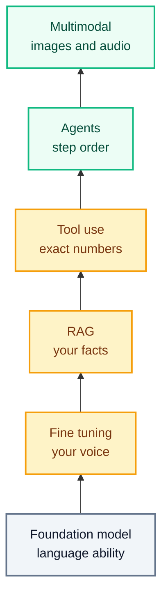
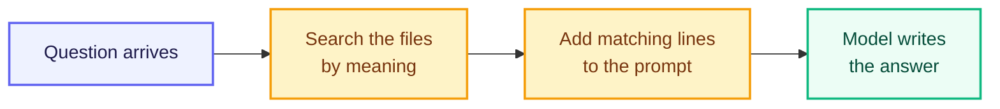
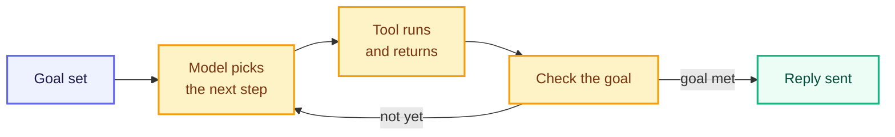

# The 2026 AI Stack

---

A college help desk answers the same questions all year. What do I still owe? When is the deadline? Can I see someone this week? The office closes at five, and most students message it at eleven at night. So the college builds an assistant to answer while the office is shut.

On Thursday evening a student named Alex photographs a fee receipt and sends it with one line underneath: "I paid this. How much do I still owe, and can I meet someone on Saturday?"

That message is harder to answer than it looks. Six separate things have to happen, and each one needs a different kind of help:

- **Read the photograph.** The receipt says $900, paid on 20 March. Alex typed neither number
- **Know this term's fees.** Tuition is $1,200 and the lab fee is $150. Both are in a college file that the office edits when they change
- **Know what Alex has actually paid.** That is not in any document. It is in the payments database, and it changed this morning
- **Check Saturday.** The appointment calendar changes by the hour, so yesterday's answer is worthless
- **Work out the balance to the cent.** The deadline was 15 March, so a 5% late fee applies to whatever is unpaid
- **Write it the way this college writes.** Short, calm, and ending the way every help desk message ends

No single piece of software does all six. Six layers do, each stacked on the one below, and that arrangement is what people mean by the **AI stack**.



Read it from the bottom up. The bottom box comes from a company that could afford to build it, and you pay to use it. Everything above it you assemble yourself, and every step up costs more work, more money, and more that can go wrong than the step below. So real projects climb only as high as their problem forces them to. Most never reach the agent loop at all.

Alex's message is the rare one that needs all six, which is what makes it worth following the whole way up.

## Why the Stack Looks Like This

Ten years ago none of this was normal practice. The order these layers arrived in is what makes this a 2026 stack rather than a 2020 one, and the reason is cost.

The design everything here runs on was published in 2017. Training that first model cost around **$900**. A larger model of the same family in 2019 cost around **$160,000**. By 2023, training GPT-4 was estimated at **$78 million**, and Gemini at **$191 million**.

Those numbers settle the question for everyone else. No college, no small company, and no student project is going to train a model from scratch. The only affordable route is to take a model someone else trained and build on top of it. That is what the word *foundation* was coined in 2021 to describe.

Two other changes brought this within reach of a single office:

- **Retrieval arrived in 2020.** It made it possible to give a model current facts without training it again
- **Running a model became far cheaper.** The price of getting the quality of a leading late-2022 model fell from **$20.00 per million tokens in November 2022 to $0.07 per million tokens by October 2024** — more than 280 times cheaper in about eighteen months

Put those together and the job changed. In 2020, "make it know our fees" meant training something. In 2026 it means assembling layers, and that assembly is the work.

## Foundation Models

Think about a brand-new laptop. It boots, it runs, it can do a thousand different things — and it knows nothing about you. Not your files, not your work, not your habits. It is general on purpose, because it was built for everyone rather than for you.

A **foundation model** is a model trained once, on a very large and broad collection of data, and built so that it can be adapted afterwards to many different jobs. The name was fixed in a 2021 report from Stanford's Center for Research on Foundation Models. The word *foundation* is the important part: it is the thing other things are built on, not the finished building.

Two properties follow from training a model that way.

**Breadth.** One model can read a student message, translate it, summarise a long policy document, and draft code for the booking page. The college does not commission four different models. The expensive part — the training — was done once by someone else, and the cost is spread across everyone who builds on it. This is the whole reason a small organisation can afford AI at all.

**Inheritance.** So many products are built on a handful of foundation models that a weakness in the base passes upward into all of them. The Stanford report treats this as a real risk: any defect in the foundation model is inherited by every application adapted from it. If the base model is unreliable at arithmetic, every product built on it is unreliable at arithmetic, and no clever work in the layers above makes that go away.

So the college starts here. Out of the box, the model reads Alex's sentence correctly and writes clear English. It also knows nothing about this college — not the fees, not the calendar, not the way the office writes to students.

That ignorance is two different problems, and they need two different fixes. The model does not know **how** this college sounds, and it does not know **what** is true inside this college. The first fix changes the model itself.

## Fine-Tuning

Think about your phone keyboard after a few months of use. It suggests the words you actually type — your friends' names, the way you shorten things, the sign-off you always use. Nobody rebuilt the keyboard for you. The same keyboard adjusted itself towards your habits.

**Fine-tuning** does that to a model. It takes a finished foundation model and trains it a little further on a smaller set of examples from your own work. The model has already learned language; this extra training shifts its internal numbers towards the way *you* answer, so its replies come out in your shape without being told each time.

Three facts about it are worth holding on to:

- **It needs far less data than the original training.** A few hundred or a few thousand good examples can be enough, because the model is adjusting a skill it already has rather than learning language from nothing
- **It does not make the model bigger.** A fine-tuned model has exactly the same number of parameters as the model it started from. Nothing is added — existing numbers are nudged
- **There is a cheaper version.** Full fine-tuning adjusts every parameter, which is expensive. **Parameter-efficient tuning** adjusts only a small subset on each round of training, and that is what brings the technique within reach of one college office

The help desk fine-tunes on 400 of its own past replies. The assistant now writes short, calm messages, uses the college's own words — *term*, *late fee*, *add or drop a course* — and ends the way the office ends every message: "Come and see us if anything is unclear."

What it still cannot do is state a fee. Fine-tuning could teach it that the lab fee is $150 — but the day the college changes that figure, the number is wrong inside the model, and the only way to correct it is to train again. Worse, the stale number arrives with no warning attached. The assistant states the old fee with exactly the confidence it would state a correct one.

Facts that change need a layer you can edit instead of retrain.

## RAG

Think about the difference between a closed-book exam and an open-book exam. Closed-book, you answer from memory, and a half-remembered detail comes out sounding as confident as one you actually know. Open-book, you turn to the right page, read the line, and answer from it. Same student, same brain — the difference is having the page in front of you.

**RAG** stands for **Retrieval-Augmented Generation**, and it moves a model from the first situation to the second. Before the model writes anything, the system searches your own documents, pulls out the lines that relate to the question, and puts them into the prompt next to it.

The technique comes from a 2020 research paper by Patrick Lewis and colleagues. Their finding was precise: a language model does hold knowledge inside its parameters, but its ability to reach that knowledge and use it exactly is limited. Their fix was to give the model a second kind of memory — one kept outside the model, searchable at question time and editable at any time, with no retraining involved.

### Why Not Paste Everything?

The obvious shortcut is to paste the whole document folder into every prompt. Two things stop that.

The first is a hard limit called the **context window** — the largest number of tokens a model can take in at once. Everything needed for one answer has to fit inside it: the instructions, the documents, the student's question, and the reply being written. Windows have grown large. Google describes a one-million-token window as about eight full-length English novels, or 50,000 lines of code. It is still a ceiling.

The second is that filling the window costs something even when the text fits. More tokens mean a higher bill and a slower reply, and forty pages of hostel rules do not help the model answer a question about fees. Google's own guidance is blunt about it: if you do not need tokens passed to the model, do not pass them.

Retrieval avoids both problems. Send the four lines that matter instead of the whole folder.

### How It Runs

RAG has one job that is done once and three that happen every time somebody asks something.

**Done once, before the first question arrives.** The fee schedule, the refund policy, and the term dates are broken into small pieces and indexed so they can be searched by meaning rather than by exact words. Nothing about the model changes. This is a filing job, and when a fee is revised later, one person edits that file and every future answer moves with it.

**Then, on every question:**



The middle box is the one the name is built from. Those retrieved lines *augment* the prompt, which is what the A in RAG stands for.

The first box is the one that sounds like magic, so it is worth taking apart. Think about the photo app on your phone. Type *birthday cake* and it finds pictures of birthday cakes, even though you never labelled a single one. It turned every photo into a list of numbers describing what is in it, and it compares those numbers.

Text is handled the same way. Each piece of text is turned into an **embedding**: a list of numbers standing for what the text is about, arranged so that pieces with similar meanings end up with similar numbers. A student who writes "how much is left to pay" therefore reaches the line about an *outstanding balance*, even though not one word matches.

The prompt that finally reaches the model looks like this:

```
Use only the college information below to answer.

COLLEGE INFORMATION
Tuition, spring term:      $1,200
Lab fee, spring term:      $150
Payment deadline:          15 March
Late fee:                  5% of any amount still unpaid after the deadline

STUDENT QUESTION
I paid this. How much do I still owe, and can I meet someone on Saturday?
```

The model was never taught this college's fees and does not need to be. They arrive attached to the question, copied out of a file the office controls.

### Fine-Tuning vs RAG

These two are confused more often than any other pair in the stack, and choosing wrongly wastes weeks of work.

| | Fine-Tuning | RAG |
|---|---|---|
| What it changes | **How** the model answers — tone, format, vocabulary | **What** the model knows while answering |
| What it needs | Hundreds or thousands of example answers | Your documents, kept up to date |
| Cost of a change | Train the model again | Edit a file |
| When it happens | Once, before anyone uses it | On every single message |
| Right use here | Sounding like the college office | This term's fees, deadlines, and policies |
| Wrong use | Teaching fees that change every year | Teaching a writing style |

The short rule: **fine-tune for behaviour, use RAG for facts.**

The prompt above now carries the fee schedule. It still does not carry the two things Alex actually asked about — what Alex has already paid, and whether Saturday is free. Neither of those lives in a document. They live in systems that change by the hour, and reading them means running software.

## Tool Use

Think about what you do when a number matters. You can read, write, and argue a case — and you still open the calculator app to work out 15% of 480, because you want the exact figure rather than a good guess.

**Tool use** is a model doing the same thing: calling ordinary software and using what comes back. The mechanism is simpler than most people expect, and it is worth knowing exactly.

The model is given a list of tools it may call, each with a name and a description of what it does. When the model decides one is needed, **it does not do the work itself**. It writes out a request — the tool's name and the values to pass it. Ordinary code reads that request, runs the real software, and puts the result back into the conversation. The model reads the result and carries on writing. Google's own documentation for this feature says it plainly: the model does not execute the function, your application does.

The usual tools are a search engine, a calculator, a database query, a calendar, and a code runner. What they have in common is being **exact and current**, which is precisely what a model predicting likely text is not.

Answering Alex needs three of them.

| What must be known | Tool called | What comes back |
|---|---|---|
| How much has Alex paid? | Student records database | `payments_received: 900.00` |
| Is Saturday free? | Appointment calendar | `Saturday 10:00 free, 11:30 free` |
| What is still owed? | Calculator | Worked through below |

There is a 2026 detail worth knowing here. Connecting a model to each new tool used to be custom work every time. A shared standard called the **Model Context Protocol (MCP)** now describes tools in a common format, so the same calendar or database can be plugged into different assistants without being rewritten for each one. Its own documentation compares it to a USB-C port for AI applications: one shape of plug, many devices.

### Before the Calculation

The fees and the late fee rule came from the college file. The payment came from the records database. Decide what to expect before the numbers appear: the model writes language well and has no calculator inside it, so this total has to come from a tool rather than from the model.

Alex owes the tuition and the lab fee, minus what has been paid, plus the late fee on whatever is left. That is `1200 + 150 = 1350` owed in total, `1350 − 900 = 450` still unpaid, and a 5% late fee of `450 × 0.05 = 22.50` on that unpaid amount. The answer is **$472.50**.

Was that what you expected? A calculator produced that figure, not the model. The model's contribution was deciding that a calculation was needed, choosing which numbers went into it, and turning the result into a sentence Alex can read. The arithmetic belongs to software that cannot be approximately right.

Three tools have now returned three facts. Something still has to decide which tool to call first, what to do if the calendar comes back full, and when the job is finished.

## Agents

Think about the difference between printed directions and a maps app. Printed directions are written before you leave: turn left, then right, then straight for two miles. Miss one turn and the paper is useless. A maps app decides the next step while you drive. Miss a turn and it works out a new route without anyone writing that route in advance.

An **agent** is the maps app version of software. It is a language model that chooses its own next step, calls a tool, reads the result, and decides again — repeating until the goal is reached or a limit stops it.

The contrast that makes this clear is with a **workflow**, where a programmer fixes the path in advance: look up the fees, then check payments, then check the calendar, then reply. Every message travels the same route in the same order. In an agent, the model directs itself. If the calendar came back full it could offer Monday. If the receipt were unreadable it could ask Alex for a clearer photo. Nobody wrote those branches, and that is the point of the loop.



Only one arrow leaves the loop, and it leaves when the goal is met. Everything else circles back for one more step. Written out, the circling looks like this.

| Step | What the model decides | What comes back |
|---|---|---|
| 1 | Read the receipt in the photo | $900 paid, dated 20 March |
| 2 | Look up this term's fees | Tuition $1,200, lab fee $150 |
| 3 | Check the payment against the records | $900 received, the receipt is genuine |
| 4 | Check the late fee rule | Deadline was 15 March, 5% applies |
| 5 | Calculate what is owed | $472.50 |
| 6 | Check Saturday in the calendar | 10:00 and 11:30 free |
| 7 | Hold the 10:00 slot and reply | Slot reserved, message sent |

Nobody wrote that order in advance. The model produced it one decision at a time, from what each tool returned.

Engineers who build these systems repeat two warnings, and both apply to student projects.

**Add the loop only when it earns its place.** For most tasks, one well-written request with the right documents attached does the job. A loop costs more, runs slower, and is much harder to test. The published advice from teams who build agents is to start with the simplest thing that works and add complexity only when it demonstrably improves the result.

**Errors compound.** A fixed workflow that gets one step wrong produces one wrong answer. An agent that gets one step wrong then makes several more decisions on top of that mistake, and every one of them looks reasonable from the inside. Give every agent a stopping rule and a maximum number of steps, and keep a person in front of anything that cannot be undone — taking a payment, cancelling a booking, or promising something to a student.

Step 1 of that loop hides an assumption. The whole chain begins with the receipt being read, and Alex never typed the amount or the date. Both came out of a photograph.

## Multimodal AI

Think about pointing your phone camera at a sign in a language you do not read, and watching the translation appear on the screen. The phone took in a picture and gave back words. Two different kinds of data, one action.

A **modality** is a type of data. Text is one, images are another, and audio and video are two more. **Multimodal AI** is a system that takes in and produces more than one of them inside a single model, instead of bolting separate programs together.

The difference this makes is in what has to happen before the software can start. A text-only assistant needs a person to look at Alex's photograph and type "receipt for $900, dated 20 March" before anything can be looked up. A multimodal model receives the image itself and produces that description, which is the exact input the next step needs.

The same layer covers everything else students naturally send:

- A voice note recorded while walking to class, because talking is faster than typing
- A photograph of a handwritten note from an office, which was never a digital document at all
- A ten-second screen recording of the payment page failing, which shows in one second what three paragraphs would struggle to describe

### The Stack in One Answer

Six layers, each doing one job, producing one reply on a Thursday evening. The last column is the one students most often miss — some layers are built once, and others run on every single message.

| Layer | Its contribution | When it happens |
|---|---|---|
| Foundation model | Reads the question and writes fluent language | Trained once, by someone else |
| Fine-tuning | Puts the reply in the college's voice | Once, before anyone uses it |
| RAG | Supplies this term's fees, deadline, and late fee rule | Every message |
| Tool use | Reads the payment record and calendar, calculates $472.50 | Every message |
| Agents | Orders the steps and stops once the slot is held | Every message |
| Multimodal | Turns the photograph into the numbers that start the chain | Every message with an image |

Remove any one row and the answer breaks. Without the foundation model there is no language. Without RAG the fee is invented. Without tool use the total is close and wrong. That is what a stack means: layers worth little alone and complete together.

## Choosing the Right Layer

Six layers are easy to list and harder to choose between. In practice you choose by the symptom, not by the technology.

| What is going wrong | Layer that fixes it |
|---|---|
| A stated fact is wrong or out of date | RAG — put the fact in a document and retrieve it |
| The facts are right, but the wording or format is wrong | Fine-tuning |
| A number, total, or date is wrong | Tool use — hand that part to software |
| The task takes several steps, and each step depends on what the last one returned | Agents |
| The input is a photograph, a voice note, or a video | Multimodal |
| Nothing is wrong yet | Nothing — a foundation model and a carefully written prompt |

Most projects need only the first two rows. Reach for an agent last, and only after a simpler version has failed in front of you.

## When a Layer Fails Quietly

Every layer above was shown working. The reason to understand them separately is that they fail separately, and the failures are quiet.

The college raises the lab fee from $150 to $175. The office edits the fee file that evening. Retrieval finds the new line and places it in the prompt. The reply that goes out still says **$150**.

Nothing crashed. Nothing reported an error. Retrieval puts text into the prompt; it cannot force the model to use it. The model saw hundreds of past replies during fine-tuning, learned the old number along with the tone, and reproduced it instead of reading the line in front of it. That is why the sample prompt opens with *Use only the college information below to answer* — that instruction is doing real work, not decoration.

Two more failures of the same quiet kind:

- **A tool returns an error and the model writes around it.** The records database times out. Instead of reporting that, the model produces a sentence that sounds like a payment check. Every tool needs a written answer for the failure case
- **An agent goes wrong at step 1 and stays consistent afterwards.** If the receipt is read as $9.00 instead of $900, the balance, the late fee, and the appointment are all correct for a student who paid $9.00. The reply is coherent from top to bottom and wrong throughout

## Checking That It Works

The help desk keeps 50 past messages alongside the answer that turned out to be right. Every version of the assistant is run against all 50, and three numbers are counted:

- How many amounts match the fee schedule exactly
- How many appointments land on a slot that was genuinely free
- How many replies contain something that appears in no document

A change is kept only when those numbers improve. Testing one layer at a time is what makes a bad number useful. If the amounts are wrong but the tone is right, the fault is in retrieval or the calculator, not in the fine-tuning.

## Best Practices

- Start with the foundation model and one carefully written prompt. Add a layer only when you can show that the current version fails without it
- Use RAG for anything that changes — fees, policies, deadlines — and keep one source file that a single person edits
- Use fine-tuning for how an answer should look and sound, never for facts with a shelf life
- Send every number, date, and lookup to a tool. Let the model decide that a calculation is needed, and let software perform it
- Describe each tool clearly, including what it does, what it needs, and what it returns when it fails. The model chooses tools by reading those descriptions
- Give an agent a stopping rule and a maximum number of steps before you run it once
- Keep a person in front of anything irreversible — payments, cancellations, and messages that make a promise
- Tell the model in the prompt to answer only from the information supplied, then check that it obeys by changing a fact on purpose and seeing whether the answer follows
- Decide what personal data leaves your own systems. Photographs, phone numbers, and student records sent to an outside model are beyond your control once they go, so send only what the answer needs
- Test each layer on its own before combining them, so a wrong answer tells you which layer produced it

## Common Beginner Mistakes

- Fine-tuning a model to teach it facts, then repeating the whole process every time a fee changes
- Building an agent when a single request with the right document attached would have answered the question
- Accepting a number the model wrote itself, because it looked reasonable, instead of calling a calculator
- Letting the documents behind RAG go stale, so the assistant quotes last year's fee with complete confidence
- Running an agent with no step limit, then paying for a loop that never decided it was finished
- Assuming a weakness in the foundation model disappears in the product built on top of it
- Testing with one clear photo and one polite sentence, then meeting a blurred photo and an angry two-line complaint

## Key Takeaways

- Nobody outside a handful of laboratories trains a foundation model. Training costs ran from about $900 for the 2017 design to an estimated $78 million for GPT-4 and $191 million for Gemini, so building with AI means assembling layers on a model somebody else paid for
- Running a model became more than 280 times cheaper between late 2022 and late 2024, which is what brought this within reach of a single college office
- A **foundation model** is trained once on broad data at great cost and adapted afterwards to many jobs, and its weaknesses are inherited by everything built on top of it
- **Fine-tuning** trains that model further on a few hundred or few thousand of your own examples, changing **how** it answers while keeping the same number of parameters
- **Parameter-efficient tuning** adjusts only a subset of those parameters, which is what makes the technique affordable
- **RAG** searches your documents at question time and adds the matching lines to the prompt, changing **what** the model knows without retraining it
- Fine-tune for **behaviour**, use RAG for **facts** — this one distinction saves weeks of wasted work
- Fine-tuning happens once, before anyone uses the assistant. RAG, tools, and the agent loop run again on every single message
- The **context window** is the largest number of tokens a model can take in at once, which is why retrieval sends the few lines that matter rather than the whole folder
- An **embedding** turns text into numbers arranged so that similar meanings sit close together, which is how a search for "how much is left to pay" finds a line about an outstanding balance
- Retrieval places text in the prompt but cannot force the model to use it, so instruct it to answer only from the supplied information and test that by changing a fact on purpose
- **Tool use** means the model writes a request, ordinary software runs it, and the exact result comes back into the conversation. The model never runs the tool itself
- An **agent** repeats a loop of choosing a step, running a tool, and checking the goal, while a workflow follows a path fixed in advance by a programmer
- Agents cost more and compound their own mistakes, so they need a stopping rule, a step limit, and a person in front of anything irreversible
- **Multimodal AI** handles text, images, audio, and video in one model, which removes the person who would otherwise have to describe the picture first

> **Interview tip:** Asked to describe an AI system you would build, walk through one message layer by layer — a photograph read by a multimodal model, a fee supplied by RAG instead of the model's memory, a total produced by a calculator tool, and an agent deciding the order of the steps. Then name the layer you would leave out and say why. Explaining that fine-tuning is the wrong tool for changing fees, and RAG is the right one, is the answer that separates candidates who have built something from candidates who have read about it.

## Reference Links

- 📎 [Stanford CRFM: On the Opportunities and Risks of Foundation Models](https://arxiv.org/abs/2108.07258)
- 📎 [Stanford HAI: Inside the New AI Index — model training costs](https://hai.stanford.edu/news/inside-new-ai-index-expensive-new-models-targeted-investments-and-more)
- 📎 [Stanford HAI: AI Index 2025, Research and Development chapter](https://hai.stanford.edu/ai-index/2025-ai-index-report/research-and-development)
- 📎 [Google for Developers: Fine-tuning a Large Language Model](https://developers.google.com/machine-learning/crash-course/llm/tuning)
- 📎 [Google for Developers: Embeddings](https://developers.google.com/machine-learning/crash-course/embeddings)
- 📎 [Google AI for Developers: Long context and context windows](https://ai.google.dev/gemini-api/docs/long-context)
- 📎 [Google AI for Developers: Function calling](https://ai.google.dev/gemini-api/docs/function-calling)
- 📎 [Google AI for Developers: Image understanding](https://ai.google.dev/gemini-api/docs/image-understanding)
- 📎 [Lewis et al.: Retrieval-Augmented Generation for Knowledge-Intensive NLP Tasks](https://arxiv.org/abs/2005.11401)
- 📎 [AWS: What is Retrieval-Augmented Generation?](https://aws.amazon.com/what-is/retrieval-augmented-generation/)
- 📎 [Anthropic: Building Effective Agents](https://www.anthropic.com/engineering/building-effective-agents)
- 📎 [Model Context Protocol: Introduction](https://modelcontextprotocol.io/docs/getting-started/intro)
