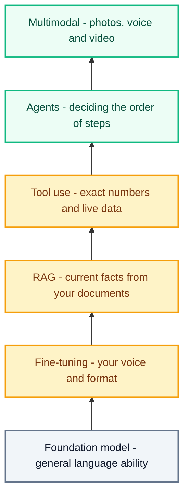
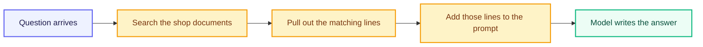
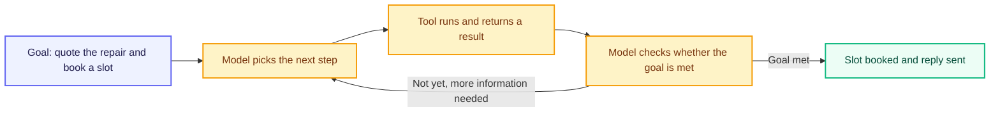

# The 2026 AI Stack

---

A bicycle repair shop on a busy street keeps losing customers to the phone. People call while the mechanic is under a bike, nobody picks up, and the customer books somewhere else. So the shop decides to build an assistant that answers messages.

On Thursday evening a customer named Alex sends it a photo of a snapped brake cable with one line underneath: "How much to fix this, and can you do it on Saturday?"

That single message is harder to answer than it looks. The assistant has to see what is in the photo, know what this shop charges today, find out whether the part is in the drawer, check whether Saturday has a free slot, work out the total, and write it all in the shop's own voice. No single piece of software does those six things. Six different layers do, stacked on top of one another, and that arrangement is what people mean by the **AI stack**.



Read it from the bottom up. Each layer sits on the one below and adds something the layers underneath cannot do alone.

## Why the Stack Looks Like This

None of these layers was standard practice ten years ago. The order in which they arrived is what makes this a 2026 stack rather than a 2020 one, and the reason comes down to cost.

The architecture that all of this runs on was published in 2017. Training that first model cost around **$900**. A larger model of the same family in 2019 cost around **$160,000**. By 2023, training GPT-4 was estimated at **$78 million**, and Gemini at **$191 million**.

Those numbers decide everything. No repair shop, no college, and no small company is ever going to train a model of its own. The only affordable path is to take a model somebody else trained and build layers on top of it — which is exactly what the word *foundation* was coined in 2021 to describe.

Two further changes opened the door to a shop this size. Retrieval, published in 2020, made it possible to give a model current facts without retraining it. And using a model became dramatically cheaper: the price of performance equal to a leading late-2022 model fell from **$20.00 per million tokens in November 2022 to $0.07 per million tokens by October 2024**. Answering a customer went from a cost worth thinking about to a rounding error.

Put those together and the job changed. In 2020, "make it know our prices" meant training something. Today it means assembling layers, and that assembly is what the work now consists of.

## Foundation Models

A **foundation model** is a model trained once, on a very large and broad collection of data, and built so that it can be adapted afterwards to many different jobs. The name was fixed in a 2021 report from Stanford's Center for Research on Foundation Models, and the word *foundation* is the important part: it is the thing other things are built on, not the finished building.

Two properties follow from being trained that way, and both matter to the shop.

The first is **breadth**. One model can read a customer message, translate it, summarise a supplier's email, and draft code for the booking page. The shop does not commission four different models, and this is the whole reason a small business can afford AI at all. The expensive part — the training — was done once by someone else, and the cost is spread across everyone who builds on it.

The second is **inheritance**. Because so many products are built on a handful of foundation models, a weakness in the base passes into everything above it. The Stanford report calls this *homogenisation* and treats it as a genuine risk: the defects of the foundation model are inherited by every application adapted from it. If the base model is unreliable at arithmetic, every business using it is unreliable at arithmetic, and no amount of clever work in the layers above makes that disappear.

So the shop starts here. Out of the box, the model reads Alex's sentence correctly and writes fluent English. It also knows nothing whatsoever about this shop — not the prices, not the calendar, not the way the owner writes.

That ignorance comes in two separate kinds, and they need two separate fixes. The model does not know **how** this shop sounds, and it does not know **what** is true inside this shop. The first fix is a change to the model itself.

## Fine-Tuning

**Fine-tuning** takes a finished foundation model and trains it a little further on a smaller set of examples from your own work. The model has already learned language; this extra training shifts its internal numbers towards the way *you* answer, so its replies come out in your shape without being told each time.

Three facts about it are worth holding on to.

It needs far less data than the original training. A few hundred or a few thousand good examples can be enough, because the model is adjusting an existing skill rather than acquiring language from nothing.

It does not make the model bigger. A fine-tuned model has exactly the same number of parameters as the foundation model it started from. Nothing is added — existing numbers are nudged.

There is a cheaper version. Full fine-tuning adjusts every parameter, which is costly. **Parameter-efficient tuning** adjusts only a small subset on each round of training, which is what brings the technique within reach of a business the size of one repair shop.

The shop fine-tunes on 400 of its own past conversations. The assistant now writes short, calm replies, uses *cable*, *bleed*, and *true the wheel* the way a mechanic does, and signs off with "ride safe".

What it still cannot do is quote a price. Fine-tuning could teach it that a brake cable costs $6.50 — but the moment the supplier raises the price, that number is wrong inside the model, and the only way to correct it is to train again. Worse, a stale fact produces no warning: the assistant states the old price with exactly the confidence it would state a correct one. Facts that change need a layer that can be edited rather than retrained.

## RAG

Consider the difference between a closed-book exam and an open-book exam. Closed-book, you answer from memory, and a half-remembered detail comes out sounding as confident as one you actually know. Open-book, you turn to the correct page, read the line, and answer from it.

**RAG** stands for **Retrieval-Augmented Generation**, and it moves a model from the first situation to the second. Before the model writes anything, the system searches the shop's own documents, pulls out the lines that relate to the question, and places them into the prompt next to it.

The technique comes from a 2020 research paper by Patrick Lewis and colleagues. Their finding was precise: a language model does store knowledge inside its parameters, but its ability to access that knowledge and handle it exactly is limited. Their answer was to give the model a second kind of memory — one held outside the model, which can be searched at question time and updated at any time without retraining.

### Why Not Paste Everything?

The obvious shortcut is to paste the shop's whole folder into every prompt. Two things stop that.

The first is a hard limit called the **context window** — the maximum number of tokens a model can take in at once. Everything needed for one answer has to fit inside it: the instructions, the documents, the customer's question, and the reply being written. Windows have grown large, and a big one today holds roughly eight full-length novels, but it is still a ceiling.

The second is that filling the window costs something even when the text fits. More tokens mean a higher bill and a slower reply, and forty pages of service notes about wheel bearings do not help the model answer a question about a brake cable. Google's own guidance on the point is blunt: if you do not need tokens passed to the model, do not pass them.

Retrieval is the alternative to both problems. Send the four lines that matter instead of the whole folder.

### How It Runs

In practice RAG runs in four steps.

1. **Prepare the documents.** The shop's price list, warranty terms, and service notes are broken into small pieces and indexed so they can be searched by meaning rather than by exact words
2. **Search with the question.** Alex's question is matched against that index, and the closest pieces come back — the cable price, the labour rate, the warranty line

   Searching by meaning works because each piece of text is first turned into an **embedding**: a list of numbers standing for what the text is about, arranged so that pieces with similar meanings end up with similar numbers. A customer who writes "brake wire" therefore reaches the line about a brake *cable*, even though not one word matches
3. **Augment the prompt.** Those pieces are pasted into the prompt above the question. This is the step the name refers to
4. **Keep the source current.** When the supplier raises the price, the owner edits one file, and every future answer changes with it



The prompt that finally reaches the model looks like this:

```
Use only the shop information below to answer.

SHOP INFORMATION
Brake cable (standard):        $6.50
Labour, cable replacement:     30 minutes
Labour rate:                   $24.00 per hour
Warranty: all cable work covered for 90 days

CUSTOMER QUESTION
How much to fix this, and can you do it on Saturday?
```

The model was never taught the shop's prices and does not need to be. They arrive attached to the question, copied out of a file the owner controls.

### Fine-Tuning vs RAG

These two are confused more often than any other pair in the stack, and choosing wrongly wastes weeks of work.

| | Fine-Tuning | RAG |
|---|---|---|
| What it changes | **How** the model answers — tone, format, vocabulary, task | **What** the model knows while answering |
| What it needs | Hundreds or thousands of example answers | Your documents, kept up to date |
| Cost of a change | Train the model again | Edit a file |
| Right use here | Sounding like the shop, signing off with "ride safe" | Today's price, the labour rate, the warranty terms |
| Wrong use | Teaching prices that change every month | Teaching a writing style |

The short rule: **fine-tune for behaviour, use RAG for facts.**

The prompt above now carries the price. It does not carry the two things Alex actually asked about — whether the part is in the drawer this evening, and whether Saturday is free. Neither of those lives in a document. They live in systems that change minute by minute, and reading them means running software.

## Tool Use

**Tool use** is a model calling ordinary software and using what comes back. The mechanism is worth understanding exactly, because it is simpler than most students expect.

The model is given a list of tools it may call, each with a name and a description of what it does. When the model decides one is needed, it does not perform the work. It writes out a request — the tool's name and the values to pass it. Ordinary code runs that request, and the result is placed back into the conversation. The model reads the result and carries on writing.

The common tools are a search engine, a calculator, a database query, a calendar, and a code runner that executes real code. What they share is being **exact and current**, which is precisely what a model predicting likely text is not.

Answering Alex needs three of them.

| What must be known | Tool called | What comes back |
|---|---|---|
| Is a standard brake cable in stock? | Stock database | `cable_standard: 7 units` |
| Is Saturday free? | Booking calendar | `Saturday 10:00 — free; 11:30 — free` |
| What does the repair cost? | Calculator | Worked through below |

### Before the Calculation

The part price and labour rate came out of the shop file. Decide what to expect before the numbers appear: a system that writes well has no calculator inside it, so this total has to be produced by a tool rather than by the model.

**Step 1 — the part.** *(The price of the cable itself, read from the shop file.)*

```
Brake cable = $6.50
```

**Step 2 — the labour.** *(The job takes 30 minutes. Thirty minutes is half an hour, so the shop charges half of its hourly rate.)*

```
$24.00 × 0.5 = $12.00
```

**Step 3 — add them.** *(Parts plus labour gives the figure the customer is quoted.)*

```
6.50 + 12.00 = 18.50
```

The quote is **$18.50**, and a calculator produced it. Was that what you expected? The model's contribution was deciding that a calculation was needed and turning the result into a sentence Alex can read. The arithmetic belongs to software that cannot be approximately right.

Three tools have returned three facts. Something still has to decide which tool to call first, what to do if the calendar comes back full, and when the job is finished.

## Agents

An **agent** is a language model that chooses its own next step, calls a tool, reads the result, and decides again — repeating until the goal is reached or a limit stops it.

The contrast that makes this clear is with a **workflow**. In a workflow, a programmer writes the path in advance: look up the price, then check stock, then check the calendar, then reply. Every message travels the same route in the same order. In an agent, the model directs itself. If the cable were out of stock it could check the supplier instead. If Saturday were full it could offer Sunday. Nobody wrote those branches, and that is the point of the loop.



Only one arrow leaves the loop, and it leaves when the goal is met. Everything else circles back for one more step. Written out, the circling looks like this.

| Step | What the model decides | What comes back |
|---|---|---|
| 1 | Identify the part in the photo | Standard brake cable |
| 2 | Look up its price | $6.50, labour 30 minutes |
| 3 | Check the stock database | 7 units available |
| 4 | Check Saturday in the calendar | 10:00 and 11:30 free |
| 5 | Calculate the total | $18.50 |
| 6 | Hold the 10:00 slot | Slot reserved |
| 7 | Goal met — write the reply | Message sent |

Nobody wrote that order in advance. The model produced it, one decision at a time, from what each tool returned.

Engineers who build these systems repeat two warnings, and both apply to student projects.

**Add the loop only when it earns its place.** For most tasks, one well-written request with the right documents attached does the job. A loop costs more, runs slower, and is far harder to test. Complexity is worth adding only when you can show that the simpler version fails.

**Errors compound.** A fixed workflow that misreads one step produces one wrong answer. An agent that misreads one step then makes several more decisions on top of that mistake, and each one looks reasonable from the inside. Give every agent a stopping rule and a maximum number of steps, and keep a person in front of anything that cannot be undone — taking a payment, cancelling a booking, or sending a promise to a customer.

Step 1 of that loop hides an assumption. The whole chain begins with the part being identified, and Alex never typed the words "brake cable". The words came from a photograph.

## Multimodal AI

A **modality** is a type of data. Words are one modality, images are another, and sound and video are two more. **Multimodal AI** is a system that takes in and produces more than one of them inside a single model, rather than bolting separate programs together.

The difference this makes is in what has to happen before the software can start. A text-only assistant needs a person to look at Alex's photograph and type "snapped standard brake cable" before anything can be looked up. A multimodal model receives the image itself and produces the description — standard brake cable, outer casing intact, inner wire snapped near the lever — which is the exact phrase the price lookup then uses.

The same layer covers everything else customers naturally send. A voice note recorded while walking home, because typing is slower than speaking. A photograph of a handwritten receipt for a warranty claim. A ten-second video of a wheel wobbling as it turns, which shows in one second what three paragraphs would struggle to describe.

### The Stack in One Answer

Six layers, each doing one job, producing one reply on a Thursday evening:

| Layer | Its contribution |
|---|---|
| Foundation model | Reads the question and writes fluent language |
| Fine-tuning | Puts the reply in the shop's voice, ending with "ride safe" |
| RAG | Supplies the current price, labour rate, and warranty terms |
| Tool use | Reads the stock drawer and the calendar, and calculates $18.50 |
| Agents | Orders the steps and stops once the slot is held |
| Multimodal AI | Turns the photograph into the part name that starts the chain |

Remove any one row and the answer breaks. Without the foundation model there is no language. Without RAG the price is invented. Without tool use the total is close and wrong. That is what a stack means: layers worth little alone and complete together.

## Choosing the Right Layer

Six layers are easy to list and harder to choose between. In practice the choice is made by the symptom, not by the technology.

| What is going wrong | Layer that fixes it |
|---|---|
| A stated fact is wrong or out of date | RAG — put the fact in a document and retrieve it |
| The facts are right, but the wording or format is wrong | Fine-tuning |
| A number, total, or date is wrong | Tool use — hand that part to software |
| The task takes several steps, and each step depends on what the last one returned | Agents |
| The input is a photograph, a voice note, or a video | Multimodal |
| Nothing is wrong yet | Nothing — a foundation model and a careful prompt |

Most projects need only the first two rows. Reach for an agent last, and only after a simpler version has failed in front of you.

## When a Layer Fails Quietly

Every layer above was shown working. The reason to understand them separately is that they fail separately, and the failures are quiet.

The supplier raises the cable to $7.25. The owner edits the price file that evening. Retrieval finds the new line and places it in the prompt. The reply that goes out still says **$6.50**.

Nothing crashed, and nothing reported an error. Retrieval puts text into the prompt; it does not force the model to use it. Having seen hundreds of the shop's past conversations during fine-tuning, the model reproduced the number it had learned instead of reading the number in front of it. That is why the sample prompt opens with the line *Use only the shop information below to answer* — the instruction is doing real work, not decoration.

Two more failures of the same quiet kind:

- **A tool returns an error and the model writes around it.** The stock database times out, and rather than reporting that, the model produces a sentence that sounds like a stock check. Every tool needs an explicit answer for the failure case
- **An agent goes wrong at step 2 and stays consistent afterwards.** If the photograph is read as a gear cable, the price, the stock check, and the booking are all correct for a gear cable. The reply is coherent from top to bottom and wrong throughout

## Checking That It Works

The shop keeps 50 past messages alongside the answer that turned out to be right. Every version of the assistant is run against all 50, and three numbers are counted: how many quotes match the price list exactly, how many bookings land on a slot that was genuinely free, and how many replies contain something that appears in no document.

A change is kept only when those numbers improve. Testing one layer at a time is what makes a bad number useful — if the quotes are wrong but the tone is right, the fault is in retrieval or the calculator, not in the fine-tuning.

## Best Practices

- Start with the foundation model and one carefully written prompt. Add a layer only when you can demonstrate that the current version fails without it
- Use RAG for anything that changes — prices, policies, schedules — and keep one source file that a single person edits
- Use fine-tuning for how an answer should look and sound, never for facts with a shelf life
- Send every number, date, and lookup to a tool. Let the model decide that a calculation is needed, and let software perform it
- Give an agent a stopping rule and a maximum number of steps before you run it once
- Keep a person in front of anything irreversible — payments, cancellations, and messages that make a promise
- Tell the model in the prompt to answer only from the information supplied, and check that instruction is obeyed by changing a fact on purpose and seeing whether the answer follows
- Decide what customer data leaves your own systems. Photographs, phone numbers, and addresses sent to an outside model are beyond your control once they go, so send only what the answer needs
- Test each layer on its own before combining them, so that a wrong answer tells you which layer produced it

## Common Beginner Mistakes

- Fine-tuning a model to teach it facts, then repeating the whole process every time a price changes
- Building an agent when a single request with the right document attached would have answered the question
- Accepting a number the model wrote itself, because it looked reasonable, instead of calling a calculator
- Letting the documents behind RAG go stale, so the assistant quotes last year's rate with complete confidence
- Running an agent with no step limit, then paying for a loop that never decided it was finished
- Assuming a weakness in the foundation model disappears in the product built on top of it
- Testing with one clear photo and one polite sentence, then meeting a blurred photo and an angry two-line complaint

## Key Takeaways

- Nobody outside a handful of laboratories trains a foundation model. Training costs ran from about $900 for the 2017 architecture to an estimated $78 million for GPT-4 and $191 million for Gemini, so building with AI means assembling layers on a model somebody else paid for
- Using a model became roughly three hundred times cheaper between late 2022 and late 2024, which is what brought this within reach of a business the size of one repair shop
- A **foundation model** is trained once on broad data at great cost and adapted afterwards to many jobs, and its weaknesses are inherited by everything built on top of it
- **Fine-tuning** trains that model further on a few hundred or few thousand of your own examples, changing **how** it answers while keeping the same number of parameters
- **Parameter-efficient tuning** adjusts only a subset of those parameters, which is what makes the technique affordable
- **RAG** searches your documents at question time and adds the matching lines to the prompt, changing **what** the model knows without retraining it
- Fine-tune for **behaviour**, use RAG for **facts** — this single distinction saves weeks of wasted work
- The **context window** is the maximum number of tokens a model can take in at once, which is why retrieval sends the few lines that matter rather than the whole folder
- An **embedding** turns text into numbers arranged so that similar meanings sit close together, which is how a search for "brake wire" finds a line about a brake cable
- Retrieval places text in the prompt but cannot force the model to use it, so instruct it to answer only from the supplied information and test that by changing a fact on purpose
- **Tool use** means the model writes a request, ordinary software runs it, and the exact result returns to the conversation — the way to get arithmetic, stock levels, and today's calendar right
- An **agent** repeats a loop of choosing a step, running a tool, and checking the goal, while a workflow follows a path fixed in advance by a programmer
- Agents cost more and compound their own mistakes, so they need a stopping rule, a step limit, and a person in front of anything irreversible
- **Multimodal AI** handles text, images, audio, and video in one model, which removes the person who would otherwise have to describe the picture first

> **Interview tip:** Asked to describe an AI system you would build, walk through one customer message layer by layer — a photograph read by a multimodal model, a price supplied by RAG instead of the model's memory, a total produced by a calculator tool, and an agent deciding the order of the steps. Then name the layer you would leave out and say why. Explaining that fine-tuning is the wrong tool for changing prices, and RAG is the right one, is the answer that separates candidates who have built something from candidates who have read about it.

## Reference Links

- 📎 [Stanford CRFM: On the Opportunities and Risks of Foundation Models](https://arxiv.org/abs/2108.07258)
- 📎 [Stanford HAI: Inside the New AI Index — model training costs](https://hai.stanford.edu/news/inside-new-ai-index-expensive-new-models-targeted-investments-and-more)
- 📎 [Google for Developers: Fine-tuning a Large Language Model](https://developers.google.com/machine-learning/crash-course/llm/tuning)
- 📎 [Google for Developers: Embeddings](https://developers.google.com/machine-learning/crash-course/embeddings)
- 📎 [Google AI for Developers: Long context and context windows](https://ai.google.dev/gemini-api/docs/long-context)
- 📎 [Lewis et al.: Retrieval-Augmented Generation for Knowledge-Intensive NLP Tasks](https://arxiv.org/abs/2005.11401)
- 📎 [AWS: What is Retrieval-Augmented Generation?](https://aws.amazon.com/what-is/retrieval-augmented-generation/)
- 📎 [Anthropic: Building Effective Agents](https://www.anthropic.com/engineering/building-effective-agents)
- 📎 [Google Cloud: Multimodal AI](https://cloud.google.com/use-cases/multimodal-ai)
