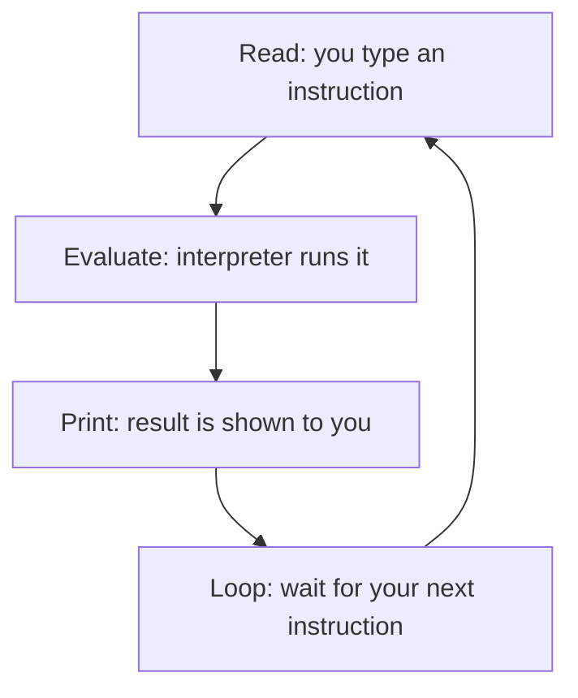
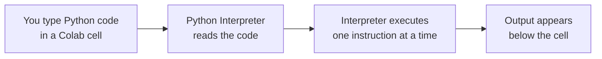

# The Python Environment

---

[Go back to TOC](../../README.md) | [Next: 1.2 Variables, Identifiers & Types →](unit-1-2-variables-identifiers-types.md)

## 1. Learning Objectives

By the end of this unit, you will be able to:

- **Explain** why Python is one of the most widely used languages in the software industry today, especially for AI and data-driven work.
- **Differentiate** between a compiled language and an interpreted language, and describe how each one turns your code into a running program.
- **Describe** what an interpreter does and what "interactive mode" (the REPL) means.
- **Identify** the parts of Google Colab — notebooks, cells, and the runtime — and explain what each one is for.
- **Implement** your first Python program using the `print()` function and read its output correctly.
- **Debug** a simple "cell didn't run" or "stuck runtime" situation by applying the restart-and-rerun habit.

---

## 2. Overview

Imagine you have just joined your first software job. Before you write a single line of business logic, you need two things: a language to write instructions in, and a place to actually run those instructions and see what happens. This unit is about exactly that — nothing more, nothing less.

The language you will learn is **Python**. It is the single most in-demand language in the Indian and global IT industry right now, used everywhere from banking backends to UPI-based payment apps to AI systems. The place you will run it is **Google Colab**, a free tool that runs Python inside your browser — no installation, no setup, no "it works on my machine" headaches on day one.

As a fresher, it is tempting to skip straight to "writing programs." But every experienced engineer will tell you the same thing: if you don't understand *how* your code actually gets executed by the machine, you will spend your entire career debugging blind. So before you write anything complicated, you need to understand what an interpreter is, what "running" code even means, and how to use the tool (Colab) you'll be living in for the next several weeks.

By the end of this unit, you will have typed and run your very first Python program — and, more importantly, you will understand *why* it worked the way it did.

---

## 3. Description

### 3.1 Definition

A **programming language** is a formal, precise set of words and symbols that lets a human give instructions to a computer. Think of it as a strict, unambiguous language — unlike English or Hindi, which allow multiple interpretations of the same sentence, a programming language allows exactly one meaning per valid instruction.

**Python** is one such programming language. It was created to be easy to read and easy to write, while still being powerful enough to run banking systems, e-commerce platforms, and AI models.

### 3.2 Why This Concept Exists

Every fresher asks the same question in their first week: "There are so many programming languages — C, Java, JavaScript, Python — why are we starting with Python?"

The honest answer has two parts:

1. **Readability.** Python code reads almost like plain English. A line like `print("Hello, world!")` needs almost no translation to understand. Other languages force you to write extra "boilerplate" (repetitive setup code) just to display one line of text. This low "syntax overhead" means, as a beginner, you spend your mental energy learning to *think like a programmer* rather than fighting punctuation.
2. **Ecosystem.** An **ecosystem** is the collection of ready-made, reusable code — called libraries or packages — that other developers have already written and shared. Python has, by a wide margin, the richest ecosystem for data analysis, automation, web backends, and AI/ML work. When you later build an AI feature or automate a report, you will almost always find a Python library that already does 80% of the work for you.

In short: Python exists in your syllabus because it lowers the barrier to entry today and keeps the door open to almost every advanced software career path tomorrow — data engineer, backend developer, ML engineer, automation engineer, and more.

### 3.3 Key Terminology

| Term | Simple Meaning |
|---|---|
| **Programming language** | A set of words and rules for giving a computer instructions, with no ambiguity allowed. |
| **Source code** | The instructions you type, in plain text, using the rules of a programming language. |
| **Interpreter** | A program that reads your Python source code and carries out its instructions, one line at a time. |
| **Compiler** | A program that translates *all* of your source code, ahead of time, into a separate file the machine runs later. |
| **Interactive mode / REPL** | A way of using the interpreter where you type one instruction, immediately see the result, then type the next one. REPL = Read, Evaluate, Print, Loop. |
| **Google Colab** | A free, browser-based tool from Google that lets you write and run Python without installing anything on your own computer. |
| **Notebook** | A Colab document made up of cells, where you write and run code, and see output saved alongside it. |
| **Cell** | A single box inside a notebook that holds either code or text; you run cells one at a time. |
| **Runtime** | The live Python session on Google's servers that remembers everything you have run so far in the current session. |
| **`print()` function** | A built-in Python function that displays whatever you give it as output on the screen. |
| **String** | A piece of text data, written between quotation marks, e.g. `"Hello, world!"`. |

**Comparison Table: Compiled vs Interpreted Languages**

| Aspect | Compiled Language (e.g., C, Java) | Interpreted Language (e.g., Python) |
|---|---|---|
| Translation timing | All at once, ahead of time | Line by line, as the program runs |
| Output of translation | A separate file (e.g., `.exe`, `.class`) | No separate file for you to manage |
| Feedback speed | You must recompile before testing again | You can test a single line immediately |
| Typical use in this course | Not used | Used throughout, via the Python interpreter in Colab |
| Beginner-friendliness | Extra setup and translation step | Faster feedback loop, better for learning |

**The REPL / Interactive Mode Loop**



### 3.4 Step-by-Step Guide: Accessing and Activating Google Colab for the First Time

Before you go any further, get Google Colab open and ready — this is where you will write and run every example in this unit. If you have never done this before, follow these steps exactly, in order. Don't skip ahead — each step depends on the one before it.

**What you need before you start:**
- A computer or laptop with an internet connection.
- A web **browser** — the application you use to visit websites, such as Google Chrome or Microsoft Edge.
- A **Google account** (the same kind of account you would use for Gmail). If you don't have one, you will need to create one first at `accounts.google.com` — this takes only a couple of minutes.

**Step 1: Open your browser and go to the Colab website.**
Type `colab.research.google.com` into the address bar at the top of your browser (this is called a **URL** — the address of a specific page on the internet) and press Enter. This takes you directly to Google Colab's homepage.

**Step 2: Sign in with your Google account.**
If you are not already signed in, Colab will ask you to **sign in** — meaning you enter your Google email and password so Google knows it is really you. Use the same Google account you use for Gmail or Google Drive. Signing in matters because your notebooks (the files you'll create) are saved to *your* Google Drive, not anyone else's.

**Step 3: Look at the "Welcome to Colab" screen.**
Once signed in, you will usually see a welcome page with some example notebooks and a popup asking you to open a recent file or start something new. You can close this popup for now — you don't need any of these examples yet.


*This is what the welcome page looks like once you're signed in — notice the "Welcome to Colab!" heading and the toolbar highlighted above the first cell. That toolbar (bold, italic, insert-link, insert-image, and more) belongs to a text cell, used for writing notes rather than Python code — you'll create your own **code** cell in the next step.*

**Step 4: Create a brand-new, empty notebook.**
Click on **File** in the top-left menu, then click **New notebook**. A **notebook** is the document where you'll write and run your Python code. Google Colab will now open a fresh, empty notebook for you, with one empty **cell** already waiting.


*Google Colab can appear in a light or dark theme depending on your Google account's display settings — both screenshots above show the same action: open the **File** menu, then click **New notebook**.*

**Step 5: Give your notebook a proper name.**
At the top-left of the page, you will see a default name like `Untitled0.ipynb` (the `.ipynb` ending simply means "IPython Notebook" — the file format Colab uses). Click directly on this name and rename it to something meaningful, such as `unit-1-1-first-program`. This small habit will help you a lot later, especially when you have many notebooks and need to find the right one quickly — including while revising for interviews.

**Step 6: Locate the first code cell.**
Look for the empty box on the page with a small "play" (▶) button or **Run** icon on its left side. This is a **cell** — the box where you type your Python code. Right now it is empty and waiting for you.

**Step 7: Type your first line of code into the cell.**
Click inside the empty cell and type:

```python
print("Hello, world!")
```

**Step 8: Run the cell.**
There are two ways to run a cell — pick whichever feels easier:
- Click the ▶ **Run** button on the left side of the cell, or
- Press **Shift + Enter** on your keyboard (hold Shift, then press Enter).

**Step 9: Read the output.**
Within a second or two, you should see `Hello, world!` appear directly underneath the cell. This confirms three things at once: Colab is active, your Python interpreter is running, and your very first program worked correctly.

**How Your Code Becomes Output**



**Step 10: Confirm your work is saved.**
Google Colab automatically saves your notebook to your Google Drive as you work, usually shown as "Saving..." briefly near the top of the page. You can also save manually at any time using **File → Save**, or the keyboard shortcut **Ctrl + S**. This means you can safely close the browser tab and come back to the exact same notebook later, from any computer, just by signing in again.

**If something doesn't work:**
- If the page looks stuck or blank, refresh the browser tab and try again.
- If a popup about "cookies" or "notifications" appears, you can dismiss it — it does not affect your code.
- If you accidentally close the tab, don't worry — reopen `colab.research.google.com`, and your notebook will be waiting for you in **File → Open notebook → Recent**, since it was already saved to your Google Drive.

### 3.5 Syntax

Your very first piece of Python syntax is the `print()` function call:

```python
print("Hello, world!")
```

Let's break this down piece by piece, because as a fresher you must be able to name every symbol you type, not just copy it:

| Part | What it is | Why it's there |
|---|---|---|
| `print` | The **name** of a built-in function. | This tells Python *which* action to perform — "display something on the screen." |
| `(` and `)` | **Parentheses.** | They mark where you hand information *into* the function. Whatever goes inside is called an **argument**. |
| `"Hello, world!"` | A **string literal** — text wrapped in quotes. | The quotes tell Python "treat this as literal text, not as an instruction." Without quotes, Python would try to understand `Hello` as code and fail. |
| *(no semicolon)* | Python statements normally end with a newline, not a semicolon. | Unlike languages like Java or C, Python doesn't require a `;` to mark the end of a line. |

### 3.6 Rules

- Every string must open and close with a matching pair of quotes — either `"double quotes"` or `'single quotes'`, but the opening and closing quote must match.
- Function calls always need parentheses, even if you are passing nothing inside them.
- Python cares about **case**: `print` works, but `Print` or `PRINT` will raise an error, because Python treats them as different, unrecognised names.
- Indentation (spacing at the start of a line) has meaning in Python — you haven't touched this yet in unit 1.1, but keep it in mind, because it becomes critical from unit 2.1 onward.

### 3.7 Best Practices

- Always run notebook cells **top to bottom**, in order, especially early in your career — out-of-order execution is one of the most common sources of "but it worked a second ago!" confusion.
- Give your Colab notebooks meaningful names (e.g., `unit-1-1-first-program.ipynb`) instead of leaving them as `Untitled0.ipynb` — you will thank yourself later when revising for interviews.
- Read the output of every cell you run, even the simple ones. Building the habit of "run, then read" now will save you hours of debugging later.
- When your runtime feels "stuck" or behaves unexpectedly, restart it and rerun from the top rather than guessing — it is a cheap, reliable reset.
- Save your work to Google Drive frequently; don't rely on an open browser tab as your only copy.

### 3.8 Common Mistakes

- **Forgetting the quotes** around text: writing `print(Hello, world!)` instead of `print("Hello, world!")`. Python will try to treat `Hello` as a name it should already know, and fail with an error.
- **Mismatched quotes**: starting a string with `"` and closing it with `'`.
- **Running cells out of order**: editing an earlier cell but forgetting to rerun it, then wondering why later cells don't reflect the change.
- **Confusing "writing code" with "running code"**: typing a program into a cell does nothing until you actually execute that cell.
- **Panicking at the first error message** instead of reading it — Python's error messages almost always tell you exactly what went wrong and on which line.

### 3.9 Code Examples

**Scenario: Aditi Sharma's first day as a fresher at an IT company.** Aditi has just joined an IT company as a fresher, and her onboarding system needs to print a few things to the screen on her first day — starting with a simple welcome, and gradually building up to a fully formatted digital ID card. We'll build this up one small step at a time, exactly as you would in your own Colab notebook — running one cell, reading its output, then extending it.

**Step 1 — print a single welcome line.**

The absolute smallest thing Aditi's onboarding program can do is display one line of text:

```python
print("Welcome to your first day, Aditi!")
```

*Line-by-line explanation:*
- `print(...)` — calls the built-in `print` function.
- `"Welcome to your first day, Aditi!"` — a string literal, the exact text to display, wrapped in matching double quotes.
- Running this cell displays the text directly beneath it. There is nothing else in this program — one function call, one line, one output.
- Expected output:
  ```
  Welcome to your first day, Aditi!
  ```

**Step 2 — print more than one line.**

A single welcome line isn't much of an onboarding message. Let's add a second `print()` call so Aditi sees two lines instead of one:

```python
print("Welcome to your first day, Aditi!")
print("Please find your employee details below.")
```

*Line-by-line explanation:*
- Line 1: calls `print()` with the welcome string, exactly as in Step 1.
- Line 2: calls `print()` again with a different string. Because each `print()` call automatically moves to a new line afterward, this second line appears directly below the first, not next to it.
- Python runs both lines strictly top to bottom — the order you write your `print()` calls is the order the output appears in.
- Expected output:
  ```
  Welcome to your first day, Aditi!
  Please find your employee details below.
  ```

**Step 3 — print Aditi's employee details as an ID card.**

Now let's extend the same idea to display Aditi's actual employee details, one detail per line — this is exactly the "print several related lines" pattern used in real onboarding tools:

```python
print("Welcome to your first day, Aditi!")
print("Please find your employee details below.")
print("Employee Name: Aditi Sharma")
print("Employee ID: EMP-2026-0143")
print("Department: AI Native Engineering")
```

*Line-by-line explanation:*
- The first two lines are unchanged from Step 2 — we are building on top of what already worked, not starting over.
- Each new line is its own independent `print()` call with its own string.
- Python executes all five calls strictly top to bottom, so the five lines of output appear in exactly the order they were written.
- Expected output:
  ```
  Welcome to your first day, Aditi!
  Please find your employee details below.
  Employee Name: Aditi Sharma
  Employee ID: EMP-2026-0143
  Department: AI Native Engineering
  ```

**Step 4 — format it like a real, industry-style confirmation card.**

Finally, let's make it look like something a real company system would print — with a bordered header and footer, similar to how a UPI app shows "Payment Successful" after a transaction:

```python
print("======================================")
print("      NEW EMPLOYEE ONBOARDING")
print("======================================")
print("Employee Name: Aditi Sharma")
print("Employee ID: EMP-2026-0143")
print("Department: AI Native Engineering")
print("Status: ACTIVE")
print("======================================")
```

*Line-by-line explanation:*
- The `"======================================"` lines are just ordinary string literals made of `=` characters — Python does not treat them specially in any way; it prints them exactly as written, the same as any other string.
- The middle three lines print Aditi's details, exactly as in Step 3, now framed by a header and footer.
- `print("Status: ACTIVE")` is a new fixed-text line added the same way as every other line in this example — one more `print()` call, executed in order.
- Every one of the eight `print()` calls is independent and produces exactly one line of output, and Python runs them strictly top to bottom.
- Expected output:
  ```
  ======================================
        NEW EMPLOYEE ONBOARDING
  ======================================
  Employee Name: Aditi Sharma
  Employee ID: EMP-2026-0143
  Department: AI Native Engineering
  Status: ACTIVE
  ======================================
  ```
- This mirrors something you have almost certainly seen for real: a payment app confirming a UPI transaction, or an HR system confirming a new joiner. In this unit, you are only printing fixed text — later units (starting with variables in Unit 1.2) will let you print information that *changes*, like a real employee ID pulled from a database instead of typed directly into the code.

#### Try It Yourself

**Exercise: Build your own "First Day" card.**

Using only `print()` and string literals (nothing else — no variables, no user input), recreate Aditi's onboarding flow for *yourself* in a new Colab cell:

- **(a)** Print a single line welcoming yourself to your first day, e.g. `"Welcome to your first day, <Your Name>!"`.
- **(b)** Add a second and third line printing your own name and the course/batch you are part of, e.g. `"Student Name: ..."` and `"Batch: ..."`, so your cell now prints three lines in total.
- **(c)** Add a bordered header and footer around your details, using a line of `=` or `-` characters, so the final output looks like a proper formatted card (similar to Step 4 above).

**Solution (a):**

```python
print("Welcome to your first day, Rohan!")
```

Expected output:
```
Welcome to your first day, Rohan!
```

**Solution (b):**

```python
print("Welcome to your first day, Rohan!")
print("Student Name: Rohan Verma")
print("Batch: 2026-Colab-01")
```

Expected output:
```
Welcome to your first day, Rohan!
Student Name: Rohan Verma
Batch: 2026-Colab-01
```

**Solution (c):**

```python
print("--------------------------------------")
print("Welcome to your first day, Rohan!")
print("Student Name: Rohan Verma")
print("Batch: 2026-Colab-01")
print("--------------------------------------")
```

Expected output:
```
--------------------------------------
Welcome to your first day, Rohan!
Student Name: Rohan Verma
Batch: 2026-Colab-01
--------------------------------------
```

Notice that each part only adds `print()` calls on top of the previous part — nothing you already had needs to change. That "extend, don't rewrite" habit is exactly what you will keep doing as your programs grow in later units.

---

## 4. Real-World Application

The pattern you practiced in this unit — write instructions, run them, read the output — is the exact same loop used in every professional Python codebase, just at a larger scale:

- **Banking & FinTech:** Backend services that process transactions run as Python programs on a server; the "output" isn't printed to a screen but written to a database or sent back as an API response — same underlying execute-and-observe loop.
- **UPI / Payment Systems:** When your phone shows "Payment Successful," a Python (or similar) service on the backend executed a sequence of steps and produced a result, conceptually identical to your `print()` statements above.
- **Healthcare:** Hospital record systems use Python scripts to process patient data and generate reports — again, code runs, and something is produced as output (a report, a chart, an alert).
- **Education & EdTech:** Platforms that auto-grade code (including the ones checking your own assignments!) run your Python code in an interpreter, capture its output, and compare it against the expected result.
- **AI/ML:** Every AI model you will later call or build is wrapped in ordinary Python code that loads data, runs the model, and prints or returns the result — the same three-step shape you just learned.
- **Cloud Applications:** Services deployed on cloud platforms (AWS, Azure, GCP) are frequently just Python programs running continuously on a remote server — very similar in spirit to your code running on Google's Colab servers instead of your own laptop.

The takeaway for a fresher: the "toy" program you just wrote is not a separate skill from "real" software development. It is the same skill, at the smallest possible scale.

---

## 5. Worked Example

### Problem Statement

You are asked to simulate a very small "digital receipt" for a food delivery order, similar to what apps like Zomato or Swiggy show after checkout. The receipt should clearly show the restaurant name, the order status, and a thank-you message — each on its own line.

### Step 1: Understand the Problem

You need to display a small block of fixed text, formatted so it is easy to read, using only what you've learned so far in this unit: the `print()` function and strings. No variables or calculations are needed yet — this unit is only about getting text onto the screen correctly.

### Step 2: Plan the Solution

Break the receipt into individual lines: a header, the restaurant name, the order status, and a closing message. Each line will be its own `print()` call, and Python will display them in the order you write them.

### Step 3: Write the Python Code

```python
print("=== Order Receipt ===")
print("Restaurant: Sharma's Tiffin Corner")
print("Order Status: Delivered")
print("Thank you for ordering with us!")
```

### Step 4: Explain Each Line

- `print("=== Order Receipt ===")` — displays a simple text header. The `=` characters are just part of the string, used to visually separate the receipt from anything printed before it.
- `print("Restaurant: Sharma's Tiffin Corner")` — displays the restaurant's name as fixed text.
- `print("Order Status: Delivered")` — displays the order status as fixed text.
- `print("Thank you for ordering with us!")` — displays a closing message.
- All four lines run strictly top to bottom, because that is how the Python interpreter executes a program — one instruction after another, in the order written.

### Step 5: Sample Input

None. This program takes no input from the user — it simply displays fixed text you wrote directly into the code. (You will learn how to accept real user input in a later unit.)

### Step 6: Expected Output

```
=== Order Receipt ===
Restaurant: Sharma's Tiffin Corner
Order Status: Delivered
Thank you for ordering with us!
```

### Step 7: Why the Output Is Produced

Each `print()` call is executed by the interpreter one at a time, in the exact order it appears in the code. Every call produces exactly one line of output, and the interpreter automatically moves to a new line after each `print()`. There is no branching, no repetition, and no calculation involved — the output is simply the four strings, displayed in sequence, exactly as instructed.

---

### Important Notes (Interview Insights)

- A very common entry-level interview question is: *"Is Python compiled or interpreted?"* The accurate answer: Python source code is first compiled to an intermediate form called **bytecode**, which the Python interpreter then executes. For practical, day-to-day purposes, and for this course, it is fine — and expected — to describe Python as an **interpreted language**, since there is no separate compile step you manage yourself, unlike C or Java.
- Interviewers often ask you to explain **REPL** — make sure you can expand the acronym (Read-Eval-Print Loop) and explain it in one sentence, not just recite the letters.
- Knowing *why* Python is popular for AI/ML (readability + ecosystem) is a common conversational interview question, especially for freshers applying to data or AI-adjacent roles.

---

## 6. Key Takeaways

- Python is widely used in the industry because it is readable and has a rich ecosystem of ready-made libraries, especially for AI/ML and data work.
- Python is generally described as an **interpreted language** — the interpreter executes your code line by line, without a separate compile step you manage yourself.
- **Interactive mode (REPL)** means Read, Evaluate, Print, Loop — you get feedback on one instruction before moving to the next.
- **Google Colab** is a free, browser-based, hosted Jupyter notebook environment — no installation required, and your work runs on Google's servers.
- A Colab **notebook** is made of **cells**; cells run only when you explicitly run them, and they do not have to run in top-to-bottom order — though you should run them that way as a habit.
- The **runtime** is your live Python session; restarting it clears memory and gives you a clean slate, at the cost of having to rerun your cells.
- `print()` is a built-in function that displays whatever you pass it as an **argument**; text arguments must be wrapped in matching quotation marks to form a **string**.
- Reading and verifying your program's output — not just writing code — is a core, professional habit you are building from day one.
- A very common fresher interview question is explaining the difference between compiled and interpreted languages — be ready to answer it in your own words, not just from memory.

Coming next: the building blocks of the language itself — storing values and doing math (Unit 1.2 — Variables, Identifiers & Types).

---

## 7. Reference Links

- [The Python Tutorial — Using the Python Interpreter (Official Docs)](https://docs.python.org/3/tutorial/interpreter.html)
- [Python 3 Documentation — `print()` built-in function](https://docs.python.org/3/library/functions.html#print)
- [Real Python — Interacting With Python](https://realpython.com/interacting-with-python/)
- [W3Schools — Python Introduction](https://www.w3schools.com/python/python_intro.asp)
- [Google Colab — Welcome Notebook (Official)](https://colab.research.google.com/notebooks/intro.ipynb)

[Go back to TOC](../../README.md) | [Next: 1.2 Variables, Identifiers & Types →](unit-1-2-variables-identifiers-types.md)

---

*© 2026 Revature · AI Native Engineering — Foundations · Unit 1.1 · Version 2.0*
