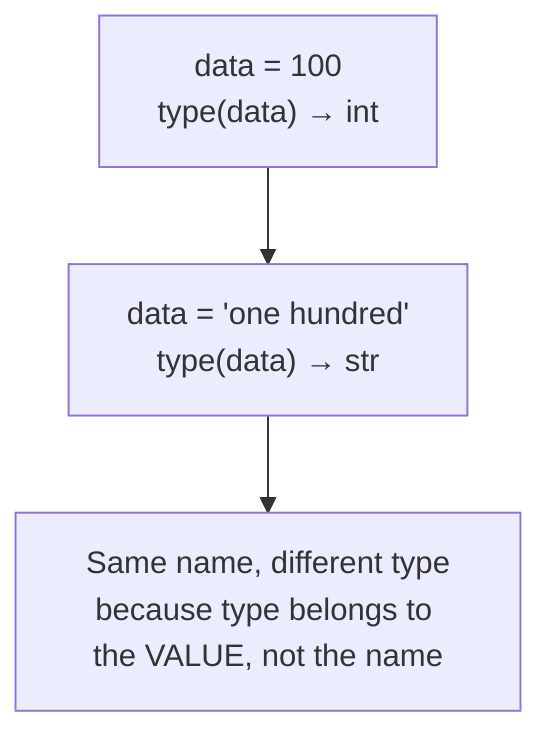

# Variables, Identifiers & Types

---

[← Previous: 1.1 The Python Environment](unit-1-1-python-environment.md) | [Go back to TOC](../../README.md) | [Next: 1.3 Operators & Expressions →](unit-1-3-operators-expressions.md)

## 1. Learning Objectives

By the end of this unit, you will be able to:

- **Create** a variable using the assignment operator (`=`) and change its value by reassigning it.
- **Apply** Python's naming rules and the `snake_case` convention to write legal, readable identifiers.
- **Identify** the four basic value types — `int`, `float`, `str`, and `bool` — from how a value is written.
- **Implement** the `type()` function to inspect the type of any value at any point in a program.
- **Differentiate** between statically typed languages and Python's dynamically typed approach.
- **Debug** the two most common beginner errors in this area — `NameError` from case mismatches and `SyntaxError` from illegal identifier names.

---

## 2. Overview

In Unit 1.1, you learned to type code into a Colab cell, run it, and use `print()` to see a result. That's a good start, but think about what a real application does — a banking app remembers your account balance, a food delivery app remembers your cart total, a UPI app remembers the amount you're about to pay. None of that is possible if every value disappears the moment it's printed.

This is exactly the gap a **variable** fills. A variable gives a value a name, so your program can refer to it again and again, and update it in one place instead of hunting down every copy scattered across the code. This single idea — "give it a name, use the name" — is the single most-used concept in all of software development; you will use it in literally every program you ever write, from your first Colab cell to a production banking system.

In this unit, you will learn how to create variables, the rules and conventions for naming them properly, the four basic types of values you'll use constantly (`int`, `float`, `str`, `bool`), how to check a value's type using the `type()` function, and why Python doesn't require you to declare a type in advance — a behaviour called dynamic typing. These are the true building blocks of every Python program you will write in this course and in your career.

---

## 3. Description

### 3.1 Definition

A **variable** is a name that refers to a value stored in the computer's memory. Think of it like a labelled box: the label is the name you choose, and the box holds whatever value you put inside. You create a variable using the **assignment operator**, the single equals sign `=`, with the name on the left and the value on the right:

**Example:**

```python
x = 5
```

Read this as "let `x` refer to the value `5`" — not "x equals 5" in the mathematical sense. In mathematics, `=` states a fact that is either true or false. In Python, `=` performs an **action**: it binds the name on the left to the value on the right.

### 3.2 Why This Concept Exists

Without variables, every program would be limited to `print()`-ing fixed text once and forgetting it — exactly the limitation you hit at the end of Unit 1.1. Real software constantly needs to:

- **Remember** a value across multiple steps (a customer's cart total while they keep shopping).
- **Reuse** a value in several places without retyping it (a tax rate applied to every item).
- **Update** a value as the program runs (a bank balance after each transaction, a score after each level).

A variable solves all three problems with one mechanism: give the value a name once, and let the rest of your program refer to that name instead of the raw value. This is why "variables and assignment" is universally the second thing every programming course teaches, right after "how do I run code at all."

### 3.3 Key Terminology

| Term | Simple Meaning |
|---|---|
| **Variable** | A name that refers to a value stored in memory. |
| **Assignment operator (`=`)** | The symbol used to bind a name to a value. |
| **Reassignment** | Giving an existing variable a new value, replacing the old one. |
| **Identifier** | The technical term for the name you give a variable, function, or other object. |
| **Reserved keyword** | A word Python has already claimed for its own grammar (e.g. `if`, `for`, `class`) — you cannot use it as a variable name. |
| **Case sensitivity** | Python treats uppercase and lowercase letters as different, so `total` and `Total` are two unrelated names. |
| **`snake_case`** | The Python naming convention: all lowercase words separated by underscores, e.g. `total_price`. |
| **Type** | A category that says what kind of value something is — a number, text, or a true/false value. |
| **`int`** | A whole number with no decimal point, e.g. `42`. |
| **`float`** | A number written with a decimal point, e.g. `42.0`. |
| **`str`** | Text data, written inside quotation marks, e.g. `"hello"`. |
| **`bool`** | A truth value: exactly `True` or `False`. |
| **`type()`** | A built-in function that tells you the type of any value. |
| **`input()`** | A built-in function that pauses the program, displays an optional prompt, and returns whatever the user types — always as a `str`. |
| **Dynamic typing** | Python's behaviour of determining a value's type automatically at assignment time, rather than requiring you to declare it in advance. |
| **`NameError`** | The error Python raises when you try to use a variable that was never assigned. |
| **`SyntaxError`** | The error Python raises when code breaks the language's grammar rules, such as an illegal variable name. |

### 3.4 Syntax

```python
name = value
```

| Part | What it is | Why it's there |
|---|---|---|
| `name` | The **identifier** — the label you are choosing for this value. | This is what you will type later to retrieve the value. |
| `=` | The **assignment operator**. | It tells Python "bind the name on my left to the value on my right." It is not a mathematical equals sign. |
| `value` | Any expression Python can evaluate — a number, a string, another variable, or a calculation. | Python works this out completely first, *then* binds the name to the result. |

Reassignment uses the exact same syntax, just written again later in the program:

**Example:**

```python
score = 100      # first assignment — score is created
score = 150      # reassignment — score's old value (100) is replaced
```

**Getting a value from the user: `input()`**

Every example so far has assigned a value you typed directly into the code. Real programs usually need to ask the *person running the program* for a value instead — a name, an age, an amount to pay. The built-in **`input()`** function does exactly this: it pauses the program, displays an optional prompt message, waits for the user to type something and press Enter, and then hands back whatever they typed.

**Example:**

```python
name = input("Enter your name: ")
print("Hello,", name)
```

*Line-by-line explanation:*
- `input("Enter your name: ")` displays the text `Enter your name: ` on the screen and then pauses — the program does nothing further until the user types a response and presses Enter.
- Whatever the user typed is returned by `input()` as a value, and `name = ...` immediately assigns that returned value to the variable `name`, exactly like any other assignment.
- `print("Hello,", name)` then displays a greeting using whatever the user entered.
- Sample run (user types `Ada` and presses Enter):
  ```
  Enter your name: Ada
  Hello, Ada
  ```

| Part | What it is | Why it's there |
|---|---|---|
| `input(...)` | The built-in function that reads one line of text typed by the user. | This is how a program collects information from a real person instead of having every value hard-coded. |
| `"Enter your name: "` | An optional **prompt** string, shown before the program waits. | Tells the user what kind of value is expected; without it, the program would still wait, but with no visible message. |
| Return value | **Always a `str`**, no matter what the user types — even `input("Enter your age: ")` with `20` typed in returns the *string* `"20"`, not the number `20`. | This is the single most important fact about `input()`: you must explicitly convert it (using `int()` or `float()`, covered in Unit 1.4) before using it as a number. |

See this for yourself — even though the user types a number below, `type()` proves what `input()` actually handed back:

**Example:**

```python
age = input("Enter your age: ")
print(type(age))
```

*Line-by-line explanation:*
- `age = input("Enter your age: ")` waits for the user to type a response. Suppose the user types `20` and presses Enter — it *looks* like a number was entered.
- `print(type(age))` asks Python to report the actual type of whatever `age` refers to.
- Sample run (user types `20` and presses Enter):
  ```
  Enter your age: 20
  <class 'str'>
  ```
  Even though `20` looks exactly like a number, `type()` confirms it is a `str` — `input()` never returns anything but text. If you tried `age + 5` right now, Python would raise a `TypeError`, because you cannot add a number to a string; you would first need to convert `age` with `int(age)`.

**Use case:** `input()` is what turns a fixed script into an interactive program — a login prompt asking for a username, a calculator asking for two numbers, a quiz asking for an answer, or a food delivery app asking for a delivery address all start with `input()` collecting something directly from the person using the program.

**Comparison Table: Statically Typed vs Dynamically Typed Languages**

| Aspect | Statically Typed (e.g., Java, C) | Dynamically Typed (e.g., Python) |
|---|---|---|
| Type declaration | You must declare the type up front, e.g. `int age = 30;` | You never declare a type — Python infers it from the value |
| When type is checked | Before the program runs (compile time) | While the program runs (run time) |
| Can a variable change type? | No — a variable keeps its declared type forever | Yes — the same name can refer to an `int` now and a `str` later |
| Beginner impact | More upfront typing, catches some mistakes earlier | Faster to write, but you must track types yourself using `type()` |

**Dynamic Typing Over Time**



### 3.5 Rules

**Identifier rules (enforced by Python — break one and your code will not run):**

- May contain letters, digits, and the underscore `_`.
- Must **not start with a digit** — `age2` is legal, `2age` is not.
- May not contain spaces or symbols such as `-`, `!`, or `$`.
- Must not be a **reserved keyword** (`if`, `for`, `class`, `True`, `False`, etc.).

**Assignment rules:**

- A variable must be assigned at least once before you can use it — using it earlier raises a `NameError`.
- The right-hand side is always fully evaluated *before* the name is bound or rebound.
- Python is **case sensitive**: `total`, `Total`, and `TOTAL` are three completely separate variables.

### 3.6 Best Practices

- Follow **PEP 8** (Python's official style guide) and use `snake_case` for variable names: `total_price`, not `TotalPrice` or `totalprice`.
- Choose names that describe the value's *purpose*, not its type: `customer_age` is better than `x` or `intvalue`.
- Keep one spelling and one case per variable throughout your program — never switch between `total` and `Total` for the same value.
- Use `type()` whenever you're unsure what a value's type is, rather than guessing from how it looks.
- Assign a variable close to where it is first used, so a reader doesn't have to search far to understand it.

### 3.7 Common Mistakes

- **Using a variable before assigning it** — leads to `NameError: name '...' is not defined`. A variable only exists after its first assignment.
- **Starting an identifier with a digit** (`2age = 30`) — Python cannot parse the name at all and raises a `SyntaxError` before running anything.
- **Colliding with a reserved keyword** (`class = "10A"`) — causes a confusing `SyntaxError`; rename the identifier (`class_name` instead of `class`).
- **Assuming case doesn't matter** — writing `total` in one line and `Total` in another creates two separate, unrelated variables, not a typo Python will forgive.
- **Confusing `"5"` (a string) with `5` (an integer)** — they look similar but are different types; `type()` will immediately clear this up.

### 3.8 Code Examples

**Scenario:** we'll build one running example — tracking a Swiggy-style food delivery order — in four short stages. Each stage keeps every line from the stage before it and adds a few new ones, so by the end you can see the whole idea of variables, reassignment, types, and `input()` working together in a single program.

**Stage 1 — create and print a single variable (the item's price):**

```python
item_price = 149
print(item_price)
```

*Line-by-line explanation:*
- `item_price = 149` — binds the name `item_price` to the value `149`.
- `print(item_price)` — Python looks up what `item_price` refers to and displays it.
- Output: `149`.

**Stage 2 — the customer changes their order, so the price is reassigned:**

```python
item_price = 149
print(item_price)

item_price = 249
print(item_price)
```

*Line-by-line explanation:*
- The first two lines are unchanged from Stage 1 and still print `149`.
- `item_price = 249` is a **reassignment** — the old value `149` is discarded, and `item_price` now refers to `249`.
- The second `print(item_price)` shows the new value.
- Output:
  ```
  149
  249
  ```

**Stage 3 — store the rest of the order using one variable of each basic type, and inspect them with `type()`:**

```python
item_price = 149
print(item_price)

item_price = 249
print(item_price)

customer_name = "Ananya Roy"
delivery_fee = 29.50
order_id = "SWG10234"
is_paid = False

print(type(customer_name))
print(type(delivery_fee))
print(type(order_id))
print(type(is_paid))
```

*Line-by-line explanation:*
- `customer_name = "Ananya Roy"` — wrapped in quotes, so Python stores it as a `str`.
- `delivery_fee = 29.50` — written with a decimal point, so Python stores it as a `float`.
- `order_id = "SWG10234"` — quoted, so it's a `str`, even though it contains digits; it is text to display, not a number to calculate with.
- `is_paid = False` — one of exactly two allowed values, so Python stores it as a `bool`, starting as "not yet paid."
- The four `print(type(...))` lines report each stored type, with no need to declare any of them in advance — this is dynamic typing in action. Output:
  ```
  149
  249
  <class 'str'>
  <class 'float'>
  <class 'str'>
  <class 'bool'>
  ```

**Stage 4 — ask the customer for their delivery address with `input()`, then confirm payment:**

```python
item_price = 149
print(item_price)

item_price = 249
print(item_price)

customer_name = "Ananya Roy"
delivery_fee = 29.50
order_id = "SWG10234"
is_paid = False

print(type(customer_name))
print(type(delivery_fee))
print(type(order_id))
print(type(is_paid))

address = input("Enter your delivery address: ")
print("Deliver to:", address)
print(type(address))

is_paid = True
print("Payment status:", is_paid)
```

*Line-by-line explanation:*
- `address = input("Enter your delivery address: ")` displays the prompt and pauses until the user types a response and presses Enter; whatever they type is assigned to `address`.
- `print("Deliver to:", address)` displays a label and the address together.
- `print(type(address))` proves that `input()` always hands back a `str`, no matter what the user types.
- `is_paid = True` is another reassignment — the same name that held `False` now refers to `True`, simulating the moment payment succeeds.
- Sample run (user types `12 MG Road, Bengaluru` and presses Enter):
  ```
  149
  249
  <class 'str'>
  <class 'float'>
  <class 'str'>
  <class 'bool'>
  Enter your delivery address: 12 MG Road, Bengaluru
  Deliver to: 12 MG Road, Bengaluru
  <class 'str'>
  Payment status: True
  ```

#### Try It Yourself

Sticking with the same food delivery scenario, extend the program yourself. Attempt each part before checking the solution.

**(a)** Create a variable `restaurant_name` holding the text `"Spice Route"`, print it, and then print its type.

**Solution:**
```python
restaurant_name = "Spice Route"
print(restaurant_name)
print(type(restaurant_name))
```
Expected output:
```
Spice Route
<class 'str'>
```

**(b)** Add two more variables: `quantity` set to `3` (the number of items ordered) and `packing_charge` set to `15.0`. Print the type of `restaurant_name`, `quantity`, and `packing_charge`, one per line.

**Solution:**
```python
restaurant_name = "Spice Route"
quantity = 3
packing_charge = 15.0

print(type(restaurant_name))
print(type(quantity))
print(type(packing_charge))
```
Expected output:
```
<class 'str'>
<class 'int'>
<class 'float'>
```

**(c)** Using `input()`, ask the customer to type their name into a variable called `customer_name`. Print a message that says `"Order for:"` followed by `customer_name`. Then create a variable `order_confirmed` starting as `False`, reassign it to `True` once the order is placed, and print `"Order confirmed:"` followed by `order_confirmed`.

**Solution:**
```python
customer_name = input("Enter your name: ")
print("Order for:", customer_name)

order_confirmed = False
order_confirmed = True
print("Order confirmed:", order_confirmed)
```
Expected output (user types `Rahul` and presses Enter):
```
Enter your name: Rahul
Order for: Rahul
Order confirmed: True
```

---

## 4. Real-World Application

The moment you start naming and storing values, you are doing exactly what production software does, just at a smaller scale:

- **Banking & FinTech:** An account's balance, the account holder's name, and whether the account is active are stored as variables (or their database equivalent) of type `float`, `str`, and `bool` respectively — the very same types you just used.
- **UPI / Payment Systems:** Every payment app tracks a payer name, an amount, a transaction ID, and a success flag — four variables, four types, exactly like the example above.
- **E-commerce:** A shopping cart page holds an item price (`float`), a quantity (`int`), a product name (`str`), and whether a coupon was applied (`bool`) — four variables, four different jobs.
- **Healthcare:** A patient record system stores a patient's name (`str`), age (`int`), temperature reading (`float`), and whether they are currently admitted (`bool`).
- **Railway Booking (IRCTC-style systems):** A booking stores the passenger's name, the fare, the number of seats requested, and whether the booking is confirmed — precisely the shape of the worked example below.
- **AI/ML:** Every model you will later call in this program stores its inputs and outputs in variables first — a prompt (`str`), a confidence score (`float`), a token count (`int`) — before doing anything else with them.

The pattern never really changes as you move into more advanced software: name a value, store it in the right type, reuse and update it as needed.

---

## 5. Worked Example

### Problem Statement

You are asked to model the core details of a single railway ticket booking, similar to what an IRCTC-style booking confirmation page shows: the passenger's name, the ticket fare, the number of seats booked, and whether the booking is currently confirmed. After creating these variables, you must verify each one's type, and then update the booking status once payment goes through.

### Step 1: Understand the Problem

You need four separate pieces of information, each naturally a different type: text (the passenger's name), a decimal amount (the fare), a whole number (the seat count), and a true/false flag (whether the booking is confirmed). No calculations are required yet — only correct storage, correct typing, and one reassignment.

### Step 2: Plan the Solution

Create one variable for each piece of information, using `snake_case` names that describe their purpose. Print each variable's type to confirm Python inferred it correctly. Then simulate the booking being confirmed by reassigning the status variable from `False` to `True`.

### Step 3: Write the Python Code

```python
passenger_name = "Priya Nair"
ticket_fare = 745.50
seats_booked = 2
booking_confirmed = False

print(type(passenger_name))
print(type(ticket_fare))
print(type(seats_booked))
print(type(booking_confirmed))

booking_confirmed = True
print("Booking confirmed status:", booking_confirmed)
```

### Step 4: Explain Each Line

- `passenger_name = "Priya Nair"` — a `str`, because it is text wrapped in quotes.
- `ticket_fare = 745.50` — a `float`, because it is written with a decimal point.
- `seats_booked = 2` — an `int`, because it is a whole number with no decimal point.
- `booking_confirmed = False` — a `bool`, starting as "not yet confirmed."
- The four `print(type(...))` lines each ask Python to report the type it inferred, with no need for you to declare anything up front — this is dynamic typing in action.
- `booking_confirmed = True` — a **reassignment**. The old value (`False`) is discarded, and the same name now refers to `True`, simulating the moment payment succeeds.
- The final `print()` displays a label and the updated value together.

### Step 5: Sample Input

None. All values are assigned directly in the code; no user input is involved in this unit yet.

### Step 6: Expected Output

```
<class 'str'>
<class 'float'>
<class 'int'>
<class 'bool'>
Booking confirmed status: True
```

### Step 7: Why the Output Is Produced

Each `type()` call reports exactly the type Python inferred at the moment of assignment — a quoted value becomes `str`, a decimal value becomes `float`, a whole number becomes `int`, and `True`/`False` becomes `bool`. The final line reflects the reassignment: `booking_confirmed` was created as `False`, then explicitly reassigned to `True` before the last `print()` ran, so the *old* value is never seen again — only the current one is shown.

---

### Important Notes (Interview Insights)

- A frequently asked fresher interview question: *"Is Python statically typed or dynamically typed?"* Answer confidently: Python is **dynamically typed** — you never declare a variable's type in advance; Python determines it automatically from the assigned value, and the same name can refer to different types at different times in the program.
- Be ready to explain the difference between a **rule** and a **convention**: identifier rules are enforced by the language (violating one stops your program from running at all), while `snake_case` is a convention — a team agreement that keeps code consistent and readable, not something Python itself checks.
- Interviewers sometimes probe whether you understand that `=` in Python is *assignment*, not mathematical equality — comparison uses a different operator (`==`), which you will meet in Unit 1.3.

---

## 6. Key Takeaways

- A **variable** is a name bound to a value using the assignment operator `=`; **reassignment** replaces the old value with a new one under the same name.
- **Identifiers** must follow Python's rules (letters, digits, underscores; no leading digit; no reserved keywords) and should follow the **`snake_case`** convention from PEP 8.
- Python is **case sensitive** — `total` and `Total` are two unrelated variables, a common source of `NameError` bugs.
- The four basic types are **`int`**, **`float`**, **`str`**, and **`bool`**; the built-in **`type()`** function reports the type of any value.
- Python uses **dynamic typing**: you never declare a type in advance, and the type belongs to the value, not to the name — so the same variable can hold different types at different points in a program.
- A `NameError` means you used a variable before assigning it; a `SyntaxError` on a variable name usually means it starts with a digit or clashes with a reserved keyword.
- Being ready to explain *dynamic vs static typing* in your own words is a very common entry-level interview question.

Coming next: operators and expressions — how you combine and compare the values you now know how to store (Unit 1.3 — Operators & Expressions).

---

## 7. Reference Links

- [The Python Tutorial — An Informal Introduction (Variables, Numbers, Strings)](https://docs.python.org/3/tutorial/introduction.html)
- [Python 3 Documentation — Built-in Types](https://docs.python.org/3/library/stdtypes.html)
- [PEP 8 — Style Guide for Python Code (Naming Conventions)](https://peps.python.org/pep-0008/#naming-conventions)
- [Real Python — Variables in Python](https://realpython.com/python-variables/)
- [W3Schools — Python Variables](https://www.w3schools.com/python/python_variables.asp)

[← Previous: 1.1 The Python Environment](unit-1-1-python-environment.md) | [Go back to TOC](../../README.md) | [Next: 1.3 Operators & Expressions →](unit-1-3-operators-expressions.md)

---

*© 2026 Revature · AI Native Engineering — Foundations · Unit 1.2 · Version 2.0*
