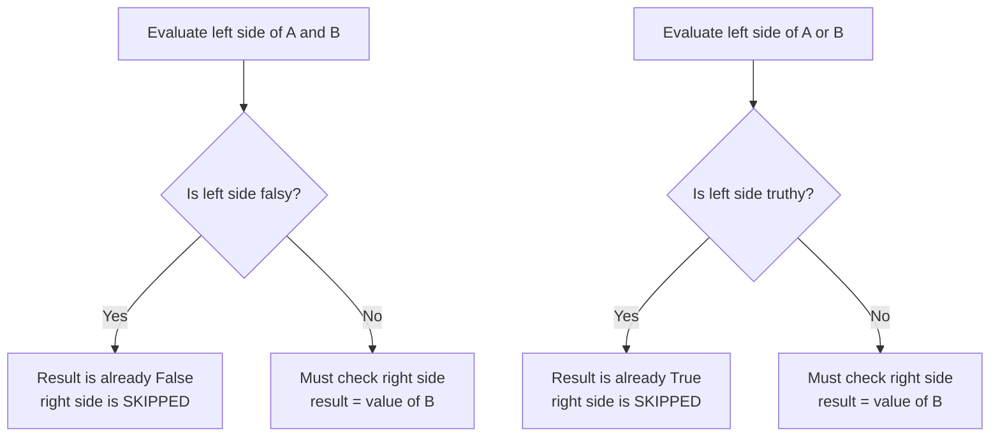
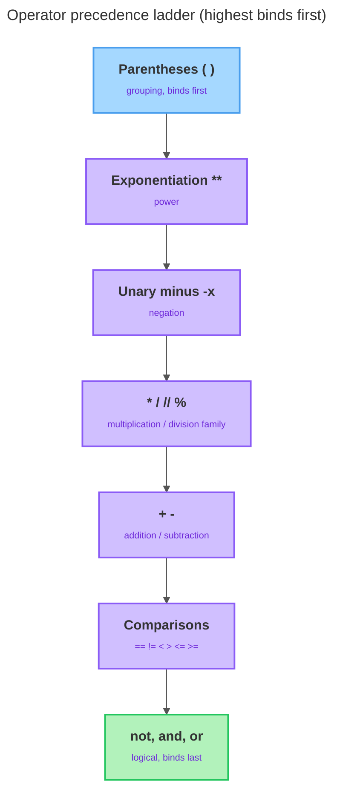

# Operators & Expressions

---

[← Previous: 1.2 Variables, Identifiers & Types](unit-1-2-variables-identifiers-types.md) | [Go back to TOC](../../README.md) | [Next: 1.4 Statements, Conversion & Output →](unit-1-4-statements-conversion-output.md)

## 1. Learning Objectives

By the end of this unit, you will be able to:

- **Apply** Python's arithmetic operators — `+`, `-`, `*`, `/`, `//`, `%`, and `**` — to build correct expressions, including how true division differs from floor division.
- **Explain** operator precedence, the fixed order in which Python evaluates an expression with more than one operator, and use parentheses to control that order deliberately.
- **Implement** comparison operators (`==`, `!=`, `<`, `>`, `<=`, `>=`) to test relationships between values and recognize that every comparison produces a `bool`.
- **Differentiate** between the assignment operator `=` and the equality operator `==`, the single most common beginner mistake in this area.
- **Analyze** compound conditions built with the logical operators `and`, `or`, and `not`, and explain short-circuit evaluation.
- **Identify** which Python values are truthy and which are falsy, and describe how truthiness feeds directly into logical operators.

---

## 2. Overview

In Unit 1.2 you learned to name a value and check its type with `type()`. But a program that only stores values doesn't actually *do* anything with them. The moment you want to add a delivery charge to a cart total, check whether a UPI amount is within a daily limit, or decide whether a customer qualifies for a discount, you need an **operator** — a symbol or short keyword that combines one or more values into a new value. Put values, variables, and operators together into something Python can evaluate down to a single result, and you have written an **expression**.

This unit covers four operator families and one supporting idea that you will use in almost every Python program you ever write: **arithmetic operators** (for calculations), **operator precedence** (which operator runs first), **comparison operators** (for asking true/false questions about values), **logical operators** (for combining those questions), and **truthiness** (how Python judges *any* value as true-ish or false-ish). In the Indian IT industry, these five ideas sit underneath everything from a food delivery app calculating your bill, to a banking system validating a transaction, to an e-commerce site deciding whether you qualify for free shipping. Every comparison and logical expression you write here produces a `bool` — and those booleans are exactly what will drive the decisions your programs make once you reach conditional statements in the next part of this course.

---

## 3. Description

### 3.1 Definition

An **operator** is a symbol (or a short keyword, like `and`) that tells Python to perform a specific operation — add two numbers, compare two values, or combine two conditions. An **expression** is any combination of values, variables, and operators that Python can evaluate down to a single result. `3 + 4` is an expression; so is `age >= 18`; so is `is_member and not is_banned`. Every expression, no matter how simple or complex, always reduces to exactly one value.

```python
total = 200 + 50
```

Here, `200 + 50` is the expression, `+` is the operator, `200` and `50` are the **operands** (the values the operator works on), and the whole expression is evaluated to `250` *before* it is assigned to `total`.

### 3.2 Why This Concept Exists

Without operators, a program could only store fixed values — it could never calculate a total, check a condition, or combine multiple facts into one decision. Real software constantly needs to:

- **Calculate** — add a delivery fee to a cart subtotal, apply a discount percentage, compute the remainder when splitting a bill.
- **Compare** — check whether an account balance is enough for a withdrawal, whether an age meets a minimum, whether an entered PIN matches the stored one.
- **Combine conditions** — decide whether a user may proceed only when *several* facts are true at once, such as "logged in **and** balance sufficient **and** account not blocked."

Arithmetic, comparison, and logical operators, together with the rules that govern how they combine (precedence and truthiness), give you exactly this toolkit. This is why "operators and expressions" is universally the topic that follows "variables and types" in every programming course — you cannot build a decision-making program without them.

### 3.3 Key Terminology

| Term | Simple Meaning |
|---|---|
| **Operator** | A symbol or keyword that performs an operation on one or more values, e.g. `+`, `==`, `and`. |
| **Operand** | A value that an operator works on — in `3 + 4`, both `3` and `4` are operands. |
| **Expression** | Any combination of values, variables, and operators that Python evaluates down to a single result. |
| **Arithmetic operator** | An operator that performs a mathematical calculation, e.g. `+`, `-`, `*`, `/`. |
| **True division (`/`)** | Division that always produces a `float` result, even when the numbers divide evenly. |
| **Floor division (`//`)** | Division that rounds the result *down* toward negative infinity, discarding the fractional part. |
| **Modulo (`%`)** | The remainder left over after floor division. |
| **Exponentiation (`**`)** | Raising a number to a power, e.g. `7 ** 2` means 7 squared. |
| **Operator precedence** | The fixed ranking that decides which operator Python evaluates first in an expression with more than one operator. |
| **Associativity** | The rule for order when two operators share the same precedence level — Python evaluates most of them left to right. |
| **Comparison operator** | An operator that compares two values and produces a `bool`, e.g. `==`, `<`, `>=`. |
| **Chained comparison** | Writing two comparisons together, like `1 < x < 10`, which Python evaluates as one combined condition. |
| **Logical operator** | An operator — `and`, `or`, or `not` — that combines or inverts `bool` values. |
| **Short-circuit evaluation** | Python's behaviour of stopping early on `and`/`or` the instant the final result is already decided, without checking the remaining side. |
| **Truthiness** | Python's rule for treating *any* value — not just `True`/`False` — as true-ish or false-ish in a logical context. |
| **Falsy** | A value that behaves as `False` in a logical context, such as `0`, `0.0`, or `""`. |
| **Truthy** | A value that behaves as `True` in a logical context — essentially everything that is not falsy. |

### 3.4 Syntax

**Arithmetic operators** — work on `int` and `float` operands:

| Operator | Name | Example | Result |
|---|---|---|---|
| `+` | addition | `7 + 3` | `10` |
| `-` | subtraction | `7 - 3` | `4` |
| `*` | multiplication | `7 * 3` | `21` |
| `/` | true division | `7 / 2` | `3.5` |
| `//` | floor division | `7 // 2` | `3` |
| `%` | modulo (remainder) | `7 % 2` | `1` |
| `**` | exponentiation | `7 ** 2` | `49` |

**Comparison operators** — work on two operands, always produce a `bool`:

| Operator | Name | Example | Result |
|---|---|---|---|
| `==` | equal to | `5 == 5` | `True` |
| `!=` | not equal to | `5 != 3` | `True` |
| `<` | less than | `3 < 5` | `True` |
| `>` | greater than | `3 > 5` | `False` |
| `<=` | less than or equal to | `5 <= 5` | `True` |
| `>=` | greater than or equal to | `3 >= 5` | `False` |

**Comparison Table: `=` vs `==`**

| Aspect | `=` (Assignment) | `==` (Equality Comparison) |
|---|---|---|
| Purpose | Binds a name to a value (from Unit 1.2) | Asks whether two values are equal |
| Result | No result value — it performs an action | Always produces a `bool`: `True` or `False` |
| Example | `x = 5` — stores `5` in `x` | `x == 5` — asks "does `x` currently equal `5`?" |
| Where it's used | Only in a statement, to create or update a variable | Inside any expression — conditions, print statements, calculations |
| Beginner risk | Using it where a question was intended | Using it where a value was meant to be stored |

**Logical operators** — work on `bool` operands (or any value, via truthiness):

| Operator | Name | Example | Result |
|---|---|---|---|
| `and` | logical AND — true only if both sides are true | `True and False` | `False` |
| `or` | logical OR — true if at least one side is true | `True or False` | `True` |
| `not` | logical NOT — flips a single value | `not True` | `False` |

Logical operators stop evaluating the moment the final answer is already known. This diagram shows what Python actually does when it evaluates `A and B` and `A or B`:



**Operator Precedence Ladder**

When an expression has more than one operator, Python does not read left to right — it follows a fixed ranking called **operator precedence**. Here is the ladder, highest (evaluated first) at the top:

| Precedence | Operators | Group |
|---|---|---|
| Highest | `()` | parentheses (grouping) |
| | `**` | exponentiation |
| | `-x` | unary minus (negation) |
| | `*`, `/`, `//`, `%` | multiplication / division family |
| | `+`, `-` | addition / subtraction |
| | `<`, `<=`, `>`, `>=`, `==`, `!=` | comparisons |
| | `not` | logical NOT |
| | `and` | logical AND |
| Lowest | `or` | logical OR |



A few facts fall out of this ladder. `**` binds *tighter* than unary minus, so `-2 ** 2` gives `-4`, not `4`. Arithmetic runs before comparison, and comparison runs before logic, so `2 + 3 > 4 and 1 < 2` reads as `((2 + 3) > 4) and (1 < 2)`. And when two operators share a precedence level (like `*` and `/`), Python evaluates left to right — **left-associativity** — so `20 / 4 * 2` is `(20 / 4) * 2 = 10.0`, not `2.5`. You don't have to memorize the ladder; any time the order isn't obvious, wrap the part you want done first in parentheses — they always win, cost nothing, and can never turn a correct expression into a wrong one.

### 3.5 Rules

- The *type* of an arithmetic result depends on the operands: if both are `int`, `+`/`-`/`*` give back an `int`; the moment even one operand is a `float`, the result "promotes" to `float`. So `7 + 3` is `10`, but `7 + 3.0` is `10.0`.
- `/` (true division) **always** returns a `float`, even when the numbers divide evenly — `6 / 2` is `3.0`, not `3`.
- `//` (floor division) rounds *toward negative infinity*, never toward zero. For positive numbers this matches "drop the decimal part," but for negatives it does not: `-7 // 2` is `-4` (the true answer, `-3.5`, rounded *down*), not `-3`.
- `%` (modulo) gives the remainder, and it takes the **sign of the divisor** — so `-7 % 2` is `1`, not `-1`. `//` and `%` fit together: `(a // b) * b + (a % b)` always reconstructs `a`.
- Dividing by zero with `/`, `//`, or `%` raises a `ZeroDivisionError` — Python never silently returns `0` or `infinity`.
- Every comparison operator (`==`, `!=`, `<`, `>`, `<=`, `>=`) always produces a `bool` — never anything else.
- Comparisons can be **chained**: `1 < x < 10` is evaluated as a single combined condition, exactly like "is `x` between 1 and 10?"
- `and` and `or` are **short-circuit**: the right-hand side is skipped entirely once the left-hand side has already decided the result.
- The **falsy** values in Python are a short, fixed list: `False`, `0`, `0.0`, and `""` (the empty string). Every other value — including negative numbers and the text `"False"` — is **truthy**.
- Operator precedence is fixed and cannot be changed, but parentheses `()` always override it.

### 3.6 Best Practices

- Use parentheses to make your intended order of evaluation obvious, even when precedence would already give the right answer — clarity for the next reader matters more than saving a few characters.
- Never assume `/` behaves like `//`, or the reverse — decide up front whether you need a fractional result or a whole-number count, and pick the operator that matches.
- Compare values of compatible types; comparing a number to text (like `5 == "5"`) is legal Python but always gives `False`, since they are different types.
- Write chained comparisons (`18 <= age < 65`) instead of `18 <= age and age < 65` — they mean the same thing, but the chained form reads closer to plain English.
- Rely on truthiness for a direct check (`if cart_items:`) instead of writing it out longhand (`if cart_items != ""`) — Python code that uses truthiness idiomatically is considered more "Pythonic."
- When a condition is long, break it across variables with descriptive names (as shown in the Worked Example) rather than writing one giant expression — it is far easier to debug.

### 3.7 Common Mistakes

- **Confusing `=` with `==`** — a single `=` assigns a value; a double `==` asks a question and returns `True`/`False`. This is the single most common beginner bug in this entire unit.
- **Expecting `/` to behave like floor division** — forgetting that `/` always returns a `float`, even for `10 / 2`.
- **Misreading `-2 ** 2`** — because `**` binds *tighter* than unary minus, this reads as "negate `2 ** 2`," giving `-4`, not `4`. To square `-2` itself, write `(-2) ** 2`.
- **Ignoring precedence in mixed expressions** — assuming Python evaluates strictly left to right and getting `2 + 3 * 4` wrong by computing `2 + 3` first instead of `3 * 4` first.
- **Treating the string `"False"` as falsy** — it is a non-empty string, so Python treats it as truthy; only the actual boolean `False` and the specific falsy values are false-ish.
- **Not realizing short-circuit evaluation can hide bugs** — code on the right-hand side of `and`/`or` that would normally crash (like a division by zero) may never run at all, silently masking a problem you meant to catch.

### 3.8 Code Examples

**Code example** — a college fest snack stall: calculating a bill, splitting it among friends, and deciding on a discount:

```python
samosa_price = 15
samosa_qty = 4
cold_drink_price = 20
cold_drink_qty = 2
packing_fee = 10
friends_sharing = 3
has_student_card = True
coupon_code = ""
order_cancelled = False

item_total = samosa_price * samosa_qty + cold_drink_price * cold_drink_qty
final_bill = item_total + packing_fee
share_per_friend = final_bill // friends_sharing
leftover_rupees = final_bill % friends_sharing

qualifies_by_amount = final_bill >= 100
has_coupon = bool(coupon_code)
not_cancelled = not order_cancelled
discount_eligible = qualifies_by_amount and has_student_card and not_cancelled
free_packing = discount_eligible or has_coupon

print(final_bill)
print(share_per_friend)
print(leftover_rupees)
print(discount_eligible)
print(free_packing)
```

*Line-by-line explanation:*
- `samosa_price = 15` through `order_cancelled = False` — nine variables holding the raw facts about the order: prices and quantities (`int`), a student-card flag and a cancellation flag (`bool`), and a coupon code (`str`) that happens to be empty because no coupon was entered.
- `item_total = samosa_price * samosa_qty + cold_drink_price * cold_drink_qty` — no parentheses are needed here because `*` already outranks `+` on the precedence ladder from Section 3.4: Python computes `samosa_price * samosa_qty` (`15 * 4 = 60`) and `cold_drink_price * cold_drink_qty` (`20 * 2 = 40`) first, *then* adds them, giving `100`.
- `final_bill = item_total + packing_fee` — plain addition: `100 + 10 = 110`.
- `share_per_friend = final_bill // friends_sharing` — floor division splits the bill into whole rupees per friend: `110 // 3` is `36`.
- `leftover_rupees = final_bill % friends_sharing` — modulo gives whatever floor division couldn't split evenly: `110 % 3` is `2`. Check the rule from Section 3.5: `(36 * 3) + 2 = 110`, which reconstructs `final_bill` exactly.
- `qualifies_by_amount = final_bill >= 100` — a comparison that always produces a `bool`; `110 >= 100` is `True`.
- `has_coupon = bool(coupon_code)` — this relies on **truthiness**: an empty string is falsy, so wrapping it in `bool()` reports `False` directly, with no need to write `coupon_code != ""`.
- `not_cancelled = not order_cancelled` — `not` flips the stored `False` to `True`, meaning "the order is indeed not cancelled."
- `discount_eligible = qualifies_by_amount and has_student_card and not_cancelled` — `and` needs every operand to be `True`; all three are, so the whole expression is `True`.
- `free_packing = discount_eligible or has_coupon` — `or` needs only one side to be `True`; because `discount_eligible` is already `True`, this **short-circuits** and Python doesn't even need to look at `has_coupon` to know the answer is `True`.
- Output:
  ```
  110
  36
  2
  True
  True
  ```

#### Try It Yourself

The fest is busier than expected: more friends show up, and the order grows. Reuse the same snack-stall scenario from the example above and work through these three parts in order.

**Part 1 (arithmetic):** The stall now sells `6` samosas (still ₹15 each) and `3` cold drinks (still ₹20 each), with the same ₹10 packing fee. Write code that computes `item_total` and `final_bill` using the same expressions as the example, then print `final_bill`.

**Solution:**
```python
samosa_price = 15
samosa_qty = 6
cold_drink_price = 20
cold_drink_qty = 3
packing_fee = 10

item_total = samosa_price * samosa_qty + cold_drink_price * cold_drink_qty
final_bill = item_total + packing_fee
print(final_bill)
```
`item_total` is `15 * 6 + 20 * 3` = `90 + 60` = `150` (multiplication before addition), and `final_bill` is `150 + 10` = `160`.
Output:
```
160
```

**Part 2 (floor division and modulo):** This time `4` friends are sharing the `final_bill` of `160` from Part 1. Compute `share_per_friend` and `leftover_rupees`.

**Solution:**
```python
friends_sharing = 4
share_per_friend = final_bill // friends_sharing
leftover_rupees = final_bill % friends_sharing
print(share_per_friend)
print(leftover_rupees)
```
`160 // 4` is `40`, and `160 % 4` is `0` — the bill splits perfectly this time, with nothing left over.
Output:
```
40
0
```

**Part 3 (comparison, logical operators, and truthiness):** This particular friend does **not** have a student card (`has_student_card = False`), but did enter a coupon code (`coupon_code = "FEST10"`), and the order was not cancelled (`order_cancelled = False`). Using `final_bill = 160` from Part 1, compute `discount_eligible` and `free_packing` with the exact same expressions as the main example, then explain in one sentence why `free_packing` still ends up `True` even though `discount_eligible` is `False`.

**Solution:**
```python
has_student_card = False
coupon_code = "FEST10"
order_cancelled = False

qualifies_by_amount = final_bill >= 100
has_coupon = bool(coupon_code)
not_cancelled = not order_cancelled
discount_eligible = qualifies_by_amount and has_student_card and not_cancelled
free_packing = discount_eligible or has_coupon
print(discount_eligible)
print(free_packing)
```
`discount_eligible` is `False` because `and` requires *every* operand to be `True`, and `has_student_card` is `False` here. But `free_packing` is still `True`, because `has_coupon` is `True` (`"FEST10"` is a non-empty, truthy string), and `or` only needs one side to be `True`.
Output:
```
False
True
```

---

## 4. Real-World Application

Operators and expressions are working quietly behind almost every screen you use in India every day:

- **UPI / Payment Systems:** A payment app compares the entered amount against the account balance (`amount <= balance`) and combines that with a PIN check using `and` — short-circuit evaluation means the balance check can be skipped the instant the PIN comparison already fails.
- **E-commerce:** A checkout page calculates the final price with arithmetic (`subtotal - discount + delivery_fee`), then uses a comparison to decide whether free shipping applies, exactly as shown in the example above.
- **Food Delivery:** A food delivery app's "free delivery" banner is a live logical expression, recalculated every time the cart total or distance changes.
- **Banking & FinTech:** A minimum-balance check (`balance >= 10000`) and a fraud-flag check (`not is_flagged`) are combined with `and` before a transaction is allowed to proceed.
- **Railway Booking (IRCTC-style systems):** A booking screen checks `available_seats > 0` before allowing confirmation, and uses `%` internally to distribute passengers evenly across coaches.
- **Healthcare:** A patient monitoring system compares a temperature reading against a threshold (`temperature > 100.4`) to decide whether to raise an alert.
- **AI/ML:** A model's confidence score is compared against a threshold (`confidence >= 0.8`) using exactly the comparison operators from this unit, before the result is accepted or rejected.

---

## 5. Worked Example

### Problem Statement

An online store wants to check whether a customer's order qualifies for a **festive discount**. The rule: the order qualifies if the order total (after adding a small packaging fee) is at least ₹1000, **and** the customer has entered a non-empty coupon code, **and** the order is not already marked as cancelled. You must calculate the final order total, evaluate each condition, and combine them into one final decision.

### Step 1: Understand the Problem

You need one arithmetic calculation (adding a packaging fee to the item total) and three separate checks: a comparison against a minimum amount, a truthiness check on the coupon code, and a negated check on the cancellation flag. All three checks must combine into a single `bool` using logical operators.

### Step 2: Plan the Solution

First calculate `final_total` using `+`. Then create three named boolean variables — one per condition — using a comparison, a truthiness check via `bool()`, and `not`. Finally combine all three with `and` into one `discount_eligible` variable, and print every intermediate result so the decision is fully traceable.

### Step 3: Write the Python Code

```python
item_total = 950.0
packaging_fee = 60.0
coupon_code = "FEST2026"
order_cancelled = False

final_total = item_total + packaging_fee

amount_ok = final_total >= 1000
coupon_ok = bool(coupon_code)
not_cancelled = not order_cancelled

discount_eligible = amount_ok and coupon_ok and not_cancelled

print("Final total:", final_total)
print("Amount OK:", amount_ok)
print("Coupon OK:", coupon_ok)
print("Not cancelled:", not_cancelled)
print("Discount eligible:", discount_eligible)
```

### Step 4: Explain Each Line

- `item_total = 950.0` and `packaging_fee = 60.0` — two `float` values representing the raw order figures.
- `coupon_code = "FEST2026"` — a non-empty `str`, so it will be truthy.
- `order_cancelled = False` — a `bool` flag; the order is currently active.
- `final_total = item_total + packaging_fee` — arithmetic addition; Python evaluates the right-hand side first (`950.0 + 60.0 = 1010.0`) and then binds it to `final_total`.
- `amount_ok = final_total >= 1000` — a comparison producing a `bool`; `1010.0 >= 1000` is `True`.
- `coupon_ok = bool(coupon_code)` — truthiness check; a non-empty string is truthy, so this is `True`.
- `not_cancelled = not order_cancelled` — `not` flips `False` to `True`, meaning "the order is indeed not cancelled."
- `discount_eligible = amount_ok and coupon_ok and not_cancelled` — `and` requires all three to be `True`; since every one of them is `True`, the whole expression is `True`.
- The five `print()` calls display the final total and each step of reasoning so nothing is hidden inside one giant expression.

### Step 5: Sample Input

None. All values are assigned directly in the code; no user input is involved in this unit yet.

### Step 6: Expected Output

```
Final total: 1010.0
Amount OK: True
Coupon OK: True
Not cancelled: True
Discount eligible: True
```

### Step 7: Why the Output Is Produced

`final_total` is `1010.0` because Python evaluates the arithmetic expression on the right of `=` completely before storing it — `950.0 + 60.0` gives `1010.0`. `amount_ok` is `True` because the comparison `1010.0 >= 1000` holds. `coupon_ok` is `True` purely because of truthiness — `coupon_code` is a non-empty string, and Python treats any non-empty string as truthy without needing an explicit `!= ""` check. `not_cancelled` is `True` because `not` inverted the stored `False`. Finally, `discount_eligible` is `True` because `and` only produces `True` when every single operand is `True` — and here, all three are.

---

### Important Notes (Interview Insights)

- A very common fresher interview question: *"What is the difference between `/` and `//` in Python?"* Answer confidently: `/` is true division and always returns a `float`; `//` is floor division and rounds down toward negative infinity, returning an `int` when both operands are `int`.
- Interviewers often ask you to evaluate an expression on paper, such as `2 + 3 * 4` or `-2 ** 2`, purely to check whether you understand operator precedence rather than reading left to right.
- Be ready to explain **short-circuit evaluation** in your own words — it is a favourite question because it tests whether you understand *why* `False and expensive_function()` never actually calls that function.
- Interviewers frequently ask what values are "falsy" in Python — the confident answer is the fixed list: `False`, `0`, `0.0`, and `""`; everything else is truthy (and later in the course, empty collections like an empty list or dictionary join this falsy list too).
- Knowing the difference between `=` (assignment) and `==` (comparison) sounds trivial, but interviewers use it to filter out candidates who have only memorized syntax without understanding what each operator actually does.

---

## 6. Key Takeaways

- An **operator** performs an operation on values (**operands**); an **expression** is any combination of values, variables, and operators that Python reduces to one result.
- **Arithmetic operators** include `+ - * **`, plus two kinds of division — `/` (true division, always a `float`) and `//` (floor division, rounds toward negative infinity) — and `%` (remainder, whose sign follows the divisor).
- **Operator precedence** fixes which operator runs first (`**` before unary minus, the `*`/`/`/`//`/`%` family before `+`/`-`, arithmetic before comparison, comparison before logical, and `not` before `and` before `or`); parentheses always override it.
- **Comparison operators** (`==`, `!=`, `<`, `>`, `<=`, `>=`) each produce a `bool` and can be chained, as in `1 < x < 10`.
- The single most common beginner bug is confusing `=` (assignment) with `==` (equality comparison) — keep the `=` vs `==` comparison table in Section 3.4 in mind.
- **Logical operators** `and`, `or`, and `not` combine or invert conditions using **short-circuit evaluation**, skipping the right side the moment the result is already decided.
- **Truthiness** means every value acts as true or false in a logical context — `False`, `0`, `0.0`, and `""` are falsy; everything else is truthy.
- Being ready to explain operator precedence, short-circuit evaluation, and truthiness in your own words is common ground for entry-level Python interview questions.

Coming next: statements, type conversion, and formatted output — how to take the values and conditions from this unit and shape them into readable, well-presented results (Unit 1.4 — Statements, Conversion & Output).

---

## 7. Reference Links

- [Python 3 Documentation — Expressions](https://docs.python.org/3/reference/expressions.html)
- [Python 3 Documentation — Built-in Types (Truth Value Testing)](https://docs.python.org/3/library/stdtypes.html#truth-value-testing)
- [Real Python — Operators and Expressions in Python](https://realpython.com/python-operators-expressions/)
- [W3Schools — Python Operators](https://www.w3schools.com/python/python_operators.asp)

[← Previous: 1.2 Variables, Identifiers & Types](unit-1-2-variables-identifiers-types.md) | [Go back to TOC](../../README.md) | [Next: 1.4 Statements, Conversion & Output →](unit-1-4-statements-conversion-output.md)

---

*© 2026 Revature · AI Native Engineering — Foundations · Unit 1.3 · Version 2.0*
