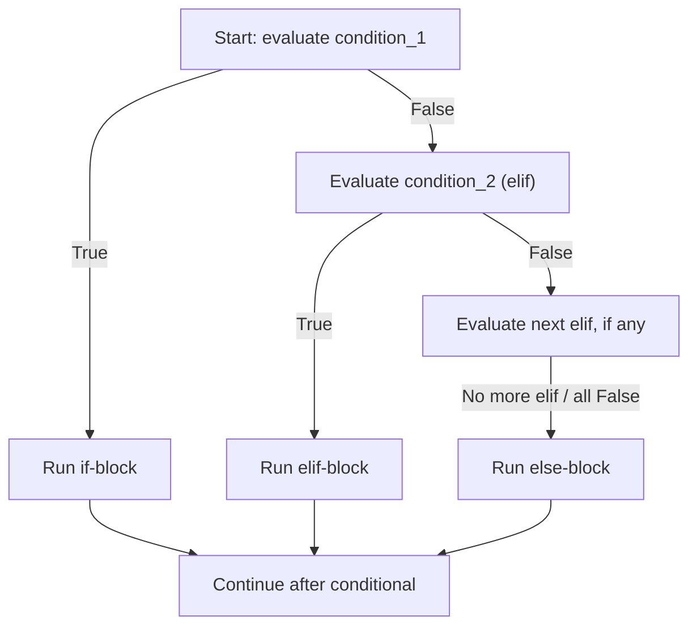

# Conditionals

---

[← Previous: 1.4 Statements, Conversion & Output](../p1-introduction/unit-1-4-statements-conversion-output.md) | [Go back to TOC](../../README.md) | [Next: 2.2 Loops →](unit-2-2-loops.md)

## 1. Learning Objectives

By the end of this unit, you will be able to:

- **Explain** how an `if` statement uses a boolean expression to decide whether a block of code runs.
- **Implement** multi-branch decisions using `if`/`elif`/`else`, ensuring exactly one branch executes.
- **Describe** how indentation defines the structure of a conditional block in Python.
- **Apply** compound boolean expressions (`and`, `or`, `not`, chained comparisons) inside conditions.
- **Differentiate** between a nested conditional and a flattened compound condition, and judge which reads better.
- **Create** compact value-choosing logic using the conditional (ternary) expression.

---

## 2. Overview

Every program you have written so far in this course runs top to bottom, one line after another, with no branching at all. Real software rarely behaves that way. A login screen must respond differently to a correct password than a wrong one. A UPI app must show "Payment Successful" or "Payment Failed" depending on what the bank returns. A food delivery app decides whether an order qualifies for free delivery based on the cart value. None of this is possible without a way to make a decision inside the code itself.

That decision-making ability comes from a **conditional** — a piece of code that asks a yes/no question and runs different statements depending on the answer. The question is always a **boolean expression**, one that evaluates to `True` or `False`, built using the comparison and logical operators you already learned in operators and expressions.

In this unit, you will learn the `if` statement, how to add `elif` and `else` for multi-branch decisions, how to combine conditions using `and`/`or`/`not`, how to nest one conditional inside another, and how to write a compact conditional (ternary) expression for simple two-value choices. Mastering this one skill — asking a question and branching on the answer — is the foundation that every later topic in this course, from loops to functions to real applications, is built on.

---

## 3. Description

### 3.1 Definition

A **conditional** is a control structure that runs one block of code or another depending on whether a **boolean expression** — a condition — evaluates to `True` or `False`. In Python, the primary conditional tool is the `if` statement, optionally extended with `elif` (else if) and `else`:

**Example:**

```python
temperature = 30

if temperature > 25:
    print("It is warm.")
```

Read this as: "if the condition `temperature > 25` is `True`, run the indented block below it." Because `30 > 25` evaluates to `True`, the block runs and `It is warm.` is printed. If `temperature` had been `20`, the condition would be `False`, and Python would skip the block entirely.

### 3.2 Why This Concept Exists

Without conditionals, a program could only ever do exactly one fixed sequence of steps, regardless of the data it was given. Real software constantly needs to:

- **React** differently to different inputs (a correct password versus a wrong one).
- **Classify** a value into one of several categories (a task marked "urgent," "soon," or "whenever").
- **Guard** against unsafe or invalid situations before proceeding (checking a bank balance before allowing a withdrawal).

A conditional solves all three by letting the program's path change based on a boolean test, evaluated fresh every time the program runs. This is why `if`/`elif`/`else` is one of the very first control structures taught in every programming language — nearly nothing beyond simple arithmetic can be built without it.

### 3.3 Key Terminology

| Term | Simple Meaning |
|---|---|
| **Conditional** | A control structure that runs different code depending on whether a condition is `True` or `False`. |
| **Condition** | A boolean expression — one that evaluates to `True` or `False` — attached to an `if` or `elif`. |
| **`if` statement** | The basic conditional: runs its indented block only when its condition is `True`. |
| **`elif`** | Short for "else if"; adds another condition to check, only if all previous conditions were `False`. |
| **`else`** | The catch-all branch with no condition of its own; runs only when every earlier `if`/`elif` was `False`. |
| **Branch** | One possible path of execution inside a conditional — one `if`, `elif`, or `else` block. |
| **Block** | A group of statements indented at the same level, treated by Python as belonging together. |
| **Indentation** | The whitespace at the start of a line that Python uses, instead of braces, to define blocks. |
| **`IndentationError`** | The error Python raises when indentation is inconsistent or missing where a block is expected. |
| **Compound condition** | A condition built by combining two or more boolean expressions with `and`/`or`, or negating one with `not`. |
| **Chained comparison** | Python's shorthand for a range check, e.g. `0 <= score <= 100`, equivalent to `score >= 0 and score <= 100`. |
| **Nesting** | Placing one conditional entirely inside the block of another conditional. |
| **Conditional (ternary) expression** | A one-line expression of the form `value_if_true if condition else value_if_false` that *produces a value*, rather than just directing which statements run. |

### 3.4 Syntax

`if`/`elif`/`else` syntax:

```python
if condition_1:
    statement(s)          # runs only if condition_1 is True
elif condition_2:
    statement(s)          # runs only if condition_1 is False and condition_2 is True
else:
    statement(s)          # runs only if every condition above was False
```

| Part | What it is | Why it's there |
|---|---|---|
| `if` | Keyword that starts the first, mandatory branch. | Every conditional must begin with exactly one `if`. |
| `condition_1` | Any boolean expression Python can evaluate to `True` or `False`. | Decides whether the `if` block runs. |
| `:` | A colon after every condition. | Tells Python "the indented block that follows belongs to this branch." |
| Indented block | One or more statements, indented by the same amount (4 spaces is the standard). | Indentation, not braces, is how Python groups statements into a block. |
| `elif` | Optional keyword, short for "else if." | Adds another condition to check, only reached if all prior conditions were `False`. You may write zero, one, or many `elif` branches. |
| `else` | Optional, final keyword with no condition. | Catches every case not matched by any `if` or `elif` above it. |

**Decision Flow Through `if`/`elif`/`else`**



**Conditional (ternary) expression syntax:**

```
value_if_true if condition else value_if_false
```

| Part | What it is | Why it's there |
|---|---|---|
| `value_if_true` | The value produced when `condition` is `True`. | This is what the whole expression evaluates to on a `True` result. |
| `if condition else` | The test, written between the two possible values. | Reads almost like English: "this value if the condition holds, else that value." |
| `value_if_false` | The value produced when `condition` is `False`. | This is what the whole expression evaluates to on a `False` result. |

**Example:**

```python
age = 20
status = "adult" if age >= 18 else "minor"
print(status)
```

*Line-by-line explanation:*
- `age = 20` stores a whole number to test.
- `status = "adult" if age >= 18 else "minor"` is the ternary expression itself: Python first evaluates the condition `age >= 18`, which is `20 >= 18` → `True`. Because the condition is `True`, the whole expression evaluates to `value_if_true`, the string `"adult"` — `value_if_false` (`"minor"`) is never even looked at. The result is then stored in `status`, exactly like any ordinary assignment.
- `print(status)` displays whatever `status` ended up holding.
- Output:
  ```
  adult
  ```
  If `age` had been `15` instead, `age >= 18` would be `False`, so the expression would evaluate to `"minor"` instead, and that is what `status` would hold and `print()` would display.

### 3.5 Rules

- A conditional must start with exactly one `if`; `elif` and `else` are both optional, and there can be any number of `elif` branches, but at most one `else`, and it must come last.
- Every condition is evaluated **in order, top to bottom**; Python runs the block for the **first** condition that is `True` and then skips every remaining `elif`/`else`, even if a later condition would also have been `True`.
- If no condition is `True` and there is no `else`, Python simply runs nothing and moves on — this is silent, so missing an `else` can hide bugs.
- Every line inside a block must be indented by the same amount; Python's standard is 4 spaces per indentation level. Mixing tabs and spaces, or indenting inconsistently, raises an `IndentationError`.
- Any boolean expression can be a condition, including a variable that already holds `True`/`False`, a comparison (`==`, `!=`, `<`, `>=`, ...), or a compound expression built with `and`, `or`, `not`.
- A conditional (ternary) expression always evaluates to a value — it can be assigned, printed, or passed to another function — unlike an `if`/`else` statement, which only directs control flow and produces no value of its own.

### 3.6 Best Practices

- Put the most specific or most likely condition first in an `elif` chain — since only the first match runs, ordering affects the outcome.
- Include a final `else` whenever an unexpected value should still be handled, rather than silently doing nothing.
- Prefer a flattened `and` condition over nested `if` statements when both conditions are simply required together — `if logged_in and is_admin:` is easier to read than two nested `if` blocks.
- Use parentheses to group compound conditions when mixing `and` and `or`, e.g. `if (age >= 18 and has_id) or is_guest:`, so the intended logic is unambiguous at a glance.
- Use a chained comparison like `0 <= marks <= 100` for range checks instead of `marks >= 0 and marks <= 100` — it is shorter and reads exactly like the mathematical range it represents.
- Reserve the ternary expression for simple, single-line, two-value choices; if you find yourself chaining several ternaries together, switch to a full `if`/`elif`/`else` chain for readability.

### 3.7 Common Mistakes

- **Inconsistent indentation** — mixing 2 spaces and 4 spaces, or tabs and spaces, in the same block raises an `IndentationError`. Every line in a block must line up exactly.
- **Using `=` instead of `==` in a condition** — `if age = 18:` is a `SyntaxError`; assignment and comparison are different operators, and a condition always needs the comparison operator `==`.
- **Wrong branch order in an `elif` chain** — placing a broader condition before a narrower one can make the narrower one unreachable, e.g. checking `score >= 50` before `score >= 90` means the `90` case never gets its own message.
- **Forgetting `else`** — leaving out `else` when an unexpected value is possible means the program silently does nothing, which can hide a real problem instead of reporting it.
- **Over-nesting** — stacking three or four levels of nested `if` statements when a single compound condition with `and`/`or` would say the same thing far more clearly.
- **Overusing the ternary expression** — chaining several ternary expressions together to cover more than two outcomes produces a line that is technically valid but very hard to read; a full `if`/`elif`/`else` chain is the better choice there.

### 3.8 Code Examples

The examples below all build **one single scenario** — a food delivery app called **TastyBite** deciding how to handle an order. Each step adds exactly one new conditional idea on top of the last, so by the end you will have seen a plain `if`/`else`, an `elif` chain, a compound condition, nesting, and a ternary expression all working together on the same problem.

**Step 1 — a single `if`/`else`:** is the restaurant even open?

```python
restaurant_open = True

if restaurant_open:
    print("Welcome to TastyBite!")
else:
    print("Restaurant is currently closed.")

print("Thanks for checking.")
```

*Line-by-line explanation:*
- `restaurant_open = True` creates a `bool` variable representing one real fact about the restaurant right now.
- `if restaurant_open:` evaluates that variable directly — a variable that already holds `True`/`False` is itself a valid boolean expression.
- Because `restaurant_open` is `True`, the `if` block runs and the `else` block is skipped.
- `print("Thanks for checking.")` is not indented, so it is outside the conditional entirely and always runs, regardless of which branch fired.
- Output:
  ```
  Welcome to TastyBite!
  Thanks for checking.
  ```

**Step 2 — an `elif` chain:** classify the cart value into a delivery-fee tier.

```python
cart_value = 350.0

if cart_value >= 500:
    delivery_fee = 0.0
elif cart_value >= 200:
    delivery_fee = 20.0
else:
    delivery_fee = 40.0

print("Delivery fee: Rs.", delivery_fee)
```

*Line-by-line explanation:*
- `cart_value = 350.0` holds a `float`, the total value of items in the cart.
- Conditions are checked **top to bottom**: `cart_value >= 500` is `350.0 >= 500` → `False`, so Python moves on.
- `elif cart_value >= 200` is `350.0 >= 200` → `True`, so `delivery_fee` is set to `20.0` and every branch after this one is skipped.
- Output:
  ```
  Delivery fee: Rs. 20.0
  ```

**Step 3 — a compound condition:** a premium member should also get free delivery, even with a smaller cart.

```python
cart_value = 350.0
is_premium_member = True

if cart_value >= 500 or is_premium_member:
    delivery_fee = 0.0
else:
    delivery_fee = 40.0

print("Delivery fee: Rs.", delivery_fee)
```

*Line-by-line explanation:*
- `is_premium_member = True` adds a second fact the decision now depends on.
- The compound condition `cart_value >= 500 or is_premium_member` is `True` if **either** part is `True`. Here `350.0 >= 500` is `False`, but `is_premium_member` is `True`, so the whole `or` expression is `True` — only one side needs to hold.
- `delivery_fee` is set to `0.0`, and the plain `else` (`40.0`) is skipped.
- Output:
  ```
  Delivery fee: Rs. 0.0
  ```

**Step 4 — nesting:** the fee only matters if the restaurant is open in the first place, so the Step 3 logic now lives inside the Step 1 check.

```python
restaurant_open = True
cart_value = 350.0
is_premium_member = True

if restaurant_open:
    if cart_value >= 500 or is_premium_member:
        delivery_fee = 0.0
    else:
        delivery_fee = 40.0
    print("Delivery fee: Rs.", delivery_fee)
else:
    print("Restaurant is currently closed.")
```

*Line-by-line explanation:*
- The outer `if restaurant_open:` is checked first — there is no point computing a delivery fee for a closed restaurant.
- Because `restaurant_open` is `True`, Python enters the outer block and only then evaluates the inner `if cart_value >= 500 or is_premium_member:` from Step 3.
- The inner condition is `True` (because `is_premium_member` is `True`), so `delivery_fee` becomes `0.0` and the inner `print()` reports it.
- The outer `else` (`"Restaurant is currently closed."`) is never reached, because the outer condition was already `True`.
- Output:
  ```
  Delivery fee: Rs. 0.0
  ```
- Note that "what is the fee?" is only meaningful once we already know the restaurant is open — that dependency is exactly why nesting makes sense here, rather than flattening everything into one compound condition.

**Step 5 — a ternary expression:** turn the numeric fee into a short label for the screen.

```python
restaurant_open = True
cart_value = 350.0
is_premium_member = True

if restaurant_open:
    if cart_value >= 500 or is_premium_member:
        delivery_fee = 0.0
    else:
        delivery_fee = 40.0
    print("Delivery fee: Rs.", delivery_fee)

    order_label = "Free Delivery" if delivery_fee == 0.0 else "Delivery Charges Apply"
    print(order_label)
else:
    print("Restaurant is currently closed.")
```

*Line-by-line explanation:*
- The first five lines inside `if restaurant_open:` are exactly the nested logic from Step 4, so `delivery_fee` ends up `0.0` for the same reason as before.
- `order_label = "Free Delivery" if delivery_fee == 0.0 else "Delivery Charges Apply"` is a conditional (ternary) expression: Python evaluates `delivery_fee == 0.0`, finds it `True`, and the whole expression produces the value `"Free Delivery"` — `"Delivery Charges Apply"` is never even looked at. That value is stored in `order_label`, exactly like any ordinary assignment.
- This ternary line is placed inside the same `if restaurant_open:` block, because `delivery_fee` only exists once the restaurant has been confirmed open.
- Output:
  ```
  Delivery fee: Rs. 0.0
  Free Delivery
  ```
  If `cart_value` had been `120.0` and `is_premium_member` had been `False`, `delivery_fee` would be `40.0` instead, and `order_label` would evaluate to `"Delivery Charges Apply"`.

#### Try It Yourself

**Exercise — TastyBite Order Checker:** using the same TastyBite scenario, write the following in order. Try each part yourself before checking the solution.

**Part A (easiest):** Write a single `if`/`else` using `restaurant_open = False`. Print `"Order Now!"` if the restaurant is open, otherwise print `"Come back later."`.

**Solution:**

```python
restaurant_open = False

if restaurant_open:
    print("Order Now!")
else:
    print("Come back later.")
```

Expected output:
```
Come back later.
```

**Part B (medium):** Given `cart_value = 180.0` and `is_premium_member = False`, write an `if`/`elif`/`else` chain that sets `delivery_fee` to `0.0` if `cart_value >= 500` **or** `is_premium_member` is `True`, otherwise `20.0` if `cart_value >= 100`, otherwise `40.0`. Print the fee.

**Solution:**

```python
cart_value = 180.0
is_premium_member = False

if cart_value >= 500 or is_premium_member:
    delivery_fee = 0.0
elif cart_value >= 100:
    delivery_fee = 20.0
else:
    delivery_fee = 40.0

print("Delivery fee: Rs.", delivery_fee)
```

Expected output:
```
Delivery fee: Rs. 20.0
```

**Part C (hardest):** Combine everything: given `restaurant_open = True`, `cart_value = 620.0`, and `is_premium_member = False`, nest the Part B fee logic inside a check for `restaurant_open`, then add a ternary expression that stores `"Free Delivery"` in `order_label` if `delivery_fee == 0.0`, otherwise `"Delivery Charges Apply"`. Print the fee and the label.

**Solution:**

```python
restaurant_open = True
cart_value = 620.0
is_premium_member = False

if restaurant_open:
    if cart_value >= 500 or is_premium_member:
        delivery_fee = 0.0
    elif cart_value >= 100:
        delivery_fee = 20.0
    else:
        delivery_fee = 40.0
    print("Delivery fee: Rs.", delivery_fee)

    order_label = "Free Delivery" if delivery_fee == 0.0 else "Delivery Charges Apply"
    print(order_label)
else:
    print("Restaurant is currently closed.")
```

Expected output:
```
Delivery fee: Rs. 0.0
Free Delivery
```

---

## 4. Real-World Application

- **Banking & FinTech:** A withdrawal request checks `if amount <= balance:` before allowing money to leave an account — one wrong branch order here could allow an overdraft.
- **UPI / Payment Systems:** A payment confirmation screen uses `if`/`else` to show "Payment Successful" or "Payment Failed," and a nested check can further classify a failure as "Insufficient Balance" or "Bank Server Error."
- **E-commerce:** A checkout page decides shipping cost using conditions on cart value and membership status — exactly the pattern in the food delivery example above.
- **Healthcare:** A patient monitoring screen classifies a temperature reading into "Normal," "Fever," or "High Fever" using an `if`/`elif`/`else` chain — the same multi-branch pattern you just used to classify task priority in the worked example below.
- **Railway Booking (IRCTC-style systems):** A booking system checks `if seats_available > 0:` before confirming a ticket, and nests a further check for whether the passenger holds a valid concession category.
- **AI/ML:** A model's output confidence score is often turned into a decision using a conditional — `if confidence >= 0.8:` accept the prediction, otherwise flag it for human review.

---

## 5. Worked Example

### Problem Statement

You are asked to build a task classifier for a to-do list app. Given a task's priority (`1`, `2`, or `3`) and whether the task is currently blocked by a dependency, the program must print exactly one message describing what to do with that task. A blocked task must always show as blocked, regardless of its priority.

### Step 1: Understand the Problem

There are two pieces of information: `priority` (a whole number, `1` to `3`) and `is_blocked` (a `bool`). The output depends on both, but blocked status must always win — even an urgent task cannot be worked on if it is blocked. An invalid priority (anything other than `1`, `2`, or `3`) must still produce a sensible message rather than nothing at all.

### Step 2: Plan the Solution

Check `is_blocked` first, since it overrides every other case. If the task is not blocked, chain `elif` branches to classify the priority, from most urgent to least urgent, ending with an `else` to catch any priority value that isn't `1`, `2`, or `3`.

### Step 3: Write the Python Code

```python
priority = int(input("Enter task priority (1-3): "))
is_blocked = input("Is this task blocked? (yes/no): ") == "yes"

if is_blocked:
    print("Blocked — resolve dependency first.")
elif priority == 1:
    print("Urgent — do it now.")
elif priority == 2:
    print("Soon — do it today.")
elif priority == 3:
    print("Whenever — no rush.")
else:
    print("Unknown priority. Please enter 1, 2, or 3.")
```

### Step 4: Explain Each Line

- `priority = int(input(...))` reads text from the user and converts it to an `int` using type conversion, so it can be compared numerically.
- `is_blocked = input(...) == "yes"` reads the user's yes/no answer and immediately compares it to the string `"yes"`, storing the resulting `bool` directly in `is_blocked` — no separate `if` needed for this conversion.
- `if is_blocked:` is checked first, before any priority check, so a blocked task is reported as blocked no matter what its priority is.
- `elif priority == 1:`, `elif priority == 2:`, `elif priority == 3:` run only if `is_blocked` was `False`, and only the first matching one executes.
- `else:` catches any priority value outside `1`–`3`, ensuring the program always prints something meaningful.

### Step 5: Sample Input

```
Enter task priority (1-3): 1
Is this task blocked? (yes/no): yes
```

### Step 6: Expected Output

```
Blocked — resolve dependency first.
```

### Step 7: Why the Output Is Produced

Even though `priority` is `1` — which would normally match the "Urgent" branch — the very first condition checked is `is_blocked`, and it evaluates to `True` because the user typed `"yes"`. Since Python evaluates conditions top to bottom and stops at the first match, the `is_blocked` branch runs and every branch below it, including the priority checks, is skipped entirely. This is exactly why the blocked check must be placed **first**: had the priority checks come before it, an urgent-but-blocked task would have incorrectly printed "Urgent — do it now."

---

### Important Notes (Interview Insights)

**Q: "What happens if two `elif` conditions are both `True`?"**

Only the **first** one that is `True` runs — Python never checks the remaining conditions once a match is found.

**Q: "Why does Python use indentation instead of braces `{ }` to define blocks?"**

Indentation is not just a style choice, it is part of Python's grammar, and inconsistent indentation is a compile-time-like error (`IndentationError`), not just a warning.

**Q: "Can you convert a short `if`/`else` into a ternary expression, or vice versa?"**

You may be asked to do this to check that you understand that a plain `if`/`else` is a **statement** (directs control flow, produces no value), while a conditional expression **produces a value** that can be stored, printed, or passed onward.

**Q: "When is nesting `if` statements appropriate versus when should it be flattened?"**

Nesting is justified only when the inner decision has its own `else` that doesn't apply to the outer branch's other paths; otherwise, an `and` almost always simplifies the code.

---

## 6. Key Takeaways

- A **conditional** runs one branch of code or another based on a boolean expression evaluating to `True` or `False`.
- `if`/`elif`/`else` is evaluated **top to bottom**, and only the **first** `True` condition's block runs — order matters.
- **Indentation** is part of Python's grammar, not just style; inconsistent indentation raises an `IndentationError`.
- `else` is optional but recommended whenever an unhandled case should still produce a sensible response.
- **Compound conditions** combine tests with `and` (both must be `True`), `or` (at least one must be `True`), and `not` (flips a boolean); chained comparisons like `0 <= x <= 100` are Python's shorthand for a range check.
- **Nesting** places one conditional inside another and is best reserved for when the inner decision only makes sense after the outer one is answered; flatten with `and` whenever both conditions are simply required together.
- The **conditional (ternary) expression** — `value_if_true if condition else value_if_false` — produces a value in a single line, unlike a plain `if`/`else` statement, and is best used for simple two-outcome choices.
- A common interview question is explaining why only one branch of an `if`/`elif`/`else` chain ever runs, and how that differs from a ternary expression producing a value directly.

Coming next: loops, where you will learn how Python repeats a block of code instead of making the same decision only once.

---

## 7. Reference Links

- [The Python Tutorial — More Control Flow Tools (if Statements)](https://docs.python.org/3/tutorial/controlflow.html#if-statements)
- [Python 3 Language Reference — Compound Statements (if)](https://docs.python.org/3/reference/compound_stmts.html#the-if-statement)
- [Python 3 Documentation — Conditional Expressions](https://docs.python.org/3/reference/expressions.html#conditional-expressions)
- [Real Python — Conditional Statements in Python](https://realpython.com/python-conditional-statements/)
- [W3Schools — Python If...Else](https://www.w3schools.com/python/python_conditions.asp)

[← Previous: 1.4 Statements, Conversion & Output](../p1-introduction/unit-1-4-statements-conversion-output.md) | [Go back to TOC](../../README.md) | [Next: 2.2 Loops →](unit-2-2-loops.md)

---

*© 2026 Revature · AI Native Engineering — Foundations · Unit 2.1 · Version 2.0*
