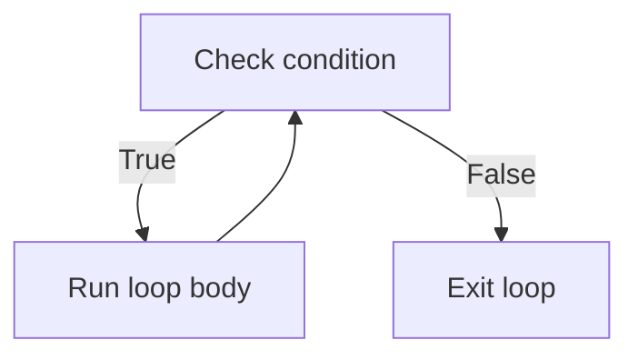
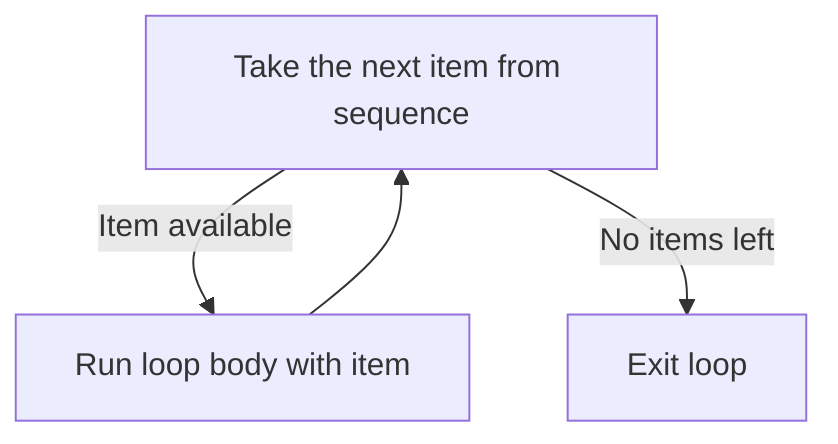

# Loops

---

[← Previous: 2.1 Conditionals](unit-2-1-conditionals.md) | [Go back to TOC](../../README.md) | [Next: 2.3 Functions →](unit-2-3-functions.md)

## 1. Learning Objectives

By the end of this unit, you will be able to:

- **Explain** how a `while` loop repeats a block based on a condition, and how a `for` loop repeats a block once for each item in a sequence.
- **Implement** `range()` to generate numeric sequences using `start`, `stop`, and `step`, and use it to drive a `for` loop a fixed number of times.
- **Apply** `enumerate()` to track a position while looping and `zip()` to walk two sequences together in step.
- **Differentiate** between `break` and `continue`, and predict exactly how each one changes a loop's execution.
- **Debug** the classic infinite-loop mistake and the off-by-one errors that come from misreading `range()`.
- **Create** nested loops to solve grid-shaped problems such as tables, seat charts, and reports.

---

## 2. Overview

Every program you've written so far in this course runs each line exactly once, top to bottom. Real software rarely works that way. A banking app checks every transaction in a statement. A food delivery app polls an order's status again and again until it's delivered. An e-commerce site prints every item in an invoice, however many there are. Writing the same `print()` statement fifty times is not a solution — it doesn't scale, and it breaks the moment the number of items changes. What you need is a way to tell Python: "repeat this block, either while some condition holds, or once for every item in a sequence."

That mechanism is called a **loop**, and it is one of the core control-flow structures, alongside conditionals, which you already learned. Python gives you exactly two loop keywords — `while`, which repeats *as long as* a condition stays `True`, and `for`, which repeats *once per item* in a sequence. Around these two keywords sit a small toolkit that makes looping practical in real code: `range()` to generate numbers to loop over, `enumerate()` to track position, `zip()` to walk two sequences together, and `break`/`continue` to redirect a loop's flow from inside its own body. Indian IT companies test loop fundamentals in nearly every entry-level coding round — this unit is the foundation for almost everything you will build from here on.

---

## 3. Description

### 3.1 Definition

A **loop** is a control structure that repeats a block of code — the **loop body** — multiple times, either until a condition becomes `False` or until a sequence of items is exhausted. Each single repetition of the loop body is called an **iteration**. Python provides two loop statements: the `while` loop, which is condition-driven, and the `for` loop, which is sequence-driven.

```python
for letter in "hi":
    print(letter)
```

Read this as "for each `letter` in the text `"hi"`, run the block below." It runs the block twice — once with `letter` set to `"h"`, once with `letter` set to `"i"` — printing `h` and then `i`.

### 3.2 Why This Concept Exists

Without loops, repeating an action a hundred times would mean writing that action out a hundred times by hand — and the moment the count changes from a hundred to a thousand, the whole program has to be rewritten. Real software constantly needs to:

- **Repeat** an action a known number of times (print every row of a report, charge every item in a cart).
- **Repeat** an action until something changes (keep asking for a valid PIN until it's entered correctly).
- **Walk through** every item in a collection of data, one at a time, without knowing in advance how many items there are.

A loop solves all three with one mechanism: write the repeating action once, and let Python run it as many times as needed. This is why loops, right after conditionals, are the next concept every programming course teaches — nearly all real logic is "do this for every X" or "keep doing this until Y."

### 3.3 Key Terminology

| Term | Simple Meaning |
|---|---|
| **Loop** | A control structure that repeats a block of code multiple times. |
| **Loop body** | The indented block of statements that gets repeated. |
| **Iteration** | One single run through the loop body. |
| **`while` loop** | A loop that repeats as long as a given condition stays `True`. |
| **`for` loop** | A loop that repeats once for each item in a sequence. |
| **Loop variable** | The name that takes on each item's value in turn during a `for` loop. |
| **Iterable / sequence** | Something a `for` loop can walk through one item at a time — a string, a `range()`, or the result of `enumerate()`/`zip()`. |
| **`range()`** | A built-in function that produces a sequence of integers, controlled by `start`, `stop`, and `step`. |
| **`enumerate()`** | A built-in function that pairs each item in a sequence with an index, starting at `0` by default. |
| **`zip()`** | A built-in function that walks two (or more) sequences together, producing one item from each per pass. |
| **`break`** | A keyword that immediately ends the loop entirely, skipping any remaining iterations. |
| **`continue`** | A keyword that skips the rest of the current iteration and moves straight to the next one. |
| **Infinite loop** | A loop whose condition never becomes `False`, so it never stops on its own. |
| **Nested loop** | A loop placed inside the body of another loop. |
| **Off-by-one error** | A bug where a loop runs one time too many or one time too few, often caused by misreading `range()`'s exclusive stop value. |

### 3.4 Syntax

**`while` loop:**

```python
while condition:
    # loop body
```

| Part | What it is | Why it's there |
|---|---|---|
| `while` | The keyword that starts a condition-driven loop. | Tells Python to keep re-checking the condition. |
| `condition` | Any expression that evaluates to `True` or `False`. | Re-checked before every single iteration, including the first. |
| Indented block | The loop body. | Runs once per iteration, as long as `condition` is `True`. |

**`while` Loop**



Read this as: Python checks the condition first — if it's `True`, the body runs once, then control goes straight back to re-checking the condition. This repeats for as long as the condition stays `True`. The moment the condition is `False`, the loop exits without running the body again.

**`for` loop:**

```python
for item in sequence:
    # loop body
```

| Part | What it is | Why it's there |
|---|---|---|
| `for` ... `in` | Keywords that start a sequence-driven loop. | Tells Python to walk through `sequence` one item at a time. |
| `item` | The **loop variable** — your chosen name. | Holds the current item's value during each iteration. |
| `sequence` | Anything Python can iterate over — a string, `range(...)`, `enumerate(...)`, or `zip(...)`. | Defines what values `item` will take, and how many iterations run. |

**`for` Loop**



Read this as: Python pulls one item at a time from `sequence` and runs the body once with that item. This repeats automatically for every item — there is no condition to check yourself. The moment the sequence runs out of items, the loop exits on its own.

**Comparison Table: `for` Loop vs `while` Loop**

| Aspect | `for` Loop | `while` Loop |
|---|---|---|
| Driven by | A sequence (string, `range()`, etc.) | A condition (`True`/`False`) |
| Iteration count | Known in advance — equals the length of the sequence | Not known in advance — depends on when the condition turns `False` |
| Risk of infinite loop | None — it always ends when the sequence ends | Real risk if the condition never becomes `False` |
| Typical use case | "Do this for every item / N times" | "Keep doing this until some event happens" |
| Needs a manual counter? | No — the loop variable is managed automatically | Often yes, unless the condition depends on something external (like user input) |

**`range()`, `enumerate()`, `zip()`:**

| Call | Meaning | Example | Produces |
|---|---|---|---|
| `range(stop)` | Integers from `0` up to (not including) `stop`. | `range(5)` | `0, 1, 2, 3, 4` |
| `range(start, stop)` | Integers from `start` up to (not including) `stop`. | `range(2, 6)` | `2, 3, 4, 5` |
| `range(start, stop, step)` | Integers from `start` to `stop`, counting by `step`. | `range(0, 10, 2)` | `0, 2, 4, 6, 8` |
| `enumerate(sequence)` | Pairs each item with an index, starting at `0`. | `enumerate("hi")` | `(0, 'h'), (1, 'i')` |
| `enumerate(sequence, start)` | Same, but the index begins at `start`. | `enumerate("hi", 1)` | `(1, 'h'), (2, 'i')` |
| `zip(seq1, seq2)` | Pairs items from two sequences, position by position. | `zip("ab", "12")` | `('a','1'), ('b','2')` |

**`break` and `continue`:**

| Keyword | Effect | Where it belongs |
|---|---|---|
| `break` | Ends the loop immediately — no further iterations run. | Inside a loop body, usually behind an `if`. |
| `continue` | Skips the rest of the current iteration and jumps to the next one. | Inside a loop body, usually behind an `if`. |

### 3.5 Rules

- A `while` loop's condition is checked **before** every iteration, including the very first — if it's `False` to start with, the body never runs even once.
- A `for` loop's iteration count is decided entirely by the sequence it walks — you never write a stop condition yourself.
- `range()`'s `stop` value is always **exclusive** — `range(5)` never includes `5`.
- `zip()` stops the moment the **shorter** of its sequences runs out — no error, no warning, the extra items in the longer sequence are simply ignored.
- `break` and `continue` are only valid **inside** a loop body; using them outside a loop raises a `SyntaxError`.
- In a nested loop, `break` and `continue` only affect the **innermost** loop they are written in — they never reach out to an outer loop.

### 3.6 Best Practices

- Use a `for` loop whenever you already know what you're iterating over (a fixed range, a string, a sequence). Use a `while` loop only when you're repeating until some condition changes and you can't know the count in advance.
- Always double-check that a `while` loop has something in its body that moves its condition toward `False` — read that line back to yourself before running the code.
- Prefer `range()` over manually managing a counter variable with a `while` loop when you just need to repeat something a fixed number of times.
- Name loop variables for what they represent — `for student in ...` reads far better than `for x in ...`.
- Keep nested loops to two levels wherever possible; if you need a third level, consider whether the logic can be simplified first.
- Use `break` and `continue` sparingly and always pair them with a clear `if` condition — a loop with `break`/`continue` scattered everywhere becomes hard to trace.

### 3.7 Common Mistakes

- **Writing an infinite loop** — forgetting to update the variable a `while` condition depends on, so the condition is always `True` and the loop never ends.
- **Off-by-one errors with `range()`** — expecting `range(5)` to include `5`, or expecting `range(1, 5)` to include five numbers instead of four.
- **Assuming `break` exits every enclosing loop** — in a nested loop, `break` only exits the loop it is directly written inside; the outer loop keeps running unless it is told to stop separately.
- **Using `continue` and expecting it to end the loop** — `continue` only skips to the next iteration; it does not stop the loop the way `break` does.
- **Forgetting that `zip()` silently truncates** — pairing sequences of different lengths and being surprised that some items from the longer one never appear.
- **Modifying the loop variable inside a `for` loop** — reassigning the loop variable inside the body has no effect on which item comes next; the `for` loop still advances on its own.

### 3.8 Code Examples

One scenario runs through this entire section: a railway booking clerk is searching for the first available seat across three coaches (numbered `1` to `3`), each with five seats (numbered `1` to `5`). Each part below tackles a piece of that same scenario with a different loop tool, building up to the full search.

**Part 1** — checking coaches one by one with a `while` loop:

```python
coach = 1

while coach <= 3:
    print("Checking Coach", coach)
    coach = coach + 1
```

*Line-by-line explanation:*
- `coach = 1` creates the variable that the loop's condition depends on — the clerk starts at coach `1`.
- `while coach <= 3:` checks the condition before every iteration; as long as it's `True`, the body runs.
- `print("Checking Coach", coach)` announces which coach is currently being checked.
- `coach = coach + 1` is the crucial line — it moves `coach` closer to making the condition `False`. Without it, this loop would never stop.
- Output:
  ```
  Checking Coach 1
  Checking Coach 2
  Checking Coach 3
  ```
  Once `coach` becomes `4`, `4 <= 3` is `False`, and the loop ends.

**Part 2** — the same check, written as a `for` loop with `range()`:

```python
for coach in range(1, 4):
    print("Checking Coach", coach)
```

*Line-by-line explanation:*
- `range(1, 4)` produces the integers `1, 2, 3` — starting at `1`, stopping before `4`.
- `for coach in range(1, 4):` binds `coach` to each of those integers, one per iteration, three iterations in total.
- `print("Checking Coach", coach)` runs once per iteration with the current value of `coach`.
- Output:
  ```
  Checking Coach 1
  Checking Coach 2
  Checking Coach 3
  ```
  This is exactly the same output as Part 1, but with no counter to manage by hand — `range()` and the `for` loop take care of that entirely.

**Part 3** — checking coach names and seat counts together with `enumerate()` and `zip()`:

```python
coach_names = ("S1", "S2", "S3")
seats_available = (0, 5, 3)

for position, name in enumerate(coach_names, 1):
    print("Position", position, "-> Coach", name)

for name, seats in zip(coach_names, seats_available):
    print("Coach", name, "has", seats, "seat(s) available")
```

*Line-by-line explanation:*
- `coach_names` and `seats_available` are two short, fixed sequences of values written directly in parentheses — for now, just think of them as ready-made lists of values to loop over (you'll learn their proper name, tuples, in a later module).
- `enumerate(coach_names, 1)` pairs each coach name with a position counter that starts at `1` instead of the default `0`.
- The first loop prints each coach's position in the train alongside its name.
- `zip(coach_names, seats_available)` walks both sequences together, pairing `"S1"` with `0`, `"S2"` with `5`, and `"S3"` with `3` — one pair per iteration.
- The second loop prints each coach name next to how many seats it currently has free.
- Output:
  ```
  Position 1 -> Coach S1
  Position 2 -> Coach S2
  Position 3 -> Coach S3
  Coach S1 has 0 seat(s) available
  Coach S2 has 5 seat(s) available
  Coach S3 has 3 seat(s) available
  ```

**Part 4** — putting it together: searching for one free seat with nested loops, `continue`, and `break`:

```python
seat_found = False

for coach, seats in zip(range(1, 4), seats_available):
    if seats == 0:
        print("Coach", coach, "is full. Skipping to next coach.")
        continue
    for seat in range(1, 6):
        if coach == 2 and seat == 3:
            print(f"Seat {seat} in Coach {coach} is available. Booking now.")
            seat_found = True
            break
    if seat_found:
        break

if not seat_found:
    print("No seats available on this route.")
```

*Line-by-line explanation:*
- `seat_found = False` is a flag that tracks whether the search has succeeded yet.
- `for coach, seats in zip(range(1, 4), seats_available):` walks through coach numbers `1, 2, 3` together with their seat counts from Part 3 (`0, 5, 3`), pairing each coach with its own count.
- `if seats == 0: ... continue` skips a full coach immediately — it prints a message, then jumps straight to the next coach without ever looking at its seats. Coach `1` has `0` seats available, so this fires for it.
- The inner `for seat in range(1, 6):` only runs for a coach that has at least one seat free; it walks through seats `1` to `5` inside the current coach. An inner loop running inside the body of an outer loop like this is called a **nested loop**.
- `if coach == 2 and seat == 3:` simulates finding a free seat — in a real system this condition would check a database instead.
- `break` inside the inner loop stops scanning seats **only within the current coach** — it does not touch the outer loop.
- `if seat_found: break` right after the inner loop is what actually stops the outer loop too — this is exactly why the common mistake in §3.7 matters: one `break` alone would not have been enough to leave both loops.
- If no seat is ever found across every coach, `seat_found` stays `False`, and the final `if` prints a "no seats" message.
- Output:
  ```
  Coach 1 is full. Skipping to next coach.
  Seat 3 in Coach 2 is available. Booking now.
  ```

#### Try It Yourself

Using the same scenario — a train with coaches numbered `1` to `3`, each holding seats numbered `1` to `5` — work through the following, building up from a single loop to a full nested search.

**Part A:** A fourth coach, Coach `4`, has just been attached to the train. Write a `for` loop using `range()` that prints every seat number from `1` to `5` for Coach `4`, in the format `"Coach 4, Seat 1"`, `"Coach 4, Seat 2"`, and so on.

**Solution:**

```python
for seat in range(1, 6):
    print("Coach 4, Seat", seat)
```

Expected output:
```
Coach 4, Seat 1
Coach 4, Seat 2
Coach 4, Seat 3
Coach 4, Seat 4
Coach 4, Seat 5
```

**Part B:** Coach `4`'s seat statuses, in seat order from `1` to `5`, are: `("Booked", "Booked", "Free", "Booked", "Free")`. Use `enumerate()` to print each seat number next to its status, in the format `"Seat 1: Booked"`.

**Solution:**

```python
coach_4_status = ("Booked", "Booked", "Free", "Booked", "Free")

for seat, status in enumerate(coach_4_status, 1):
    print(f"Seat {seat}: {status}")
```

Expected output:
```
Seat 1: Booked
Seat 2: Booked
Seat 3: Free
Seat 4: Booked
Seat 5: Free
```

**Part C:** Using the same `coach_4_status` sequence from Part B, write a loop that finds the **first** free seat and prints `"First free seat in Coach 4 is Seat <n>"`, then stops searching immediately (`break`) — booked seats should be skipped silently (`continue`) without printing anything for them. If no free seat exists at all, print `"Coach 4 is fully booked."` instead.

**Solution:**

```python
coach_4_status = ("Booked", "Booked", "Free", "Booked", "Free")
free_seat_found = False

for seat, status in enumerate(coach_4_status, 1):
    if status == "Booked":
        continue
    print("First free seat in Coach 4 is Seat", seat)
    free_seat_found = True
    break

if not free_seat_found:
    print("Coach 4 is fully booked.")
```

Expected output:
```
First free seat in Coach 4 is Seat 3
```

---

## 4. Real-World Application

- **Banking & FinTech:** An ATM PIN entry screen uses a `while` loop with a maximum of three attempts — it keeps asking for a PIN until it's correct or the attempt count runs out, then `break`s the moment the correct PIN is entered.
- **UPI / Payment Systems:** A payment status checker uses `while True:` paired with `break` — it keeps polling "is this transaction complete?" and stops the instant the payment succeeds or fails.
- **E-commerce:** Calculating the total bill for a cart walks through every item with a `for` loop, adding each item's price to a running total — exactly the "repeat for every item" pattern `for` loops exist for.
- **Food Delivery:** Assigning delivery partners to orders often uses nested loops — the outer loop walks through orders, the inner loop walks through available partners, and a `break` fires the moment a suitable match is found.
- **Healthcare:** A hospital's patient monitoring dashboard uses a loop to keep checking a patient's vitals reading, skipping (`continue`) a check if a sensor briefly reports no data, without ending the entire monitoring loop.
- **Railway Booking (IRCTC-style systems):** Searching for an available seat across coaches, exactly as shown in the example above, is a textbook use of nested loops and `break`.
- **Education / Student Life:** A teacher's attendance system loops through roll numbers with `enumerate()` to print position and status together, using `continue` to skip absent students and `break` to stop early if class is dismissed.

---

## 5. Worked Example

### Problem Statement

A class teacher is taking attendance in roll-number order for six students. The attendance for each roll number, in order, is already known: `("Present", "Present", "Absent", "Present", "Left", "Present")`. Write a program that goes through the students starting from roll number `1`, prints `"Roll <n>: Present"` for every present student, silently skips absent students, and stops attendance completely the moment it reaches a student marked `"Left"` (simulating the teacher being called away before finishing).

### Step 1: Understand the Problem

You need to walk through a fixed sequence of attendance values while also tracking each student's roll number, which starts at `1`, not `0`. Present students should be printed. Absent students should be skipped without printing anything for them. The moment a `"Left"` status is seen, attendance must stop entirely — any roll numbers after it should never be checked.

### Step 2: Plan the Solution

Use `enumerate()` on the attendance sequence with `start=1` so the roll number lines up naturally with each status. Inside the loop, check `"Left"` first and `break` if it's found. Then check `"Absent"` and `continue` to skip it. Otherwise, the student is present, so print the roll number.

### Step 3: Write the Python Code

```python
attendance = ("Present", "Present", "Absent", "Present", "Left", "Present")

for roll, status in enumerate(attendance, 1):
    if status == "Left":
        print(f"Roll {roll}: Attendance stopped - teacher called away.")
        break
    if status == "Absent":
        continue
    print(f"Roll {roll}: Present")
```

### Step 4: Explain Each Line

- `attendance = (...)` stores the six known statuses in order, exactly as given in the problem.
- `for roll, status in enumerate(attendance, 1):` walks through `attendance` one status at a time, pairing each with a roll number starting at `1` rather than `0`.
- `if status == "Left": ... break` checks for the stop condition first; the moment it's `True`, a message prints and `break` ends the loop immediately — no further roll numbers are checked.
- `if status == "Absent": continue` catches the absent case next; `continue` skips straight back to the top of the loop without running the final `print()` for that student.
- `print(f"Roll {roll}: Present")` only runs for students who are neither `"Left"` nor `"Absent"` — that is, present students — because both earlier checks would have already skipped or stopped the loop otherwise.

### Step 5: Sample Input

None. The attendance sequence is fixed directly in the code for this example; no user input is involved.

### Step 6: Expected Output

```
Roll 1: Present
Roll 2: Present
Roll 4: Present
Roll 5: Attendance stopped - teacher called away.
```

### Step 7: Why the Output Is Produced

Roll `1` and roll `2` are `"Present"`, so both print normally. Roll `3` is `"Absent"`, so `continue` skips it silently — no line prints for roll `3`. Roll `4` is `"Present"` again, so it prints. Roll `5` is `"Left"`, which triggers the `break` — its stop message prints, and the loop ends immediately, which is exactly why roll `6` (which is actually `"Present"` in the data) is never reached or printed. The output shows precisely four lines, in order, matching this trace.

---

### Important Notes (Interview Insights)

**Q: "What is the difference between `break` and `continue`?"**

`break` exits the loop entirely; `continue` skips only the current iteration and moves to the next one. Confusing the two is one of the fastest ways to lose marks in a coding round.

**Q: "Why does `range(5)` produce five numbers, `0` to `4`, not `1` to `5`?"**

This exclusive-stop behavior is one of the most frequently tested "gotcha" questions for beginners — `range(5)` starts at `0` by default and stops before reaching `5`, producing exactly five values: `0, 1, 2, 3, 4`.

**Q: "Can you trace through a nested loop by hand and state exactly how many total iterations run?"**

The answer is always (outer iterations) × (inner iterations). Practicing this trace on paper builds real confidence.

**Q: "Is `while True:` combined with a `break` a bug or a legitimate pattern?"**

It's a legitimate, common pattern — not a bug — used whenever a loop should run until some event happens rather than for a fixed number of times (for example, retrying a login until it succeeds).

---

## 6. Key Takeaways

- A **`while`** loop repeats as long as its condition is `True`; it must contain something that eventually makes the condition `False`, or it becomes an **infinite loop**.
- A **`for`** loop repeats once per item in a sequence, with no condition to manage — it ends automatically when the sequence is exhausted.
- **`range(start, stop, step)`** generates integers with an **exclusive** stop value — `range(5)` never includes `5`.
- **`enumerate()`** pairs each item with an index (default starting at `0`); **`zip()`** walks two sequences together and stops at the shorter one.
- **`break`** exits a loop immediately; **`continue`** skips only the current iteration and moves to the next one.
- In a **nested loop**, `break` and `continue` affect only the innermost loop they are written inside — an outer loop needs its own separate exit logic.
- Use a `for` loop when you know what you're iterating over; use a `while` loop when you're repeating until a condition changes.
- The two most common loop bugs are the **infinite loop** (forgetting to update a `while` condition) and the **off-by-one error** (misreading `range()`'s exclusive stop).

Coming next: functions, where you'll learn to package a block of logic — including loops — under a name, so you can reuse it by calling it instead of retyping it.

---

## 7. Reference Links

- [The Python Tutorial — More Control Flow Tools (for, range, break, continue)](https://docs.python.org/3/tutorial/controlflow.html)
- [Python 3 Language Reference — The `while` Statement](https://docs.python.org/3/reference/compound_stmts.html#the-while-statement)
- [Python 3 Documentation — Built-in Functions: `enumerate()` and `zip()`](https://docs.python.org/3/library/functions.html#enumerate)
- [Real Python — Python "for" Loops](https://realpython.com/python-for-loop/)
- [Real Python — Python "while" Loops](https://realpython.com/python-while-loop/)
- [W3Schools — Python For Loops](https://www.w3schools.com/python/python_for_loops.asp)
- [W3Schools — Python While Loops](https://www.w3schools.com/python/python_while_loops.asp)

[← Previous: 2.1 Conditionals](unit-2-1-conditionals.md) | [Go back to TOC](../../README.md) | [Next: 2.3 Functions →](unit-2-3-functions.md)

---

*© 2026 Revature · AI Native Engineering — Foundations · Unit 2.2 · Version 2.0*
