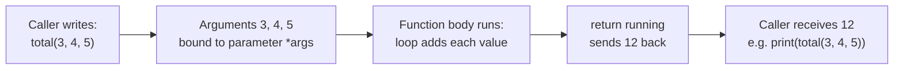
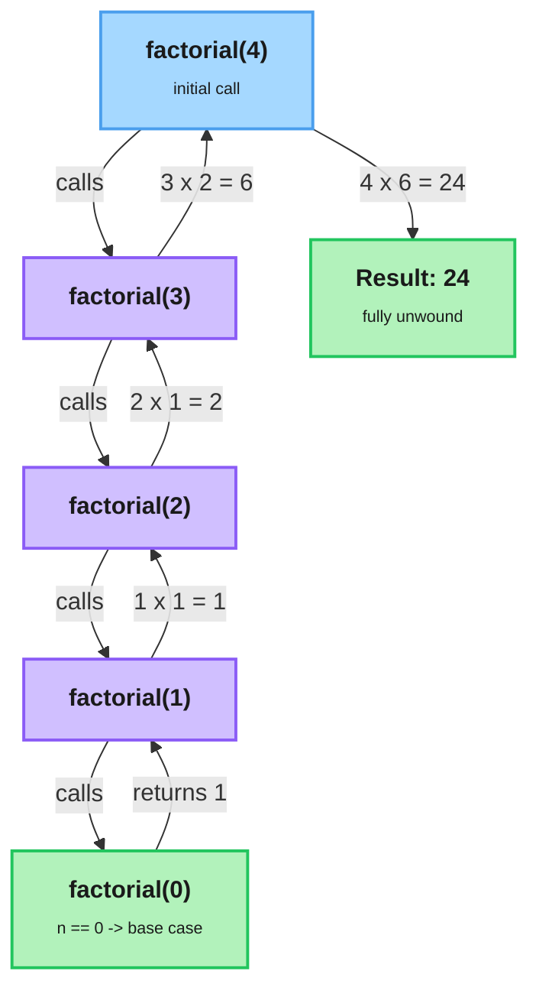

# Functions

---

[← Previous: 2.2 Loops](unit-2-2-loops.md) | [Go back to TOC](../../README.md) | [Next: 2.4 Functional Constructs →](unit-2-4-functional-constructs.md)

## 1. Learning Objectives

By the end of this unit, you will be able to:

- **Explain** what a function is and why organizing code into functions is essential for building maintainable, testable software.
- **Implement** a function using `def`, give it parameters, and hand a value back to the caller with `return`.
- **Differentiate** positional arguments, keyword arguments, default arguments, and the extra positional arguments collected by `*args`.
- **Describe** local and global scope, and identify when the `global` keyword is genuinely necessary versus risky.
- **Create** a recursive function with a correct base case and recursive case, and **Debug** the classic recursion mistake of a missing or unreachable base case.
- **Apply** a docstring to document what a function does, following the conventions of PEP 257.

---

## 2. Overview

You have been calling functions since your very first Python program — every `print()`, `int()`, and `type()` you've written hands work to code someone else wrote and gets an answer back. This unit teaches you to write your own: a named, reusable block of code that takes some input, does exactly one job, and gives back a result. That single shift — from one long script to organized, callable pieces — is what lets a program grow from ten lines to ten thousand lines without collapsing into unreadable, unmaintainable spaghetti code.

This matters enormously once you join a real engineering team. Indian IT companies — whether building a banking core system, a UPI payment gateway, or an e-commerce checkout flow — do not write one giant script. They write thousands of small, well-named functions, each with clear inputs, a clear output, and a docstring explaining its purpose, so that hundreds of engineers can build on each other's work without reading each other's minds. Automated test suites — the backbone of any serious codebase — work by calling your functions and checking their **returned** values, not by reading what you printed to the screen.

By the end of this unit, you will define functions, feed them input in multiple ways, understand why a variable created inside one disappears the moment the function finishes, and write a function that calls itself to solve a problem.

---

## 3. Description

### 3.1 Definition

A **function** is a named, reusable block of code that performs one specific task. You write it once, and then you can **call** it — run it — as many times as you need, from anywhere in your program, without retyping the logic inside it.

You create a function with the `def` keyword, a name, a pair of parentheses, and a colon. The indented block underneath is the function's **body** — the instructions it runs each time it is called.

```python
def greet():
    print("Hello there")
```

Defining a function does **not** run it — it only teaches Python what the name `greet` means and what it will do when called. Nothing is printed yet. You run the body by **calling** the function — writing its name followed by parentheses:

```python
greet()   # runs the body -> Hello there
```

A function that only prints has done something visible on screen but has handed nothing back to whoever called it. The **`return`** statement ends the function immediately and produces a **return value** — a result the caller can store in a variable, print, or use in a further calculation:

```python
def square(n):
    return n * n

answer = square(5)   # answer is now 25
```

This is the single most important distinction in this entire unit. `print()` displays a value on the screen and that value is then gone — no other part of the program can retrieve it. `return` hands the value back to the caller, so the rest of the program — including an automated test — can use it. A function with no `return` statement at all (or a bare `return` with nothing after it) hands back the special value `None`.

### 3.2 Why This Concept Exists

Without functions, every program would be one long, ever-growing script — any task you needed twice would have to be retyped, and any change to that task would mean hunting down and fixing every copy by hand. Real software constantly needs to:

- **Reuse** the same logic in many places without duplicating code (calculating GST on every invoice line, not just one).
- **Isolate** a task so it can be tested, fixed, and improved on its own, without touching unrelated code.
- **Communicate intent** through a name and a docstring, so another engineer — or your future self — understands what a block of code is for without re-reading every line.

A function solves all three problems with one mechanism: give a task a name and a clear input/output contract once, then let the rest of the program call that name instead of repeating the logic. This is exactly why "functions" is universally the concept every programming course teaches right after control flow — it is the first real tool for managing complexity.

### 3.3 Key Terminology

| Term | Simple Meaning |
|---|---|
| **Function** | A named, reusable block of code that performs one specific task. |
| **`def`** | The keyword used to define a function. |
| **Parameter** | A name listed in a function's definition — a placeholder for a value supplied later. |
| **Argument** | The actual value supplied when a function is called. |
| **Positional argument** | An argument matched to a parameter by its order in the call. |
| **Keyword argument** | An argument matched to a parameter by name, regardless of order. |
| **Default argument** | A parameter's fallback value, used when the caller does not supply one. |
| **`*args`** | A parameter prefixed with `*` that collects any extra positional arguments together. |
| **Return value** | The value a function hands back to its caller using `return`. |
| **Scope** | The region of a program where a given name is visible and usable. |
| **Local variable** | A variable created inside a function; visible only while that function runs. |
| **Global variable** | A variable created at the top level of a file, outside any function. |
| **`global`** | A keyword that lets a function reassign an existing global variable instead of creating a local one. |
| **Recursion** | A technique where a function calls itself on a smaller version of the same problem. |
| **Base case** | The simplest input in a recursive function, answered directly, that stops further calls. |
| **Recursive case** | The branch where a function calls itself on a smaller input and combines that result. |
| **Call stack** | The mechanism Python uses to track every function call still waiting on a result. |
| **`RecursionError`** | The error Python raises when recursive calls exceed the maximum allowed stack depth. |
| **Docstring** | A triple-quoted string as the first statement in a function body, documenting its purpose. |

### 3.4 Syntax

```python
def function_name(parameter1, parameter2=default_value):
    """One-line docstring describing what this function does."""
    # function body — any valid Python statements
    return result
```

| Part | What it is | Why it's there |
|---|---|---|
| `def` | The keyword that starts a function definition. | Tells Python "the following name is a function, not a variable." |
| `function_name` | The identifier you choose for this function. | This is what you type later, followed by `()`, to call it. |
| `(parameter1, parameter2=default_value)` | The **parameter list** — names the function expects, optionally with defaults. | Declares what inputs the function needs and which ones are optional. |
| `:` | Marks the end of the `def` line. | Tells Python the indented block underneath is the function's body. |
| `"""..."""` | The **docstring**, as the first line inside the body. | Documents the function's purpose so tools and readers can see it without reading the logic. |
| indented body | The statements that run every time the function is called. | This is the actual work the function performs. |
| `return result` | Sends `result` back to the caller and ends the function immediately. | Without it, the function silently returns `None`. |

Calling the function reuses the same familiar shape you've used since your very first Python program:

```python
function_name(argument1, argument2)
```

**Function Call Flow**



### 3.5 Parameters, Arguments, and How Values Flow In

A **parameter** is a name listed inside the parentheses when you **define** a function — it is a placeholder for a value that will be supplied later. An **argument** is the actual value you supply when you **call** the function. In the `power` function below, `base` and `exponent` are the parameters — chosen when the function is defined; in the call `power(2, 3)`, `2` and `3` are the arguments — the actual values supplied at that moment. Keeping this pair of words straight is a very common interview check, so hold onto it: parameter = the name in the definition, argument = the value in the call.

**Positional arguments** are matched to parameters purely by their order in the call:

```python
def power(base, exponent):
    result = 1
    for _ in range(exponent):
        result = result * base
    return result

power(2, 3)   # base=2, exponent=3 -> 8
```

**Keyword arguments** are matched by name instead of position, so order stops mattering and the call often reads more clearly:

```python
power(exponent=3, base=2)   # still 8 -- names win over position
```

**Default arguments** give a parameter a fallback value that is used automatically whenever the caller does not supply one, which makes that argument optional:

```python
def greet(name, greeting="Hello"):
    return greeting + ", " + name

greet("Sam")               # "Hello, Sam"
greet("Sam", "Welcome")    # "Welcome, Sam"
```

Two ordering rules follow directly from this: in a `def` line, parameters with defaults must come after parameters without them; in a call, positional arguments must come before any keyword arguments. There is also a real trap here worth remembering early: **a default value is calculated once, at the moment Python reads the `def` line — not freshly on every call.** For a plain number or string this never causes a problem. It becomes dangerous only when the default is something that can be changed in place after creation. The safe habit at this stage is to keep every default simple and fixed — a number, a string, or `None`.

Sometimes a function does not know in advance how many arguments a caller will pass. A single `*` written before a parameter name tells Python to gather all the extra **positional** arguments together under that one name — by strong convention, `*args`. You then walk through whatever was gathered using a plain `for` loop, exactly like you did with loops:

```python
def total(*args):
    running = 0
    for value in args:
        running = running + value
    return running

total(3, 4, 5)   # 12
total()          # 0
```

The `*` symbol is what does the work here; `args` is simply the name everyone agrees to use by convention. The idea to hold onto is this: `*args` lets one function accept a flexible, unknown number of positional inputs, instead of forcing you to write a fixed, exact list of parameters.

### 3.6 Scope — Local vs. Global

**Scope** is the region of a program where a given name is visible and usable. A variable created inside a function is **local** to that function — it exists only while the function is running, and it cannot be seen or used from outside it:

```python
def compute():
    temp = 42        # local variable — exists only inside compute
    return temp

compute()
print(temp)          # NameError: temp is not defined out here
```

A variable defined at the top level of your file, outside every function, is a **global variable**, and any function can read it. But there is a subtlety here that trips up almost every beginner: if a function *assigns* a value to a name anywhere in its body, Python treats that name as local to the function by default — even if a global variable with the same name already exists. This is usually exactly what you want, because it stops one function from accidentally overwriting another function's variables. When a function genuinely needs to reassign a global variable on purpose, the `global` keyword states that intention explicitly:

```python
counter = 0

def bump():
    global counter
    counter = counter + 1

bump()
print(counter)       # 1
```

Use `global` sparingly. Functions that receive their inputs as parameters and hand results back with `return` are far easier to read, reuse, and test than functions that quietly reach outside themselves and change shared state. Treat `global` as the rare, deliberate exception — not the everyday habit.

### 3.7 Recursion

**Recursion** is a technique where a function solves a problem by calling itself on a smaller version of the same problem. Every correct recursive function needs exactly two parts. The **base case** is the simplest possible input — one small enough that the answer is already known, with no further calling required — and it is what stops the recursion from running forever. The **recursive case** is the branch where the function calls itself on a smaller or simpler input, and combines that result to produce its own answer.

The classic teaching example is **factorial**: `n!` means `n × (n-1) × (n-2) × ... × 1`, and `0!` is defined to be `1`. Since `n!` is exactly `n × (n-1)!`, the mathematical definition is already recursive in shape:

```python
def factorial(n):
    """Return n! for a non-negative integer n."""
    if n == 0:                      # base case
        return 1
    return n * factorial(n - 1)     # recursive case

factorial(4)   # 4 * 3 * 2 * 1 = 24
```

(The triple-quoted line right under `def` is a **docstring** — you will meet it properly in section 3.8. For now, just notice that it briefly documents what the function returns, and keep your attention on the base case and recursive case below it.)

Every call to `factorial` that has not yet reached the base case waits, unfinished, on the **call stack** — the mechanism Python uses internally to track every function call that is still in progress and waiting for a result. The diagram below traces exactly how `factorial(4)` unfolds on the call stack, one frame at a time down and then back up.

**Recursion Call Stack — `factorial(4)`**



**Comparison Table: Recursion vs. Iteration**

| Aspect | Recursion | Iteration (loops) |
|---|---|---|
| Mechanism | A function calls itself on a smaller input | A loop (`for`/`while`) repeats a block of code |
| Requires | A base case and a recursive case | A loop condition and, usually, an accumulator |
| Memory use | Uses the call stack — one frame per pending call | Uses a fixed, small amount of memory regardless of repeat count |
| Risk if wrong | Missing/unreachable base case → `RecursionError` | Wrong condition → infinite loop (program never raises an error, just never stops) |
| Best suited for | Problems naturally defined in terms of a smaller copy of themselves (factorial, tree-shaped data) | Straightforward repetition over a known range or condition |
| Readability | Can be shorter and closer to the mathematical definition | Often more familiar and easier to trace step by step |

If the base case were missing, or written so it could never actually be reached, the function would keep calling itself forever, pushing a fresh frame onto the call stack on every call. Python limits how deep this stack is allowed to grow. Once a program exceeds that limit, Python stops it cleanly and raises a `RecursionError` reporting "maximum recursion depth exceeded" — a controlled failure, not a silent hang or a crashed interpreter.

The exact same job can also be done with a `for` loop and an accumulator, precisely as you practiced with loops. Recursion is not faster here — it is a different way of *thinking* about a problem, one that fits naturally when a problem is already defined in terms of a smaller copy of itself. Getting the base case exactly right is the whole game.

### 3.8 Docstrings

A **docstring** is a string literal placed as the very first statement inside a function's body, written in triple quotes. Python stores this string so that tools, IDEs, and other developers can see what the function does, without having to read its implementation — it is the standard, built-in way to document a function, formalized in **PEP 257**.

```python
def factorial(n):
    """Return n! for a non-negative integer n."""
    if n == 0:
        return 1
    return n * factorial(n - 1)
```

A good docstring states, in one or a few plain sentences, what the function does, what it expects as input, and what it returns. Because it lives inside the function itself, it travels everywhere the code travels and cannot drift out of sync the way a separate document can.

### 3.9 Rules

**Definition and call rules:**

- A function must be defined with `def`, a name, parentheses, and a colon, before it can be called.
- Calling a function always requires parentheses — `greet` refers to the function itself, `greet()` runs it.
- Parameters with default values must come after parameters without defaults in the `def` line.
- In a call, positional arguments must appear before any keyword arguments.
- `return` ends the function immediately; any code written after a `return` inside the same branch never runs.

**Scope rules:**

- A name assigned anywhere inside a function is local to that function by default.
- Reading a global variable inside a function needs no special keyword — only *reassigning* it does.
- The `global` keyword must be used before a global name is reassigned inside a function, or Python creates a new local variable instead.

**Recursion rules:**

- Every recursive function needs at least one reachable base case.
- The recursive case must move the input measurably closer to the base case on every call.
- Exceeding Python's maximum recursion depth raises a `RecursionError`, not a silent infinite loop.

### 3.10 Best Practices

- Make every function do exactly **one job**, and let its name say what that job is.
- Prefer `return` over `print()` inside a function — printing is for showing a human the final result, not for handing a value to the rest of your program.
- Write a one-line docstring for every function you define, stating what it does, what it expects, and what it returns.
- Pass data in through parameters and get results out through `return`, instead of reaching for global variables — this keeps a function testable on its own.
- Keep default argument values simple and fixed — a number, a string, or `None` — never something that can change in place.
- Reserve the `global` keyword for the rare case where a function must genuinely update shared state, not as routine practice.
- Always double-check that a recursive function's base case is actually reachable before trusting the recursive case.

### 3.11 Common Mistakes

- **Forgetting `return`** — the function runs correctly but silently hands back `None`, and anything that tries to use the "result" fails or behaves oddly.
- **Confusing `print()` with `return`** — printing shows a value once on screen; only `return` makes that value available to the rest of the program or to a test.
- **Giving a parameter a mutable default value** — because a default is evaluated once, at definition time, every call relying on that default can end up silently sharing the same object across calls.
- **Scope confusion** — assigning to a name inside a function without `global` creates a brand-new local variable instead of updating the global one you expected. If the function also tries to *read* that name before its local assignment runs, Python raises `UnboundLocalError`; otherwise, the function runs fine but the global variable outside is left silently unchanged.
- **Missing or unreachable base case in recursion** — the function keeps calling itself until Python raises a `RecursionError: maximum recursion depth exceeded`.
- **Mixing up parameter and argument** — using the two terms interchangeably in an interview is a common giveaway of shaky fundamentals.
- **Calling a function before it is defined** — Python reads top to bottom, so a call above the matching `def` raises a `NameError`.

### 3.12 Code Examples

**Fresh Bites food delivery app — building one bill calculator step by step**

Fresh Bites is a food delivery app. Instead of four unrelated examples, the code below builds a single piece of Fresh Bites' billing logic in stages — starting from a function that does nothing but print, and ending with a function that calls itself.

**Step 1 — a function with no parameters:**

```python
def show_welcome_banner():
    print("Welcome to Fresh Bites!")

show_welcome_banner()
```

*Line-by-line explanation:*
- `def show_welcome_banner():` defines a function that takes no input at all — the parentheses are empty.
- `print("Welcome to Fresh Bites!")` is the entire body — one statement that runs every time the function is called.
- `show_welcome_banner()` is the call. Nothing appeared on screen until this line ran.
- Output: `Welcome to Fresh Bites!`

**Step 2 — adding a parameter and a `return` value:**

```python
def item_cost(price, quantity):
    return price * quantity

subtotal = item_cost(150, 2)
print(subtotal)
```

*Line-by-line explanation:*
- `def item_cost(price, quantity):` declares two parameters — placeholders for the price of one item and how many of it were ordered.
- `return price * quantity` computes the cost of that line item and hands it straight back to the caller; the function ends here.
- `item_cost(150, 2)` calls the function with `150` and `2` as positional arguments, matched to `price` and `quantity` in that order.
- `subtotal = ...` stores the returned value, instead of it disappearing the way a `print()` inside the function would.
- `print(subtotal)` displays the stored value. Output: `300`.

**Step 3 — a default argument, so the delivery fee becomes optional:**

```python
def calculate_bill(item_total, delivery_fee=30):
    return item_total + delivery_fee

print(calculate_bill(300))
print(calculate_bill(300, 40))
print(calculate_bill(item_total=300, delivery_fee=20))
```

*Line-by-line explanation:*
- `delivery_fee=30` gives the second parameter a fallback value, so callers may leave it out entirely.
- `calculate_bill(300)` supplies only `item_total`; Python fills in `delivery_fee` with its default, `30`, giving `300 + 30 = 330`.
- `calculate_bill(300, 40)` supplies both positionally, overriding the default: `300 + 40 = 340`.
- `calculate_bill(item_total=300, delivery_fee=20)` supplies both as keyword arguments, so order does not matter: `300 + 20 = 320`.
- Output:
  ```
  330
  340
  320
  ```

**Step 4 — `*args`, so the bill can absorb any number of extra charges:**

```python
def calculate_bill(item_total, delivery_fee=30, *extra_charges):
    """Return the final bill: item total + delivery fee + any extra charges."""
    total = item_total + delivery_fee
    for charge in extra_charges:
        total = total + charge
    return total

print(calculate_bill(300))
print(calculate_bill(300, 40, 10, 5))
```

*Line-by-line explanation:*
- `*extra_charges` collects any further positional arguments — a packaging fee, a surge charge, a small-order fee — under one name, however many the caller passes.
- The docstring states in one sentence what the function returns.
- `for charge in extra_charges:` walks through whatever was collected, exactly like the `for` loops you already know, adding each one to `total`.
- `calculate_bill(300)` passes no extra charges at all, so `extra_charges` is empty and the loop body never runs: `300 + 30 = 330`.
- `calculate_bill(300, 40, 10, 5)` passes two extra charges, collected into `extra_charges` as `10` and `5`: `300 + 40 + 10 + 5 = 355`.
- Output:
  ```
  330
  355
  ```

**Recursion coda — the same app, one recursive function:**

Fresh Bites also raises its weekly subscription price by a fixed percentage every time it renews. That is naturally recursive: this week's price is last week's price, grown by one hike.

```python
def renewal_price(base_price, hike_percent, weeks):
    """Return the subscription price after compounding a weekly hike over `weeks` weeks."""
    if weeks == 0:                        # base case
        return base_price
    price_so_far = renewal_price(base_price, hike_percent, weeks - 1)   # recursive case
    return price_so_far + (price_so_far * hike_percent / 100)

print(round(renewal_price(200, 10, 3), 2))
```

*Line-by-line explanation:*
- `if weeks == 0: return base_price` is the base case — with zero weeks left to compound, the price is exactly the starting price, and recursion stops.
- `price_so_far = renewal_price(base_price, hike_percent, weeks - 1)` is the recursive case — it asks "what was the price with one fewer week of compounding?" before adding this week's hike on top.
- `renewal_price(200, 10, 3)` starts at 3 weeks and unwinds down to the base case at 0 weeks, then back up, adding a 10% hike at each level.
- Output: `266.2`

#### Try It Yourself

**Fresh Bites — extend the billing logic yourself**

1. **(Warm-up)** Write and call a no-parameter function `daily_special()` that prints `Today's special: Paneer Wrap at Rs. 120`.
2. **(Core)** Write a function `order_total(item_price, quantity, packing_fee=10)` that returns `item_price * quantity + packing_fee`. Call it once supplying only `item_price` and `quantity`, and once overriding `packing_fee` to `15` with a keyword argument. Print both results.
3. **(Challenge — recursion)** Fresh Bites' orders grow by one extra order each day: 1 order on day 1, 2 more on day 2, 3 more on day 3, and so on. Write a recursive function `orders_placed(day)`, with a docstring, that returns the running total of orders processed from day 1 through `day`. Call `orders_placed(4)` and print the result.

**Solution — Part 1:**

```python
def daily_special():
    print("Today's special: Paneer Wrap at Rs. 120")

daily_special()
```

Output: `Today's special: Paneer Wrap at Rs. 120`

**Solution — Part 2:**

```python
def order_total(item_price, quantity, packing_fee=10):
    return item_price * quantity + packing_fee

print(order_total(120, 2))
print(order_total(120, 2, packing_fee=15))
```

Output:
```
250
255
```
(`120 * 2 + 10 = 250`; `120 * 2 + 15 = 255`.)

**Solution — Part 3:**

```python
def orders_placed(day):
    """Return the running total of orders processed from day 1 through `day`, where day n processes n orders that day."""
    if day == 1:                          # base case
        return 1
    return day + orders_placed(day - 1)   # recursive case

print(orders_placed(4))
```

Output: `10`

(`orders_placed(1) = 1`; `orders_placed(2) = 2 + 1 = 3`; `orders_placed(3) = 3 + 3 = 6`; `orders_placed(4) = 4 + 6 = 10`.)

---

## 4. Real-World Application

Functions are the basic building block of every serious codebase you will touch as a working engineer:

- **Banking & FinTech:** Interest calculations, EMI schedules, and balance updates are all implemented as small, tested functions — each one takes clear inputs (principal, rate, tenure) and returns one clear value.
- **UPI / Payment Systems:** A payment gateway calls a chain of functions — validate account, check balance, debit sender, credit receiver, generate transaction ID — each one independently testable because each one returns a value the next function (or a test) can check.
- **E-commerce:** A checkout page calls functions to calculate item totals, apply discounts, add delivery charges, and compute the final bill — exactly the shape of the food delivery example above.
- **Healthcare:** A patient monitoring system calls a function to convert a raw sensor reading into a temperature, another to flag an abnormal value, and another to log the result — each with a docstring so a doctor-facing report can trust what each step does.
- **Railway Booking (IRCTC-style systems):** Fare calculation, seat availability checks, and confirmation logic are each their own function, called in sequence every time you book a ticket.
- **AI/ML & Cloud Apps:** Every model you will call later in this program is, underneath, a function (or a collection of them) that takes an input, does its computation, and returns an output — the same `def` / parameters / `return` shape you just learned, just wrapped inside a larger library.

This is also why returning a value matters more than it might seem right now: a function that `return`s an answer hands back something an automated test can check without any human watching the screen — precisely the distinction your checkpoints are built to reward.

---

## 5. Worked Example

### Problem Statement

A UPI app wants a small internal checksum helper: a function that takes a transaction amount (a whole, non-negative number) and returns the sum of its digits. For example, the digit sum of `492` is `4 + 9 + 2 = 15`. Write this function recursively, with a docstring, and verify it on a few sample amounts.

### Step 1: Understand the Problem

The task is to add up the individual digits of a whole number. A number with more than one digit can be broken into two pieces: its **last digit** (found with `n % 10`) and **everything before it** (found with `n // 10`). If a number already has only one digit, its digit sum is simply itself — that is the simplest case this problem can reach.

### Step 2: Plan the Solution

- **Base case:** if `n` has only one digit (`n < 10`), return `n` directly — there is nothing left to break down.
- **Recursive case:** otherwise, return the last digit (`n % 10`) plus the digit sum of the remaining number (`n // 10`).
- Write a one-line docstring stating what the function returns.
- Call the function on a few sample values and print each result.

### Step 3: Write the Python Code

```python
def digit_sum(n):
    """Return the sum of the digits of a non-negative integer n."""
    if n < 10:                      # base case
        return n
    return n % 10 + digit_sum(n // 10)   # recursive case

print(digit_sum(492))
print(digit_sum(7))
print(digit_sum(10000))
```

### Step 4: Explain Each Line

- `def digit_sum(n):` defines the function with one parameter, `n`, the number whose digits will be summed.
- The docstring states exactly what the function returns, in one sentence.
- `if n < 10: return n` is the base case — any single-digit number is its own digit sum, so recursion stops here.
- `return n % 10 + digit_sum(n // 10)` is the recursive case — `n % 10` peels off the last digit, and `digit_sum(n // 10)` recursively handles everything before it; the two pieces are added together.
- `print(digit_sum(492))`, `print(digit_sum(7))`, and `print(digit_sum(10000))` call the function on three different sample inputs and display each returned value.

### Step 5: Sample Input

```
digit_sum(492)
digit_sum(7)
digit_sum(10000)
```

### Step 6: Expected Output

```
15
7
1
```

### Step 7: Why the Output Is Produced

For `digit_sum(492)`: `492` is not a single digit, so it splits into `2` (last digit) plus `digit_sum(49)`. `49` splits into `9` plus `digit_sum(4)`. `4` is a single digit, so the base case returns `4` directly. Unwinding back up: `9 + 4 = 13`, then `2 + 13 = 15` — matching the expected output. For `digit_sum(7)`, the base case fires immediately since `7 < 10`, returning `7` with no recursive calls at all. For `digit_sum(10000)`, every digit except the leading `1` is `0`, so each recursive step adds `0` until the base case returns `1`, giving a final digit sum of `1`.

---

### Important Notes (Interview Insights)

**Q: "What is the difference between a parameter and an argument?"**

A **parameter** is the name in the function's definition; an **argument** is the value supplied in the call. Interviewers frequently ask this exact question to check fundamentals.

**Q: "What happens when recursion goes too deep?"**

Python raises a `RecursionError` once the call stack exceeds its maximum depth — it is a controlled, catchable error, not a program crash, though in some other languages the equivalent situation is called a "stack overflow."

**Q: "Why does `return` matter more than `print()` inside a function meant to be reused?"**

A returned value can be stored, passed on, or checked by an automated test; a printed value is gone the instant it appears.

**Q: "How is a docstring different from an ordinary comment?"**

A docstring is retrievable at runtime through a function's `__doc__` attribute or via the built-in `help()` function — this is what makes it genuinely useful documentation, not just a comment that only a human reading the source will ever see.

**Q: "Is recursion faster than iteration?"**

No — recursion and iteration (loops) can solve the exact same class of problems; recursion is a way of expressing a solution, not a way of making it faster.

---

## 6. Key Takeaways

- A **function** is defined with `def`, does one job, and hands a value back with `return`; returning — not printing — is what makes a function's result usable by the rest of a program or by an automated test.
- A **parameter** is the name in the function's definition; an **argument** is the value supplied in the call — a distinction interviewers frequently check.
- Arguments can be passed **positionally**, **by keyword**, or take a **default value**; `*args` collects any extra positional arguments into one name that you loop over.
- A default argument value is evaluated once, at definition time — never give a parameter a mutable default; keep defaults simple and fixed.
- Variables assigned inside a function are **local** by default; a **global** variable can be read freely, but reassigning it inside a function requires the `global` keyword.
- **Recursion** solves a problem by calling the same function on a smaller version of it; every recursive function needs a reachable **base case** and a **recursive case** that moves toward it.
- A missing or unreachable base case leads to a `RecursionError` once Python's call stack limit is exceeded — a controlled failure, not a silent crash.
- A **docstring** — a triple-quoted string as a function's first statement — documents what it does, following PEP 257, and is retrievable at runtime through `__doc__` or `help()`.

Coming next: functional constructs — building on the functions you just learned to write.

---

## 7. Reference Links

- [The Python Tutorial — Defining Functions](https://docs.python.org/3/tutorial/controlflow.html#defining-functions)
- [Python 3 Documentation — More on Defining Functions](https://docs.python.org/3/tutorial/controlflow.html#more-on-defining-functions)
- [PEP 257 — Docstring Conventions](https://peps.python.org/pep-0257/)
- [Real Python — Defining Your Own Python Function](https://realpython.com/defining-your-own-python-function/)
- [Real Python — Thinking Recursively in Python](https://realpython.com/python-recursion/)
- [W3Schools — Python Functions](https://www.w3schools.com/python/python_functions.asp)

[← Previous: 2.2 Loops](unit-2-2-loops.md) | [Go back to TOC](../../README.md) | [Next: 2.4 Functional Constructs →](unit-2-4-functional-constructs.md)

---

*© 2026 Revature · AI Native Engineering — Foundations · Unit 2.3 · Version 2.0*
