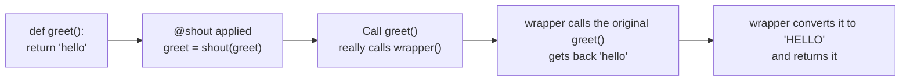
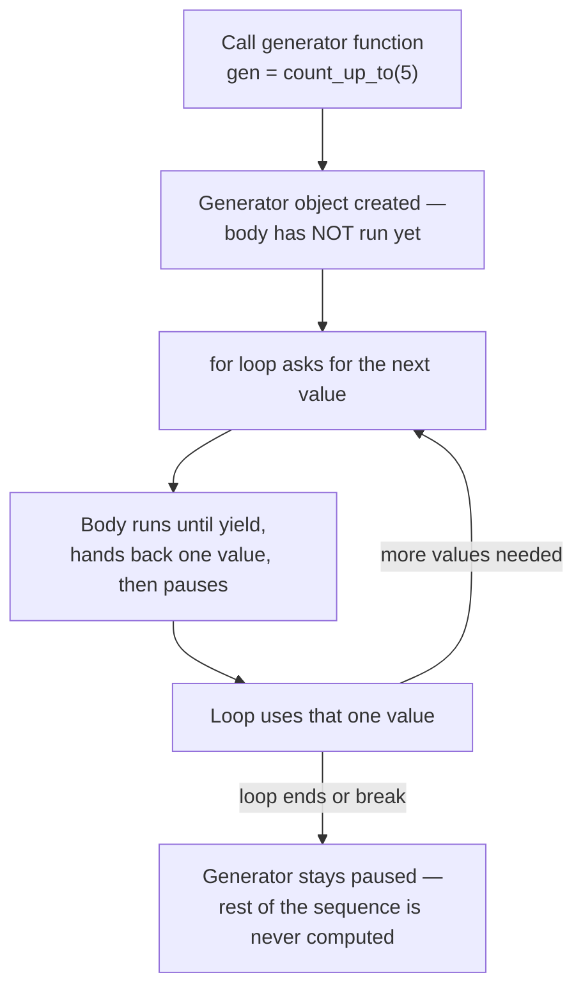

# Functional Constructs

---

[← Previous: 2.3 Functions](unit-2-3-functions.md) | [Go back to TOC](../../README.md) | [Next: 2.5 Modules, Packaging & Professional Tooling →](unit-2-5-modules-packaging-tooling.md)

## 1. Learning Objectives

By the end of this unit, you will be able to:

- **Explain** what a lambda function is and identify when it is more appropriate than a regular `def` function.
- **Differentiate** a regular function from a higher-order function, and use `map()`, `filter()`, and `sorted(key=...)` correctly.
- **Implement** a custom decorator using `@` syntax to add behaviour — such as timing or logging — to an existing function without changing its code.
- **Create** a generator function using `yield` and describe how lazy evaluation differs from returning a complete sequence.
- **Analyze** the memory and performance trade-offs between a generator and a regular function that returns a full sequence.
- **Debug** common mistakes such as a missing `return` inside a decorator's wrapper or multi-statement logic written inside a lambda.

---

## 2. Overview

By now you can write functions, pass them arguments, and get a `return` value back. This unit adds one more idea on top of that: in Python, a function is not just something you call — it is a **value**, exactly like an `int` or a `str`. That means you can store a function in a variable, pass it into another function as an argument, or have one function build and hand back another function.

This single idea unlocks four practical tools that show up everywhere in real Python codebases. A **lambda** lets you write a tiny, throwaway function inline, without the ceremony of a full `def` block — useful when you need to tell `sorted()` how to rank a list of transactions by amount. A **higher-order function** like `map()` or `filter()` takes your function and applies it across a whole sequence. A **decorator** wraps extra behaviour — like logging every API call in a banking app, or timing a slow database query in an e-commerce backend — around an existing function, without touching its original code. A **generator** produces values one at a time instead of building an entire result in memory first, which is exactly how a food-delivery app streams live order updates or an AI pipeline processes a dataset too large to fit in RAM all at once.

None of this needs new syntax you haven't already prepared for — it builds directly on `def`, `return`, and `*args`/`**kwargs` from the functions unit.

---

## 3. Description

### 3.1 Definition

A **functional construct** is a feature of Python that treats functions as ordinary values — something you can create on the fly, store in a variable, pass into another function, return from a function, or pause and resume. Four such constructs matter for working Python developers:

- A **lambda** is a small, unnamed function written in a single line.
- A **higher-order function** is a function that accepts another function as an argument, returns one, or both.
- A **decorator** is a function that wraps another function to add behaviour around it, without editing the original function's body.
- A **generator** is a function that produces a sequence of values one at a time, using `yield`, instead of computing and returning them all at once.

All four rest on the same foundation: in Python, a function is a **first-class object** — it can be treated exactly like any other value in the language.

### 3.2 Why This Concept Exists

Without these tools, a Python program hits three recurring walls that real software cannot avoid:

- **One-off logic with no need for a name.** Telling `sorted()` to rank items by length, or by any custom rule, would otherwise require writing and naming a separate `def` function every single time, even for logic you will use exactly once.
- **Repeating the same wrapper behaviour across many functions.** Timing a function's run time, logging its calls, or checking permissions before it runs are all patterns you want to apply to *many different functions* without copy-pasting the same code inside every one of them.
- **Sequences too large — or too infinite — to hold in memory.** A function that must `return` a value has to finish building that value completely before handing it back. That is impossible for a sequence with no natural end, and wasteful for a sequence with millions of entries when you only need the first few.

Lambdas solve the first problem, decorators solve the second, and generators solve the third. Higher-order functions are the connective tissue that makes passing functions around into other functions actually useful.

### 3.3 Key Terminology

| Term | Simple Meaning |
|---|---|
| **First-class function** | A function that Python treats as an ordinary value — it can be stored in a variable, passed as an argument, or returned from another function. |
| **Lambda** | A small, unnamed function written as `lambda parameters: expression`, limited to a single expression. |
| **Higher-order function** | A function that takes another function as an argument, returns one, or both. |
| **`map()`** | A built-in higher-order function that applies a given function to every item of an iterable and produces the results. |
| **`filter()`** | A built-in higher-order function that keeps only the items for which a given function returns a truthy value. |
| **`sorted(key=...)`** | The built-in sort function's `key` argument — a function called once per item, whose result decides the sort order instead of the item itself. |
| **Decorator** | A function that takes another function and returns a new function that wraps extra behaviour around it. |
| **`@` syntax** | Shorthand placed directly above a `def`, meaning "define this function, then reassign its name to `decorator(function)`." |
| **Wrapper function** | The inner function defined inside a decorator, which actually replaces the original function and adds the extra behaviour. |
| **Closure** | A situation where an inner function (like a wrapper) remembers and can use variables from the outer function that created it, even after the outer function has finished running. |
| **Generator function** | A function whose body contains at least one `yield` statement; calling it returns a generator object instead of running the body immediately. |
| **`yield`** | A keyword that hands back a value from a generator function and pauses execution, keeping all local state frozen until the next value is requested. |
| **Generator object** | The paused, resumable object produced by calling a generator function; it produces values on request, typically through a `for` loop. |
| **Lazy evaluation** | Producing values only when they are actually asked for, instead of computing and storing an entire sequence up front. |

### 3.4 Syntax

**Lambda syntax:**

```python
lambda parameters: expression
```

| Part | What it is | Why it's there |
|---|---|---|
| `lambda` | The keyword that starts an anonymous function. | Tells Python "an unnamed function follows." |
| `parameters` | Zero or more parameter names, comma-separated, with no parentheses. | Same role as parameters in a `def` — the inputs the lambda accepts. |
| `expression` | A single expression, evaluated and returned automatically. | There is no `return` keyword — the result of the expression *is* the return value. |

**Comparison Table: Regular Function vs. Lambda Function**

| Aspect | Regular Function (`def`) | Lambda Function |
|---|---|---|
| Definition syntax | `def name(params): return expr` | `lambda params: expr` |
| Name | Always named | Anonymous, unless assigned to a variable |
| Number of statements | Any number of statements, loops, conditionals | Exactly one expression, nothing more |
| Docstring support | Yes | No |
| Typical use | Reusable logic called from many places | One-off logic passed directly as an argument |
| Debuggability | Shows its real name in errors and tracebacks | Shows as `<lambda>` in tracebacks, harder to trace |

**Decorator**

A **decorator** is a function that takes another function as input and returns a new, wrapped version of it — adding extra behaviour around the original function without changing a single line of its actual code. Think of it like gift-wrapping paper: the gift inside (your original function) stays exactly the same, but the wrapping (the decorator) adds something extra around it before it reaches whoever calls it.

Decorators exist because the same "extra behaviour" — logging every call, timing how long something takes, checking permissions before running — is often needed on *many different functions*. Without a decorator, you would have to copy-paste that same wrapper code inside every single function that needed it. A decorator lets you write that logic exactly once, then apply it to any function with a single line: `@decorator_name`.

**Decorator syntax:**

```python
def decorator_name(func):
    def wrapper(*args, **kwargs):
        # extra behaviour here
        return func(*args, **kwargs)
    return wrapper

@decorator_name
def target_function(...):
    ...
```

| Part | What it is | Why it's there |
|---|---|---|
| `decorator_name(func)` | The outer function — it receives the function being decorated. | This is what actually performs the wrapping. |
| `wrapper(*args, **kwargs)` | An inner function defined inside the decorator. | It replaces the original function and can accept any arguments, since `*args`/`**kwargs` collect whatever is passed. |
| `return wrapper` | The outer function returns the inner function itself — not calling it. | This new function is what gets bound to the original name. |
| `@decorator_name` | Placed directly above a `def`. | Shorthand for `target_function = decorator_name(target_function)`. |

**Simple example:**

```python
def shout(func):
    def wrapper():
        result = func()
        return result.upper()
    return wrapper

@shout
def greet():
    return "hello"

print(greet())
```

*Line-by-line explanation:*
- `def shout(func):` defines the decorator itself; it receives the function being wrapped — here, `greet` — as `func`.
- `def wrapper():` defines a brand-new function that will completely replace `greet`.
- `result = func()` calls the *original* `greet()` and stores whatever it returns.
- `return result.upper()` is the extra behaviour the decorator adds — converting the result to uppercase — before handing it back.
- `return wrapper` sends back the `wrapper` function itself (not a call to it), so it can take `greet`'s place.
- `@shout` written directly above `def greet():` means Python runs `greet = shout(greet)` immediately after `greet` is defined.
- `print(greet())` now actually calls `wrapper()`, since `greet` points to `wrapper` — which calls the real `greet()`, gets back `"hello"`, converts it to `"HELLO"`, and returns that.
- Output: `HELLO`

**How a Decorator Wraps a Function**



**Generator**

A **generator function** is a function that produces a sequence of values one at a time, pausing after each one, instead of computing and returning them all at once. It looks almost exactly like a normal function, except its body contains at least one **`yield`** statement instead of (or alongside) `return`. Calling a generator function does not run its body immediately — it hands back a paused **generator object**, and the body only actually runs, one step at a time, as values are requested from it — typically by a `for` loop or `next()`.

Generators exist because a regular function that `return`s a value must finish building that entire value before it can hand it back. That is wasteful for a sequence with a million entries when you only need the first few, and outright impossible for a sequence that has no natural end. A generator solves this by producing values **lazily** — only the value currently being asked for exists in memory at any moment.

**Generator function syntax:**

```python
def generator_name(parameters):
    while condition:
        yield value
```

| Part | What it is | Why it's there |
|---|---|---|
| `def generator_name(...)` | Looks exactly like a normal function definition. | No special keyword marks it as a generator — Python decides based on the body. |
| `yield value` | Hands back `value` and pauses the function right there. | Presence of `yield` anywhere in the body is what makes this a generator function instead of a regular one. |
| Calling `generator_name(...)` | Does **not** run the body. | It returns a generator object; the body only runs as values are requested. |

**Simple example:**

```python
def count_up_to(limit):
    current = 1
    while current <= limit:
        yield current
        current += 1

for number in count_up_to(5):
    print(number)
```

*Line-by-line explanation:*
- `def count_up_to(limit):` defines a generator function because its body contains `yield`; calling `count_up_to(5)` does **not** run any of this code yet — it only creates a paused generator object.
- `current = 1` sets up the counter, but this line has not executed at all until the generator is actually asked for its first value.
- `while current <= limit:` keeps the generator going as long as there are more numbers to produce.
- `yield current` hands back the current number and pauses the function exactly here, freezing `current`'s value until the generator is asked for the next one.
- `current += 1` only runs the *next* time the generator is resumed, right after the previous `yield`.
- `for number in count_up_to(5):` repeatedly resumes the generator — first run produces `1`, pausing again; the next resumption produces `2`; and so on — until `current` exceeds `5` and the loop ends naturally.
- Output:
  ```
  1
  2
  3
  4
  5
  ```

**Comparison Table: List (Eager) vs. Generator (Lazy)**

| Aspect | List | Generator |
|---|---|---|
| When values are produced | All at once, immediately | One at a time, only when requested |
| Memory usage | Holds every value at once | Holds only the current value |
| Can represent an infinite sequence? | No — would never finish building | Yes — values are produced on demand |
| Can be looped over more than once? | Yes, as many times as needed | No — exhausted after one full pass |
| Created with | `[...]` or `list(...)` | A function containing `yield` |

**Generator Lazy-Evaluation Flow**



### 3.5 Rules

- A lambda can contain only a **single expression** — no loops, no `if`/`elif`/`else` blocks with statements, no multiple lines, and no assignment statements.
- A lambda always returns the value of its expression automatically; you never write `return` inside one.
- A decorator's outer function must **return a callable** (usually the inner `wrapper` function) — returning anything else breaks the function it is decorating.
- A general-purpose decorator's `wrapper` should accept `*args, **kwargs` so it works on any function, regardless of how many arguments that function takes.
- A function becomes a generator function the moment its body contains **any** `yield` statement — this happens even if the function also contains a `return` used only to stop early.
- Calling a generator function does not execute its body — the body only starts running when the first value is requested, most commonly by a `for` loop or `next()`.
- A generator object can only be iterated **forward, once** — once it is exhausted, it cannot be restarted; you must call the generator function again to get a fresh one.

### 3.6 Best Practices

- Use a lambda only for short, throwaway logic passed directly into another function, such as the `key` argument of `sorted()`.
- If the logic needs more than one expression, a name, or a docstring, write a regular `def` function instead — do not force complex logic into a lambda.
- Keep a decorator's `wrapper` generic — accept `*args, **kwargs` and pass them straight through to the original function, so the decorator works on any function you apply it to.
- Always have `wrapper` `return` the original function's result, so the decorated function still behaves correctly for whatever code calls it.
- Prefer a generator over building a full list whenever the sequence could be very large, or has no natural end, or is only ever consumed once.
- Give generator functions clear, descriptive names (`read_large_file`, `generate_order_ids`) so it is obvious from the call site that values arrive lazily.

### 3.7 Common Mistakes

- **Writing multiple statements inside a lambda** — a lambda supports exactly one expression; anything more raises a `SyntaxError`.
- **Forgetting `return result` inside a decorator's `wrapper`** — the wrapped function still appears to "work" because the extra behaviour (timing, logging) runs fine, but the caller silently receives `None` instead of the real result.
- **Writing `wrapper(*args)` without `**kwargs`** — the decorator breaks the moment someone calls the decorated function using a keyword argument.
- **Assuming `map()` or `filter()` gives you a list** — both return a lazy object that must be wrapped in `list(...)` to view or reuse its contents.
- **Assuming a generator can be looped over twice** — once a `for` loop has fully consumed a generator object, looping over the same object again produces nothing; you need to call the generator function again for a fresh one.
- **Writing an infinite generator and forgetting a stopping condition in the calling code** — a `while True: yield ...` generator never ends on its own; the `for` loop that consumes it must `break` once it has enough values.

### 3.8 Code Examples

**Scenario: Prakash's online bookstore.** The four steps below are not separate examples — each one builds directly on the code from the step before it, gradually assembling one small order-processing pipeline: a lambda to discount a price, higher-order functions to work across the whole stock list, a decorator to log every order, and a generator to hand out invoice numbers.

**Step 1 — a lambda that discounts one book's price:**

```python
apply_discount = lambda price: price * 0.9
print(apply_discount(500))
```

*Line-by-line explanation:*
- `apply_discount = lambda price: price * 0.9` — creates an unnamed function that takes one parameter, `price`, and evaluates `price * 0.9` (a flat 10% discount); the variable `apply_discount` now refers to that function.
- `print(apply_discount(500))` — calls the lambda with `500`, which evaluates to `450.0`, and `print()` displays it.
- Output: `450.0`.

**Step 2 — higher-order functions apply that lambda across the whole stock list:**

```python
book_prices = [500, 250, 1200, 90, 650]

discounted_prices = map(apply_discount, book_prices)
print(list(discounted_prices))

affordable = filter(lambda price: price < 300, book_prices)
print(list(affordable))

print(sorted(book_prices, key=lambda price: price))
```

*Line-by-line explanation:*
- `book_prices = [500, 250, 1200, 90, 650]` — the listed price of each book currently in stock.
- `discounted_prices = map(apply_discount, book_prices)` — `map()` is a higher-order function; it calls `apply_discount` once per price in `book_prices` and collects the results. The result is a lazy `map` object, not a list yet.
- `print(list(discounted_prices))` — wrapping in `list(...)` forces `map` to actually run. Output: `[450.0, 225.0, 1080.0, 81.0, 585.0]`.
- `affordable = filter(lambda price: price < 300, book_prices)` — `filter()` calls the lambda once per price and keeps only the ones where `price < 300` is `True`. This is also lazy until forced into a list.
- `print(list(affordable))` — Output: `[250, 90]`.
- `sorted(book_prices, key=lambda price: price)` — sorts `book_prices` using the lambda's result — here just the price itself — as the ranking value, lowest first. Output: `[90, 250, 500, 650, 1200]`.

**Step 3 — a `@log_order` decorator wraps the function that processes one order:**

```python
def log_order(func):
    def wrapper(*args, **kwargs):
        print(f"Processing order for a book listed at Rs. {args[0]}")
        result = func(*args, **kwargs)
        print(f"Final payable amount: Rs. {result}")
        return result
    return wrapper

@log_order
def process_book_order(price):
    return apply_discount(price)

process_book_order(500)
```

*Line-by-line explanation:*
- `def log_order(func):` — the decorator; it accepts the function it will wrap.
- `def wrapper(*args, **kwargs):` — the inner replacement function; `*args, **kwargs` let it accept any combination of arguments, so `log_order` works on any function, not just `process_book_order`.
- `print(f"Processing order for a book listed at Rs. {args[0]}")` — logs the call before the real work happens, reading the original listed price straight out of `args`.
- `result = func(*args, **kwargs)` — actually runs `process_book_order`, which applies the discount using the lambda from Step 1, and saves the result.
- `print(f"Final payable amount: Rs. {result}")` — logs the result after the call.
- `return result` — passes the original return value back out, so callers of `process_book_order` still get the correct number.
- `return wrapper` — `log_order` hands back the wrapper function itself, not a call to it.
- `@log_order` above `def process_book_order(price):` — equivalent to writing `process_book_order = log_order(process_book_order)` right after defining it.
- `process_book_order(500)` — this call actually runs `wrapper(500)`, which logs, runs the real discount calculation (`500 * 0.9 = 450.0`), logs the result, and returns `450.0`.
- Output:
  ```
  Processing order for a book listed at Rs. 500
  Final payable amount: Rs. 450.0
  ```

**Step 4 — a generator hands out invoice numbers as the whole batch of orders is processed:**

```python
def invoice_number_generator(start):
    current = start
    while True:
        yield f"INV{current}"
        current += 1

invoices = invoice_number_generator(101)

for price in sorted(book_prices, key=lambda price: price):
    invoice_id = next(invoices)
    print(f"\n{invoice_id}")
    process_book_order(price)
```

*Line-by-line explanation:*
- `def invoice_number_generator(start):` — a generator function because its body contains `yield`.
- `current = start` — sets up the running counter, starting from whatever `start` was passed.
- `while True:` — an infinite loop; this generator could produce invoice numbers forever.
- `yield f"INV{current}"` — builds one invoice number string and hands it out, then pauses the function exactly here, keeping `current`'s value frozen.
- `current += 1` — only runs the *next* time the generator is resumed, right after the last `yield`.
- `invoices = invoice_number_generator(101)` — calling the generator function does not run any of its body yet; it only creates a paused generator object.
- `for price in sorted(book_prices, key=lambda price: price):` — reuses the same sorting lambda from Step 2 so the cheapest book is processed first.
- `invoice_id = next(invoices)` — resumes the generator until it hits `yield`, handing back the next invoice number.
- `process_book_order(price)` — the decorated function from Step 3 runs for each price, logging the order and applying the discount.
- Output:
  ```

  INV101
  Processing order for a book listed at Rs. 90
  Final payable amount: Rs. 81.0

  INV102
  Processing order for a book listed at Rs. 250
  Final payable amount: Rs. 225.0

  INV103
  Processing order for a book listed at Rs. 500
  Final payable amount: Rs. 450.0

  INV104
  Processing order for a book listed at Rs. 650
  Final payable amount: Rs. 585.0

  INV105
  Processing order for a book listed at Rs. 1200
  Final payable amount: Rs. 1080.0
  ```
- Even though `invoice_number_generator` could run forever, only five invoice numbers are ever actually computed — one per book actually processed — because nothing ever asks the generator for a sixth.

#### Try It Yourself

**Exercise: Extend Prakash's bookstore pipeline.** Keep using the same `book_prices = [500, 250, 1200, 90, 650]` list from the example above.

**Part 1 (lambda + higher-order function):** Write a lambda called `add_gst` that adds 10% GST to a price (multiply by `1.10`, then `round(..., 2)` so the result is a clean two-decimal number). Use `map()` to apply it to every price in `book_prices`, and print the resulting list.

**Solution:**
```python
add_gst = lambda price: round(price * 1.10, 2)
prices_with_gst = map(add_gst, book_prices)
print(list(prices_with_gst))
```
Expected output:
```
[550.0, 275.0, 1320.0, 99.0, 715.0]
```

**Part 2 (higher-order functions, combined):** Using `filter()`, keep only the books priced at Rs. 200 or more. Then, using `sorted()` with a lambda `key`, print those remaining books in **descending** order of price (most expensive first).

**Solution:**
```python
eligible = filter(lambda price: price >= 200, book_prices)
print(sorted(eligible, key=lambda price: price, reverse=True))
```
Expected output:
```
[1200, 650, 500, 250]
```

**Part 3 (decorator + generator, combined):** Write a new function `process_order_with_gst(price)` that returns `add_gst(price)`, and apply the same `@log_order` decorator from Step 3 to it. Write a second generator, `gst_invoice_generator(start)`, identical in structure to `invoice_number_generator` but used with a different starting number. Starting invoice numbers at `201`, process the descending, filtered list from Part 2 through `process_order_with_gst`, printing one invoice number before each order.

**Solution:**
```python
@log_order
def process_order_with_gst(price):
    return add_gst(price)

def gst_invoice_generator(start):
    current = start
    while True:
        yield f"INV{current}"
        current += 1

gst_invoices = gst_invoice_generator(201)
descending_eligible = sorted(filter(lambda price: price >= 200, book_prices), key=lambda price: price, reverse=True)

for price in descending_eligible:
    invoice_id = next(gst_invoices)
    print(f"\n{invoice_id}")
    process_order_with_gst(price)
```
Expected output:
```

INV201
Processing order for a book listed at Rs. 1200
Final payable amount: Rs. 1320.0

INV202
Processing order for a book listed at Rs. 650
Final payable amount: Rs. 715.0

INV203
Processing order for a book listed at Rs. 500
Final payable amount: Rs. 550.0

INV204
Processing order for a book listed at Rs. 250
Final payable amount: Rs. 275.0
```

---

## 4. Real-World Application

- **Banking & FinTech:** Decorators wrap core banking functions to log every fund transfer, time slow database queries, or enforce authentication checks — all without touching the original transfer logic itself.
- **UPI / Payment Systems:** Generators produce transaction IDs or OTP-style codes one at a time as they are needed, exactly like the example above, instead of pre-computing a huge batch that mostly goes unused.
- **E-commerce:** `sorted(order_amounts, key=lambda amount: amount)` ranks orders, products, or search results by price, rating, or relevance in a single line, and decorators time how long checkout or payment steps take.
- **Healthcare:** A generator can stream patient vitals readings from a monitoring device one reading at a time, rather than holding an entire day's readings in memory before processing any of them.
- **Education:** A generator can lazily produce the next unattempted quiz question for a student, only creating each question's data when the student actually reaches it.
- **Railway Booking (IRCTC-style systems):** A generator streams available seat numbers coach by coach, and a lambda passed to `sorted()` ranks trains by fare or by journey duration.
- **AI/ML:** Generators are the standard way to feed a model training loop with batches of data from a dataset far too large to load into memory all at once — the model only ever "sees" the current batch.
- **Cloud Applications:** Decorators are the standard mechanism behind logging, caching, retry logic, and access control in almost every production-grade Python web framework.

---

## 5. Worked Example

### Problem Statement

An e-commerce team wants a small script that does three things together: generate sequential order IDs starting from `1001`, process each order while timing how long it takes, and always process the cheapest order first. You need to combine a **generator** (for order IDs), a **decorator** (for timing), and a **lambda** passed to `sorted()` (for ordering by amount) into one working solution.

### Step 1: Understand the Problem

Three separate needs, each matching one construct from this unit: an ever-increasing sequence of order IDs with no natural end (a generator), a piece of wrapper behaviour — timing — that should apply to the order-processing function without editing it (a decorator), and a one-off rule for ranking a small set of order amounts from lowest to highest (a lambda passed as `sorted()`'s `key`).

### Step 2: Plan the Solution

Write `order_id_generator(start)` that yields `start`, `start + 1`, `start + 2`, and so on, forever. Write a `@track_time` decorator whose `wrapper` records a start and end time around the real function call and prints the elapsed time, while still returning the original result. Sort the list of order amounts using `sorted(order_amounts, key=lambda amount: amount)`. Finally, pair each sorted amount with the next order ID using `zip()`, and call the decorated processing function once per pair.

### Step 3: Write the Python Code

```python
import time

def order_id_generator(start):
    current = start
    while True:
        yield current
        current += 1

def track_time(func):
    def wrapper(*args, **kwargs):
        start_time = time.time()
        result = func(*args, **kwargs)
        end_time = time.time()
        print(f"{func.__name__} took {end_time - start_time:.4f} seconds")
        return result
    return wrapper

@track_time
def process_order(order_id, amount):
    total = 0
    for _ in range(1_000_000):
        total += 1
    print(f"Processing order {order_id} for Rs. {amount}")
    return order_id

order_amounts = [799.0, 249.5, 1499.0, 99.0]
sorted_amounts = sorted(order_amounts, key=lambda amount: amount)

for order_id, amount in zip(order_id_generator(1001), sorted_amounts):
    process_order(order_id, amount)
```

### Step 4: Explain Each Line

- `import time` — gives access to `time.time()`, used to measure elapsed time.
- `def order_id_generator(start):` ... `yield current` — a generator function; each time it is resumed (here, by `zip()` pulling the next value), it picks up exactly after the last `yield`, increments `current`, and yields again — forever, since the `while True` loop never ends on its own.
- `def track_time(func):` — the decorator; it receives the function being decorated.
- `def wrapper(*args, **kwargs):` — accepts any arguments so `track_time` can wrap any function, not just `process_order`.
- `start_time = time.time()` / `end_time = time.time()` — mark the moment before and after the real function call.
- `result = func(*args, **kwargs)` — actually runs the original function with whatever arguments were passed in.
- `print(f"{func.__name__} took {end_time - start_time:.4f} seconds")` — reports the elapsed time using the original function's real name.
- `return result` and `return wrapper` — `wrapper` returns the original function's result so nothing is lost; `track_time` returns `wrapper` itself, not a call to it.
- `@track_time` above `def process_order(...)` — equivalent to `process_order = track_time(process_order)`.
- Inside `process_order`, the `for _ in range(1_000_000): total += 1` loop is a deliberately slow, dummy calculation so the timing has something measurable to report; the `print(...)` line then reports the order being processed, and `return order_id` hands back the order ID.
- `order_amounts = [799.0, 249.5, 1499.0, 99.0]` — a plain list of order amounts to process.
- `sorted(order_amounts, key=lambda amount: amount)` — the lambda simply returns each amount unchanged, so `sorted()` ranks the list by that value directly — smallest amount first.
- `zip(order_id_generator(1001), sorted_amounts)` — pairs each value the generator produces with each value in `sorted_amounts`, position by position. `zip()` stops as soon as the shorter of the two runs out — here, `sorted_amounts`, which has exactly four items — even though the generator itself could keep producing IDs forever. The generator never computes a fifth value, because nothing ever asks it to.
- `for order_id, amount in ...: process_order(order_id, amount)` — calls the decorated function once per pair, in ascending order of amount.

### Step 5: Sample Input

```python
order_amounts = [799.0, 249.5, 1499.0, 99.0]
```

No input is taken from the user in this example; all values are fixed directly in the code.

### Step 6: Expected Output

```
Processing order 1001 for Rs. 99.0
process_order took 0.0XXX seconds
Processing order 1002 for Rs. 249.5
process_order took 0.0XXX seconds
Processing order 1003 for Rs. 799.0
process_order took 0.0XXX seconds
Processing order 1004 for Rs. 1499.0
process_order took 0.0XXX seconds
```

*(The exact `0.0XXX` values will differ slightly depending on the machine running the code — only the pattern of messages is fixed.)*

### Step 7: Why the Output Is Produced

`sorted_amounts` places `99.0` first and `1499.0` last, because the lambda's key is the identity of each amount, so `sorted()` ranks the list in plain ascending numeric order. `zip()` then walks the generator and the sorted list together, pulling exactly four values from `order_id_generator(1001)` — `1001, 1002, 1003, 1004` — one for every amount in `sorted_amounts`, and stopping there even though the generator would happily keep producing more IDs if asked. For each pair, `process_order` runs first — printing its own "Processing order..." message as its very last step — and only once it returns does the decorator's `wrapper` print the elapsed-time message, because that print statement sits *after* `result = func(*args, **kwargs)` in `wrapper`'s body. That ordering — real work first, timing message second — is exactly what a decorator guarantees: the original function's behaviour is untouched, and the extra behaviour wraps cleanly around it.

---

### Important Notes (Interview Insights)

- A very common fresher interview question: *"Why not just always use lambda instead of def?"* Answer confidently: a lambda is restricted to a single expression, cannot have a docstring, and is harder to debug because it has no name in a traceback — `def` is the right choice for anything beyond a short, disposable, one-line piece of logic.
- Be ready to explain the **memory difference between a list and a generator**: a list holding a million computed values sits entirely in memory at once, while a generator produces one value at a time and never holds more than the current value in memory — this is why generators are the standard answer to "how would you process a huge file without running out of memory?"
- Interviewers often check whether you understand that **`@decorator` is just syntax sugar** for `function = decorator(function)` — being able to write out that equivalent by hand is a strong signal you actually understand decorators rather than having memorized the `@` symbol.
- When multiple decorators are stacked on one function, they apply **bottom-up**: `@a` above `@b` above `def f()` means `f = a(b(f))` — `b` wraps `f` first, and `a` wraps the result of that.
- The reason a decorator's `wrapper` can still "see" the original `func` after `decorator_name` has already finished running is called a **closure** — the inner function remembers variables from the outer function's scope even after the outer function has returned.

---

## 6. Key Takeaways

- A **lambda** is a single-expression, unnamed function — ideal for a one-off argument to another function, not for logic that needs a name, a docstring, or more than one line.
- A **higher-order function** accepts or returns another function; `map()`, `filter()`, and `sorted(key=...)` are the built-in examples every Python developer meets early.
- A **decorator** is a function that wraps another function and returns the wrapper; `@decorator` is shorthand for `func = decorator(func)`, and a general-purpose wrapper needs `*args, **kwargs` to accept any function's signature.
- A **closure** is what lets a decorator's `wrapper` still remember and use the original function even after the outer decorator function has finished running.
- A **generator** function uses `yield` instead of `return` to produce values one at a time, pausing after each `yield` and resuming exactly where it left off.
- **Lazy evaluation** — producing values only when they are asked for — is what lets a generator represent a sequence too large, or too infinite, to ever build as a complete list in memory.
- Stacked decorators apply **bottom-up**: the one closest to the function wraps it first.
- A generator object can be iterated **only once, forward** — call the generator function again for a fresh run.

Coming next: Unit 2.5 — Modules, Packaging & Professional Tooling.

---

## 7. Reference Links

- [Python 3 Documentation — Lambda Expressions](https://docs.python.org/3/reference/expressions.html#lambda)
- [Python 3 Documentation — Functional Programming HOWTO](https://docs.python.org/3/howto/functional.html)
- [Python 3 Documentation — Generators (The Python Tutorial, Classes chapter)](https://docs.python.org/3/tutorial/classes.html#generators)
- [Real Python — How to Use Python Lambda Functions](https://realpython.com/python-lambda/)
- [Real Python — Primer on Python Decorators](https://realpython.com/primer-on-python-decorators/)
- [Real Python — Introduction to Python Generators](https://realpython.com/introduction-to-python-generators/)
- [W3Schools — Python Lambda](https://www.w3schools.com/python/python_lambda.asp)

[← Previous: 2.3 Functions](unit-2-3-functions.md) | [Go back to TOC](../../README.md) | [Next: 2.5 Modules, Packaging & Professional Tooling →](unit-2-5-modules-packaging-tooling.md)

---

*© 2026 Revature · AI Native Engineering — Foundations · Unit 2.4 · Version 2.0*
