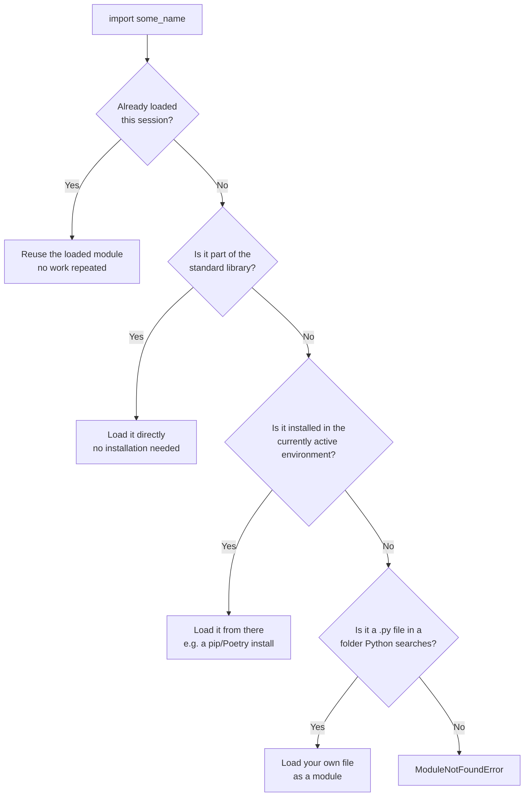
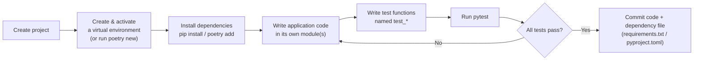

# Modules, Packaging & Professional Tooling

---

[← Previous: 2.4 Functional Constructs](unit-2-4-functional-constructs.md) | [Go back to TOC](../../README.md) | [Next: 3.1 Lists →](../p3-data-structures/unit-3-1-lists.md)

## 1. Learning Objectives

By the end of this unit, you will be able to:

- **Explain** what a module and a package are, and how Python's `import` system finds and loads them.
- **Differentiate** between `import x`, `from x import y`, and `import x as y`, and identify which form fits a given situation.
- **Identify** commonly used modules from Python's standard library and describe what each one is used for.
- **Apply** `pip` to install a third-party package and **describe** the problem a virtual environment solves.
- **Describe** what Poetry and Pytest do in a professional Python project, and why teams rely on both.
- **Debug** the most common tooling mistakes freshers make — a stray `ModuleNotFoundError`, an unactivated virtual environment, and a package installed in the wrong place.

---

## 2. Overview

Every program you have written so far has lived in one file, written entirely by you, and run once by hand. That is not how real software gets built. A production application is split across dozens or hundreds of files; most of the code it depends on was written by someone else, published for anyone to reuse; and none of it gets merged into the main project until an automated check has actually confirmed it still works.

This unit covers the tooling that makes that possible. A **module** lets you split code into files and reuse it instead of retyping it. Python's **standard library** ships a large set of modules for free, the moment you install Python. **pip** reaches beyond that, fetching any of the hundreds of thousands of packages published publicly by other developers. A **virtual environment** keeps one project's installed packages from silently colliding with another project's. **Poetry** writes down, in one file, exactly which packages and versions a project needs, so anyone can rebuild the identical setup. **Pytest** runs small automated checks that catch broken code the moment it breaks, instead of a user finding out first in production.

In an Indian IT services or product company, every single one of these tools and ideas shows up on your very first day on a real codebase — usually before you are asked to write a single line of business logic. This unit is your introduction to how professional Python teams actually organize and protect their work.

---

## 3. Description

### 3.1 Definition

A **module** is a single `.py` file containing code — functions, variables, anything — that is ready to be reused inside a different file instead of being rewritten from scratch. Bringing a module's contents into your own program is called **importing** it.

A **package** is a related group of modules bundled together and distributed as one unit, so that installing or importing one name gives you access to everything inside it. When you install something with `pip`, you are almost always installing a package, not a single lone module.

```python
import math
print(math.sqrt(81))
```

`math` here is a module — a single file, part of the standard library, holding mathematical functions such as `sqrt()`. `import math` loads that file's contents and makes everything inside it available through the name `math`.

### 3.2 Why This Concept Exists

Without modules, every program would need every function it ever uses typed out again from scratch, in every file, by every developer, forever. That is not just tedious — it is how bugs multiply, because the same logic gets copied in ten places and fixed in only one of them.

Modules, packages, and the tooling around them exist to solve four problems that show up the moment code grows beyond a single file:

- **Reuse** — write a function once, in one file, and use it from many other files without retyping it.
- **Sharing** — let one developer's solved problem (parsing dates, formatting currency, calling a web API) become available to every other developer on Earth, instead of every team solving it separately.
- **Isolation** — let two projects on the same machine depend on two different, even conflicting, versions of the same package, without one silently breaking the other.
- **Verification** — let a team prove, automatically and repeatedly, that a change did not break something that used to work, before that change reaches real users.

Every professional Python project you touch — in this course and in your career — rests on some combination of these four ideas.

### 3.3 Key Terminology

| Term | Simple Meaning |
|---|---|
| **Module** | A single `.py` file containing reusable code — functions, variables, anything — that can be imported into another file. |
| **Package** | A related group of modules bundled and distributed together as one installable, importable unit. |
| **Import** | The statement (`import`, `from ... import`) that loads a module's or package's contents into your current program. |
| **Standard library** | The large set of modules that ship together with Python itself — no installation required. |
| **PyPI (Python Package Index)** | The public, official catalog of Python packages that anyone can publish to and install from. |
| **`pip`** | Python's official package installer; it downloads and installs packages from PyPI by name. |
| **Virtual environment** | An isolated, project-specific space holding its own copy of installed packages, separate from every other project's. |
| **Poetry** | A dependency management and packaging tool that records a project's exact dependencies and versions in one file, and manages its virtual environment. |
| **Pytest** | The most widely used Python testing framework; it discovers and runs automated test functions and reports which ones pass or fail. |
| **Dependency** | Any external package that your project needs installed in order to run correctly. |
| **`ModuleNotFoundError`** | The error Python raises when an `import` names a module it cannot locate anywhere it looks. |

### 3.4 Syntax

**Import forms:**

| Form | Example | What It Does |
|---|---|---|
| `import module` | `import math` | Loads the whole module under its own name; you reach into it with a dot: `math.sqrt(9)`. |
| `from module import name` | `from math import sqrt` | Pulls one specific item out of the module so you can use it directly, with no dot: `sqrt(9)`. |
| `import module as alias` | `import math as m` | Loads the whole module but gives it a shorter or clearer name to use afterward: `m.sqrt(9)`. |
| `from module import name as alias` | `from math import sqrt as square_root` | Combines both — pulls out one item and renames it. |

**How Python Resolves an `import`**



**Command-line tooling (run in a terminal, not inside a `.py` file):**

| Command | What It Does |
|---|---|
| `pip install requests` | Downloads and installs the `requests` package from PyPI into the currently active environment. |
| `pip install requests==2.31.0` | Installs one exact, **pinned** version of a package instead of "whatever is newest today." |
| `pip freeze > requirements.txt` | Writes every currently installed package and its exact version into a file, so the setup can be reproduced later. |
| `python -m venv venv` | Creates a new virtual environment in a folder named `venv`. |
| `venv\Scripts\activate` (Windows) / `source venv/bin/activate` (Mac/Linux) | Activates the virtual environment, so any `pip install` from now on goes into it, not into the system-wide Python. |
| `poetry new my_project` | Creates a new project folder with Poetry's dependency file already set up. |
| `poetry add requests` | Adds `requests` as a dependency, records its version, and installs it into a Poetry-managed virtual environment. |
| `poetry install` | Reads the project's existing dependency file and installs exactly what is listed — used by anyone cloning the project. |
| `pytest` | Scans the project for test files and test functions, runs every one, and reports which passed and which failed. |

**Comparison Table: `pip` + `venv` vs Poetry**

| Aspect | `pip` + `venv` (manual, two tools) | Poetry (single integrated tool) |
|---|---|---|
| Creating an isolated environment | `python -m venv venv`, then activate it manually | Handled automatically behind the scenes |
| Installing a package | `pip install requests` | `poetry add requests` |
| Recording exact versions | Manual — you must remember to run `pip freeze > requirements.txt` | Automatic — written to `pyproject.toml` and `poetry.lock` on every `add` |
| Reproducing the setup elsewhere | `pip install -r requirements.txt`, after creating and activating a matching venv yourself | `poetry install` — one command does everything |
| Beginner learning curve | Lower — two small, well-known tools | Slightly higher — one tool, more moving parts to learn at once |
| Common in industry | Still very common, especially in older or smaller projects | Increasingly standard in newer, professionally managed Python projects |

**A Professional Project's Dependency & Testing Workflow**



### 3.5 Rules

- A name used in `import` must be either a module Python can find in the standard library, a package installed in the currently active environment, or a `.py` file sitting in a location Python searches (typically the same folder).
- `from module import name` only exposes the specific `name` you asked for — anything else inside that module stays unreachable unless you import it too.
- `pip install` always installs into whichever environment is currently active — the system-wide Python if no virtual environment is active, or the virtual environment itself if one has been activated first.
- A virtual environment must be created *and* activated before packages installed with `pip` land inside it instead of system-wide.
- Pytest automatically discovers files named `test_*.py` or `*_test.py`, and inside them, functions named `test_*` — a test function following a different naming pattern is silently skipped.
- An `assert` statement inside a test is a claim that must hold; if it does not, Pytest reports that specific test as failed and shows exactly which assertion broke.

### 3.6 Best Practices

- **Pin your dependencies** — record the exact version of every package your project needs (`requests==2.31.0`, not just `requests`), so the project behaves identically on every machine and at every point in time.
- **Always use a virtual environment** for real project work — never install project-specific packages straight into your system-wide Python.
- **Keep the dependency file under version control** — commit `requirements.txt` (with `pip`) or `pyproject.toml` and `poetry.lock` (with Poetry) alongside your code, so teammates can rebuild the exact same setup.
- **Name every test function `test_*`** so Pytest discovers it automatically, and give it a name that describes what it checks (`test_calculate_fare_with_discount`, not `test_1`).
- **Import at the top of the file** — even though Python allows an `import` almost anywhere, placing all imports at the top makes a file's dependencies obvious at a glance.
- **Prefer the standard library first** — only reach for `pip install` when the standard library genuinely cannot do the job; fewer dependencies means fewer things that can break or conflict later.

### 3.7 Common Mistakes

- **Installing packages globally.** Running `pip install` with no virtual environment active quietly changes the one, shared, system-wide copy of a package — which can upgrade or downgrade a version a completely unrelated project on the same machine depends on.
- **Forgetting to activate the virtual environment.** Creating a virtual environment with `python -m venv venv` but forgetting the activation step means every subsequent `pip install` still lands in the system-wide Python, not the isolated one you just created.
- **`ModuleNotFoundError`.** This appears when the module name is misspelled, the package was never installed, or it was installed into a *different* environment than the one currently running your code.
- **Never pinning versions.** Leaving a dependency file to say just `requests` instead of `requests==2.31.0` means "works on my machine today" can silently stop being true on someone else's machine tomorrow, once a newer version changes behaviour.
- **Writing test functions that don't start with `test_`.** Pytest will not find or run `check_add()` — only `test_add()` — no matter how correct the logic inside it is.

### 3.8 Code Examples

The examples below are not separate — they are one continuous walkthrough. You are building **`pricing.py`**, a small pricing module for a campus store's checkout counter, and taking it through every stage a real Python project passes through: writing the module, importing standard library help, isolating dependencies with `pip` and a virtual environment, managing that same dependency the professional way with Poetry, and finally proving the module works with a Pytest test.

**Stage 1 — Write the module, using both import forms**

Save the following into a file named `pricing.py`:

```python
# pricing.py
import math
from datetime import date


def apply_discount(price, percent_off):
    discounted = price - (price * percent_off / 100)
    return math.floor(discounted * 100) / 100


def calculation_date():
    return date.today()
```

Then, in a separate file saved in the same folder, named `main.py`:

```python
# main.py
import pricing

print(pricing.apply_discount(1000.0, 20))
print(pricing.calculation_date())
```

*Line-by-line explanation:*
- `import math` loads the whole `math` module — part of the standard library, so nothing needs to be installed first; it is reached afterward with a dot, as in `math.floor(...)`.
- `from datetime import date` pulls only the `date` object out of the `datetime` module, so it can be used directly as `date`, with no dot back to `datetime`.
- `apply_discount()` computes the discounted price, then uses `math.floor()` to cut it off at two decimal places instead of leaving a long, unrealistic decimal — ordinary business logic a checkout counter would run.
- `calculation_date()` returns today's date using `date.today()`, so every calculation can be stamped with when it happened.
- `pricing.py` has nothing special about it — the moment this file exists, Python treats it as a module, exactly like `math` or `datetime`, just one you wrote yourself two minutes ago instead of the Python team writing it years ago.
- `import pricing` in `main.py` loads that module; `pricing.apply_discount(1000.0, 20)` and `pricing.calculation_date()` reach into it with a dot, the same way `math.floor()` did above.
- Output:
  ```
  800.0
  2026-07-20
  ```

**Stage 2 — Isolate the project with `pip` and a virtual environment**

Suppose the store now wants currency formatted properly, which means installing a third-party package. Before installing anything, create and activate a virtual environment so this project's packages stay separate from every other project on the machine:

```bash
python -m venv venv
venv\Scripts\activate
pip install babel==2.14.0
```

*What each command does:*
- `python -m venv venv` creates a new, empty virtual environment in a folder named `venv` — no packages installed into it yet, just an isolated space reserved for this project.
- `venv\Scripts\activate` activates it (on Mac/Linux this is `source venv/bin/activate` instead), so every `pip install` run afterward lands inside this project's private folder, not the system-wide Python.
- `pip install babel==2.14.0` downloads `babel` — a widely used package for formatting currency and dates — from PyPI and installs it into the now-active virtual environment. Pinning the exact version (`==2.14.0`) means this project always gets that exact behaviour, never a surprise from a newer release. (This install stands on its own here to demonstrate the pinning and isolation steps; `pricing.py` does not import `babel`, since the goal of this walkthrough is the workflow itself, not `babel`'s formatting features.)
- Expected terminal output (abbreviated) after the install: `Successfully installed babel-2.14.0`.

**Stage 3 — Manage the same dependency the Poetry way**

Poetry does the venv-creation and the version-pinning of Stage 2 together, in one integrated tool:

```bash
poetry new pricing_project
poetry add babel==2.14.0
```

*What each command does:*
- `poetry new pricing_project` creates a new project folder called `pricing_project`, already containing a `pyproject.toml` file — Poetry's dependency file — with no manual `venv` step required.
- `poetry add babel==2.14.0` installs `babel` at that exact pinned version, records it automatically in `pyproject.toml` and `poetry.lock`, and installs it into a virtual environment Poetry manages for you behind the scenes — the same end result as Stage 2's three commands, done as one step that also remembers the version for next time.

**Stage 4 — Prove the module works with a Pytest test**

Add a test function to `pricing.py`, right below `apply_discount()`:

```python
# pricing.py (continued)
def test_apply_discount():
    assert apply_discount(1000.0, 20) == 800.0
    assert apply_discount(500.0, 0) == 500.0
```

Then, from a terminal, in the same folder:

```bash
pytest pricing.py
```

*Line-by-line explanation:*
- `test_apply_discount()` is a Pytest test function — its name starts with `test_`, so Pytest discovers and runs it automatically, with no extra configuration.
- The first `assert` checks a normal 20%-off case: `apply_discount(1000.0, 20)` must equal `800.0`.
- The second `assert` checks a zero-discount edge case, confirming the function correctly returns the price unchanged rather than behaving unexpectedly.
- Running `pytest pricing.py` executes `test_apply_discount()` and checks every `assert` inside it.
- Expected output:
  ```
  ========================= test session starts =========================
  collected 1 item

  pricing.py .                                                      [100%]

  ========================== 1 passed in 0.01s ===========================
  ```
- Pytest reports `1 passed` because every `assert` held. If a future change to `apply_discount()` ever produced a wrong result, the first `assert` that no longer holds would immediately turn this into a reported failure, pointing straight at the broken line — before a real customer ever saw a wrong total.

#### Try It Yourself

The campus store now wants to add a flat service tax on top of the discounted price. Using the same `pricing.py` module from the walkthrough above:

**Part 1 (Beginner):** Add a new function, `apply_tax(price, tax_percent)`, to `pricing.py` that returns `price` increased by `tax_percent`. In `main.py`, import `pricing` and print the result of `pricing.apply_tax(800.0, 5)`.

**Solution:**
```python
# pricing.py (add this function)
def apply_tax(price, tax_percent):
    return price + (price * tax_percent / 100)
```
```python
# main.py
import pricing

print(pricing.apply_tax(800.0, 5))
```
Expected output:
```
840.0
```
`apply_tax(800.0, 5)` adds 5% of `800.0` (which is `40.0`) back onto the price, giving `840.0`.

**Part 2 (Intermediate):** Write a Pytest test function, `test_apply_tax()`, inside `pricing.py`, with at least two `assert` statements — one normal case and one edge case where `tax_percent` is `0`. Run it with `pytest pricing.py` and state what you expect to see.

**Solution:**
```python
# pricing.py (add this function)
def test_apply_tax():
    assert apply_tax(800.0, 5) == 840.0
    assert apply_tax(500.0, 0) == 500.0
```
Running `pytest pricing.py` now discovers **two** test functions (`test_apply_discount()` and `test_apply_tax()`) and reports:
```
========================= test session starts =========================
collected 2 items

pricing.py ..                                                     [100%]

========================== 2 passed in 0.01s ===========================
```
Both dots represent one passing test each — Pytest ran every `assert` in both functions and none of them failed.

**Part 3 (Advanced):** Write one more function, `final_price(price, percent_off, tax_percent)`, that applies the discount first and then the tax on top of the discounted amount (reusing `apply_discount()` and `apply_tax()` instead of retyping their logic). Write `test_final_price()` to check it, then run `pytest pricing.py` one last time.

**Solution:**
```python
# pricing.py (add this function)
def final_price(price, percent_off, tax_percent):
    discounted = apply_discount(price, percent_off)
    return apply_tax(discounted, tax_percent)


def test_final_price():
    assert final_price(1000.0, 20, 5) == 840.0
    assert final_price(500.0, 0, 0) == 500.0
```
Running `pytest pricing.py` now collects three test functions and reports:
```
========================= test session starts =========================
collected 3 items

pricing.py ...                                                    [100%]

========================== 3 passed in 0.01s ===========================
```
`final_price(1000.0, 20, 5)` first calls `apply_discount(1000.0, 20)`, giving `800.0`, then calls `apply_tax(800.0, 5)` on that result, giving `840.0` — the same value the first `assert` expects. Reusing `apply_discount()` and `apply_tax()` instead of retyping the arithmetic is exactly the kind of reuse modules exist for in the first place.

---

## 4. Real-World Application

- **Banking & FinTech:** A bank's transaction-processing service is built from dozens of internal modules (interest calculation, fraud checks, statement generation), each pinned to exact dependency versions in production, because an unpinned upgrade breaking a live banking system is not an acceptable risk.
- **UPI / Payment Systems:** Payment gateway code depends on cryptography and networking packages installed via `pip` or Poetry; a virtual environment (or its production equivalent, a container) ensures the exact same versions run in testing and in the live system handling real money.
- **E-commerce:** A checkout service, like the example above, is covered by dozens of Pytest tests that run automatically before any code change reaches the website — catching a broken discount calculation before a single customer sees a wrong total.
- **Healthcare:** Hospital record systems depend on carefully pinned packages for date handling and data validation; healthcare software is regulated, so an untested, unpinned dependency change is treated as a serious compliance risk, not just a bug.
- **Railway Booking (IRCTC-style systems):** A fare-calculation module, like the one in the Worked Example below, would be tested by Pytest on every change, so a booking engine used by millions never silently starts charging the wrong fare.
- **Education platforms:** A student-grading module is exactly the kind of small, reusable, well-tested piece of logic every ed-tech backend depends on — one function, one test, imported wherever grading needs to happen.
- **AI/ML:** Every AI project you build later in this program will depend on packages installed via `pip` or Poetry (such as libraries for machine learning or working with language models), each running inside its own virtual environment so one project's package versions never quietly break another's.

The pattern repeats everywhere in professional software: isolate your dependencies, pin their versions, and let automated tests — not a human re-checking by hand — confirm the code still works.

---

## 5. Worked Example

### Problem Statement

You are asked to build a small fare-calculation module for a railway-style ticket booking system, similar in spirit to an IRCTC booking backend. The module must calculate the total fare for a booking given a base fare per seat and the number of seats requested. You must then write an automated test that proves the calculation is correct, and confirm what happens when that test runs.

### Step 1: Understand the Problem

The core logic is simple: total fare equals base fare per seat multiplied by the number of seats. What matters for this unit is not the arithmetic itself — you already know how to write that — but organizing it as a reusable **module** and proving it works with a Pytest **test function**, exactly the way a real booking backend would.

### Step 2: Plan the Solution

Write the fare calculation as a function inside its own file, `fare_calculator.py`, so it can be imported wherever it is needed. Then write a separate test function, `test_calculate_fare()`, using `assert` statements to check the function against known correct results. Finally, run `pytest` from the terminal and confirm the result.

### Step 3: Write the Python Code

```python
# fare_calculator.py
def calculate_fare(base_fare, num_seats):
    return base_fare * num_seats


def test_calculate_fare():
    assert calculate_fare(745.50, 2) == 1491.0
    assert calculate_fare(500.0, 1) == 500.0
    assert calculate_fare(300.0, 0) == 0.0
```

### Step 4: Explain Each Line

- `def calculate_fare(base_fare, num_seats):` defines the reusable function — this is the module's actual business logic.
- `return base_fare * num_seats` computes and returns the total fare in one step.
- `def test_calculate_fare():` defines a test function. Its name starts with `test_`, which is what allows Pytest to discover and run it automatically, with no extra configuration.
- The first `assert` checks a normal two-seat booking: `745.50 * 2` must equal `1491.0`.
- The second `assert` checks a single-seat booking, confirming the function does not need more than one seat to work correctly.
- The third `assert` checks a zero-seat edge case, confirming the function correctly returns `0.0` rather than failing or behaving unexpectedly.
- Nothing in this file is run manually — Pytest is what will execute `test_calculate_fare()` and check every `assert` inside it.

### Step 5: Sample Input

Run this from a terminal, in the same folder as `fare_calculator.py`:

```bash
pytest fare_calculator.py
```

### Step 6: Expected Output

```
========================= test session starts =========================
collected 1 item

fare_calculator.py .                                             [100%]

========================== 1 passed in 0.01s ===========================
```

### Step 7: Why the Output Is Produced

Pytest scans `fare_calculator.py`, finds one function whose name matches its `test_*` discovery rule — `test_calculate_fare()` — and runs it. Every `assert` inside that function evaluates to `True`, because `calculate_fare()` computes exactly `base_fare * num_seats` for each of the three inputs tried. Since no `assert` fails, Pytest reports the single test as passed (`1 passed`), with the dot (`.`) representing that one successful test. If a future change to `calculate_fare()` ever produced a wrong result — say, adding a flat fee it should not — the very first `assert` that no longer holds would immediately turn this into a reported failure, pointing straight at the broken line instead of waiting for a passenger to be charged incorrectly.

---

### Important Notes (Interview Insights)

- A common fresher interview question: *"Why do we need virtual environments if pip already installs packages?"* Answer with the isolation problem directly: without one, there is exactly one system-wide copy of each package, so two projects that need two different, conflicting versions of the same package cannot both be satisfied at once. A virtual environment gives each project its own private copy, so upgrading one project's dependencies can never silently break another's.
- Be ready to define a **dependency conflict** in one line: it occurs when two required packages (or two projects sharing one environment) need incompatible versions of the same underlying package at the same time.
- Interviewers sometimes ask how Python actually *finds* a module during an import. The short, correct answer: Python searches, in order, its built-in modules, then the folders listed in `sys.path` (which includes the current script's folder and the active environment's installed packages) — the first match wins.
- Know the practical difference between `pip` and **Poetry**: `pip` only installs what you tell it to, one command at a time, and does not track a full dependency file for you by default; Poetry manages the dependency file, the exact locked versions, and the virtual environment together, as one integrated workflow.

---

## 6. Key Takeaways

- A **module** is just a `.py` file of reusable code; a **package** bundles related modules together as one installable, importable unit.
- `import x`, `from x import y`, and `import x as y` are three ways to bring code in — the whole module with a dot, one specific item without a dot, or either one under a renamed alias.
- The **standard library** ships with Python for free; **`pip`** installs anything beyond that from **PyPI**, Python's public package catalog.
- A **virtual environment** gives each project its own isolated set of installed packages, so two projects needing different versions of the same package can never silently break each other.
- **Poetry** integrates dependency tracking, exact version locking, and virtual environment management into one tool and one file, instead of juggling `pip` and `venv` by hand.
- **Pytest** discovers functions named `test_*` automatically and runs their `assert` statements, reporting exactly which checks passed and which broke.
- **Pinning dependencies** (recording an exact version, not just a package name) is what keeps "it works on my machine" from silently becoming false on someone else's machine.
- The most common beginner tooling errors are installing packages globally, forgetting to activate a virtual environment, and a `ModuleNotFoundError` caused by a typo or the wrong active environment.
- This closes Module P2 — control structures, functions, and now professional tooling. Module P3 moves from single values into full data structures.

Coming next: how Python stores collections of values in order, using your first data structure — Unit 3.1 — Lists.

---

## 7. Reference Links

- [The Python Tutorial — Modules](https://docs.python.org/3/tutorial/modules.html)
- [Python 3 Documentation — The Python Standard Library](https://docs.python.org/3/library/index.html)
- [pip Documentation — Installing Packages](https://pip.pypa.io/en/stable/user_guide/#installing-packages)
- [Python Documentation — `venv`: Creation of Virtual Environments](https://docs.python.org/3/library/venv.html)
- [Poetry Documentation](https://python-poetry.org/docs/)
- [Pytest Documentation — Getting Started](https://docs.pytest.org/en/stable/getting-started.html)
- [Real Python — Python Modules and Packages: An Introduction](https://realpython.com/python-modules-packages/)
- [W3Schools — Python Modules](https://www.w3schools.com/python/python_modules.asp)

[← Previous: 2.4 Functional Constructs](unit-2-4-functional-constructs.md) | [Go back to TOC](../../README.md) | [Next: 3.1 Lists →](../p3-data-structures/unit-3-1-lists.md)

---

*© 2026 Revature · AI Native Engineering — Foundations · Unit 2.5 · Version 2.0*
