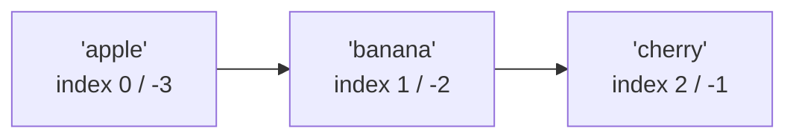
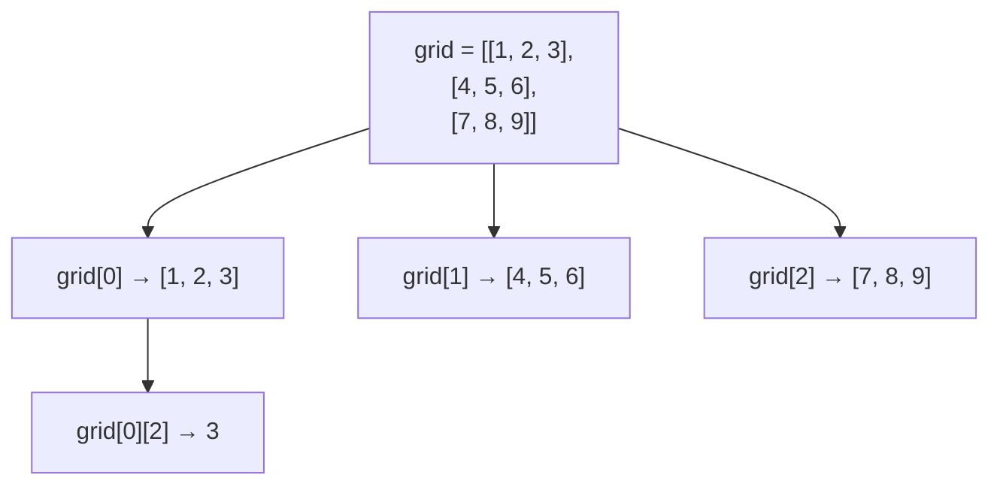

# Lists

---

[← Previous: 2.5 Modules, Packaging & Professional Tooling](../p2-control-structures-functions-tooling/unit-2-5-modules-packaging-tooling.md) | [Go back to TOC](../../README.md) | [Next: 3.2 Tuples →](unit-3-2-tuples.md)

## 1. Learning Objectives

By the end of this unit, you will be able to:

- **Create** a list literal using square brackets `[ ]` and access any element using positive and negative indexing.
- **Apply** slicing with a start, stop, and step (`lst[start:stop:step]`) to extract sub-lists, including the `[::2]` and `[::-1]` idioms.
- **Explain** what mutability means, and demonstrate how it differs from the "everything is a fresh copy" behaviour beginners often assume.
- **Implement** the core list methods (`append`, `insert`, `remove`, `pop`, `extend`, `index`, `count`, `clear`, `sort`) to solve everyday data-handling tasks.
- **Differentiate** between `list.sort()` and the built-in `sorted()`, and between a list and a nested list.
- **Create** a list comprehension that maps and/or filters a sequence in a single expression.

---

## 2. Overview

Every unit so far has dealt with one value at a time — one age, one price, one flag. Real software almost never works that way. A food delivery app does not track a single cart item; it tracks the whole cart. A railway booking system does not store one passenger; it stores every passenger on the PNR. A banking app does not process one transaction in isolation; it works through a whole month's statement. All of this needs a way to hold *many* values under *one* name — and that is exactly what a **list** gives you.

A list is Python's default, everyday container: an ordered collection of values that you can grow, shrink, search, sort, and rearrange after you create it — a property called **mutability**. You already know how to loop with `for`, so a list gives that loop something real to work on. Indian IT teams use lists constantly: to hold rows read from a file before they go into a database, to collect API results before sending a response, to batch records before an ML model scores them.

In this unit, you will learn how to create a list, reach into it with indexing and slicing, understand mutability and its side effects, use the standard list methods, sort a list two different ways, build a list of lists (a **nested list**), and finally compress the common "loop and collect" pattern into a single **list comprehension**. These are skills you will use in nearly every Python program you write from this point forward.

---

## 3. Description

### 3.1 Definition

A **list** is Python's built-in, ordered, changeable collection of values, written as items separated by commas inside square brackets `[ ]`. "Ordered" means the items keep the position you placed them in — the order does not shuffle on its own. "Changeable" (or **mutable**) means you can add, remove, or replace items after the list is created, without building a brand-new list each time.

```python
fruits = ["apple", "banana", "cherry"]
numbers = [10, 20, 30, 40, 50]
mixed = ["Rohit", 25, True, 3.14]   # a list can hold different types together
empty = []                          # a list with zero items is still valid

print(type(fruits))   # <class 'list'>
print(len(fruits))    # 3 — len() reports the number of items
```

Each individual value inside a list is called an **element**. A list can hold zero elements, one element, or millions of elements — the same `[ ]` syntax and the same operations apply regardless of size.

### 3.2 Why This Concept Exists

Without a way to group values, every program would need a separate variable for every single piece of data — `student1_name`, `student2_name`, `student3_name`, and so on, with no way to know in advance how many you would need. That approach breaks the moment the count is not fixed, which is nearly always in real software:

- A UPI app does not know in advance how many transactions a customer will make this month.
- An e-commerce cart does not know in advance how many items a shopper will add.
- A railway booking form does not know in advance how many passengers will be on one PNR (up to a limit).

A list solves this with one mechanism: hold any number of values, of any type, under a single name, in a single variable, and let you loop over them, search them, and change them as the program runs. This is precisely why "lists" (or their equivalent — arrays, in other languages) is one of the very first data structures every programming course teaches, right after variables and control flow.

### 3.3 Key Terminology

| Term | Simple Meaning |
|---|---|
| **List** | Python's ordered, mutable collection of values, written with `[ ]`. |
| **Element** | One individual value stored inside a list. |
| **Index** | The numbered position of an element inside a list, starting at `0`. |
| **Slice** | A sub-section of a list extracted using `start:stop:step`, returned as a new list. |
| **Mutability** | The property of being changeable after creation — a list's contents can be modified in place. |
| **List method** | A built-in function attached to a list, called with dot syntax, e.g. `my_list.append(x)`. |
| **Nested list** | A list that contains other lists as its elements, useful for grids, tables, or rows of data. |
| **List comprehension** | A compact, single-line expression that builds a new list from an existing sequence, optionally mapping and/or filtering it. |
| **In place** | A change made directly to the existing list, without creating a new one. |
| **Alias** | A second variable name that refers to the exact same list in memory, not an independent copy. |
| **`IndexError`** | The error Python raises when you access an index that does not exist in the list. |

### 3.4 Syntax

**List literal:**

Writing a list literal simply means typing out the values you want, separated by commas, inside square brackets. Whatever you write between `[` and `]` becomes the list, in exactly that order — nothing more to it.

```python
fruits = ["apple", "banana", "cherry"]
```

`fruits` is assigned a list literal here: three string values, separated by commas, wrapped in square brackets, kept in the order they were typed.

**Indexing:**

Indexing means asking the list for the single value sitting at one particular position. Every element has a position number, called its **index**, and Python always starts counting from `0` — not `1`. To read a value, write the list's name followed by that position number in square brackets.

```python
fruits = ["apple", "banana", "cherry"]

print(fruits[0])    # apple  — the 1st element, at index 0
print(fruits[2])    # cherry — the 3rd element, at index 2
```



You can also count backward from the end using **negative indexing**: `-1` refers to the last element, `-2` to the second-to-last, and so on — this saves you from writing `fruits[len(fruits) - 1]` every time you need the last item.

```python
print(fruits[-1])   # cherry — last element
print(fruits[-3])   # apple  — same slot as fruits[0]
```

Asking for an index that does not exist — for example `fruits[3]` on this three-element list — raises an `IndexError`. For a list of length `n`, valid positive indices run from `0` to `n - 1`, and valid negative indices run from `-1` to `-n`.

**Slicing:**

Slicing means pulling out a whole chunk of the list at once, instead of one element at a time. You describe the chunk with up to three numbers separated by colons — `start` (included), `stop` (excluded), and `step` (how many positions to jump each time) — and Python hands back a brand-new list containing just that chunk, leaving the original list untouched. Leave out `start` and it defaults to `0`; leave out `stop` and it defaults to `len(my_list)` — so `a[:]` copies the whole list.

```python
a = [0, 1, 2, 3, 4, 5, 6, 7, 8, 9]

print(a[0:2])      # [0, 1]           — start at index 0, stop before index 2
print(a[1:5])      # [1, 2, 3, 4]     — index 5 is excluded
print(a[:3])       # [0, 1, 2]        — start defaults to 0
print(a[7:])       # [7, 8, 9]        — stop defaults to len(a)
print(a[::2])      # [0, 2, 4, 6, 8]  — every 2nd element
print(a[1:5:2])    # [1, 3]           — from index 1 to 5, stepping by 2
print(a[::-1])     # [9, 8, 7, 6, 5, 4, 3, 2, 1, 0] — a reversed copy
```

Two slicing idioms come up so often that they are worth memorizing: `a[::2]` takes every second element, and `a[::-1]` produces the list reversed, because a negative step walks backward through the list. Since a slice always builds a *new* list, slicing itself never changes the original — this is different from the in-place methods you will meet in §3.6.

**Common methods (a small sample — the full set is covered in §3.6):**

| Method | What it does |
|---|---|
| `my_list.append(x)` | Adds `x` as one new element at the end. |
| `my_list.remove(x)` | Deletes the first element equal to `x`. |
| `my_list.sort()` | Sorts the list in place, in ascending order by default. |

**Comparison Table: Python List vs. Array (Other Languages)**

Many languages you may encounter later (C, Java, and others) have a data structure called an **array**, which looks similar to a Python list at first glance but behaves quite differently:

| Aspect | Python `list` | Array (e.g., in C, Java) |
|---|---|---|
| Fixed size? | No — grows and shrinks freely with `append`, `pop`, `insert`, etc. | Usually fixed at creation; resizing often needs a new array |
| Mixed types allowed? | Yes — a single list can hold `int`, `str`, `bool`, even other lists, together | Usually no — most arrays hold only one declared type |
| Declared in advance? | No — Python infers everything at run time (dynamic typing, as in Unit 1.2) | Often yes — many languages require declaring the element type up front |
| Built-in methods | Rich set: `append`, `sort`, `index`, comprehensions, and more | Typically minimal; extra behaviour needs separate library code |

This is why Python lists are often described as more flexible but with some run-time overhead compared to a fixed, single-type array in a statically typed language.

### 3.5 Mutability

A list is **mutable** — its contents can be changed after creation without building a new list. Assigning to a single index replaces that one element; assigning to a slice can replace several elements at once:

```python
colors = ["red", "green", "blue"]
colors[1] = "yellow"               # ['red', 'yellow', 'blue']
colors[0:2] = ["black", "white"]   # ['black', 'white', 'blue']
```

Mutability has a consequence every Python programmer must understand early: a variable holding a list actually holds a *reference* to that list in memory, not a private copy of its contents. If a second name is assigned from the first (`b = a`), both names are **aliases** pointing at the same underlying list — changing the list through one name is visible through the other:

```python
a = [1, 2, 3]
b = a              # b is an alias for a, not a copy
b.append(4)
print(a)           # [1, 2, 3, 4] — a changed too, even though we only touched b
```

To get an independent list, use a full slice (`b = a[:]`) or the `copy()` method (`b = a.copy()`). Both create a **shallow copy** — a new outer list whose elements are copied by reference. For a list of simple values (numbers, strings), this behaves exactly like an independent copy. For a *nested* list, a shallow copy only copies the outer list; the inner lists are still shared, so mutating an inner list through the copy still affects the original. This shallow-copy pitfall is a very common source of hard-to-find bugs and is worth remembering as you move toward more advanced data structures.

### 3.6 List Methods

Lists carry built-in **methods** — functions attached to the list object, invoked with dot syntax: `my_list.method(...)`. The everyday set falls into three groups.

**Methods that add elements:**

- `append(x)` — adds `x` as a single new element at the end.
- `insert(i, x)` — inserts `x` so that it lands at index `i`, shifting later elements one position to the right.
- `extend(iterable)` — adds *each* item from another sequence to the end, one by one.

**Methods that remove elements:**

- `remove(x)` — deletes the first element equal to `x` (raises `ValueError` if `x` is not found).
- `pop(i)` — removes and **returns** the element at index `i`; with no argument, removes and returns the last element.
- `clear()` — removes every element, leaving `[]`.

**Methods that search and count (these do not modify the list):**

- `index(x)` — returns the index of the first element equal to `x` (raises `ValueError` if not found).
- `count(x)` — returns how many times `x` appears in the list.

```python
nums = [1, 2, 3]
nums.append(4)         # [1, 2, 3, 4]
nums.insert(0, 99)     # [99, 1, 2, 3, 4]
nums.extend([5, 6])    # [99, 1, 2, 3, 4, 5, 6]
last = nums.pop()      # last = 6, nums = [99, 1, 2, 3, 4, 5]
```

Notice the difference between `append` and `extend`: `nums.append([5, 6])` adds the list `[5, 6]` as **one** nested element, whereas `nums.extend([5, 6])` unpacks it and adds `5` and `6` as two separate elements. All of `append`, `insert`, `extend`, `remove`, `pop`, and `clear` change the list *in place* — this is mutability at work — while `index` and `count` only read from the list and never change it.

### 3.7 Sorting: `sort()` vs. `sorted()`

Python gives you two ways to order a list, and the difference between them is a frequent interview question:

| Aspect | `list.sort()` | `sorted(list)` |
|---|---|---|
| What it is | A **method**, called on the list itself | A **built-in function**, called with the list as an argument |
| What it returns | `None` | A brand-new sorted list |
| Effect on the original | Rearranges the list **in place** | Leaves the original list untouched |
| Typical use | You don't need the old order back | You need to keep the original order too |

```python
nums = [3, 1, 2]
nums.sort()                   # nums is now [1, 2, 3]; sort() itself returns None

original = [3, 1, 2]
result = sorted(original)     # result == [1, 2, 3]; original is still [3, 1, 2]
```

A very common mistake is writing `nums = nums.sort()` — this assigns `None` to `nums`, because `sort()` returns nothing. Use the method when the original order no longer matters; use the function when you need to preserve it.

Both accept the same two keyword arguments:

- **`reverse=True`** sorts from largest to smallest (descending order).
- **`key=`** takes a function that Python applies to each element first; the list is then sorted by the *result* of that function, not by the raw element.

```python
words = ["banana", "apple", "kiwi"]
print(sorted(words, reverse=True))   # ['kiwi', 'banana', 'apple']
print(sorted(words, key=len))        # ['kiwi', 'apple', 'banana'] — shortest to longest
```

The `key` function can be a built-in like `len`, or any function you define with `def` that accepts one element and returns something comparable.

### 3.8 Nested Lists

A list element can itself be a list — this is called a **nested list**, and it is a natural way to represent a grid, a table, or rows of related data, such as a spreadsheet of student marks or a set of railway seat rows. The first index selects the "row"; a second index then reaches inside that row:



```python
grid = [[1, 2, 3], [4, 5, 6], [7, 8, 9]]

print(grid[0])       # [1, 2, 3]  — the first row, itself a list
print(grid[0][2])    # 3          — row 0, then column 2 inside that row

for row in grid:
    for value in row:
        print(value, end=" ")
    print()
```

Each inner list is a complete list in its own right, with every slicing operation and every method already covered available on it. To visit every value in a nested list, nest one `for` loop inside another, exactly as shown above — the outer loop walks the rows, the inner loop walks the values within each row.

### 3.9 List Comprehension

A **list comprehension** builds a new list from an existing sequence in a single expression, replacing the longer "create an empty list, loop, and `append`" pattern. Read the general form `[expression for item in iterable]` left to right: "the expression, for each item in the iterable." The part before `for` decides what each new element becomes. A comprehension can map, filter, or do both together:

- **Map** — transform every item: `[n * n for n in range(5)]` produces `[0, 1, 4, 9, 16]`.
- **Filter** — add an `if` clause to keep only items that pass a condition: `[n for n in range(10) if n % 2 == 0]` produces `[0, 2, 4, 6, 8]`.
- **Both together** — transform *and* select in one pass: `[n * 2 for n in nums if n % 2 == 0]` produces `[4, 8, 12]` for `nums = [1, 2, 3, 4, 5, 6]`.

```python
nums = [1, 2, 3, 4, 5, 6]
doubled_evens = [n * 2 for n in nums if n % 2 == 0]
print(doubled_evens)   # [4, 8, 12]
```

Reading this line by line: `for n in nums` walks through `1, 2, 3, 4, 5, 6` one at a time; `if n % 2 == 0` keeps only `2, 4, 6` and silently drops the rest; `n * 2` is the expression applied to each survivor, giving `4, 8, 12`, which become the new list. Comprehensions are considered idiomatic Python — once you know the pattern, they read faster than the equivalent loop, and they always return a fresh list without touching the source sequence.

### 3.10 Rules

- List elements are accessed with a zero-based **index**; valid positive indices run from `0` to `len(my_list) - 1`, and valid negative indices run from `-1` to `-len(my_list)`.
- Accessing an index outside this range raises an `IndexError`; this applies to both positive and negative indices.
- A **slice** (`start:stop:step`) never raises an `IndexError` even if `start` or `stop` is out of range — Python simply clamps to the available elements, and an empty range produces an empty list `[]`.
- `stop` in a slice is always **excluded** — `a[1:5]` gives you indices `1, 2, 3, 4`, not `5`.
- Lists are **mutable**; assigning a list to a new name creates an **alias**, not a copy — use `.copy()` or a full slice `[:]` for an independent list.
- Methods that change a list (`append`, `insert`, `extend`, `remove`, `pop`, `clear`, `sort`) act **in place** and typically return `None`; do not assign their result back to the list.
- `sorted()` and slicing always return a **new** list and never modify the argument they were given.
- Never add or remove elements from a list while a `for` loop is directly iterating over it — doing so can skip elements or raise errors (see §3.12).

### 3.11 Best Practices

- Prefer a list comprehension over a manual "empty list + loop + `append`" pattern when the transformation is simple enough to read in one line.
- Use `sorted()` (not `sort()`) whenever you still need the original, unsorted list later in the program.
- Use `.copy()` or `a[:]` explicitly whenever you intend to work on an independent version of a list — never assume `b = a` gives you a separate list.
- Prefer `if x in my_list:` for membership checks and reserve `index()`/`count()` for when you actually need the position or the frequency.
- When looping with both position and value, use `enumerate(my_list)` (from Module P2) instead of manually managing `range(len(my_list))`.
- Give lists plural, descriptive names (`student_names`, `cart_prices`) so it is clear at a glance that the variable holds many values, not one.

### 3.12 Common Mistakes

- **`IndexError: list index out of range`** — accessing an index that does not exist, most often the classic off-by-one error of assuming the last valid index is `len(my_list)` instead of `len(my_list) - 1`.
- **Off-by-one errors in slicing** — forgetting that `stop` is excluded, so `my_list[0:3]` gives 3 elements (indices `0, 1, 2`), not 4; and confusing `my_list[1:3]` with "elements 1 through 3."
- **Mutating a list while iterating over it** — calling `remove()` or `pop()` inside a `for` loop that is walking the same list can silently skip elements, because the list shifts under the loop's feet as items are removed. Build a new list (often with a comprehension) or iterate over a copy (`for x in my_list[:]:`) instead.
- **Assuming `new_list = old_list` makes a copy** — it only creates a second name for the same list; changes through either name affect both.
- **Writing `my_list = my_list.sort()`** — this discards the list entirely, because `sort()` returns `None`.
- **Confusing `append()` with `extend()`** — `my_list.append([1, 2])` adds one nested list as a single element; `my_list.extend([1, 2])` adds `1` and `2` as two separate elements.

### 3.13 Code Examples

The following single, running example follows a class teacher tracking the marks of a 5-student Python quiz, one operation at a time — using every core list skill from this unit inside one coherent scenario, instead of several disconnected snippets.

**Step 1 — Create the list and inspect it:**

```python
marks = [78, 85, 92, 66, 74]
print(marks)          # [78, 85, 92, 66, 74]
print(type(marks))    # <class 'list'>
print(len(marks))     # 5
```

*Line-by-line explanation:*
- `marks = [78, 85, 92, 66, 74]` creates a list of five quiz scores, one per student, in entry order.
- `print(marks)` displays the whole list exactly as written.
- `print(type(marks))` confirms the type is `<class 'list'>`.
- `print(len(marks))` reports the element count, `5`.

**Step 2 — Index and slice the marks:**

```python
print(marks[0])       # 78 — first student's mark
print(marks[-1])      # 74 — last student's mark
print(marks[1:4])     # [85, 92, 66] — students 2 through 4
print(marks[::2])     # [78, 92, 74] — every alternate mark
```

*Line-by-line explanation:*
- `marks[0]` uses positive indexing to reach the first student's mark.
- `marks[-1]` uses negative indexing to reach the last mark directly, without computing `len(marks) - 1`.
- `marks[1:4]` slices from index `1` up to, but excluding, index `4`, returning three marks as a brand-new list.
- `marks[::2]` uses a step of `2` with default start and stop, picking every alternate mark; the original `marks` is untouched by either slice.

**Step 3 — Fix a mis-entered mark (mutability):**

```python
marks[3] = 70          # student 4's mark was mis-entered as 66; the real mark is 70
print(marks)           # [78, 85, 92, 70, 74]
```

*Line-by-line explanation:*
- `marks[3] = 70` replaces the element at index `3` in place — no new list is created, which is only possible because a list is **mutable**.
- `print(marks)` confirms the correction is now part of `marks` itself.

**Step 4 — Add and remove entries with methods:**

```python
marks.append(88)    # a 6th student's mark arrives late
marks.remove(78)     # the first student was disqualified for malpractice
print(marks)          # [85, 92, 70, 74, 88]
```

*Line-by-line explanation:*
- `marks.append(88)` adds the late student's mark as a single new element at the end, in place.
- `marks.remove(78)` deletes the first element equal to `78` — the disqualified student's mark — shifting the remaining elements left, also in place.
- Both methods change `marks` directly and return `None`, so neither result is assigned back to `marks`.

**Step 5 — Sort the marks:**

```python
marks.sort()
print(marks)   # [70, 74, 85, 88, 92]
```

*Line-by-line explanation:*
- `marks.sort()` reorders `marks` in place in ascending order and returns `None`; writing `marks = marks.sort()` here would wipe out the list, which is why the result is never reassigned.
- `print(marks)` shows the five remaining marks now ranked lowest to highest.

**Step 6 — Store names alongside marks (a nested list):**

```python
students = [
    ["Aarav", 70],
    ["Diya", 74],
    ["Kabir", 85],
    ["Ishaan", 88],
    ["Meera", 92],
]

for student in students:
    name, mark = student
    print(f"{name}: {mark}")
```

*Line-by-line explanation:*
- `students` is a **nested list**: the outer list holds one class's students, and each inner list holds one student's `[name, mark]`, already matching the sorted order from Step 5.
- `for student in students:` walks through each inner list in turn; `name, mark = student` unpacks the two values of that inner list into two separate names in one step.
- The `f-string` inside `print()` builds one readable line per student from those unpacked values.

**Step 7 — Filter the toppers with a list comprehension:**

```python
toppers = [s[0] for s in students if s[1] >= 85]
print("Students who scored 85 or above:", toppers)
```

*Line-by-line explanation:*
- `for s in students` walks through each `[name, mark]` inner list.
- `if s[1] >= 85` keeps only students whose mark (index `1`) is `85` or above, silently dropping the rest.
- `s[0]` (the name, index `0`) is the expression collected for each student who passes the condition, producing a brand-new list without touching `students` itself.

*Expected output (all seven steps, in order):*
```
[78, 85, 92, 66, 74]
<class 'list'>
5
78
74
[85, 92, 66]
[78, 92, 74]
[78, 85, 92, 70, 74]
[85, 92, 70, 74, 88]
[70, 74, 85, 88, 92]
Aarav: 70
Diya: 74
Kabir: 85
Ishaan: 88
Meera: 92
Students who scored 85 or above: ['Kabir', 'Ishaan', 'Meera']
```

#### Try It Yourself

Using the same class-marks scenario, a new quiz has just been graded: `marks = [55, 90, 40, 85, 60]`.

1. Sort `marks` in ascending order and print the highest mark using indexing.
2. A late entrant's mark of `95` needs to be added, and the lowest scorer's mark of `40` must be removed (that student did not attend). Update `marks` accordingly and print it.
3. Using a list comprehension, build a new list called `passers` containing only the marks that are `60` or above, and print how many students passed using `len()`.

**Solution — Part 1:**

```python
marks = [55, 90, 40, 85, 60]
marks.sort()
print(marks)
print("Highest mark:", marks[-1])
```

*Expected output:*
```
[40, 55, 60, 85, 90]
Highest mark: 90
```

**Solution — Part 2:**

```python
marks.append(95)
marks.remove(40)
print(marks)
```

*Expected output:*
```
[55, 60, 85, 90, 95]
```

**Solution — Part 3:**

```python
passers = [m for m in marks if m >= 60]
print(passers)
print("Number of students who passed:", len(passers))
```

*Expected output:*
```
[60, 85, 90, 95]
Number of students who passed: 4
```

---

## 4. Real-World Application

- **Banking & FinTech:** A monthly statement is a list of transaction records, each perhaps itself a small nested list or a row of related values — filtered, summed, and sorted using exactly the operations covered in this unit.
- **UPI / Payment Systems:** A payment gateway batches pending transactions in a list before processing them, and uses list comprehensions to pull out only the failed or pending ones for retry.
- **E-commerce:** A shopping cart is a list of item prices or item records; `sorted(cart, reverse=True)[:3]` instantly gives the three most expensive items, and comprehensions apply discounts or GST to every item in one line.
- **Healthcare:** A ward management system holds a list of patient temperature readings or vitals over a shift, sorted and filtered to flag anyone outside a safe range.
- **Railway Booking (IRCTC-style systems):** As shown in the example above, a PNR's passenger list is naturally a nested list, iterated and filtered to calculate fares by age category.
- **Education:** A gradebook is a list of student scores; sorting ranks the class, and a comprehension can compute a curved score for every student in one expression.
- **AI/ML & Cloud Apps:** Batches of input data, model predictions, and API responses are almost always assembled and processed as lists before being handed to the next stage of a pipeline.

---

## 5. Worked Example

### Problem Statement

Priya is writing backend logic for a food delivery app's shopping cart. Given a list of item prices, she must: add a newly selected item, remove an item the customer decided against, find the total value of the three most expensive items in the cart, and produce a new list showing each remaining item's price with 5% GST added.

### Step 1: Understand the Problem

The input is a list of numeric prices. The task has four parts: grow the list with one new price, shrink it by removing one specific price, compute a total over a ranked sub-set (the top three), and produce a transformed list (GST-inclusive prices) without disturbing the original values used for ranking.

### Step 2: Plan the Solution

Start with a list literal of prices. Use `append()` to add the new item and `remove()` to take out the unwanted one. Use `sorted(..., reverse=True)` combined with slicing `[:3]` to get the top three most expensive items without changing the cart's own order, then `sum()` them. Finally, use a list comprehension to build a new list where every price has 5% GST added, rounded to two decimals.

### Step 3: Write the Python Code

```python
cart_prices = [199, 349, 99, 599, 249]

cart_prices.append(149)
cart_prices.remove(99)

top_three = sorted(cart_prices, reverse=True)[:3]
total_top_three = sum(top_three)

prices_with_gst = [round(price * 1.05, 2) for price in cart_prices]

print("Cart after update:", cart_prices)
print("Top 3 priciest items:", top_three)
print("Total of top 3:", total_top_three)
print("Prices with GST:", prices_with_gst)
```

### Step 4: Explain Each Line

- `cart_prices = [199, 349, 99, 599, 249]` creates the starting list of five item prices.
- `cart_prices.append(149)` adds the newly selected item's price to the end, in place.
- `cart_prices.remove(99)` deletes the first (and only) occurrence of `99`, in place, shifting the remaining elements.
- `sorted(cart_prices, reverse=True)` returns a **new** list ranked from highest to lowest price, leaving `cart_prices` itself untouched; `[:3]` slices off just the first three elements of that ranked list.
- `sum(top_three)` adds up those three prices into a single total.
- `prices_with_gst = [round(price * 1.05, 2) for price in cart_prices]` is a list comprehension: for every `price` in the (now updated) `cart_prices`, it computes `price * 1.05` (adding 5% GST) and rounds the result to two decimal places, collecting all of these into a new list.
- The four `print()` calls display the updated cart, the top three prices, their total, and the GST-adjusted price list.

### Step 5: Sample Input

```
cart_prices = [199, 349, 99, 599, 249]
```
(All values are hard-coded in this example; no user input is taken.)

### Step 6: Expected Output

```
Cart after update: [199, 349, 599, 249, 149]
Top 3 priciest items: [599, 349, 249]
Total of top 3: 1197
Prices with GST: [208.95, 366.45, 628.95, 261.45, 156.45]
```

### Step 7: Why the Output Is Produced

`append(149)` and `remove(99)` change `cart_prices` in place, leaving `[199, 349, 599, 249, 149]` — this is the list shown first. `sorted(cart_prices, reverse=True)` ranks these five values from highest to lowest as `[599, 349, 249, 199, 149]` without altering `cart_prices`, and `[:3]` takes the first three of that ranked list, giving `[599, 349, 249]`, whose sum is `1197`. Finally, the comprehension walks the *updated* `cart_prices` in its original (unsorted) order and multiplies each price by `1.05`, so the GST list lines up position-for-position with `[199, 349, 599, 249, 149]`, not with the sorted ranking — a detail worth noticing, since it shows that sorting for the top-three calculation never touched the underlying cart order used everywhere else.

---

### Important Notes (Interview Insights)

- A very common fresher interview question: *"Is a Python list mutable or immutable?"* Answer confidently: a list is **mutable** — its contents can change after creation, unlike the tuple you will study in Unit 3.2, which is **immutable** once built.
- Interviewers frequently probe the **aliasing vs copying** distinction: `b = a` makes `b` a second name for the *same* list object; only `a.copy()` or `a[:]` (a **shallow copy**) creates an independent outer list. Be ready to explain that a shallow copy of a *nested* list still shares its inner lists with the original — a subtlety that trips up many candidates.
- Be ready to explain why `list.sort()` returns `None` while `sorted()` returns a new list — this single question is asked constantly, and getting it wrong (`x = some_list.sort()`) is one of the most common real bugs in beginner code.
- Know that list indexing runs in O(1) time (constant-time element access), while slicing runs in O(k) time (proportional to the length of the slice) — interviewers sometimes ask why lists are efficient for this kind of access.

---

## 6. Key Takeaways

- A **list** is Python's ordered, mutable collection, written with `[ ]`; elements are reached by a zero-based **index**, with `0` as the first and `-1` as the last.
- **Slicing** (`my_list[start:stop:step]`) always returns a *new* list; `stop` is excluded, and `a[::2]` / `a[::-1]` are two idioms worth memorizing.
- Lists are **mutable** — `b = a` creates an **alias**, not a copy; use `.copy()` or `a[:]` for an independent list, and remember that a shallow copy of a nested list still shares its inner lists.
- In-place methods (`append`, `insert`, `extend`, `remove`, `pop`, `clear`, `sort`) modify the list directly and return `None`; `sorted()` and slices return brand-new lists instead.
- **`list.sort()` reorders in place and returns `None`; `sorted(list)` returns a new sorted list and leaves the original unchanged** — both accept `reverse=` and `key=`.
- A **nested list** (a list of lists) models rows of related data, such as a grid or a set of passenger records, accessed with two indices: `grid[row][column]`.
- A **list comprehension** (`[expr for item in iterable if condition]`) maps and/or filters a sequence in a single line, replacing the longer empty-list-loop-`append` pattern.
- Never modify a list while a `for` loop is directly iterating over it — iterate over a copy, or build a new list with a comprehension instead.

Coming next: tuples — a collection that looks similar to a list but makes the opposite trade-off: no mutability, in exchange for a guarantee that its contents can never change out from under you (Unit 3.2 — Tuples).

---

## 7. Reference Links

- [The Python Tutorial — Data Structures (Lists)](https://docs.python.org/3/tutorial/datastructures.html)
- [Python 3 Documentation — Common Sequence Operations and List Methods](https://docs.python.org/3/library/stdtypes.html#common-sequence-operations)
- [Python 3 Documentation — List Comprehensions](https://docs.python.org/3/tutorial/datastructures.html#list-comprehensions)
- [Real Python — Lists and Tuples in Python](https://realpython.com/python-lists-tuples/)
- [W3Schools — Python Lists](https://www.w3schools.com/python/python_lists.asp)

[← Previous: 2.5 Modules, Packaging & Professional Tooling](../p2-control-structures-functions-tooling/unit-2-5-modules-packaging-tooling.md) | [Go back to TOC](../../README.md) | [Next: 3.2 Tuples →](unit-3-2-tuples.md)

---

*© 2026 Revature · AI Native Engineering — Foundations · Unit 3.1 · Version 2.0*
