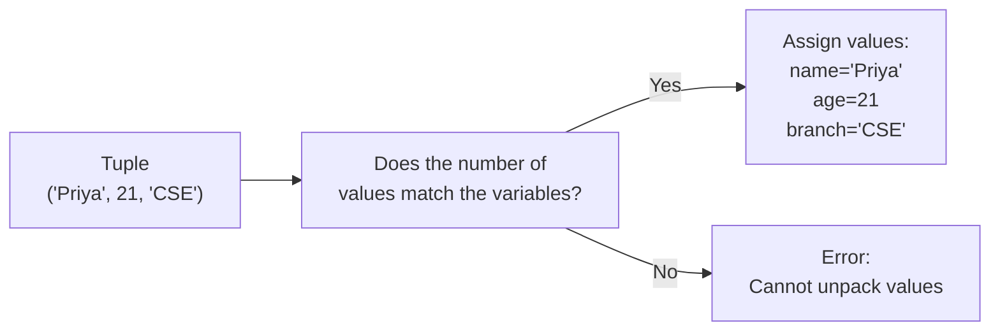

# Tuples

---

[← Previous: 3.1 Lists](unit-3-1-lists.md) | [Go back to TOC](../../README.md) | [Next: 3.3 Sets →](unit-3-3-sets.md)

## 1. Learning Objectives

By the end of this unit, you will be able to:

- **Create** a tuple by packing values with commas, using parentheses `()`, or building one from any iterable with `tuple()`.
- **Explain** immutability — what it forbids, why a tuple exposes only two methods, and why that matters for shared data.
- **Apply** unpacking to spread a tuple's values into variables, including the `a, b = b, a` swap and star-unpacking.
- **Differentiate** between a list and a tuple, and decide correctly which one a given piece of data calls for.
- **Implement** nested tuples and basic tuple operations — concatenation, repetition, membership, `count()`, and `index()`.
- **Debug** the two most common tuple mistakes — a missing trailing comma on a single-element tuple, and attempting to mutate a tuple in place.

---

## 2. Overview

You've already worked with lists — ordered collections you can freely grow, shrink, and edit. A **tuple** is Python's other ordered collection, and it looks almost identical on the surface: you can index into it, slice it, loop over it, and check membership with `in`. The one deliberate difference is that a tuple, once created, **cannot be changed**. Where a list says "here is a collection I might edit," a tuple says "here is a fixed group of values that belong together and will stay exactly as they are."

Think of your own date of birth — say, 15 August 2005. That date is really three numbers, `(day, month, year)`, and they only mean something as a complete set. If someone quietly changed just the day to `20`, you wouldn't have "the same birthday, slightly corrected" — you would have a completely different date, and every certificate or form that used it would now be wrong. That is exactly the risk a tuple removes: once you write `(15, 8, 2005)`, Python guarantees that no part of it can be changed later without your program deliberately building a brand-new tuple.

The same idea shows up all the time in real code, not just dates: a bank account number paired with its IFSC code, or a seat allotment written as `(coach, seat_number)`, are both a fixed set of values that belong together and should never be edited one piece at a time. This is why tuples show up constantly in real Indian IT systems — banking apps, UPI payment gateways, e-commerce platforms, and railway booking engines — often without anyone even calling them "tuples" by name. In fact, you have almost certainly used one already: any time a Python function returns more than one value at once, it is packing those values into a tuple behind the scenes.

This unit covers how to create and access tuples, how tuple assignment and unpacking work (including the classic variable-swap trick), how tuples can be nested inside one another, what immutability actually means in practice, and the small set of basic operations every tuple supports. By the end, "should this be a list or a tuple?" will be a question you can answer instantly.

---

## 3. Description

### 3.1 Definition

A **tuple** is an ordered, immutable sequence of values, written as comma-separated values, usually inside parentheses:

```python
point = (3, 5)
rgb = (255, 128, 0)
person = ("Ada", 36, True)
```

"Ordered" means every value has a fixed position (an **index**), exactly like a list. "Immutable" means that once the tuple is built, you cannot add, remove, or replace any of its elements — the collection is locked for its entire lifetime. A tuple can hold values of different types in the same tuple, just like a list can.

**Comparison Table: List vs Tuple**

| Aspect | List | Tuple |
|---|---|---|
| Mutability | Mutable — can be changed after creation | Immutable — cannot be changed after creation |
| Syntax | Square brackets `[1, 2, 3]` | Parentheses (or just commas) `(1, 2, 3)` |
| Methods available | Many — `append()`, `insert()`, `remove()`, `pop()`, `sort()`, and more | Only two — `count()` and `index()` |
| Hashable | No — cannot be used as a dictionary key or set element | Yes — can be used as a dictionary key or set element, provided every element inside it is itself hashable |
| Typical use case | A collection that grows, shrinks, or reorders over time | A fixed group of related values, or a function's multiple return values |
| Performance | Slightly slower to iterate; more memory overhead for the same data | Slightly faster to iterate; lower memory overhead, since Python can optimise fixed-size storage |

### 3.2 Why Immutability Matters

A list is deliberately flexible — that flexibility is exactly why it exists. But flexibility has a cost: any piece of code that receives a list can accidentally (or deliberately) change it, and every other piece of code holding a reference to that same list will see the change too. For data that is genuinely meant to travel together and never change — a coordinate pair, a date `(day, month, year)`, a fixed configuration record — that flexibility is a liability, not a feature.

The tuple exists to solve exactly this problem. By refusing to support any operation that changes its contents, a tuple gives you a guarantee: once you receive one, you can trust that it will look the same later, no matter who else is holding a reference to it. This guarantee is also *why* a function that needs to return multiple values almost always returns them as a tuple — the caller can trust the returned group will not be silently altered by anything in between.

### 3.3 Key Terminology

| Term | Simple Meaning |
|---|---|
| **Tuple** | An ordered, immutable sequence of values, typically written with parentheses. |
| **Immutability** | The property that an object's contents cannot be changed after creation. |
| **Packing** | Writing several values together, separated by commas, to build a tuple. |
| **Unpacking** | Spreading a tuple's values into separate variables in one assignment statement. |
| **Nested tuple** | A tuple that contains another tuple as one of its elements. |
| **`tuple()`** | The built-in function that builds a tuple from any iterable (a list, a string, etc.). |
| **Sequence** | Any ordered collection whose elements can be accessed by index — lists, tuples, and strings are all sequences. |
| **Index** | The position of an element in a sequence, starting at `0`. |
| **Slice** | A sub-sequence extracted using `start:stop:step` notation, e.g. `nums[1:3]`. |
| **Hashable** | An object whose value never changes and can therefore be used as a dictionary key or placed inside a set. |
| **Lexicographic comparison** | Comparing two sequences element by element, left to right, the same way words are compared in a dictionary — for example, `(1, 2) < (1, 3)` is `True`, because the first elements are equal and the second pair decides the result. |

### 3.4 Syntax

**Creating a tuple:**

```python
name = (value1, value2, value3)
```

Example:

```python
student = ("Priya", 21, "CSE")
```

The parentheses `(` and `)` visually mark this as a tuple, but they are optional in most cases — it is actually the **comma** between values that creates the tuple, not the parentheses. Each comma separates one packed value from the next. Parentheses are still recommended for readability, and are required in a few contexts, such as an empty tuple `()` or passing a tuple directly as a function argument. Here, `student` becomes a tuple holding three values: `"Priya"`, `21`, and `"CSE"`.

**Unpacking a tuple:**

```python
a, b, c = (10, 20, 30)
```

Example:

```python
name, age, branch = ("Priya", 21, "CSE")
print(name, age, branch)
```

Output:
```
Priya 21 CSE
```

The variable names on the left (`name, age, branch`) are matched one-to-one, in order, with the values on the right. The `=` here is the same assignment operator you already know — it simply works on multiple names at once when the right-hand side is a tuple (or any iterable) of matching length. The number of names on the left must exactly match the number of values on the right, or Python raises a `ValueError`.

**Tuple Unpacking Flow**



**Tuple Methods (the only two that exist):**

Because a tuple can never be changed, it has no need for any method that adds, removes, or reorders elements — every method a list has for that purpose (`append`, `remove`, `sort`, and the rest) simply does not exist on a tuple. Only two methods remain, and both just *read* the tuple without changing it:

| Method | What it does | Sample Syntax | Result |
|---|---|---|---|
| `my_tuple.count(x)` | Counts how many times the value `x` appears in the tuple. | `(10, 20, 20, 30).count(20)` | `2` |
| `my_tuple.index(x)` | Returns the index of the **first** occurrence of `x`; raises `ValueError` if `x` is not found. | `(10, 20, 20, 30).index(20)` | `1` |

```python
marks = (78, 82, 85, 82, 90)

print(marks.count(82))     # 2  — 82 appears twice
print(marks.index(85))     # 2  — 85 is first found at index 2
print(marks.index(100))    # ValueError: tuple.index(x): x not in tuple
```

`count()` and `index()` are the entire tuple API — there is nothing else to memorize, because there is nothing else a tuple is allowed to do to itself.

### 3.5 Rules

- A tuple is created by the **comma**, not the parentheses — `1, 2, 3` and `(1, 2, 3)` produce the identical tuple.
- A single-element tuple **must** have a trailing comma: `(42,)` is a tuple of one item; `(42)` is simply the integer `42`.
- Once created, a tuple's elements **cannot** be reassigned, added, or removed — `my_tuple[0] = 5` raises a `TypeError`.
- `tuple()` accepts exactly **one** argument, which must be an iterable — `tuple([1, 2, 3])` works, but `tuple(1, 2, 3)` raises a `TypeError`.
- Unpacking requires the number of variables on the left to **match** the number of elements on the right, unless you use a star-expression (`*rest`) to collect the extra values into a list.
- Indexing and slicing on a tuple follow the same rules as a list — index `0` is the first element, negative indices count from the end, and a slice always returns a new tuple.

### 3.6 Best Practices

- Prefer a **tuple** over a list when the data is a fixed, related group of values that should never change — a coordinate, a colour, a date, a database row, or the multiple return values of a function.
- Prefer a **list** when the collection's size or contents will change over the program's life — items being added, removed, or reordered.
- Use tuples for function return values whenever a function needs to hand back more than one piece of information — this is the most common real-world use of tuples in Python code.
- Add a trailing comma to every single-element tuple you write — make it a habit, not something you remember only after hitting a bug.
- Use meaningful variable names when unpacking (`name, age, branch = student`) rather than generic ones (`a, b, c = student`), so the code reads clearly.

### 3.7 Common Mistakes

- **Forgetting the trailing comma** on a single-element tuple — writing `single = (5)` creates an `int`, not a tuple; `type(single)` will quietly show `<class 'int'>` instead of `<class 'tuple'>`, a bug that is easy to miss.
- **Trying to mutate a tuple** — code like `my_tuple[0] = "new value"` or `my_tuple.append(x)` raises a `TypeError` (item assignment) or `AttributeError` (no such method), because a tuple simply does not support either operation.
- **Mismatched unpacking count** — writing `a, b = (1, 2, 3)` raises `ValueError: too many values to unpack`, because there are three values but only two variables.
- **Calling `tuple()` with loose arguments** — `tuple(1, 2, 3)` raises a `TypeError`, because `tuple()` takes exactly one iterable, not several separate values.
- **Assuming immutability applies to everything inside** — a tuple that contains a list (e.g. `record = ("Ada", [90, 85])`) cannot swap out that inner list for a different object, but the inner list itself can still be edited in place — a subtlety worth remembering.

### 3.8 Code Examples

**Consolidated example — a college fresher's academic record, built entirely with tuples**

A college registration system needs to store a fixed set of facts about each student — details that are read constantly but must never be edited in place once the record is created. This single example builds up one student's record step by step, using nothing but tuples.

**Step 1 — Creating a tuple and indexing into it, including a nested tuple:**

```python
student = ("STU2026047", "Ananya Rao", "CSE", ("Mysuru", "Karnataka"))

print(student[0])
print(student[1])
print(student[3])
print(student[3][0])
```

*Line-by-line explanation:*
- `student = (...)` packs four values into one tuple: a roll number, a name, a branch, and a **nested tuple** `("Mysuru", "Karnataka")` holding the student's home city and state.
- `student[0]` accesses the element at index `0` — the roll number.
- `student[1]` accesses the element at index `1` — the name.
- `student[3]` accesses the element at index `3` — the entire nested tuple.
- `student[3][0]` uses **chained indexing**: `[3]` reaches the nested tuple first, then `[0]` reaches its first element, the city.
- Output:
  ```
  STU2026047
  Ananya Rao
  ('Mysuru', 'Karnataka')
  Mysuru
  ```

**Step 2 — Unpacking the record, including star-unpacking a tuple of semester marks:**

```python
roll_no, name, branch, hometown = student
city, state = hometown
print(roll_no, name, branch, city, state)

semester_marks = (78, 82, 85, 90, 91)
first_semester, *later_semesters = semester_marks
print(first_semester, later_semesters)
```

*Line-by-line explanation:*
- `roll_no, name, branch, hometown = student` unpacks the outer tuple into four variables in one line — the number of names on the left matches the number of values on the right.
- `city, state = hometown` unpacks the nested tuple the same way, now that `hometown` has been pulled out on its own.
- `print(roll_no, name, branch, city, state)` displays every piece of the record now that it has been unpacked into readable variables.
- `semester_marks = (78, 82, 85, 90, 91)` packs five semester scores into a fixed tuple — a record of results that should not be edited after the fact.
- `first_semester, *later_semesters = semester_marks` demonstrates **star-unpacking**: `first_semester` takes the first value, `78`, and `*later_semesters` collects every remaining value into a new list, however many there are.
- Output:
  ```
  STU2026047 Ananya Rao CSE Mysuru Karnataka
  78 [82, 85, 90, 91]
  ```

**Step 3 — Immutability: a fixed record cannot be edited in place:**

```python
try:
    student[1] = "Ananya R. Rao"
except TypeError as error:
    print("Error:", error)
```

*Line-by-line explanation:*
- The `try` block attempts `student[1] = "Ananya R. Rao"` — changing the name in place — which raises a `TypeError`, because a tuple does not support item assignment.
- The `except TypeError as error:` block catches that error and prints a clear message instead of letting the program crash.
- Output:
  ```
  Error: 'tuple' object does not support item assignment
  ```

**Step 4 — Basic tuple operations: concatenation, repetition, membership, `count()`, and `index()`:**

```python
semester_6_marks = (88, 84)
all_marks = semester_marks + semester_6_marks
print(all_marks)

fresh_admission_marks = (0,) * 3
print(fresh_admission_marks)

print(90 in all_marks)
print(all_marks.count(84))
print(all_marks.index(85))
```

*Line-by-line explanation:*
- `semester_6_marks = (88, 84)` packs two more scores into their own tuple.
- `all_marks = semester_marks + semester_6_marks` **concatenates** the two tuples into a brand-new, longer tuple — neither original tuple is changed.
- `fresh_admission_marks = (0,) * 3` **repeats** the single-element tuple `(0,)` three times over — a quick way to build a placeholder record of three zero scores for a newly admitted student who hasn't taken any exams yet.
- `90 in all_marks` checks **membership** and returns `True`, since `90` does appear somewhere in `all_marks`.
- `all_marks.count(84)` counts how many times the value `84` appears in `all_marks`.
- `all_marks.index(85)` returns the position of the *first* occurrence of `85` in `all_marks`.
- Output:
  ```
  (78, 82, 85, 90, 91, 88, 84)
  (0, 0, 0)
  True
  1
  2
  ```

#### Try It Yourself

**Exercise: A second student's record**

A new student joins the CSE branch: roll number `"STU2026048"`, name `"Rahul Menon"`, branch `"CSE"`, and hometown `("Kochi", "Kerala")`. Their first four semester scores are `(65, 70, 88, 92)`.

**Part 1 (Easy):** Create a tuple named `student2` holding all four pieces of the record described above, with the hometown stored as a nested tuple. Then, using indexing, print the student's name and their home state.

**Solution:**

```python
student2 = ("STU2026048", "Rahul Menon", "CSE", ("Kochi", "Kerala"))
print(student2[1])
print(student2[3][1])
```

Output:
```
Rahul Menon
Kerala
```

**Part 2 (Medium):** Unpack `student2` into four variables (`roll_no`, `name`, `branch`, `hometown`). Then create a tuple `marks2 = (65, 70, 88, 92)` and use star-unpacking to capture the first score in its own variable and the remaining scores in a list. Print both unpacked results.

**Solution:**

```python
roll_no, name, branch, hometown = student2
marks2 = (65, 70, 88, 92)
first, *rest = marks2
print(roll_no, name, branch, hometown)
print(first, rest)
```

Output:
```
STU2026048 Rahul Menon CSE ('Kochi', 'Kerala')
65 [70, 88, 92]
```

**Part 3 (Harder):** Concatenate `marks2` with a new semester score tuple `(95,)` to form `full_marks2`. Check whether the student ever scored above `90` by testing `95 in full_marks2`. Then, inside a `try`/`except`, attempt to overwrite the branch in `student2` (e.g. change it to `"ECE"`) and print the error Python raises.

**Solution:**

```python
full_marks2 = marks2 + (95,)
print(full_marks2)
print(95 in full_marks2)

try:
    student2[2] = "ECE"
except TypeError as error:
    print("Error:", error)
```

Output:
```
(65, 70, 88, 92, 95)
True
Error: 'tuple' object does not support item assignment
```

---

## 4. Real-World Application

**Scenario: A bank confirming a fund transfer**

Picture a bank's backend just after it processes a fund transfer, handing back one fixed confirmation record:

```python
transfer = ("TXN783420", "HDFC0001234", 15000.00, "SUCCESS")
```

Every question the app built on top of this needs to ask is answered by something you just learned:

- **"The transfer function needs to hand back four pieces of information at once."** → returning them together as a tuple, which the caller then **unpacks**: `txn_id, ifsc, amount, status = transfer`.
- **"What was the transaction ID?"** → **indexing**: `transfer[0]`.
- **"Did this transfer succeed?"** → reading the last field after unpacking: `status == "SUCCESS"`.
- **"Can any part of this confirmation be edited after it's issued?"** → no — the **immutability guarantee**: `transfer[2] = 20000` raises a `TypeError`, exactly as it should for a record that must never quietly change after the fact.

That is the entire real-world application in one clear picture: a fixed, ordered group of values that travel together, handed back from one function call and trusted never to change underneath the caller. Once this one example is clear, you will recognize the exact same shape again and again in production systems: a GPS reading stored as `(latitude, longitude)`, a railway seat allotment as `(coach, seat_number)`, a student's fixed academic identity as `(roll_number, name, branch)` — all are this same fund-transfer scenario wearing a different name.

---

## 5. Worked Example

### Problem Statement

You are asked to model a single railway ticket booking confirmation, similar to an IRCTC-style system. Each booking record must hold the PNR number, the passenger's name, their seat allotment as a `(coach, seat_number)` pair, and the fare — and once printed, the confirmation must never be silently altered by the rest of the program.

### Step 1: Understand the Problem

A booking has four pieces of information, and all four naturally belong together as one fixed unit once the booking is confirmed: a PNR (text), a passenger name (text), a seat allotment (itself a pair of coach and seat number), and a fare (a decimal amount). Since a confirmed booking should not be editable in place, this is a clear case for a tuple rather than a list.

### Step 2: Plan the Solution

Build the booking as a tuple with a nested tuple for the seat allotment. Unpack the booking into readable variables, then unpack the nested seat tuple further. Print the details. Finally, demonstrate what happens if the code mistakenly tries to change the fare in place, and show the correct way to "update" a booking — by building a new tuple.

### Step 3: Write the Python Code

```python
booking = ("PNR4821093", "Ananya Sharma", ("B2", 34), 1250.00)

pnr, passenger_name, seat, fare = booking
coach, seat_number = seat

print("PNR:", pnr)
print("Passenger:", passenger_name)
print("Seat:", coach, seat_number)
print("Fare:", fare)

try:
    booking[3] = 1500.00
except TypeError as error:
    print("Cannot modify booking:", error)

booking = (pnr, passenger_name, seat, 1500.00)
print("Updated fare:", booking[3])
```

### Step 4: Explain Each Line

- `booking = ("PNR4821093", "Ananya Sharma", ("B2", 34), 1250.00)` creates one tuple holding all four booking details, with the seat allotment stored as a nested tuple `("B2", 34)`.
- `pnr, passenger_name, seat, fare = booking` unpacks the outer tuple into four variables in one line.
- `coach, seat_number = seat` unpacks the nested seat tuple into two further variables.
- The four `print()` calls display each piece of the confirmation clearly, with the nested values already separated out.
- The `try` block attempts `booking[3] = 1500.00` — changing the fare in place — which raises a `TypeError`, because tuples do not support item assignment; the `except` block catches it and prints a clear message instead of crashing.
- `booking = (pnr, passenger_name, seat, 1500.00)` shows the *correct* way to change a booking's fare: build an entirely new tuple with the updated value and rebind the name `booking` to it — the old tuple is discarded, not edited.
- `print("Updated fare:", booking[3])` confirms the new tuple now holds the updated fare.

### Step 5: Sample Input

None. All values are defined directly in the code for this example.

### Step 6: Expected Output

```
PNR: PNR4821093
Passenger: Ananya Sharma
Seat: B2 34
Fare: 1250.0
Cannot modify booking: 'tuple' object does not support item assignment
Updated fare: 1500.0
```

### Step 7: Why the Output Is Produced

The first four lines come directly from unpacking the original tuple and its nested seat tuple — Python binds each variable to the value in the matching position, exactly once. The attempt to write `booking[3] = 1500.00` fails immediately because a tuple has no mechanism to change an existing element — Python raises a `TypeError` before any value can be altered, and the `except` block prints that error instead of letting the program crash. The final line succeeds because the code never tried to edit the old tuple at all — it built a completely new tuple with the updated fare and rebound the name `booking` to point to it, which is the only correct way to "change" a tuple's contents.

---

### Important Notes (Interview Insights)

**Q: "What is the difference between a list and a tuple?"**

Lists are mutable and use `[]`; tuples are immutable and use `()`. Tuples are generally used for fixed, related data, while lists are used for collections that change.

**Q: "Why are tuples hashable but lists are not?"**

A value is **hashable** only if it never changes over its lifetime, because Python computes a hash value once and relies on it staying accurate. Since a tuple's contents can never change, Python can safely compute a hash for it, allowing a tuple to be used as a dictionary key or stored inside a set. A list can change at any time, so its hash could go stale, which is why Python does not allow lists to be hashed. One sharp follow-up worth knowing: a tuple is hashable only if *everything inside it* is also hashable — a tuple like `("Ada", [90, 85])` is **not** hashable, because the list nested inside it can still change.

**Q: "Can you prove, live in an interview, that a tuple is really immutable?"**

Show that `tuple_var[0] = x` raises a `TypeError`, and explain that this happens because a tuple has no `__setitem__` behaviour defined for it — a clean, confident way to demonstrate real understanding rather than a memorised answer.

---

## 6. Key Takeaways

- A **tuple** is an ordered, immutable sequence — it supports indexing, slicing, looping, and `in`, exactly like a list, but its contents can never be changed after creation.
- The **comma** is what creates a tuple, not the parentheses; a single-element tuple needs a trailing comma — `(42,)` is a tuple, `(42)` is just the integer `42`.
- **Unpacking** spreads a tuple's values into variables in one line, enables the no-temporary-variable swap `a, b = b, a`, and is the standard way Python functions return more than one value.
- A tuple can be **nested** inside another tuple, and its inner elements are reached with chained indexing, e.g. `outer[1][0]`.
- A tuple exposes only two methods — `count()` and `index()` — and that short list is itself the immutability guarantee, expressed as an API.
- A tuple is **hashable** because its contents can never change; a list is not hashable for the opposite reason — this is a very common interview question.
- To "change" a tuple, you never edit it in place — you build a brand-new tuple with the corrected values and rebind the name to it.
- **Decide list vs tuple** by asking: will this collection's membership or values change over its life? If yes, use a list; if the group is fixed and related, use a tuple.

Coming next: sets — a collection built around a guarantee neither the list nor the tuple gives you: every value in it is unique.

---

## 7. Reference Links

- [The Python Tutorial — Data Structures (Tuples and Sequences)](https://docs.python.org/3/tutorial/datastructures.html#tuples-and-sequences)
- [Python 3 Documentation — Built-in Types (Sequence Types)](https://docs.python.org/3/library/stdtypes.html#sequence-types-list-tuple-range)
- [Real Python — Python Tuples](https://realpython.com/python-tuple/)
- [W3Schools — Python Tuples](https://www.w3schools.com/python/python_tuples.asp)

[← Previous: 3.1 Lists](unit-3-1-lists.md) | [Go back to TOC](../../README.md) | [Next: 3.3 Sets →](unit-3-3-sets.md)

---

*© 2026 Revature · AI Native Engineering — Foundations · Unit 3.2 · Version 2.0*
