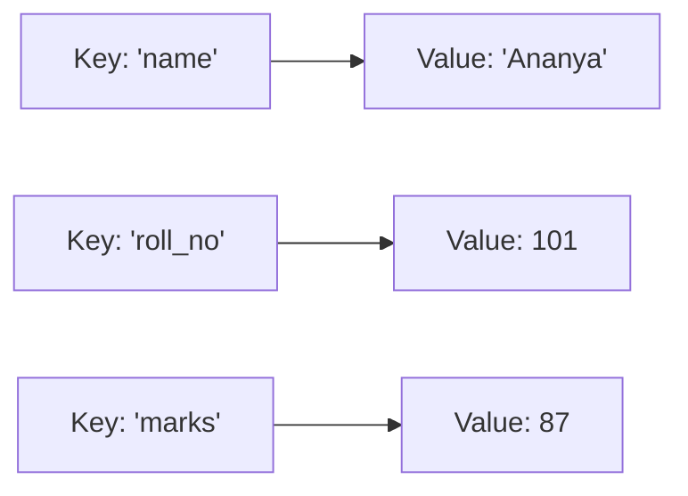
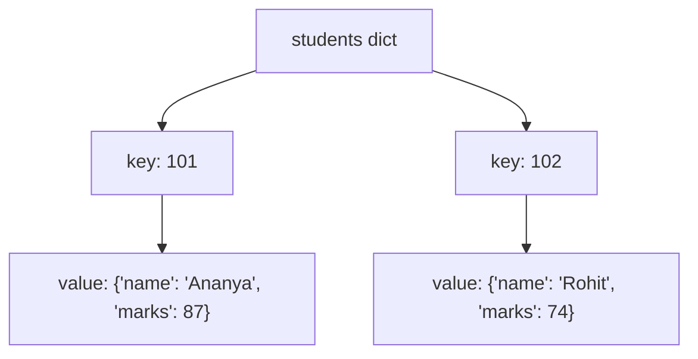

# Dictionaries

---

[← Previous: 3.3 Sets](unit-3-3-sets.md) | [Go back to TOC](../../README.md) | [Next: 3.5 Iterators, Generators & Collections →](unit-3-5-iterators-generators-collections.md)

## 1. Learning Objectives

By the end of this unit, you will be able to:

- **Explain** what a dictionary is, why every key must be unique and hashable, and how a dictionary differs from a list and a set.
- **Create** a dictionary using literals, the `dict()` constructor, and a list of pairs, and **access** a value safely using `[]` and `.get()`.
- **Implement** adding, modifying, and deleting key-value pairs using assignment, `del`, and `pop()`.
- **Apply** the three looping styles — `keys()`, `values()`, `items()` — and sort a dictionary's contents by key or by value.
- **Describe** how nested dictionaries model real records, and access a value that sits two or more levels deep.
- **Create** a dictionary comprehension to build a dictionary from an iterable, and to invert an existing one.

---

## 2. Overview

Think about your phone's contacts list. You don't save a friend's number by remembering "they are the 47th person I added" — you save it under their name, and later you just look up that name to get the number back. A name points to a number. That's the whole idea.

A **dictionary** is Python's way of storing exactly this kind of thing: pairs of `key: value`, where the key is like the name you search by, and the value is what you get back. A dictionary doesn't care about position or order the way a list does — it cares about labels. You ask "what's the value for this key?" and Python hands it back instantly, no matter how many entries you have.

Once you notice this pattern, you'll start seeing it everywhere: a student's record (roll number → marks), a product in an online store (product ID → price), a bank account (account number → balance). It's also exactly the shape data takes when it travels between an app and a server as **JSON** — so getting comfortable with dictionaries now will make working with real APIs later much easier.

This unit covers creating and accessing a dictionary, adding, modifying, and deleting entries, looping through it three different ways, sorting it, nesting dictionaries inside each other, the built-in functions and methods that make dictionaries convenient, and dictionary comprehensions.

---

## 3. Description

### 3.1 Definition

A **dictionary** (type `dict`) is a **mutable collection of key-value pairs**, where each **key** is unique and is used to look up its associated **value** — the way a real dictionary maps a word to its meaning. Instead of asking "what is at position 2?" the way a list does, a dictionary lets you ask "what value belongs to this key?"

You write a dictionary using curly braces, with a colon separating each key from its value, and commas separating the pairs:

```python
student = {"name": "Ananya", "roll_no": 101, "marks": 87}
```

Here, `"name"`, `"roll_no"`, and `"marks"` are keys, and `"Ananya"`, `101`, and `87` are their corresponding values. Together, `"name": "Ananya"` is one **key-value pair**.

**Key-Value Mapping**



Each key on the left points to exactly one value on the right — that arrow *is* the dictionary. Look up `"marks"` and you are handed `87` directly; there is no scanning involved.

### 3.2 Why This Concept Exists

Imagine trying to store the same student record using two separate lists — one for field names and one for values:

```python
fields = ["name", "roll_no", "marks"]
values = ["Ananya", 101, 87]
```

To find the marks, you would have to first find the *position* of `"marks"` in `fields`, and then use that same position to look inside `values`. This works, but it is fragile: if the two lists ever get out of sync — one item added to one list but not the other — your data silently becomes wrong, and there is no built-in safeguard to stop that.

A dictionary solves this by storing the label and the value **together, as one unit**, so there is never any doubt about which value belongs to which key. This is why dictionaries are the natural choice for:

- **Records** — a student, a customer, a bank account — where each field has a name.
- **Lookup tables** — translating one thing into another, such as a state code into a state name.
- **Counting and grouping** — tallying how many times something occurred, keyed by the thing itself.

Because so much real-world data — user profiles, product catalogs, API responses — is naturally a set of named fields, the dictionary ends up being the single most-used non-trivial data structure in production Python code.

### 3.3 Key Terminology

| Term | Simple Meaning |
|---|---|
| **Dictionary** | A mutable collection of key-value pairs, accessed by key rather than by numeric position (though it does preserve insertion order since Python 3.7); written with `{}`; type `dict`. |
| **Key** | The unique label used to look up a value; must be an immutable (hashable) type such as `str`, `int`, or `tuple`. |
| **Value** | The data stored against a key; can be any type at all, including a list or another dictionary. |
| **Key-value pair** | One entry in a dictionary — a key and the value it points to, written `key: value`. |
| **Mapping** | The general term for a type that connects keys to values; `dict` is Python's built-in mapping type. |
| **`.keys()`** | Returns a view of all the keys in the dictionary. |
| **`.values()`** | Returns a view of all the values in the dictionary. |
| **`.items()`** | Returns a view of all key-value pairs, each as a `(key, value)` tuple. |
| **Nested dictionary** | A dictionary whose value is itself a dictionary — used to model records with sub-fields. |
| **Dict comprehension** | A one-line expression, `{key: value for item in iterable}`, that builds a dictionary. |
| **`KeyError`** | The error Python raises when you try to access a key that does not exist. |
| **`.get()`** | A method that reads a key's value, returning a default (instead of raising an error) if the key is missing. |
| **Hashable** | A property of a value that lets Python compute a fixed "fingerprint" for it, so it can be used as a dictionary key; immutable types are hashable, mutable ones (like `list`) are not. |

### 3.4 Creating, Accessing, and Updating a Dictionary

**Creating a dictionary:**

```python
d = {key1: value1, key2: value2}
```

Example:

```python
student = {"name": "Ananya", "roll_no": 101, "marks": 87}
print(student)
```

Output:
```
{'name': 'Ananya', 'roll_no': 101, 'marks': 87}
```

Curly braces `{}` hold comma-separated `key: value` pairs — this is how you write a dictionary directly in code.

**Accessing a value:**

```python
value = d[key]
```

Example:

```python
print(student["name"])
```

Output:
```
Ananya
```

Square brackets — the same brackets used for list indexing — retrieve the value tied to a key instead of a position. If the key doesn't exist, Python raises `KeyError`.

**Accessing a value safely with `.get()`:**

```python
value = d.get(key, default)
```

Example:

```python
print(student.get("grade", "not available"))
```

Output:
```
not available
```

`.get()` retrieves the value tied to a key, or returns `default` (or `None` if you omit it) when the key is absent — it never raises an error, unlike bracket access.

**Adding or modifying a key:**

```python
d[key] = value
```

Example:

```python
student["grade"] = "A"
student["marks"] = 90
print(student)
```

Output:
```
{'name': 'Ananya', 'roll_no': 101, 'marks': 90, 'grade': 'A'}
```

If `key` is new, it is added; if `key` already exists, its value is simply overwritten. There is no separate "insert" syntax — assignment handles both cases.

**Deleting a key:**

```python
del d[key]
```

Example:

```python
del student["grade"]
print(student)
```

Output:
```
{'name': 'Ananya', 'roll_no': 101, 'marks': 90}
```

`del` removes a key and its value entirely; it raises `KeyError` if the key does not exist.

By now you've met all three collection types, so it helps to place them side by side in plain terms. A **list** is written with `[ ]` and accessed by position (`lst[i]`) — it keeps whatever order you added items in, and happily allows duplicates. A **set** is written with `{ }` or `set()` and only supports membership checks (`in`), not access by position — it has no reliable order, and never allows duplicates. A **dictionary** is written with `{key: value}` and accessed by key (`d[key]`), not position — like a set, it never allows duplicate **keys**, but unlike a set, it does remember insertion order (since Python 3.7). Reach for a list for an ordered sequence of items, a set for unique items and fast membership tests, and a dictionary for labelled records, lookup tables, and counting.

**A Nested Dictionary**



The outer dictionary's keys (`101`, `102`) are roll numbers; each value is itself a smaller dictionary holding that student's fields. Reaching `"Ananya"` needs two lookups chained together: `students[101]["name"]`.

### 3.5 Rules

- **Keys must be unique.** A dictionary can never hold the same key twice; assigning to an existing key overwrites its value instead of creating a second entry.
- **Keys must be hashable (immutable).** Strings, numbers, and tuples are valid keys. A list or another dictionary **cannot** be a key, because a key's "fingerprint" must never change once it is stored — attempting it raises `TypeError: unhashable type`.
- **Values can be anything, and need not be unique.** A value can be a number, a string, a list, or even another dictionary — and two different keys are allowed to point to the same value.
- **A dictionary is mutable.** You can add, change, and remove key-value pairs after creation, without creating a new dictionary.
- **Since Python 3.7, a dictionary remembers insertion order** — looping over it visits keys in the order they were added, though a dictionary is still looked up *by key*, never by position.

### 3.6 Best Practices

- Use `.get(key, default)` instead of `d[key]` whenever the key *might* be missing — it avoids an unhandled `KeyError` crashing your program.
- Choose descriptive, consistent key names (`"roll_no"`, not sometimes `"roll_no"` and sometimes `"rollNumber"`) — a typo in a key name is one of the most common real-world dictionary bugs.
- Prefer `d.items()` over looping `d.keys()` and re-looking-up each value with `d[k]` — it is both cleaner and avoids a second lookup.
- When you need to change a dictionary's contents, do it in place with assignment or `del`, rather than rebuilding the whole dictionary from scratch, unless a comprehension genuinely makes the code clearer.
- Keep a dictionary's values consistent in shape where possible — for example, every student record having the same fields — so that code processing them doesn't need special cases.

### 3.7 Common Mistakes

- **Assuming a missing key returns `None` silently.** Direct bracket access `d[key]` on a missing key raises `KeyError` and stops the program; only `.get()` returns `None` (or your chosen default) quietly.
- **Forgetting `.get()` as a safer alternative.** New learners often write `if key in d: value = d[key]` when `value = d.get(key, default)` does the same job in one line and is far less error-prone.
- **Confusing keys and values while looping.** Writing `for x in d:` gives you the **keys**, not the values — a very common mix-up. If you print `x` expecting a value and see a key instead, this is almost always why.
- **Trying to use a mutable type as a key.** `d[[1, 2]] = "value"` raises `TypeError: unhashable type: 'list'` — lists cannot be keys because they can change after being stored.
- **Expecting `sorted(d)` to sort by value.** `sorted(d)` sorts the **keys**; sorting by value requires `sorted(d.items(), key=lambda kv: kv[1])`, covered in §3.9.

### 3.8 Built-in Functions and Methods

| Function / Method | What it does |
|---|---|
| `len(d)` | Returns the number of key-value pairs in `d`. |
| `dict(pairs)` | Builds a dictionary from an iterable of `(key, value)` pairs, or from keyword arguments. |
| `d.keys()` | Returns a view of all keys. |
| `d.values()` | Returns a view of all values. |
| `d.items()` | Returns a view of all `(key, value)` pairs. |
| `d.get(key, default)` | Returns the value for `key`, or `default` if the key is absent — never raises `KeyError`. |
| `d.setdefault(key, default)` | Returns the value for `key` if it exists; otherwise inserts `key: default` and returns `default`. |
| `d.update(other)` | Adds all key-value pairs from `other` into `d`, overwriting any matching keys. |
| `d.pop(key, default)` | Removes `key` and returns its value; returns `default` (or raises `KeyError`) if the key is missing. |
| `d.popitem()` | Removes and returns the last-inserted key-value pair as a tuple. |
| `d.clear()` | Removes every key-value pair, leaving an empty dictionary. |
| `d.copy()` | Returns a new, independent **shallow copy** of `d` — changing the copy's top-level keys doesn't affect the original (though a nested value, like an inner list or dict, is still shared). |
| `sorted(d)` / `sorted(d.items(), key=...)` | Returns a new, sorted **list** — of keys, or of pairs — without changing `d` itself. |

`keys()`, `values()`, and `items()` each return a **view object**, not a plain list — a view stays "live" and reflects later changes to the dictionary; wrap it in `list(...)` if you need an actual, independent list.

### 3.9 Code Examples

The example below follows **one running scenario** — a UPI wallet's transaction history — and builds it up one skill at a time: create and access a record, then add/modify/delete fields, then loop over it three ways, then grow it into a nested dictionary of many transactions, then sort it, and finally summarize it with a dictionary comprehension.

**Step 1 — create a transaction record and access its fields:**

```python
transaction = {
    "txn_id": "UPI2026072000456",
    "payee": "Ananya Stores",
    "amount": 499.0,
    "status": "PENDING",
    "note": "to be confirmed",
}
print(transaction["payee"])
print(transaction.get("bank_ref", "not available"))
```

*Line-by-line explanation:*
- `transaction = {...}` creates a dictionary with five keys — `txn_id`, `payee`, `amount`, `status`, and `note` — modeling one UPI payment exactly the way a payments backend would.
- `transaction["payee"]` uses bracket access to fetch the value tied to the key `"payee"`.
- `transaction.get("bank_ref", "not available")` looks up a key that does not exist in this record; instead of raising `KeyError`, `.get()` safely returns the fallback `"not available"`.
- Output:
  ```
  Ananya Stores
  not available
  ```

**Step 2 — add, modify, and delete fields:**

```python
transaction["timestamp"] = "2026-07-20 10:15"   # add a new key
transaction["status"] = "SUCCESS"               # modify an existing key
del transaction["note"]                         # delete a key
print(transaction)
```

*Line-by-line explanation:*
- `transaction["timestamp"] = "2026-07-20 10:15"` — `"timestamp"` is a new key, so this **adds** a sixth entry.
- `transaction["status"] = "SUCCESS"` — `"status"` already exists, so this **overwrites** its old value `"PENDING"` with `"SUCCESS"`.
- `del transaction["note"]` removes the `"note"` key and its value completely, since it is no longer needed.
- Output:
  ```
  {'txn_id': 'UPI2026072000456', 'payee': 'Ananya Stores', 'amount': 499.0, 'status': 'SUCCESS', 'timestamp': '2026-07-20 10:15'}
  ```

**Step 3 — loop over the record three ways:**

```python
for field in transaction.keys():
    print("key:", field)

for value in transaction.values():
    print("value:", value)

for field, value in transaction.items():
    print(field, "->", value)
```

*Line-by-line explanation:*
- `for field in transaction.keys():` visits only the **keys** of the dictionary, one at a time.
- `for value in transaction.values():` visits only the **values**, discarding the keys entirely.
- `for field, value in transaction.items():` visits both together, unpacking each `(key, value)` tuple into `field` and `value` in one step — this is the style used for the rest of this example.
- Output (abbreviated to the `.items()` loop, the one used going forward):
  ```
  txn_id -> UPI2026072000456
  payee -> Ananya Stores
  amount -> 499.0
  status -> SUCCESS
  timestamp -> 2026-07-20 10:15
  ```

**Step 4 — grow into a nested dictionary of many transactions:**

```python
wallet_history = {
    "UPI2026072000456": {
        "payee": "Ananya Stores", "amount": 499.0, "status": "SUCCESS",
        "payer": {"name": "Rohit Verma", "upi_id": "rohit@okicici"},
    },
    "UPI2026071900123": {
        "payee": "Meera Traders", "amount": 250.0, "status": "SUCCESS",
        "payer": {"name": "Rohit Verma", "upi_id": "rohit@okicici"},
    },
    "UPI2026071500789": {
        "payee": "Rohit Verma", "amount": 900.0, "status": "FAILED",
        "payer": {"name": "Ananya Stores", "upi_id": "ananya@okhdfc"},
    },
}
print(wallet_history["UPI2026072000456"]["payer"]["name"])
```

*Line-by-line explanation:*
- `wallet_history = {...}` is a **nested dictionary**: the outer keys are transaction IDs, and each value is itself a dictionary holding `payee`, `amount`, `status`, and a further nested dictionary, `payer`, with that payer's `name` and `upi_id`.
- `wallet_history["UPI2026072000456"]["payer"]["name"]` chains three bracket lookups — first the outer dictionary by transaction ID, then the `"payer"` sub-dictionary, then `"name"` inside it — to reach a value two levels deep.
- Output: `Rohit Verma`.

**Step 5 — sort the transactions by amount:**

```python
for txn_id, record in sorted(wallet_history.items(), key=lambda kv: kv[1]["amount"], reverse=True):
    print(txn_id, record["payee"], record["amount"], record["status"])
```

*Line-by-line explanation:*
- `sorted(wallet_history.items(), key=lambda kv: kv[1]["amount"], reverse=True)` takes every `(txn_id, record)` pair from `.items()` and sorts them by `kv[1]["amount"]` — the amount inside each nested record — from highest to lowest, returning a new sorted list without changing `wallet_history` itself.
- `for txn_id, record in ...:` unpacks each sorted pair, giving `txn_id` and `record` (the inner dictionary) on every iteration.
- Output:
  ```
  UPI2026071500789 Rohit Verma 900.0 FAILED
  UPI2026072000456 Ananya Stores 499.0 SUCCESS
  UPI2026071900123 Meera Traders 250.0 SUCCESS
  ```

**Step 6 — summarize with a dictionary comprehension:**

```python
success_amounts = {
    txn_id: record["amount"]
    for txn_id, record in wallet_history.items()
    if record["status"] == "SUCCESS"
}
print(success_amounts)
```

*Line-by-line explanation:*
- `{txn_id: record["amount"] for txn_id, record in wallet_history.items() if record["status"] == "SUCCESS"}` is a **dictionary comprehension**: it loops over every `(txn_id, record)` pair, keeps only the ones whose `"status"` is `"SUCCESS"`, and builds a brand-new, smaller dictionary mapping each surviving `txn_id` to its `amount`.
- Output:
  ```
  {'UPI2026072000456': 499.0, 'UPI2026071900123': 250.0}
  ```

#### Try It Yourself

Using the same `wallet_history` dictionary from Step 4 above, complete the following, in order:

1. Add a new transaction to `wallet_history` with key `"UPI2026072000999"`, whose record has `payee`, `amount`, `status`, and `payer` fields of your choice. Then use `.get()` to safely print a `"remarks"` field on this new record, falling back to `"none"` if it is missing.
2. Loop over `wallet_history` with `.items()` and print the `txn_id` and `amount` of only the transactions whose `"status"` is `"FAILED"`.
3. Write a dictionary comprehension that builds a new dictionary mapping `txn_id` to `payee`, but only for transactions with `amount` greater than `300`. Then print that new dictionary.

**Solution to Part 1:**

```python
wallet_history["UPI2026072000999"] = {
    "payee": "Meera Traders",
    "amount": 150.0,
    "status": "SUCCESS",
    "payer": {"name": "Ananya Stores", "upi_id": "ananya@okhdfc"},
}
print(wallet_history["UPI2026072000999"].get("remarks", "none"))
```

Expected output:
```
none
```

**Solution to Part 2:**

```python
for txn_id, record in wallet_history.items():
    if record["status"] == "FAILED":
        print(txn_id, record["amount"])
```

Expected output:
```
UPI2026071500789 900.0
```

**Solution to Part 3:**

```python
big_payees = {
    txn_id: record["payee"]
    for txn_id, record in wallet_history.items()
    if record["amount"] > 300
}
print(big_payees)
```

Expected output:
```
{'UPI2026072000456': 'Ananya Stores', 'UPI2026071500789': 'Rohit Verma'}
```

---

## 4. Real-World Application

**Scenario: Looking up a customer's order on an e-commerce app**

Picture a customer support agent pulling up one order by its order ID:

```python
order = {
    "order_id": "ORD48213",
    "customer": "Neha Kapoor",
    "items": ["Laptop Sleeve", "Wireless Mouse"],
    "status": "Shipped",
    "amount": 1499.00,
}
```

Every question the support app needs answered maps directly to a dictionary operation you just learned:

- **"What is the current status of this order?"** → **key lookup**: `order["status"]`.
- **"Has a refund reference number been added yet?"** → a **safe lookup with `.get()`**: `order.get("refund_id")` returns `None` instead of crashing with a `KeyError` when the key doesn't exist yet.
- **"Mark the order as delivered."** → **updating a value in place**: `order["status"] = "Delivered"`.
- **"Show every field this order record has, one line at a time."** → looping with `order.items()`.

That is the entire real-world application in one clear picture: a record of named fields, looked up instantly by key instead of by remembering a position — no scanning, no guessing which index held what. Once this one example is clear, you will recognize the exact same shape again and again in production systems: a bank's account record keyed by account number, a UPI transaction payload exchanged as JSON, a patient's record keyed by patient ID, a railway booking looked up by PNR — all are this same order-lookup scenario wearing a different name. Whenever you hear "this data comes from an API" or "this is a record with fields," think dictionary first — this is the exact structure you will meet again as **JSON** when this course reaches API integration in Module 5.

---

## 5. Worked Example

### Problem Statement

A small coaching center wants a program that stores each student's roll number, name, and marks in three subjects, calculates each student's average marks, and prints the students ranked from the highest average to the lowest.

### Step 1: Understand the Problem

Each student has one roll number (unique, so it makes a good key) and several related fields — name and marks in three subjects. This is a nested-dictionary situation: an outer dictionary keyed by roll number, where each value is itself a dictionary holding that student's name and a further dictionary of subject-wise marks. The final output must be an average per student, ranked from highest to lowest.

### Step 2: Plan the Solution

1. Build a nested dictionary of student records.
2. For each student, compute their average using the `marks` sub-dictionary's values.
3. Store the averages in a new dictionary using a dictionary comprehension, keyed by roll number.
4. Sort that averages dictionary by value, highest first, using `sorted()` with a `lambda`.
5. Loop through the sorted result and print each student's name and average, looking the name up in the original nested dictionary.

### Step 3: Write the Python Code

```python
students = {
    101: {"name": "Ananya", "marks": {"maths": 88, "science": 92, "english": 79}},
    102: {"name": "Rohit", "marks": {"maths": 65, "science": 70, "english": 74}},
    103: {"name": "Meera", "marks": {"maths": 95, "science": 89, "english": 91}},
}

averages = {
    roll_no: sum(record["marks"].values()) / len(record["marks"])
    for roll_no, record in students.items()
}

ranked = sorted(averages.items(), key=lambda kv: kv[1], reverse=True)

for roll_no, avg in ranked:
    name = students[roll_no]["name"]
    print(roll_no, name, round(avg, 2))
```

### Step 4: Explain Each Line

- `students = {...}` creates a two-level nested dictionary: the outer key is the roll number, the outer value is a dictionary with `"name"` and `"marks"`, and `"marks"` itself is a further dictionary of subject-to-score pairs.
- `averages = {roll_no: ... for roll_no, record in students.items()}` is a **dictionary comprehension**. It loops over every `(roll_no, record)` pair from `students.items()`, and for each one, computes `sum(record["marks"].values()) / len(record["marks"])` — the total of that student's marks divided by how many subjects they have — and stores it against `roll_no` in a brand-new dictionary called `averages`.
- `sum(record["marks"].values())` calls the built-in `sum()` on the **values view** of the inner `marks` dictionary, adding up all three subject scores; `len(record["marks"])` counts how many subjects there are (three, here).
- `ranked = sorted(averages.items(), key=lambda kv: kv[1], reverse=True)` converts `averages.items()` into a list of `(roll_no, avg)` pairs, sorted by the average (`kv[1]`) from highest to lowest.
- `for roll_no, avg in ranked:` loops through that sorted list, unpacking each pair.
- `name = students[roll_no]["name"]` chains two bracket lookups — first into the outer `students` dictionary by roll number, then into the resulting record dictionary by `"name"` — to fetch that student's name.
- `print(roll_no, name, round(avg, 2))` displays the roll number, name, and the average rounded to two decimal places.

### Step 5: Sample Input

The `students` dictionary defined directly in the code above — three students, each with marks in maths, science, and English. No external user input is used in this unit yet.

### Step 6: Expected Output

```
103 Meera 91.67
101 Ananya 86.33
102 Rohit 69.67
```

### Step 7: Why the Output Is Produced

The dictionary comprehension computes one average per student by reading straight out of the nested `marks` dictionary, so no student's data can be mixed up with another's — each roll number's average is calculated only from that same roll number's own marks. `sorted()` then arranges the three `(roll_no, avg)` pairs purely by the average value, highest first, without touching the original `students` or `averages` dictionaries at all — both keep their original insertion order. Meera's average of `91.67` is the highest of the three, so her row prints first; Rohit's `69.67` is the lowest, so his row prints last.

---

### Important Notes (Interview Insights)

**Q: "Why is looking up a value in a dictionary faster than searching for it in a list?"**

A dictionary uses **hashing** to jump almost directly to a key's location, giving roughly **constant-time, O(1)** average lookup — while a list must scan element by element in the worst case, which is **O(n)**. This is exactly why a dictionary, not a list, is the right structure whenever your program's main job is "look this up by its label."

**Q: "When should you use `.get()` versus `[]` to access a dictionary value?"**

Use `[]` when the key's presence is guaranteed and a missing key genuinely signals a bug you want surfaced immediately; use `.get()` whenever the key is optional or comes from untrusted external input, such as a field that might not exist in an API response.

**Q: "Why can a tuple be used as a dictionary key, but a list cannot?"**

A dictionary key must be **hashable**, and that is precisely why a `list` cannot be a key but a `tuple` can — a detail that connects directly back to tuples and sets, where the same hashability rule applies to set elements.

---

## 6. Key Takeaways

- A **dictionary** is a mutable collection of unique, hashable keys mapped to values; access a value with `d[key]`, and expect `KeyError` if the key is missing.
- **`d[key] = value`** adds a new key or overwrites an existing one; `del d[key]` removes a key; `d.pop(key)` removes it and returns the value.
- Loop with **`.keys()`, `.values()`, or `.items()`** — `for k, v in d.items()` is the cleanest way to work with both the key and its value together.
- **`sorted(d)`** sorts keys; **`sorted(d.items(), key=lambda kv: kv[1])`** sorts by value — both return a new list and never change the original dictionary.
- **`.get(key, default)`** reads safely without raising an error; **`.setdefault(key, default)`** reads the existing value or inserts a default if the key is absent.
- A **nested dictionary** stores a dictionary as a value, letting you model real records with sub-fields; reach a deeply nested value by chaining brackets, e.g. `students[101]["marks"]["maths"]`.
- A **dictionary comprehension**, `{key: value for item in iterable}`, builds — or, by swapping key and value, inverts — a dictionary in one line.
- Dictionaries are the Python shape of **JSON data** — remember this connection, since it becomes central once this course reaches API integration.
- A dictionary gives roughly **constant-time (O(1))** lookup by key, versus a list's linear **O(n)** scan — a key interview talking point.

Coming next: Iterators, Generators & Collections, where you will look at the machinery quietly running behind every `for` loop you have written so far, and meet the `collections` module for more specialized dictionary-like tools.

---

## 7. Reference Links

- [The Python Tutorial — Dictionaries](https://docs.python.org/3/tutorial/datastructures.html#dictionaries)
- [Python 3 Documentation — Mapping Types (`dict`)](https://docs.python.org/3/library/stdtypes.html#mapping-types-dict)
- [Real Python — Dictionaries in Python](https://realpython.com/python-dicts/)
- [W3Schools — Python Dictionaries](https://www.w3schools.com/python/python_dictionaries.asp)

[← Previous: 3.3 Sets](unit-3-3-sets.md) | [Go back to TOC](../../README.md) | [Next: 3.5 Iterators, Generators & Collections →](unit-3-5-iterators-generators-collections.md)

---

*© 2026 Revature · AI Native Engineering — Foundations · Unit 3.4 · Version 2.0*
