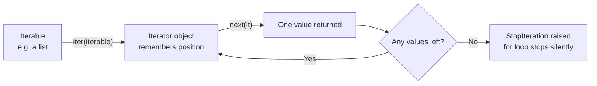
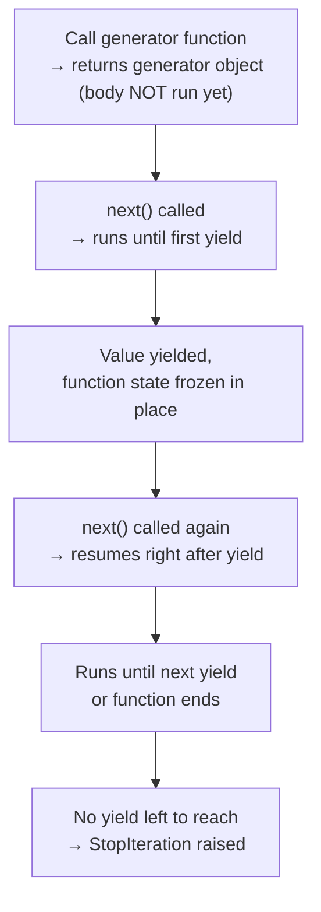

# Iterators, Generators & Collections

---

[← Previous: 3.4 Dictionaries](unit-3-4-dictionaries.md) | [Go back to TOC](../../README.md) | [Next: 4.1 Object-Oriented Foundations →](../p4-classes-objects/unit-4-1-object-oriented-foundations.md)

## 1. Learning Objectives

By the end of this unit, you will be able to:

- **Explain** the difference between an iterable and an iterator, and describe the `iter()` / `next()` / `StopIteration` protocol that a `for` loop runs underneath every time it executes.
- **Differentiate** a reusable iterable from a one-shot iterator, and explain why a generator is a special kind of iterator that behaves the same way.
- **Implement** a generator function using `yield` and a generator expression, and explain why either can save real memory compared to building a full list.
- **Apply** `Counter` to tally occurrences of items in one line instead of writing a manual counting loop.
- **Apply** `defaultdict` to group or count items without writing manual key-existence checks.
- **Identify** when a `namedtuple` improves on a plain tuple for readability, and debug the most common mistakes made with this machinery.

---

## 2. Overview

Every `for` loop you have written across this module — over lists, tuples, sets, and dictionaries — has quietly relied on one uniform mechanism you never had to name out loud. That mechanism is the **iterator protocol**, and this unit finally opens it up. Once you understand it, a `for` loop stops being "magic that walks a collection" and becomes a predictable, explainable sequence of function calls — a distinction that comes up constantly in technical interviews, because interviewers use it to check whether a candidate truly understands Python or has only memorized syntax.

This unit also revisits **generators**, which you first met conceptually back in Unit 2.4, and shows exactly why they save memory when a dataset is large or arrives over time — think of a UPI app processing a live stream of transactions, or a system reading a multi-gigabyte log file one line at a time instead of loading it all at once.

Finally, you will meet three ready-made tools from Python's `collections` module — `Counter`, `defaultdict`, and `namedtuple` — that quietly replace hand-written counting loops, error-prone dictionary key checks, and unreadable `tuple[0]`-style code with one clean line each. These are genuinely time-saving tools you will reach for in real projects, not just classroom exercises. This is also the final unit of Module P3 (Data Structures) — after this, Module P4 begins organizing data and behavior together with classes and objects.

---

## 3. Description

### 3.1 Definition

An **iterable** is any object you can loop over — anything you are allowed to place after `in` in a `for` loop. Lists, tuples, sets, dictionaries, and strings all qualify. An **iterator** is a separate, simpler object that does the actual walking: it remembers exactly one thing — where it currently is — and hands out the next value on request until there is nothing left to give.

A **generator** is a special, lazy kind of iterator: instead of holding all its values in memory in advance, it computes each value only at the moment you ask for it, and then pauses.

The **`collections` module** is a part of Python's standard library that ships ready-to-use, purpose-built versions of `dict` and `tuple` for patterns that come up constantly in real programs: **`Counter`** (tallying), **`defaultdict`** (grouping and counting without key errors), and **`namedtuple`** (tuples with readable, named fields).

### 3.2 Why This Concept Exists

Without a single uniform protocol, Python's `for` loop would need separate, special-cased logic for walking a list, a different kind of logic for a set, another for a dictionary, and yet another for a file opened on disk. Instead, Python designed one small contract — "give me an iterator, then let me call `next()` on it until it tells me to stop" — and made every loopable object honor that same contract. Learn the contract once, and it explains *every* `for` loop you will ever write, over *any* type, forever.

Generators exist to solve a very practical problem: sometimes the full set of values you need is too large to fit comfortably in memory, or is not even fully known yet (a live sensor feed, an infinite counter, a huge log file). A generator produces "the next value, computed just now" instead of "the entire list, computed and stored in advance" — which is often the only way to make a program work at all, not just work faster.

The `collections` module exists because three patterns are so common that Python's core team decided they deserved dedicated, well-tested tools rather than leaving every developer to hand-write the same few lines of counting and grouping logic — and to get them subtly wrong — over and over again.

### 3.3 Key Terminology

| Term | Simple Meaning |
|---|---|
| **Iterable** | Any object you can loop over with `for` — a list, tuple, set, dict, string, or generator. |
| **Iterator** | The object that actually produces one value at a time from an iterable, and remembers its current position. |
| **`iter()`** | A built-in function that takes an iterable and returns a fresh iterator for it. |
| **`next()`** | A built-in function that takes an iterator and returns its next value, advancing its position by one. |
| **`__iter__` / `__next__`** | The two internal mechanisms every iterable/iterator relies on — conceptually, `iter(obj)` asks `obj` to produce an iterator, and `next(it)` asks that iterator to produce its next value. You do not need to write these yourself in this unit; you only need to know they exist under the hood. |
| **`StopIteration`** | A special signal (not an error you need to fix, and not `None`) that an iterator raises internally to mean "there is nothing left to give." |
| **Generator function** | A function that uses `yield` instead of (or alongside) `return`, producing a generator object when called. |
| **`yield`** | A keyword that produces one value from a generator function and pauses execution there, freezing all local state, until the next value is requested. |
| **Generator expression** | A compact, one-line way to write a generator, shaped like a list comprehension but with `()` instead of `[]`. |
| **Lazy evaluation** | Computing a value only at the moment it is actually needed, instead of computing everything in advance. |
| **`Counter`** | A `dict` subclass, from `collections`, that tallies how many times each hashable item appears. |
| **`most_common(n)`** | A `Counter` method that returns the `n` most frequent items, already sorted, highest count first. |
| **`defaultdict`** | A `dict` subclass, from `collections`, that auto-creates a default value for a new key instead of raising `KeyError`. |
| **Factory function** | The function you hand to `defaultdict` (commonly `list` or `int`) that produces the default value for a brand-new key. |
| **`namedtuple`** | A function, from `collections`, that builds a tuple subclass whose positions also have readable field names. |

### 3.4 Syntax

**Comparison Table: Iterable vs Iterator**

| Aspect | Iterable | Iterator |
|---|---|---|
| Definition | Any object you can loop over | The object that actually produces values one at a time |
| Has `__next__`? | Not necessarily | Yes, always |
| Can you call `next()` on it directly? | No — you must first call `iter()` on it | Yes, directly |
| Reusable? | Yes — a fresh iterator is created each time you loop over it | No — exhausts after one full pass |
| Examples | `list`, `tuple`, `set`, `dict`, `str` | The object returned by `iter(some_list)`, or any generator |

| Syntax | Purpose | Example |
|---|---|---|
| `iter(obj)` | Get a fresh iterator from an iterable. | `it = iter([10, 20, 30])` |
| `next(it)` | Get the iterator's next value; raises `StopIteration` once exhausted. | `next(it)` |
| `def f(...):` … `yield value` | Define a generator function. | `def countdown(n):`<br>`    while n > 0:`<br>`        yield n`<br>`        n -= 1` |
| `(expr for item in iterable)` | Write a generator expression — the lazy sibling of a list comprehension. | `(n * n for n in range(10))` |
| `Counter(iterable)` | Tally occurrences of every item in one call. | `Counter(["A", "B", "A"])` |
| `defaultdict(factory)` | Create a dict that auto-fills missing keys using `factory()`. | `defaultdict(list)` |
| `namedtuple(typename, [fields])` | Create a tuple subclass with named, readable fields. | `namedtuple("Point", ["x", "y"])` |

**The Iterator Protocol**



**Generator Pause and Resume**



### 3.5 Rules

**Iterator and generator rules:**

- `iter(obj)` always returns a *fresh* iterator positioned at the start; calling it again on the same iterable gives a brand-new, independent iterator.
- `next(it)` returns exactly one value and advances the iterator's position by one; it never rewinds.
- Once an iterator is exhausted, calling `next()` again raises `StopIteration` every time — it does not restart, and it does not return `None`.
- An iterator is itself iterable — calling `iter()` on an iterator returns that same iterator unchanged — which is why you can place an iterator directly inside a `for` loop.
- A **generator is a special case of an iterator**, so everything above applies to it too: it can only be walked through once from start to finish.

**`collections` module rules:**

- `Counter` is a `dict` subclass: looking up a key that never appeared returns `0`, never `KeyError`.
- `defaultdict` requires a **factory function** (a callable with no arguments, such as `list` or `int`) at creation time; that factory is called automatically the first time a new key is used.
- `namedtuple` objects remain true tuples: they are **immutable** (you cannot reassign a field after creation), they can be unpacked (`name, marks = student`), and they support indexing (`student[0]`) in addition to named access (`student.name`).

### 3.6 Best Practices

- Reach for **`Counter`** the moment you catch yourself writing `counts[key] = counts.get(key, 0) + 1` in a loop — it is the same result in one line, and it comes with `most_common()` built in.
- Reach for **`defaultdict(list)`** whenever you are grouping items under keys, replacing the clunkier `if key not in dict: dict[key] = []` check every single time.
- Reach for **`defaultdict(int)`** for counting-by-key scenarios where you would otherwise write a manual key-existence check before incrementing.
- Prefer a **generator expression** over a list comprehension whenever you only need to walk the values once and the dataset could be large — you save memory with no change to how the loop reads.
- Reach for **`namedtuple`** the moment a plain tuple's meaning depends on remembering "position 0 is the name, position 1 is the marks" — named access removes that guesswork for every future reader of the code.
- If you genuinely need to reuse a generator's values more than once, materialize them explicitly with `list(...)` the first time, or call the generator function again to get a fresh one.

### 3.7 Common Mistakes

- **Treating `StopIteration` as a bug to catch and suppress everywhere** — it is the *normal*, expected termination signal that a `for` loop already handles for you silently; you only see it directly when calling `next()` manually.
- **Assuming `next()` on an exhausted iterator will restart it** — it will not; you must call `iter()` again on the original iterable to get a fresh iterator.
- **Assuming a generator can be looped over twice, like a list** — a list stores its values and lets you revisit them freely; a generator hands its values out once and forgets them, so a second `for` loop over the same generator object produces nothing.
- **Creating a `defaultdict` without a factory function, or with the wrong one** — `defaultdict()` with no argument behaves like a plain `dict` and still raises `KeyError`; passing `0` instead of `int` raises a `TypeError`, because the factory must be callable.
- **Trying to modify a `namedtuple` field like a list element** — `student.marks = 90` raises an `AttributeError`, because a `namedtuple`, like any tuple, is immutable.

### 3.8 Code Examples

**Consolidated example** — running "Chennai Bites," a food-delivery app's order pipeline, from the raw iterator protocol all the way up to `Counter`, `defaultdict`, and `namedtuple`. One running scenario, built up step by step.

**Step 1 — The iterator protocol, by hand:**

```python
orders = ["Saravana Bhavan", "Biryani Blues", "Pizza Hub"]
it = iter(orders)

print(next(it))
print(next(it))
print(next(it))
print(next(it))
```

*Line-by-line explanation:*
- `orders = [...]` — an ordinary, reusable list of restaurant names, one per order; a list is an iterable, not an iterator.
- `it = iter(orders)` — asks the list for a fresh iterator, positioned before the first order.
- Each `next(it)` call returns the next order and moves the position forward by one — first `"Saravana Bhavan"`, then `"Biryani Blues"`, then `"Pizza Hub"`.
- The **fourth** `next(it)` call has no order left to return, so Python raises `StopIteration` instead of printing a fourth value.
- Output:
  ```
  Saravana Bhavan
  Biryani Blues
  Pizza Hub
  Traceback (most recent call last):
      ...
  StopIteration
  ```

**Step 2 — What a `for` loop does underneath, and why an iterator is one-shot:**

```python
it = iter(orders)
while True:
    try:
        order = next(it)
    except StopIteration:
        break
    print("Processing:", order)

print(list(it))
print(list(it))
```

*Line-by-line explanation:*
- `it = iter(orders)` — a fresh iterator, exactly as a `for order in orders:` line would create automatically.
- The `while True` loop calls `next(it)` on every pass, printing each order as it is "processed" — this is precisely what `for` does behind the scenes.
- `except StopIteration: break` — the loop exits the *moment* `next()` signals "nothing left," with no error ever visible to the programmer. This is the exact mechanism a plain `for` loop hides from you.
- `print(list(it))` — collects whatever is left in `it` into a list; since `it` was already walked to the end above, nothing remains, so this prints an empty list.
- `print(list(it))` a second time still prints an empty list — an exhausted iterator cannot rewind, no matter how many times the app asks.
- Output:
  ```
  Processing: Saravana Bhavan
  Processing: Biryani Blues
  Processing: Pizza Hub
  []
  []
  ```

**Step 3 — A generator recap, applied to the same orders:**

```python
import sys

def order_stream(order_list):
    for order in order_list:
        yield order

for order in order_stream(orders):
    print("Order received:", order)

all_amounts_list = [n * 10 for n in range(1_000_000)]
all_amounts_gen = (n * 10 for n in range(1_000_000))

print(sys.getsizeof(all_amounts_list), "bytes")
print(sys.getsizeof(all_amounts_gen), "bytes")
```

*Line-by-line explanation:*
- `def order_stream(order_list):` with `yield order` inside — this is a **generator function**; calling `order_stream(orders)` does not run the body yet, it only creates a generator object, exactly like a live feed of incoming orders instead of a batch already sitting in memory.
- Each time the `for` loop calls `next()` on that generator (automatically), the function runs until `yield order`, hands back that order, and *pauses* right there until the next call.
- `all_amounts_list = [...]` builds the **entire** list of a million order-amount calculations in memory immediately, using a list comprehension — imagine an end-of-day analytics job scanning a huge order history.
- `all_amounts_gen = (...)` builds a **generator expression** instead — it stores only the plan for producing each amount, not the million values themselves.
- `sys.getsizeof(...)` reports the memory, in bytes, that each object itself occupies.
- Output:
  ```
  Order received: Saravana Bhavan
  Order received: Biryani Blues
  Order received: Pizza Hub
  8448728 bytes
  200 bytes
  ```
- The list costs roughly 8 megabytes before a single value has even been used; the generator costs only a couple hundred bytes — and that stays true whether the app processed a thousand orders or a billion, because it stores a plan, not the values. (The exact byte count for the generator can shift slightly between Python versions; the point that matters is that it stays tiny and constant, not the precise number.)

**Step 4 — `Counter`, `defaultdict`, and `namedtuple` working together on today's orders:**

```python
from collections import namedtuple, Counter, defaultdict

Order = namedtuple("Order", ["customer", "restaurant", "amount"])

orders_today = [
    Order("Priya", "Saravana Bhavan", 350),
    Order("Rohan", "Biryani Blues", 620),
    Order("Arjun", "Saravana Bhavan", 280),
    Order("Meera", "Pizza Hub", 540),
    Order("Kavya", "Saravana Bhavan", 410),
    Order("Sara", "Biryani Blues", 300),
]

restaurant_counts = Counter(o.restaurant for o in orders_today)
print(restaurant_counts)
print(restaurant_counts.most_common(1))

customers_by_restaurant = defaultdict(list)
for o in orders_today:
    customers_by_restaurant[o.restaurant].append(o.customer)
print(dict(customers_by_restaurant))
```

*Line-by-line explanation:*
- `Order = namedtuple("Order", ["customer", "restaurant", "amount"])` — builds a small, readable record type; each `Order` behaves like a tuple but supports `.customer`, `.restaurant`, and `.amount` instead of `order[0]`, `order[1]`, `order[2]`.
- `orders_today = [...]` — six `Order` instances, created exactly like calling any function with positional arguments.
- `Counter(o.restaurant for o in orders_today)` — a **generator expression** feeds restaurant names to `Counter` one at a time, without first building a separate list of names; `Counter` tallies them into `restaurant_counts`.
- `restaurant_counts.most_common(1)` returns the single highest-count entry, already sorted — exactly what a "top restaurant today" dashboard tile would need.
- `defaultdict(list)` auto-creates an empty list the first time a new restaurant key is used, so `customers_by_restaurant[o.restaurant].append(o.customer)` works immediately, with no `if restaurant not in customers_by_restaurant` check anywhere.
- Output:
  ```
  Counter({'Saravana Bhavan': 3, 'Biryani Blues': 2, 'Pizza Hub': 1})
  [('Saravana Bhavan', 3)]
  {'Saravana Bhavan': ['Priya', 'Arjun', 'Kavya'], 'Biryani Blues': ['Rohan', 'Sara'], 'Pizza Hub': ['Meera']}
  ```

**Step 5 — A generator built on the same records, and its one-shot nature:**

```python
def big_orders(order_list, minimum):
    for o in order_list:
        if o.amount >= minimum:
            yield o.customer

top_spenders = big_orders(orders_today, 400)
for customer in top_spenders:
    print(customer)

for customer in top_spenders:
    print(customer)
```

*Line-by-line explanation:*
- `def big_orders(order_list, minimum):` with `yield o.customer` inside — a **generator function** that produces only the customers whose order amount meets the threshold, one at a time, on demand.
- `top_spenders = big_orders(orders_today, 400)` — calling the generator function creates the generator object but does **not** run any of its body yet.
- The **first** `for customer in top_spenders:` walks the generator fully, printing each qualifying customer in order, which exhausts it.
- The **second** `for customer in top_spenders:` reuses the *same, already-exhausted* generator object — there is nothing left to yield, so the loop body never runs and nothing prints, exactly as Section 3.5's one-shot rule predicts.
- Output:
  ```
  Rohan
  Meera
  Kavya
  ```

#### Try It Yourself

**Exercise — Extending the "Chennai Bites" order pipeline:**

**Part 1 (easiest).** Tomorrow's first two orders are `["Dosa Corner", "Momo Point"]`. Create an iterator over this list with `iter()`, then call `next()` on it **three** times. Before running it, predict what the third call will do.

**Solution:**
```python
tomorrow_orders = ["Dosa Corner", "Momo Point"]
it = iter(tomorrow_orders)

print(next(it))
print(next(it))
print(next(it))
```
Expected output:
```
Dosa Corner
Momo Point
Traceback (most recent call last):
    ...
StopIteration
```
The list only has two items, so the third `next(it)` call has nothing left to give and raises `StopIteration` — the iterator does not restart or return `None`.

**Part 2 (moderate).** Using the same `Order` namedtuple from the consolidated example, here is a new batch of orders:
```python
orders_tomorrow = [
    Order("Divya", "Dosa Corner", 220),
    Order("Karthik", "Momo Point", 480),
    Order("Divya", "Momo Point", 310),
    Order("Farhan", "Dosa Corner", 260),
]
```
Write code that (a) tallies how many orders each restaurant received using `Counter`, and (b) groups the order **amounts** (not customer names) by restaurant using `defaultdict(list)`.

**Solution:**
```python
restaurant_counts_tomorrow = Counter(o.restaurant for o in orders_tomorrow)
print(restaurant_counts_tomorrow)

amounts_by_restaurant = defaultdict(list)
for o in orders_tomorrow:
    amounts_by_restaurant[o.restaurant].append(o.amount)
print(dict(amounts_by_restaurant))
```
Expected output:
```
Counter({'Dosa Corner': 2, 'Momo Point': 2})
{'Dosa Corner': [220, 260], 'Momo Point': [480, 310]}
```
`Counter` tallies each restaurant name as it comes out of the generator expression, and `defaultdict(list)` auto-creates a new empty list the first time each restaurant name is seen, so every amount lands in the right bucket with no manual key check.

**Part 3 (hardest).** Write a generator function `budget_orders(order_list, ceiling)` that yields the **customer** name for every order whose `amount` is *less than or equal to* `ceiling`. Using `orders_tomorrow` and a ceiling of `260`, walk the generator once with a `for` loop and print each name, then try walking the *same* generator object a second time.

**Solution:**
```python
def budget_orders(order_list, ceiling):
    for o in order_list:
        if o.amount <= ceiling:
            yield o.customer

cheap_orders = budget_orders(orders_tomorrow, 260)
for customer in cheap_orders:
    print(customer)

for customer in cheap_orders:
    print(customer)
```
Expected output:
```
Divya
Farhan
```
Only `Divya` (220) and `Farhan` (260) meet the `amount <= 260` condition, so the first loop prints both names in order. The second `for customer in cheap_orders:` prints nothing at all — `cheap_orders` is the same generator object already walked to exhaustion, and a generator, like any iterator, cannot be rewound; getting the names again would require calling `budget_orders(orders_tomorrow, 260)` fresh.

---

## 4. Real-World Application

- **Banking & FinTech:** A statement generator that streams thousands of transaction rows one at a time, instead of loading an entire year's history into memory at once, is a generator doing exactly what `countdown()` does — computing the next value only when asked.
- **UPI / Payment Systems:** A dashboard showing "most-used payment method today" is `Counter` tallying every transaction's method in one pass and reading the top result off with `most_common()`.
- **E-commerce:** Grouping today's orders by delivery city, with a new city key appearing at any moment, is exactly what `defaultdict(list)` is built for — no `KeyError`, no manual existence checks.
- **Food Delivery:** Counting how many orders each restaurant received in a day, as shown in the example above, is a one-line `Counter` call instead of a hand-rolled tally loop.
- **Healthcare:** A patient vitals reading — heart rate, temperature, timestamp — read together and passed around a monitoring script is a natural fit for `namedtuple`, so the code says `reading.heart_rate` instead of decoding what position `1` was supposed to mean.
- **Railway Booking (IRCTC-style systems):** A seat allocation record with named fields, as shown above, keeps booking code readable across a large codebase maintained by many engineers over time.
- **AI/ML & Cloud Apps:** Reading a multi-gigabyte training dataset or log file line by line uses a generator so the program never needs the whole file in memory at once — a core reason generators exist in the language at all.

---

## 5. Worked Example

### Problem Statement

You are given a semester's grade records for six students. You must represent each record readably, count how many students got each grade, group student names by grade, and then write a generator that yields only the "A" grade students — while directly observing what happens when a generator is walked more than once.

### Step 1: Understand the Problem

Each student record naturally has two named pieces of information — a name and a grade — which favors a `namedtuple` over a plain tuple. Counting "how many of each grade" is a tallying problem, which favors `Counter`. Grouping "which names belong to which grade" is a grouping problem, which favors `defaultdict(list)`. Finally, producing "just the A-grade names, one at a time" is a natural job for a generator function, and the exercise must show that walking that generator a second time yields nothing.

### Step 2: Plan the Solution

Store each record as a `Record` `namedtuple` with fields `name` and `grade`. Feed a generator expression of just the grades into `Counter` to tally them. Loop over the records once to build a `defaultdict(list)` grouping names under their grade. Write a small generator function that yields only the names where `grade == "A"`, walk it once with a `for` loop, and then attempt to walk the *same* generator object a second time to observe the one-shot behavior directly.

### Step 3: Write the Python Code

```python
from collections import namedtuple, Counter, defaultdict

Record = namedtuple("Record", ["name", "grade"])
records = [
    Record("Priya", "A"), Record("Rohan", "B"), Record("Arjun", "A"),
    Record("Meera", "C"), Record("Kavya", "B"), Record("Sara", "A"),
]

grade_counts = Counter(r.grade for r in records)
print(grade_counts)

by_grade = defaultdict(list)
for r in records:
    by_grade[r.grade].append(r.name)
print(dict(by_grade))

def a_grade_students(records):
    for r in records:
        if r.grade == "A":
            yield r.name

top_students = a_grade_students(records)
for name in top_students:
    print(name)

for name in top_students:
    print(name)
```

### Step 4: Explain Each Line

- `Record = namedtuple("Record", ["name", "grade"])` — builds a small, readable record type; each `Record` behaves like a tuple but supports `.name` and `.grade`.
- `records = [...]` — six `Record` instances, created exactly like calling any function with positional arguments.
- `Counter(r.grade for r in records)` — a **generator expression** (`r.grade for r in records`) feeds grades to `Counter` one at a time, without first building a separate list of grades; `Counter` tallies them into `grade_counts`.
- `by_grade = defaultdict(list)` followed by the `for` loop — for every record, `by_grade[r.grade]` either already holds a list (from an earlier student with the same grade) or is auto-created as an empty list on first use, and `.append(r.name)` adds the name either way, with no key-existence check written anywhere.
- `def a_grade_students(records):` with `yield r.name` inside — a **generator function** that produces only the "A" grade names, one at a time, on demand.
- `top_students = a_grade_students(records)` — calling the generator function creates the generator object but does **not** run any of its body yet.
- The **first** `for name in top_students:` walks the generator fully, printing each "A" grade name in order, which exhausts it.
- The **second** `for name in top_students:` reuses the *same, already-exhausted* generator object — there is nothing left to yield, so the loop body never runs and nothing prints.

### Step 5: Sample Input

None. All records are defined directly in the code; no user input is involved in this example.

### Step 6: Expected Output

```
Counter({'A': 3, 'B': 2, 'C': 1})
{'A': ['Priya', 'Arjun', 'Sara'], 'B': ['Rohan', 'Kavya'], 'C': ['Meera']}
Priya
Arjun
Sara
```

### Step 7: Why the Output Is Produced

`grade_counts` reflects that three records have grade `"A"`, two have `"B"`, and one has `"C"` — `Counter` walked the generator expression once and tallied every grade it received. `by_grade` shows every name correctly bucketed under its grade, built entirely without checking whether a key already existed, because `defaultdict(list)` handled that automatically. The three names `Priya`, `Arjun`, and `Sara` print from the **first** loop over `top_students`, in the same order the generator yielded them. The **second** `for name in top_students:` prints nothing at all — not an error, just silence — because `top_students` is the *same* generator object the first loop already walked to completion; a generator, like any iterator, is a single-pass object, and there is no way to rewind it. Getting the "A" names again would require calling `a_grade_students(records)` a fresh time, or materializing the result once with `list(a_grade_students(records))`.

---

### Important Notes (Interview Insights)

- **"What is the difference between an iterable and an iterator?"** is one of the most frequently asked Python interview questions at the fresher level. Answer precisely: every iterator is iterable, but not every iterable is an iterator — a list is iterable but is not itself an iterator, because it has no `__next__` of its own and does not track a current position.
- Be ready to explain that a `for` loop is simply syntax sugar: it calls `iter()` once, then `next()` repeatedly, and stops silently the moment `StopIteration` is raised — no error ever reaches your code.
- A common follow-up: **"Why use a generator instead of a list?"** The correct answer is memory — a generator computes and yields one value at a time instead of holding the entire sequence in memory up front, which matters enormously once "the entire sequence" could be millions of rows or an unbounded stream.
- Interviewers often test `Counter` and `defaultdict` with a quick coding question like "count word frequency in a sentence" — recognizing these tools instantly, instead of writing a manual loop, is a strong signal of practical Python fluency.

---

## 6. Key Takeaways

- An **iterable** is anything loopable; an **iterator** is the object that hands out one value at a time from it, via `iter()` and `next()`, until it raises `StopIteration`.
- A **`for` loop is just this protocol in disguise** — it calls `iter()` once, then `next()` repeatedly, stopping silently the instant `StopIteration` is raised.
- **An iterator is one-shot; the underlying iterable is reusable** — a fresh iterator is created every time you loop over the same iterable again.
- A **generator** — a function using `yield`, or a `(... for ...)` expression — is a lazy iterator that computes values on demand instead of storing them all in memory, which is why it can be dramatically smaller in memory than the equivalent list.
- A generator can only be walked through **once**; looping over an already-exhausted generator produces no output and no error.
- **`Counter`** tallies occurrences in one line and ranks them with `most_common()`; it behaves like a `dict` where a missing key returns `0` instead of raising `KeyError`.
- **`defaultdict`** removes manual key-existence checks by auto-creating a default value — `list` for grouping, `int` for counting — the first time a new key is used.
- **`namedtuple`** adds readable, named access to a tuple's positions while keeping it fully immutable, unpackable, and indexable.
- "Iterable vs iterator" is one of the most common Python interview questions at fresher level — be ready to state, precisely, that every iterator is iterable but not every iterable is an iterator.

Coming next: Unit 4.1 — Object-Oriented Foundations, where Module P4 begins organizing data and the behavior that acts on it together, using classes and objects, instead of keeping them separate.

---

## 7. Reference Links

- [Python 3 Documentation — `collections` Module](https://docs.python.org/3/library/collections.html)
- [The Python Tutorial — Iterators](https://docs.python.org/3/tutorial/classes.html#iterators)
- [The Python Tutorial — Generators](https://docs.python.org/3/tutorial/classes.html#generators)
- [Real Python — Iterators and Iterables in Python](https://realpython.com/python-iterators-iterables/)
- [Real Python — How to Use Generators and yield in Python](https://realpython.com/introduction-to-python-generators/)
- [Real Python — Python's collections: A Buffet of Specialized Data Types](https://realpython.com/python-collections-module/)
- [W3Schools — Python Iterators](https://www.w3schools.com/python/python_iterators.asp)

[← Previous: 3.4 Dictionaries](unit-3-4-dictionaries.md) | [Go back to TOC](../../README.md) | [Next: 4.1 Object-Oriented Foundations →](../p4-classes-objects/unit-4-1-object-oriented-foundations.md)

---

*© 2026 Revature · AI Native Engineering — Foundations · Unit 3.5 · Version 2.0*
