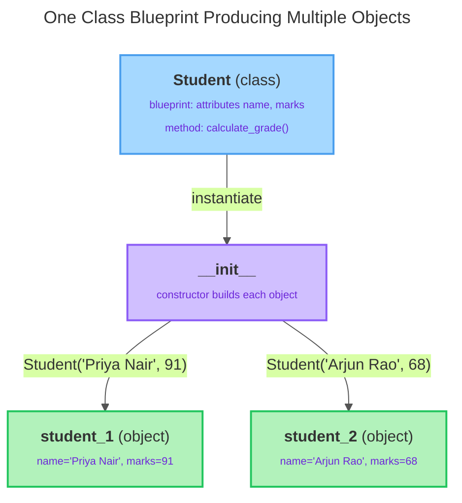

# Object-Oriented Foundations

---

[← Previous: 3.5 Iterators, Generators & Collections](../p3-data-structures/unit-3-5-iterators-generators-collections.md) | [Go back to TOC](../../README.md) | [Next: 4.2 The Four Pillars of OOP →](unit-4-2-the-four-pillars-of-oop.md)

## 1. Learning Objectives

By the end of this unit, you will be able to:

- **Explain** what an abstract data type (ADT) is and why bundling state and behaviour together models a real-world thing more faithfully than separate variables and functions.
- **Differentiate** a **class** (a blueprint) from an **object**/**instance** (a specific thing built from that blueprint).
- **Implement** a constructor (`__init__`) that initializes instance attributes for every new object.
- **Create** instance methods, correctly using `self` as the first parameter, and call them on an object.
- **Identify** the difference between an instance attribute and a class attribute, and know when each is appropriate.
- **Debug** the most common beginner mistakes in Python OOP, such as a missing `self` parameter.

---

## 2. Overview

So far in this course, we have learned about variables, loops, functions, lists, and dictionaries. These help us store data and write programs. For example, we can store a student's information in a dictionary and use a separate function to calculate the average marks.

### Without a Class
```python
student = {
    "name": "Rahul",
    "marks": [85, 90, 78]
}

def calculate_average(marks):
    return sum(marks) / len(marks)

print(calculate_average(student["marks"]))
```
This works well for one student. But what if a college has 5,000 students?
Each student has a name, roll number, marks, and department.
Each student needs functions like calculate_average(), display_details(), and check_result().
Keeping all the student data in dictionaries and all the functions separately becomes difficult to organize.

**Object-Oriented Programming (OOP)** solves this problem by keeping related data and the functions that work on that data together in one place. Think of a Student object. It can store the student's name and marks, and it can also have functions to calculate the average or display the student's details. Everything related to the student stays together.
This unit introduces the four building blocks every later OOP concept in this course depends on: the **abstract data type** as a way of thinking, the **class** as a blueprint, the **object** as a concrete instance of that blueprint, and the **constructor** and **methods** that give an object its data and behaviour.

---

## 3. Description

### 3.1 Definition

An **Abstract Data Type (ADT)** describes **what an object is** and **what it can do**, without explaining **how it is implemented**.
For example, consider a **Student**.
- **Data (Attributes):** Name, Roll Number, Marks
- **Behavior (Methods):** Calculate grade, Display details
At this stage, we only describe the student and its actions. We do **not** write the Python code yet.

> **Simple Idea:** An **ADT** focuses on **what** an object contains and **what** it can do, not **how** it is implemented.

A **class** is how Python lets you implement an ADT: a blueprint that defines what attributes and methods every object built from it will have. An **object**, also called an **instance**, is one specific thing created from that blueprint, holding its own actual values. A class alone builds nothing — it only describes the shape; you must create an object from it before you have anything you can use:

```python
class Student:
    pass

first_student = Student()
print(type(first_student))
```

Output:

```
<class '__main__.Student'>
```

`class Student:` defines the blueprint (`pass` means "no body yet — deliberately left empty"). `Student()` creates one object from that blueprint, and `type()` confirms the object belongs to the `Student` class — the same `type()` function you have used since your introduction to variables and types to inspect `int`, `str`, and every other value's type.

### 3.2 Why This Concept Exists

Without classes, tracking several related things forces you into one of two poor options: keep separate flat variables for each one (`student1_name`, `student1_marks`, `student2_name`, `student2_marks`, ...), which does not scale past a handful of items; or keep loosely related data in a dictionary or list with functions that operate on it from the outside, trusting yourself to always pass the right piece into the right function. Neither approach stops a mistake like passing one student's marks into a function meant for another student's data.

Classes solve three problems that show up in every real application:

- **Model** a real-world thing directly in code (a bank account, a student, a delivery order) instead of approximating it with loose variables.
- **Bundle** state and behaviour so the connection between a `balance` and a `deposit()` operation is enforced by the language, not by your memory.
- **Scale** to many independent things — a bank serving lakhs of customers, or a college with thousands of students — by creating one object per real-world thing, each holding its own private copy of the data.

This is why "classes and objects" is universally the topic that follows functions in every OOP curriculum: it is the mechanism that virtually every production Python codebase — Django models, Flask API request handlers, machine learning pipeline stages — is organized around.

### 3.3 Key Terminology

| Term | Simple Meaning |
|---|---|
| **Abstract data type (ADT)** | A description of a "thing" by its state (data) and behaviour (what it can do), independent of implementation. |
| **Class** | A blueprint that defines what attributes and methods every object built from it will have. |
| **Object / Instance** | A specific thing created from a class, holding its own actual values. |
| **Attribute** | A variable that belongs to a class or object — the "state" half of an ADT. |
| **Instance attribute** | An attribute that belongs to one specific object alone, usually set via `self.attribute = value` inside `__init__`. |
| **Class attribute** | An attribute defined directly in the class body, shared by every instance unless one instance overrides it locally. |
| **Method** | A function defined inside a class body — the "behaviour" half of an ADT. |
| **Constructor (`__init__`)** | A special method Python calls automatically every time a new object is created, used to set up its starting state. |
| **`self`** | The first parameter of every instance method; it refers to the specific object the method was called on. |
| **Instantiation** | The act of creating an object from a class, done by calling the class name like a function: `ClassName(...)`. |

### 3.4 Syntax

```python
class ClassName:
    class_attribute = value          # shared by every instance

    def __init__(self, param1, param2):
        self.param1 = param1         # instance attribute
        self.param2 = param2         # instance attribute

    def method_name(self, extra_arg):
        # method body, can read/change self.param1, self.param2
        ...

obj = ClassName(value1, value2)      # instantiation
```

| Part | What it is | Why it's there |
|---|---|---|
| `class ClassName:` | The **class keyword** followed by the class name and a colon, opening the class body. | Declares a new blueprint; everything indented under it belongs to that blueprint. |
| `def __init__(self, ...):` | The **constructor** — a method with the exact reserved name `__init__`. | Python calls this automatically every time you instantiate the class, before the new object is handed back to you. |
| `self` | The first parameter of every instance method, including `__init__`. | Lets the method reach back to the specific object it is operating on; Python supplies it automatically. |
| `self.param1 = param1` | An **attribute assignment** — takes the parameter received and stores it on the object. | Creates an instance attribute that will exist on this object for as long as the object exists. |
| `def method_name(self, extra_arg):` | A **method definition** — an ordinary `def`, written inside the class body, with `self` first. | Defines behaviour the object can perform, with access to its own attributes through `self`. |
| `ClassName(value1, value2)` | **Instantiation** — calling the class name like a function. | Creates a new object, runs `__init__` on it with the given arguments, and returns the finished object. |

**Comparison Table: Class vs Object**

| Aspect | Class | Object (Instance) |
|---|---|---|
| What it is | A blueprint / template | A specific thing built from the blueprint |
| How many exist | Usually one definition in your code | As many as you choose to create |
| Holds actual data? | No — it only describes what data instances will hold | Yes — each object holds its own real values |
| Created with | `class ClassName:` | `ClassName(...)` (instantiation) |
| Example | `Student` (the idea of "a student") | `Student("Priya Nair", 91)` (one real student) |
| Independence | N/A — there is only one blueprint | Every object's attributes are independent of every other object's |

**One Class, Many Independent Objects**



The single `Student` blueprint never holds any real data itself. Every time it is called through `__init__`, a brand-new object is produced with its own independent attributes — changing `student_1`'s `marks` has no effect whatsoever on `student_2`.

### 3.5 Rules

- Every line inside a class body must be indented consistently, exactly like the body of a function or a loop.
- `__init__` is optional, but if a class defines it, Python calls it automatically on every `ClassName(...)` call — you never call `__init__` yourself.
- Every instance method's first parameter must be `self`; Python supplies the object automatically as that first argument at the call site — you never pass it yourself.
- An instance attribute must be assigned through `self` (`self.attribute = value`) before it can be read through `self` or through an object; reading an attribute that was never assigned raises an `AttributeError`.
- A class attribute is defined directly in the class body, outside any method; it is shared by every instance until one instance is assigned its own attribute of the same name, which then shadows the class attribute for that instance only.
- Instantiating a class always requires the parentheses — `ClassName()`, matching whatever parameters `__init__` declares (besides `self`).

### 3.6 Best Practices

- Name classes in **`PascalCase`** (`Student`, `BankAccount`, `FoodOrder`); name instances in `snake_case`, exactly as you already name any other variable.
- Keep `__init__` focused purely on setup: assign parameters to attributes and set sensible starting values. Avoid putting unrelated calculations or printing inside it.
- Name constructor parameters the same as the attribute they populate (`self.name = name`) — it keeps the mapping obvious to anyone reading the code.
- Give methods verb-like names that describe the action they perform (`deposit`, `mark_delivered`, `calculate_grade`) — the same convention you already follow for functions.
- Use a class attribute only for a value that is genuinely identical across every instance (like a company or platform name); use an instance attribute, set inside `__init__`, for anything that can vary per object.

### 3.7 Common Mistakes

- **Forgetting `self` as a method's first parameter.** Python still passes the object in automatically, so the call ends up with one argument too many, producing a `TypeError` about argument counts rather than an obvious complaint about a missing `self`.
- **Confusing a class with an instance.** `Student` is the blueprint; `Student()` produces an object. Trying to read `Student.name` before any object has set `name` as an instance attribute raises an `AttributeError`, because the class itself never held that value — only an instance does.
- **Forgetting the parentheses when instantiating.** Writing `account = BankAccount` (no parentheses) does not create an object at all — `account` simply refers to the class itself. Calling `account.deposit(100)` later still finds the `deposit` method (it exists on the class), but it fails with a `TypeError`, because `100` is bound to `self` and no value is left for `amount`.
- **Forgetting the `self.` prefix inside a method.** Writing `balance = balance + amount` instead of `self.balance = self.balance + amount` creates a plain local variable that vanishes when the method ends, leaving the object's real attribute completely unchanged.

### 3.8 Code Examples

This one scenario — a `Student` class for a college — is built up in four small steps, each adding exactly one new idea on top of the last: an empty class, then a constructor, then methods, then a class attribute plus a state-changing method. By the end, several independent `Student` objects exist side by side, each with its own data.

**Step 1** — an empty class, instantiated twice, showing that each object is distinct:

```python
class Student:
    pass

s1 = Student()
s2 = Student()

print(type(s1))
print(s1 is s2)
```

*Line-by-line explanation:*
- `class Student:` defines a blueprint with no attributes or methods of its own yet; `pass` is a placeholder meaning "empty body."
- `s1 = Student()` and `s2 = Student()` each call the class, creating two separate objects.
- `print(type(s1))` reports the class an object was built from.
- `print(s1 is s2)` uses the `is` operator to compare object identity — it checks whether both names point to the exact same object in memory, not whether their contents look alike.
- Output:
  ```
  <class '__main__.Student'>
  False
  ```
- `False` confirms that `Student()` allocated two distinct objects, even though both came from the identical blueprint.

**Step 2** — give the class a constructor so every object gets its own `name` and `marks` the moment it is created:

```python
class Student:
    def __init__(self, name, marks):
        self.name = name
        self.marks = marks

s1 = Student("Priya Nair", 91)
s2 = Student("Arjun Rao", 68)

print(s1.name, s1.marks)
print(s2.name, s2.marks)
```

*Line-by-line explanation:*
- `def __init__(self, name, marks):` declares the constructor, taking `self` plus two required parameters.
- `self.name = name` and `self.marks = marks` store the two parameters as instance attributes on whichever object is being built.
- `Student("Priya Nair", 91)` calls the class; Python creates a new object, then calls `__init__` on it automatically with `name="Priya Nair"` and `marks=91`.
- `s1.name` and `s1.marks` read the attributes back off the object using dot notation.
- Output:
  ```
  Priya Nair 91
  Arjun Rao 68
  ```
- Each `Student` object keeps its own independent copy of `name` and `marks` — changing `s1.marks` later would have no effect on `s2.marks`.

**Step 3** — add methods so each object can also do something with its own data:

```python
class Student:
    def __init__(self, name, marks):
        self.name = name
        self.marks = marks

    def calculate_grade(self):
        if self.marks >= 90:
            return "A"
        elif self.marks >= 75:
            return "B"
        else:
            return "C"

    def describe(self):
        return f"{self.name} scored {self.marks} marks - Grade {self.calculate_grade()}"

s1 = Student("Priya Nair", 91)
s2 = Student("Arjun Rao", 68)

print(s1.describe())
print(s2.describe())
```

*Line-by-line explanation:*
- `calculate_grade(self)` is a **method** — a function defined inside the class, with `self` as its first parameter, so it can read `self.marks` for whichever object called it.
- `describe(self)` calls `self.calculate_grade()` — one method calling another method on the same object through `self` — and builds a summary string using an f-string.
- `s1.describe()` looks up `describe` on `s1`'s class, binds `s1` as `self` for the entire call (including the nested `calculate_grade()` call), and runs the method body; `s2.describe()` does the same with `s2` bound as `self`.
- Output:
  ```
  Priya Nair scored 91 marks - Grade A
  Arjun Rao scored 68 marks - Grade C
  ```

**Step 4** — add a class attribute shared by every student, and a method that changes an object's own state:

```python
class Student:
    college_name = "Crescent College"   # class attribute - shared by every student

    def __init__(self, name, marks):
        self.name = name
        self.marks = marks

    def calculate_grade(self):
        if self.marks >= 90:
            return "A"
        elif self.marks >= 75:
            return "B"
        else:
            return "C"

    def add_bonus_marks(self, bonus):
        self.marks = self.marks + bonus

    def describe(self):
        return f"[{self.college_name}] {self.name} scored {self.marks} marks - Grade {self.calculate_grade()}"

s1 = Student("Priya Nair", 91)
s2 = Student("Arjun Rao", 68)
s3 = Student("Meera Iyer", 72)

s2.add_bonus_marks(10)

print(s1.describe())
print(s2.describe())
print(s3.describe())
```

*Line-by-line explanation:*
- `college_name = "Crescent College"` is a **class attribute**, defined directly in the class body — it is identical for every `Student` object, since the college never varies per student.
- `add_bonus_marks(self, bonus)` is a method with one extra parameter besides `self`; it reads `self.marks`, adds `bonus`, and writes the result back into the same attribute — exactly the read-modify-write pattern used for `self.balance` elsewhere in this unit.
- `describe(self)` now reads three things together: the instance attributes `self.name` and `self.marks`, the class attribute `self.college_name`, and the return value of `self.calculate_grade()`.
- `s1`, `s2`, and `s3` are three independent `Student` objects created from the same blueprint.
- `s2.add_bonus_marks(10)` binds `s2` as `self` and updates only `s2`'s `marks`, from `68` to `78` — `s1` and `s3` are completely unaffected.
- Output:
  ```
  [Crescent College] Priya Nair scored 91 marks - Grade A
  [Crescent College] Arjun Rao scored 78 marks - Grade B
  [Crescent College] Meera Iyer scored 72 marks - Grade C
  ```
- Notice `s2`'s grade changed from `C` to `B` because `calculate_grade()` re-reads `self.marks` fresh every time it is called — it was never told the old value, so it always reflects the object's current state.

#### Try It Yourself

**Exercise:** Continue working with the `Student` class exactly as defined in Step 4 above.

**Part 1 (easy):** Create one more `Student` object, `s4`, using your own name and a marks value of your choice. Call `describe()` on it and print the result.

**Solution:**
```python
s4 = Student("Ananya Gupta", 84)
print(s4.describe())
```
Output:
```
[Crescent College] Ananya Gupta scored 84 marks - Grade B
```

**Part 2 (medium):** Give `s4` 8 bonus marks using `add_bonus_marks()`, then print the description again and check whether the grade changed.

**Solution:**
```python
s4.add_bonus_marks(8)
print(s4.describe())
```
Output:
```
[Crescent College] Ananya Gupta scored 92 marks - Grade A
```
`84 + 8 = 92`, which crosses the `90`-mark boundary in `calculate_grade()`, so the grade changes from `B` to `A`.

**Part 3 (harder):** Put `s1`, `s2`, `s3`, and `s4` into a list, loop over the list printing each student's `describe()`, and while looping, keep track of (and finally print) which student has the highest marks.

**Solution:**
```python
students = [s1, s2, s3, s4]

topper = students[0]
for student in students:
    print(student.describe())
    if student.marks > topper.marks:
        topper = student

print(f"Topper: {topper.name} with {topper.marks} marks")
```
Output:
```
[Crescent College] Priya Nair scored 91 marks - Grade A
[Crescent College] Arjun Rao scored 78 marks - Grade B
[Crescent College] Meera Iyer scored 72 marks - Grade C
[Crescent College] Ananya Gupta scored 92 marks - Grade A
Topper: Ananya Gupta with 92 marks
```
`topper` starts out pointing at `s1`; each loop iteration compares the current `student.marks` against `topper.marks` and replaces `topper` whenever a higher score is found, so after the loop it points at whichever `Student` object had the highest `marks` — here, `s4`.

---

## 4. Real-World Application

The state-in-`__init__`, behaviour-in-methods, `self`-ties-them-together shape shows up wherever real Python code models something with its own identity and lifecycle:

- **Banking & FinTech:** A `BankAccount` class holds `owner_name` and `balance` as instance attributes, with `deposit()` and `withdraw()` methods — every account is a separate object, so one customer's balance can never accidentally leak into another's.
- **UPI / Payment Systems:** A `Transaction` object bundles a `payer_name`, an `amount`, and a `status`, with a method like `mark_success()` — exactly the kind of object a real payment gateway creates for every single transaction it processes.
- **E-commerce:** An `Order` class holds a customer, a list of items, and a total, with methods like `apply_coupon()` and `mark_shipped()` — every order placed on a platform is one independent object.
- **Healthcare:** A `PatientRecord` class holds a patient's name, age, and current diagnosis, with a method like `admit()` or `discharge()` that updates that patient's own state without touching any other patient's record.
- **Education:** A `Student` class, as built in this unit, holds a name and marks, with a method to compute a grade — the same shape a college's result-processing system relies on for every enrolled student.
- **Railway Booking (IRCTC-style systems):** A `Ticket` class holds a passenger's name, a fare, and a confirmation status, with a method like `confirm_booking()` — precisely the shape of the worked example below.
- **AI/ML:** A `Dataset` or `Model` object bundles data (rows, labels, hyperparameters) with methods like `train()` or `predict()`, so a data scientist can create several model objects with different settings without them interfering with one another.
- **Cloud Applications:** A `CloudResource` object (a virtual machine, a storage bucket) holds its own configuration and status, with methods like `start()` and `stop()`, mirroring exactly how cloud provider SDKs represent the resources they manage.

The pattern never really changes as you move deeper into professional software: identify the real-world thing, decide what it needs to remember (attributes), decide what it needs to do (methods), and let a class tie the two together.

---

## 5. Worked Example

### Problem Statement

You are asked to model a single savings bank account for a banking application: the account holder's name and their current balance, with the ability to deposit money, withdraw money, and display a summary of the account.

### Step 1: Understand the Problem

You need one class representing "a bank account." Every account needs to remember two pieces of state — the owner's name and the current balance — and support two operations that change the balance, plus a way to view the account's current details as a readable line of text.

### Step 2: Plan the Solution

Define a `BankAccount` class. Use `__init__` to set up `owner_name` and `balance` as instance attributes whenever a new account object is created. Add a `deposit()` method that increases `balance`, a `withdraw()` method that decreases it, and a `describe()` method that returns a formatted summary string using `self`'s current attributes.

### Step 3: Write the Python Code

```python
class BankAccount:
    bank_name = "First National"   # class attribute - shared by every account

    def __init__(self, owner_name, balance):
        self.owner_name = owner_name
        self.balance = balance

    def deposit(self, amount):
        self.balance = self.balance + amount

    def withdraw(self, amount):
        self.balance = self.balance - amount

    def describe(self):
        return f"{self.owner_name}'s account at {self.bank_name}: Rs.{self.balance}"

account = BankAccount("Priya Nair", 500)
account.deposit(150)
account.withdraw(80)
print(account.describe())
```

### Step 4: Explain Each Line

- `class BankAccount:` opens the blueprint.
- `bank_name = "First National"` is a class attribute, defined directly in the class body — every `BankAccount` object shares this same value, since the bank's name does not vary per account.
- `def __init__(self, owner_name, balance):` declares the constructor; it runs automatically the moment `BankAccount(...)` is called.
- `self.owner_name = owner_name` and `self.balance = balance` store the two constructor arguments as instance attributes on the new object.
- `def deposit(self, amount):` defines a method with `self` first and one extra parameter, `amount`.
- `self.balance = self.balance + amount` reads the object's current balance, adds `amount`, and writes the result back into the same attribute.
- `def withdraw(self, amount):` follows the identical pattern, subtracting instead of adding.
- `def describe(self):` returns an f-string built from three pieces of the object's own state: `self.owner_name`, the shared `self.bank_name`, and the current `self.balance`.
- `account = BankAccount("Priya Nair", 500)` instantiates one account: `owner_name="Priya Nair"`, `balance=500`.
- `account.deposit(150)` looks up `deposit` on the class, binds `account` as `self`, and updates `balance` to `650`.
- `account.withdraw(80)` repeats the pattern, updating `balance` to `570`.
- `print(account.describe())` calls `describe()` on the now-updated object and prints the returned string.

### Step 5: Sample Input

```
owner_name = "Priya Nair"
balance = 500
deposit(150)
withdraw(80)
```

### Step 6: Expected Output

```
Priya Nair's account at First National: Rs.570
```

### Step 7: Why the Output Is Produced

`balance` starts at `500` inside `__init__`. `deposit(150)` reads `500`, adds `150`, and writes `650` back into `self.balance`. `withdraw(80)` then reads `650`, subtracts `80`, and writes `570` back. `describe()` reads the object's current state at the moment it is called — `owner_name="Priya Nair"`, the shared `bank_name="First National"`, and the final `balance=570` — and returns them combined into one formatted string, which `print()` then displays exactly as returned.

---

### Important Notes (Interview Insights)

**Q: "What is the difference between a class and an object?"**

This is one of the most frequently asked entry-level interview questions. Answer with the blueprint analogy: a class is the plan (e.g., the architectural drawing of a house); an object is one specific thing built from that plan (an actual house, with its own address and its own residents). You can build many houses from one drawing, each independent of the others — exactly like many objects from one class.

**Q: "What is `self`, in plain terms?"**

It confuses nearly every fresher at first, so it's worth being able to explain in your own words. `self` is simply the parameter that receives the object a method was called on — `account.deposit(100)` is quietly rewritten by Python into `BankAccount.deposit(account, 100)`, so `self` inside the method body always means "this particular object."

**Q: "When should you use a class attribute versus an instance attribute?"**

Class attributes are for values shared by every instance, while instance attributes, set through `self` inside `__init__`, are for values that differ per object, which in practice is almost everything you model.

**Q: "Are attributes hidden or private in Python by default?"**

Not at this stage — every attribute you write here is openly accessible from outside the class. You will meet naming conventions that hint at "this attribute is meant to stay internal to the class" (a leading underscore, like `_balance`) in the next unit, on the four pillars of OOP.

---

## 6. Key Takeaways

- An **abstract data type (ADT)** describes a thing by its state and behaviour together; a Python **class** is how you implement that idea in code.
- A **class** is a blueprint; an **object (instance)** is a specific thing built from that blueprint, with its own independent state.
- **`__init__`** is the constructor: Python calls it automatically every time you instantiate a class, and it is where instance attributes are normally set up via `self.attribute = value`.
- **Instance attributes** vary per object; **class attributes**, defined directly in the class body, are shared by every instance until one instance is given its own attribute of the same name, which shadows the class attribute locally.
- A **method** is a function defined inside a class body; **`self`** is how a method refers to the specific object it was called on, and Python supplies it automatically at the call site.
- Instantiation always requires parentheses — `ClassName(...)` — because that is what actually triggers `__init__` and hands you back a usable object.
- The most common beginner mistake is forgetting `self` as a method's first parameter, which produces a confusing `TypeError` about argument counts rather than an obvious complaint about `self`.
- Being able to clearly explain the difference between a class and an object — and what `self` actually does — is one of the most frequently asked entry-level Python interview questions.

Coming next: the four pillars of OOP — encapsulation, abstraction, inheritance, and polymorphism — starting with extending one class's behaviour into another and controlling which parts of an object stay hidden from outside code.

---

## 7. Reference Links

- [Python 3 Documentation — Classes (The Python Tutorial)](https://docs.python.org/3/tutorial/classes.html)
- [Python 3 Documentation — Built-in Types](https://docs.python.org/3/library/stdtypes.html)
- [Real Python — Object-Oriented Programming (OOP) in Python 3](https://realpython.com/python3-object-oriented-programming/)
- [W3Schools — Python Classes/Objects](https://www.w3schools.com/python/python_classes.asp)

[← Previous: 3.5 Iterators, Generators & Collections](../p3-data-structures/unit-3-5-iterators-generators-collections.md) | [Go back to TOC](../../README.md) | [Next: 4.2 The Four Pillars of OOP →](unit-4-2-the-four-pillars-of-oop.md)

---

*© 2026 Revature · AI Native Engineering — Foundations · Unit 4.1 · Version 2.0*
