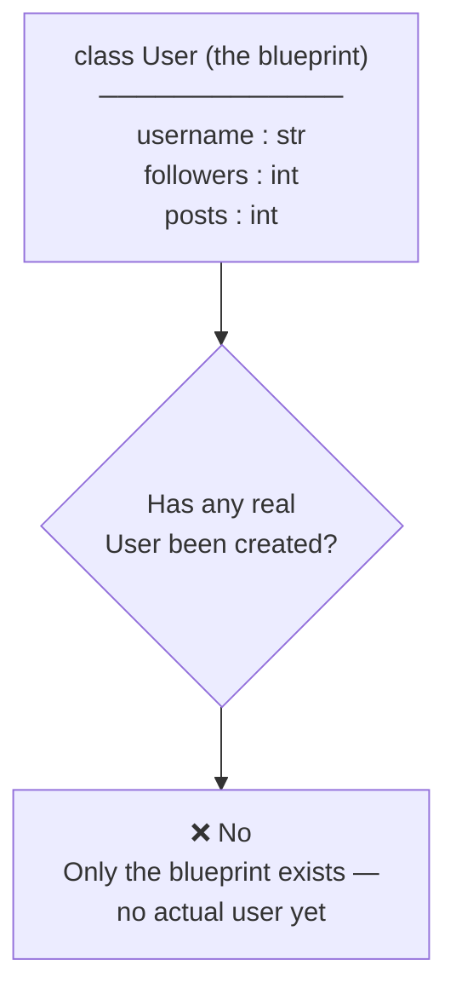
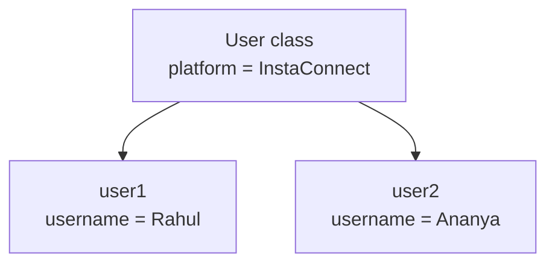

# Object-Oriented Foundations

## Why Object-Oriented Programming Exists

Imagine you're building a simple social media app. With one user,
storing their details is easy:

``` python
username = "Rahul"
followers = 520
posts = 18
```

Add a second user, and you just duplicate the variables:

``` python
user1_name = "Rahul"
user1_followers = 520

user2_name = "Ananya"
user2_followers = 830
```

Still fine. But real apps don't have two users — they have
**millions**. Duplicating variables that far looks like this:

``` python
user1_name = "Rahul"
user2_name = "Ananya"
user3_name = "Vikram"
...
user1000000_name = "..."
```

Now say every user needs an **email address** added. You'd have to
touch all one million of these variables, one by one — a five-minute
feature turns into a nightmare.

> **Can we describe what a user looks like just once, and then create
> as many users as we need from that one description?**

That question is the foundation of **Object-Oriented Programming
(OOP)**.

> **💡 Interesting Fact**
>
> Apps like **Instagram**, **Amazon**, **Netflix**, and **Uber** create
> and manage millions of objects every day. Without OOP, that would be
> nearly impossible to build or maintain.

------------------------------------------------------------------------

## What is Object-Oriented Programming (OOP)?

**OOP** is a way of designing programs around **objects**, instead of
repeating the same variables and functions for every single user.

You describe the reusable design once — what data a user holds, what
actions a user can perform — then create as many objects as you need
from that one description.

Every user in our app has the same shape:

-   Username
-   Followers
-   Posts
-   Profile Picture

Define this once, reuse it forever. That's what makes OOP programs
easier to write, read, maintain, and scale.

------------------------------------------------------------------------

## How OOP Solves the Original Problem

### Without OOP

``` text
User 1
 ├── Username
 ├── Followers
 └── Posts

User 2
 ├── Username
 ├── Followers
 └── Posts

User 3
 ├── Username
 ├── Followers
 └── Posts

...
```

The same structure is repeated again and again.

### With OOP

``` text
             Reusable Design
                  │
                  ▼
               User Class
                  │
      ┌───────────┼───────────┐
      ▼           ▼           ▼
   User 1      User 2      User 3
```

The design is written once.

Objects are created whenever they are needed.

Now that we know **how OOP solves the problem**, the next question is:

> **Where do we write this reusable design?**

The answer is **a Class**.

------------------------------------------------------------------------

# What is a Class?

A **class** is the reusable design used in Object-Oriented Programming.

It defines:

-   What information every object should store.
-   What actions every object should perform.

For our application, every user should have:

-   Username
-   Followers
-   Posts
-   Profile Picture

(Notice these are the exact same three fields — `username`, `followers`,
`posts` — you already saw hard-coded at the very top of this page.)

Instead of defining these fields every time a new user joins, we define
them **once** inside a class.

## Creating Your First Class

``` python
class User:
    username: str
    followers: int
    posts: int
```

This is the **blueprint**. `username`, `followers`, and `posts` here
are **attribute declarations** — names written directly inside the
class body, each paired with the *type* of value it will eventually
hold. Notice: no real value is attached to any of them.

This is the key idea: the blueprint doesn't belong to any specific
object. It isn't Rahul's username, or Ananya's, or anyone's — no
real user exists yet at all. It's simply a description, stating that
*every* `User` will have a `username`, a `followers` count, and a
`posts` count, once one is actually built.

Describe the shape once, then build as many real users as you want
from it. That's exactly what an **object** does next.

### Understanding the Syntax

| Code | Explanation |
|---|---|
| `class` | Tells Python you're creating a class. |
| `User` | The name of the class. By convention, class names start with a capital letter. |
| `:` | Marks the beginning of the class definition. |
| `username: str` | An **attribute declaration** — states that every `User` will have a `username`, holding text. No value is attached — it belongs to the blueprint, not to any object. |
| `followers: int`, `posts: int` | More attribute declarations, written the same way — part of the blueprint, not any specific user's data. |

### What Does Python Know Now?


```mermaid
flowchart TD
    A["class User (the blueprint)
    ─────────────
    username : str
    followers : int
    posts : int"] --> B{"Has any real\nUser been created?"}
    B --> C["❌ No\nOnly the blueprint exists —\nno actual user yet"]
```

The class exists. The users do not.

> **💡 Interesting Fact**
>
> Creating a class **does not create objects automatically**. Python
> creates an object **only when you explicitly ask for one**.

Now the next question becomes obvious.

> **If the class doesn't create users, how do we create one?**

That's where **objects** come in.

------------------------------------------------------------------------

# What is an Object?

An **object** is an actual instance created from a class.

If the class is the reusable design,

the object is the real user created using that design.

Creating an object is simple.

``` python
user1 = User()
user2 = User()
user3 = User()
```

Each line builds a brand-new, **empty** object. None of them carry a
`username`, `followers`, or `posts` yet — creating an object doesn't
copy the class's example values, it just gives you a fresh, blank
one. Think of it as ordering three blank forms: same form, three
separate blank copies.

Now we fill each one in individually, using the dot (`.`) to attach
data directly onto one specific object:

``` python
user1.username = "Rahul"
user1.followers = 520
user1.posts = 18

user2.username = "Ananya"
user2.followers = 830

user3.username = "Vikram"
```

`user1.username = "Rahul"` only touches `user1` — it has no effect on
`user2` or `user3` at all. That's the entire point of an object: all
three were built from the exact same class, but each one now holds
its own separate, independent data.

``` python
print(user1.username, user1.followers, user1.posts)
print(user2.username, user2.followers)
```

``` text
Rahul 520 18
Ananya 830
```

Same class, same field names — but three completely separate objects,
each holding its own real data.

## How Does This Solve Our Original Problem?

We describe the user **once** using a **class**.

Then we create as many **objects** as needed.

``` text
            User Class

                │
      ┌─────────┼─────────┐
      ▼         ▼         ▼

    user1     user2     user3

      ▼         ▼         ▼

    Rahul    Ananya    Vikram
```

Whether your application has:

-   10 users
-   10,000 users
-   10 million users

The **same class** can be reused to create every user.

------------------------------------------------------------------------

## Class vs Object

| Class | Object |
|---|---|
| A reusable design | An actual user created from the design |
| Created once | Can be created many times |
| Defines what an object should have | Stores actual data |
| Does not store user information | Stores information for one specific user |

------------------------------------------------------------------------

# The `__init__()` Constructor

### What Is a Constructor?

A **constructor** is a special method that runs **automatically** the
moment a new object is created from a class. Its job is simple: set
up that object's starting data right away, so it's ready to use
immediately — instead of leaving it empty and filling in each field
by hand afterward.

In Python, the constructor always has one exact name: `__init__`
(short for "initialize"). Any class can define one.

**Why do we need it?** Without a constructor, a freshly created
object is empty — every attribute has to be assigned separately,
after the fact, one line at a time. A constructor removes that step
entirely: describe the starting data once, inside `__init__`, and
every object receives it the instant it's built.

**How do you create one?** Write a method named exactly `__init__`
inside the class, with `self` as its first parameter, followed by
whatever pieces of data every object should start with:

``` python
class User:
    def __init__(self, username, followers, posts):
        self.username = username
        self.followers = followers
        self.posts = posts
```

**How do you use it?** You never call `__init__` yourself. It runs
automatically the moment you write `User("Rahul", 520, 18)` — Python
hands those three values straight into `__init__`, and the object
that comes out already holds them, fully filled in.

That's the constructor in a nutshell. Now let's see exactly why it's
worth having, by looking at the problem it replaces.

Look back at how we gave `user1` and `user2` their data:

``` python
user1.username = "Rahul"
user1.followers = 520
user1.posts = 18

user2.username = "Ananya"
user2.followers = 830
```

One field, one line, for every single user. That's the exact same
repetitive problem we started this page with — it just moved to
*after* the object is created instead of before.

What we actually want is for every object to receive its data
**automatically**, the moment it's created — just by writing
`User("Rahul", 520, 18)`. Python gives us exactly this tool: a special
method called `__init__`.

``` python
class User:
    def __init__(self, username, followers, posts):
        self.username = username
        self.followers = followers
        self.posts = posts
```

`__init__` runs **automatically** every time a new object is created
from this class — you never call it yourself. Notice it takes one
more parameter than you actually type when calling `User(...)` — that
first one, `self`, deserves its own close look.

### The `self` Keyword

`self` is not a special reserved word — it's just a regular parameter
name, and by strong, near-universal convention, every Python
programmer names it `self`. What it holds is simple: **whichever
object the method is currently running on.**

Here's the part that trips people up: you never pass `self` yourself.
Python fills it in for you, automatically, using the object sitting
right before the dot. Line up what you *write* against what Python
*actually does*:

``` python
user1 = User("Rahul", 520, 18)
```

is really, behind the scenes:

``` python
User.__init__(user1, "Rahul", 520, 18)
```

`user1` — the brand-new, blank object Python just built — is slotted
in as the first argument, `self`, without you writing it anywhere.
That's the entire reason `__init__`'s parameter list has one extra
slot compared to what you type at the call site.

Trace it for two different users:

``` python
user1 = User("Rahul", 520, 18)
user2 = User("Ananya", 830, 45)
```

- On the first line, `self` is `user1` — so `self.username = username`
  really means `user1.username = "Rahul"`.
- On the second line, `self` is `user2` instead — the *exact same*
  code inside `__init__` now means `user2.username = "Ananya"`.

Same three lines, run twice, correctly setting data on two completely
different objects — purely because `self` points somewhere different
each time.

> **💡 Rule of thumb:** wherever you see `self` inside a class,
> mentally replace it with *"the object standing to the left of the
> dot, in whatever line made this call."* That one substitution is
> all `self` ever means.

### What Happens Without `self`?

Leave `self` out, and Python breaks immediately — right when you try
to create an object:

``` python
class User:
    def __init__(username, followers, posts):   # self missing!
        username = username
        followers = followers
        posts = posts

user1 = User("Rahul", 520, 18)
```

``` text
TypeError: __init__() takes 3 positional arguments but 4 were given
```

Let's count exactly what happened. You typed three values —
`"Rahul"`, `520`, `18`. But Python *always* sends the brand-new
object in as a hidden, extra first argument, no matter what — that
never changes, `self` or no `self`. So four things actually got sent
into `__init__`:

1. the new object *(added automatically by Python)*
2. `"Rahul"`
3. `520`
4. `18`

But `def __init__(username, followers, posts):` only has **three**
slots to catch them. The fourth value has nowhere to go — that's
exactly the "4 were given" vs. "3 accepted" mismatch in the error.

**The fix:** `self` must always be the first parameter. It exists
specifically to catch that hidden first value Python always sends.

``` python
def __init__(self, username, followers, posts):   # self added back
```

Four slots now, for four values — everything lines up, and the error
disappears.

There's a second, quieter mistake worth knowing separately: adding
`self` correctly, but then forgetting to write `self.` in front of an
attribute name inside the method:

``` python
def __init__(self, username, followers, posts):
    username = username   # missing "self." — this line does nothing useful
```

This produces **no error at all**. Python just creates a short-lived
local variable called `username`, uses it for nothing, and discards
it the moment the method ends — `self.username`, the object's real
attribute, is never actually set. The bug stays completely invisible
until much later, when something tries to read `user1.username` and
gets a confusing `AttributeError`, far from where the real mistake
was made.

**Two separate rules, easy to mix up:** `self` must be the first
parameter of every method, no exceptions — and every attribute you
actually want to keep must be written as `self.name = value`, never
just `name = value`.

Now creating a fully-loaded user takes one line:

``` python
user1 = User("Rahul", 520, 18)
user2 = User("Ananya", 830, 45)
user3 = User("Vikram", 210, 9)

print(user1.username, user1.followers, user1.posts)
print(user2.username, user2.followers, user2.posts)
```

``` text
Rahul 520 18
Ananya 830 45
```

No more assigning fields one at a time after the fact — `__init__`
does it in the same line the object is created. This is the missing
piece that finally solves the problem from the very top of this page:
describe a user once, and create a million different, independent
users, each with its own real data, in one line each.

------------------------------------------------------------------------

# Instance Variables vs. Class Variables

Back in the blueprint, `username`, `followers`, and `posts` were just
**declarations** — names with no value attached to any real user,
because a blueprint isn't about one specific person. Then `__init__`
came along and changed that:

``` python
class User:
    def __init__(self, username, followers, posts):
        self.username = username
        self.followers = followers
        self.posts = posts
```

`self.username = username` attaches a *real* value to one specific
object, the moment that object is created. Now that both moments —
the empty declaration in the blueprint, and the real value set by
`__init__` — exist side by side, it's worth giving each one its
proper name.

First, the one `__init__` creates. Every variable created using
`self` belongs to one individual object:

``` python
user1 = User("Rahul", 520, 18)
user2 = User("Ananya", 830, 45)

print(user1.username)
print(user2.username)
```

``` text
Rahul
Ananya
```

Even though `user1` and `user2` come from the exact same class, each
one stores its own separate data. These are called **instance
variables**.

> **Instance variable:** a variable that belongs to a single object.
> Every object gets its own independent copy.

**What about information every object shares?**

Some information never changes from one object to another — every
user here belongs to the same platform. Instead of repeating
`"InstaConnect"` inside every single object, we can store it once,
directly on the class:

``` python
class User:
    platform = "InstaConnect"      # class variable

    def __init__(self, username, followers, posts):
        self.username = username   # instance variable
        self.followers = followers
        self.posts = posts
```

``` python
user1 = User("Rahul", 520, 18)
user2 = User("Ananya", 830, 45)

print(user1.platform)
print(user2.platform)
```

``` text
InstaConnect
InstaConnect
```

Both objects read the exact same value, because `platform` belongs
to the **class**, not to either individual object.

> **Class variable:** a variable that belongs to the class itself,
> shared by every object built from it.

**Visual representation**


```mermaid
flowchart TD
    A["User class\nplatform = InstaConnect"] --> B["user1\nusername = Rahul"]
    A --> C["user2\nusername = Ananya"]
```

`platform` is shared by both objects. `username` — along with
`followers` and `posts` — is separate for each one.

| | Instance Variable | Class Variable |
|---|---|---|
| Belongs to | One specific object | The class itself |
| Created using | `self.name = value` | Written directly inside the class body |
| Copies | Every object has its own | Shared by all objects |
| Example here | `self.username` | `platform` |

> **💡 Rule of thumb:** if every object should hold its *own* value,
> use an instance variable. If every object should *share* the same
> value, use a class variable.

------------------------------------------------------------------------

# Giving Objects Something to Do — Methods

So far, `User` only stores data — `username`, `followers`, `posts`.
But a real user does more than sit there holding numbers: they post,
gain followers, get looked up. A class should describe not just what
an object *has*, but what it can *do*.

> **Method:** a function that belongs to a class and defines an
> action an object can perform.

### Creating a Method

A method is written with `def`, just like a regular function — the
one difference is that it takes `self` as its first parameter, so it
knows which object it's working with:

``` python
class User:
    def __init__(self, username, followers, posts):
        self.username = username
        self.followers = followers
        self.posts = posts

    def add_post(self):
        self.posts += 1

    def show_profile(self):
        print(self.username, "has", self.followers, "followers and", self.posts, "posts")
```

`add_post()` increases the post count; `show_profile()` prints the
profile. By convention, the constructor comes first, and other
methods follow it — exactly as here.

### Calling a Method

``` python
user1 = User("Rahul", 520, 18)
user2 = User("Ananya", 830, 45)

user1.add_post()
user1.show_profile()
user2.show_profile()
```

``` text
Rahul has 520 followers and 19 posts
Ananya has 830 followers and 45 posts
```

Only `user1`'s post count increased. `user2` is untouched, because
`add_post()` was only ever called on `user1`.

### Why Does a Method Need `self`?

If Rahul posts, only Rahul's count should rise. If Ananya posts, only
hers should. But `add_post()` is one single piece of code, shared by
every `User` object — so how does it know *whose* `posts` to change?

That's what `self` is for. **`self` always refers to the object that
called the method:**

- In `user1.add_post()`, `self` is `user1`.
- In `user2.add_post()`, `self` is `user2`.

The method itself never changes — only the object `self` points to
changes. You can read `self` as saying: *"do this to the current
object."*

### What Happens If We Remove `self`?

``` python
class User:
    def add_post():        # self missing
        posts += 1
```

``` python
user1 = User("Rahul", 520, 18)
user1.add_post()
```

``` text
TypeError: add_post() takes 0 positional arguments but 1 was given
```

Here's why: calling `user1.add_post()` always makes Python pass
`user1` in automatically — it's really running `User.add_post(user1)`
behind the scenes. But `add_post()` above declares **zero**
parameters, so it has nowhere to put that incoming `user1`. One value
arrives, no slot exists — hence the error.

Add `self` back, and the slot exists to catch it:

``` python
def add_post(self):
    self.posts += 1
```

Now `self` is `user1`, so `self.posts` means `user1.posts` — and if
`user2` calls the same method, `self.posts` means `user2.posts`
instead. Same code, correct object, every time.

A class bundles **data** (`username`, `followers`, `posts`) with the
**behavior** that acts on it (`add_post`, `show_profile`), and `self`
is what ties a method back to the one object it was called on.
That's the whole idea this page has been building toward: describe a
user once, and every real user you create carries both their own
data and their own behavior with them.

------------------------------------------------------------------------

## Where We Go From Here

Classes, objects, `__init__`, instance and class variables, and
methods — these are the raw building blocks of Object-Oriented
Programming. On their own, they're enough to build a working class.

But building blocks alone don't guarantee **good** design. As classes
multiply and applications grow, new questions appear: how do we stop
outside code from corrupting an object's data? How do we reuse code
across similar classes instead of duplicating it? How do we let
different objects respond to the same action in their own way? How
do we hide complexity that callers don't need to see?

These questions are answered by four design principles — the **Four
Pillars of OOP**: Encapsulation, Inheritance, Polymorphism, and
Abstraction. The upcoming chapters explore each pillar in turn,
starting with the first one, **Encapsulation**.

------------------------------------------------------------------------

## Reference Links

-   [Python Official Docs — Classes](https://docs.python.org/3/tutorial/classes.html)
-   [Python Official Docs — `__init__` and Class Objects](https://docs.python.org/3/tutorial/classes.html#class-objects)
-   [W3Schools — Python Classes and Objects](https://www.w3schools.com/python/python_classes.asp)
-   [W3Schools — Python Constructors](https://www.w3schools.com/python/python_classes.asp#h1)
