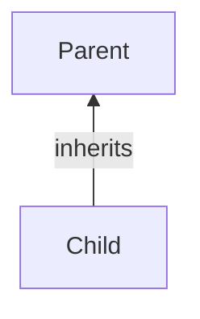
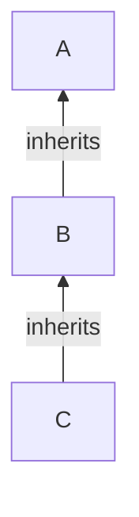
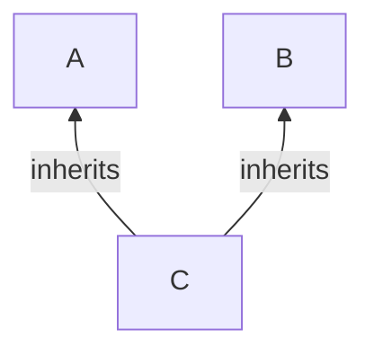
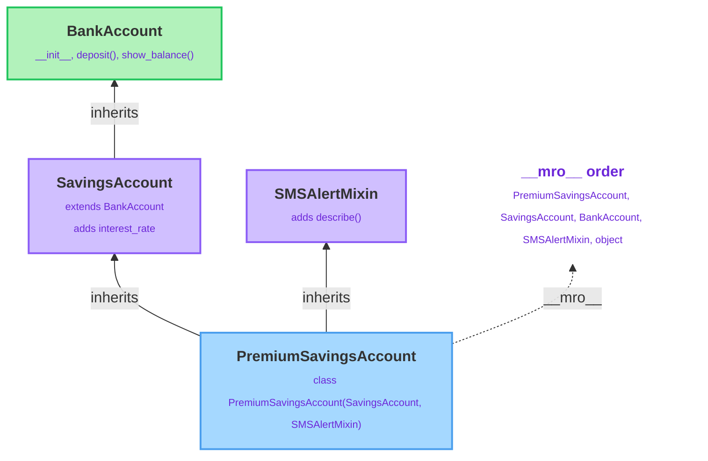

# Inheritance & Encapsulation

---

[← Previous: 4.1 Object-Oriented Foundations](unit-4-1-object-oriented-foundations.md) | [Go back to TOC](../../README.md) | [Next: 4.3 Special Methods & Dataclasses →](unit-4-3-special-methods-dataclasses.md)

## 1. Learning Objectives

By the end of this unit, you will be able to:

- **Explain** what inheritance is and how a subclass automatically gains the attributes and methods of its superclass without copying any code.
- **Implement** single-level and multi-level inheritance using `super()` to extend a superclass's behavior instead of duplicating it.
- **Differentiate** single inheritance, multi-level inheritance, and multiple inheritance, and describe how Method Resolution Order (MRO) decides which class's method runs.
- **Analyze** a diamond-shaped class hierarchy by reading `ClassName.__mro__` to predict exactly which method executes and in what order.
- **Apply** Python's underscore naming conventions (`_name` and `__name`) to encapsulate an object's internal state.
- **Debug** the most common inheritance mistake — forgetting to call `super().__init__()` — and explain exactly why it causes an `AttributeError`.

---

## 2. Overview

In Unit 4.1, you created a **Student** class with attributes such as `name`, `roll_number`, and `marks`, along with a method like `has_passed()`.
Now, suppose you want to create a new class called **GraduateStudent**. A graduate student has all the features of a student but also needs some additional information, such as a **research topic**.
Instead of writing the `Student` class again, Python allows the new class to **reuse** the existing `Student` class and add only the new features. This concept is called **inheritance**.

Think about how large-scale Indian software systems are actually built. A banking application does not write one giant `Account` class that handles savings accounts, current accounts, and loan accounts all at once — it writes one shared `BankAccount` class, and lets `SavingsAccount` and `CurrentAccount` extend it, each adding only what makes it different. A food delivery platform does the same with `DeliveryPartner`, `BikePartner`, and `CarPartner`. This is exactly the "is-a" relationship inheritance is built for: a `SavingsAccount` **is a** `BankAccount`, plus interest.

This unit takes that idea further than a single parent-child pair. You will chain inheritance across multiple levels, see what happens when a class inherits from more than one parent at once (and how Python's **Method Resolution Order** resolves any ambiguity that creates), and learn **encapsulation** — the naming conventions Python gives you to mark which attributes are safe for outside code to touch, and which are internal bookkeeping that should be left alone.

---

## 3. Description

### 3.1 Definition

**Inheritance** helps us reuse existing code. Instead of creating a new class from scratch, we can create it from an existing class. The existing class is called the **superclass** (or **parent class**), while the new class is called the **subclass** (or **child class**). The subclass inherits all the attributes and methods of the superclass and can also include its own additional features.
```python
class BankAccount:               # superclass / parent / base class
    def __init__(self, balance):
        self._balance = balance


class SavingsAccount(BankAccount):   # subclass / child / derived class
    pass
```
Even though `SavingsAccount` has an empty body, it already has everything `BankAccount` has. That single line, `class SavingsAccount(BankAccount):`, is the entire mechanism of inheritance.

**Encapsulation** is the process of keeping an object's data and the methods that work on that data together inside a class. It also helps protect the object's data by encouraging controlled access. In Python, attributes that begin with an underscore (`_`) are treated as **internal** by convention and should not be accessed directly from outside the class.
```python
class BankAccount:
    def __init__(self, balance):
        self.__balance = balance
    def show_balance(self):
        print("Balance:", self.__balance)
account = BankAccount(5000)
account.show_balance()      # Correct
print(account.__balance)    # Error
```
The `__balance` attribute cannot be accessed directly from outside the class. Instead, it should be accessed through the `show_balance()` method.

### 3.2 Why This Concept Exists

#### Inheritance

Without inheritance, every related class would need to be written from scratch, and any common change would have to be repeated in every class. Inheritance helps solve this problem by:

- **Reducing code duplication** – Common methods such as `deposit()` and `withdraw()` can be written once in a `BankAccount` class and reused by `SavingsAccount` and `CurrentAccount`.
- **Representing real-world relationships** – A `SavingsAccount` **is a** `BankAccount`, so it can inherit its common features.
- **Making programs easier to maintain** – A change made to a common method in the parent class is automatically available to all child classes.

#### Encapsulation

Encapsulation keeps an object's data and the methods that work on that data together inside a class. It also encourages controlled access to important data, helping prevent accidental changes from outside the class.

Encapsulation is useful because it:

- **Keeps related data and methods together** inside a class.
- **Protects important data** by encouraging access through methods instead of direct modification.
- **Improves code readability** by marking internal attributes (such as `_balance`) that are intended for use only within the class.
- **Makes programs easier to maintain** by ensuring that changes to internal data handling are managed within the class itself.

### 3.3 Key Terminology

| Term | Simple Meaning |
|---|---|
| **Inheritance** | A mechanism where a new class automatically acquires the attributes and methods of an existing class. |
| **Superclass (parent/base class)** | The existing class being extended. |
| **Subclass (child/derived class)** | The new class built on top of a superclass, using `class Child(Parent):`. |
| **`super()`** | A built-in function that gives a subclass access to the next class in line (usually its superclass), so it can call that class's methods instead of duplicating them. |
| **Overriding** | A subclass defining its own version of a method the superclass already has; the subclass's version runs instead of the superclass's. |
| **Multi-level inheritance** | A chain of more than two classes, where each class extends the one before it (e.g., `A` → `B` → `C`). |
| **Multiple inheritance** | A single subclass extending more than one direct superclass at once, written `class C(A, B):`. |
| **MRO (Method Resolution Order)** | The fixed order Python searches through a class's ancestors when looking up a method or attribute; inspectable via `ClassName.__mro__`. |
| **Diamond problem** | The situation where two superclasses share a common ancestor, and a subclass inherits from both — raising the question of which ancestor's method runs first. |
| **Mixin** | A small superclass written only to add one specific piece of reusable behavior through multiple inheritance — it isn't meant to be used on its own as a genuine "is-a" relationship. |
| **Encapsulation** | Bundling data and the methods that act on it together, while signaling which parts are meant to stay internal to the class. |
| **Public attribute** | A normal attribute (`balance`) — no naming signal; any code may read or change it freely. |
| **Protected attribute (`_name`)** | A single leading underscore — a convention meaning "internal use, don't rely on this from outside," but not enforced by Python. |
| **Private attribute (`__name`)** | A double leading underscore — triggers **name mangling**, rewriting the attribute to `_ClassName__name`. |
| **Name mangling** | Python's automatic rewriting of `self.__x` inside a class body to `self._ClassName__x`, used to avoid attribute name collisions across a hierarchy. |
| **`isinstance()`** | A built-in function that checks whether an object belongs to a given class or any of its superclasses. |
| **`issubclass()`** | A built-in function that checks the same relationship at the class level, not on an instance. |

### 3.4 Syntax

```python
class Child(Parent):
    def __init__(self, ...):
        super().__init__(...)
        # new attributes specific to Child

class C(A, B):
    pass
```

| Part | What it is | Why it's there |
|---|---|---|
| `class Child(Parent):` | Declares `Child` as a subclass of `Parent`. | This single line grants `Child` every attribute-setting and method `Parent` has. |
| `super()` | A proxy referring to the next class in the MRO — usually the superclass. | Lets a subclass call the superclass's method without naming it explicitly, so future changes to `Parent` are picked up automatically. |
| `super().__init__(...)` | Calls the superclass's constructor from inside the subclass's own `__init__`. | Sets up every attribute the superclass is responsible for, so the subclass doesn't have to retype that logic. |
| `class C(A, B):` | Declares `C` as a subclass of **both** `A` and `B` — multiple inheritance. | Lets one class combine behavior from more than one independent superclass. |
| `_name` | A single leading underscore on an attribute or method name. | Signals "protected — internal use only," by convention. |
| `__name` | A double leading underscore on an attribute or method name. | Triggers name mangling to `_ClassName__name`, mainly to avoid accidental name collisions across a hierarchy. |

**Comparison Table: Single Inheritance vs Multi-Level vs Multiple Inheritance**

| Aspect | Single Inheritance | Multi-Level Inheritance | Multiple Inheritance |
|---|---|---|---|
| Structure | One subclass, one direct superclass | A chain: `A` → `B` → `C`, each extending the one before | One subclass, two or more direct superclasses at the same level |
| Syntax | `class B(A):` | `class B(A):` then `class C(B):` | `class C(A, B):` |
| `super()` behavior | Always resolves to the one superclass | Each level's `super()` resolves to the class directly above it in the chain | Resolves to the next class in the computed MRO, which may be a sibling, not a shared ancestor |
| Main risk | Very low — straightforward to reason about | Chains that grow too long become hard to trace | The diamond problem — ambiguity about method order, resolved by MRO |
| Typical use | A specific case of a general class (`SavingsAccount` from `BankAccount`) | Layered specialization (`Employee` → `Manager` → `SeniorManager`) | Combining independent behaviors (mixins) into one class |

**Single Inheritance**



One subclass, one direct superclass — `Child` gains everything `Parent` has.

**Multi-Level Inheritance**



A chain, each class extending the one directly above it — `C` gets everything from `B`, which already got everything from `A`.

**Multiple Inheritance**



One subclass, two (or more) direct superclasses at the same level — `C` combines behaviour from both `A` and `B`.

**Class Hierarchy and MRO**



This diagram shows a realistic banking hierarchy: `SavingsAccount` extends `BankAccount` through ordinary single inheritance, while `PremiumSavingsAccount` uses **multiple inheritance** to combine `SavingsAccount` with an unrelated `SMSAlertMixin`. Python computes the `__mro__` the moment `PremiumSavingsAccount` is defined — it searches `SavingsAccount`'s own chain fully before moving to `SMSAlertMixin`, which is why `BankAccount` appears before `SMSAlertMixin` in the order, even though `SMSAlertMixin` was written second in the class definition.

**Comparison Table: Public vs Protected vs Private Naming Convention**

| Naming Style | Example | Meaning | Enforced by Python? |
|---|---|---|---|
| Public | `self.balance` | No restriction signaled; any code may read or write it freely. | N/A — this is the default |
| Protected (`_name`) | `self._balance` | Convention: "internal use — don't rely on this from outside code." | No — purely a social agreement between developers |
| Private (`__name`) | `self.__pin` | Triggers name mangling to `self._ClassName__pin`, mainly to prevent accidental name collisions across a class hierarchy. | Partially — the original name stops working, but the mangled name is still fully accessible |

### 3.5 Rules

- A subclass is declared with `class Child(Parent):`; the parenthesized name(s) are the direct superclass(es).
- If a subclass does not define its own `__init__`, Python uses the superclass's `__init__` automatically.
- If a subclass **does** define its own `__init__`, the superclass's `__init__` does **not** run automatically — it must be called explicitly with `super().__init__(...)`.
- Method lookup always follows the MRO: Python walks the MRO in order — starting with the object's own class — until it finds the method.
- `super()` always means "the next class in the computed MRO," not literally "my parent class" — this distinction only becomes visible with multiple inheritance (see the diagram in §3.4).
- A double leading underscore (`__name`) is rewritten by Python, at compile time, to `_ClassName__name`, using the exact name of the class where that line of code is written.
- `isinstance(obj, Cls)` returns `True` if `Cls` appears anywhere in the object's class's MRO, not only if it is the immediate class.

### 3.6 Best Practices

- Favor **composition over deep inheritance chains** — if a relationship isn't genuinely "is-a" (a `SavingsAccount` **is a** `BankAccount`), consider giving one class an instance of another instead of forcing an inheritance relationship that doesn't really fit.
- Keep hierarchies shallow. Two or three levels are usually enough; a chain five levels deep becomes hard to trace and debug.
- Always call `super().__init__()` at the start of a subclass's `__init__`, before adding anything new — this guarantees the superclass's part of the object is fully built first.
- Use a single leading underscore (`_balance`) as your default way to mark internal attributes; reach for a double leading underscore only when you specifically need to avoid a name collision across a hierarchy.
- Prefer well-defined methods (like `deposit()`, `withdraw()`) over direct attribute access, even for attributes without any underscore — it keeps validation logic in one place.
- When using multiple inheritance, keep each parent class narrowly focused on one responsibility (often called a **mixin**), so the MRO stays predictable.

### 3.7 Common Mistakes

- **Forgetting to call `super().__init__()`** — the superclass's attributes are never set, and any method relying on them later fails with an `AttributeError`.
- **Assuming a subclass "automatically" has the parent's data** — inheriting a *method* only makes it available; the object's actual *data* exists only if `__init__` genuinely ran and assigned it.
- **Diamond-problem confusion in multiple inheritance** — assuming `super()` inside a class always jumps to "its" direct parent; it actually jumps to the next class in the MRO, which in a diamond shape is often a sibling class, not the shared ancestor.
- **Assuming Python enforces true private variables** — `self.__pin` is still reachable from outside as `self._ClassName__pin`; double underscore prevents accidental name collisions, but it does not provide real security.
- **Building unnecessarily deep inheritance chains** just to reuse a couple of methods, when a simpler, flatter design (or composition) would be easier to read and maintain.
- **Overriding a method without knowing you're overriding it** — accidentally reusing a superclass's method name and silently losing access to its original behavior.

### 3.8 Code Examples

One consolidated example builds up an entire `BankAccount` hierarchy, adding one concept at a time — single-level inheritance with `super()`, then multi-level inheritance, then multiple inheritance with MRO, and finally the encapsulation naming conventions used throughout.

```python
class BankAccount:
    def __init__(self, account_holder, balance):
        self.account_holder = account_holder
        self._balance = balance        # protected: internal bookkeeping
        self.__pin = "1234"            # private: name-mangled

    def deposit(self, amount):
        self._balance += amount
        return self._balance

    def show_balance(self):
        return f"{self.account_holder}'s balance: Rs. {self._balance}"


# --- Part 1: single-level inheritance with super() ---
class SavingsAccount(BankAccount):
    def __init__(self, account_holder, balance, interest_rate):
        super().__init__(account_holder, balance)
        self.interest_rate = interest_rate

    def add_interest(self):
        interest = self._balance * self.interest_rate / 100
        self._balance += interest
        return self._balance


# --- Part 2: multi-level inheritance ---
class MinorSavingsAccount(SavingsAccount):
    def __init__(self, account_holder, balance, interest_rate, guardian_name):
        super().__init__(account_holder, balance, interest_rate)
        self.guardian_name = guardian_name

    def show_balance(self):
        base = super().show_balance()
        return f"{base} (guardian: {self.guardian_name})"


# --- Part 3: multiple inheritance and MRO ---
class SMSAlertMixin:
    def describe(self):
        return "Sends SMS alerts on every transaction"


class PremiumSavingsAccount(SavingsAccount, SMSAlertMixin):
    pass


sa = SavingsAccount("Rohit Verma", 50000, 4)
sa.add_interest()
print(sa.show_balance())

minor = MinorSavingsAccount("Aditi Rao", 10000, 3, "Sunita Rao")
minor.add_interest()
print(minor.show_balance())
print(isinstance(minor, BankAccount))

premium = PremiumSavingsAccount("Karan Mehta", 75000, 5)
premium.add_interest()
print(premium.describe())
print(PremiumSavingsAccount.__mro__)

# --- Part 4: encapsulation naming conventions ---
print(sa._balance)                 # works — protected, only a convention
print(sa._BankAccount__pin)        # works — mangled name, still reachable
```

*Line-by-line explanation:*

**Part 1 — single-level inheritance with `super()`:**
- `BankAccount` is the superclass. It stores `_balance` with a single leading underscore (protected — internal bookkeeping, but still reachable from outside) and `__pin` with a double leading underscore (triggers name mangling to `_BankAccount__pin`).
- `class SavingsAccount(BankAccount):` declares `SavingsAccount` as a subclass of `BankAccount`.
- `super().__init__(account_holder, balance)` calls `BankAccount.__init__` to set up `account_holder` and `_balance`, without retyping that logic; `SavingsAccount` then adds only its own new attribute, `interest_rate`.
- `sa.add_interest()` reads and updates the inherited `_balance` directly, since `SavingsAccount` has full access to it.

**Part 2 — multi-level inheritance:**
- `class MinorSavingsAccount(SavingsAccount):` extends `SavingsAccount`, which itself extends `BankAccount` — a three-class chain, `BankAccount` → `SavingsAccount` → `MinorSavingsAccount`.
- `super().__init__(account_holder, balance, interest_rate)` calls `SavingsAccount.__init__`, which in turn calls `BankAccount.__init__` — one `super()` call per level, each handing off to the level above it.
- `show_balance()` is overridden in `MinorSavingsAccount`, but it calls `super().show_balance()` first to reuse `BankAccount`'s formatted string, then appends the guardian detail — this is **extending**, not replacing.
- `isinstance(minor, BankAccount)` returns `True` because `BankAccount` appears in `MinorSavingsAccount`'s MRO, even though it isn't the *direct* parent.

**Part 3 — multiple inheritance and MRO:**
- `SMSAlertMixin` is an independent class, unrelated to `BankAccount`, that exists purely to add one reusable piece of behavior — a **mixin**.
- `class PremiumSavingsAccount(SavingsAccount, SMSAlertMixin):` uses **multiple inheritance** to combine both at once — `PremiumSavingsAccount` gets everything from `SavingsAccount` (and, through it, `BankAccount`) plus `describe()` from `SMSAlertMixin`. Since it defines no `__init__` of its own, Python uses `SavingsAccount.__init__` automatically.
- `PremiumSavingsAccount.__mro__` shows the exact order Python searches: `PremiumSavingsAccount`, `SavingsAccount`, `BankAccount`, `SMSAlertMixin`, `object` — `BankAccount` is fully resolved before Python ever reaches `SMSAlertMixin`, because `SavingsAccount`'s whole chain is searched first.

**Part 4 — encapsulation naming conventions:**
- `sa._balance` is read directly from outside the class and still works — proving the single underscore is a *convention*, not an enforced rule.
- `sa._BankAccount__pin` also works — this is the mangled name Python actually rewrote `self.__pin` to, proving the "private" double underscore only renamed the attribute; it did not truly hide it.

*Expected output:*
```
Rohit Verma's balance: Rs. 52000.0
Aditi Rao's balance: Rs. 10300.0 (guardian: Sunita Rao)
True
Sends SMS alerts on every transaction
(<class '__main__.PremiumSavingsAccount'>, <class '__main__.SavingsAccount'>, <class '__main__.BankAccount'>, <class '__main__.SMSAlertMixin'>, <class 'object'>)
52000.0
1234
```

#### Try It Yourself

Using the same `BankAccount` hierarchy, extend it in a new direction — a **current account** for everyday spending.

**Part 1 (single-level inheritance):** Create a class `CurrentAccount(BankAccount)` whose `__init__` takes `account_holder`, `balance`, and `overdraft_limit`, calling `super().__init__()` to set up the base account before storing `overdraft_limit`. Add a method `withdraw(amount)` that subtracts `amount` from `_balance`, but only if the result would not go below `-overdraft_limit`. Test it by creating `CurrentAccount("Neha Kapoor", 5000, 2000)`, withdrawing `6000`, and printing `show_balance()`.

**Solution:**
```python
class CurrentAccount(BankAccount):
    def __init__(self, account_holder, balance, overdraft_limit):
        super().__init__(account_holder, balance)
        self.overdraft_limit = overdraft_limit

    def withdraw(self, amount):
        if self._balance - amount >= -self.overdraft_limit:
            self._balance -= amount
        return self._balance


ca = CurrentAccount("Neha Kapoor", 5000, 2000)
ca.withdraw(6000)
print(ca.show_balance())
```
Expected output:
```
Neha Kapoor's balance: Rs. -1000
```
`5000 - 6000 = -1000`, which is still `>= -2000` (the overdraft limit), so the withdrawal is allowed and `_balance` goes negative.

**Part 2 (multi-level inheritance):** Create `StudentCurrentAccount(CurrentAccount)` whose `__init__` adds a `college_name` attribute, calling `super().__init__()` for the rest. Override `show_balance()` to call `super().show_balance()` and append `" (student at {college_name})"`. Test with `StudentCurrentAccount("Ishaan Bose", 3000, 1000, "IIT Delhi")`, withdraw `500`, then print `show_balance()`, `isinstance(sca, BankAccount)`, and `StudentCurrentAccount.__mro__`.

**Solution:**
```python
class StudentCurrentAccount(CurrentAccount):
    def __init__(self, account_holder, balance, overdraft_limit, college_name):
        super().__init__(account_holder, balance, overdraft_limit)
        self.college_name = college_name

    def show_balance(self):
        base = super().show_balance()
        return f"{base} (student at {self.college_name})"


sca = StudentCurrentAccount("Ishaan Bose", 3000, 1000, "IIT Delhi")
sca.withdraw(500)
print(sca.show_balance())
print(isinstance(sca, BankAccount))
print(StudentCurrentAccount.__mro__)
```
Expected output:
```
Ishaan Bose's balance: Rs. 2500 (student at IIT Delhi)
True
(<class '__main__.StudentCurrentAccount'>, <class '__main__.CurrentAccount'>, <class '__main__.BankAccount'>, <class 'object'>)
```
`StudentCurrentAccount` → `CurrentAccount` → `BankAccount` is a three-level chain, so `isinstance` reports `True` and the MRO lists all three classes plus `object`.

**Part 3 (multiple inheritance, MRO, and encapsulation):** Create a mixin `LoyaltyPointsMixin` with a method `award_points()` that returns `"100 loyalty points credited"`. Create `EliteCurrentAccount(CurrentAccount, LoyaltyPointsMixin)` with an empty body. Create `EliteCurrentAccount("Sanya Iyer", 20000, 5000)`, then print `award_points()`, `EliteCurrentAccount.__mro__`, `_balance`, and the mangled `__pin` attribute from outside the class.

**Solution:**
```python
class LoyaltyPointsMixin:
    def award_points(self):
        return "100 loyalty points credited"


class EliteCurrentAccount(CurrentAccount, LoyaltyPointsMixin):
    pass


elite = EliteCurrentAccount("Sanya Iyer", 20000, 5000)
print(elite.award_points())
print(EliteCurrentAccount.__mro__)
print(elite._balance)
print(elite._BankAccount__pin)
```
Expected output:
```
100 loyalty points credited
(<class '__main__.EliteCurrentAccount'>, <class '__main__.CurrentAccount'>, <class '__main__.BankAccount'>, <class '__main__.LoyaltyPointsMixin'>, <class 'object'>)
20000
1234
```
`EliteCurrentAccount` defines no `__init__` of its own, so `CurrentAccount.__init__` runs automatically. The MRO shows `CurrentAccount` and `BankAccount` fully resolved before `LoyaltyPointsMixin` is reached. Finally, `_balance` and the mangled `_BankAccount__pin` are both readable from outside the class — a last reminder that Python's encapsulation is convention, not enforcement.

---

## 4. Real-World Application

- **Banking & FinTech:** `SavingsAccount` and `CurrentAccount` both extend a shared `BankAccount` base, reusing `deposit()`/`withdraw()` logic while each adds its own rules (interest, overdraft limits) — exactly the pattern built up in §3.8's code example.
- **UPI / Payment Systems:** A payment gateway might have a base `PaymentMethod` class, extended by `UPIPayment`, `CardPayment`, and `NetBankingPayment`, each overriding a `process()` method with its own validation logic while sharing common logging and retry behavior.
- **E-commerce:** A `Product` base class is extended by `ElectronicsProduct` and `GroceryProduct`, each adding fields like `warranty_period` or `expiry_date`, while both inherit shared pricing and discount logic.
- **Food Delivery:** A `DeliveryPartner` base class is extended by `BikePartner` and `CarPartner`; combining a partner class with an independent `RatingMixin` through multiple inheritance is a realistic use of the MRO concept from §3.4.
- **Healthcare:** A `Patient` base class is extended by `InpatientRecord` and `OutpatientRecord`, each adding fields specific to that kind of visit while sharing common demographic fields through inheritance.
- **Railway Booking (IRCTC-style systems):** A `Passenger` base class extended by `SeniorCitizenPassenger` or `TatkalBooking`, each overriding fare-calculation logic while reusing shared booking and cancellation methods.
- **Exception Hierarchies:** Python's own built-in errors form exactly this structure — `ValueError` and `TypeError` both extend `Exception` — and production code routinely extends further, e.g., `InvalidPinError(ValidationError)`, so `isinstance(err, ValidationError)` catches every specific subtype without checking each one by name.

---

## 5. Worked Example

### Problem Statement

You already have a `Student` class from Unit 4.1 with `name`, `roll_number`, `marks`, and `has_passed()`. You are asked to build a `GraduateStudent` class that reuses everything `Student` already provides, adds one new field — `thesis_topic` — and raises the passing mark to 50. You must then deliberately break the pattern by skipping `super().__init__()` in a second class, to see exactly what goes wrong and why.

### Step 1: Understand the Problem

`GraduateStudent` needs everything `Student` has (`name`, `roll_number`, `marks`) plus one new field (`thesis_topic`), and its own, higher passing threshold. Nothing about `Student`'s existing code should be retyped — it should be reused through inheritance and extended through `super()`.

### Step 2: Plan the Solution

Declare `GraduateStudent(Student)`. In its `__init__`, call `super().__init__(name, roll_number, marks)` to let `Student` set up its three fields, then set `self.thesis_topic` separately. Override `has_passed()` with `GraduateStudent`'s own version, since the passing rule genuinely differs — no need for `super()` there. Then write a second class, `BrokenGraduateStudent`, that forgets to call `super().__init__()`, to observe the failure directly.

### Step 3: Write the Python Code

```python
class Student:
    def __init__(self, name, roll_number, marks):
        self.name = name
        self.roll_number = roll_number
        self.marks = marks

    def has_passed(self):
        return self.marks >= 40


class GraduateStudent(Student):
    def __init__(self, name, roll_number, marks, thesis_topic):
        super().__init__(name, roll_number, marks)
        self.thesis_topic = thesis_topic

    def has_passed(self):
        return self.marks >= 50   # graduate-level pass mark is higher


class BrokenGraduateStudent(Student):
    def __init__(self, name, roll_number, marks, thesis_topic):
        self.thesis_topic = thesis_topic   # forgot to call super().__init__()


gs = GraduateStudent("Arjun", 301, 88.0, "Computer Vision for Traffic Systems")
print(gs.name)
print(gs.has_passed())
print(isinstance(gs, Student))

broken = BrokenGraduateStudent("Meera", 302, 91.0, "Speech Recognition")
print(broken.thesis_topic)
print(broken.has_passed())
```

### Step 4: Explain Each Line

- `class Student:` and its `__init__`/`has_passed()` are unchanged from Unit 4.1 — the existing superclass.
- `class GraduateStudent(Student):` declares the subclass.
- `super().__init__(name, roll_number, marks)` calls `Student.__init__`, which sets `self.name`, `self.roll_number`, and `self.marks` on the new object.
- `self.thesis_topic = thesis_topic` adds the one field unique to `GraduateStudent`.
- `def has_passed(self):` inside `GraduateStudent` **overrides** `Student`'s version with a stricter rule — no `super()` call is needed here because the entire rule is replaced, not extended.
- `class BrokenGraduateStudent(Student):` also declares a subclass, but its `__init__` **never calls `super().__init__()`** — only `self.thesis_topic` gets set.
- `gs.name`, `gs.has_passed()`, and `isinstance(gs, Student)` all work correctly on the properly built object.
- `broken.thesis_topic` works, because that line genuinely ran.
- `broken.has_passed()` needs `self.marks`, but `self.marks` was never set — `Student.__init__` never ran — so this line fails.

### Step 5: Sample Input

The four hardcoded values passed into `GraduateStudent(...)` and `BrokenGraduateStudent(...)`: `"Arjun"`, `301`, `88.0`, `"Computer Vision for Traffic Systems"`, and `"Meera"`, `302`, `91.0`, `"Speech Recognition"`. No user input is involved.

### Step 6: Expected Output

```
Arjun
True
True
Speech Recognition
AttributeError: 'BrokenGraduateStudent' object has no attribute 'marks'
```

### Step 7: Why the Output Is Produced

`gs.name` prints correctly because `super().__init__()` ran and set it. `gs.has_passed()` returns `True` because `GraduateStudent`'s overridden rule (`marks >= 50`) checks `88.0`, which passes easily. `isinstance(gs, Student)` returns `True` because `Student` appears in `GraduateStudent`'s MRO, regardless of the override.

For `broken`, `thesis_topic` prints fine because that assignment genuinely executed. But `has_passed()` needs `self.marks` — and since `Student.__init__` never ran (there was no `super().__init__()` call), that attribute was never created, so Python raises `AttributeError`. This proves that inheriting a *method* only makes it available; the object's actual *data* exists only when `__init__` genuinely runs and sets it.

---

### Important Notes (Interview Insights)

- **MRO and `super()` are classic interview topics** for any Python role. Be ready to explain, in your own words, that `super()` does not mean "my direct parent" — it means "the next class in the MRO" — and be able to trace `ClassName.__mro__` for a small diamond-shaped hierarchy on a whiteboard.
- A very common fresher interview question: *"Does Python have private variables like Java?"* The confident, correct answer: **no** — Python's underscore convention is "convention, not enforcement." A single underscore (`_name`) is a social signal only; a double underscore (`__name`) triggers name mangling, which prevents accidental collisions but can still be bypassed by anyone who knows the mangled name. This is a fundamentally different model from Java's `private` keyword, which the compiler actively enforces.
- Interviewers often ask you to distinguish **overriding** (replacing a method entirely) from **extending** (calling `super()` to reuse the superclass's version and add to it) — know both terms and be able to demonstrate each with a one-line code example.
- Be ready to explain why `isinstance()` is generally preferred over checking `type(obj) == SomeClass` — `isinstance()` respects the whole inheritance hierarchy (and MRO), while an exact `type()` comparison does not.

---

## 6. Key Takeaways

- **Inheritance** (`class Child(Parent):`) gives a subclass every attribute-setting and method the superclass has, automatically — no code duplication needed.
- **`super()`** calls the next class in the object's Method Resolution Order — not necessarily a hardcoded "parent" — letting a subclass extend inherited logic instead of duplicating it.
- **Multi-level inheritance** chains classes (`A` → `B` → `C`); each level only needs to call `super()` once, targeting the level directly above it.
- **Multiple inheritance** (`class C(A, B):`) lets one class combine behavior from more than one direct superclass, at the cost of needing to understand MRO.
- **MRO (Method Resolution Order)** is the fixed search order Python computes once, at class definition time; inspect it any time with `ClassName.__mro__`.
- The **diamond problem** shows that `super()` means "next in the MRO," not "my literal parent" — this only becomes visible once a class has more than one direct base.
- **Encapsulation** in Python is convention-based: `_name` signals "internal use" without any enforcement, and `__name` triggers name mangling (`_ClassName__name`) mainly to avoid attribute collisions — not to provide real security.
- Skipping `super().__init__()` in a subclass means the superclass's attributes never get set, surfacing later as an `AttributeError` the moment code tries to use them.
- Favor composition and shallow hierarchies over deep inheritance chains — reserve multiple inheritance for narrow, focused mixins.

Coming next: special methods and dataclasses — controlling how your objects are printed and compared, and cutting down the boilerplate needed to define them (Unit 4.3 — Special Methods & Dataclasses).

---

## 7. Reference Links

- [Python 3 Documentation — Inheritance (Tutorial)](https://docs.python.org/3/tutorial/classes.html#inheritance)
- [Python 3 Documentation — `super()` built-in function](https://docs.python.org/3/library/functions.html#super)
- [Python 3 Documentation — Multiple Inheritance](https://docs.python.org/3/tutorial/classes.html#multiple-inheritance)
- [Real Python — Supercharge Your Classes With Python `super()`](https://realpython.com/python-super/)
- [Real Python — Inheritance and Composition: A Python OOP Guide](https://realpython.com/inheritance-composition-python/)
- [W3Schools — Python Inheritance](https://www.w3schools.com/python/python_inheritance.asp)

[← Previous: 4.1 Object-Oriented Foundations](unit-4-1-object-oriented-foundations.md) | [Go back to TOC](../../README.md) | [Next: 4.3 Special Methods & Dataclasses →](unit-4-3-special-methods-dataclasses.md)

---

*© 2026 Revature · AI Native Engineering — Foundations · Unit 4.2 · Version 2.0*
