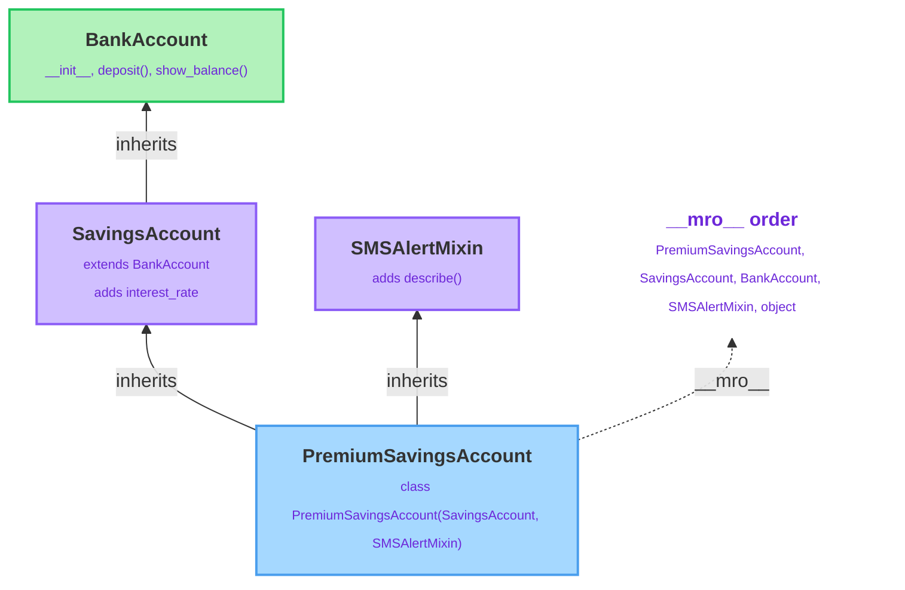

# The Four Pillars of OOP

---

[← Previous: 4.1 Object-Oriented Foundations](unit-4-1-object-oriented-foundations.md) | [Go back to TOC](../../README.md) | [Next: 4.3 Special Methods & Dataclasses →](unit-4-3-special-methods-dataclasses.md)

## 1. Learning Objectives

By the end of this unit, you will be able to:

- **Identify** the four pillars of Object-Oriented Programming — Encapsulation, Abstraction, Inheritance, and Polymorphism — and state, in your own words, the specific problem each one solves.
- **Implement** encapsulation using Python's underscore naming conventions (`_name` and `__name`) to signal and control access to an object's internal state.
- **Implement** abstraction using `abc.ABC` and `@abstractmethod` to define a shared contract that concrete subclasses are required to fill in.
- **Implement** single-level and multi-level inheritance using `super()` to extend a superclass's behavior instead of duplicating it.
- **Differentiate** single, multi-level, multiple, hierarchical, and hybrid inheritance, and describe how Method Resolution Order (MRO) decides which class's method runs.
- **Implement** polymorphism through method overriding, duck typing, and operator overloading (`__add__`, `__str__`, and similar dunder methods), and explain why one line of calling code can behave differently depending on the object involved.
- **Debug** the most common mistake tied to each pillar — a "private" attribute assumed to be truly hidden, an abstract class instantiated directly, and a missing `super().__init__()` call.

---

## 2. Overview

Real-world software is never one giant class. Every serious object-oriented language — Python, Java, C#, C++ — organizes its class design around four foundational ideas, commonly known as the **four pillars of OOP**: **Encapsulation**, **Abstraction**, **Inheritance**, and **Polymorphism**.

You already met the basics of a class and its objects in the object-oriented foundations unit, with a `Student` class holding `name`, `roll_number`, and `marks`, plus a method like `has_passed()`. This unit takes that one class and asks four different design questions of it:

- **Encapsulation** — how do we stop `marks` from being set to something invalid, like `-50`, by code outside the class?
- **Abstraction** — how do we describe *what* every kind of student must be able to do (such as `has_passed()`), without forcing every subclass to implement it in exactly the same way?
- **Inheritance** — how do we build a `GraduateStudent` that reuses everything `Student` already provides, without retyping a single line of it?
- **Polymorphism** — how can one piece of calling code, `student.has_passed()`, work correctly whether `student` is a `Student`, a `GraduateStudent`, or some future subclass nobody has written yet?

Think about how large-scale Indian software systems are actually built. A banking application does not write one giant `Account` class that handles savings accounts, current accounts, and loan accounts all at once — it writes one shared `BankAccount` class, protects its balance from careless outside edits (**encapsulation**), defines what every account type must be able to do (**abstraction**), lets `SavingsAccount` and `CurrentAccount` extend it instead of copying it (**inheritance**), and then processes a whole list of mixed account types with one shared loop (**polymorphism**). A food delivery platform does the same with `DeliveryPartner`, `BikePartner`, and `CarPartner`.

This unit walks through all four pillars one at a time — each with its own definition, its reasons for existing, its types, and its syntax — and then ties all four together in a single, consolidated `BankAccount` example so you can see them working side by side in one realistic hierarchy.

---

## 3. Description

### 3.1 The Four Pillars of OOP — Overview

Object-Oriented Programming is not one single technique — it is four related but distinct ideas that, together, let you model real-world entities as objects that are safe to use, easy to extend, and easy to reuse. Every class-based language you will ever work in is built around exactly these four pillars:

| Pillar | One-line definition | The problem it solves |
|---|---|---|
| **Encapsulation** | Bundling data and the methods that act on it inside one class, and signaling what outside code should and shouldn't touch. | Prevents an object's internal state from being changed into something invalid or inconsistent. |
| **Abstraction** | Exposing only the essential "what" an object can do, while hiding the internal "how." | Defines a common contract that many different implementations can share, without forcing them to share code. |
| **Inheritance** | Letting a new class reuse the attributes and methods of an existing class. | Removes the need to rewrite the same logic in every related class. |
| **Polymorphism** | Letting the same method call or operator behave differently depending on the actual object involved. | Lets one piece of code work with many different types through a single shared interface, instead of an `if`/`elif` chain checking every type by hand. |

These four ideas are taught together because, in real designs, they build on one another: you typically design an **abstraction** first (what must every subclass be able to do), realize it through **inheritance** (share common code across those subclasses), rely on **polymorphism** to call the shared method without caring which subclass you actually have, and protect the object's internals throughout with **encapsulation**. The rest of this unit takes each pillar in turn — its definition, why and where it's useful, its types, and its syntax — before bringing all four together in one consolidated example in §3.10.

### 3.2 Pillar 1: Encapsulation

#### Definition

**Encapsulation** is the process of keeping an object's data and the methods that work on that data together inside one class. It also helps protect that data by encouraging controlled access instead of direct, unrestricted access from outside code. In Python, attributes that begin with an underscore (`_`) are treated as **internal** by convention and should not be relied on from outside the class.

```python
class BankAccount:
    def __init__(self, balance):
        self.__balance = balance

    def show_balance(self):
        print("Balance:", self.__balance)


account = BankAccount(5000)
account.show_balance()      # Correct — goes through the class's own method
print(account.__balance)    # Error — __balance is not directly reachable by this name
```

The `__balance` attribute cannot be read directly from outside the class using that exact name. Instead, it must be accessed through the `show_balance()` method, which is the entire point: the class controls how its own data is read or changed.

#### Why It Exists / Where It's Useful

Without encapsulation, any code anywhere in a program could reach directly into an object and set its attributes to anything at all — including invalid values that break the object's own logic. Encapsulation is useful because it:

- **Keeps related data and methods together** inside one class, instead of scattering related logic across the program.
- **Protects important data** by encouraging access through methods (which can validate input) instead of direct, unchecked modification.
- **Improves code readability** by marking internal attributes (such as `_balance`) that are intended for use only within the class.
- **Makes programs easier to maintain** because changes to *how* internal data is stored or validated stay inside the class itself — nothing outside the class needs to change.
- **Is used everywhere in production code:** a `BankAccount` class hides its own `_balance` behind `deposit()`/`withdraw()` methods that can reject an invalid amount, rather than letting any code set `account.balance = -500` directly.

#### Access Levels in Encapsulation

Python expresses encapsulation through three access levels, distinguished purely by **naming convention** — unlike Java or C++, there is no `private`/`protected`/`public` keyword:

| Access Level | Example | Meaning | Enforced by Python? |
|---|---|---|---|
| **Public** | `self.balance` | No restriction signaled; any code may read or write it freely. | N/A — this is the default |
| **Protected (`_name`)** | `self._balance` | Convention: "internal use — don't rely on this from outside code." | No — purely a social agreement between developers |
| **Private (`__name`)** | `self.__pin` | Triggers **name mangling** to `self._ClassName__pin`, mainly to prevent accidental name collisions across a class hierarchy. | Partially — the original name stops working, but the mangled name is still fully accessible |

1. **Public members** — the default for every attribute and method unless you add an underscore. Any code, anywhere, may read or write a public attribute freely.
2. **Protected members (`_name`)** — a single leading underscore is a polite request: "this is internal bookkeeping; use the class's own methods instead of touching this directly." Python does not stop you from accessing it — the restriction is a convention among developers, not a rule the interpreter enforces.
3. **Private members (`__name`)** — a double leading underscore triggers **name mangling**: Python rewrites `self.__pin` inside the class body to `self._ClassName__pin`. This mainly prevents accidental name collisions in a class hierarchy (so a subclass's own `__pin` never silently clashes with the superclass's `__pin`); it is not a true security mechanism, since the mangled name is still reachable from outside.

#### Syntax

```python
class BankAccount:
    def __init__(self, balance):
        self._balance = balance      # protected: "internal use" by convention
        self.__pin = "1234"          # private: name-mangled to _BankAccount__pin

    def show_balance(self):
        return f"Balance: Rs. {self._balance}"


account = BankAccount(5000)
print(account.show_balance())        # Balance: Rs. 5000
print(account._balance)              # 5000 — works, but signals "don't rely on this"
print(account._BankAccount__pin)     # 1234 — the mangled name still works
```

| Part | What it is | Why it's there |
|---|---|---|
| `self._balance` | An attribute with a single leading underscore. | Signals "protected — internal use only," purely by convention. |
| `self.__pin` | An attribute with a double leading underscore. | Triggers name mangling to `_ClassName__name`, mainly to avoid accidental name collisions across a hierarchy. |
| `account.show_balance()` | Reading data through a defined method instead of the raw attribute. | This is the intended, controlled way to access an object's internal state. |

### 3.3 Pillar 2: Abstraction

#### Definition

**Abstraction** means exposing only the essential behavior of an object to the outside world, while hiding the internal implementation details behind it. When you call `len(my_list)`, you don't need to know *how* Python actually counts the elements internally — you only need to know that `len()` takes a sequence and returns its length. That is abstraction: a simple, essential interface standing in front of hidden complexity.

In class design, abstraction usually means defining *what* a family of related classes must be able to do, without dictating exactly *how* each one does it. Python provides a formal tool for this: the **Abstract Base Class (ABC)**, from the built-in `abc` module.

```python
from abc import ABC, abstractmethod

class PaymentMethod(ABC):          # abstract base class — cannot be instantiated directly
    @abstractmethod
    def process(self, amount):
        """Every payment method must define exactly how it processes a payment."""
```

`PaymentMethod` describes *what* every payment method must do (`process(amount)`), without providing an implementation of its own — that is left entirely to each concrete subclass.

#### Why It Exists / Where It's Useful

- **Defines a shared contract** — every subclass of `PaymentMethod` is guaranteed to implement `process()`, because Python refuses to create an instance of any subclass that forgets to.
- **Hides irrelevant detail from the caller** — code that calls `payment.process(500)` does not need to know whether `payment` is a `UPIPayment` or a `CardPayment` internally; it only needs to know that `process()` exists.
- **Enables polymorphism (§3.5)** — abstraction is what makes it *safe* to write one loop that calls `process()` on a list containing many different payment types, because every item in that list is guaranteed to have a working `process()`.
- **Catches design mistakes early** — forgetting to implement an abstract method raises a `TypeError` the moment you try to instantiate the incomplete subclass, not later, when the missing method finally gets called in production.
- **Used constantly in real systems** — a payment gateway, a notification service (`EmailNotifier`, `SMSNotifier`, `PushNotifier`), or a file parser (`CSVParser`, `JSONParser`) are all naturally modeled as one abstract base defining the shared method every concrete version must supply.

#### Approaches to Abstraction

1. **Partial (incomplete) abstraction** — an abstract class mixes abstract methods (declared with `@abstractmethod`, no implementation) with regular, concrete methods that are already fully implemented and simply inherited as-is. Most real Python abstract classes are this type — some behavior is shared, some is left for each subclass to define.
2. **Full abstraction (interface-like)** — every single method in the abstract class is marked `@abstractmethod`; the class provides no implementation of its own at all, only a contract that every subclass must fill in completely. This is the closest Python gets to Java's or C#'s dedicated `interface` keyword — Python has no separate keyword for it, because an ABC where 100% of the methods are abstract already achieves the same effect.
3. **Informal (duck-typed) abstraction** — Python's dynamic typing means you can achieve a looser form of abstraction without using the `abc` module at all: simply document that "any object with a `.process(amount)` method will work here," and rely on convention rather than enforcement. This is common in smaller Python codebases, but it gives up the safety net of an enforced `TypeError` — nothing stops an incomplete class from being instantiated.

#### Syntax

```python
from abc import ABC, abstractmethod

class PaymentMethod(ABC):
    @abstractmethod
    def process(self, amount):
        ...

    def log(self, amount):                 # concrete method — shared as-is by every subclass
        print(f"Processing Rs. {amount}")


class UPIPayment(PaymentMethod):
    def process(self, amount):             # fills in the abstract method
        self.log(amount)
        return f"Paid Rs. {amount} via UPI"


upi = UPIPayment()
print(upi.process(500))     # Paid Rs. 500 via UPI

pm = PaymentMethod()        # TypeError: Can't instantiate abstract class PaymentMethod
                            # with abstract method process
```

| Part | What it is | Why it's there |
|---|---|---|
| `from abc import ABC, abstractmethod` | Imports Python's tools for building abstract classes. | `abc` is the standard-library module that enforces abstraction at instantiation time. |
| `class PaymentMethod(ABC):` | Declares `PaymentMethod` as an abstract base class. | Inheriting from `ABC` is what makes Python refuse to instantiate this class directly. |
| `@abstractmethod` | Marks `process` as a method every concrete subclass must override. | Without a subclass providing a real body, attempting to create an instance raises `TypeError`. |
| `class UPIPayment(PaymentMethod):` | A **concrete subclass** — implements every abstract method it inherited. | Only a class that fills in all abstract methods can actually be instantiated. |

### 3.4 Pillar 3: Inheritance

#### Definition

**Inheritance** helps us reuse existing code. Instead of creating a new class from scratch, we can build it from an existing class. The existing class is called the **superclass** (or **parent class**), while the new class is called the **subclass** (or **child class**). The subclass inherits all the attributes and methods of the superclass and can also add its own additional features.

```python
class BankAccount:               # superclass / parent / base class
    def __init__(self, balance):
        self._balance = balance


class SavingsAccount(BankAccount):   # subclass / child / derived class
    pass
```

Even though `SavingsAccount` has an empty body, it already has everything `BankAccount` has. That single line, `class SavingsAccount(BankAccount):`, is the entire mechanism of inheritance.

#### Why It Exists / Where It's Useful

Without inheritance, every related class would need to be written from scratch, and any common change would have to be repeated in every one of them. Inheritance solves this by:

- **Reducing code duplication** — common methods such as `deposit()` and `withdraw()` can be written once in a `BankAccount` class and reused by `SavingsAccount` and `CurrentAccount`.
- **Representing real-world relationships** — a `SavingsAccount` **is a** `BankAccount`, so it naturally makes sense for it to inherit `BankAccount`'s common features.
- **Making programs easier to maintain** — a fix made to a shared method in the parent class is automatically available to every child class, with nothing extra to update.
- **Useful across every domain** — a `DeliveryPartner` base extended by `BikePartner`/`CarPartner`, a `Passenger` base extended by `SeniorCitizenPassenger`/`TatkalBooking`, or Python's own `Exception` hierarchy (`ValueError`, `TypeError`, and many more, all extending `Exception`) are all built this way.

#### Types of Inheritance

Textbooks and interviews commonly name **five** types of inheritance by the *shape* of the hierarchy they produce. It helps a fresher to know upfront that Python only actually has **two** distinct pieces of syntax — `class B(A):` (one parent) and `class C(A, B):` (more than one parent) — and that the other named "types" below are simply different shapes you get by reusing those same two forms:

1. **Single Inheritance** — one subclass, one direct superclass.

    ```mermaid
    flowchart BT
        A["Parent"]
        B["Child"] -- "inherits" --> A
    ```

    ```python
    class Child(Parent):
        pass
    ```
    `Child` gains everything `Parent` has. This is the simplest, most common case — a specific version of a general class (`SavingsAccount` from `BankAccount`).

2. **Multi-Level Inheritance** — a chain, where each class extends the one directly above it.

    ```mermaid
    flowchart BT
        A["A"]
        B["B"] -- "inherits" --> A
        C["C"] -- "inherits" --> B
    ```

    ```python
    class B(A):
        pass

    class C(B):
        pass
    ```
    `C` gets everything from `B`, which already got everything from `A`. Useful for layered specialization (`Employee` → `Manager` → `SeniorManager`).

3. **Multiple Inheritance** — one subclass, two or more direct superclasses at the same level.

    ```mermaid
    flowchart BT
        A["A"]
        B["B"]
        C["C"] -- "inherits" --> A
        C -- "inherits" --> B
    ```

    ```python
    class C(A, B):
        pass
    ```
    `C` combines behavior from both `A` and `B` at once. Useful for mixing in independent, narrowly-focused behaviors (mixins), at the cost of needing to understand MRO (see below).

4. **Hierarchical Inheritance** — one superclass, several direct subclasses that don't relate to each other at all.

    ```mermaid
    flowchart BT
        A["BankAccount"]
        B["SavingsAccount"] -- "inherits" --> A
        C["CurrentAccount"] -- "inherits" --> A
    ```
    This is not a new syntax — it's just **single inheritance used more than once against the same parent**. `SavingsAccount` and `CurrentAccount` each independently declare `class X(BankAccount):`; they share a common ancestor but know nothing about each other.

5. **Hybrid Inheritance** — a combination of two or more of the shapes above inside one hierarchy.

    This, too, is not a new syntax — it emerges naturally once a real hierarchy grows. The `PremiumSavingsAccount` example in the MRO diagram below is hybrid: it combines **multi-level** inheritance (`BankAccount` → `SavingsAccount`) with **multiple** inheritance (`SavingsAccount` + `SMSAlertMixin` → `PremiumSavingsAccount`), all in one hierarchy.

**Comparison Table: Single vs Multi-Level vs Multiple Inheritance**

| Aspect | Single Inheritance | Multi-Level Inheritance | Multiple Inheritance |
|---|---|---|---|
| Structure | One subclass, one direct superclass | A chain: `A` → `B` → `C`, each extending the one before | One subclass, two or more direct superclasses at the same level |
| Syntax | `class B(A):` | `class B(A):` then `class C(B):` | `class C(A, B):` |
| `super()` behavior | Always resolves to the one superclass | Each level's `super()` resolves to the class directly above it in the chain | Resolves to the next class in the computed MRO, which may be a sibling, not a shared ancestor |
| Main risk | Very low — straightforward to reason about | Chains that grow too long become hard to trace | The diamond problem — ambiguity about method order, resolved by MRO |
| Typical use | A specific case of a general class (`SavingsAccount` from `BankAccount`) | Layered specialization (`Employee` → `Manager` → `SeniorManager`) | Combining independent behaviors (mixins) into one class |

#### Syntax

```python
class Child(Parent):
    def __init__(self, ...):
        super().__init__(...)
        # new attributes specific to Child

class C(A, B):
    pass
```

| Part | What it is | Why it's there |
|---|---|---|
| `class Child(Parent):` | Declares `Child` as a subclass of `Parent`. | This single line grants `Child` every attribute-setting and method `Parent` has. |
| `super()` | A proxy referring to the next class in the MRO — usually the superclass. | Lets a subclass call the superclass's method without naming it explicitly, so future changes to `Parent` are picked up automatically. |
| `super().__init__(...)` | Calls the superclass's constructor from inside the subclass's own `__init__`. | Sets up every attribute the superclass is responsible for, so the subclass doesn't have to retype that logic. |
| `class C(A, B):` | Declares `C` as a subclass of **both** `A` and `B` — multiple inheritance. | Lets one class combine behavior from more than one independent superclass. |

**Class Hierarchy and MRO**



This diagram shows a realistic banking hierarchy — and a **hybrid** one, per the fifth type above. `SavingsAccount` extends `BankAccount` through ordinary single inheritance, while `PremiumSavingsAccount` uses **multiple inheritance** to combine `SavingsAccount` with an unrelated `SMSAlertMixin`. Python computes the `__mro__` the moment `PremiumSavingsAccount` is defined — it searches `SavingsAccount`'s own chain fully before moving to `SMSAlertMixin`, which is why `BankAccount` appears before `SMSAlertMixin` in the order, even though `SMSAlertMixin` was written second in the class definition.

### 3.5 Pillar 4: Polymorphism

#### Definition

**Polymorphism** literally means "many forms." It lets the same method name, or the same operator, produce different behavior depending on which object it is actually used on. When you write `shape.area()`, the exact calculation that runs depends on whether `shape` is a `Circle`, a `Square`, or a `Triangle` — the calling code stays identical in every case.

```python
class Circle:
    def __init__(self, radius):
        self.radius = radius
    def area(self):
        return round(3.14 * self.radius ** 2, 2)

class Square:
    def __init__(self, side):
        self.side = side
    def area(self):
        return self.side ** 2

for shape in [Circle(5), Square(4)]:
    print(shape.area())     # same call, shape.area() — different result each time
```

#### Why It Exists / Where It's Useful

- **Lets one function or loop work with many different types** through a single, shared method name, instead of an `if isinstance(x, A): ... elif isinstance(x, B): ...` chain that has to be updated by hand every time a new type is added.
- **Keeps code open to extension** — a brand-new subclass that implements the same method automatically works with all existing polymorphic code, with zero changes required to that code.
- **Lets built-in operators behave sensibly on your own classes** — `+`, `==`, `<`, `str()`, and `len()` can all be taught to do something meaningful for a custom class.
- **Used everywhere lists of mixed real-world objects are processed** — a food delivery app calling `partner.calculate_fee()` on a mixed list of `BikePartner` and `CarPartner` objects, or a UI framework calling `widget.render()` on a mixed list of `Button` and `TextBox` objects, both rely entirely on polymorphism.

#### Types of Polymorphism

1. **Runtime polymorphism — Method Overriding.** A subclass redefines a method its superclass already has; Python decides, at the moment the method is actually called, which version to run — based on the object's real class, following the MRO. This is exactly what `MinorSavingsAccount.show_balance()` does in §3.9 by overriding `BankAccount.show_balance()`.
2. **Runtime polymorphism — Duck Typing.** "If it walks like a duck and quacks like a duck, it's a duck." Python never checks an object's class before calling a method on it — it only checks that the method exists at that moment. Two completely unrelated classes, with no shared superclass at all, can be used interchangeably as long as they both define the method being called.
3. **Compile-time-style polymorphism — Operator Overloading.** Defining dunder (double-underscore) methods like `__add__`, `__eq__`, or `__str__` teaches a built-in operator (`+`, `==`) or built-in function (`str()`, `print()`) to behave in a way that makes sense for your own class.
4. **Compile-time-style polymorphism — Method Overloading (Python's limited version).** In Java or C++, "overloading" means defining the same method name multiple times with different parameter lists, and the compiler picks the right one. **Python does not support this at all** — defining a method with the same name twice in one class simply makes the second definition replace the first. Python code that needs this kind of flexibility instead uses default arguments, `*args`/`**kwargs`, or the `functools.singledispatch` decorator.

```python
# Duck typing — no shared parent class needed at all
class Duck:
    def sound(self):
        return "Quack"

class Dog:
    def sound(self):
        return "Woof"

for animal in [Duck(), Dog()]:
    print(animal.sound())        # works on both — Python never checks the class
```

#### Syntax

```python
class Money:
    def __init__(self, amount):
        self.amount = amount

    def __add__(self, other):              # operator overloading: teaches '+' what to do
        return Money(self.amount + other.amount)

    def __str__(self):                     # operator overloading: teaches str()/print() what to do
        return f"Rs. {self.amount}"


m1 = Money(100)
m2 = Money(50)
print(m1 + m2)      # Rs. 150 — '+' now means something new, specific to Money
```

| Part | What it is | Why it's there |
|---|---|---|
| `def __add__(self, other):` | A dunder method Python calls automatically for `m1 + m2`. | Lets a custom class define its own meaning for the `+` operator. |
| `def __str__(self):` | A dunder method Python calls automatically for `str(obj)` and `print(obj)`. | Lets a custom class control how it prints, instead of showing a default memory address. |
| Overriding `area()`, `show_balance()`, etc. in a subclass | A subclass redefining a method it inherited. | The correct version runs automatically at call time, based on the object's real class. |

### 3.6 Rules

#### Encapsulation

- A single leading underscore (`_name`) is a **convention only** — Python does not stop any code from reading or writing it.
- A double leading underscore (`__name`) is rewritten by Python, at compile time, to `_ClassName__name`, using the exact name of the class where that line of code is written.
- Name mangling applies to attribute *names*, not to what the attribute holds — the value itself is not protected in any special way once you know the mangled name.

#### Abstraction

- A class that inherits from `ABC` and has at least one method still marked `@abstractmethod` **cannot be instantiated** — Python raises `TypeError` the moment you try.
- A subclass only becomes concrete (instantiable) once it has overridden **every** abstract method it inherited; overriding some but not all still leaves it abstract.
- A concrete method defined in an abstract class (one without `@abstractmethod`) is inherited normally, exactly like in any other class — abstraction does not require *every* method to be abstract.

#### Inheritance

- A subclass is declared with `class Child(Parent):`; the parenthesized name(s) are the direct superclass(es).
- If a subclass does not define its own `__init__`, Python uses the superclass's `__init__` automatically.
- If a subclass **does** define its own `__init__`, the superclass's `__init__` does **not** run automatically — it must be called explicitly with `super().__init__(...)`.
- Method lookup always follows the MRO: Python walks the MRO in order — starting with the object's own class — until it finds the method.
- `super()` always means "the next class in the computed MRO," not literally "my parent class" — this distinction only becomes visible with multiple inheritance (see the diagram in §3.4).
- `isinstance(obj, Cls)` returns `True` if `Cls` appears anywhere in the object's class's MRO, not only if it is the immediate class.

#### Polymorphism

- Python resolves which overridden method runs based on the object's **actual class at runtime**, not on the type of the variable holding it — Python variables have no declared type at all.
- Defining a method with the same name twice in one class body simply replaces the first definition with the second — Python has no true method overloading.
- An operator (`+`, `==`, `<`, and so on) only works on a custom class if that class defines the matching dunder method (`__add__`, `__eq__`, `__lt__`); otherwise Python raises a `TypeError`.
- Duck typing means Python checks for the *method's existence* only at the exact moment it is called — there is no upfront check that an object "qualifies" to be used somewhere.

### 3.7 Best Practices

#### Encapsulation

- Use a single leading underscore (`_balance`) as your default way to mark internal attributes; reach for a double leading underscore only when you specifically need to avoid a name collision across a hierarchy.
- Prefer well-defined methods (like `deposit()`, `withdraw()`) over direct attribute access, even for attributes without any underscore — it keeps validation logic in one place.

#### Abstraction

- Reach for `abc.ABC` and `@abstractmethod` whenever you are designing a family of related classes and want Python to *guarantee* every subclass implements the shared method — not just document that it should.
- Put genuinely shared logic in the abstract base as a concrete method (partial abstraction), and reserve `@abstractmethod` only for the parts that truly differ per subclass.
- Name an abstract method's intent clearly (`process`, `render`, `calculate_fee`) so a subclass author immediately understands what they are being asked to implement.

#### Inheritance

- Favor **composition over deep inheritance chains** — if a relationship isn't genuinely "is-a" (a `SavingsAccount` **is a** `BankAccount`), consider giving one class an instance of another instead of forcing an inheritance relationship that doesn't really fit.
- Keep hierarchies shallow. Two or three levels are usually enough; a chain five levels deep becomes hard to trace and debug.
- Always call `super().__init__()` at the start of a subclass's `__init__`, before adding anything new — this guarantees the superclass's part of the object is fully built first.
- When using multiple inheritance, keep each parent class narrowly focused on one responsibility (often called a **mixin**), so the MRO stays predictable.

#### Polymorphism

- Design methods so that calling code never needs to check `type(obj)` or use a long `isinstance` chain — if you find yourself writing one, it's usually a sign a shared method (and polymorphism) would work better.
- Reach for duck typing when the objects genuinely have no meaningful "is-a" relationship; reach for a shared abstract base (abstraction + inheritance) when you want Python to *enforce* that the shared method actually exists.
- Only overload an operator (`__add__`, `__eq__`, and so on) when the operation has an obvious, unsurprising meaning for your class — an unexpected `__add__` makes code harder to read, not easier.

### 3.8 Common Mistakes

#### Encapsulation

- **Assuming Python enforces true private variables** — `self.__pin` is still reachable from outside as `self._ClassName__pin`; double underscore prevents accidental name collisions, but it does not provide real security.

#### Abstraction

- **Forgetting that instantiating an abstract class directly raises `TypeError`** — this only stops once *every* abstract method has been overridden in a concrete subclass; overriding some of them is not enough.
- **Writing a class that "feels" abstract but skips `ABC`/`@abstractmethod` entirely** — nothing then stops an incomplete subclass from being instantiated, and a missing method only fails later, at the moment it's actually called.

#### Inheritance

- **Forgetting to call `super().__init__()`** — the superclass's attributes are never set, and any method relying on them later fails with an `AttributeError`.
- **Assuming a subclass "automatically" has the parent's data** — inheriting a *method* only makes it available; the object's actual *data* exists only if `__init__` genuinely ran and assigned it.
- **Diamond-problem confusion in multiple inheritance** — assuming `super()` inside a class always jumps to "its" direct parent; it actually jumps to the next class in the MRO, which in a diamond shape is often a sibling class, not the shared ancestor.
- **Building unnecessarily deep inheritance chains** just to reuse a couple of methods, when a simpler, flatter design (or composition) would be easier to read and maintain.

#### Polymorphism

- **Assuming Python supports Java-style method overloading** — defining `process(self, a)` and later `process(self, a, b)` in the same class does not create two versions; the second definition simply replaces the first.
- **Writing a long `if isinstance(x, A): ... elif isinstance(x, B): ...` chain** instead of relying on a shared method name — this defeats the entire purpose of polymorphism and must be edited every time a new type is added.
- **Overriding a method without knowing you're overriding it** — accidentally reusing a superclass's method name and silently losing access to its original behavior.

### 3.9 Code Examples

One consolidated example builds up an entire `BankAccount` hierarchy, adding one pillar at a time — abstraction with `ABC`, single-level inheritance with `super()`, then multi-level inheritance, then multiple inheritance with MRO, then the encapsulation naming conventions, and finally polymorphism tying it all together.

```python
from abc import ABC, abstractmethod


# --- Abstraction: BankAccount defines the shared contract; it can never be created directly ---
class BankAccount(ABC):
    def __init__(self, account_holder, balance):
        self.account_holder = account_holder
        self._balance = balance        # protected: internal bookkeeping
        self.__pin = "1234"            # private: name-mangled

    @abstractmethod
    def account_type(self):
        """Every concrete subclass must say what kind of account it is."""

    def deposit(self, amount):
        self._balance += amount
        return self._balance

    def show_balance(self):
        return f"{self.account_holder}'s balance: Rs. {self._balance}"

    def __str__(self):                 # Polymorphism: operator overloading for str()/print()
        return f"[{self.account_type()}] {self.show_balance()}"


# --- Part 1: single-level inheritance with super(), fulfilling the abstract contract ---
class SavingsAccount(BankAccount):
    def __init__(self, account_holder, balance, interest_rate):
        super().__init__(account_holder, balance)
        self.interest_rate = interest_rate

    def account_type(self):
        return "Savings Account"

    def add_interest(self):
        interest = self._balance * self.interest_rate / 100
        self._balance += interest
        return self._balance


# --- Part 2: multi-level inheritance ---
class MinorSavingsAccount(SavingsAccount):
    def __init__(self, account_holder, balance, interest_rate, guardian_name):
        super().__init__(account_holder, balance, interest_rate)
        self.guardian_name = guardian_name

    def show_balance(self):            # Polymorphism: method overriding
        base = super().show_balance()
        return f"{base} (guardian: {self.guardian_name})"


# --- Part 3: multiple inheritance and MRO ---
class SMSAlertMixin:
    def describe(self):
        return "Sends SMS alerts on every transaction"


class PremiumSavingsAccount(SavingsAccount, SMSAlertMixin):
    pass


sa = SavingsAccount("Rohit Verma", 50000, 4)
sa.add_interest()
print(sa.show_balance())

minor = MinorSavingsAccount("Aditi Rao", 10000, 3, "Sunita Rao")
minor.add_interest()
print(minor.show_balance())
print(isinstance(minor, BankAccount))

premium = PremiumSavingsAccount("Karan Mehta", 75000, 5)
premium.add_interest()
print(premium.describe())
print(PremiumSavingsAccount.__mro__)

# --- Part 4: encapsulation naming conventions ---
print(sa._balance)                 # works — protected, only a convention
print(sa._BankAccount__pin)        # works — mangled name, still reachable

# --- Part 5: polymorphism — same call, different behavior per object ---
for account in [sa, minor, premium]:
    print(account)                 # each __str__ call uses a different account_type()

# --- Abstraction enforced: BankAccount itself can never be instantiated ---
ba = BankAccount("Test User", 100)   # TypeError: Can't instantiate abstract class BankAccount
                                       # with abstract method account_type
```

*Line-by-line explanation:*

**Abstraction — `BankAccount(ABC)`:**
- `class BankAccount(ABC):` makes `BankAccount` an abstract base class; it stores `_balance` (protected) and `__pin` (private, mangled to `_BankAccount__pin`), plus concrete methods `deposit()`, `show_balance()`, and `__str__()`.
- `@abstractmethod def account_type(self):` declares a contract every concrete subclass must fill in — `BankAccount` itself provides no implementation.

**Part 1 — single-level inheritance with `super()`:**
- `class SavingsAccount(BankAccount):` declares `SavingsAccount` as a subclass of `BankAccount`.
- `super().__init__(account_holder, balance)` calls `BankAccount.__init__` to set up `account_holder` and `_balance`, without retyping that logic; `SavingsAccount` then adds only its own new attribute, `interest_rate`.
- `def account_type(self): return "Savings Account"` fulfills the abstract contract, which is what makes `SavingsAccount` concrete (instantiable).

**Part 2 — multi-level inheritance:**
- `class MinorSavingsAccount(SavingsAccount):` extends `SavingsAccount`, which itself extends `BankAccount` — a three-class chain.
- `show_balance()` is **overridden** in `MinorSavingsAccount` (polymorphism), but it calls `super().show_balance()` first to reuse `BankAccount`'s formatted string, then appends the guardian detail — this is **extending**, not replacing.
- `isinstance(minor, BankAccount)` returns `True` because `BankAccount` appears in `MinorSavingsAccount`'s MRO, even though it isn't the *direct* parent.

**Part 3 — multiple inheritance and MRO:**
- `SMSAlertMixin` is an independent class, unrelated to `BankAccount`, that exists purely to add one reusable piece of behavior — a **mixin**.
- `class PremiumSavingsAccount(SavingsAccount, SMSAlertMixin):` uses **multiple inheritance** to combine both at once. Since it defines no `__init__` of its own, Python uses `SavingsAccount.__init__` automatically, and `account_type()` is inherited from `SavingsAccount` too.
- `PremiumSavingsAccount.__mro__` shows the exact order Python searches: `PremiumSavingsAccount`, `SavingsAccount`, `BankAccount`, `SMSAlertMixin`, `object`.

**Part 4 — encapsulation naming conventions:**
- `sa._balance` is read directly from outside the class and still works — proving the single underscore is a *convention*, not an enforced rule.
- `sa._BankAccount__pin` also works — this is the mangled name Python actually rewrote `self.__pin` to, proving the "private" double underscore only renamed the attribute; it did not truly hide it.

**Part 5 — polymorphism:**
- The single `print(account)` call inside the loop invokes `__str__` on every object — but `account_type()` resolves differently for each one (`"Savings Account"` for both `sa` and `minor`, since `MinorSavingsAccount` inherits it unchanged), demonstrating that one shared method call adapts to whichever object it's actually run on.

**Abstraction enforced:**
- `BankAccount("Test User", 100)` fails immediately with `TypeError`, because `BankAccount` still has an unimplemented `account_type` — proving that abstraction is enforced by Python, not just documented in a comment.

*Expected output:*
```
Rohit Verma's balance: Rs. 52000.0
Aditi Rao's balance: Rs. 10300.0 (guardian: Sunita Rao)
True
Sends SMS alerts on every transaction
(<class '__main__.PremiumSavingsAccount'>, <class '__main__.SavingsAccount'>, <class '__main__.BankAccount'>, <class '__main__.SMSAlertMixin'>, <class 'object'>)
52000.0
1234
[Savings Account] Rohit Verma's balance: Rs. 52000.0
[Savings Account] Aditi Rao's balance: Rs. 10300.0 (guardian: Sunita Rao)
[Savings Account] Karan Mehta's balance: Rs. 78750.0
Traceback (most recent call last):
  ...
TypeError: Can't instantiate abstract class BankAccount with abstract method account_type
```

#### Try It Yourself

Using the same `BankAccount` hierarchy, extend it in a new direction — a **current account** for everyday spending.

**Part 1 (single-level inheritance + abstraction):** Create a class `CurrentAccount(BankAccount)` whose `__init__` takes `account_holder`, `balance`, and `overdraft_limit`, calling `super().__init__()` to set up the base account before storing `overdraft_limit`. Implement `account_type()` to return `"Current Account"` (required, since `BankAccount` is abstract). Add a method `withdraw(amount)` that subtracts `amount` from `_balance`, but only if the result would not go below `-overdraft_limit`. Test it by creating `CurrentAccount("Neha Kapoor", 5000, 2000)`, withdrawing `6000`, and printing `show_balance()`.

**Solution:**
```python
class CurrentAccount(BankAccount):
    def __init__(self, account_holder, balance, overdraft_limit):
        super().__init__(account_holder, balance)
        self.overdraft_limit = overdraft_limit

    def account_type(self):
        return "Current Account"

    def withdraw(self, amount):
        if self._balance - amount >= -self.overdraft_limit:
            self._balance -= amount
        return self._balance


ca = CurrentAccount("Neha Kapoor", 5000, 2000)
ca.withdraw(6000)
print(ca.show_balance())
```
Expected output:
```
Neha Kapoor's balance: Rs. -1000
```
`5000 - 6000 = -1000`, which is still `>= -2000` (the overdraft limit), so the withdrawal is allowed and `_balance` goes negative.

**Part 2 (multi-level inheritance):** Create `StudentCurrentAccount(CurrentAccount)` whose `__init__` adds a `college_name` attribute, calling `super().__init__()` for the rest. Override `show_balance()` to call `super().show_balance()` and append `" (student at {college_name})"`. Test with `StudentCurrentAccount("Ishaan Bose", 3000, 1000, "IIT Delhi")`, withdraw `500`, then print `show_balance()`, `isinstance(sca, BankAccount)`, and `StudentCurrentAccount.__mro__`.

**Solution:**
```python
class StudentCurrentAccount(CurrentAccount):
    def __init__(self, account_holder, balance, overdraft_limit, college_name):
        super().__init__(account_holder, balance, overdraft_limit)
        self.college_name = college_name

    def show_balance(self):
        base = super().show_balance()
        return f"{base} (student at {self.college_name})"


sca = StudentCurrentAccount("Ishaan Bose", 3000, 1000, "IIT Delhi")
sca.withdraw(500)
print(sca.show_balance())
print(isinstance(sca, BankAccount))
print(StudentCurrentAccount.__mro__)
```
Expected output:
```
Ishaan Bose's balance: Rs. 2500 (student at IIT Delhi)
True
(<class '__main__.StudentCurrentAccount'>, <class '__main__.CurrentAccount'>, <class '__main__.BankAccount'>, <class 'object'>)
```
`StudentCurrentAccount` → `CurrentAccount` → `BankAccount` is a three-level chain, so `isinstance` reports `True` and the MRO lists all three classes plus `object`. `account_type()` is inherited unchanged from `CurrentAccount`.

**Part 3 (multiple inheritance, MRO, and encapsulation):** Create a mixin `LoyaltyPointsMixin` with a method `award_points()` that returns `"100 loyalty points credited"`. Create `EliteCurrentAccount(CurrentAccount, LoyaltyPointsMixin)` with an empty body. Create `EliteCurrentAccount("Sanya Iyer", 20000, 5000)`, then print `award_points()`, `EliteCurrentAccount.__mro__`, `_balance`, and the mangled `__pin` attribute from outside the class.

**Solution:**
```python
class LoyaltyPointsMixin:
    def award_points(self):
        return "100 loyalty points credited"


class EliteCurrentAccount(CurrentAccount, LoyaltyPointsMixin):
    pass


elite = EliteCurrentAccount("Sanya Iyer", 20000, 5000)
print(elite.award_points())
print(EliteCurrentAccount.__mro__)
print(elite._balance)
print(elite._BankAccount__pin)
```
Expected output:
```
100 loyalty points credited
(<class '__main__.EliteCurrentAccount'>, <class '__main__.CurrentAccount'>, <class '__main__.BankAccount'>, <class '__main__.LoyaltyPointsMixin'>, <class 'object'>)
20000
1234
```
`EliteCurrentAccount` defines no `__init__` of its own, so `CurrentAccount.__init__` runs automatically, and `account_type()` is inherited from `CurrentAccount` too. The MRO shows `CurrentAccount` and `BankAccount` fully resolved before `LoyaltyPointsMixin` is reached. Finally, `_balance` and the mangled `_BankAccount__pin` are both readable from outside the class — a last reminder that Python's encapsulation is convention, not enforcement.

**Part 4 (polymorphism):** Put `ca`, `sca`, and `elite` into one list and loop over it, printing each with `print(account)`.

**Solution:**
```python
for account in [ca, sca, elite]:
    print(account)
```
Expected output:
```
[Current Account] Neha Kapoor's balance: Rs. -1000
[Current Account] Ishaan Bose's balance: Rs. 2500 (student at IIT Delhi)
[Current Account] Sanya Iyer's balance: Rs. 20000
```
Every object shares the exact same `BankAccount.__str__()`, but each one's `account_type()` resolves to `"Current Account"` and each one's `show_balance()` resolves differently depending on its actual class (`StudentCurrentAccount` adds the college detail; the other two don't) — one shared method call, three different results, entirely because of polymorphism.

---

## 4. Real-World Application

- **Banking & FinTech:** `SavingsAccount` and `CurrentAccount` both extend a shared, abstract `BankAccount` base, reusing `deposit()`/`show_balance()` logic while each adds its own rules (interest, overdraft limits) and its own `account_type()` — exactly the pattern built up in §3.9's code example.
- **UPI / Payment Systems:** A payment gateway defines an abstract `PaymentMethod` (§3.3) requiring every subclass to implement `process()`, guaranteeing that `UPIPayment`, `CardPayment`, and `NetBankingPayment` all honor the same contract; a single loop can then call `payment.process(amount)` polymorphically across all of them without checking which one it is.
- **E-commerce:** A `Product` base class is extended by `ElectronicsProduct` and `GroceryProduct`, each adding fields like `warranty_period` or `expiry_date`, while both inherit shared pricing and discount logic and both encapsulate their own internal stock count behind a `restock()` method.
- **Food Delivery:** A `DeliveryPartner` base class is extended by `BikePartner` and `CarPartner`; combining a partner class with an independent `RatingMixin` through multiple inheritance is a realistic use of the MRO concept from §3.4, and a dispatch system calling `partner.calculate_fee()` on a mixed list of both types is polymorphism (§3.5) in action.
- **Healthcare:** A `Patient` base class is extended by `InpatientRecord` and `OutpatientRecord`, each adding fields specific to that kind of visit while sharing common demographic fields through inheritance and protecting sensitive fields (like `_medical_history`) through encapsulation.
- **Railway Booking (IRCTC-style systems):** A `Passenger` base class extended by `SeniorCitizenPassenger` or `TatkalBooking`, each overriding fare-calculation logic (polymorphism) while reusing shared booking and cancellation methods (inheritance).
- **Exception Hierarchies:** Python's own built-in errors form exactly this structure — `ValueError` and `TypeError` both extend `Exception` — and production code routinely extends further, e.g., `InvalidPinError(ValidationError)`, so `isinstance(err, ValidationError)` catches every specific subtype without checking each one by name.

---

## 5. Worked Example

### Problem Statement

You already have a `Student` class from the object-oriented foundations unit with `name`, `roll_number`, `marks`, and `has_passed()`. You are asked to build a `GraduateStudent` class that reuses everything `Student` already provides, adds one new field — `thesis_topic` — and raises the passing mark to 50. You must then show that a single, shared call to `has_passed()` behaves correctly across a mixed list of both classes (polymorphism), before deliberately breaking the inheritance pattern by skipping `super().__init__()` in a second class, to see exactly what goes wrong and why.

### Step 1: Understand the Problem

`GraduateStudent` needs everything `Student` has (`name`, `roll_number`, `marks`) plus one new field (`thesis_topic`), and its own, higher passing threshold. Nothing about `Student`'s existing code should be retyped — it should be reused through inheritance and extended through `super()`. Once both classes exist, calling `has_passed()` on a list containing both kinds of objects should just work, without checking which kind each one is.

### Step 2: Plan the Solution

Declare `GraduateStudent(Student)`. In its `__init__`, call `super().__init__(name, roll_number, marks)` to let `Student` set up its three fields, then set `self.thesis_topic` separately. Override `has_passed()` with `GraduateStudent`'s own version, since the passing rule genuinely differs — no need for `super()` there; this override is what makes the upcoming polymorphic loop meaningful. Then write a second class, `BrokenGraduateStudent`, that forgets to call `super().__init__()`, to observe the failure directly.

### Step 3: Write the Python Code

```python
class Student:
    def __init__(self, name, roll_number, marks):
        self.name = name
        self.roll_number = roll_number
        self.marks = marks

    def has_passed(self):
        return self.marks >= 40


class GraduateStudent(Student):
    def __init__(self, name, roll_number, marks, thesis_topic):
        super().__init__(name, roll_number, marks)
        self.thesis_topic = thesis_topic

    def has_passed(self):
        return self.marks >= 50   # graduate-level pass mark is higher


class BrokenGraduateStudent(Student):
    def __init__(self, name, roll_number, marks, thesis_topic):
        self.thesis_topic = thesis_topic   # forgot to call super().__init__()


gs = GraduateStudent("Arjun", 301, 88.0, "Computer Vision for Traffic Systems")
print(gs.name)
print(gs.has_passed())
print(isinstance(gs, Student))

# Polymorphism: one shared call, correct result for each actual class
roster = [Student("Divya", 201, 45.0), gs]
for person in roster:
    print(person.name, "->", person.has_passed())

broken = BrokenGraduateStudent("Meera", 302, 91.0, "Speech Recognition")
print(broken.thesis_topic)
print(broken.has_passed())
```

### Step 4: Explain Each Line

- `class Student:` and its `__init__`/`has_passed()` are unchanged from the object-oriented foundations unit — the existing superclass.
- `class GraduateStudent(Student):` declares the subclass.
- `super().__init__(name, roll_number, marks)` calls `Student.__init__`, which sets `self.name`, `self.roll_number`, and `self.marks` on the new object.
- `self.thesis_topic = thesis_topic` adds the one field unique to `GraduateStudent`.
- `def has_passed(self):` inside `GraduateStudent` **overrides** `Student`'s version with a stricter rule — no `super()` call is needed here because the entire rule is replaced, not extended.
- `class BrokenGraduateStudent(Student):` also declares a subclass, but its `__init__` **never calls `super().__init__()`** — only `self.thesis_topic` gets set.
- `gs.name`, `gs.has_passed()`, and `isinstance(gs, Student)` all work correctly on the properly built object.
- `roster = [Student(...), gs]` builds a list mixing a plain `Student` and a `GraduateStudent`; `person.has_passed()` inside the loop is the exact same line of code for both, yet it evaluates `marks >= 40` for `Divya` and `marks >= 50` for `Arjun` — polymorphism, resolved automatically by each object's actual class.
- `broken.thesis_topic` works, because that line genuinely ran.
- `broken.has_passed()` needs `self.marks`, but `self.marks` was never set — `Student.__init__` never ran — so this line fails.

### Step 5: Sample Input

The hardcoded values passed into `GraduateStudent(...)`, `Student(...)`, and `BrokenGraduateStudent(...)`: `"Arjun"`, `301`, `88.0`, `"Computer Vision for Traffic Systems"`; `"Divya"`, `201`, `45.0`; and `"Meera"`, `302`, `91.0`, `"Speech Recognition"`. No user input is involved.

### Step 6: Expected Output

```
Arjun
True
True
Divya -> True
Arjun -> True
Speech Recognition
AttributeError: 'BrokenGraduateStudent' object has no attribute 'marks'
```

### Step 7: Why the Output Is Produced

`gs.name` prints correctly because `super().__init__()` ran and set it. `gs.has_passed()` returns `True` because `GraduateStudent`'s overridden rule (`marks >= 50`) checks `88.0`, which passes easily. `isinstance(gs, Student)` returns `True` because `Student` appears in `GraduateStudent`'s MRO, regardless of the override.

The `roster` loop is polymorphism in action: `person.has_passed()` is one single line of calling code, but Python looks up `has_passed` on each object's *actual* class at the moment the loop reaches it — `Student.has_passed` (threshold 40) for `Divya`, `GraduateStudent.has_passed` (threshold 50) for `Arjun` — so `Divya` (45.0) still passes her lower bar, and `Arjun` (88.0) clears his higher one too.

For `broken`, `thesis_topic` prints fine because that assignment genuinely executed. But `has_passed()` needs `self.marks` — and since `Student.__init__` never ran (there was no `super().__init__()` call), that attribute was never created, so Python raises `AttributeError`. This proves that inheriting a *method* only makes it available; the object's actual *data* exists only when `__init__` genuinely runs and sets it.

---

### Important Notes (Interview Insights)

**Q: "What are the four pillars of OOP?"**

Be ready to name all four — **Encapsulation, Abstraction, Inheritance, Polymorphism** — and give a one-sentence definition of each, ideally with a small example, rather than reciting the names alone.

**Q: "Can you explain what `super()` actually refers to, and trace an MRO by hand?"**

`super()` does not mean "my direct parent" — it means "the next class in the MRO." Be ready to explain this in your own words, and to trace `ClassName.__mro__` for a small diamond-shaped hierarchy on a whiteboard, since MRO and `super()` are classic interview topics for any Python role.

**Q: "Does Python have private variables like Java?"**

The confident, correct answer: **no** — Python's underscore convention is "convention, not enforcement." A single underscore (`_name`) is a social signal only; a double underscore (`__name`) triggers name mangling, which prevents accidental collisions but can still be bypassed by anyone who knows the mangled name. This is a fundamentally different model from Java's `private` keyword, which the compiler actively enforces.

**Q: "Can you create an instance of a class that inherits from `ABC`?"**

Yes, but **only** if every `@abstractmethod` it declares or inherits has been overridden somewhere in its own class or an ancestor's concrete implementation — otherwise Python raises `TypeError` at the moment of instantiation, not later.

**Q: "Does Python support method overloading?"**

No — a very common trick interview question. Unlike Java or C++, defining the same method name twice in a Python class simply replaces the earlier definition; Python developers use default arguments, `*args`/`**kwargs`, or `functools.singledispatch` to get similar flexibility.

**Q: "What's the difference between overriding and overloading, and which one does Python actually support?"**

**Overriding** is a subclass replacing a method's behavior, resolved at runtime (polymorphism); **overloading** is having multiple versions of the same method name, which Python does not support. Know both terms and be able to state clearly which one Python actually has.

**Q: "Why is `isinstance()` generally preferred over checking `type(obj) == SomeClass`?"**

`isinstance()` respects the whole inheritance hierarchy (and MRO), while an exact `type()` comparison does not.

---

## 6. Key Takeaways

- OOP in Python (and every class-based language) rests on **four pillars**: **Encapsulation** (protect internal state), **Abstraction** (define what, hide how), **Inheritance** (reuse code across related classes), and **Polymorphism** (one call, many behaviors).
- **Encapsulation** in Python is convention-based: `_name` signals "internal use" without any enforcement, and `__name` triggers name mangling (`_ClassName__name`) mainly to avoid attribute collisions — not to provide real security.
- **Abstraction**, via `abc.ABC` and `@abstractmethod`, is the one pillar Python *does* enforce mechanically: a class with any unimplemented abstract method cannot be instantiated, guaranteeing every concrete subclass honors the shared contract.
- **Inheritance** (`class Child(Parent):`) gives a subclass every attribute-setting and method the superclass has, automatically — no code duplication needed. **Multi-level** chains classes (`A` → `B` → `C`); **multiple** inheritance (`class C(A, B):`) combines two or more direct superclasses at once; **hierarchical** and **hybrid** are just the resulting shapes when those two syntax forms are combined or reused.
- **`super()`** calls the next class in the object's Method Resolution Order — not necessarily a hardcoded "parent" — letting a subclass extend inherited logic instead of duplicating it; **MRO** is the fixed search order, inspectable any time via `ClassName.__mro__`.
- **Polymorphism** shows up as **method overriding** (a subclass redefines a method, resolved at runtime), **duck typing** (no shared parent required at all — only the method needs to exist), and **operator overloading** (dunder methods like `__add__`/`__str__` teach a built-in operator or function new behavior). Python does **not** support method overloading.
- Skipping `super().__init__()` in a subclass means the superclass's attributes never get set, surfacing later as an `AttributeError` the moment code tries to use them.
- Favor composition and shallow hierarchies over deep inheritance chains — reserve multiple inheritance for narrow, focused mixins, and reach for a shared abstract base whenever you want Python to guarantee a method exists on every subclass.

Coming next: special methods and dataclasses — controlling how your objects are printed and compared (building directly on the dunder methods introduced here for operator overloading), and cutting down the boilerplate needed to define them.

---

## 7. Reference Links

- [Python 3 Documentation — Inheritance (Tutorial)](https://docs.python.org/3/tutorial/classes.html#inheritance)
- [Python 3 Documentation — `super()` built-in function](https://docs.python.org/3/library/functions.html#super)
- [Python 3 Documentation — Multiple Inheritance](https://docs.python.org/3/tutorial/classes.html#multiple-inheritance)
- [Python 3 Documentation — `abc` — Abstract Base Classes](https://docs.python.org/3/library/abc.html)
- [Real Python — Supercharge Your Classes With Python `super()`](https://realpython.com/python-super/)
- [Real Python — Inheritance and Composition: A Python OOP Guide](https://realpython.com/inheritance-composition-python/)
- [Real Python — Polymorphism in Python](https://realpython.com/lessons/polymorphism-python/)
- [W3Schools — Python Inheritance](https://www.w3schools.com/python/python_inheritance.asp)
- [W3Schools — Python Polymorphism](https://www.w3schools.com/python/python_polymorphism.asp)

[← Previous: 4.1 Object-Oriented Foundations](unit-4-1-object-oriented-foundations.md) | [Go back to TOC](../../README.md) | [Next: 4.3 Special Methods & Dataclasses →](unit-4-3-special-methods-dataclasses.md)

---

*© 2026 Revature · AI Native Engineering — Foundations · Unit 4.2 · Version 2.0*
