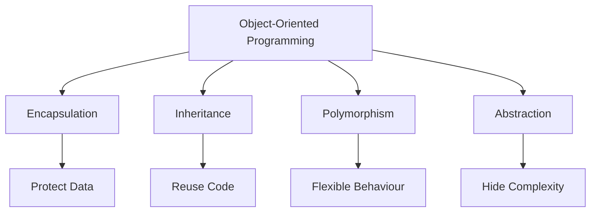
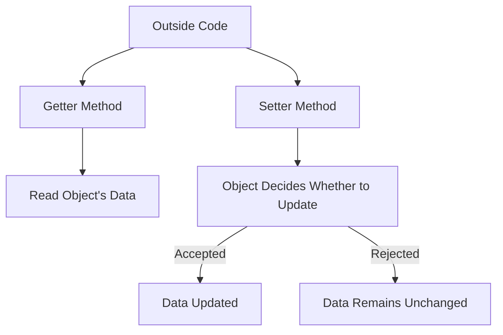

# Introducing the Four Pillars of OOP

So far, we've learned how to create classes, build objects, store data, and define methods. Our `User` class can already represent a real-world user by storing information and performing actions.

```python
user1 = User("Rahul", 520, 18)

user1.add_post()
user1.show_profile()
```

```text
Rahul has 520 followers and 19 posts.
```

At this stage, it might feel like we've learned everything needed to build classes.

We can create objects.

We can store data.

We can write methods.

So... is this Object-Oriented Programming?

**Not yet.**

Creating classes is only the first step. The real strength of OOP comes from designing classes that are easy to understand, easy to maintain, and safe to use.

Imagine building an application for just five users. Even if the class isn't designed very well, the program will probably still work.

Now imagine the same application growing to millions of users, hundreds of developers, and thousands of features.

Poor class design starts creating problems.

- Important data gets modified accidentally.
- Code gets duplicated.
- Small changes break existing features.
- Maintaining the application becomes difficult.

To solve these problems, Object-Oriented Programming is built around four design principles known as the **Four Pillars of OOP**.


```mermaid
flowchart TD
    A["Object-Oriented Programming"] --> B["Encapsulation"]
    A --> C["Inheritance"]
    A --> D["Polymorphism"]
    A --> E["Abstraction"]

    B --> F["Protect Data"]
    C --> G["Reuse Code"]
    D --> H["Flexible Behaviour"]
    E --> I["Hide Complexity"]
```

Each pillar solves a different design problem.

| Pillar | Purpose |
|---------|---------|
| **Encapsulation** | Protect an object's data by controlling access to it. |
| **Inheritance** | Reuse existing code by building new classes from existing ones. |
| **Polymorphism** | Allow the same operation to behave differently for different objects. |
| **Abstraction** | Hide unnecessary implementation details and expose only what users need. |

Together, these four principles make software more reliable, reusable, and easier to maintain.

In this chapter, we'll learn the first pillar—**Encapsulation**.

---

# Why Do We Need Encapsulation?

Before learning what encapsulation is, let's first understand **why it exists**.

Consider this simple `User` class.

```python
class User:
    def __init__(self, username, password):
        self.username = username
        self.password = password
```

Creating an object works exactly as expected.

```python
user1 = User("Rahul", "secure123")
```

Now imagine a completely different piece of code — maybe written by
another developer, months later, somewhere else in the same
application — runs this one line:

```python
user1.password = "123"
```

Python immediately updates the password.

There is no error because `password` is a **public attribute**.

Since any part of the program can modify it directly, the object has **no control** over one of its most important pieces of data.

This is the problem.

An object should not allow outside code to freely modify important information. Instead, it should decide **how** and **when** that information can change.

This idea is called **encapsulation**.

---

# What is Encapsulation?

**Encapsulation** is the practice of keeping an object's data under its own control by controlling how that data is accessed and modified.

The most important word in this definition is **control**.

Instead of allowing outside code to directly modify important data, the object decides how its own data should be accessed or updated.

Think about your bank account.

You cannot directly write:

```text
Balance = $1,000,000
```

Every balance update must happen through operations such as **Deposit**, **Withdraw**, or **Transfer**. The bank controls every change before updating the balance.

Objects should behave the same way.

Instead of allowing outside code to directly change important data, the object should control how its own data is accessed and modified.

> **Encapsulation means an object protects its own data by keeping control over it.**

---

# How Does Python Support Encapsulation?

Now that we understand the idea of encapsulation, let's see how Python helps us implement it.

Python provides three levels of attribute access.

1. Public attributes
2. Protected attributes
3. Private attributes

Each level offers a different amount of protection, but it's important to remember one thing.

**None of them alone provide complete encapsulation.**

Their purpose is to help us communicate how an attribute is intended to be used.

Let's look at each one.

---

# Public Attributes

By default, every attribute in Python is **public**.

A public attribute can be accessed and modified directly from outside the class.

```python
class User:

    def __init__(self, username):
        self.username = username
```

From outside the class, this attribute can be read and changed
directly, with no restriction at all:

```python
user1.username = "Amit"

print(user1.username)
```

```text
Amit
```

Since `username` is public, any part of the program can read or modify it.

This is perfectly acceptable for data that doesn't require protection.

However, some information—such as passwords, account balances, or PINs—should not be freely modified from outside the object.

For such cases, Python provides naming conventions that indicate an attribute is intended for internal use.

---

# Protected Attributes

A **protected attribute** begins with a single underscore (`_`).

```python
self._password
```

The underscore is a message to other programmers:

> "This attribute is meant for internal use. Avoid accessing it directly."

For example, here's the same `User` class, but with `password` renamed
to `_password` to signal that it's meant for internal use only:

```python
class User:

    def __init__(self, username, password):
        self.username = username
        self._password = password
```

Can it still be accessed from outside the class?

Yes.

```python
print(user1._password)

user1._password = "123456"
```

Both statements work successfully.

Why?

Because a protected attribute is only a **naming convention**.

Python does not enforce it.

Instead, Python trusts programmers to respect the convention.

So a protected attribute:

- communicates that the attribute is intended for internal use,
- discourages direct access,
- but **does not prevent** direct access.

Since outside code can still modify the attribute, a protected attribute alone does not provide encapsulation.

Can Python make direct access even more difficult?

Yes.

That's where **private attributes** come in.

---

# Private Attributes

A **private attribute** begins with two leading underscores (`__`).

```python
self.__password
```

Unlike protected attributes, Python performs an additional step called **name mangling**.

> **Name mangling** is Python automatically renaming a double-underscore
> attribute behind the scenes, by adding `_ClassName` in front of it.
> `self.__password`, written inside the `User` class, is actually
> stored as `self._User__password`. You never type that longer name
> yourself — Python does the renaming for you, silently, the moment
> the attribute is created.

Because of this, trying to access it by its original name,
`__password`, produces an error.

```python
print(user1.__password)
```

```text
AttributeError
```

At first glance, this looks like complete protection.

But it isn't.

The attribute still exists under its internally generated name, so someone who knows that name can still access it.

Private attributes are therefore designed to:

- reduce accidental access,
- avoid naming conflicts,
- clearly indicate that an attribute belongs to the class's internal implementation.

They are **not** intended to provide absolute security.

This raises an important question.

If public attributes are completely open, protected attributes are only conventions, and private attributes can still be accessed indirectly...

**What actually gives an object control over its own data?**

The answer lies in the next concept: **controlled access through methods**, where the object—not outside code—decides how its data can be read or modified.

# Controlled Access Through Methods

Instead of letting outside code touch an attribute directly, the
object hands out a **method** — an ordinary function defined inside
the class — and outside code calls that method instead of assigning
to the attribute itself.

```python
class User:
    def __init__(self, username, password):
        self.__password = password

    def change_password(self, new_password):
        self.__password = new_password
```

```python
user1 = User("Rahul", "secure123")
user1.change_password("newSecurePass1")
```

Notice what outside code does **not** do here: it never writes
`user1.__password = "newSecurePass1"` — and because `__password` is
private, that wouldn't even reach the real attribute anyway. Instead,
it calls `change_password(...)` and hands over the new value. The
object itself — inside its own method — is the one that actually
runs `self.__password = new_password`. Outside code asks; the object
decides.

This is the core idea behind encapsulation. The object remains in
control because every change goes through one of its own methods,
never straight into the attribute.

---

# Reading Data Using Getter Methods

Sometimes outside code only needs to **read** a value without changing it.

Instead of exposing the attribute directly, the object can provide a method that returns the value.

Such a method is commonly called a **getter**.

Let's modify our `User` class.

```python
class User:

    def __init__(self, username, password):
        self.__username = username
        self.__password = password

    def get_password(self):
        return self.__password
```

Now create an object.

```python
user1 = User("Rahul", "secure123")
```

To read the password, we call the getter.

```python
print(user1.get_password())
```

```text
secure123
```

Notice what happened.

Outside code never accessed `__password` directly.

Instead, it requested the value through the object's method.

The object decided how that value should be provided.

This keeps the object in control of its own data.

---

# Writing Data Using Setter Methods

Reading data is only one part of encapsulation.

Sometimes we also need to **update** an attribute.

Instead of allowing direct modification, the object provides another method responsible for changing the value.

This method is called a **setter**.

```python
class User:

    def __init__(self, username, password):
        self.__username = username
        self.__password = password

    def get_password(self):
        return self.__password

    def set_password(self, new_password):
        self.__password = new_password
```

Suppose the user now wants to change their password to a new one.

Instead of writing

```python
user1.__password = "newpass123"
```

we use the setter.

```python
user1.set_password("newpass123")
```

The object performs the update itself.

Outside code never modifies the attribute directly.

Instead, it asks the object to perform the change.

---

# Why Are Setter Methods Useful?

At first glance, a setter might seem unnecessary.

Instead of writing

```python
user1.password = "newpass123"
```

we're now writing

```python
user1.set_password("newpass123")
```

Both change the password.

So what did we actually gain?

We gained **control**.

Since every update goes through the setter, the object can decide whether the new value should be accepted.

For example, suppose every password must contain at least eight characters.

We can enforce that rule inside the setter.

```python
class User:

    def __init__(self, username, password):
        self.__username = username
        self.__password = password

    def set_password(self, new_password):

        if len(new_password) < 8:
            print("Password must contain at least 8 characters.")
            return

        self.__password = new_password
```

Let's test that rule with two different passwords — one that breaks
it, and one that doesn't.

```python
user1.set_password("123")
```

```text
Password must contain at least 8 characters.
```

The password remains unchanged.

Now try again.

```python
user1.set_password("newpass123")
```

This time the object accepts the value because it satisfies the rule.

The important point isn't the password rule itself.

The important point is that **the object decides whether its own data should change.**

That is the real purpose of encapsulation.

---

# Getters and Setters Work Together

A getter controls **how data is read**.

A setter controls **how data is modified**.

Together they ensure that important data is accessed through the object's own methods instead of being modified directly.


```mermaid
flowchart TD

A["Outside Code"]

A --> B["Getter Method"]
A --> C["Setter Method"]

B --> D["Read Object's Data"]

C --> E["Object Decides Whether to Update"]

E -->|Accepted| F["Data Updated"]

E -->|Rejected| G["Data Remains Unchanged"]
```

Notice something important.

The object never loses control over its own state.

Every read and every update passes through methods defined by the object itself.

---

# Putting Everything Together

Let's build a complete example.

```python
class User:

    def __init__(self, username, password):
        self.username = username
        self.__password = password

    def get_password(self):
        return self.__password

    def set_password(self, new_password):

        if len(new_password) < 8:
            print("Password must contain at least 8 characters.")
            return

        self.__password = new_password
```

Create an object.

```python
user1 = User("Rahul", "secure123")
```

Read the password.

```python
print(user1.get_password())
```

```text
secure123
```

Try an invalid password.

```python
user1.set_password("123")
```

```text
Password must contain at least 8 characters.
```

Now update it with a valid password.

```python
user1.set_password("newpass123")
```

Read the password again.

```python
print(user1.get_password())
```

```text
newpass123
```

The object controlled every interaction with its password.

Outside code never modified the attribute directly.

---

# Attribute Access Comparison

| Attribute Type | Can Outside Code Read It? | Can Outside Code Modify It? | Purpose |
|----------------|---------------------------|-----------------------------|---------|
| **Public** | Yes | Yes | Data intended for unrestricted access |
| **Protected (`_`)** | Yes | Yes | Indicates the attribute is for internal use |
| **Private (`__`)** | Not directly | Not directly | Reduces accidental access using name mangling |
| **Getter Method** | Yes | No | Provides controlled read access |
| **Setter Method** | No | Yes | Provides controlled write access |

---

# Key Takeaways

- Encapsulation is about **control**, not simply hiding data.
- Public attributes are freely accessible.
- Protected attributes are a naming convention for internal use.
- Private attributes make direct access more difficult through name mangling.
- Private attributes alone do not fully implement encapsulation.
- Getter methods provide controlled access for reading data.
- Setter methods provide controlled access for modifying data.
- Since every update passes through the object's methods, the object stays in control of its own state.

---

# Chapter Summary

Throughout this chapter, we focused on one central idea:

> **An object should protect its own data by keeping control over it.**

We first saw the problem with public attributes, where outside code could modify important data directly. We then explored protected and private attributes and learned that they help communicate intent and reduce accidental access, but they do not completely solve the problem.

Finally, we introduced getter and setter methods. By making every read and every update pass through the object's own methods, the object decides how its data is accessed and modified.

This is the essence of encapsulation.

In the next chapter, we'll explore the second pillar of Object-Oriented Programming—**Inheritance**, where one class can build upon another to reuse code and model real-world relationships.
