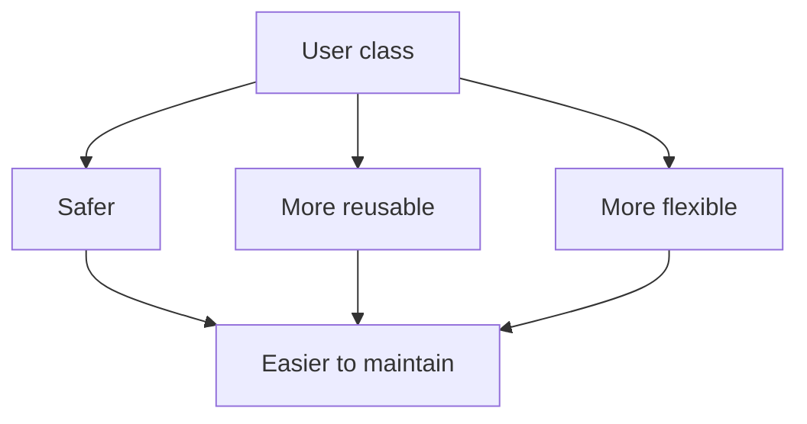
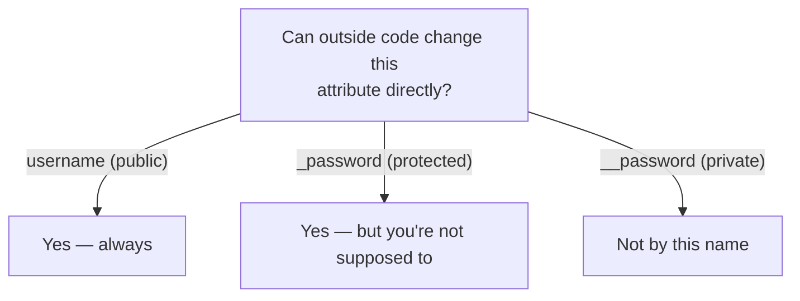

# Introducing the Four Pillars of OOP

So far, we've learned how to build classes and create objects. Our
`User` class can already store data, perform actions, and create as
many users as we need:

``` python
user1 = User("Rahul", 520, 18)

user1.add_post()
user1.show_profile()
```

``` text
Rahul has 520 followers and 19 posts
```

At first glance, this looks like everything we need. We can create
objects. We can store information. We can write methods.

So... have we finished learning OOP?

Not quite.

Creating classes is only the beginning. The real challenge is
designing classes that stay **secure**, **reusable**, **flexible**,
and **easy to maintain** — even as an application grows from a
handful of objects to millions.

Professional developers don't just write classes. They design them,
using a small set of proven principles known as the **Four Pillars of
Object-Oriented Programming**. Each pillar strengthens a class in a
different way:


```mermaid
flowchart TD
    A["User class"] --> B["Safer"]
    A --> C["More reusable"]
    A --> D["More flexible"]
    B --> E["Easier to maintain"]
    C --> E
    D --> E
```

In this module, we'll cover the first two pillars:

- **Encapsulation** — protecting an object's data and controlling how
  it's accessed.
- **Inheritance** — reusing existing classes instead of rewriting code.

Later, we'll come back for the remaining two:

- **Polymorphism** — letting the same operation behave differently
  for different objects.
- **Abstraction** — hiding unnecessary complexity and exposing only
  what's needed.

Let's begin with the first pillar: encapsulation.

------------------------------------------------------------------------

# Pillar I - Encapsulation

**Encapsulation** means keeping an object's data safe by controlling
exactly how it can be read or changed — instead of leaving every
attribute open for any part of a program to modify directly, with no
rules at all.

Right now, our `User` class has no such control. Even something as
sensitive as a password can be overwritten by any code, anywhere,
with no checks whatsoever:

``` python
class User:
    def __init__(self, username, password):
        self.username = username
        self.password = password

user1 = User("Rahul", "12345")
user1.password = "letmein"
print(user1.password)
```

``` text
letmein
```

This runs without a single error. `self.password` is a fully open
attribute, so the line executes exactly as written — even though a
real application would never accept a password change with no
minimum length, no confirmation, and no check of any kind.

Encapsulation exists to close exactly that gap. It has two parts,
and this unit builds them in order:

1. **Signal what's internal** — mark an attribute as "don't touch
   this directly," using a naming convention.
2. **Enforce a real rule** — check a value *before* it's ever stored,
   through a controlled point of access.

The first part is only a hint. The second part is where real
protection actually lives — the difference will be clear once you
see both side by side.

> **💡 Interesting Fact**
>
> Every login system that rejects a weak password, or refuses to
> store one in plain text, is enforcing a rule exactly like this —
> inside the class itself, not somewhere else in the program.

------------------------------------------------------------------------

# Protecting Data with Naming Conventions

### Protected Attributes

A single leading underscore — writing `_password` instead of
`password` — marks an attribute as **protected**: a signal to other
programmers that it's meant for internal use only, and shouldn't be
touched directly from outside the class.

``` python
class User:
    def __init__(self, username, password):
        self.username = username
        self._password = password

user1 = User("Rahul", "12345")
print(user1._password)

user1._password = "hacked"
print(user1._password)
```

``` text
12345
hacked
```

Notice that both lines ran without any error. That's the key point:
the underscore is only a naming convention — it changes nothing about
what Python actually allows. `user1._password` is still fully
readable and writable from outside the class, exactly as before.
Python trusts you to respect the signal; it never enforces it.

> **💡 Rule of thumb:** `_name` means "internal — please don't
> touch," not "impossible to touch."

### Private Attributes (Double Underscore)

A double leading underscore — `__password` — goes one step further.
Python actually renames the attribute behind the scenes, in a process
called **name mangling**.

``` python
class User:
    def __init__(self, username, password):
        self.username = username
        self.__password = password

user1 = User("Rahul", "12345")
print(user1.__password)
```

``` text
AttributeError: 'User' object has no attribute '__password'
```

This time, accessing it directly genuinely fails. Python secretly
stores the attribute as `_User__password` — prefixed with the class
name — so the exact name you typed, `__password`, doesn't exist from
outside the class at all.

But this still isn't real protection. Anyone who knows the renaming
rule can reach the same attribute through its mangled name:

``` python
print(user1._User__password)

user1._User__password = "hacked"
print(user1._User__password)
```

``` text
12345
hacked
```

Name mangling exists mainly to stop two unrelated classes from
accidentally colliding over the same attribute name — not to lock
data away. Like the single underscore, it's a naming convention with
a small technical side effect, not real enforcement.


```mermaid
flowchart TD
    Q["Can outside code change this\nattribute directly?"]
    Q -->|"username (public)"| A["Yes — always"]
    Q -->|"_password (protected)"| B["Yes — but you're not supposed to"]
    Q -->|"__password (private)"| C["Not by this name"]
```

Neither underscore stops a bad value from being stored. Real
enforcement requires something different: a controlled point of
access — a method — that actually checks a value before saving it.

------------------------------------------------------------------------

# Putting It All Together: A Complete Encapsulation Example

Here's a complete `User` class that actually protects its password —
keeping the real data hidden, and checking every change before it's
accepted. It uses only what you already know: a private attribute,
and two ordinary methods.

``` python
class User:
    def __init__(self, username, password):
        self.username = username
        self.set_password(password)

    def get_password(self):
        return self._password

    def set_password(self, value):
        if len(value) < 8:
            raise ValueError("password must be at least 8 characters")
        self._password = value
```

``` python
user1 = User("Rahul", "securepass123")
print(user1.get_password())

user1.set_password("newpass456")
print(user1.get_password())

user1.set_password("1234")
```

``` text
securepass123
newpass456
ValueError: password must be at least 8 characters
```

Here's what's actually happening. `self._password` is the real data —
private, hidden behind the naming convention from the previous
section. The class gives you exactly two doors into it:
`get_password()`, which only reads it, and `set_password()`, which
checks a value before storing it.

Notice that `__init__` doesn't touch `self._password` directly
either — it calls `self.set_password(password)`, so even the very
first value goes through the same check. `"securepass123"` and
`"newpass456"` are each at least 8 characters, so they're accepted
and stored. `"1234"` is too short, so `set_password` rejects it
outright — the assignment never reaches `self._password` at all.

This is what finished encapsulation looks like: the real data is only
ever touched from inside the two methods built specifically to
control it — never directly by outside code.

> **💡 Looking ahead**
>
> Later, you'll meet a decorator called `@property` that lets you
> write `user1.password = "..."` instead of
> `user1.set_password("...")` — the same protection, with plainer
> syntax. The idea you just learned here — hide the data, control it
> through methods — is exactly what that shortcut is built on.

------------------------------------------------------------------------

## Public vs. Protected vs. Private

| | Public | Protected (`_name`) | Private (`__name`) |
|---|---|---|---|
| Written as | `self.name` | `self._name` | `self.__name` |
| Accessible from outside? | Yes, freely | Yes — discouraged, not blocked | Not by its original name — renamed |
| Enforced by Python? | No | No — convention only | Partially — via name mangling |
| Real validation? | None | None | None |

Naming conventions only ever signal intent. Getter and setter methods
are what actually enforce a rule. Hiding data behind a naming
convention, while validating every change through methods, is what
encapsulation means in practice.

------------------------------------------------------------------------

## Reference Links

-   [Python Official Docs — Private Variables and Name Mangling](https://docs.python.org/3/tutorial/classes.html#private-variables)
-   [Python Official Docs — Classes (Tutorial)](https://docs.python.org/3/tutorial/classes.html)
-   [W3Schools — Python Classes and Objects](https://www.w3schools.com/python/python_classes.asp)
