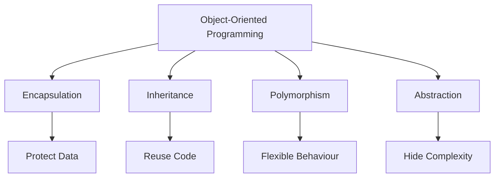

# Introducing the Four Pillars of OOP

So far, we've learned how to create classes, build objects, store data, and define methods. Our `User` class can already represent a real-world user by storing information and performing actions.

```python
user1 = User("Rahul", 520, 18)

user1.add_post()
user1.show_profile()
```

```text
Rahul has 520 followers and 19 posts.
```

At this stage, it might feel like we've learned everything needed to build classes.

We can create objects.

We can store data.

We can write methods.

So... is this Object-Oriented Programming?

**Not yet.**

Creating classes is only the first step. The real strength of OOP comes from designing classes that are easy to understand, easy to maintain, and safe to use.

Imagine building an application for just five users. Even if the class isn't designed very well, the program will probably still work.

Now imagine the same application growing to millions of users, hundreds of developers, and thousands of features.

Poor class design starts creating problems.

- Important data gets modified accidentally.
- Code gets duplicated.
- Small changes break existing features.
- Maintaining the application becomes difficult.

To solve these problems, Object-Oriented Programming is built around four design principles known as the **Four Pillars of OOP**.


```mermaid
flowchart TD
    A["Object-Oriented Programming"] --> B["Encapsulation"]
    A --> C["Inheritance"]
    A --> D["Polymorphism"]
    A --> E["Abstraction"]

    B --> F["Protect Data"]
    C --> G["Reuse Code"]
    D --> H["Flexible Behaviour"]
    E --> I["Hide Complexity"]
```

Each pillar solves a different design problem.

| Pillar | Purpose |
|---------|---------|
| **Encapsulation** | Protect an object's data by controlling access to it. |
| **Inheritance** | Reuse existing code by building new classes from existing ones. |
| **Polymorphism** | Allow the same operation to behave differently for different objects. |
| **Abstraction** | Hide unnecessary implementation details and expose only what users need. |

Together, these four principles make software more reliable, reusable, and easier to maintain.

In the next chapter, we'll explore the first pillar—**Encapsulation**.

---

## Reference Links

-   [Python Official Docs — Classes](https://docs.python.org/3/tutorial/classes.html)
-   [Python Official Docs Glossary — Object-Oriented Programming](https://docs.python.org/3/glossary.html#term-object)
-   [W3Schools — Python Classes and Objects](https://www.w3schools.com/python/python_classes.asp)
