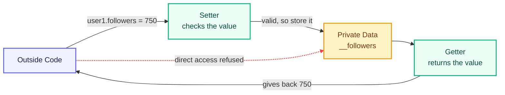

# Encapsulation: Controlling Access to Data

The previous chapter introduced encapsulation as the pillar that protects an object's data. Before learning how that protection works, we need to see what goes wrong without it.

## The Problem with Unprotected Data

Here is the `User` class in its simplest form.

```python
class User:
    def __init__(self, name, followers):
        self.name = name
        self.followers = followers

    def show_profile(self):
        print(f"{self.name} has {self.followers} followers.")


user1 = User("Rahul", 520)
user1.show_profile()

user1.followers = -900
user1.show_profile()
```

```text
Rahul has 520 followers.
Rahul has -900 followers.
```

Look at the second output line. The line `user1.followers = -900` was accepted without any resistance. Nobody can have negative followers, yet the class allowed it.

The class stored the data but never guarded it. Any line of code, anywhere in the program, can reach in and set `followers` to a negative number, a piece of text, or a fake count of one crore.

This creates three problems:

- The class has no control over its own data.
- Invalid values enter silently, without any error message.
- The program crashes later, far away from the line that actually caused the damage.

The fix is to stop treating `followers` as an open box. The class itself should decide who may change the value and which values are acceptable.

That idea is encapsulation.

## Encapsulation

Encapsulation is the practice of bundling data and the methods that operate on that data into a single unit, and restricting direct access to that data from outside the unit.

Both halves of the definition are compulsory.

1. **Bundling** — the data and the methods that work on it stay inside the same class.
2. **Restricting access** — outside code cannot touch the data directly. It must go through the methods the class provides. This second half is also called **data hiding**.

Instagram already works this way. You cannot type your own follower count. The number rises only when somebody actually follows you, because the app owns that number and updates it through its own rules. The follower count is the data. Following and unfollowing are the methods.

The diagram below shows the shape of that arrangement. Each part in it is built up, piece by piece, through the rest of this chapter.



The getter and the setter act as a gate. Every value that enters or leaves the data must pass through it.

## Access Levels in Python

Other languages use keywords called **access modifiers** — `private`, `protected`, `public` — to control access. Python has no such keywords. It decides how accessible a member is from the underscores at the **start of its name**.

> A **member** is anything that belongs to a class — an attribute or a method.

| Access level | Naming style | Reachable from | Enforced by |
|---|---|---|---|
| **Public** | `followers` | Anywhere in the program | Nothing — fully open |
| **Protected** | `_followers` | Inside the class and its child classes | Convention only |
| **Private** | `__followers` | Inside the class only | Python, by renaming the member |

### Public Members

A member with no leading underscore is public. It can be read and changed from anywhere. This is what we used in the first example, and it is why `-900` slipped through.

Public members are the correct choice for data that has no rules attached to it, such as a user's name.

### Protected Members

A member with a **single leading underscore** is protected. It is a message to other programmers: *this belongs to the class, do not touch it from outside.*

```python
class User:
    def __init__(self, name, followers):
        self.name = name
        self._followers = followers

    def show_profile(self):
        print(f"{self.name} has {self._followers} followers.")


user1 = User("Rahul", 520)
user1.show_profile()

print(user1._followers)
```

```text
Rahul has 520 followers.
520
```

The last line worked. Python did not stop it. A single underscore is a warning sign, not a lock — like a *Staff Only* board on a door that has no lock.

Protected members exist mainly for inheritance, where a child class needs to use the parent's internal data. That is covered in the next chapter.

### Private Members

A member with **two leading underscores** is private. Python actively renames it so that outside code cannot reach it by its original name.

```python
class User:
    def __init__(self, name, followers):
        self.name = name
        self.__followers = followers

    def show_profile(self):
        print(f"{self.name} has {self.__followers} followers.")


user1 = User("Rahul", 520)
user1.show_profile()

print(user1.__followers)
```

```text
Rahul has 520 followers.
Traceback (most recent call last):
  File "user.py", line 13, in <module>
    print(user1.__followers)
          ^^^^^^^^^^^^^^^^^
AttributeError: 'User' object has no attribute '__followers'. Did you mean: '_User__followers'?
```

Two facts stand out.

- `show_profile()` read `self.__followers` without any trouble, because it is **inside** the class.
- The line outside the class failed with an `AttributeError`.

Python's error message also leaked the reason. When a class contains an attribute beginning with two underscores, Python quietly renames it to `_ClassName__attributeName`. So `__followers` inside class `User` is actually stored as `_User__followers`, and the original name no longer exists outside the class.

The renamed version is still reachable by someone who writes `user1._User__followers`. Private in Python therefore means *strongly discouraged*, not *impossible* — and since nobody types that name by accident, this is exactly the protection Python aims for.

Methods follow the same rule. A method named `__reset_stats()` written inside `User` can be called only from inside the class, which keeps internal steps out of reach of outside code.

With the data now sealed inside the class, the class must supply a controlled way to read and update it.

## Controlled Access with Getter and Setter Methods

The class provides two methods for every piece of private data:

- A **getter**, also called an *accessor*, returns the value.
- A **setter**, also called a *mutator*, checks a new value and updates the data only if the value is acceptable.

```python
class User:
    def __init__(self, name, followers):
        self.name = name
        self.__followers = followers

    def get_followers(self):
        return self.__followers

    def set_followers(self, count):
        if count < 0:
            print(f"Rejected: {count} is not a valid follower count.")
        else:
            self.__followers = count


user1 = User("Rahul", 520)
print(user1.get_followers())

user1.set_followers(-900)
print(user1.get_followers())

user1.set_followers(750)
print(user1.get_followers())
```

```text
520
Rejected: -900 is not a valid follower count.
520
750
```

This is the moment the problem from the start of the chapter is solved. The invalid value `-900` was refused and the data stayed at `520`. The valid value `750` was accepted.

The single `if` condition inside `set_followers()` is where encapsulation earns its value. Because every update must pass through this one method, the rule is written once and can never be skipped.

> In real projects a rejected value is usually reported by raising an error instead of printing a message. Errors are covered in a later chapter; printing keeps the output visible for now.

The design works, but the calling code has become clumsy. `user1.set_followers(750)` is longer and less natural than `user1.followers = 750`. Python offers a way to keep the simple syntax and the validation together.

## The @property Decorator

The `@property` decorator lets a method be used as if it were an attribute.

The `@` symbol marks a **decorator** — a line written directly above a method that changes how that method behaves. Decorators as a general topic come later; `@property` is the only one needed here.

- `@property` marks the getter.
- `@<name>.setter` marks the setter.

Both methods must carry the same name, and that shared name becomes the attribute name used by outside code.

```python
class User:
    def __init__(self, name, followers):
        self.name = name
        self.__followers = 0
        self.followers = followers

    @property
    def followers(self):
        return self.__followers

    @followers.setter
    def followers(self, count):
        if count < 0:
            print(f"Rejected: {count} is not a valid follower count.")
        else:
            self.__followers = count

    def show_profile(self):
        print(f"{self.name} has {self.__followers} followers.")


user1 = User("Rahul", 520)
user1.show_profile()

user1.followers = -900
user1.show_profile()

user1.followers = 750
user1.show_profile()

user2 = User("Priya", -50)
user2.show_profile()
```

```text
Rahul has 520 followers.
Rejected: -900 is not a valid follower count.
Rahul has 520 followers.
Rahul has 750 followers.
Rejected: -50 is not a valid follower count.
Priya has 0 followers.
```

The third output line is the proof. After `-900` was rejected, the follower count was still `520` — the invalid value never reached the data.

Read the calling code again. It looks exactly like the unprotected version from the beginning of the chapter — plain `user1.followers = 750`. Yet every assignment is now inspected before it is stored. The class gained full control without forcing the calling code to change.

Two lines inside `__init__` deserve attention.

- `self.__followers = 0` sets a safe starting value, so the attribute always exists even if the given value is rejected.
- `self.followers = followers` uses the property name, not the private name. The assignment therefore travels through the setter and gets validated.

The last two lines of output prove this. `User("Priya", -50)` was created with an invalid count, the setter refused it, and Priya's followers stayed at the safe value `0`.

### Read-Only Attributes

Some values must never change after an object is created — a username, a roll number, an account number. Writing a getter with **no matching setter** makes the attribute read-only.

```python
class User:
    def __init__(self, username):
        self.__username = username

    @property
    def username(self):
        return self.__username


user1 = User("rahul_07")
print(user1.username)

user1.username = "rahul_08"
```

```text
rahul_07
Traceback (most recent call last):
  File "user.py", line 13, in <module>
    user1.username = "rahul_08"
    ^^^^^^^^^^^^^^
AttributeError: property 'username' of 'User' object has no setter
```

Reading worked. Writing was refused. This is the cleanest way to declare a value permanent.

## Benefits of Encapsulation

- **Valid data at all times.** Rules live inside the class, so no caller can bypass them.
- **Freedom to change the internals.** Store followers in a different format tomorrow, and only the property has to change. Every line that uses `user1.followers` keeps working.
- **One place to fix bugs.** A wrong follower count must have passed through the setter, so there is only one method to inspect.
- **A clear public surface.** Other programmers see the few names they are meant to use and ignore the rest.

## Complete Program: The Encapsulated User Class

The following program brings the whole chapter together in the class we have been building all along. It holds a public attribute, private data, validated writing, and two read-only values.

```python
class User:
    def __init__(self, username, name, followers):
        self.__username = username
        self.name = name
        self.__followers = 0
        self.followers = followers
        self.__posts = 0

    @property
    def username(self):
        return self.__username

    @property
    def followers(self):
        return self.__followers

    @followers.setter
    def followers(self, count):
        if count < 0:
            print(f"Rejected: {count} is not a valid follower count.")
        else:
            self.__followers = count

    @property
    def posts(self):
        return self.__posts

    def add_post(self):
        self.__posts += 1
        print(f"Post uploaded. Total posts: {self.__posts}")

    def show_profile(self):
        print(f"@{self.__username} ({self.name}) | Followers: {self.__followers} | Posts: {self.__posts}")


user1 = User("rahul_07", "Rahul", 520)
user1.show_profile()

# Getting values
print(user1.username)
print(user1.followers)

# Setting values
user1.name = "Rahul Kumar"
user1.followers = 750
user1.add_post()
user1.show_profile()

# The setter refuses an invalid value
user1.followers = -900
user1.show_profile()

# Without the read-only properties, the two lines below would silently
# work and corrupt the profile. With them, each one is refused:
# user1.username = "rahul_08"   -> AttributeError: property 'username' of 'User' object has no setter
# user1.posts = 100             -> AttributeError: property 'posts' of 'User' object has no setter
```

```text
@rahul_07 (Rahul) | Followers: 520 | Posts: 0
rahul_07
520
Post uploaded. Total posts: 1
@rahul_07 (Rahul Kumar) | Followers: 750 | Posts: 1
Rejected: -900 is not a valid follower count.
@rahul_07 (Rahul Kumar) | Followers: 750 | Posts: 1
```

Every part of the class is now doing a specific job:

- `name` is public, because a display name carries no rules. `user1.name = "Rahul Kumar"` is allowed and needs no checking.
- `followers` is readable and writable, but every write passes through the setter. `-900` was refused and the count stayed at `750`.
- `username` is readable only. A handle is fixed at the moment the account is created.
- `posts` is readable only. The count changes through `add_post()`, so it can never be faked from outside.

The two commented lines at the end mark the difference encapsulation makes. Remove the read-only properties and those lines would quietly succeed. Keep them, and the class refuses both.

## Key Takeaways

- Encapsulation bundles data with its methods and blocks direct access to that data from outside.
- Access is marked by leading underscores: `name` is public, `_name` is protected by convention, `__name` is private because Python renames it.
- A getter reads private data; a setter validates a new value before storing it.
- `@property` and `@<name>.setter` give validated access while keeping ordinary attribute syntax.
- A getter with no setter creates a read-only attribute.
- Protect only the data that carries rules. Values with no rules, such as a name, can stay public.
- Encapsulation's real value is that a rule written once inside the class can never be skipped by any caller.

## Practice Exercises

Build one `Channel` class for a video platform, one step at a time. Each task adds to the class from the previous task.

1. **Hide the data.** Create `Channel` with a public `name` and a private `__subscribers`, both set in `__init__`. Add a `subscribers` property that returns the private value. Create an object and print `channel.name` and `channel.subscribers`.

2. **Guard the writing.** Add a setter for `subscribers` that refuses any value below `0` and prints a rejection message. Try `channel.subscribers = -50`, then `channel.subscribers = 1200`, printing the value after each attempt.

3. **Change data only from inside.** Add a private `__videos` starting at `0`, give it a read-only `videos` property, and write an `upload()` method that increases the count by one and prints a confirmation. Call `upload()` three times and print `channel.videos`.

4. **Make the handle permanent.** Add a `__handle` set in `__init__` with a getter and no setter. Add a `show_channel()` method that prints the handle, name, subscriber count, and video count on one line. At the end of your file, write the line that would try to change the handle from outside as a comment, along with the error it would cause.

---

Encapsulation answered the question of how one class guards its own data. The next pillar answers a different question: when two classes share most of their behaviour, how do we avoid writing that behaviour twice?

The next chapter covers the second pillar — **Inheritance**.

---

## Reference Links

- [Python Official Docs — Classes](https://docs.python.org/3/tutorial/classes.html)
- [Python Official Docs — Private Variables and Name Mangling](https://docs.python.org/3/tutorial/classes.html#private-variables)
- [Python Official Docs — `property`](https://docs.python.org/3/library/functions.html#property)
- [W3Schools — Python Classes and Objects](https://www.w3schools.com/python/python_classes.asp)
