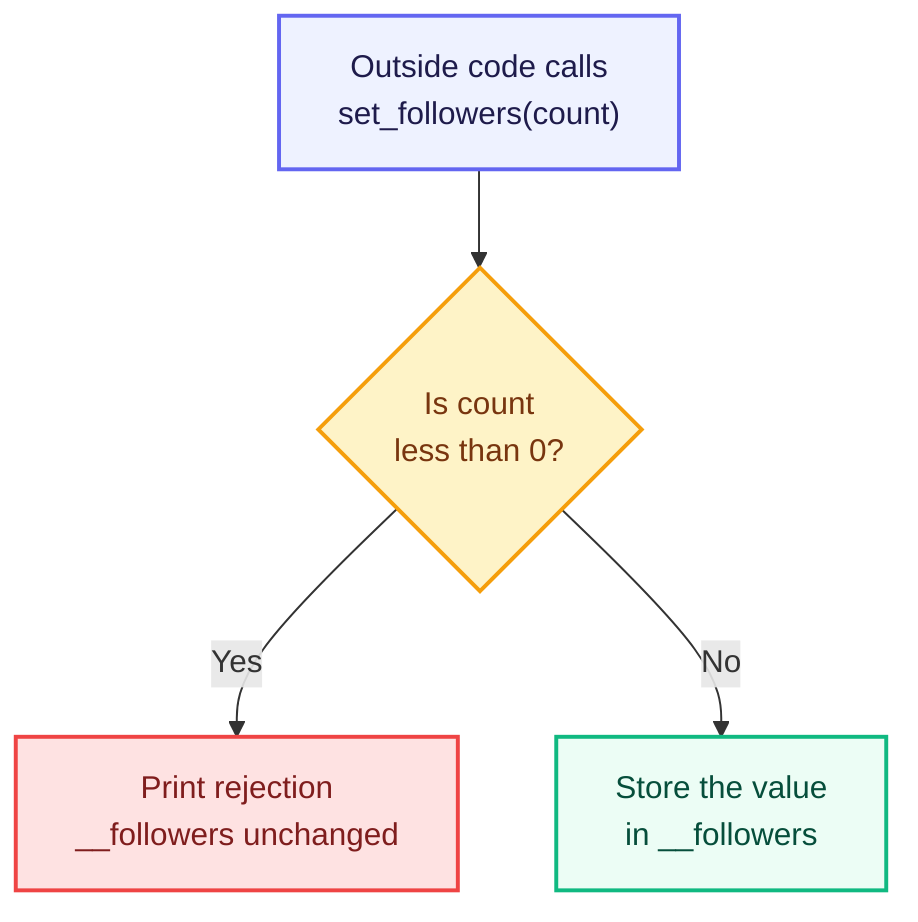

# Encapsulation: Controlling Access to Data

The previous chapter introduced encapsulation as the pillar that protects an object's data. Before learning how that protection works, we need to see what goes wrong without it.

## The Problem with Unprotected Data

Here is the `User` class in its simplest form.

```python
class User:
    def __init__(self, name, followers):
        self.name = name
        self.followers = followers

    def show_profile(self):
        print(f"{self.name} has {self.followers} followers.")


user1 = User("Rahul", 520)
user1.show_profile()

user1.followers = -900
user1.show_profile()
```

**Output**

```text
Rahul has 520 followers.
Rahul has -900 followers.
```

Look at the second output line. The line `user1.followers = -900` was accepted without any resistance. Nobody can have negative followers, yet the class allowed it.

The class stored the data but never guarded it. Any line of code, anywhere in the program, can reach in and set `followers` to a negative number, or to a fake count of one crore.

This creates three problems:

- The class has no control over its own data.
- Invalid values enter silently, without any error message.
- The program crashes later, far away from the line that actually caused the damage.

The fix is to stop treating `followers` as an open box. The class itself should decide who may change the value and which values are acceptable.

That idea is encapsulation.

## Encapsulation

Encapsulation is the practice of bundling data and the methods that operate on that data into a single unit, and restricting direct access to that data from outside the unit.

Both halves of the definition are compulsory.

1. **Bundling** — the data and the methods that work on it stay inside the same class.
2. **Restricting access** — outside code cannot touch the data directly. It must go through the methods the class provides. This second half is also called **data hiding**.

Instagram already works this way. You cannot type your own follower count. The number rises only when somebody actually follows you, because the app owns that number and updates it through its own rules. The follower count is the data. Following and unfollowing are the methods.

## Access Levels in Python

Other languages use keywords called **access modifiers** — `private`, `protected`, `public` — to control access. Python has no such keywords. It decides how accessible a member is from the underscores at the **start of its name**.

> A **member** is anything that belongs to a class — an attribute or a method.

| Access level | Naming style | Reachable from | Enforced by |
|---|---|---|---|
| **Public** | `followers` | Anywhere in the program | Nothing — fully open |
| **Protected** | `_followers` | Inside the class and its child classes | Convention only |
| **Private** | `__followers` | Inside the class only | Python, by renaming the member |

### Public Members

A member with no leading underscore is public. It can be read and changed from anywhere. This is what we used in the first example, and it is why `-900` slipped through.

Public members are the correct choice for data that has no rules attached to it, such as a user's name.

### Protected Members

A member with a **single leading underscore** is protected. It is a message to other programmers: *this belongs to the class, do not touch it from outside.*

```python
class User:
    def __init__(self, name, followers):
        self.name = name
        self._followers = followers

    def show_profile(self):
        print(f"{self.name} has {self._followers} followers.")


user1 = User("Rahul", 520)
user1.show_profile()

print(user1._followers)
```

**Output**

```text
Rahul has 520 followers.
520
```

The last line worked. Python did not stop it. A single underscore is a warning sign, not a lock — like a *Staff Only* board on a door that has no lock.

Protected members exist mainly for inheritance, where a child class needs to use the parent's internal data. That is covered in the next chapter.

### Private Members

A member with **two leading underscores** is private. Python actively renames it so that outside code cannot reach it by its original name.

```python
class User:
    def __init__(self, name, followers):
        self.name = name
        self.__followers = followers

    def show_profile(self):
        print(f"{self.name} has {self.__followers} followers.")


user1 = User("Rahul", 520)
user1.show_profile()

print(user1.__followers)
```

**Output**

```text
Rahul has 520 followers.
Traceback (most recent call last):
  File "user.py", line 13, in <module>
    print(user1.__followers)
          ^^^^^^^^^^^^^^^^^
AttributeError: 'User' object has no attribute '__followers'. Did you mean: '_User__followers'?
```

Two facts stand out.

- `show_profile()` read `self.__followers` without any trouble, because it is **inside** the class.
- The line outside the class failed with an `AttributeError`.

Python's error message also leaked the reason. When a class contains an attribute beginning with two underscores, Python quietly renames it to `_ClassName__attributeName`. So `__followers` inside class `User` is actually stored as `_User__followers`, and the original name no longer exists outside the class.

The renamed version is still reachable by someone who writes `user1._User__followers`. Private in Python therefore means *strongly discouraged*, not *impossible* — and since nobody types that name by accident, this is exactly the protection Python aims for.

Methods follow the same rule. A method named `__reset_stats()` written inside `User` can be called only from inside the class, which keeps internal steps out of reach of outside code.

With the data now sealed inside the class, the class must supply a controlled way to read and update it.

## Controlled Access with Getter and Setter Methods

The class provides two methods for every piece of private data:

- A **getter**, also called an *accessor*, returns the value.
- A **setter**, also called a *mutator*, checks a new value and updates the data only if the value is acceptable.

```python
class User:
    def __init__(self, name, followers):
        self.name = name
        self.__followers = 0
        self.set_followers(followers)

    def get_followers(self):
        return self.__followers

    def set_followers(self, count):
        if count < 0:
            print(f"Rejected: {count} is not a valid follower count.")
        else:
            self.__followers = count


user1 = User("Rahul", 520)
print(user1.get_followers())

user1.set_followers(-900)
print(user1.get_followers())

user1.set_followers(750)
print(user1.get_followers())

user2 = User("Priya", -50)
print(user2.get_followers())
```

**Output**

```text
520
Rejected: -900 is not a valid follower count.
520
750
Rejected: -50 is not a valid follower count.
0
```

This is the moment the problem from the start of the chapter is solved. The invalid value `-900` was refused and the count stayed at `520`. The valid value `750` was accepted.

The single `if` condition inside `set_followers()` is where encapsulation earns its value. Because every update must pass through this one method, the rule is written once and cannot be skipped.

That guarantee depends on two lines inside `__init__`.

- `self.__followers = 0` sets a safe starting value, so the attribute always exists even when the given value is refused.
- `self.set_followers(followers)` sends the starting value through the setter instead of storing it directly. Without this line, `User("Priya", -50)` would create an account with `-50` followers, skipping the rule at the moment the object is born.

The last two output lines prove it. Priya was created with an invalid count, the setter refused it, and her count stayed at the safe value `0`.

> In real projects a rejected value is usually reported by raising an error instead of printing a message. Errors are covered in a later chapter; printing keeps the output visible for now.

Every call to `set_followers()` follows the same path.



Nothing reaches `__followers` except through these two methods. That single fact is what encapsulation buys.

## Benefits of Encapsulation

- **Valid data at all times.** Rules live inside the class, so no caller can bypass them.
- **Freedom to change the internals.** Store the follower count in a different format tomorrow, and only the getter has to change. Every line that calls `user1.get_followers()` keeps working.
- **One place to fix bugs.** A wrong follower count must have passed through `set_followers()`, so there is only one method to inspect.
- **A clear public surface.** Other programmers see the few names they are meant to use and ignore the rest.

## Key Takeaways

- Encapsulation bundles data with its methods and blocks direct access to that data from outside.
- Access is marked by leading underscores: `name` is public, `_name` is protected by convention, `__name` is private because Python renames it.
- A getter returns private data. A setter checks a new value and stores it only if the value is acceptable.
- Both must be written inside the class, because only code inside the class can reach a private member.
- Protect only the data that carries rules. Values with no rules, such as a name, can stay public.
- Encapsulation's real value is that a rule written once inside the class can never be skipped by any caller.

## Practice Exercises

Build one `Channel` class for a video platform, one step at a time. Each task adds to the class you wrote in the task before it.

1. **Hide the data.** Create `Channel` with a public `name` and a private `__subscribers`, both set in `__init__`. Add a method `get_subscribers()` that returns the private value. Create an object, then print `channel.name` and `channel.get_subscribers()`.

2. **Prove the data is hidden.** In the same file, add a line that tries to print `channel.__subscribers` from outside the class. Run it, read the `AttributeError`, then turn that line into a comment so the rest of your file keeps running.

3. **Guard the writing.** Add `set_subscribers(count)` that refuses any value below `0` and prints a rejection message. Call it with `-50`, then with `1200`, printing `get_subscribers()` after each call to confirm which one changed the data.

4. **Change data only from inside.** Add a private `__videos` starting at `0`, a `get_videos()` method, and an `upload()` method that increases the count by one and prints a confirmation. Call `upload()` three times. Notice that no setter exists for `__videos`, so the count can rise only through `upload()`.

5. **Finish the class.** Add a `show_channel()` method that prints the name, subscriber count, and video count on one line. Then write a short comment above it listing which members are public and which are private, and why you chose each.

---

Encapsulation answered the question of how one class guards its own data. The next pillar answers a different question: when two classes share most of their behaviour, how do we avoid writing that behaviour twice?

The next chapter covers the second pillar — **Inheritance**.

---

## Reference Links

- [Python Official Docs — Classes](https://docs.python.org/3/tutorial/classes.html)
- [Python Official Docs — Private Variables and Name Mangling](https://docs.python.org/3/tutorial/classes.html#private-variables)
- [W3Schools — Python Classes and Objects](https://www.w3schools.com/python/python_classes.asp)
