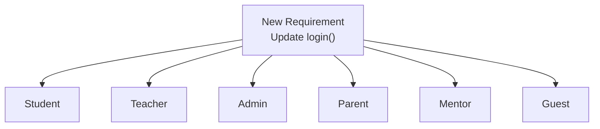
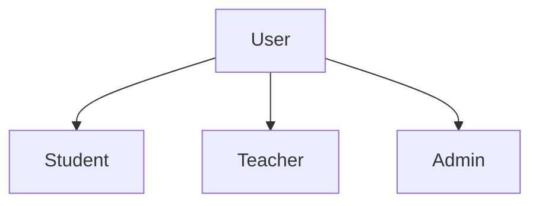
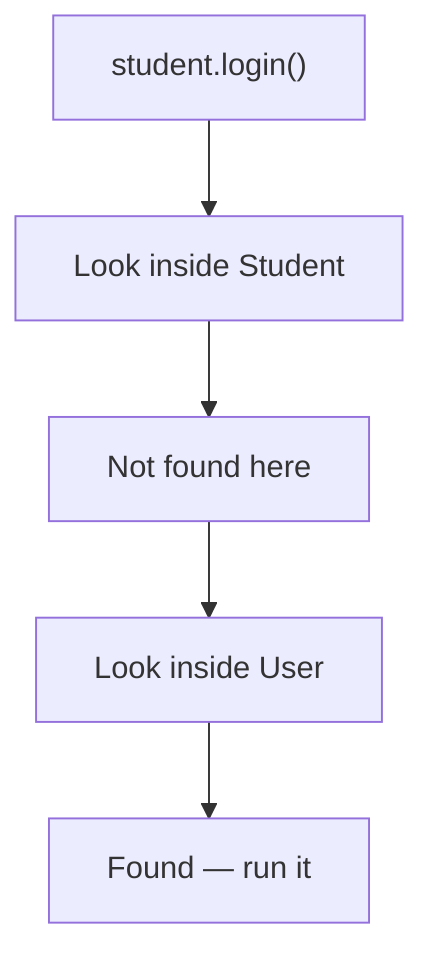
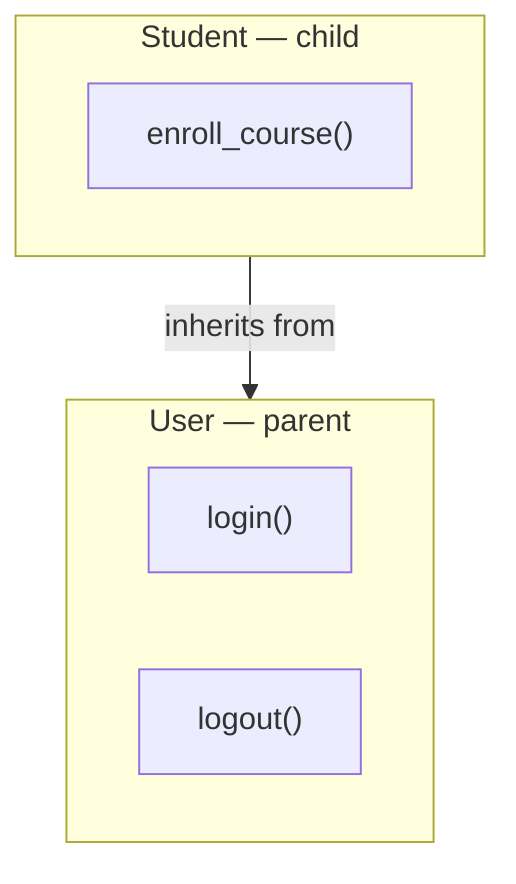

# Inheritance — Reusing Code the Smart Way

---

## Looking Back Before Moving Forward

In the previous chapter, we learned **Encapsulation**, which helped us protect an object's data by allowing the object itself to control how that data is accessed and modified. As a result, our classes became safer, more reliable, and easier to maintain.

However, software development is a continuous process. As applications grow, solving one problem often reveals another. This time, the challenge isn't about protecting data—it's about **reusing code** and avoiding unnecessary duplication.

Let's see how this problem naturally appears.

---

## When Software Starts Growing

Imagine you've joined a company that's building an online learning platform.

The first version is simple. Students can create an account, sign in, access their courses, and log out when they're finished. Since students are the only users in the system, representing them with a single class is all you need.

```python
class Student:
    def __init__(self, name, email):
        self.name = name
        self.email = email

    def login(self):
        print(f"{self.name} logged in.")

    def logout(self):
        print(f"{self.name} logged out.")
```

Every `Student` object stores its own information and knows how to perform the basic actions expected from a student. The application works well, and the team moves on to new features.

A few weeks later, the product team introduces teachers. While discussing the feature, you realise that teachers also need a name, an email address, and the ability to log in and log out. Shortly afterwards, administrators are added to manage users and courses, and they require many of the same capabilities.

Since each of these users represents a different role, you naturally create separate classes for them.

Instead of looking at the complete implementation of every class, let's compare what they contain.

| Feature | Student | Teacher | Admin |
|---------|:-------:|:-------:|:-----:|
| `name` | ✅ | ✅ | ✅ |
| `email` | ✅ | ✅ | ✅ |
| `login()` | ✅ | ✅ | ✅ |
| `logout()` | ✅ | ✅ | ✅ |

Although these classes represent different types of users, most of their implementation is identical. The only meaningful difference is **what each class represents** within the application.

From Python's perspective, this design is perfectly valid. The application runs successfully, there are no errors, and every feature behaves exactly as expected.

So, if everything works, where's the problem?

The answer doesn't lie in writing the code.

It lies in **maintaining** it.

---

## The Problem Isn't Today—It's Tomorrow

One of the biggest differences between beginner and experienced developers is the way they evaluate code.

Beginners often ask,

> "Does the program work?"

Experienced developers ask,

> **"Will this still be easy to maintain six months from now?"**

Many software design problems don't become visible while a project is small. They appear gradually as the application grows.

Imagine writing your class notes.

If you accidentally write the same paragraph twice, it's easy to correct.

If you've copied that same paragraph into twenty different notebooks, correcting it suddenly becomes much harder.

The same thing happens in software. At first, having similar code in two or three classes doesn't seem like a problem. But as requirements arrive, new user types keep appearing—parents, mentors, librarians, coordinators—and every one of them introduces another copy of the same implementation.

---

## When a Small Change Affects the Entire Application

Now imagine your manager walks over with a new requirement.

> "From today onwards, every time a user logs in, we also need to record the login time."

At first, the change sounds simple. Updating the `login()` method only takes a few minutes.

The real challenge isn't making the change—it's remembering every place where that change needs to be applied.

Since every user class has its own copy of `login()`, the same modification now has to be repeated across all of them.



What started as a single requirement has become six code changes.

Now imagine updating every class except one.

The application still runs.

Nothing crashes.

Python doesn't report an error.

But different users now experience different behaviour, because one class was accidentally left unchanged. These issues are difficult to detect precisely because the code doesn't fail—it simply becomes inconsistent over time.

So instead of asking,

> **"How can I copy this code?"**

a better question is,

> **"Why am I copying it in the first place?"**

If several classes need the same data and the same actions, shouldn't there be a way to write that code **once** and let every related class reuse it?

Fortunately, Python provides exactly that capability. The solution is called **Inheritance**.

We've seen why duplicate code becomes difficult to maintain. Before we look at how Python solves this problem, let's look at a concept we've been familiar with our entire lives.

---

## Learning from the Real World

Think about a family.

A child inherits many characteristics from their parents—eye colour, height, facial features. None of these have to be created from scratch for every child.

Yet every child is still a unique individual, free to develop interests and talents entirely their own.

Common characteristics are shared. Individual ones are added when needed.

That simple idea turns out to be extremely useful in software.

---

## Thinking Like a Software Designer

Notice what has to change in the way we look at our classes.

Earlier, we focused on the differences.

- Students attend courses.
- Teachers teach courses.
- Administrators manage the platform.

Those differences led us to create three separate classes.

But now we ask a different question.

> **What do these classes have in common?**

That shift is how experienced developers approach design. Before creating a new class, they don't only look at what makes it unique—they look for what can be shared.

In our case, the answer is already sitting in the comparison table from earlier: a name, an email address, and the ability to log in and log out. Every user needs all four.

So instead of repeating those four things inside every class, we place them in one central class and let the others build on top of it.



Instead of treating every class as completely independent, we now recognise that each one is a specific *type* of **User**.

---

## Introducing Parent and Child Classes

Let's create that central class. It holds everything shared, and nothing role-specific.

```python
class User:
    def __init__(self, name, email):
        self.name = name
        self.email = email

    def login(self):
        print(f"{self.name} logged in.")

    def logout(self):
        print(f"{self.name} logged out.")
```

Because this class serves as the foundation that other classes build upon, it is called the **parent class**. You'll also see it called the **base class** or the **superclass**—all three terms mean the same thing.

Now the `Student` class. Instead of rewriting those variables and methods, we tell Python to reuse what `User` already defines.

```python
class Student(User):
    pass
```

The name inside the parentheses is the parent. `Student` is the **child class**, and `pass` simply means the class body is intentionally empty.

That one line is the entire mechanism. Let's prove it works.

```python
student = Student("Rahul", "rahul@example.com")

student.login()
student.logout()
print(student.email)
```

**Output**

```text
Rahul logged in.
Rahul logged out.
rahul@example.com
```

The `Student` class contains no constructor, no `login()`, and no `logout()`—yet the object was created successfully and performed all three actions. Everything came from `User`, without copying a single line of code.

---

## Understanding the Relationship

The relationship between these classes is usually described with a simple phrase.

> **A Student is a User.**

Similarly,

- A Teacher **is a** User.
- An Admin **is a** User.

This is known as the **"is-a" relationship**, and it's the easiest way to recognise when inheritance is appropriate. If one class is simply a more specific version of another, inheritance is usually a good design choice.

We can now define the feature itself in a way that actually makes sense.

> **Inheritance is an object-oriented programming feature that allows one class to acquire the data and behaviour of another class, enabling code reuse and reducing duplication.**

Notice that we didn't start by memorising that sentence. We found the problem first, understood why it exists, saw how the real world solves something similar, and only then met the definition.

---

## How Python Finds an Inherited Method

One question is still open.

When we called `student.login()`, the `Student` class had no `login()` method at all. So how did Python know what to run?

It follows a simple search.



Python always begins with the child class. If the method isn't there, it moves up to the parent. The first version it finds is the one that runs.

That single rule explains everything we've seen so far—and it becomes even more important in a moment.

---

## Reusing Doesn't Mean Everything Is Identical

Our `Student` class currently inherits everything from `User` and adds nothing. So does inheritance make every child class the same?

Not at all.

Every user can log in. But *after* logging in, each type of user does something completely different. A student enrols in courses. A teacher grades assignments. An administrator manages users.

Those responsibilities belong only in their own classes. Since `Student` already inherits the shared features, we only add what makes a student different.

```python
class Student(User):

    def enroll_course(self, course):
        print(f"{self.name} enrolled in {course}.")
```

```python
student = Student("Rahul", "rahul@example.com")

student.login()
student.enroll_course("Python Programming")
student.logout()
```

**Output**

```text
Rahul logged in.
Rahul enrolled in Python Programming.
Rahul logged out.
```

The `Student` class contains exactly one method, yet the object performed three actions.

---

## Where Does Each Method Come From?

Let's separate the inherited behaviour from the newly added behaviour.

| Method | Defined In |
|---------|------------|
| `login()` | User |
| `logout()` | User |
| `enroll_course()` | Student |

The object can use all three, but they don't all live in the same place.



Rather than copying methods from one class into another, Python simply lets the child reach everything already available in its parent.

---

## Other Children Add Different Behaviour

The same pattern now applies to every remaining role.

```python
class Teacher(User):

    def grade_assignment(self):
        print(f"{self.name} graded an assignment.")


class Admin(User):

    def create_user(self):
        print(f"{self.name} created a new user.")
```

Notice how small each class stays. Everything common is already available through inheritance, so each class describes only its own speciality.

---

## Comparing the Classes

| Class | Inherits | Adds Its Own |
|--------|----------|--------------|
| User | — | `name`, `email`, `login()`, `logout()` |
| Student | `name`, `email`, `login()`, `logout()` | `enroll_course()` |
| Teacher | `name`, `email`, `login()`, `logout()` | `grade_assignment()` |
| Admin | `name`, `email`, `login()`, `logout()` | `create_user()` |

This design has a major advantage.

If the login process changes tomorrow, we update it once, inside `User`.

If the enrolment process changes, only `Student` needs to be modified.

Shared behaviour lives in the parent. Specialised behaviour lives in the child. That single rule is what makes the code easier to read, easier to extend, and much easier to maintain.

---

## A New Question

So far, every child class has simply **added** new behaviour while leaving the inherited behaviour untouched.

But what happens if a child class wants to **change** one of the inherited methods?

For example, what if teachers should log in differently from students?

Should we write another `login()` method inside the `Teacher` class?

If we do, which version will Python execute?

The one in the parent class?

Or the one in the child class?

Answering that question introduces one of the most powerful features of inheritance—**Method Overriding**.
