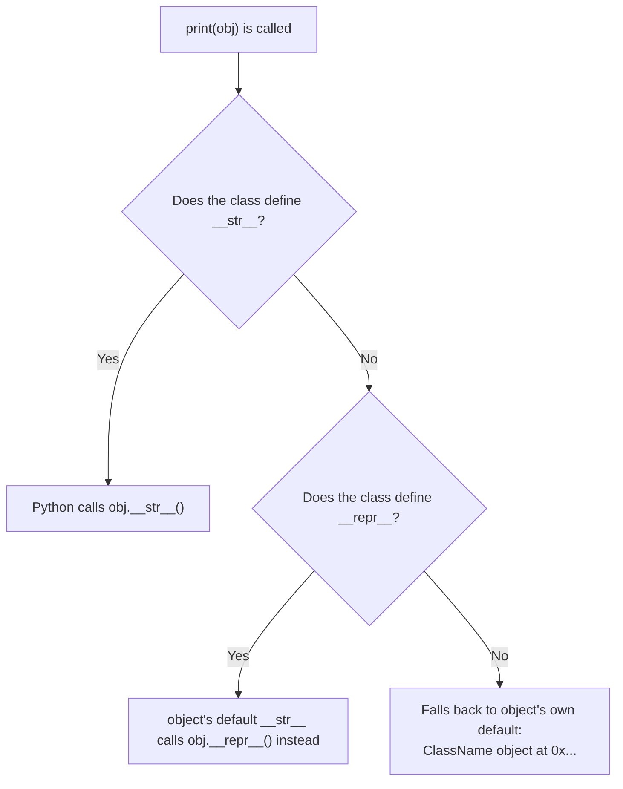
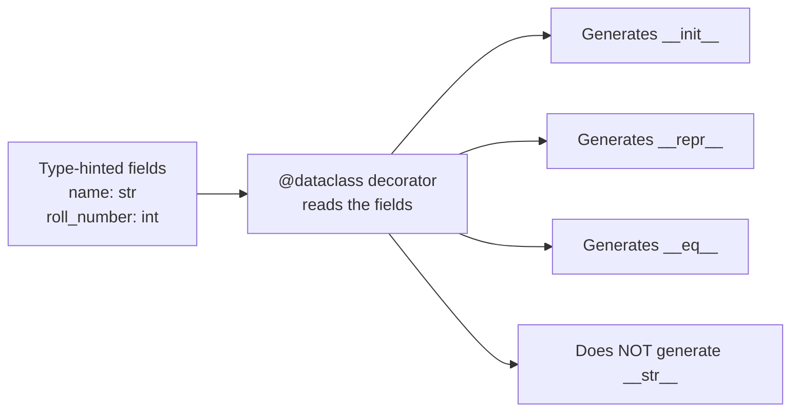

# Special Methods & Dataclasses

---

[← Previous: 4.2 Inheritance & Encapsulation](unit-4-2-inheritance-encapsulation.md) | [Go back to TOC](../../README.md) | [Next: 5.1 File Handling →](../p5-files-exception-handling/unit-5-1-file-handling.md)

## 1. Learning Objectives

By the end of this unit, you will be able to:

- **Explain** what a dunder (special) method is and why Python calls methods like `__init__`, `__str__`, and `__add__` automatically instead of you calling them by name.
- **Implement** `__str__` and `__repr__` to control how an object prints, and explain what happens when only one of the two is defined.
- **Apply** `__eq__` so two objects with matching data compare as equal instead of falling back to identity.
- **Implement** operator overloading using `__add__`, so a custom class responds meaningfully to the `+` operator.
- **Create** simple data-holding classes using the `@dataclass` decorator, and identify exactly which methods it generates — and which it does not.
- **Differentiate** between a hand-written class and a `@dataclass`, and organize related classes into their own modules and packages.

---

## 2. Overview

Think about something you do every single day while writing Python: `print(some_object)`. Have you ever wondered how Python decides *what* to show on screen? Or how `total = price1 + price2` works for plain numbers, but fails with a confusing error the moment you try `wallet1 + wallet2` on two custom objects? The answer to both lies in a small family of methods Python calls **special methods** — and this unit is about learning to control them.

In real Indian IT projects — a banking platform, a UPI payment gateway, an e-commerce backend, a railway reservation system — engineers deal with hundreds of custom classes: `Account`, `Transaction`, `CartItem`, `Ticket`. Every one of them eventually needs to be printed in a log, compared for equality in a test, or combined using an operator like `+`. Special methods (also called **dunder methods**, short for "double underscore") are exactly how Python lets you plug your own class into these built-in behaviours, instead of writing separate helper functions like `print_account()` or `add_wallets()` everywhere.

The second half of this unit solves a related, very practical problem: many classes in real projects are little more than a bundle of attributes with almost no custom behaviour — a config object, a DTO (data transfer object), a record fetched from a database. Writing `__init__`, `__repr__`, and `__eq__` by hand for every one of these is repetitive, and repetition is exactly where bugs creep in. The `@dataclass` decorator generates all of this for you. By the end of this unit, you will also know how to keep growing collections of classes organized into modules and packages, exactly as production codebases do.

---

## 3. Description

### 3.1 Definition

A **dunder method** (also called a **magic method** or **special method**) is a method whose name begins and ends with two underscores, such as `__init__`, `__str__`, `__repr__`, `__eq__`, and `__add__`. You have already met one of these — `__init__` — since Unit 4.1: writing `Student(...)` calls `__init__` for you, without you ever typing `s.__init__(...)` yourself. Every dunder method works the same way — Python calls it implicitly, in response to some built-in syntax or function, rather than you calling it by name.

**Operator overloading** is the specific technique of defining a dunder method (such as `__add__`) so that a standard Python operator (such as `+`) does something meaningful for your own class, instead of raising an error or doing nothing useful. Python does not let you write two methods with the same name that differ only in their parameter types (the way languages like Java and C++ allow "method overloading") — instead, each operator maps to exactly *one* dunder method slot per class, and you write the logic for that one slot.

A **dataclass** is an ordinary Python class, decorated with `@dataclass` from the built-in `dataclasses` module, that has some of its dunder methods (`__init__`, `__repr__`, `__eq__`) generated automatically from a short list of type-hinted attributes, instead of you writing them by hand.

### 3.2 Why This Concept Exists

Create a plain object with no special methods defined at all, and try two very ordinary things with it:

```python
class Student:
    def __init__(self, name, roll_number):
        self.name = name
        self.roll_number = roll_number

priya = Student("Priya", 101)
print(priya)
print(priya == Student("Priya", 101))
```

Output:

```
<__main__.Student object at 0x7f2a4c1b3d90>
False
```

Neither line is broken — both are Python's honest default behaviour, inherited from `object`, the base class every class ultimately extends. `object` has no idea what your data means, so:

- Printing gives you a bare memory address — technically correct, practically useless for debugging.
- `==` checks whether the two names refer to the *same object in memory* (identity), not whether the two objects hold equal data.
- Trying `priya + priya` would raise a `TypeError`, because `object` has no idea what "adding" two students should mean either.

Real software constantly needs better answers than this: a crash log needs to show *what* an object contained, a test needs to confirm two records with the same data are "equal," and a billing system needs to combine two `Money` amounts using ordinary `+`. Special methods exist so you — the class author — get to define exactly what "printing," "equality," and "addition" mean for your own data, instead of settling for defaults that were never written with your class in mind. Dataclasses exist because, once a class becomes purely a bundle of attributes, writing these same three methods by hand, for every such class, is pure repetition — and repetition is where copy-paste bugs hide (forget to add a new field to a hand-written `__eq__` after adding it to `__init__`, and equality quietly stops checking it).

### 3.3 Key Terminology

| Term | Simple Meaning |
|---|---|
| **Dunder / magic method** | A method whose name starts and ends with `__`, called implicitly by Python in response to built-in syntax, e.g. `__init__`, `__str__`. |
| **`__str__`** | The special method called by `print()`, `str()`, and f-strings to get a human-readable, user-facing description of an object. |
| **`__repr__`** | The special method called by `repr()` — meant to give a precise, developer-facing description, ideally showing how the object could be recreated in code. |
| **`__eq__`** | The special method called by the `==` operator; defining it lets two objects compare equal based on their data instead of their identity. |
| **`__add__`** | The special method called by the `+` operator when the left-hand operand is an instance of your class. |
| **Operator overloading** | Defining a dunder method so a built-in operator (`+`, `==`, etc.) behaves meaningfully for a custom class. |
| **Dataclass** | A class, decorated with `@dataclass`, that gets `__init__`, `__repr__`, and `__eq__` generated automatically from its type-hinted attributes. |
| **`@dataclass` decorator** | The decorator, imported from the built-in `dataclasses` module, that turns a plain class definition into a dataclass. |
| **Field** | One type-hinted attribute declared inside a dataclass — each field becomes a parameter of the generated `__init__`. |
| **Module** | A single `.py` file; classes and functions defined in it can be imported and reused from other files. |
| **Package** | A directory of related modules, grouped so other code can import from the collection as one unit. |
| **`NotImplemented`** | A special value a dunder method can return to tell Python "I don't know how to handle this combination of types" — a detail worth recognising, though rarely required for beginner-level classes. |

### 3.4 Syntax

**Defining a dunder method** — it looks like any ordinary method, with `self` as the first parameter and, for binary operators, one more parameter for the other operand:

```python
class ClassName:
    def __dunder_name__(self, other):
        # build and return a value
        return result
```

| Part | What it is | Why it's there |
|---|---|---|
| `def __dunder_name__` | The reserved method name Python looks for automatically. | Python calls this method by name whenever the matching built-in syntax is used — you never call it directly by that name. |
| `self` | The object the operator/function was used *on* (the left-hand side for operators). | Gives the method access to this object's own attributes. |
| `other` | The second value involved (only present for two-operand special methods like `__eq__`, `__add__`). | Lets the method compare or combine `self` with whatever was on the other side. |
| `return result` | A value the calling code receives back. | `print()`, `==`, and `+` all *use* what your dunder method returns — forgetting to `return` means they silently get `None`. |

**Comparison Table: `__str__` vs `__repr__`**

| Aspect | `__str__` | `__repr__` |
|---|---|---|
| Audience | End user / human reading output | Developer debugging or logging |
| Called by | `print()`, `str()`, f-strings (when defined) | `repr()`, interactive shell echoing a value, and as the fallback for `print()` |
| Goal | Readable, friendly description | Unambiguous, ideally code-like description |
| If missing | Falls back to `__repr__` (via `object`'s default `__str__`) | No further fallback — defaults to `<ClassName object at 0x...>` |
| Typical content | `"Priya (Roll No. 101)"` | `"Student(name='Priya', roll_number=101)"` |

**How `print(obj)` Resolves to a Dunder Method**



**Defining a dataclass** — a decorator plus type-hinted class attributes, with no `__init__` written by hand:

```python
from dataclasses import dataclass

@dataclass
class ClassName:
    field_one: type
    field_two: type = default_value
```

| Part | What it is | Why it's there |
|---|---|---|
| `from dataclasses import dataclass` | Imports the decorator from Python's built-in `dataclasses` module. | `@dataclass` is not a built-in keyword — it must be imported like anything else from the standard library. |
| `@dataclass` | The decorator, placed directly above the class definition. | Tells Python to inspect this class's type-hinted attributes and generate `__init__`, `__repr__`, and `__eq__` from them. |
| `field_one: type` | A **field** — a class attribute written with a type hint but no default value. | Becomes a required parameter, in this order, in the generated `__init__`. |
| `field_two: type = default_value` | A field with a default value. | Becomes an optional parameter; every defaulted field must come *after* every required one. |

**Comparison Table: Regular Class vs `@dataclass`**

| Aspect | Regular (hand-written) Class | `@dataclass` |
|---|---|---|
| `__init__` | Written by hand | Generated automatically from type-hinted fields |
| `__repr__` / `__eq__` | Written by hand, if wanted at all | Generated automatically |
| `__str__` | Written by hand, if wanted | Never generated — must still be written by hand |
| Best suited for | Classes with custom behaviour, validation, or invariants | Classes that are mostly data (configs, records, DTOs) |
| Boilerplate | More typing, more places to introduce bugs | Minimal — a short, type-hinted field list |
| Extra features | None built in | `frozen=True` for immutability, `order=True` for `<`, `<=`, `>`, `>=` |

**What `@dataclass` Generates**



### 3.5 Rules

- A dunder method must actually `return` a value — `__str__` and `__repr__` must return a `str`; if you forget the `return`, Python will complain (`TypeError: __str__ returned non-string (type NoneType)`) rather than silently printing nothing.
- `object`'s own default `__str__` is implemented to call `self.__repr__()`. So a class that defines `__repr__` but not `__str__` still prints something useful — only when a class defines *both* does `print()` prefer the friendlier `__str__`.
- `__eq__` receives the other operand as a plain parameter (commonly named `other`) with no guarantee it is even the same type — always check `isinstance(other, ClassName)` before touching its attributes.
- `__add__` should normally build and return a *new* object rather than modifying `self` in place — `+` is expected to produce a new value, exactly like `3 + 4` never changes `3`.
- Every field in a `@dataclass` must carry a type hint — a plain attribute with no type hint is not recognized as a field at all.
- Inside a `@dataclass`, every field with a default value must be declared *after* every field without one, because the generated `__init__` places fields as parameters in that same order.
- `@dataclass` never generates `__str__` — printing a plain dataclass instance shows the same text `repr()` would, purely because of the fallback rule above.

### 3.6 Best Practices

- Always implement `__repr__` for any class you expect to debug or log — an unambiguous representation saves enormous time when something goes wrong in production.
- Implement `__str__` only when the human-facing message genuinely differs from the debugging one; otherwise, relying on the `__repr__` fallback is perfectly fine.
- Use `@dataclass` for classes that are mostly data — configuration objects, records, DTOs — and reserve hand-written classes for ones with real behaviour and invariants to protect.
- When implementing `__eq__`, always guard with `isinstance(other, ClassName)` first, so comparing against an unrelated type returns `False` cleanly instead of crashing.
- When implementing `__add__`, keep the returned object the same type as the operands, so the result can itself be printed, compared, or added again.

### 3.7 Common Mistakes

- **Confusing `__str__` and `__repr__`** — treating them as interchangeable, then being surprised that `print()` and `repr()` show different things once both are defined.
- **Forgetting to `return` a value from a dunder method** — a `__str__` or `__add__` that runs code but never returns anything causes a `TypeError` or an unexpected `None`.
- **Overusing `@dataclass` where real behaviour is needed** — forcing a class with genuine validation logic, custom methods, or invariants into a dataclass just to save typing, when a hand-written class would communicate the design better.
- **Leaving a dataclass field without a type hint** — the decorator silently ignores it as a field, so it never appears in the generated `__init__`, `__repr__`, or `__eq__`.
- **Placing a required field after a defaulted one in a dataclass** — raises a `TypeError` at class-definition time, before the program even runs.
- **Assuming `+` works automatically between custom objects** — without `__add__` defined, `obj1 + obj2` raises `TypeError: unsupported operand type(s)`, since `object` has no idea what "adding" your class should mean.

### 3.8 Organizing Classes into Modules and Packages

With `Student`, `Point`, `Wallet`, and `Ticket` all defined, a natural question follows: where should these classes actually live as a project grows? A **module** is simply a `.py` file. As a project grows past one or two classes, cramming everything into a single file becomes its own problem — so related classes get grouped into their own modules, and other files reach them with `import`.

```python
# wallet.py
from dataclasses import dataclass

@dataclass
class Wallet:
    owner_name: str
    balance: float
```

```python
# main.py
from wallet import Wallet

my_wallet = Wallet("Rohit", 500.0)
print(my_wallet.owner_name)
```

Output:

```
Rohit
```

`from wallet import Wallet` tells Python: locate a module named `wallet` (it finds `wallet.py` in the same directory), run that file once, and bind the name `Wallet` into this file's own namespace. Import the same module a second time from anywhere else in the program, and Python reuses the module object it already built rather than re-running the file. A **library** — a broader term you will hear constantly in the industry — is simply a collection of modules (often distributed as a **package**, a directory of related modules) written to be reused across many projects; the `dataclasses` module you have been importing throughout this unit is itself one small part of Python's own **standard library**, the large collection of modules that ships with Python itself. As a project grows, you might end up with `wallet.py`, `ticket.py`, and `student.py` sitting side by side — or grouped further into a package such as `banking/` containing `account.py` and `transaction.py` together.

### 3.9 Code Examples

One running example — a UPI `Wallet` — builds up every feature in this unit, one at a time, instead of jumping between unrelated classes. Each step adds one dunder method to the same class.

**Step 1: `__repr__` and `__str__` — controlling how a `Wallet` prints**

```python
class Wallet:
    def __init__(self, owner_name, balance):
        self.owner_name = owner_name
        self.balance = balance

    def __repr__(self):
        return f"Wallet(owner_name={self.owner_name!r}, balance={self.balance})"

    def __str__(self):
        return f"{self.owner_name}'s wallet: Rs. {self.balance:.2f}"

wallet_1 = Wallet("Rohit", 500.0)
print(wallet_1)
print(repr(wallet_1))
```

*Line-by-line explanation:*
- `class Wallet:` starts a new class with two attributes, `owner_name` and `balance`, set in `__init__` exactly as in Unit 4.1.
- `def __repr__(self):` defines the developer-facing description; `{self.owner_name!r}` uses the `!r` conversion to show the string with quotes, exactly as it would appear in code.
- `def __str__(self):` defines the friendlier, end-user-facing description, formatting `balance` to two decimal places since this represents money.
- `wallet_1 = Wallet("Rohit", 500.0)` creates one `Wallet` instance.
- `print(wallet_1)` calls `__str__` since it is defined. `repr(wallet_1)` calls `__repr__` directly. Output:
```
Rohit's wallet: Rs. 500.00
Wallet(owner_name='Rohit', balance=500.0)
```

**Step 2: `__eq__` — comparing two wallets by data, not identity**

```python
class Wallet:
    def __init__(self, owner_name, balance):
        self.owner_name = owner_name
        self.balance = balance

    def __repr__(self):
        return f"Wallet(owner_name={self.owner_name!r}, balance={self.balance})"

    def __str__(self):
        return f"{self.owner_name}'s wallet: Rs. {self.balance:.2f}"

    def __eq__(self, other):
        return isinstance(other, Wallet) and self.owner_name == other.owner_name and self.balance == other.balance

wallet_1 = Wallet("Rohit", 500.0)
wallet_2 = Wallet("Rohit", 500.0)
print(wallet_1 == wallet_2)
```

*Line-by-line explanation:*
- `def __eq__(self, other):` defines what `==` should do whenever the left-hand side is a `Wallet`.
- `isinstance(other, Wallet)` is checked first — `and` short-circuits left to right, so if `other` is not even a `Wallet`, the expression returns `False` immediately without ever touching `other.owner_name`, which might not exist.
- `self.owner_name == other.owner_name and self.balance == other.balance` compares both fields; only if both match is the overall result `True`.
- `wallet_1 == wallet_2` calls `wallet_1.__eq__(wallet_2)` implicitly. Since both wallets hold the same data, output: `True` — even though `wallet_1` and `wallet_2` are two separate objects in memory.

**Step 3: `__add__` — combining two wallets with `+`**

```python
class Wallet:
    def __init__(self, owner_name, balance):
        self.owner_name = owner_name
        self.balance = balance

    def __repr__(self):
        return f"Wallet(owner_name={self.owner_name!r}, balance={self.balance})"

    def __str__(self):
        return f"{self.owner_name}'s wallet: Rs. {self.balance:.2f}"

    def __eq__(self, other):
        return isinstance(other, Wallet) and self.owner_name == other.owner_name and self.balance == other.balance

    def __add__(self, other):
        combined_balance = self.balance + other.balance
        return Wallet(f"{self.owner_name} + {other.owner_name}", combined_balance)

wallet_1 = Wallet("Rohit", 500.0)
cashback_wallet = Wallet("Rohit-Cashback", 45.50)

total_wallet = wallet_1 + cashback_wallet
print(total_wallet)
```

*Line-by-line explanation:*
- `def __add__(self, other):` defines what `+` should do whenever the left-hand operand is a `Wallet` — this is operator overloading in action.
- `combined_balance = self.balance + other.balance` adds the two plain `float` balances using ordinary numeric `+` — this line does not overload anything, it just uses `+` on numbers as usual.
- `return Wallet(...)` builds and returns a brand-new `Wallet`, rather than modifying `wallet_1` in place — matching the rule that `+` should produce a new value.
- `total_wallet = wallet_1 + cashback_wallet` calls `wallet_1.__add__(cashback_wallet)` implicitly, producing a new combined `Wallet`.
- `print(total_wallet)` calls `__str__` on the result. Output: `Rohit + Rohit-Cashback's wallet: Rs. 545.50`.

**Step 4: the same `Wallet`, rewritten as a `@dataclass`**

`Wallet` is mostly data (`owner_name`, `balance`) with a little custom behaviour (`__str__`, `__add__`) layered on top. `@dataclass` can generate the data-only parts — `__init__`, `__repr__`, `__eq__` — while `__str__` and `__add__` are still written by hand, exactly as the comparison table in section 3.4 predicts:

```python
from dataclasses import dataclass

@dataclass
class Wallet:
    owner_name: str
    balance: float

    def __str__(self):
        return f"{self.owner_name}'s wallet: Rs. {self.balance:.2f}"

    def __add__(self, other):
        return Wallet(f"{self.owner_name} + {other.owner_name}", self.balance + other.balance)

wallet_1 = Wallet("Rohit", 500.0)
wallet_2 = Wallet("Rohit", 500.0)
cashback_wallet = Wallet("Rohit-Cashback", 45.50)

print(wallet_1)
print(repr(wallet_1))
print(wallet_1 == wallet_2)
print(wallet_1 + cashback_wallet)
```

*Line-by-line explanation:*
- `@dataclass` turns the class below it into a dataclass — `__init__`, `__repr__`, and `__eq__` are all generated from the two type-hinted fields, `owner_name: str` and `balance: float`, replacing the hand-written versions from Steps 1–2.
- `def __str__(self):` and `def __add__(self, other):` are still written by hand inside the dataclass body — `@dataclass` never generates `__str__`, and it has no idea what "adding" two wallets should mean, so both stay exactly as in Step 3. A dataclass is still an ordinary class underneath the decorator; you can always add plain methods to it.
- `wallet_1 = Wallet("Rohit", 500.0)` calls the generated `__init__`.
- `print(wallet_1)` calls the hand-written `__str__`; `repr(wallet_1)` calls the generated `__repr__`; `wallet_1 == wallet_2` calls the generated `__eq__`; `wallet_1 + cashback_wallet` calls the hand-written `__add__`. Output:
```
Rohit's wallet: Rs. 500.00
Wallet(owner_name='Rohit', balance=500.0)
True
Rohit + Rohit-Cashback's wallet: Rs. 545.50
```

#### Try It Yourself

Using the final `@dataclass` version of `Wallet` from Step 4 as your starting point, complete the following three parts.

**Part 1 (straightforward):** Create `priya_wallet = Wallet("Priya", 200.0)` and `bonus_wallet = Wallet("Priya-Bonus", 15.75)`. Add them together with `+` and `print()` the result.

**Solution:**

```python
priya_wallet = Wallet("Priya", 200.0)
bonus_wallet = Wallet("Priya-Bonus", 15.75)

combined_wallet = priya_wallet + bonus_wallet
print(combined_wallet)
```

Expected output:

```
Priya + Priya-Bonus's wallet: Rs. 215.75
```

**Part 2 (moderate):** Create `wallet_a = Wallet("Priya", 200.0)` and `wallet_b = Wallet("Priya", 200.0)` — two separate objects holding identical data. Print `wallet_a == wallet_b` and `wallet_a is wallet_b`, and be ready to explain in one sentence why the two results differ.

**Solution:**

```python
wallet_a = Wallet("Priya", 200.0)
wallet_b = Wallet("Priya", 200.0)

print(wallet_a == wallet_b)
print(wallet_a is wallet_b)
```

Expected output:

```
True
False
```

`==` calls the dataclass-generated `__eq__`, which compares data — both wallets hold the same `owner_name` and `balance`, so it is `True`. `is` checks identity — whether both names refer to the exact same object in memory — and since `wallet_a` and `wallet_b` were built from two separate `Wallet(...)` calls, it is `False`.

**Part 3 (challenging):** Add a `__sub__` method to `Wallet`, following the same pattern as `__add__`, so that `wallet_1 - spent_wallet` returns a new `Wallet` with the same `owner_name` as `wallet_1` and a `balance` reduced by `spent_wallet`'s balance. Test it with `wallet_1 = Wallet("Rohit", 500.0)` and `spent_wallet = Wallet("Rohit-Spent", 120.0)`.

**Solution:**

```python
from dataclasses import dataclass

@dataclass
class Wallet:
    owner_name: str
    balance: float

    def __str__(self):
        return f"{self.owner_name}'s wallet: Rs. {self.balance:.2f}"

    def __add__(self, other):
        return Wallet(f"{self.owner_name} + {other.owner_name}", self.balance + other.balance)

    def __sub__(self, other):
        return Wallet(self.owner_name, self.balance - other.balance)

wallet_1 = Wallet("Rohit", 500.0)
spent_wallet = Wallet("Rohit-Spent", 120.0)

remaining_wallet = wallet_1 - spent_wallet
print(remaining_wallet)
```

Expected output:

```
Rohit's wallet: Rs. 380.00
```

`__sub__` is the dunder method Python calls for `-`, following exactly the same pattern as `__add__`: it builds and returns a brand-new `Wallet` rather than changing `wallet_1` in place, keeping `owner_name` from `self` and subtracting `other.balance` from `self.balance` (`500.0 - 120.0 = 380.0`).

---

## 4. Real-World Application

- **Banking & FinTech:** An `Account` class implements `__repr__` so a crash log shows `Account(id=48213, balance=15420.75)` instead of a bare memory address — giving an engineer enough detail to understand the object without re-running the program.
- **UPI / Payment Systems:** Two payment receipt objects compare equal through a custom `__eq__` that checks transaction IDs, not whether they are literally the same object — exactly the identity-vs-data distinction this unit opened with. A wallet-recharge feature overloads `__add__` to combine a main balance with a cashback balance in one clean expression.
- **E-commerce:** A `CartItem` dataclass holds `product_name`, `price`, and `quantity` — pure data, generated `__repr__` and `__eq__` included for free, no custom behaviour needed.
- **Healthcare:** A `PatientRecord` class overrides `__eq__` to detect duplicate patient entries submitted from two different hospital counters, even though they arrive as separate objects.
- **Railway Booking (IRCTC-style systems):** A `Ticket` dataclass, exactly like the example above, models a confirmed booking as pure data, ready to be printed, compared, or stored.
- **AI/ML:** A model's hyperparameter configuration — `batch_size`, `learning_rate`, `epochs` — is almost always a dataclass, since configuration is pure data with no custom behaviour, precisely the case `@dataclass` exists for.
- **Cloud Applications:** Microservices routinely pass small, well-defined data objects (dataclasses) between services, relying on their auto-generated `__repr__` to make request/response logging readable.

---

## 5. Worked Example

### Problem Statement

A food-delivery app keeps a customer's spendable balance in two places: the main wallet and a separate cashback wallet. Before checkout, the app needs to combine both into one total using plain `+`, and print a human-readable summary. Build this, discover why `+` does not work by default, then fix it.

### Step 1: Understand the Problem

Two `Wallet` objects need to be added together with the `+` operator, and the result needs to print as a friendly, readable line — not a memory address. Neither behaviour exists automatically for a custom class, so both must be added deliberately using dunder methods.

### Step 2: Plan the Solution

First, write a plain `Wallet` class with only `__init__`, and confirm that `+` fails between two instances. Then add `__add__`, which should build and return a new `Wallet` holding the combined balance, and add `__str__`, which should return a friendly summary line for `print()`.

### Step 3: Write the Python Code

```python
class Wallet:
    def __init__(self, owner_name, balance):
        self.owner_name = owner_name
        self.balance = balance

main_wallet = Wallet("Ananya", 320.0)
cashback_wallet = Wallet("Ananya-Cashback", 60.0)

# total_wallet = main_wallet + cashback_wallet   # would raise: TypeError: unsupported operand type(s) for +: 'Wallet' and 'Wallet'

class Wallet:
    def __init__(self, owner_name, balance):
        self.owner_name = owner_name
        self.balance = balance

    def __add__(self, other):
        return Wallet(self.owner_name, self.balance + other.balance)

    def __str__(self):
        return f"{self.owner_name}: Rs. {self.balance:.2f} available"

main_wallet = Wallet("Ananya", 320.0)
cashback_wallet = Wallet("Ananya-Cashback", 60.0)

total_wallet = main_wallet + cashback_wallet
print(total_wallet)
```

### Step 4: Explain Each Line

- The first `Wallet` class defines only `__init__` — no dunder method tells Python what `+` should do between two instances, so the commented-out line would raise a `TypeError` if uncommented; it is left as a comment here purely to show what *would* happen, without introducing formal error handling ahead of Module P5.
- The second `Wallet` class is the fixed version: `def __add__(self, other):` defines addition, returning a brand-new `Wallet` built from `self.owner_name` and the combined balance — the two original wallets are left untouched.
- `def __str__(self):` returns a friendly, formatted line using an f-string; `{self.balance:.2f}` formats the balance to exactly two decimal places, as money should always be displayed.
- `main_wallet = Wallet("Ananya", 320.0)` and `cashback_wallet = Wallet("Ananya-Cashback", 60.0)` create the two wallets to be combined.
- `total_wallet = main_wallet + cashback_wallet` calls `main_wallet.__add__(cashback_wallet)` implicitly, producing a new `Wallet` with a combined balance of `380.0`.
- `print(total_wallet)` calls `__str__` on the result.

### Step 5: Sample Input

`main_wallet` balance: `320.0`; `cashback_wallet` balance: `60.0`. Both are fixed values written directly in the code — no external input is involved in this unit.

### Step 6: Expected Output

```
Ananya: Rs. 380.00 available
```

### Step 7: Why the Output Is Produced

`__add__` combines the two balances (`320.0 + 60.0 = 380.0`) and returns a new `Wallet` carrying `self.owner_name` — here, simply `"Ananya"`, since the example did not rename the owner on combination. `print(total_wallet)` then calls `__str__`, which formats that combined balance to two decimal places. Without `__add__` defined at all, the very same `main_wallet + cashback_wallet` expression would have raised a `TypeError`, because `object` — the default every class inherits from — has no built-in idea of what "adding" two custom objects should mean.

---

### Important Notes (Interview Insights)

- *"What is the difference between `__str__` and `__repr__`?"* is one of the most frequently asked Python fresher interview questions. The clean answer: `__str__` is for the end user (readable), `__repr__` is for the developer (unambiguous, ideally re-creatable code); if only `__repr__` is defined, `print()` falls back to it automatically.
- Interviewers often follow up with *"When would you choose a dataclass over a regular class?"* — the honest answer is: when the class is mainly a container for data with little or no custom behaviour. The moment a class needs validation logic, computed behaviour, or protects an invariant, a hand-written class (or a dataclass with added methods) communicates intent better.
- Be ready to clarify that Python does not support classic "method overloading" (same method name, different parameter types, resolved at compile time, as in Java). What Python offers instead is **operator overloading** — one dunder method per operator, and your own logic inside it decides how to handle different situations.
- A dataclass is still an ordinary class underneath the decorator — you can add plain methods to it, and inheritance still works exactly as covered in Unit 4.2, including a subclass with a hand-written `__init__` that calls `super().__init__(...)`.

---

## 6. Key Takeaways

- A **dunder method** is a method Python calls implicitly in response to built-in syntax — `__init__` for construction, `__str__`/`__repr__` for printing, `__eq__` for `==`, `__add__` for `+`.
- **`__repr__`** gives a precise, debugging-friendly representation; **`__str__`** gives a human-readable one. Without `__str__`, `print()` falls back to `__repr__`, because `object`'s default `__str__` calls `self.__repr__()`.
- **`__eq__`** redefines `==` to compare data instead of identity; without it, two objects with identical fields still compare as `False`.
- **Operator overloading** means defining a dunder method like `__add__` so a built-in operator behaves meaningfully for your own class — Python does not support Java-style method overloading by parameter type.
- A dunder method that fails to `return` a value produces a broken or `None` result — always confirm the `return` statement is present.
- **`@dataclass`** generates `__init__`, `__repr__`, and `__eq__` from type-hinted fields — but never `__str__` — provided every field carries a type hint, and every defaulted field comes after every required one.
- Use a **regular class** when a class needs real behaviour or validation; use a **`@dataclass`** when a class is mostly a bundle of data.
- **Modules** (separate `.py` files) and **packages** (directories of related modules) keep growing projects organized; `import`/`from module import Name` reaches a class defined elsewhere without redefining it.

Coming next: Unit 5.1 — File Handling, where you move from data that lives only in memory to data read from and written to real files on disk.

---

## 7. Reference Links

- [Python Data Model — Special Method Names](https://docs.python.org/3/reference/datamodel.html#special-method-names)
- [Python 3 Documentation — `dataclasses` Module](https://docs.python.org/3/library/dataclasses.html)
- [Real Python — Python's Magic Methods](https://realpython.com/python-magic-methods/)
- [Real Python — Data Classes in Python 3.7+](https://realpython.com/python-data-classes/)
- [W3Schools — Python Classes and Objects](https://www.w3schools.com/python/python_classes.asp)

[← Previous: 4.2 Inheritance & Encapsulation](unit-4-2-inheritance-encapsulation.md) | [Go back to TOC](../../README.md) | [Next: 5.1 File Handling →](../p5-files-exception-handling/unit-5-1-file-handling.md)

---

*© 2026 Revature · AI Native Engineering — Foundations · Unit 4.3 · Version 2.0*
