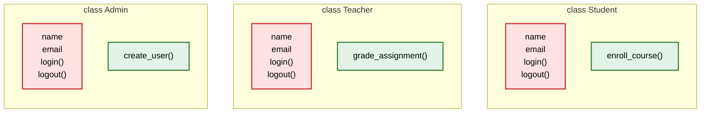
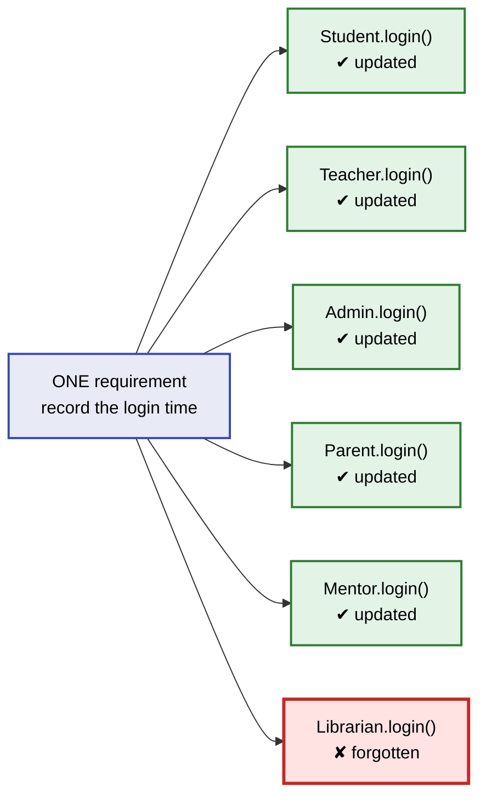
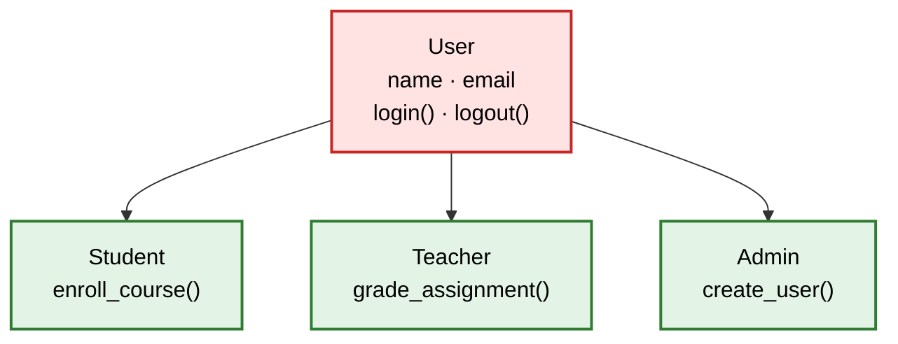
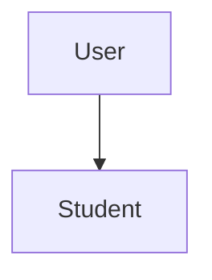
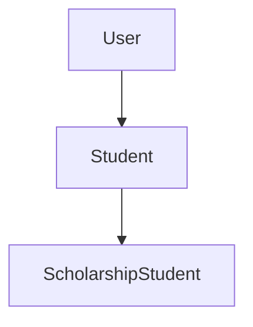
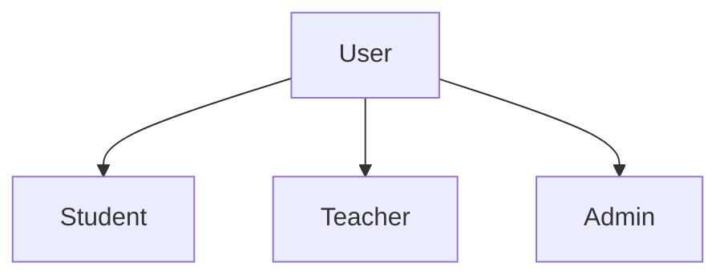
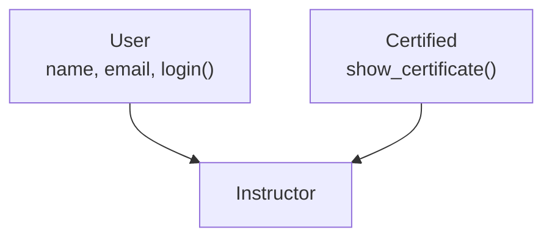
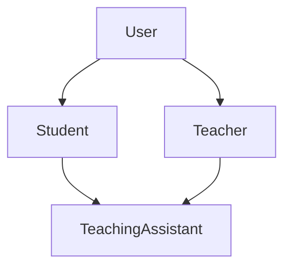
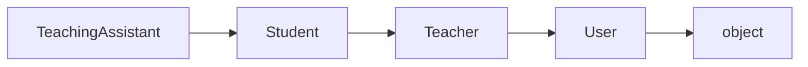

# Inheritance — Reusing Code the Smart Way

In the Encapsulation chapter, we learned how to protect an object's data by letting the object control how its data is accessed and modified. Instead of allowing anyone to change data directly, we validated changes through methods, making our classes safer and more reliable.

But solving one problem in software often reveals another. Encapsulation strengthened individual classes, yet it didn't solve what happens when multiple classes start containing the same code.

This chapter tackles that new challenge. It isn't about protecting data—it's about reusing code and avoiding unnecessary duplication.

---

## When Software Starts Growing

Imagine you've joined a company that's building an online learning platform.

The first version is simple. Students can create an account, sign in, access their courses, and log out when they're finished. Since students are the only users in the system, representing them with a single class is all you need.

```python
class Student:
    def __init__(self, name, email):
        self.name = name
        self.email = email

    def login(self):
        print(f"{self.name} logged in.")

    def logout(self):
        print(f"{self.name} logged out.")
```

One new piece of syntax before we go further: `print(f"{self.name} logged in.")`. The `f` right before the opening quote makes this an **f-string** — it lets a variable's value be dropped directly inside `{ }`, so `f"{self.name} logged in."` becomes `"Rahul logged in."` once Python fills it in. From here on, our `print()` calls will use f-strings instead of listing values one by one separated by commas — it reads closer to the actual sentence being printed, especially once a method needs to combine several pieces of information at once.

Every Student object stores its own information and knows how to perform the basic actions expected from a student. The application works well, and the team moves on to building new features.

A few weeks later, the platform introduces teachers. They also need a name, an email address, and the ability to log in and log out. Soon after, administrators are added to manage users and courses, and they require many of the same capabilities.

Since each role represents a different kind of user, creating a separate class for each of them feels like the right design choice.

Instead of reading three complete class definitions, let's compare what each class actually contains.



The red blocks are not similar. They are **identical**, typed out three separate times. Only the small green block at the bottom of each class carries anything genuinely new. Roughly eighty percent of every class you just wrote already existed in the class next to it.

From Python's perspective, this design is perfectly valid. The application runs successfully, there are no errors, and every feature behaves exactly as expected. If your only test is "does it work?", this code passes.

So if everything works, where exactly is the problem?

The problem doesn't appear while writing the code.

It appears when the code has to change.

---

## The Problem Isn't Today — It's Tomorrow

At this stage, the application works perfectly. The code is clear, every feature behaves correctly, and Python reports no errors.

The problem is that software doesn't stop evolving. New features, bug fixes, and changing requirements mean today's code will need tomorrow's changes.

Imagine writing the same paragraph in several notebooks. Updating one copy is easy. Updating every copy—and making sure none are missed—isn't.

Duplicate code works the same way. Writing it is easy.

Maintaining every copy over time isn't.

The real cost of duplication isn't when you write the code.

It's when you have to change it.

---

## When a Small Change Affects the Entire Application

Now imagine your manager walks over with a new requirement.

> "From today onwards, every time a user logs in, we should also record the exact login time."

At first, the change sounds trivial. Adding a timestamp inside the `login()` method takes about two minutes of actual typing.

The real challenge isn't making the change. It's **remembering every single place where that change has to be made.**

Because every user class owns its own private copy of `login()`, the same modification must now be repeated in all of them.

Here is what one sentence from your manager actually costs.



Six edits, and one of them was missed—simply because that class hadn't been updated.

Nothing crashes. Python reports no errors. The application continues to work, but one part of it now behaves differently from the others.

That's the real danger of duplicated code. It doesn't fail immediately; it slowly becomes inconsistent as the application evolves.

Instead of maintaining multiple copies of the same code, we need a design where common functionality is written once and shared by every related class.

Python provides exactly that through Inheritance.

---

## Inheritance

Our requirement is now precise. The shared members—`name`, `email`, `login()` and `logout()`—should exist in exactly **one** place, and every user class should be able to use them without owning a private copy.

That single idea is the entire solution. Write the common code once, and let related classes share that one implementation. A change then happens in one place and reaches every class automatically.

Python calls this **Inheritance**.

Inheritance is an object-oriented programming feature that allows one class to reuse the variables and methods of another class. Instead of writing the same code repeatedly, we write it once and allow other related classes to use it.

Applied to our application, the effect is exactly what we were looking for. The common data and behaviour—`name`, `email`, `login()` and `logout()`—is written in one class instead of being duplicated across every user role. The manager's timestamp requirement now becomes a single edit, and no class can be accidentally left behind.

To achieve this, inheritance creates a relationship between two classes.

The class that contains the common variables and methods is called the **parent class** (also known as the base class or superclass). The class that inherits and uses those members is called the **child class** (also known as the derived class or subclass).

Instead of rewriting the shared code, the child class automatically gains access to everything defined in the parent class, while adding its own unique features whenever needed.

Let's create this parent-child relationship for our learning platform.

---

## Introducing Parent and Child Classes

The class that contains everything common should represent the most general version of those classes.

On our platform, `Student`, `Teacher` and `Admin` are all versions of one single idea. A student is a **user**. A teacher is a **user**. An admin is a **user**. So `User` is the class we write.

Here is the shape we are aiming for. It is the same picture as before, with the red block lifted out of all three classes and placed in a single class above them.



Everything shared is written once at the top, and each class below keeps only its own green part. Let's build the class at the top first — and rather than starting from nothing, we pick up the exact `User` class we encapsulated in the Encapsulation chapter, `password` and all.

```python
class User:
    def __init__(self, name, email, password=None):
        self.name = name
        self.email = email
        self.__password = password

    def login(self):
        print(f"{self.name} logged in.")

    def logout(self):
        print(f"{self.name} logged out.")

    def get_password(self):
        return self.__password

    def set_password(self, new_password):
        self.__password = new_password
```

`__password`, `get_password()`, and `set_password()` are unchanged from the Encapsulation chapter — still private, still only reachable through those two methods. Nothing about inheritance weakens that protection, and we'll see exactly why a little later in this chapter.

One detail here is genuinely new: `password=None` in the parameter list. Writing `=None` directly after a parameter makes it a **default parameter** — if whoever creates a `User` doesn't pass a password at all, Python quietly uses `None` instead of demanding one. We need that now for a reason specific to this chapter: in a moment, we're going to create a `Student` by passing only a name and email, with no password in sight. Without a default, Python would refuse — `TypeError: missing 1 required positional argument: 'password'` — the instant that object was created.

Because this class holds what the others are built upon, it is called the **parent class**. You will also see it called the **base class** or the **superclass**. All three terms mean exactly the same thing, and different books and interviewers prefer different words, so it is worth being comfortable with all of them.

Now the `Student` class — and this is where the connection is actually made. Instead of retyping those four members, we write the parent's name inside parentheses.

```python
class Student(User):
    pass
```

That pair of parentheses is the entire connection. One point deserves care here, because it confuses almost every beginner: the parentheses are **not** calling `User`. Nothing is being executed. They simply tell Python that `Student` inherits from `User`.

`Student` is now the **child class** — also called the **derived class** or the **subclass** — and the name inside the parentheses is its parent. The keyword `pass` simply tells Python that the class body is intentionally empty for the moment; a block cannot be left blank, and `pass` is a placeholder that does nothing.

One line, and `Student` should now be able to do everything `User` can. Let's prove it.

```python
student = Student("Rahul", "rahul@example.com")

student.login()
student.logout()
print(student.email)
```

**Output**

```text
Rahul logged in.
Rahul logged out.
rahul@example.com
```

Read that result slowly, because it is the heart of this chapter. The `Student` class contains **no constructor, no `login()`, and no `logout()`** — yet the object was created successfully, accepted two arguments, performed both actions, and stored the email. Everything arrived from `User`, and we did not copy a single line of code.

If the login process changes tomorrow, there is now exactly **one** place to change it, and every class connected to `User` receives that change automatically.

---

## Understanding the Relationship

We've now seen inheritance working in practice. But what exactly is the relationship between these two classes?

The relationship can be described with a simple phrase:

A Student **is a** User.

Similarly,

A Teacher **is a** User.
An Admin **is a** User.

This is known as the **"is-a" relationship**. Whenever one class is a more specific version of another, inheritance is usually the right design choice.

Notice the direction carefully.

```text
Student  →  is a  →  User        ✔ correct
User     →  is a  →  Student     ✘ wrong
```

Every student is a user, but not every user is a student — a user could just as easily be a teacher or an admin. The child is always the more specific class, and the parent is always the more general one. Many beginners get this backwards, and it leads to designs where the parent has to know about its children. Read the relationship in one direction only: child **is a** parent.

Now think about what just happened.

The `Student` class never defined `name`, `email`, `login()`, or `logout()`. Yet it could access and use all of them without any additional code. Those members were inherited from the `User` class.

This is exactly what the definition of inheritance means. One class can use the variables and methods of another class as if they were its own, without rewriting them.

Instead of creating multiple copies of the same code, inheritance allows related classes to share a single implementation. That's what makes code easier to reuse, easier to maintain, and much simpler to extend as an application grows.

### Checking the Relationship in Code

Python lets you confirm this relationship directly, using `isinstance()` and `issubclass()`.

```python
print(isinstance(student, User))     # True  — the object is-a User
print(issubclass(Student, User))     # True  — the class is-a User
```

`isinstance(object, Class)` checks whether an object was built from a class, or from any of its parents. `issubclass(Child, Parent)` checks the same relationship directly between two classes. Both simply confirm, at runtime, the same is-a rule we just described.

---

## Reusing Doesn't Mean Everything Is Identical

Our `Student` class currently inherits everything from `User` and adds nothing at all. So does inheritance force every child class to be the same?

Not at all — and this is where inheritance becomes genuinely useful rather than merely clever.

Every user on the platform can log in. But *after* logging in, each type of user does something completely different. A student enrols in courses. A teacher grades assignments. An administrator manages accounts.

Those responsibilities belong only inside their own classes. Since `Student` already receives everything shared, we now add only what makes a student a student.

```python
class User:
    def __init__(self, name, email, password=None):
        self.name = name
        self.email = email
        self.__password = password

    def login(self):
        print(f"{self.name} logged in.")

    def logout(self):
        print(f"{self.name} logged out.")

    def get_password(self):
        return self.__password

    def set_password(self, new_password):
        self.__password = new_password


class Student(User):

    def enroll_course(self, course):
        print(f"{self.name} enrolled in {course}.")
```

Look closely at that method. It uses `self.name`, but `Student` never defined `name` anywhere. It doesn't need to — `name` was created by the parent's constructor, and the object carries it regardless of which class the method was written in.

```python
student = Student("Rahul", "rahul@example.com")

student.login()
student.enroll_course("Python Programming")
student.logout()
```

**Output**

```text
Rahul logged in.
Rahul enrolled in Python Programming.
Rahul logged out.
```

The `Student` class contains exactly one method, yet the object comfortably performed three actions.

---

## Adding Its Own Data — `super()`

Adding a new method was easy. Adding new *data* needs one extra step.

Every student needs a student ID. `name` and `email` still come from `User`, but `student_id` belongs only to students, so `Student` has to accept it when the object is created. That means `Student` needs a constructor of its own.

```python
class User:
    def __init__(self, name, email, password=None):
        self.name = name
        self.email = email
        self.__password = password

    def login(self):
        print(f"{self.name} logged in.")

    def logout(self):
        print(f"{self.name} logged out.")

    def get_password(self):
        return self.__password

    def set_password(self, new_password):
        self.__password = new_password


class Student(User):

    def __init__(self, student_id):
        self.student_id = student_id
```

```python
student = Student("S101")
student.login()
```

**Output**

```text
AttributeError: 'Student' object has no attribute 'name'
```

The reason is simple. Python found `__init__` inside `Student` and stopped there, so `User.__init__` never ran. The child's constructor **replaced** the parent's instead of adding to it, and `name` was never created.

So the child needs a way to say: *run the parent's constructor too*. That is what `super()` does. `super()` means "the parent class".

```python
class User:
    def __init__(self, name, email, password=None):
        self.name = name
        self.email = email
        self.__password = password

    def login(self):
        print(f"{self.name} logged in.")

    def logout(self):
        print(f"{self.name} logged out.")

    def get_password(self):
        return self.__password

    def set_password(self, new_password):
        self.__password = new_password


class Student(User):

    def __init__(self, name, email, student_id):
        super().__init__(name, email)     # User creates name and email
        self.student_id = student_id      # Student adds its own

    def enroll_course(self, course):
        print(f"{self.name} enrolled in {course}.")
```

Two lines, two jobs. The parent creates the parts it owns, and the child adds the one attribute the parent knows nothing about.

```python
student = Student("Rahul", "rahul@example.com", "S101")

student.login()
print(student.student_id)
```

**Output**

```text
Rahul logged in.
S101
```

The object has all three attributes, and no line of code was written twice.

One habit worth forming: **write `super().__init__()` as the first line**, so the parent finishes its part before the child adds anything.

---

## What Can a Child Inherit?

We have seen `Student` inherit a constructor, two methods and two instance variables. It is worth stating plainly how far this reach extends.

A child class can inherit almost everything defined in its parent, including:

- Instance variables
- Methods
- Constructors
- Class variables
- Static methods
- Class methods

The child automatically gains access to these members unless it chooses to provide its own implementation.

Later, in the Polymorphism chapter, we'll see how a child class can replace an inherited method with its own version.

---

## Types of Inheritance

So far, we've seen only one parent and one child. But real applications grow in different ways. Depending on how classes are related, inheritance can take several forms.

Each of these shapes has a name, and you will be asked about those names in interviews and exams, so we will build all of them from the same learning platform we have been developing.

### 1. Single Inheritance

One parent, one child. The simplest and by far the most common arrangement.



**Structure**

```python
class Parent:
    pass

class Child(Parent):
    pass
```

**In our application**

```python
class User:
    def __init__(self, name, email):
        self.name = name
        self.email = email

    def login(self):
        print(f"{self.name} logged in.")


class Student(User):
    def enroll_course(self, course):
        print(f"{self.name} enrolled in {course}.")
```

**Choose it when** one class is a straightforward specialisation of another. If single inheritance solves your problem, do not reach for anything more complicated.

---

### 2. Multilevel Inheritance

A child becomes a parent for the next class, forming a chain across three or more levels.

Our platform now offers scholarships. A scholarship student is a student in every respect, and additionally carries a scholarship amount.



**Structure**

```python
class Grandparent:
    pass

class Parent(Grandparent):
    pass

class Child(Parent):
    pass
```

**In our application**

Recall that `Student` now has its own constructor, which takes `student_id` and passes the rest up to `User`.

```python
class User:
    def __init__(self, name, email, password=None):
        self.name = name
        self.email = email
        self.__password = password

    def login(self):
        print(f"{self.name} logged in.")

    def logout(self):
        print(f"{self.name} logged out.")

    def get_password(self):
        return self.__password

    def set_password(self, new_password):
        self.__password = new_password


class Student(User):

    def __init__(self, name, email, student_id):
        super().__init__(name, email)
        self.student_id = student_id

    def enroll_course(self, course):
        print(f"{self.name} enrolled in {course}.")


class ScholarshipStudent(Student):

    def __init__(self, name, email, student_id, amount):
        super().__init__(name, email, student_id)
        self.amount = amount

    def show_scholarship(self):
        print(f"{self.name} receives a scholarship of Rs.{self.amount}.")
```

```python
scholar = ScholarshipStudent("Ananya", "ananya@example.com", "S102", 25000)

scholar.login()                             # inherited from User, two levels up
scholar.enroll_course("Java Programming")   # inherited from Student, one level up
scholar.show_scholarship()                  # its own method
```

**Output**

```text
Ananya logged in.
Ananya enrolled in Java Programming.
Ananya receives a scholarship of Rs.25000.
```

Notice that `login()` came from two levels above. Inheritance is not limited to the immediate parent — a class receives everything from every ancestor. Notice also that `super()` now forms a chain. `ScholarshipStudent` calls `Student`, and `Student` calls `User`. Each class creates only what it owns, and together they build one complete object.

**Choose it when** you have a genuine chain of increasing specialisation. Keep the chain short. Two or three levels stay readable; six levels mean that finding where a method is defined becomes a treasure hunt, and beginners as well as experienced developers lose track.

---

### 3. Hierarchical Inheritance

Several children share a single parent. This is the shape we built earlier without naming it.



**Structure**

```python
class Parent:
    pass

class ChildOne(Parent):
    pass

class ChildTwo(Parent):
    pass
```

**In our application**

```python
class User:
    def __init__(self, name, email, password=None):
        self.name = name
        self.email = email
        self.__password = password

    def login(self):
        print(f"{self.name} logged in.")

    def logout(self):
        print(f"{self.name} logged out.")

    def get_password(self):
        return self.__password

    def set_password(self, new_password):
        self.__password = new_password


class Student(User):
    def enroll_course(self, course):
        print(f"{self.name} enrolled in {course}.")


class Teacher(User):
    def grade_assignment(self):
        print(f"{self.name} graded an assignment.")


class Admin(User):
    def create_user(self):
        print(f"{self.name} created a new user.")
```

Each sibling receives the same shared behaviour and remains completely unaware of the others. `Student` cannot use `grade_assignment()`, which is precisely what we want.

**Choose it when** one general idea has several parallel variations. This is the standard shape for roles, categories, payment methods, notification channels, and most real business models.

---

### 4. Multiple Inheritance

A single child has **more than one parent**, and collects behaviour from all of them. Python supports this directly; many other languages, such as Java, do not.

Our platform now wants instructors who are certified by an external body. Certification is a capability that could apply to several roles, so it lives in its own small class rather than inside `User`.



**Structure**

```python
class ParentOne:
    pass

class ParentTwo:
    pass

class Child(ParentOne, ParentTwo):
    pass
```

**In our application**

```python
class User:
    def __init__(self, name, email, password=None):
        self.name = name
        self.email = email
        self.__password = password

    def login(self):
        print(f"{self.name} logged in.")

    def logout(self):
        print(f"{self.name} logged out.")

    def get_password(self):
        return self.__password

    def set_password(self, new_password):
        self.__password = new_password


class Certified:

    def show_certificate(self):
        print(f"{self.name} is a certified instructor.")


class Instructor(User, Certified):

    def conduct_class(self):
        print(f"{self.name} started a live class.")
```

```python
instructor = Instructor("Karthik", "karthik@example.com")

instructor.login()               # from User
instructor.show_certificate()    # from Certified
instructor.conduct_class()       # its own
```

**Output**

```text
Karthik logged in.
Karthik is a certified instructor.
Karthik started a live class.
```

Multiple inheritance raises an obvious worry. If both parents happened to define a method with the same name, which one would run?

Python answers this with a fixed, documented order called the **Method Resolution Order (MRO)**. You can inspect it yourself.

```python
print(Instructor.__mro__)
```

**Output**

```text
(<class '__main__.Instructor'>, <class '__main__.User'>, <class '__main__.Certified'>, <class 'object'>)
```

Read it left to right: Python looks in `Instructor` first, then `User`, then `Certified`, then `object`. Parents are searched in **the same order you listed them in the parentheses**, so `class Instructor(User, Certified)` and `class Instructor(Certified, User)` are not identical — and if both parents defined `login()`, the first one listed would win.

**Choose it when** you are adding an independent, self-contained capability to a class — logging, certification, exporting to PDF, sending notifications. A small helper class used this way is often called a **mixin**, and the safe pattern is exactly the one above: give the extra parent methods but no constructor of its own, so there is only one `__init__` to reason about.

**Be cautious**, because two constructors with different parameter lists become genuinely difficult to combine correctly. Use multiple inheritance deliberately, not casually.

---

### 5. Hybrid Inheritance

Any combination of the previous shapes in one design. In practice it usually means a hierarchical structure that later merges back together through multiple inheritance.

Our platform introduces teaching assistants. A teaching assistant is a senior student who also grades assignments — so they are simultaneously a `Student` and a `Teacher`, and both of those are already children of `User`.



That diamond shape is the reason hybrid inheritance is discussed separately. `User` can now be reached by two different routes, which is why it is often called the **diamond problem**.

**In our application**

```python
class User:
    def __init__(self, name, email, password=None):
        self.name = name
        self.email = email
        self.__password = password

    def login(self):
        print(f"{self.name} logged in.")

    def logout(self):
        print(f"{self.name} logged out.")

    def get_password(self):
        return self.__password

    def set_password(self, new_password):
        self.__password = new_password


class Student(User):

    def __init__(self, name, email, student_id):
        super().__init__(name, email)
        self.student_id = student_id

    def enroll_course(self, course):
        print(f"{self.name} enrolled in {course}.")


class Teacher(User):
    def grade_assignment(self):
        print(f"{self.name} graded an assignment.")


class TeachingAssistant(Student, Teacher):

    def resolve_doubt(self):
        print(f"{self.name} resolved a student's doubt.")
```

```python
assistant = TeachingAssistant("Meera", "meera@example.com", "S103")

assistant.login()                            # from User, reached through Student
assistant.enroll_course("Data Structures")   # from Student
assistant.grade_assignment()                 # from Teacher
assistant.resolve_doubt()                    # its own
```

**Output**

```text
Meera logged in.
Meera enrolled in Data Structures.
Meera graded an assignment.
Meera resolved a student's doubt.
```

One object drawing behaviour from two branches of the family — this is where inheritance starts to feel genuinely powerful.

And the diamond causes no ambiguity in Python, because the MRO settles the order in advance.

```python
print(TeachingAssistant.__mro__)
```

**Output**

```text
(<class '__main__.TeachingAssistant'>, <class '__main__.Student'>, <class '__main__.Teacher'>, <class '__main__.User'>, <class 'object'>)
```



Python flattens the diamond into a single straight line and searches along it. `User` appears **once**, after both of its children, so shared code never runs twice and there is never a coin toss about which version applies.

**Choose it when** the real world genuinely combines two roles, as with a teaching assistant. **Avoid it** when you are merely trying to save typing. Hybrid structures are the hardest to debug because a single method call may travel through four classes, and every developer who reads your code has to reconstruct that path in their head.

---

### The Five Shapes at a Glance

| Type | Shape | Parents per child | Example from our platform |
|---|---|---|---|
| Single | One parent, one child | 1 | `User → Student` |
| Multilevel | A chain of generations | 1 at each level | `User → Student → ScholarshipStudent` |
| Hierarchical | Many children, one parent | 1 | `User → Student, Teacher, Admin` |
| Multiple | One child, many parents | 2 or more | `Instructor(User, Certified)` |
| Hybrid | A mixture of the above | 2 or more | `TeachingAssistant(Student, Teacher)` |

A helpful way to keep these apart: **multilevel** grows downwards like a family tree across generations, **hierarchical** grows sideways like brothers and sisters, and **multiple** grows upwards because the child has two parents at once. Beginners most often confuse multilevel with multiple, so check the number of names inside the parentheses — one name means multilevel, two or more means multiple.

---

## Every Class Already Has a Parent

One last piece of background that makes Python's behaviour much less mysterious.

```python
print(User.__bases__)
```

**Output**

```text
(<class 'object'>,)
```

Even though we wrote `class User:` with no parentheses, Python automatically made it a child of a built-in class called `object`. Every class you have ever written in Python inherits from `object`, which is where default abilities such as being printable and being comparable quietly come from.

This means you have been using inheritance since your very first class — you simply weren't told. It also explains the last entry in every `__mro__` we printed above: the search always has a definite end point. Python walks up the chain, finishes at `object`, and if the name isn't found even there, it raises `AttributeError`.

---

## Hands-On Practice

Try these before moving to the next chapter. Don't just read them — write and run the code.

1. **The forgotten class, finally built.** Remember `Librarian` from the "one requirement, six edits" diagram earlier in this chapter — the one that got left behind? Create a `Librarian(User)` class with its own method, `issue_book(title)`, that prints something like `"{name} issued {title}."`. Confirm it can still `login()` and `logout()` without writing either method yourself.

2. **A constructor of its own.** Give `Teacher` its own `subject` attribute by writing a constructor that calls `super().__init__(name, email)` before setting `self.subject`. Then create a `SeniorTeacher(Teacher)` class that adds a `years_of_experience` attribute, using `super().__init__(...)` to reach both `Teacher` and, through it, `User`.

3. **Confirm the relationships.** Using the classes above, write `isinstance()` and `issubclass()` checks to confirm: a `SeniorTeacher` object is a `Teacher`, is a `User`, and is *not* a `Librarian`. Print `SeniorTeacher.__mro__` and read it out loud, left to right.

---

## Rules and Edge Cases Worth Remembering

These are the points that cause real confusion in real code. Read them once now, and return to them when something behaves unexpectedly.

**General**

1. **A child can have a parent that is also a child.** `Student` is a parent to `ScholarshipStudent` and a child of `User` at the same time. There is nothing special about being one or the other.
2. **Attributes created outside `__init__` are still inherited.** Inheritance concerns the class, not any single method, so anything the parent creates on `self` is available to the child.
3. **Nothing is copied.** Editing the parent instantly changes every descendant — which is the entire benefit, and also the reason a careless edit to a parent can break several classes at once.

**How names are looked up**

4. **The search always stops at the first match.** If a name exists in both the child and the parent, the child's version wins and the parent's version is never even consulted.
5. **A parent never sees its children.** Any attempt to call child behaviour on a parent object raises `AttributeError`.

**Constructors**

6. **Defining `__init__` in the child replaces the parent's constructor entirely.** It does not extend it. If the child needs the parent's attributes, `super().__init__(...)` is not optional — and it should be the first line.
7. **`super()` works in any method, not just `__init__`.** Use it whenever a child should build on the parent's version of a method rather than discard it.

**Private members**

8. **Double-underscore members do not reach the child**, because of name mangling. Use a single underscore for data that children legitimately need. Our own `User.__password` proves it: `Student` can't touch `self.__password` directly, but it never needs to — the inherited `get_password()` and `set_password()` still reach it, exactly as they did before inheritance entered the picture.

**Multiple inheritance**

9. **Order matters.** Parents are searched left to right as written in the parentheses.

**Best practice**

10. **Prefer shallow hierarchies.** Two or three levels are comfortable. Beyond that, tracing where a method comes from becomes a serious burden for everyone.
11. **Do not inherit just to reuse one convenient method.** Apply the "is-a" test. If it fails, store an object as an attribute instead — that is the "has-a" solution, and it keeps your design honest.

---

## What Comes Next

Everything we've seen so far assumes that the child simply uses the parent's implementation.

But what happens when a child wants to provide its own version of an inherited method?

If both the parent and the child contain a method with the same name, which one will Python execute?

Answering that question introduces one of the most powerful features of inheritance—**Method Overriding**, which forms the foundation of **Polymorphism**.

---

## Reference Links

-   [Python Official Docs — Inheritance](https://docs.python.org/3/tutorial/classes.html#inheritance)
-   [Python Official Docs — Multiple Inheritance](https://docs.python.org/3/tutorial/classes.html#multiple-inheritance)
-   [W3Schools — Python Inheritance](https://www.w3schools.com/python/python_inheritance.asp)
