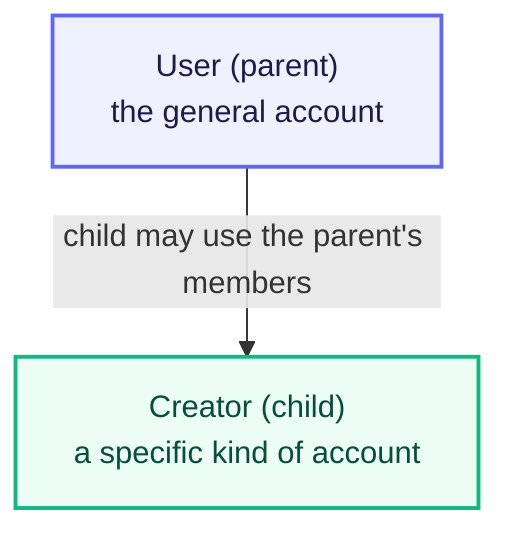
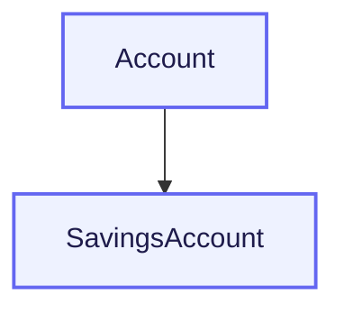
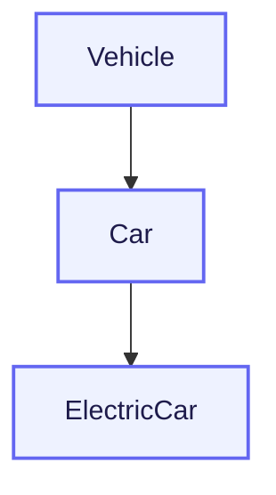
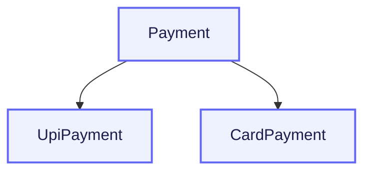
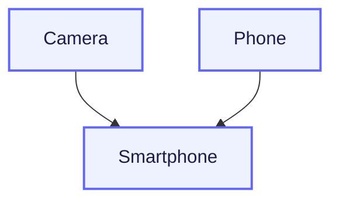
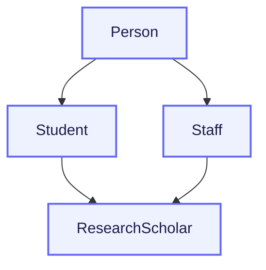

# Inheritance: Reusing Code Across Related Classes

Encapsulation made one class trustworthy. It decided which data outsiders could read, which data they could change, and under what rules. Everything stayed inside a single class.

Real applications are not built from one class. A social media app has ordinary users, creators who earn money, advertisers who spend it, and verified brand pages. These classes are not strangers to each other — a creator *is* a user who does a little more.

Encapsulation has no answer for that overlap. Inheritance does.

## The Need for Code Reuse

Two related classes written independently must repeat whatever they share. Here `User` and `Creator` were written separately, and today the profile format was updated to display a verified tick — but only in one of them.

```python
class User:
    def __init__(self, name):
        self.name = name

    def show_profile(self):
        print(f"Profile: {self.name} ✔")


class Creator:
    def __init__(self, name, earnings):
        self.name = name
        self._earnings = earnings

    def show_profile(self):
        print(f"Profile: {self.name}")

    def show_earnings(self):
        print(f"Earnings: ₹{self._earnings}")


User("Rahul").show_profile()
Creator("Priya", 45000).show_profile()
```

**Output**

```text
Profile: Rahul ✔
Profile: Priya
```

One feature, two different results. Rahul's profile shows the tick and Priya's does not, because the same method existed in two places and only one was updated.

Nothing raised an error. The two classes simply drifted apart, and the app now behaves inconsistently for different account types.

This is why inheritance exists:

- **Shared behaviour is written once.** One copy of `show_profile()`, not two.
- **A change happens in one place.** Update it once and every related class updates with it.
- **A new account type costs almost nothing.** Adding `Advertiser` means writing only what makes an advertiser different.
- **The code matches reality.** A creator really is a kind of user, and the code should say so.

## Inheritance

Inheritance is a way of defining a new class in terms of an existing one, so the new class automatically has access to the existing class's members instead of repeating them. The shared part is written once, and the new class adds only what is different.

The two classes play different roles, and each role has a name.

## The Parent and Child Relationship

The class holding the shared part is the **parent**. The class holding the difference is the **child**.

Which is which is decided by how general each class is:

- The **parent is the more general** class. `User` describes what is true of every account — it has a name and a profile.
- The **child is the more specific** class. `Creator` describes one particular kind of user, the kind that also earns money.

The general class comes first and the specific class is built on top of it. It never happens the other way around, because the specific class needs the general behaviour to exist before it can add to it.

The relationship also runs in one direction only:

- The child can use the parent's members.
- The parent knows nothing about the child and gains nothing from it.
- Two children of the same parent know nothing about each other.



The same two classes are also called base and derived class, or superclass and subclass. Parent and child are used from here onward.

## Declaring a Child Class

A child class is declared by writing the parent's name in brackets after the child's name.

```python
class User:
    def __init__(self, name):
        self.name = name

    def show_profile(self):
        print(f"Profile: {self.name}")


class Creator(User):
    pass


creator1 = Creator("Priya")
creator1.show_profile()
```

**Output**

```text
Profile: Priya
```

`pass` means the class body is empty, so `Creator` defines nothing of its own — no constructor, no method, no attribute.

`Creator("Priya")` still worked because the child used the parent's `__init__`, and `show_profile()` still printed because the child used the parent's method. The duplicated code from the earlier example is gone, replaced by the single word `User` in brackets.

## The is-a and has-a Relationships

Two classes can be related in two different ways, and only one of them is inheritance.

An **is-a relationship** exists when one class is a specific kind of another class. A creator is a kind of user, so `Creator` and `User` stand in an is-a relationship, written as `class Creator(User):`. Inheritance is the tool that implements this relationship, which is why inheritance itself is also called an is-a relation.

A **has-a relationship** exists when one class holds an object of another class. A user owns a wallet, but a wallet is not a kind of user. Inheritance would be wrong here, because `class Wallet(User)` would give a wallet a name and a profile page. Instead the user object stores a wallet object, written as `self.wallet = Wallet()` inside `User`. Building a class this way is called **composition**.

To choose between the two, complete this sentence about the classes: *a Creator is a User*. If that sentence is true, use inheritance. If the only true sentence is *a User has a Wallet*, use composition.

### Confirming an is-a Relationship in Code

`isinstance()` asks whether an object belongs to a class. `issubclass()` asks whether one class inherits from another.

```python
class User:
    pass


class Creator(User):
    pass


print(isinstance(Creator(), User))
print(isinstance(User(), Creator))
print(issubclass(Creator, User))
```

**Output**

```text
True
False
True
```

A `Creator` object counts as a `User`, because the is-a relationship holds. A `User` object does not count as a `Creator`, because that relationship runs in one direction only.

## What the Child Inherits and What It Does Not

With the relationship settled, one question remains: what exactly did `Creator` receive from `User`?

The earlier example suggests the answer is *everything, data included*. That impression breaks the moment a child needs a constructor of its own. Here `Creator` writes one and never involves the parent.

```python
class User:
    def __init__(self, name):
        self.name = name

    def show_profile(self):
        print(f"Profile: {self.name}")


class Creator(User):
    def __init__(self, earnings):
        self._earnings = earnings


creator1 = Creator(45000)
creator1.show_profile()
```

**Output**

```text
Traceback (most recent call last):
  File "app.py", line 15, in <module>
    creator1.show_profile()
  File "app.py", line 6, in show_profile
    print(f"Profile: {self.name}")
                      ^^^^^^^^^
AttributeError: 'Creator' object has no attribute 'name'
```

Where the failure happened matters.

`show_profile()` was found and it started running — the error appears inside that method, on line 6, which is proof the child inherited it. What was missing was `name`.

The reason is that `name` is not stored in the class at all. It is created by the line `self.name = name`, and that line sits inside the parent's `__init__`. `Creator` wrote its own `__init__`, so the parent's `__init__` never ran, so `name` was never created for this object.

That gives the precise rule:

- **Methods are inherited.** The child can call them without writing anything.
- **The parent's object data is not inherited.** It is created, and only while the parent's `__init__` is running.
- **Protected data reaches the child, private data does not.** `_followers` works inside `Creator`. `__email` does not, because Python renames a private attribute using the class where the line is written, so `Creator` searches for `_Creator__email` and finds nothing.

So a parent marks data `_name` when children are meant to use it, and `__name` when they are not.

In the previous example the child had no `__init__` of its own, so Python used the parent's, which is why `name` existed there. The moment a child writes its own `__init__`, it takes that job over — and must run the parent's constructor deliberately.

## Using super() to Reach the Parent

**`super()`** is how a child reaches its parent. Inside any method of the child, `super()` stands for the parent class.

It has three uses.

**1. Running the parent's constructor.** `super().__init__(...)` executes the parent's `__init__`, which creates the parent's object data for this object. This is the fix for the failure above.

```python
class User:
    def __init__(self, name):
        self.name = name

    def show_profile(self):
        print(f"Profile: {self.name}")


class Creator(User):
    def __init__(self, name, earnings):
        super().__init__(name)
        self._earnings = earnings

    def show_earnings(self):
        print(f"Earnings: ₹{self._earnings}")


creator1 = Creator("Priya", 45000)
creator1.show_profile()
creator1.show_earnings()
```

**Output**

```text
Profile: Priya
Earnings: ₹45000
```

The failure is gone. `super().__init__(name)` let the parent create `name`, and the next line created what only a creator has. The rule worth memorising: **if a child defines `__init__`, its first line is normally `super().__init__(...)`.**

**2. Calling any of the parent's methods.** The same syntax works for methods, written as `super().show_profile()`. While the child has no method of its own by that name, plain `self.show_profile()` does the same thing, so `super()` is not needed yet. It becomes necessary when the child defines its own version of a method the parent already has — the situation the next chapter deals with.

**3. Referring to the parent without naming it.** `super()` never mentions `User`. Rename the parent class, or place the child under a different parent, and every `super()` call inside the child keeps working.

## Types of Inheritance

Python supports five types, named after the shape the classes form. All five are built from the same `class Child(Parent)` line.

### Single Inheritance

One child inherits from one parent.



**Where you see it:** a banking app. Every account holds a number, a holder name, and a balance. A savings account is an account that additionally earns interest, so it is written as `class SavingsAccount(Account):` and adds only the interest calculation.

### Multilevel Inheritance

A child becomes the parent of the next class, forming a chain. The last class can use members from every class above it.



**Where you see it:** a vehicle registration system. `Vehicle` holds the registration number, `Car` adds the number of seats, and `ElectricCar` adds battery capacity. An electric car still has the registration number defined two levels above it.

### Hierarchical Inheritance

Two or more children inherit from the same parent. The children are unrelated to each other.



**Where you see it:** the checkout screen of any Indian shopping app. Every payment has an amount, a date, and a status. UPI payments add a VPA, card payments add the last four digits. Both are payments; neither is a kind of the other.

### Multiple Inheritance

One child inherits from more than one parent at once, written as `class Smartphone(Camera, Phone):`.



**Where you see it:** the device in your hand. A smartphone genuinely is a camera and a phone at the same time, so it takes members from both.

When both parents define the same method, Python searches them left to right and uses the first match, so `Camera` would win above. That search order is called the **method resolution order**, shortened to MRO.

### Hybrid Inheritance

Two or more of the above types combined in one design.



**Where you see it:** a university records system. `Student` and `Staff` are both children of `Person`, which is hierarchical. A research scholar who also teaches is both a student and a staff member, so `class ResearchScholar(Student, Staff):` is multiple inheritance. The two shapes together make the design hybrid, and Python uses the MRO to decide which `Person` member applies.

## Practice Exercises

Build a food delivery app's account hierarchy, one step at a time. Each task continues the file from the task before it.

1. **Declare a child that adds nothing.** Write `Account` with `__init__(self, name)` and a `show()` method that prints the name. Then write `class Restaurant(Account): pass`. Create a `Restaurant` object and call `show()`. It works even though `Restaurant` is empty.

2. **Give the child a method of its own.** Add a method `show_type()` to `Restaurant` that prints `This is a restaurant account.` Call `show()` and `show_type()` on the same object. One method came from the parent, the other from the child.

3. **Watch the constructor break.** Give `Restaurant` its own `__init__` that accepts only `rating` and sets `self._rating`, with no `super()` call. Create the object and call `show()`. Read the `AttributeError` and write down which attribute went missing and why.

4. **Repair it with super().** Change that `__init__` to accept `name` and `rating`, with `super().__init__(name)` as its first line. Call `show()` again and confirm it works.

5. **Name the shape.** Add `class DeliveryPartner(Account): pass`. You now have one parent with two children — name which type of inheritance that is. Then print `isinstance()` and `issubclass()` results to prove a `DeliveryPartner` object counts as an `Account`.

---

Every child in this chapter did one of two things: it used the parent's methods exactly as they were, or it added new methods of its own.

A third possibility was never tried. What if a child needs its own version of a method the parent already has — a `Creator` whose profile line must look different from a plain `User`'s? The method name stays the same, but the behaviour changes depending on which object is calling it.

That is the third pillar. The next chapter covers **Polymorphism**.

---

## Reference Links

- [Python Official Docs — Inheritance](https://docs.python.org/3/tutorial/classes.html#inheritance)
- [Python Official Docs — Multiple Inheritance](https://docs.python.org/3/tutorial/classes.html#multiple-inheritance)
- [Python Official Docs — `super()`](https://docs.python.org/3/library/functions.html#super)
- [Python Official Docs — Method Resolution Order](https://docs.python.org/3/glossary.html#term-method-resolution-order)
- [W3Schools — Python Inheritance](https://www.w3schools.com/python/python_inheritance.asp)
- [GeeksforGeeks — Types of Inheritance in Python](https://www.geeksforgeeks.org/python/types-of-inheritance-python/)
