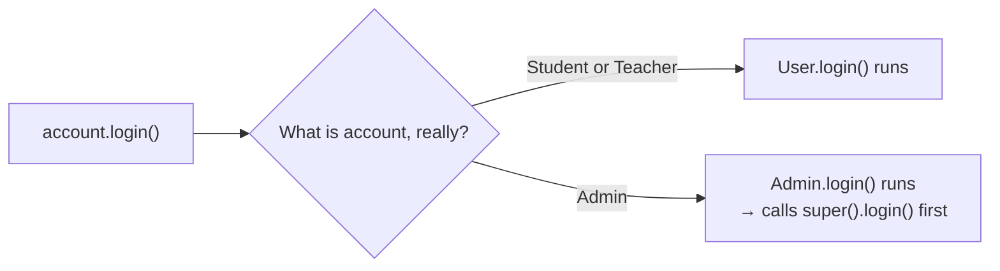

# Polymorphism — One Call, Many Behaviors

In the Inheritance chapter, we learned how `Student`, `Teacher`, and `Admin` all share one `User` parent's code — including the private `password` we encapsulated back in the Encapsulation chapter — instead of duplicating it in every class.

But inheritance quietly assumed something: that every child was happy running the parent's version of a method exactly as written. `Admin` never needed anything different from `User.login()` — until it did.

This chapter is about what happens the moment a child needs to behave differently, and why Python lets you call the exact same method name on completely different objects and get exactly the behavior each one deserves.

---

## When Shared Code Isn't Quite Enough

Every role — student, teacher, admin — currently logs in through the exact same inherited method. Nothing about `Admin` has changed since the Inheritance chapter.

```python
class User:
    def __init__(self, name, email, password=None):
        self.name = name
        self.email = email
        self.__password = password

    def login(self):
        print(f"{self.name} logged in.")

    def logout(self):
        print(f"{self.name} logged out.")

    def get_password(self):
        return self.__password

    def set_password(self, new_password):
        self.__password = new_password


class Admin(User):

    def create_user(self):
        print(f"{self.name} created a new user.")
```

```python
admin = Admin("Priya", "priya@example.com")
admin.login()
```

```text
Priya logged in.
```

That's worked fine so far. But security just asked for one more thing: every time an admin logs in, the system should also confirm a security check passed — and only for admins. Students and teachers don't need this at all.

Where does that one line of code go?

It can't go inside `User.login()` — that would force the security message onto students and teachers too, and they were never supposed to see it. It can't go outside the class either, because then every place in the codebase that calls `.login()` would need to remember to print the extra line itself — the exact duplication problem the Inheritance chapter solved.

What we need is a way for `Admin` to keep using `User.login()`'s behavior, while adding its own piece on top of it — only for itself.

---

## Overriding — Replacing the Parent's Version

Python allows a child class to define a method with the exact same name as one in its parent. When that happens, the child's version runs instead. Let's try the obvious approach first, before reaching for anything more careful.

```python
class User:
    def __init__(self, name, email, password=None):
        self.name = name
        self.email = email
        self.__password = password

    def login(self):
        print(f"{self.name} logged in.")

    def logout(self):
        print(f"{self.name} logged out.")

    def get_password(self):
        return self.__password

    def set_password(self, new_password):
        self.__password = new_password


class Admin(User):

    def create_user(self):
        print(f"{self.name} created a new user.")

    def login(self):
        print("Security check passed for admin access.")
```

```python
admin = Admin("Priya", "priya@example.com")
admin.login()
```

```text
Security check passed for admin access.
```

Where did `"Priya logged in."` go?

It's gone — completely. `Admin.login()` didn't add to `User.login()`; it replaced it outright. Python found a `login()` on `Admin` and used only that one, so the parent's version never ran at all. This is method overriding working exactly as designed — the child's version wins — but it's rarely what we actually want. Losing the original behavior just to add one line on top of it is a real cost.

What we need is a way to keep running `User.login()` *and* add to it, instead of overwriting it. That's exactly what `super()` gives us.

```python
class Admin(User):

    def create_user(self):
        print(f"{self.name} created a new user.")

    def login(self):
        super().login()
        print("Security check passed for admin access.")
```

```python
admin = Admin("Priya", "priya@example.com")
admin.login()
```

```text
Priya logged in.
Security check passed for admin access.
```

Two things happened here, and both matter. `Admin` didn't need to rewrite what `login()` already did — `super().login()` reused the parent's version exactly as it was, the same tool that reused `__init__` in the Inheritance chapter. And `Admin` added its own line underneath it, without touching `User`, `Student`, or `Teacher` at all.

> **Method Overriding:** when a child class defines a method with the same name as one in its parent, the child's version runs in its place. The parent's version isn't gone — it's still reachable through `super()`, whenever the child chooses to build on it instead of replacing it outright.

### When Should You Override?

Override when a child needs to:

- add extra behavior on top of the parent's,
- run genuinely different behavior instead of the parent's,
- or skip part of what the parent does entirely.

Don't override just to retype code that would already work unchanged — if the child's version would end up identical to the parent's, there's nothing to override; let inheritance do that job instead.

---

## Same Call, Different Behavior

Step back and look at what this actually means for the code that calls `.login()`.

```python
class User:
    def __init__(self, name, email, password=None):
        self.name = name
        self.email = email
        self.__password = password

    def login(self):
        print(f"{self.name} logged in.")

    def logout(self):
        print(f"{self.name} logged out.")

    def get_password(self):
        return self.__password

    def set_password(self, new_password):
        self.__password = new_password


class Student(User):

    def __init__(self, name, email, student_id):
        super().__init__(name, email)
        self.student_id = student_id

    def enroll_course(self, course):
        print(f"{self.name} enrolled in {course}.")


class Teacher(User):
    def grade_assignment(self):
        print(f"{self.name} graded an assignment.")


class Admin(User):

    def create_user(self):
        print(f"{self.name} created a new user.")

    def login(self):
        super().login()
        print("Security check passed for admin access.")
```

```python
accounts = [
    Student("Rahul", "rahul@example.com", "S101"),
    Teacher("Ananya", "ananya@example.com"),
    Admin("Priya", "priya@example.com"),
]

for account in accounts:
    account.login()
```

```text
Rahul logged in.
Ananya logged in.
Priya logged in.
Security check passed for admin access.
```

The loop never asks what kind of account it's holding. It never writes `if isinstance(account, Admin)`. Every single iteration runs the exact same line — `account.login()` — and yet Priya's login did something Rahul's and Ananya's didn't.

Python decided, at the moment each line actually ran, which version of `login()` applied — based on the real object sitting in `account`, not on how the loop was written. Because that decision happens while the program is running, rather than being fixed in advance, this is often called **runtime polymorphism**. That's the essence of the third pillar.

> **Polymorphism** means the same method call can produce different behavior depending on the object it's called on. The code that calls the method never changes; only the object underneath does.

Say that once more, on its own, because it's the entire idea: only the object changes. The code making the call stays exactly the same.

The word comes from Greek — *poly* (many) and *morph* (form) — literally, *many forms*. One call, many forms of behavior.



Every object in that loop got its behavior this way because it descended from `User`. That's one route to polymorphism. Is it the only one?

---

## Polymorphism Beyond Inheritance — Duck Typing

Let's find out by handing `.login()` to something that has no connection to `User` whatsoever.

Consider a `Guest` — someone browsing the platform without ever creating an account. It has nothing to do with `User`. It doesn't inherit from it, and it never will; a guest has no email and no password, nothing worth encapsulating.

```python
class User:
    def __init__(self, name, email, password=None):
        self.name = name
        self.email = email
        self.__password = password

    def login(self):
        print(f"{self.name} logged in.")

    def logout(self):
        print(f"{self.name} logged out.")

    def get_password(self):
        return self.__password

    def set_password(self, new_password):
        self.__password = new_password


class Admin(User):

    def create_user(self):
        print(f"{self.name} created a new user.")

    def login(self):
        super().login()
        print("Security check passed for admin access.")


class Guest:

    def login(self):
        print("Browsing as a guest — no account required.")
```

```python
def start_session(account):
    account.login()

start_session(Admin("Priya", "priya@example.com"))
start_session(Guest())
```

```text
Priya logged in.
Security check passed for admin access.
Browsing as a guest — no account required.
```

`start_session()` never checks what class `account` is — it only calls `.login()` and trusts it to exist. `Admin` and `Guest` share no ancestor at all, yet both work here, because both happen to define a `login()` method.

Python has a name for this: **duck typing**, from the old saying — if it walks like a duck and quacks like a duck, treat it as a duck. Don't check what an object *is*; check what it *can do*.

> **Duck Typing:** Python doesn't check an object's class before calling a method — only whether the object actually has that method.

Put simply, Python asks *"Can you do this?"* — never *"What are you?"*

Here's why that's useful: `start_session()` can now accept a `Bot`, a test double, or any class written next year — anything with a `.login()` method — without ever being changed, and without forcing those classes into `User`'s family tree just to qualify. Reach for this whenever a function's real requirement is "has this method," not "is this specific class."

This is also why `isinstance()` and `issubclass()`, from the Inheritance chapter, are used carefully in Python: checking an object's exact class can reject something that would have worked perfectly well.

---

## What Python Doesn't Do — Method Overloading

We've now seen two ways the same call can behave differently: overriding and duck typing. One question remains: can a single class have two methods with the same name, and let Python pick the right one based on how many arguments arrive?

Many OOP languages support this — it's called **method overloading**. Python doesn't. Let's see what happens if we try it anyway.

```python
class Notifier:

    def send(self, message):
        print(f"Sending: {message}")

    def send(self, message, urgent):
        print(f"[URGENT] {message}" if urgent else f"Sending: {message}")
```

```python
notifier = Notifier()
notifier.send("Class starts in 10 minutes")
```

```text
TypeError: Notifier.send() missing 1 required positional argument: 'urgent'
```

Why this fails:

- A class stores one function per name.
- The second `send` overwrites the first — it doesn't sit alongside it.
- By the time `notifier.send(...)` runs, only one version has ever existed.

Java avoids this by checking your arguments before the program runs, and keeping every version you wrote. Python skips that step: it never checks argument types up front (one method can already accept anything), and it prefers one clear method over several near-identical ones.

So instead of writing a second `send`, Python solves this the other way around: keep one method, and change its *parameters* so that single method can handle every case itself. Three tools do this, each covering a different kind of "different."

**One optional value — a default argument.**

```python
class Notifier:

    def send(self, message, urgent=False):
        print(f"[URGENT] {message}" if urgent else f"Sending: {message}")
```

```python
notifier = Notifier()
notifier.send("Class starts in 10 minutes")
notifier.send("Server is down", urgent=True)
```

```text
Sending: Class starts in 10 minutes
[URGENT] Server is down
```

Same idea as `password=None` in `User.__init__` — one method, one definition, and a default that covers the case where `urgent` isn't mentioned.

**Any number of values — `*args`.**

A default argument only ever adds *one* extra value. What if the number of things to send isn't one-or-two, but genuinely unknown — one message today, five tomorrow? That's what `*args` is for, by definition: writing `*` before a parameter name tells Python "however many positional arguments show up here, collect all of them into a single **tuple**, instead of expecting one fixed value." The method still has just one parameter to define — Python does the collecting.

```python
class Notifier:

    def send(self, *messages):
        for message in messages:
            print(f"Sending: {message}")
```

```python
notifier = Notifier()
notifier.send("Class starts in 10 minutes")
notifier.send("Class starts in 10 minutes", "Don't forget your homework")
```

```text
Sending: Class starts in 10 minutes
Sending: Class starts in 10 minutes
Sending: Don't forget your homework
```

`messages` is that tuple. One call sent it one item, the other sent it two — same method, same definition, no `TypeError` either way.

**Any number of named values — `**kwargs`.**

`*args` only collects arguments by *position* — it has no idea what to call any of them. What if an extra should be identified by *name* instead, like an optional `urgent` flag? That's what `**kwargs` is for, by definition: writing `**` before a parameter name tells Python "however many `name=value` pairs show up here, collect all of them into a single **dictionary**, keyed by those names."

```python
class Notifier:

    def send(self, *messages, **details):
        for message in messages:
            print(f"Sending: {message}")
        if details.get("urgent"):
            print("Marked as urgent.")
```

```python
notifier = Notifier()
notifier.send("Server is down", urgent=True, channel="email")
```

```text
Sending: Server is down
Marked as urgent.
```

`details` is that dictionary: `{"urgent": True, "channel": "email"}`.

One note covering both: `messages` and `details` aren't special names — only the `*` and `**` matter to Python. You'll see `*args` and `**kwargs` almost everywhere else, but that's convention, not a rule.

None of these three are overloading. There is still exactly one `send`. They don't let Python choose between versions — they let one method flex to fit more cases.

| Tool | Collects | Data Type | Solves |
|---|---|---|---|
| Default argument | One optional value | Whatever type the value is | "One optional extra value" |
| `*args` | Any number of positional values | Tuple | "Any number of values" |
| `**kwargs` | Any number of named values | Dictionary | "Any number of named extras" |

The one thing none of them cover: genuinely *different* argument types running *different* logic. Python has no built-in answer for that — the honest fix is an `isinstance()` check inside one method, or simply two differently-named methods.

*(Python does let you overload something else: operators. Teaching `+` or `==` to behave differently for your own objects is called operator overloading, done through special methods like `__add__` — a separate idea, covered later.)*

---

## The Three Faces of Polymorphism at a Glance

| Form | Uses Inheritance? | What Changes | Decided | Python Support | Example Here |
|---|---|---|---|---|---|
| Method Overriding | Yes | A child's version replaces the parent's | At runtime, based on the object's real class | Fully supported | `Admin.login()` |
| Duck Typing | No | Any object with the right method qualifies — no shared parent needed | At runtime, based on what methods exist | Fully supported, very idiomatic | `Guest.login()` |
| Method Overloading | No | Same name, different parameter lists, within one class | Before the program runs (in languages that support it) | Not supported — a later definition replaces the earlier one; use a default argument, `*args`, or `**kwargs` instead | `Notifier.send()` |

---

## Hands-On Practice

Try these before moving to the next chapter. Don't just read them — write and run the code.

1. **Override with intent.** Give `Teacher` its own `logout()` that calls `super().logout()` and then prints `"Grades were auto-saved before logging out."`. Confirm `Student` and `Admin` still log out with the plain, inherited message.

2. **Duck typing, your way.** Write a `Bot` class with no relation to `User` at all, with its own `login()` that prints `"Automated bot session started."`. Pass a `Bot` object into the same `start_session()` function used for `Admin` and `Guest`, and confirm it works without any changes to `start_session()`.

3. **Spot the overload trap.** Write a class with two methods named `describe` — one taking no extra arguments, one taking an extra `detail` argument. Call it and read the error carefully. Then fix it using a single method with a default argument, the same way `Notifier.send()` was fixed.

---

## Key Takeaways

- Method overriding lets a child replace — or, using `super()`, extend — a method it inherited from its parent.
- Polymorphism means the same method call runs different code depending on the real object behind it, decided at runtime.
- Duck typing is polymorphism without inheritance: Python only checks whether the method exists, not which class defined it.
- Python does not support method overloading; a later definition of the same method name simply replaces the earlier one.
- Default arguments cover "one optional extra value"; `*args` covers "any number of positional values"; `**kwargs` covers "any number of named values" — together they replace most of what overloading is used for elsewhere, without ever being overloading themselves.
- `args` and `kwargs` are just naming conventions, not requirements — the `*` and `**` are what Python actually reads, so `*items` or `*whatever` would work the same way.
- Operator overloading (`__add__`, `__eq__`, and friends) is a different, supported concept from method overloading — covered later, in special methods.

---

## Chapter Summary

Throughout this chapter, we focused on one central idea:

> **The same method call can mean something different, depending on the object that receives it — and the calling code never needs to know which version it's getting.**

We saw a child class override an inherited method and extend it with `super()`, watched a single loop produce three different behaviors from three different objects, and confirmed that Python cares about which methods an object has far more than which class it came from. We also saw the one place Python draws a firm line — method overloading — and how default arguments fill that gap instead.

This is the essence of polymorphism.

Every version of `login()` we've written across `User`, `Admin`, and `Guest` has quietly trusted something: that whichever object shows up, it actually implements the method correctly. Nothing so far has forced that to be true. In the next chapter, we'll explore the fourth and final pillar of Object-Oriented Programming—Abstraction—where we make that trust a guarantee instead of an assumption.

---

## Reference Links

-   [Python Official Docs Glossary — Duck-Typing](https://docs.python.org/3/glossary.html#term-duck-typing)
-   [W3Schools — Python Polymorphism](https://www.w3schools.com/python/python_polymorphism.asp)
-   [Python Official Docs — Data Model (Special/Dunder Methods)](https://docs.python.org/3/reference/datamodel.html#special-method-names)
