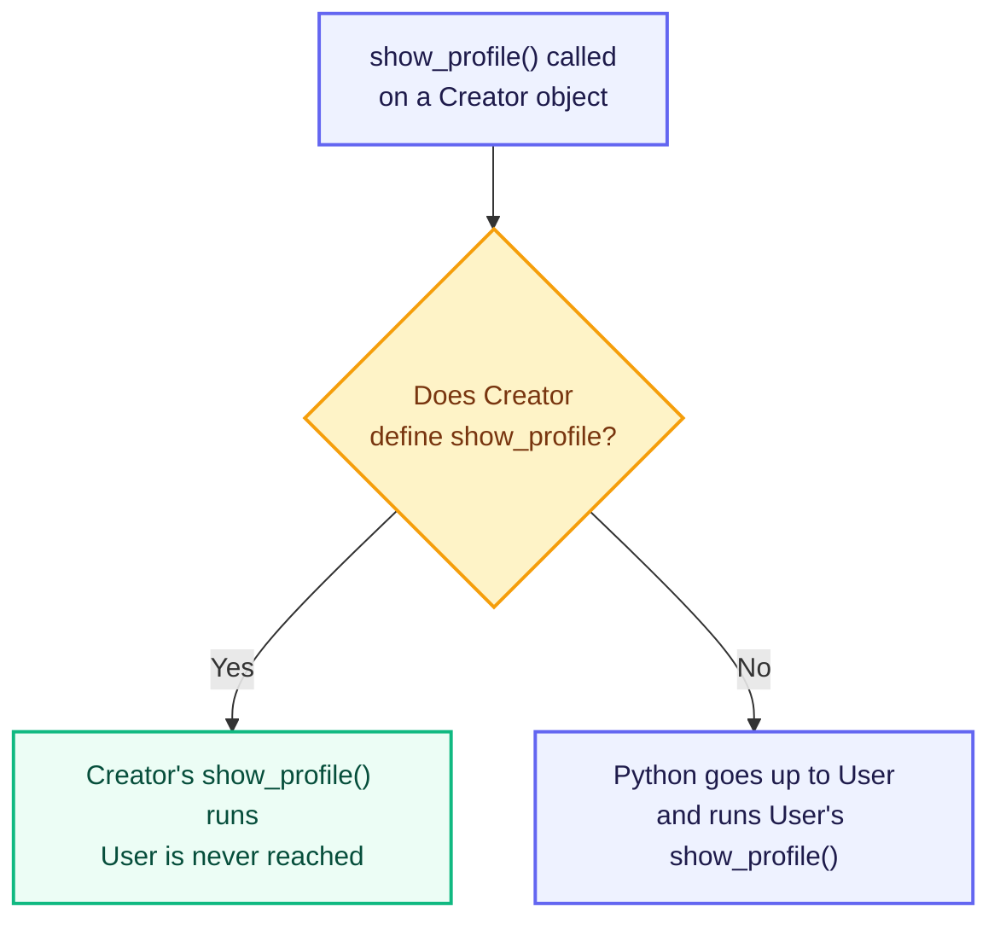

# Polymorphism: One Name, Many Behaviours

Every child class in the previous chapter did one of two things. It used the parent's methods exactly as they were, or it added new methods of its own.

A third possibility was left open. A `Creator` needs a profile line that shows earnings, and the parent's `show_profile()` knows nothing about earnings. The child does not want a new method name — `show_profile()` is the right name. It wants its own version of that same name.

The word for one name behaving differently in different places is **polymorphism**. It comes from the Greek *poly*, meaning many, and *morph*, meaning form. This chapter starts with the situation above. Step by step it widens, until the same name works across classes that are not related at all.

## Method Overriding

So the child writes its own `show_profile()`. The parent already has a method with that name. The child's version now takes over for every `Creator` object.

This is called **method overriding**.

```python
class User:
    def __init__(self, name):
        self.name = name

    def show_profile(self):
        print(f"Profile: {self.name}")


class Creator(User):
    def __init__(self, name, earnings):
        super().__init__(name)
        self._earnings = earnings

    def show_profile(self):
        print(f"Creator: {self.name} | Earnings: ₹{self._earnings}")


rahul = User("Rahul")
priya = Creator("Priya", 45000)

rahul.show_profile()
priya.show_profile()
```

**Output**

```text
Profile: Rahul
Creator: Priya | Earnings: ₹45000
```

Both lines called the same method name, `show_profile()`, and got different results. Python decides which version to run by looking at the class the object was created from:



Python looks inside the class the object was made from, and stops at the first match.

`rahul` was made from `User`, so Python runs `User`'s `show_profile()`.

`priya` was made from `Creator`. Python finds a `show_profile()` there and runs it, never reaching `User`.

`User`'s own method is untouched. `Creator` added a version for itself and left the parent alone.

Overriding needs two classes with inheritance between them: one writes the method, the other writes it again.

## Keeping the Parent's Method and Adding to It

The override above threw the parent's work away. `User.show_profile()` already knew how to print the name, and `Creator` printed it again in its own words.

A child does not have to replace the parent's method. It can run the parent's method first and then add its own lines. Inside `Creator`, the call `super().show_profile()` reaches past `Creator`'s own version and runs the one in `User`.

```python
class User:
    def __init__(self, name):
        self.name = name

    def show_profile(self):
        print(f"Profile: {self.name}")


class Creator(User):
    def __init__(self, name, earnings):
        super().__init__(name)
        self._earnings = earnings

    def show_profile(self):
        super().show_profile()
        print(f"Earnings: ₹{self._earnings}")


Creator("Priya", 45000).show_profile()
```

**Output**

```text
Profile: Priya
Earnings: ₹45000
```

`Creator` wrote one extra line and reused the rest. If `User` changes how a profile line looks tomorrow, `Creator` picks up that change without being edited.

`self.show_profile()` would not work here. `Creator` has a method by that name — this one — so it would call itself endlessly. `super()` is what skips the child's own version and reaches `User`.

## Duck Typing

Every class so far has had a parent. `Creator` and `Advertiser` were both children of `User`. It is easy to assume that shared parent is what made the overriding work.

Python does not need the parent.

When you write `account.show_profile()`, Python does not check which class `account` belongs to. It looks on that object for a method named `show_profile`. If the method is there, Python calls it. If it is not there, the program stops with an error at that line.

The name comes from an old saying: if something walks like a duck and quacks like a duck, treat it as a duck. Python treats objects the same way. It does not ask *what class are you*. It asks *do you have the method I am about to call*. This is called **duck typing**.

```python
class Creator:
    def __init__(self, name):
        self.name = name

    def show_profile(self):
        print(f"Creator: {self.name}")


class Advertiser:
    def __init__(self, name):
        self.name = name

    def show_profile(self):
        print(f"Advertiser: {self.name}")


for account in [Creator("Priya"), Advertiser("Zomato")]:
    account.show_profile()
```

**Output**

```text
Creator: Priya
Advertiser: Zomato
```

Look at the two class lines. Neither has brackets after the class name. There is no `User` class in this program and no parent anywhere. The loop still worked, because both objects had a method called `show_profile()`, and that was the only thing the loop needed.

Two things this gives you:

- The loop has no `if` checking the account type. Adding a third kind of account means writing that class and putting it in the list. The loop itself is never touched.
- Classes that are unrelated can be used together. In Java or C++ you would first have to give them a common parent. In Python you do not.

And the price you pay for it: Python cannot warn you early. Suppose one object in the list has no `show_profile()`. You find out only when the loop reaches that object. The program stops there.

## Method Overloading and Why Python Does Not Support It

Other object-oriented languages allow a second use of one name inside a *single* class: two methods with the same name but different parameters. Called `post(text)` and it uses one version; called `post(text, tag)` and it uses the other. This is **method overloading**, and Python does not support it.

Here are both versions written into one class.

```python
class Creator:
    def post(self, text):
        print(f"Posted: {text}")

    def post(self, text, tag):
        print(f"Posted: {text} #{tag}")


priya = Creator()
priya.post("Hello", "python")
priya.post("Hello")
```

**Output**

```text
Posted: Hello #python
Traceback (most recent call last):
  File "app.py", line 11, in <module>
    priya.post("Hello")
TypeError: Creator.post() missing 1 required positional argument: 'tag'
```

The two-argument call worked. The one-argument call failed, and the error message names the reason: the only `post` the class has is the two-parameter one.

The reason is how `def` works. A `def` inside a class creates a name in that class and attaches a function to it. The second `def post` reuses the same name, so it simply replaces what the first one attached. The first function is gone — not stored, not hidden, gone. Python identifies a method by its **name alone**. It never looks at how many parameters a method takes. So there is nothing left that could tell two versions apart.

Languages that support overloading pick the version by matching the arguments before the program runs. Python resolves names while the program runs, and it matches on the name only. That is why the feature does not exist here.

## Accepting Any Number of Arguments with *args and **kwargs

The goal behind method overloading is still reasonable — one method that copes with different numbers of arguments. Python reaches it a different way, with one method that accepts a variable number of arguments.

- `*args` collects any number of extra positional arguments into a tuple.
- `**kwargs` collects any number of extra keyword arguments into a dictionary.

The names `args` and `kwargs` are only a convention. The `*` and `**` are what matter.

```python
class Creator:
    def post(self, text, *tags):
        print(f"Posted: {text}")
        for tag in tags:
            print(f"  #{tag}")

    def update_profile(self, **details):
        for key, value in details.items():
            print(f"{key}: {value}")


priya = Creator()
priya.post("Hello")
priya.post("Hello", "python", "oop")
priya.update_profile(city="Chennai", language="Tamil")
```

**Output**

```text
Posted: Hello
Posted: Hello
  #python
  #oop
city: Chennai
language: Tamil
```

`post()` was called with one argument and then with three, and one definition served both. Inside the method, `tags` was an empty tuple the first time and held two items the second time.

`update_profile()` was called with named arguments it was never told to expect. Inside the method, `details` held exactly what was passed, as a dictionary.

This is what replaces method overloading in Python. Instead of several definitions chosen by argument count, there is one definition that inspects what it received.

## Compile-Time and Run-Time Polymorphism

Polymorphism is classified into two kinds. Both names come from compiled languages such as C++ and Java.

**Compile-time polymorphism** is decided before the program runs. The compiler reads the arguments in the call and picks one of several definitions. Method overloading is the standard example.

Python cannot do this. It matches a method by name while the program runs, and never looks at the argument list to choose between definitions. The closest Python comes is `*args` and `**kwargs` — one method that takes different arguments and decides what to do with them at run time.

**Run-time polymorphism** is decided while the program runs, from the object in hand. Method overriding is the standard example, and Python does support it. The loop in the previous section could not know which `show_profile()` would answer until each object came out of the list.

## Practice Exercises

Build a payment screen for a shopping app, one step at a time. Each task continues the file from the task before it.

1. **A parent and a plain child.** Write `Payment` with `__init__(self, amount)` and a `show()` method that prints the amount. Then write `class UpiPayment(Payment): pass`. Create a `UpiPayment` object and call `show()`.

2. **Override the method.** Give `UpiPayment` its own `show()` that prints the amount and the words `paid by UPI`. Create one `Payment` object and one `UpiPayment` object, call `show()` on each, and confirm the two lines differ.

3. **Extend instead of replacing.** Add `CardPayment(Payment)` with its own `show()` that calls `super().show()` first and then prints `paid by card` on the next line.

4. **One call, three classes.** Put one object of each class into a list and loop over it calling `show()`. Confirm three different outputs come from a single call, with no `if` in the loop.

5. **Watch overloading fail, then fix it.** Add two `refund()` methods to `Payment` — one taking only `self`, one taking `self` and `reason`. Call the no-argument version and read the `TypeError`. Then delete both and write one `refund(self, *reason)` that prints the reason when given and prints `No reason given` when not.

---

Every class in this chapter had to be written out in full before it could be used. A parent gave children something to inherit. But nothing stopped a child from skipping a method the rest of the program depended on. Nothing in `User` said that every account type *must* provide its own `show_profile()`.

Declaring what a child is obliged to provide, while hiding how it is done, is the last pillar.

The next chapter covers **Abstraction**.

---

## Reference Links

- [Python Official Docs — `super()`](https://docs.python.org/3/library/functions.html#super)
- [Python Official Docs — Arbitrary Argument Lists](https://docs.python.org/3/tutorial/controlflow.html#arbitrary-argument-lists)
- [W3Schools — Python Polymorphism](https://www.w3schools.com/python/python_polymorphism.asp)
- [GeeksforGeeks — Polymorphism in Python](https://www.geeksforgeeks.org/python/polymorphism-in-python/)
- [GeeksforGeeks — Method Overloading vs Method Overriding](https://www.geeksforgeeks.org/difference-between-method-overloading-and-method-overriding-in-python/)
