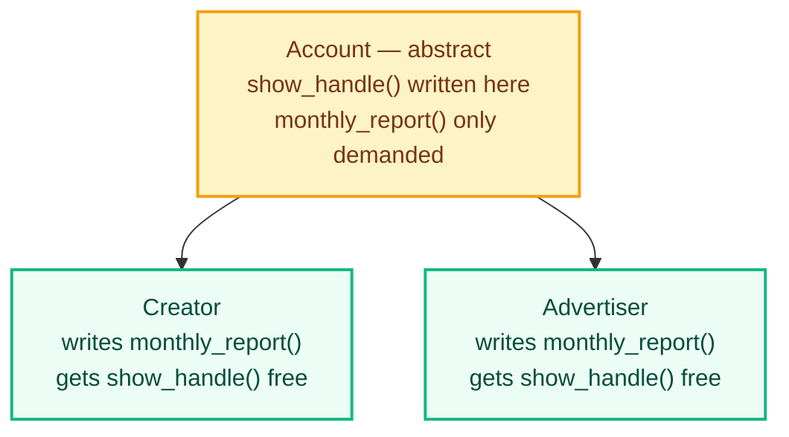

# Abstraction: Showing What Matters and Hiding the Rest

Polymorphism let every class answer the same method name in its own way. A `Creator` printed one kind of report and an `Advertiser` printed another, and the loop calling them worked either way.

But nothing checked whether a class had written that method at all. A class could stay silent, and Python would not complain.

Abstraction deals with two things: how much a class shows to the outside, and what it forces its children to write.

## Abstraction

Abstraction is the practice of exposing only what someone needs in order to use a class. Every detail of how the work is done stays hidden.

The vocabulary comes in four terms.

- An **abstract method** is a method that is declared but deliberately left empty. It states that the method must exist, and nothing more.
- An **abstract class** is a class holding at least one abstract method. It cannot create objects. It exists to be inherited.
- A **concrete method** is an ordinary method, with a working body, written inside that same abstract class.
- Python supplies all of this through a built-in module named **`abc`**, short for *abstract base class*.

Instagram already does this to you. Tapping *Share* on a post runs a compression step, an upload, a content check and a database write. You are shown one button. None of those steps reach your screen, and none of them are your problem.

Turn that around and the second half appears. Instagram's own code needs every account type — personal, creator, business — to be able to produce insights. An account type that could not would break the insights screen for everybody. Somewhere, something has to *require* it.

Encapsulation also hid something, but it hid data, to keep the data safe. Abstraction hides steps, to keep the caller's job small.

## Hiding the Steps Behind One Method

Open Instagram and a creator's followers show as `12.4K`. The number actually stored is `12400`. Something turns one into the other, and you never see it happen.

The class does that work inside itself. Outside code only asks for the profile.

```python
class Creator:
    def __init__(self, handle, followers):
        self.handle = handle
        self.__followers = followers

    def show_profile(self):
        print(f"@{self.handle} | {self.__short_count()} followers")

    def __short_count(self):
        return f"{self.__followers / 1000}K"


Creator("priya_cooks", 12400).show_profile()
```

**Output**

```text
@priya_cooks | 12.4K followers
```

The last line of that program is the only line outside the class. It asks for the profile and gets it.

It never touched the follower number. It never applied the K rule. It did not even know a K rule existed.

That rule now sits in one place. Change your mind tomorrow and show `12K` instead, and only `__short_count()` changes. Every line that calls `show_profile()` keeps working.

Nothing new was needed here. Private methods were enough, and those came from the Encapsulation chapter.

## Why Inheritance Alone Is Not Enough

The second half needs something new, and here is why.

Below, `Account` has a `monthly_report()` method. `Creator` writes its own version. `Advertiser` was built in a hurry and the method was never added.

```python
class Account:
    def __init__(self, handle):
        self.handle = handle

    def monthly_report(self):
        print(f"@{self.handle} | No report available")


class Creator(Account):
    def monthly_report(self):
        print(f"@{self.handle} | Earned: ₹45000")


class Advertiser(Account):
    pass


for account in [Creator("priya_cooks"), Advertiser("zomato")]:
    account.monthly_report()
```

**Output**

```text
@priya_cooks | Earned: ₹45000
@zomato | No report available
```

Python raised nothing. `Advertiser` had no `monthly_report()`, so Python went up to `Account` and used what it found there.

That is the danger. The program runs, the reports page loads, and Zomato's report says nothing. No warning appears anywhere. The mistake surfaces when a customer asks why their report is empty.

What the parent needs is a way to state a requirement rather than a fallback: *every account type must write its own `monthly_report()`, and Python must refuse any class that does not.*

## Declaring an Abstract Class

The line `from abc import ABC, abstractmethod` brings in the two names needed. `ABC` is a class you inherit from. `abstractmethod` is a marker you place above a method.

That marker is written as `@abstractmethod` on the line above. The `@` form is called a **decorator** — it attaches a marker to the method written under it. Here it marks the method as one every child is required to provide.

```python
from abc import ABC, abstractmethod


class Account(ABC):
    def __init__(self, handle):
        self.handle = handle

    @abstractmethod
    def monthly_report(self):
        pass


class Creator(Account):
    def __init__(self, handle, earnings):
        super().__init__(handle)
        self.earnings = earnings

    def monthly_report(self):
        print(f"@{self.handle} | Earned: ₹{self.earnings}")


class Advertiser(Account):
    def __init__(self, handle, spend):
        super().__init__(handle)
        self.spend = spend

    def monthly_report(self):
        print(f"@{self.handle} | Spent: ₹{self.spend}")


for account in [Creator("priya_cooks", 45000), Advertiser("zomato", 80000)]:
    account.monthly_report()
```

**Output**

```text
@priya_cooks | Earned: ₹45000
@zomato | Spent: ₹80000
```

Three things changed from the version above it.

- `Account` now inherits from `ABC`.
- `monthly_report()` in `Account` carries `@abstractmethod`, and its body is only `pass`.
- `Advertiser` could no longer stay empty. It had to write a real report.

`pass` in an abstract method is not laziness. `Account` has nothing sensible to put there, because only the child knows what its own report should say. The parent states the requirement; the child supplies the answer.

Python has no `interface` keyword, which you may have seen in Java. An abstract class whose methods are all abstract does that same job here.

## The Rules Python Enforces

Two rules now hold, and Python applies them on its own.

**An abstract class cannot create an object.**

```python
from abc import ABC, abstractmethod


class Account(ABC):
    def __init__(self, handle):
        self.handle = handle

    @abstractmethod
    def monthly_report(self):
        pass


account = Account("priya_cooks")
```

**Output**

```text
Traceback (most recent call last):
  File "app.py", line 13, in <module>
    account = Account("priya_cooks")
              ^^^^^^^^^^^^^^^^^^^^^^
TypeError: Can't instantiate abstract class Account without an implementation for abstract method 'monthly_report'
```

`Account` describes what an account must be able to do. It never describes a real account, so building one from it is meaningless — and Python says so.

**A child that skips an abstract method cannot create an object either.**

```python
from abc import ABC, abstractmethod


class Account(ABC):
    def __init__(self, handle):
        self.handle = handle

    @abstractmethod
    def monthly_report(self):
        pass


class Advertiser(Account):
    pass


zomato = Advertiser("zomato")
```

**Output**

```text
Traceback (most recent call last):
  File "app.py", line 17, in <module>
    zomato = Advertiser("zomato")
             ^^^^^^^^^^^^^^^^^^^^
TypeError: Can't instantiate abstract class Advertiser without an implementation for abstract method 'monthly_report'
```

This is the rule that closes the hole. That same empty `Advertiser` printed a blank report earlier. Now it stops the program on the line that tries to create it. Caught in seconds, not by a customer weeks later.

Two details are easy to get wrong.

- `@abstractmethod` on its own enforces nothing. Leave out `ABC` and Python will build objects from the class quite happily. `ABC` is what switches the checking on.
- A child must provide every abstract method the parent declares. Missing one out of three leaves the child unusable.

## Mixing Abstract and Concrete Methods

An abstract class is not restricted to abstract methods. It can hold concrete methods too — ordinary ones, with working bodies.

That is worth doing when part of the behaviour is identical for every child. The parent writes that part once and demands only what genuinely differs.

```python
from abc import ABC, abstractmethod


class Account(ABC):
    def __init__(self, handle):
        self.handle = handle

    def show_handle(self):
        print(f"@{self.handle}")

    @abstractmethod
    def monthly_report(self):
        pass


class Creator(Account):
    def monthly_report(self):
        print(f"@{self.handle} | Earned: ₹45000")


priya = Creator("priya_cooks")
priya.show_handle()
priya.monthly_report()
```

**Output**

```text
@priya_cooks
@priya_cooks | Earned: ₹45000
```

`Creator` wrote one method and ended up with two. Displaying a handle is the same for every account type, so `Account` implemented it. A monthly report differs for every account type, so `Account` only asked for it.



## Abstraction and Encapsulation

These two get mixed up constantly, because both hide something. They hide different things, for different reasons.

| Question | Encapsulation | Abstraction |
|---|---|---|
| What is hidden | The data inside an object | The steps inside a method |
| Purpose | Stop the data being changed wrongly | Save the caller from knowing how the work is done |
| Written using | `_handle`, `__handle`, getter and setter methods | `ABC`, `@abstractmethod`, private helper methods |

Encapsulation protects. Abstraction simplifies. Most well-built classes do both, exactly as `Creator` did earlier: a private method out of sight, and one public method as the surface.

## Practice Exercises

Build a delivery app's notification system, one step at a time. Each task continues the file from the task before it.

1. **Watch the silent fallback.** Write an ordinary class `Notifier` with `__init__(self, user)` and a `send()` method printing `no channel set`. Add `class SmsNotifier(Notifier)` with its own `send()` printing an SMS line. Add `class EmailNotifier(Notifier): pass`. Put one of each in a list, loop over it calling `send()`, and note which line is wrong.

2. **Make the parent abstract.** Add `from abc import ABC, abstractmethod` at the top. Make `Notifier` inherit from `ABC` and mark `send()` with `@abstractmethod`, body `pass`. Run the file and read the `TypeError`.

3. **Satisfy the requirement.** Give `EmailNotifier` its own `send()`. Run the loop again and confirm both lines are now correct.

4. **Try to break it.** On a new line, attempt `Notifier("Arun")` directly. Read the `TypeError`, then turn that line into a comment so the file keeps running.

5. **Add a concrete method.** Add `show_user()` to `Notifier` with a working body that prints the user's name. Call it on both children without writing it in either one. Then add a comment naming which method is abstract, which is concrete, and why each belongs where it is.

---

Four pillars, four different questions.

Encapsulation asked who may touch an object's data. Inheritance asked how related classes share what they have in common. Polymorphism asked how one name can serve many classes. Abstraction asked how little a class needs to show, and how much it can demand.

None of them make a program run faster. All of them keep it understandable once it grows past the size one person can hold in their head.

---

## Reference Links

- [Python Official Docs — `abc` module](https://docs.python.org/3/library/abc.html)
- [Python Official Docs — `abc.abstractmethod`](https://docs.python.org/3/library/abc.html#abc.abstractmethod)
- [GeeksforGeeks — Data Abstraction in Python](https://www.geeksforgeeks.org/python/data-abstraction-in-python/)
- [GeeksforGeeks — Abstract Classes in Python](https://www.geeksforgeeks.org/python/abstract-classes-in-python/)
