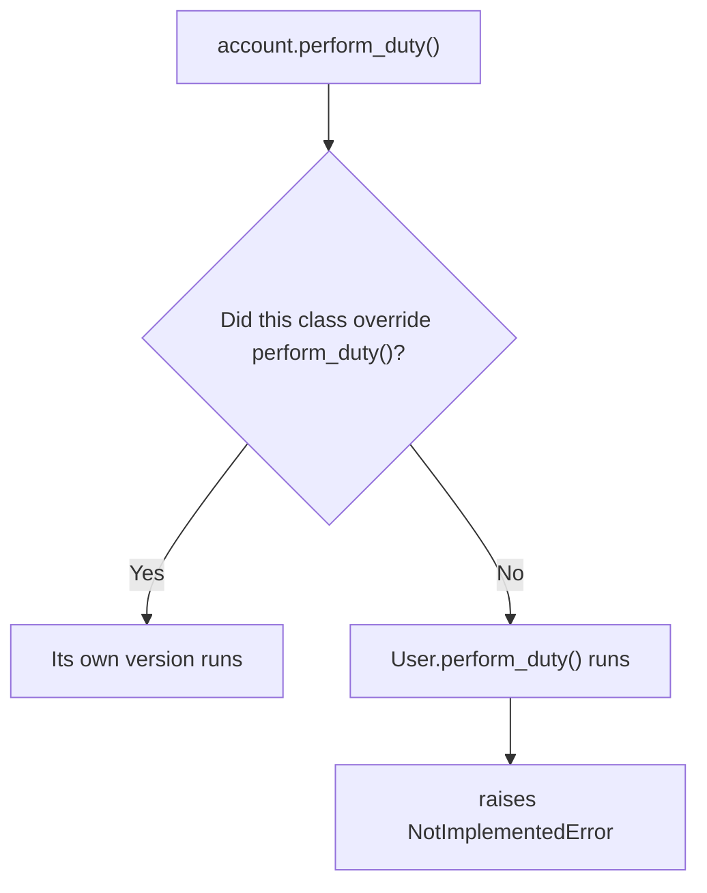

# Abstraction — Hiding Complexity, Exposing Only What Matters

In the Polymorphism chapter, we learned how the same `.login()` call ran a different, correct version depending on whether the object underneath was a `Student`, a `Teacher`, an `Admin`, or even a `Guest` that had nothing to do with `User` at all.

But look closely at what made that work. Every single class we plugged into that loop actually had a working `.login()` method. Nothing forced that to be true — it happened to be true, because we wrote it carefully, every time.

What happens the day someone doesn't? And more quietly: why should `start_session()` ever need to know *how* `.login()` does its job, as long as it does it? This chapter is about closing both gaps at once — guaranteeing that a promised method is actually there, while hiding everything about how it's carried out from whoever calls it.

---

## A New Role, Written in a Hurry

Here's exactly that scenario, playing out on the platform we've been building. It's adding a new role: `Librarian`. Someone on the team writes it quickly, meaning to come back and finish it later.

```python
class User:
    def __init__(self, name, email, password=None):
        self.name = name
        self.email = email
        self.__password = password

    def login(self):
        print(f"{self.name} logged in.")

    def logout(self):
        print(f"{self.name} logged out.")

    def get_password(self):
        return self.__password

    def set_password(self, new_password):
        self.__password = new_password


class Librarian(User):
    pass
```

It compiles. It runs. `librarian.login()` and `librarian.logout()` both work perfectly — inherited from `User`, exactly as `Student` and `Teacher` do.

Now the platform asks every role to expose one more thing: `perform_duty()` — whatever that role's core responsibility actually is. A student enrolls in courses. A teacher grades assignments. An admin creates users. What does a librarian do?

Whoever wrote `Librarian` never got back to it.

```python
librarian = Librarian("Kabir", "kabir@example.com")
librarian.perform_duty()
```

```text
AttributeError: 'Librarian' object has no attribute 'perform_duty'
```

Notice when this error appears. Not when `Librarian` was written. Not when the file was saved, or reviewed, or merged. It appears the moment — possibly weeks later, possibly in production — that something finally tries to call `perform_duty()` on a librarian. By then, whoever wrote the incomplete class may not even remember doing it.

---

## What Is Abstraction?

The `Librarian` problem wasn't really about one missing method. It was about a promise `User` never actually made: *every role must be able to perform its duty, and whoever calls that method shouldn't need to know how each role does it.*

That promise, made explicit and hiding everything behind it, is the fourth pillar.

Before defining it as an OOP term, it's worth knowing what the word itself means. "Abstraction" comes from the Latin *abstrahere* — "to draw away from." In everyday use, an abstraction is a simplified stand-in that pulls attention away from messy detail: a country's outline on a map is an abstraction of its actual roads and rivers; a car's steering wheel is an abstraction of the linkages that actually turn the wheels. You interact with the simple version; the real complexity still exists, just out of view.

> **Abstraction:** deciding what a class must be able to do, and letting the rest of the program rely on that — without exposing, or needing to know, how it's actually done underneath.

Two halves make up that one idea, and this chapter builds both:

- **Guaranteeing the "what."** A class can declare that a method is required, so an incomplete child fails clearly instead of quietly.
- **Hiding the "how."** Once a method exists, callers never need to see its internals — only that calling it works.

Encapsulation protected an object's data. Inheritance let classes share code. Polymorphism let the same call mean different things depending on the object. Abstraction is what makes trusting all of that safe — it turns "this object probably does the right thing" into "this object is guaranteed to."

---

## Declaring a Requirement, Not Just Hoping For One

The real problem isn't that `Librarian` is incomplete. Classes are incomplete all the time, mid-development. The problem is that `User` never actually said `perform_duty()` was required — it just quietly assumed every child would add it eventually.

What if the parent could say so directly — and refuse to stay silent about it? Two pieces of syntax make that possible, and it's worth knowing what each one means before seeing them in code.

- `raise SomeError("message")` deliberately triggers an error on purpose, instead of waiting for one to happen by accident. The instant this line runs, the method stops immediately, and that error — carrying our own message — surfaces to whoever called it.
- `type(self).__name__` asks Python for the *actual* class behind `self`, as a plain **string**. For a `Librarian` object, `type(self)` is the `Librarian` class itself, and `.__name__` reads off its name: `"Librarian"`.

Put together, one line can name whichever subclass forgot to override a method, without us ever hardcoding a class name ourselves.

```python
class User:
    def __init__(self, name, email, password=None):
        self.name = name
        self.email = email
        self.__password = password

    def login(self):
        print(f"{self.name} logged in.")

    def logout(self):
        print(f"{self.name} logged out.")

    def get_password(self):
        return self.__password

    def set_password(self, new_password):
        self.__password = new_password

    def perform_duty(self):
        raise NotImplementedError(
            f"{type(self).__name__} must implement perform_duty()."
        )


class Librarian(User):
    pass
```

`perform_duty()` now exists on `User`, so every subclass technically has it — but its entire body refuses to run, on purpose, with a message naming exactly which class forgot to override it. Reach for this pattern whenever a parent needs to guarantee that every child implements something specific, instead of just hoping they remember to.

It's worth asking why the body raises an error instead of just being left as `pass`, or left out entirely:

- **Leaving `perform_duty()` out entirely** gives the original `AttributeError` — an error, but a generic one that doesn't say a method was *expected*.
- **Writing `def perform_duty(self): pass`** is worse, not better: it "fixes" the error by making the method exist, but calling it does nothing at all — no error, no message, no sign anything is wrong. The mistake goes completely silent, possibly for months.
- **`raise NotImplementedError(...)`** is the middle ground that beats both: it fails immediately, the moment it's called, and it fails with a message that names exactly which class and which method — not a mystery to debug, a message waiting to be read.

```python
librarian = Librarian("Kabir", "kabir@example.com")
librarian.perform_duty()
```

```text
NotImplementedError: Librarian must implement perform_duty().
```

Compare that to the earlier `AttributeError`. Both are errors. Both happen only when `perform_duty()` is actually called. But this one was written by us, deliberately, to say one specific thing: *this class was supposed to override this method, and it didn't.* That's no longer a mystery to debug — it's a message waiting for the right developer to read it.



---

## Finishing the Contract

With the requirement stated clearly, finishing every role becomes straightforward — each one simply overrides `perform_duty()` with its own version.

```python
class User:
    def __init__(self, name, email, password=None):
        self.name = name
        self.email = email
        self.__password = password

    def login(self):
        print(f"{self.name} logged in.")

    def logout(self):
        print(f"{self.name} logged out.")

    def get_password(self):
        return self.__password

    def set_password(self, new_password):
        self.__password = new_password

    def perform_duty(self):
        raise NotImplementedError(
            f"{type(self).__name__} must implement perform_duty()."
        )


class Student(User):
    def __init__(self, name, email, student_id):
        super().__init__(name, email)
        self.student_id = student_id

    def enroll_course(self, course):
        print(f"{self.name} enrolled in {course}.")

    def perform_duty(self):
        print(f"{self.name} is attending classes and completing assignments.")


class Teacher(User):
    def grade_assignment(self):
        print(f"{self.name} graded an assignment.")

    def perform_duty(self):
        print(f"{self.name} is teaching classes and grading assignments.")


class Admin(User):
    def create_user(self):
        print(f"{self.name} created a new user.")

    def perform_duty(self):
        print(f"{self.name} is managing platform accounts.")
```

```python
accounts = [
    Student("Rahul", "rahul@example.com", "S101"),
    Teacher("Ananya", "ananya@example.com"),
    Admin("Priya", "priya@example.com"),
]

for account in accounts:
    account.perform_duty()
```

```text
Rahul is attending classes and completing assignments.
Ananya is teaching classes and grading assignments.
Priya is managing platform accounts.
```

This loop is exactly the polymorphism from the Polymorphism chapter — one call, three behaviors. The difference now is confidence. Every class in that list is contractually guaranteed to have a real `perform_duty()`, not just a hoped-for one. Had `Librarian` been included here unchanged, it would have failed loudly and immediately, naming itself as the reason.

---

## Hiding Complexity, Not Just Enforcing a Rule

Abstraction isn't only about forcing subclasses to override something. It's a habit that already exists everywhere in this platform, quietly.

Calling `student.enroll_course("Python Programming")` doesn't require knowing whether that method checks seat availability, updates a database, or sends a confirmation email — none of that complexity is anyone else's concern. The method offers one simple action; everything behind it is hidden on purpose.

That's the broader idea `perform_duty()` was really teaching: a good class exposes a small, simple interface, and hides whatever machinery sits behind it. Enforcing a required method is one way to apply that idea. Writing simple methods in the first place is another — and it's the one you'll use constantly, whether or not a formal contract is involved.

Put simply, abstraction keeps asking one question: *does the caller need to know how this works, or just that it works?*

---

## The Professional Version — Abstract Base Classes

`NotImplementedError` catches the mistake the moment `perform_duty()` is *called*. Python actually provides a stricter tool that catches it the moment the incomplete class is *created* — before a single method is ever invoked.

That tool lives in the built-in `abc` module, and it works through abstract base classes and abstract methods: a class built this way cannot be instantiated at all while any required method is still missing. Attempting `Librarian(...)` would fail immediately, rather than waiting for `.perform_duty()` to be called later.

The exact syntax leans on decorators (`@abstractmethod`), which we haven't covered yet — so for now, it's enough to know this exists as the formal, production-grade version of the same idea we just built with `NotImplementedError`. It's listed in this chapter's references if you'd like to look ahead.

| | `NotImplementedError` | Abstract Base Class (`abc`) |
|---|---|---|
| Catches the mistake | When `perform_duty()` is called | When `Librarian(...)` is created |
| Needs | Nothing extra — plain Python | `ABC` + `@abstractmethod` (decorators) |
| Best for | Learning the pattern, small scripts | Larger projects, stricter guarantees |

---

## Abstraction vs. Encapsulation

These two pillars get confused constantly, and it's worth being precise about the difference, now that both have been fully built.

| | Encapsulation | Abstraction |
|---|---|---|
| Hides | Data — an object's internal state | Complexity — how an object does its job |
| Achieved through | Private attributes (`__password`), getters, setters | Required methods (`perform_duty()`), simple public interfaces |
| Question it answers | *Who is allowed to change this value, and how?* | *Does the caller need to know how this works?* |
| Example in this platform | `__password`, reachable only via `get_password()`/`set_password()` | `perform_duty()` — every role has one, nobody outside needs to know how |

Encapsulation protects one object's data from the outside. Abstraction decides how much of an object's behavior the outside world even needs to see.

---

## Hands-On Practice

Try these before moving to the next chapter. Don't just read them — write and run the code.

1. **Complete the contract.** Add `perform_duty()` to `Instructor` from the Inheritance chapter, printing something like `"{name} is teaching a certified course."`. Confirm it runs correctly inside the same kind of loop used above.

2. **Watch the contract fail on purpose.** Write a new `Moderator(User)` class that does *not* override `perform_duty()`. Create an object and call `moderator.perform_duty()`. Read the `NotImplementedError` message carefully — confirm it names `Moderator` specifically.

3. **Compare the two errors.** Temporarily remove `perform_duty()` from `User` entirely, and call `.perform_duty()` on a class that never defined it either. Compare that `AttributeError` to the `NotImplementedError` from Exercise 2. Which one tells you more about what went wrong, and why?

---

## Key Takeaways

- Abstraction hides complexity and enforces a contract — it declares what a class must do, without necessarily saying how.
- Raising `NotImplementedError` in a parent method is a deliberate way to force subclasses to override it, producing a clear, descriptive error instead of a vague one.
- Python's `abc` module and `@abstractmethod` provide a stricter version of the same idea, refusing to create an incomplete object at all — using decorators we haven't covered yet.
- Abstraction and encapsulation solve different problems: encapsulation protects data, abstraction hides implementation complexity.
- Every simple, well-named method is a small act of abstraction, whether or not it enforces anything formally.

---

## Chapter Summary

Throughout this chapter, we focused on one central idea:

> **A class should expose only what's necessary to use it, and guarantee that what it promises is actually there.**

We watched an incomplete `Librarian` fail silently, then loudly, then correctly — first with a vague `AttributeError`, then with a deliberate `NotImplementedError` naming exactly what was missing, and finally with every role properly implementing its own `perform_duty()`. We also drew a firm line between abstraction and encapsulation, two pillars that are easy to blur together.

This completes the four pillars of Object-Oriented Programming: Encapsulation protected an object's data, Inheritance let related classes share one implementation, Polymorphism let the same call behave differently depending on the object, and Abstraction guaranteed that behavior was actually there to begin with.

In the next chapter, we'll step back and look at all four pillars together, in the one platform we've been building this whole time — before moving on to how Python's special methods and the `@dataclass` shortcut make classes like these noticeably shorter to write.

---

## Reference Links

-   [Python Official Docs — `abc` — Abstract Base Classes](https://docs.python.org/3/library/abc.html)
-   [Python Official Docs Glossary — Abstract Base Class](https://docs.python.org/3/glossary.html#term-abstract-base-class)
