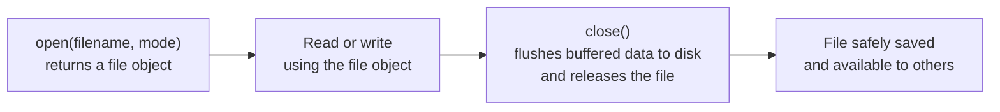
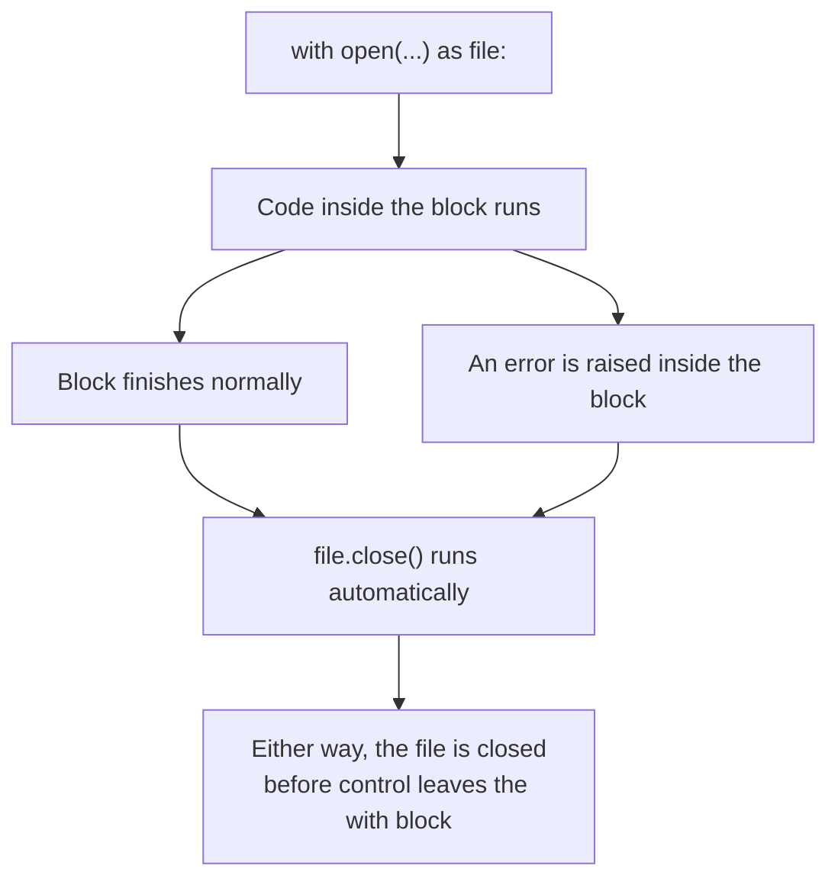

# File Handling

---

[← Previous: 4.3 Special Methods & Dataclasses](../p4-classes-objects/unit-4-3-special-methods-dataclasses.md) | [Go back to TOC](../../README.md) | [Next: 5.2 Errors & Exceptions →](unit-5-2-errors-exceptions.md)

## 1. Learning Objectives

By the end of this unit, you will be able to:

- **Explain** the difference between a text file and a binary file, and between an absolute path and a relative path.
- **Identify** the correct file mode (`r`, `w`, `a`, `r+`) for a given task, and describe exactly what happens to any existing content in each case.
- **Implement** the `with` statement as a context manager to open, use, and automatically close a file — even when an error occurs partway through.
- **Differentiate** between reading a file as a plain-text stream, as CSV rows via the `csv` module, and as structured data via the `json` module.
- **Apply** `csv.reader`/`csv.DictReader` and `json.load`/`json.dump` to read and write two of the most common real-world data formats.
- **Debug** the file-handling mistakes freshers hit most often — a forgotten `close()`, a `FileNotFoundError`, and a mismatched file mode.

---

## 2. Overview

Every program you have written so far in this course has one limitation: the moment it stops running, everything it knew is gone. Variables live only in memory, and memory is wiped clean when a program exits — which is exactly why a Colab runtime restart erases every variable you had defined. That is acceptable for a five-line practice script, but it is not how real software works. A banking app must remember your account balance after you close it. An e-commerce site must remember your order history tomorrow, not just today. A food delivery app must keep a log of every order placed, so support staff can look it up next week.

The mechanism that makes this possible is the **file** — data written to disk, where it survives after the program that created it has ended. Reading and writing files correctly is one of the most universally used skills in software engineering: log files, configuration files, exported reports, and API responses are all, underneath, just files being opened, read, or written. Almost every Indian IT service company, product startup, and AI/ML team you will work for expects you to comfortably read a CSV export or parse a JSON response on day one. This unit teaches exactly that — opening files safely, closing them correctly, and working with the two data formats you will meet constantly: CSV and JSON.

---

## 3. Description

### 3.1 Definition

A **file** is a named collection of data stored permanently on a storage device (like a hard disk or SSD), as opposed to a variable, which exists only in the computer's temporary memory (RAM) while a program runs. Python represents an open file using a **file object** — an object returned by Python's built-in `open()` function that you use to read from, or write to, the underlying file on disk.

Files come in two broad kinds:

- A **text file** stores human-readable characters — letters, digits, punctuation — encoded using a scheme such as UTF-8. `.txt` notes, `.csv` spreadsheets, and `.json` data files are all text files, and this entire unit works with them.
- A **binary file** stores raw bytes not meant to be interpreted as characters — images (`.jpg`), audio (`.mp3`), compiled programs (`.exe`). Opening a binary file in a text editor shows scrambled symbols, because the editor is trying to read non-text data as if it were text.

Every file also has a **path** — its address on disk — in one of two forms:

- An **absolute path** gives the complete location starting from the drive's root, e.g. `C:\Users\Priya\data\marks.csv`. It works no matter where your program is run from.
- A **relative path** gives a location relative to wherever your program is currently running, e.g. `data/marks.csv`. It is shorter, and it keeps working if you move the entire project folder to another computer, whereas an absolute path breaks the instant the folder moves.

Think of an absolute path as a full postal address — country, city, street, house number — and a relative path as "two doors down from where you are standing right now," meaningful only once you know where you are standing. Most real projects prefer relative paths for exactly that portability.

### 3.2 Why This Concept Exists

Without files, a program's entire universe is the current run: print something, and it is gone the instant the program ends. Real software constantly needs to:

- **Persist** data between runs — a student's marks, a game's saved progress, yesterday's sales figures.
- **Exchange** data with other programs and systems — a mobile app sending a JSON request to a server, a bank's nightly batch job reading a CSV of transactions.
- **Produce** deliverables a human can open outside your program entirely — a downloadable report, an exported spreadsheet, an audit log.

Files solve all three by moving data out of volatile memory and onto disk, in a format some other program (including a future run of the same program) can open and understand. This is why file handling is one of the very first "real-world" skills taught right after the core language — almost nothing useful ships without it.

### 3.3 Key Terminology

| Term | Simple Meaning |
|---|---|
| **File object** | The object Python's `open()` function returns, representing an open file; you call methods on it to read or write. |
| **Mode** | A short string telling `open()` what you intend to do with the file — read, write, or append. |
| **`r` mode** | Read mode — opens an existing file for reading; raises an error if the file does not exist. This is the default if no mode is given. |
| **`w` mode** | Write mode — creates the file if it is missing, and **erases all existing content** if it already exists. |
| **`a` mode** | Append mode — adds new content after whatever is already in the file, without erasing it. |
| **`r+` mode** | Read-and-write mode — opens an existing file for both reading and writing, without erasing anything already there; raises an error if the file does not exist, just like `r` mode. |
| **Context manager** | An object that defines setup and cleanup actions to run automatically around a block of code — used with the `with` statement. |
| **`with` statement** | Python's syntax for using a context manager; it guarantees the file is closed when the indented block ends, whether it finishes normally or crashes. |
| **CSV (Comma-Separated Values)** | A plain-text file format storing rows and columns as text, with values in each row separated by commas — the typical shape of a spreadsheet export. |
| **JSON (JavaScript Object Notation)** | A plain-text data format storing key-value pairs and lists, structurally close to a Python dictionary — the format most web and AI APIs use. |
| **Serialization** | Converting a Python object (like a dictionary) into a stored format such as a JSON string or file — `json.dump()`/`json.dumps()` do this. |
| **Deserialization** | Converting stored data (like a JSON file) back into a Python object — `json.load()`/`json.loads()` do this. |
| **`FileNotFoundError`** | The error Python raises when you try to open, in read mode, a file that does not exist at the given path. |

### 3.4 Syntax

```python
file = open(filename, mode)          # manual open — must be closed yourself
file.close()

with open(filename, mode) as file:   # preferred — closes automatically
    ...
```

| Part | What it is | Why it's there |
|---|---|---|
| `open(...)` | Python's built-in function for accessing a file. | Takes a path and a mode, and returns a file object connected to that file. |
| `filename` | A string — the file's path, absolute or relative. | Tells Python exactly which file on disk to connect to. |
| `mode` | A string such as `"r"`, `"w"`, or `"a"`. | Tells Python whether you intend to read, write, or append, so it can prepare the file correctly. |
| `as file` | Binds the returned file object to a name. | Lets you call methods (`.read()`, `.write()`, ...) on that name inside the block. |
| `with ... :` | Wraps the block in a context manager. | Guarantees `file.close()` runs automatically when the block ends — normally or via an error. |

**Comparison Table: Manual `open()`/`close()` vs `with` Context Manager**

| Aspect | Manual `open()` / `close()` | `with` Context Manager |
|---|---|---|
| Syntax | `file = open(...)` then `file.close()` later | `with open(...) as file:` — no explicit `close()` needed |
| Closes on success | Yes, if the `close()` line is reached | Yes, always |
| Closes if an error occurs mid-block | **No** — the `close()` line is skipped entirely | **Yes** — cleanup runs automatically as the block is exited |
| Risk of a forgotten `close()` | High — easy to forget, especially in longer functions | None — closing is handled by the language itself |
| Recommended for new code | No | Yes — the standard, expected approach |

**The File Lifecycle**



**How `with` Guarantees Cleanup Even on Error**



```python
import csv

with open("marks.csv", "r", newline="") as file:
    reader = csv.reader(file)               # each row → a list of strings
    for row in reader:
        print(row)

with open("marks.csv", "r", newline="") as file:
    reader = csv.DictReader(file)           # each row → a dict keyed by header
    for row in reader:
        print(row["Name"], row["Marks"])
```

| Part | What it is | Why it's there |
|---|---|---|
| `csv.reader(file)` | Wraps an open file so it yields rows as lists of strings. | Handles comma splitting and quoting correctly, so a value like `"Smith, Jr."` is not wrongly split. |
| `csv.DictReader(file)` | Wraps an open file so it yields rows as dictionaries. | Lets you write `row["Marks"]` instead of remembering that marks is `row[1]`. |
| `newline=""` | An argument passed to `open()`, not to `csv.reader`. | The `csv` module's own documentation requires it, so the module manages line endings itself instead of rows splitting incorrectly on some platforms. |

```python
import json

with open("student.json", "w") as file:
    json.dump(student, file, indent=2)      # Python object → JSON, written to file

with open("student.json", "r") as file:
    data = json.load(file)                  # JSON in file → Python object
```

| Part | What it is | Why it's there |
|---|---|---|
| `json.dump(data, file)` | Serializes a Python object and writes it to an open file. | Turns a `dict`/`list` into the JSON text format for storage or transmission. |
| `json.load(file)` | Reads JSON text from an open file and deserializes it. | Turns stored JSON back into a Python `dict`/`list` you can use directly. |
| `indent=2` | An optional formatting argument. | Produces human-readable, indented JSON instead of one dense line — purely cosmetic, has no effect on the data. |

### 3.5 Rules

- `open()` requires at minimum a path; the mode defaults to `"r"` if you omit it.
- `"w"` mode **erases everything already in the file** the instant it is opened, before you write a single character — there is no undo.
- `"r"` mode on a file that does not exist raises a `FileNotFoundError` immediately; Python will not create the file for you in this mode.
- A file object's `write()` method does **not** add a newline automatically — you must include `\n` yourself.
- Every value read from a CSV row comes back as a **string**, even if it looks like a number — CSV has no concept of numeric types, only text.
- JSON, unlike CSV, preserves real types — a JSON number becomes a Python `int` or `float`, `true`/`false` becomes `bool`, and `null` becomes `None`.
- `csv.reader()` does not skip the header row automatically — you must consume it yourself with `next()` if you don't want it treated as data; `csv.DictReader()` uses that same header row to build its dictionary keys instead, so it is handled for you there.

### 3.6 Best Practices

- Always use `with open(...) as file:` instead of manual `open()`/`close()` — it guarantees cleanup even when an error occurs, which manual closing cannot.
- Pass `encoding="utf-8"` explicitly when opening text files, rather than relying on your operating system's default encoding, which can differ between machines and cause subtle bugs when a file moves from one computer to another.
- Pass `newline=""` to `open()` whenever you read or write CSV, exactly as the `csv` module's documentation recommends.
- Prefer relative paths within a project so it keeps working after being copied or cloned to another machine.
- Prefer `csv.DictReader` over `csv.reader` once a file has more than two or three columns — named access (`row["Marks"]`) is far more readable than positional access (`row[1]`).
- Use `json.dump(..., indent=2)` for files a human might open and read; the extra whitespace costs nothing functionally.

### 3.7 Common Mistakes

- **Forgetting to close a file when not using `with`** — writes can sit in an in-memory buffer and never actually reach disk until `close()` runs; a second program (or a second `open()`) reading that same file may see nothing at all, or only part of what was written.
- **Opening a file that does not exist in `"r"` mode** — raises `FileNotFoundError`; always double-check the path and that the file was created first.
- **Mismatched modes** — opening in `"w"` when you meant to append destroys existing content silently; opening in `"r"` when you meant to write raises an error instead of creating the file.
- **Assuming CSV values are numbers** — every value from `csv.reader()` is a string; forgetting to convert with `int()` or `float()` before doing arithmetic causes a `TypeError` or `ValueError`.
- **Forgetting the CSV header row exists** — the first row read is the header, not data; passing it straight into `int()` or similar crashes with a `ValueError`.
- **Confusing `load`/`dump` with `loads`/`dumps`** — the plain versions work on files; the ones ending in `s` work on strings already sitting in a variable. Using the wrong pair raises a `TypeError`.

### 3.8 Code Examples

The three examples below are not separate — they follow one continuous scenario, a railway booking backend, and build up in difficulty: first a plain-text confirmation note, then a day's bookings read from a CSV export, then one passenger's full record saved and reloaded as JSON. This is precisely the mix of file formats a real booking system touches every single day.

**Stage 1 — a plain-text booking note, written and read back with `with open()`:**

```python
with open("booking_note.txt", "w") as file:
    file.write("Booking confirmed for Priya Nair, PNR 4521067890\n")

with open("booking_note.txt", "r") as file:
    content = file.read()
    print(content)
```

*Line-by-line explanation:*
- `with open("booking_note.txt", "w") as file:` opens `booking_note.txt` in write mode, creating it if it does not exist, and binds the file object to `file`.
- `file.write(...)` writes the given string into the file; the `\n` is added explicitly, since `write()` never adds one automatically.
- The block ends, and `with` closes the file automatically, flushing the write to disk.
- The second `with` block reopens the same file in read mode; `file.read()` returns the entire contents as one string.
- Output: `Booking confirmed for Priya Nair, PNR 4521067890`, followed by one blank line — `content` still carries the `\n` written earlier, and `print()` adds its own newline on top of it.

**Stage 2 — reading a whole day's bookings from a CSV export:**

```python
import csv

with open("bookings.csv", "r", newline="") as file:
    reader = csv.DictReader(file)          # each row → a dict keyed by header
    for row in reader:
        seats = int(row["Seats"])          # every CSV value arrives as a string
        status = "Confirmed" if seats >= 2 else "Waitlisted"
        print(f"{row['Passenger']}: {status}")
```

*Line-by-line explanation:*
- `import csv` loads Python's built-in module for reading and writing CSV files.
- `open("bookings.csv", "r", newline="")` opens the file for reading; `newline=""` lets the `csv` module manage line endings itself, as its documentation recommends.
- `csv.DictReader(file)` wraps the file object so it yields each row as a dictionary keyed by the header — here, `"Passenger"` and `"Seats"` — automatically consuming the header row to build those keys, unlike plain `csv.reader()`.
- `int(row["Seats"])` converts the seats column from string to integer, since every CSV value arrives as text regardless of what it looks like.
- The conditional expression assigns `"Confirmed"` when 2 or more seats are booked, and `"Waitlisted"` otherwise.
- With `bookings.csv` containing a `Passenger,Seats` header followed by `Priya Nair,2`, `Arjun Rao,0`, and `Meera Iyer,3`, the output is:
  ```
  Priya Nair: Confirmed
  Arjun Rao: Waitlisted
  Meera Iyer: Confirmed
  ```

**Stage 3 — saving one passenger's full booking as JSON, then reading it back:**

```python
import json

booking = {
    "pnr": "4521067890",
    "passenger": "Priya Nair",
    "seats": 2,
    "status": "Confirmed"
}

with open("booking_4521067890.json", "w") as file:
    json.dump(booking, file, indent=2)

with open("booking_4521067890.json", "r") as file:
    data = json.load(file)
    print(f"PNR {data['pnr']}: {data['passenger']} — {data['status']} ({data['seats']} seats)")
```

*Line-by-line explanation:*
- `import json` loads Python's built-in module for reading and writing JSON data.
- `booking` is an ordinary Python dictionary — exactly the shape a booking backend would build once Priya Nair's ticket is confirmed, combining the PNR from Stage 1 with the seat count and status computed in Stage 2.
- `json.dump(booking, file, indent=2)` **serializes** the dictionary into JSON text and writes it into `booking_4521067890.json`, indented for readability.
- The second `with` block reopens the same file for reading; `json.load(file)` **deserializes** the JSON text back into a Python dictionary, `data`.
- Because JSON preserves real types, `data["seats"]` comes back as the integer `2`, not the string `"2"` — unlike the CSV row in Stage 2, where the same value would have arrived as text.
- The f-string reads named keys out of `data` and prints a one-line confirmation.
- Output: `PNR 4521067890: Priya Nair — Confirmed (2 seats)`

#### Try It Yourself

**Exercise — extending the booking system for a new passenger, Arjun Rao (PNR 7788990011, 3 seats booked):**

**Part 1 (easy):** Write a text file named `arjun_note.txt` containing the line `Booking confirmed for Arjun Rao, PNR 7788990011`, then open it again and print its contents.

**Solution:**
```python
with open("arjun_note.txt", "w") as file:
    file.write("Booking confirmed for Arjun Rao, PNR 7788990011\n")

with open("arjun_note.txt", "r") as file:
    print(file.read())
```
Expected output:
```
Booking confirmed for Arjun Rao, PNR 7788990011

```
(The trailing blank line appears because the file's own `\n` is followed by `print()`'s own newline.)

**Part 2 (medium):** You are given `waitlist.csv`, containing:
```
Passenger,Seats
Arjun Rao,3
Kavya Menon,1
Suresh Babu,0
```
Using `csv.DictReader`, print each passenger's name together with `"Confirmed"` (2 or more seats) or `"Waitlisted"` (fewer than 2 seats).

**Solution:**
```python
import csv

with open("waitlist.csv", "r", newline="") as file:
    reader = csv.DictReader(file)
    for row in reader:
        seats = int(row["Seats"])
        status = "Confirmed" if seats >= 2 else "Waitlisted"
        print(f"{row['Passenger']}: {status}")
```
Expected output:
```
Arjun Rao: Confirmed
Kavya Menon: Waitlisted
Suresh Babu: Waitlisted
```

**Part 3 (harder):** Build a dictionary for Arjun Rao's booking with keys `"pnr"`, `"passenger"`, `"seats"`, `"status"`, and one new key, `"coach"`, set to `"B4"`. Save it as `arjun_booking.json` using `json.dump(..., indent=2)`, then read it back with `json.load()` and print: `PNR 7788990011: Arjun Rao — Confirmed (3 seats, Coach B4)`.

**Solution:**
```python
import json

booking = {
    "pnr": "7788990011",
    "passenger": "Arjun Rao",
    "seats": 3,
    "status": "Confirmed",
    "coach": "B4"
}

with open("arjun_booking.json", "w") as file:
    json.dump(booking, file, indent=2)

with open("arjun_booking.json", "r") as file:
    data = json.load(file)
    print(f"PNR {data['pnr']}: {data['passenger']} — {data['status']} "
          f"({data['seats']} seats, Coach {data['coach']})")
```
Expected output:
```
PNR 7788990011: Arjun Rao — Confirmed (3 seats, Coach B4)
```

---

## 4. Real-World Application

- **Banking & FinTech:** Nightly batch jobs read a CSV of the day's transactions to reconcile accounts; core banking systems log significant events as JSON for audit trails.
- **UPI / Payment Systems:** Every successful or failed payment is typically written as a JSON record — exactly like the example above — so it can be replayed, audited, or shown in a user's transaction history.
- **E-commerce:** A "download invoice" or "export orders" button on a shopping site is, on the server, a `csv.writer` writing rows inside a `with` block, so a slow download from a browser can never leave a file handle stuck open.
- **Healthcare:** Patient records exported for a lab or insurer are commonly CSV; hospital systems exchanging data with external software increasingly use JSON.
- **Education:** A college's result portal generates a student's marksheet as a CSV export, and its own internal APIs answer student queries with JSON.
- **Railway Booking (IRCTC-style systems):** A daily bookings report is a CSV of passenger name, fare, and seat count — precisely the shape used in the worked example below.
- **AI/ML:** Training pipelines read datasets from CSV or JSON files before a single model is trained; a trained model's predictions, and every request/response to an AI model's API, travel as JSON — the same `json.load()`/`json.dump()` pattern you just learned.

---

## 5. Worked Example

### Problem Statement

You are given `bookings.csv`, an export of a single day's railway ticket bookings, and you must write a program that prints each passenger's name together with whether their booking is `"Confirmed"` (2 or more seats successfully booked) or `"Waitlisted"` (fewer than 2 seats available — treated here as 0 seats booked). You will deliberately hit the header-row bug almost every fresher hits the first time they read a CSV.

### Step 1: Understand the Problem

The input is a CSV file where each row after the header holds a passenger's name and the number of seats booked for them, as plain text. You must read every data row (not the header), convert the seat count from string to integer, and print a Confirmed/Waitlisted result per passenger — no calculations beyond that comparison are required.

### Step 2: Plan the Solution

Open the file safely using `with`, so it closes automatically even if something goes wrong. Use `csv.reader()` to get each row as a list of strings. Consume the header row once using `next()` before the loop starts, so the loop only ever processes real passenger data. Inside the loop, convert the seat count to `int` and compare it against a threshold to decide the status.

### Step 3: Write the Python Code

**First attempt — forgetting the header row:**

```python
import csv

with open("bookings.csv", "r", newline="") as file:
    reader = csv.reader(file)
    for row in reader:
        name, seats = row[0], int(row[1])
        status = "Confirmed" if seats >= 2 else "Waitlisted"
        print(f"{name}: {status}")
```

**Corrected version — consuming the header first:**

```python
import csv

with open("bookings.csv", "r", newline="") as file:
    reader = csv.reader(file)
    header = next(reader)          # reads and discards row 1 — the header
    for row in reader:
        name, seats = row[0], int(row[1])
        status = "Confirmed" if seats >= 2 else "Waitlisted"
        print(f"{name}: {status}")
```

### Step 4: Explain Each Line

- `import csv` loads the built-in module used to correctly parse comma-separated rows, including any that might contain commas inside a quoted value.
- `open("bookings.csv", "r", newline="")` opens the file for reading; `newline=""` is passed so the `csv` module can manage line endings itself, as its documentation requires.
- `with ... as file:` guarantees the file closes automatically once the block ends, whether it finishes normally or an error occurs partway through.
- `csv.reader(file)` wraps the open file so iterating over it yields each row as a list of strings.
- In the first attempt, the `for` loop's very first iteration receives `['Passenger', 'Seats']` — the header — and `int(row[1])` tries to convert the text `"Seats"` into a number, which is impossible.
- In the corrected version, `header = next(reader)` pulls exactly one row off the front of the reader — the header — and discards it into a variable that is never used again, so the `for` loop that follows only ever sees genuine passenger rows.
- `name, seats = row[0], int(row[1])` reads the passenger's name as-is (already a string) and converts the seat count from string to integer using `int()`, since every CSV value arrives as text regardless of what it looks like.
- The conditional expression assigns `"Confirmed"` when `seats >= 2`, and `"Waitlisted"` otherwise.
- The f-string prints the passenger's name alongside their computed status.

### Step 5: Sample Input

The contents of `bookings.csv`:

```
Passenger,Seats
Priya Nair,2
Arjun Rao,0
Meera Iyer,3
```

### Step 6: Expected Output

The first attempt produces:

```
ValueError: invalid literal for int() with base 10: 'Seats'
```

The corrected version produces:

```
Priya Nair: Confirmed
Arjun Rao: Waitlisted
Meera Iyer: Confirmed
```

### Step 7: Why the Output Is Produced

In the first attempt, `csv.reader()` has no built-in concept of "header row" versus "data row" — it simply hands over every row in the file, in order, and trusts the calling code to know its own file's shape. Since the very first row read is `['Passenger', 'Seats']`, `int("Seats")` fails immediately, because the text `"Seats"` cannot become a number. In the corrected version, `next(reader)` consumes that header row once, before the loop begins, so every row the `for` loop actually processes is genuine passenger data. `Priya Nair` has 2 seats, meeting the `>= 2` threshold, so she is `Confirmed`; `Arjun Rao` has 0 seats, so he is `Waitlisted`; `Meera Iyer` has 3 seats, so she is `Confirmed`. The lesson generalizes: whenever a CSV read fails on its very first row, check whether that row is a header before checking anything else.

---

### Important Notes (Interview Insights)

**Q: "Why is `with open(...)` preferred over calling `open()` and `close()` manually?"**

The strongest answer is precise: `with` guarantees `close()` runs even if an exception is raised inside the block, because the context manager's cleanup step executes automatically as control leaves the block — normally or via an error. Manual `close()` has no such guarantee; an error raised before that line simply skips it.

**Q: "What does a context manager actually promise?"**

It defines two steps — a setup action that runs when the `with` block is entered, and a cleanup action that is *guaranteed* to run when the block is exited, no matter how it is exited. For a file, "cleanup" means closing it and releasing the operating system's file handle.

**Q: "Why can file operations fail at all?"**

A missing file, no permission to write, or a full disk are all realistic failures outside your program's control. Errors & Exceptions, coming up next, introduces `try`/`except`, Python's formal mechanism for handling exactly these kinds of failures without crashing; this unit only teaches you to recognize that such failures exist.

---

## 6. Key Takeaways

- A **file** lets data outlive the program that created it, unlike a variable, which is wiped from memory the instant the program ends.
- `open(filename, mode)` returns a **file object**; the **mode** — `r` (read), `w` (write, erasing existing content), `a` (append), `r+` (read and write) — tells Python what you intend to do.
- Forgetting to close a file is not just untidy — writes can sit in a memory buffer and never reach disk until `close()` runs, so an unclosed file can appear empty to anyone else reading it.
- A **context manager**, used via the `with` statement, closes a file automatically the moment its block ends — whether the block finished normally or crashed with an error — which manual `open()`/`close()` cannot guarantee.
- Always prefer `with open(...) as file:` over manual `open()`/`close()`, and pass `encoding="utf-8"` and, for CSV, `newline=""` explicitly.
- **CSV** files store rows and columns as plain text; `csv.reader()` yields each row as a list of strings (all values, always strings), while `csv.DictReader()` yields each row as a dictionary keyed by the header.
- **JSON** stores key-value data close to Python's own `dict`/`list` shape, and — unlike CSV — preserves real types; `json.dump()`/`json.load()` **serialize**/**deserialize** to and from a file, while `json.dumps()`/`json.loads()` do the same to and from a string in memory.
- A missing file opened in read mode raises `FileNotFoundError`; a CSV read that crashes on its very first row is almost always the unconsumed header.
- File operations can fail for reasons outside your control — a missing file, no write permission, a full disk — and Python's formal way to handle such failures without crashing is coming next.

Coming next: Errors & Exceptions, where you will learn `try`/`except` and how to handle failures like the ones this unit only warned you about, gracefully instead of letting your program crash.

---

## 7. Reference Links

- [Python Tutorial — Reading and Writing Files](https://docs.python.org/3/tutorial/inputoutput.html#reading-and-writing-files)
- [Python 3 Documentation — Built-in Functions: `open()`](https://docs.python.org/3/library/functions.html#open)
- [Python 3 Documentation — `csv` Module](https://docs.python.org/3/library/csv.html)
- [Python 3 Documentation — `json` Module](https://docs.python.org/3/library/json.html)
- [Real Python — Reading and Writing Files in Python](https://realpython.com/read-write-files-python/)
- [W3Schools — Python File Handling](https://www.w3schools.com/python/python_file_handling.asp)

[← Previous: 4.3 Special Methods & Dataclasses](../p4-classes-objects/unit-4-3-special-methods-dataclasses.md) | [Go back to TOC](../../README.md) | [Next: 5.2 Errors & Exceptions →](unit-5-2-errors-exceptions.md)

---

*© 2026 Revature · AI Native Engineering — Foundations · Unit 5.1 · Version 2.0*
