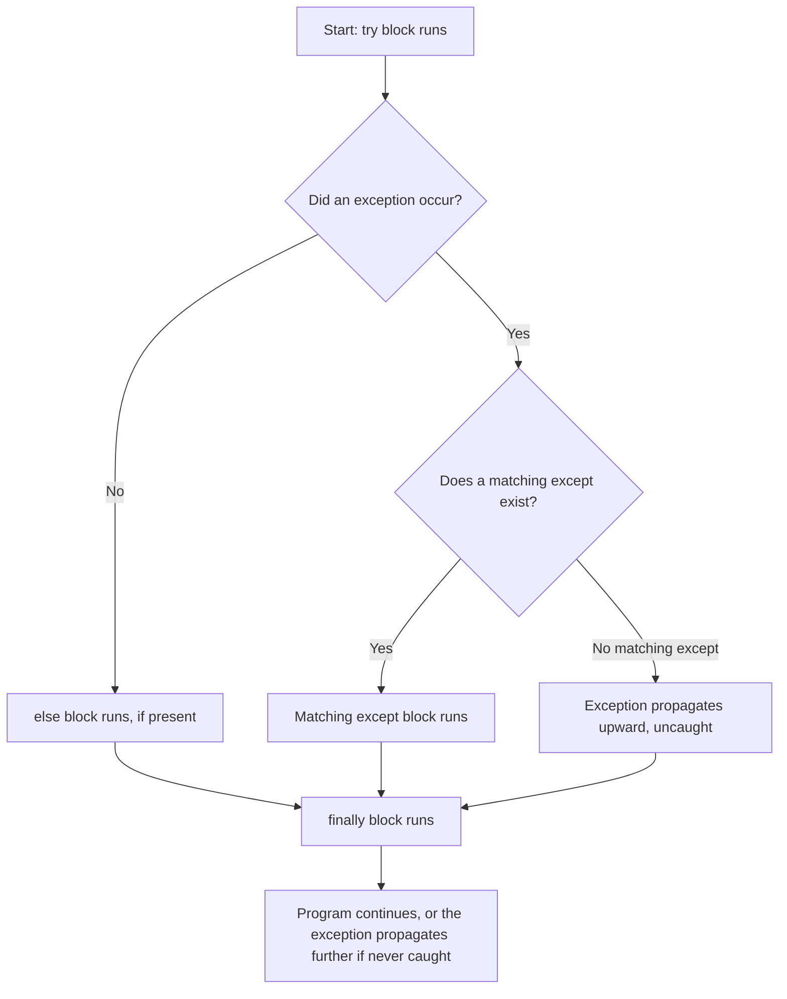
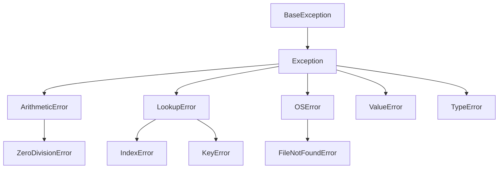

# 1. Unit 5.2 - Errors & Exceptions — Topic Corpus

## 2. Prerequisites

This topic builds directly on **Unit 5.1 - File Handling** (id: `24960c98-315e-402d-9539-10ed668e7a80`). That unit introduced opening files with `open(filename, mode)`, the idea of a file object, the read/write/append modes, closing a file, the `with` statement (a context manager), reading CSV data with `csv.reader()` and `csv.DictReader()`, and reading/writing JSON with `json.load()`/`json.dump()`. It also introduced `FileNotFoundError` by name, without showing how to catch it. This corpus revisits those exact same `open()` calls and shows how to protect them from crashing when a file is missing.

It also assumes everything from Units 1.1–4.3: variables, types, `ValueError`, `TypeError`, `ZeroDivisionError`, `if`/`elif`/`else`, functions, lists/`IndexError`, dictionaries/`KeyError`, and class inheritance (`class`, `__init__`, a class inheriting from another class).

## 3. Learning Objectives

By the end of this topic, a learner will be able to:

- **Differentiate** a syntax error (caught before a program runs) from a runtime exception (raised while a program is running), and explain why only the second kind can be handled in code.
- **Explain** what each of `try`, `except`, `else`, and `finally` guarantees will happen, and in what order.
- **Apply** a `try`/`except` block to catch more than one specific kind of failure from the same risky code, using either separate `except` clauses or a combined one.
- **Identify** the situation that triggers each of the common built-in exceptions `ValueError`, `TypeError`, `ZeroDivisionError`, `FileNotFoundError`, `KeyError`, and `IndexError`.
- **Apply** the `raise` keyword, including through a custom exception class, to signal a problem that no built-in exception describes.
- **Recognize** why a bare `except:` clause is an anti-pattern, and rewrite one to name specific exceptions instead.

## 4. Introduction

Imagine a shop's card-payment terminal. A customer taps their card, but the terminal's network connection just dropped for half a second. What should happen? The worst possible answer is: the entire terminal freezes and needs a hard restart, locking out every customer in line behind that one person. The right answer is: the terminal notices the specific problem ("no network response"), shows a clear message ("Please try again"), and is ready for the very next customer a second later.

That difference — crash-everything versus notice-the-problem-and-keep-going — is exactly what this topic is about. In Unit 5.1, every example assumed the file being opened was exactly where expected and every value inside it was exactly the type expected [1]. That assumption almost never holds for real data: a file gets deleted, a customer types "five hundred" instead of `500`, a lookup asks for a customer name that was never added to the records. Python has a built-in way to plan for exactly these situations instead of letting the whole program stop the moment one of them happens.

This topic teaches that toolkit: the vocabulary for talking about things going wrong (errors versus exceptions), the four keywords Python gives you to detect and respond to a problem (`try`, `except`, `else`, `finally`), the handful of built-in exceptions you will meet constantly, and how to signal your own custom problem with `raise` when nothing built into Python already describes it. By the end, the same `open()` call from Unit 5.1 will survive a missing file instead of crashing on it.

## 5. Core Concepts

### 5.1 Error vs. exception: two different kinds of "something went wrong"

The word **error** is the general umbrella term for anything that stops your program from doing what it's supposed to do. Python splits errors into two categories that behave completely differently, and the difference matters a great deal for what you can actually do about them [1].

A **syntax error** happens *before* your program runs at all. Python reads through your code first, checking that it follows the grammar rules of the Python language — things like needing a colon after an `if` line, or spelling `def` correctly. If that check fails, Python refuses to run even the very first line. You have already met this in Units 1.1–1.4 when a missing colon or a typo produced a `SyntaxError`. There is nothing to "catch" here in your own code, because your code never started running — the only fix is to correct the mistake and try again.

```python
if 5 > 3
    print("hello")
```

```
SyntaxError: expected ':'
```

A **runtime exception** — usually just called an **exception** — is completely different. The code itself is valid Python; it starts running successfully, but partway through, something goes wrong: a file isn't where it's expected to be, a division happens by zero, a piece of text can't be turned into a number. This is a **runtime error**, meaning it happens at *runtime* (while the program is running), as opposed to a syntax error, which is caught before runtime even begins. You have already seen exceptions appear in earlier units — `ZeroDivisionError`, `ValueError`, `TypeError`, `IndexError`, `KeyError`, `FileNotFoundError` — every time one of those showed up and stopped your program, that was a runtime exception. The key fact this topic adds is that, unlike a syntax error, a runtime exception *can* be anticipated and handled in your own code, so the program keeps running instead of crashing.

```python
print(10 / 0)
```

```
ZeroDivisionError: division by zero
```

### 5.2 Exception handling: try, except, else, finally

**Exception handling** is the set of Python tools — `try`, `except`, `else`, `finally`, and `raise` — that let you detect a runtime exception the moment it happens, respond to it in a way you planned in advance, and let the program keep running afterward [1]. The core shape looks like this:

```python
try:
    risky_code()
except SomeError:
    handle_it()
else:
    only_if_no_exception()
finally:
    always_runs()
```

Each part guarantees something different, and none of them are interchangeable:

- The **`try` block** is the section of code you are attempting to run — code you know *might* fail. Nothing is "protected" against exceptions until it is written inside a `try` block.
- The **`except` block** runs only if a specific kind of exception (named right after the word `except`) was raised somewhere inside the `try` block above it. If the `try` block finishes with no problems, its matching `except` block is simply skipped.
- The **`else` block** runs only if the entire `try` block finished with *zero* exceptions. It exists so that "only run this when everything above succeeded" code can be kept separate from the risky code itself.
- The **`finally` block** runs unconditionally — no matter what happened. Whether `try` succeeded, an `except` fired, or even a brand-new exception occurred, `finally` still executes. This makes it the one place you can rely on for cleanup work — for example, printing a log line confirming that an attempt was made, whatever the outcome.

Here is the flow of control through those four parts:



Notice the bottom-right path: if none of your `except` clauses match the exception that occurred, the exception is not silently absorbed — it keeps traveling upward, out of your function, exactly as if you had written no `try` block at all. `finally` still runs first, but the program does eventually crash if nothing anywhere catches that exception. Writing a `try` block is not a guarantee that every possible problem disappears — it only handles the specific exception types you named.

A minimal example, revisiting a conversion from earlier units:

```python
amount_text = "499.00"

try:
    amount = float(amount_text)
    print("Amount entered:", amount)
except ValueError:
    print("Please enter a valid number.")
```

Since `"499.00"` converts cleanly, the `try` block succeeds, `print` runs normally, and the `except ValueError:` block is skipped entirely. Output: `Amount entered: 499.0`.

### 5.3 Catching more than one kind of failure

A single `try` block is often protecting more than one risky line, and different lines can fail in completely different ways. Python lets you list several `except` clauses after one `try`, each naming a different exception type, so each kind of failure gets its own specific response [1]:

```python
balances = {"Rohit Verma": 300, "Asha Singh": 1000}

def process_payment(payer, amount_text):
    try:
        amount = float(amount_text)
        current_balance = balances[payer]
        print(f"{payer} wants to pay Rs.{amount}; balance is Rs.{current_balance}.")
    except ValueError:
        print("Please enter a valid number.")
    except KeyError:
        print(f"No account found for {payer}.")
```

Here, `float(amount_text)` can fail with `ValueError` if the text isn't numeric, while `balances[payer]` can fail with `KeyError` if `payer` isn't a key in the dictionary — two unrelated problems, each caught by its own clause. Python checks these clauses **top to bottom** and runs only the **first** one that matches; it never runs more than one `except` block for a single exception. You can also group exception types that deserve an identical response using a tuple: `except (ValueError, KeyError) as e:` catches either one and binds whichever exception object occurred to the name `e`, letting you inspect its message.

### 5.4 The exception object

When an exception occurs, Python doesn't just print a message — it constructs an **exception object**, a real object (in the same sense as the objects from Units 4.1–4.3) that carries details about what went wrong, most importantly the error message. Writing `except ValueError as e:` binds that object to the local name `e` for the duration of the `except` block, so you can print it, log it, or inspect it, rather than only reacting to the fact that *some* `ValueError` happened.

### 5.5 The exception class hierarchy

Every exception in Python, built-in or custom, is built from a **class** — the same concept introduced in Units 4.1–4.3, where a class defines a blueprint and objects are built from it. Exception classes form a tree, called the **exception class hierarchy**, all ultimately inheriting (via the `inheritance` mechanism from Unit 4.x) from a common ancestor called `BaseException`. `Exception` itself is a direct child of `BaseException`, and nearly every exception you will write or catch — `ValueError`, `TypeError`, `ZeroDivisionError`, `KeyError`, `IndexError`, `FileNotFoundError` — descends from `Exception`.



Why this matters practically: catching a **parent** class in an `except` clause also catches every one of its children. `except OSError:` would also catch a `FileNotFoundError`, since `FileNotFoundError` inherits from `OSError`. This is exactly the same "catching a parent also matches the child" idea you saw with class inheritance in Unit 4.x — an `except` clause matches an exception's class *or any class it inherits from*. This is also why **order matters**: if you list a broader parent exception before a more specific child in separate `except` clauses, the parent's clause matches first and the child's clause never runs, because Python stops at the first match, top to bottom.

### 5.6 The common built-in exceptions, precisely

Six exceptions come up constantly enough to be worth memorizing exactly what triggers each one [1]:

| Exception | Triggered by | Example |
|---|---|---|
| `ValueError` | A value has the *right type* but an *inappropriate value* | `int("abc")` — a string, just not a numeric one |
| `TypeError` | An operation is applied to a value of the *wrong type entirely* | `"5" + 5` — you cannot add text and a number directly |
| `ZeroDivisionError` | A number is divided by zero | `10 / 0` |
| `FileNotFoundError` | `open()` is called on a file that doesn't exist at that path | `open("sales.csv")` after the file was deleted |
| `KeyError` | A dictionary is accessed with a key that isn't in it | `balances["Unknown User"]` |
| `IndexError` | A list or tuple is accessed with a position outside its range | `marks[10]` when the list only has 3 items |

A useful distinction to keep straight: `ValueError` means *right type, wrong content*; `TypeError` means *wrong type entirely*. `len(5)` raises `TypeError` because an integer has no length concept at all, whereas `int("cat")` raises `ValueError` because a string was expected and given, but its content isn't numeric.

### 5.7 Deliberately signaling a problem with `raise`

Sometimes the problem your code needs to report isn't something Python's built-in exceptions already describe. A negative payment amount, or a payment that exceeds someone's account balance, isn't a `ValueError` or a `KeyError` — it's a problem specific to *your* program's rules. The **`raise`** keyword lets your own code deliberately trigger an exception, built-in or custom, the moment it detects such a problem [1]:

```python
raise ValueError("amount cannot be negative")
```

For a problem with no good built-in match, you define a **custom exception**: a class that inherits from `Exception`, using exactly the class-inheritance syntax from Unit 4.x:

```python
class InvalidAmountError(Exception):
    pass
```

Raising it works identically to raising a built-in exception, and any code that calls your function can catch it specifically:

```python
if amount <= 0:
    raise InvalidAmountError(f"Rs.{amount} is not a valid payment amount.")
```

```python
except InvalidAmountError as e:
    print("Payment rejected:", e)
```

`Exception`, not `BaseException`, is the class you should inherit your own custom exceptions from — `BaseException` also covers a couple of special signals (like the program being told to exit) that you almost never want to accidentally catch alongside your own errors.

Used with no arguments at all, `raise` (bare, inside an `except` block) re-raises the exception currently being handled — useful when you want to log that a problem occurred but still let it propagate upward afterward. This bare-`raise` re-throwing pattern is mentioned here only for completeness; the everyday form you will use constantly is `raise SomeException("message")`.

### 5.8 The bare `except:` anti-pattern

A **bare `except:`** is an `except` clause with no exception type named at all — it matches literally anything that goes wrong inside `try`, including problems you never anticipated and never intended to hide.

```python
try:
    total = balances[payer]
except:
    print("Something went wrong.")
```

The serious danger here is not stylistic — it is that a genuine bug, such as misspelling `balances` as `balnces` (which would actually raise a `NameError`, a runtime exception you met in Unit 1.x when a variable name isn't recognized), gets silently swallowed and reported as if it were an expected, planned-for situation. The fix is always to name the specific exception(s) you actually expect, so anything else still surfaces as a visible crash you can investigate.

## 6. Implementation

To add exception handling to a piece of risky code, work through these steps in order:

1. **Identify the risky line(s).** Look for operations that can fail at runtime: converting text to a number, looking up a dictionary key or list index, opening a file, dividing.
2. **Wrap only those lines in `try:`.** Keep the block small and specific — wrapping your entire program in one `try` makes it impossible to tell which line actually failed.
3. **List one `except` per distinct failure type**, most specific exception first if any are related through inheritance (§5.5), each with a message or response appropriate to that exact problem.
4. **Add `else:`** only if you have code that should run exclusively when nothing above failed — this keeps "success-only" logic visibly separate from the risky attempt itself.
5. **Add `finally:`** only if there is cleanup or logging that must happen on every single path — success, a caught failure, or even an uncaught one.
6. **Use `raise`** inside the `try` block for any problem your own code detects that no built-in exception describes, after first checking whether an existing built-in exception (§5.6) already fits.

## 7. Real-World Patterns

- **Payment systems (UPI, card terminals):** validate the entered amount (`ValueError` if not numeric), look up the account (`KeyError` if unknown), and reject an over-the-limit amount with a custom exception raised via `raise` — logging every attempt in `finally` regardless of outcome [1].
- **Banking / FinTech:** a funds transfer rejects a non-existent destination account or an invalid amount without ever crashing the whole banking application for every other customer being served at the same moment.
- **E-commerce checkout:** reading a discount-coupon configuration file gracefully handles `FileNotFoundError` from Unit 5.1's `open()` calls, instead of blocking every customer's checkout because one file went missing.
- **Data processing / AI-ML pipelines:** a script processing a large file of rows catches one row's specific bad value, logs it, and continues to the next row rather than crashing on the first malformed line partway through. (Building a complete version of this pattern — reading a file, skipping and logging bad rows, and continuing — is exactly what Unit 5.3 covers next; it is not built here.)

## 8. Best Practices

- Catch **specific** exception types (`except ValueError:`) rather than a bare `except:` — never hide a bug you didn't anticipate.
- Never silently swallow an exception (`except: pass`) — at minimum, print or log it so the failure stays visible somewhere.
- Keep the `try` block **small** — wrap only the risky line(s), so you know exactly which operation failed.
- List a **specific** exception before a related **parent** exception across multiple `except` clauses, or the parent will always match first.
- Use `finally` for any cleanup or logging that truly must happen on every path, success or failure alike.
- Raise a **custom exception** only when no built-in exception already describes the situation well.

## 9. Hands-On Exercise

Write a function `safe_lookup(record, key_text)` that treats `record` as a dictionary and `key_text` as a key to look up. Inside one `try` block: look up `record[key_text]`. Add `except KeyError:` to print `"No entry found for <key_text>."`. Add `else:` to print the found value only on success. Add `finally:` to print `"Lookup attempted for <key_text>."` on every call. Test it with a key that exists and one that does not, and confirm `finally` prints both times.

## 10. Key Takeaways

- A **syntax error** stops a program before it runs at all; a **runtime exception** happens during execution of otherwise-valid code and, unlike a syntax error, can be caught and handled.
- `try` attempts risky code, `except` catches a specifically named failure, `else` runs only when nothing in `try` failed, and `finally` runs unconditionally on every path — including through an uncaught exception.
- Multiple, specifically-named `except` clauses, checked top to bottom with the first match winning, let one `try` block correctly handle several distinct failure types, each with its own response.
- `ValueError`, `TypeError`, `ZeroDivisionError`, `FileNotFoundError`, `KeyError`, and `IndexError` each map to one specific, recognizable situation worth memorizing exactly.
- `raise`, including through a custom exception class inheriting from `Exception`, lets your own code signal a problem that no built-in exception describes — and a bare `except:` is a real bug risk, not just a style preference, because it silently hides failures you never anticipated.

## 11. Next Steps

_System-derived from the next entry in curriculum/sequence.md._
