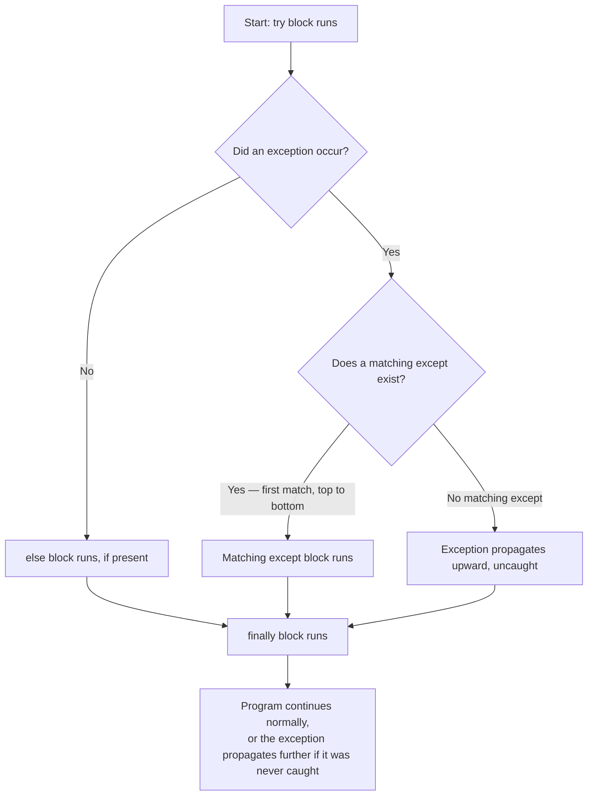
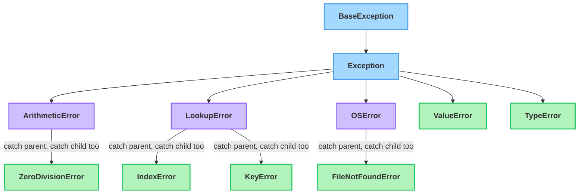

# Errors & Exceptions

---

[← Previous: 5.1 File Handling](unit-5-1-file-handling.md) | [Go back to TOC](../../README.md) | [Next: 5.3 Case Study →](unit-5-3-case-study.md)

## 1. Learning Objectives

By the end of this unit, you will be able to:

- **Differentiate** between a syntax error and a runtime exception, and explain why one stops your program before it even starts.
- **Explain** what each part of a `try`/`except`/`else`/`finally` block actually guarantees.
- **Implement** exception handling to catch multiple, specific failures from the same `try` block.
- **Identify** common built-in exceptions — `ValueError`, `TypeError`, `ZeroDivisionError`, `FileNotFoundError`, `KeyError`, `IndexError` — and the situation that triggers each one.
- **Apply** the `raise` keyword to signal a problem your own code detects, including through a custom exception class.
- **Debug** code that hides real bugs behind a bare `except:`, and rewrite it to catch specific exceptions instead.

---

## 2. Overview

In Unit 5.1, you learned to open files, read CSV data, and parse JSON — but every example assumed the file was exactly where you expected it, and every value inside it was exactly the type you expected. Real files, and real users, are rarely that well-behaved. A teammate deletes `sales.csv` before your script runs. A customer typing into a UPI payment form enters "five hundred" instead of `500`. A railway booking system is asked to look up a PNR number that was never actually booked. In production software — a payment gateway, an e-commerce checkout, a hospital record system — none of these situations gets to crash the entire application for every other user at the same time. The system must detect the problem, respond sensibly, and keep running.

This is exactly what **exception handling** gives you. Instead of writing code and hoping nothing ever goes wrong, you explicitly plan for the specific ways it *can* go wrong, and write a response for each one — the same way good logic branches on `if`/`elif` rather than one generic `else`.

This unit builds directly on Unit 5.1: you will revisit the very same `open()` calls from that unit, now protected against a missing file with `FileNotFoundError`. You will also learn the full `try`/`except`/`else`/`finally` toolkit, how to catch several distinct failures from one block, the most common built-in exceptions you will meet constantly, and how to `raise` your own exception when your code detects a problem no built-in exception describes. By the end, you will be writing code that behaves the way real, professional software must: it survives bad input instead of dying on it.

---

## 3. Description

### 3.1 Definition

An **error** is a general term for anything that stops your program from doing what it's supposed to do. Python actually gives you two very different kinds of errors, and telling them apart matters:

- A **syntax error** happens *before* your program runs at all. Python reads your code, cannot make sense of its structure — a missing colon, a misspelled keyword — and refuses to start executing even the first line.
- A **runtime exception** (usually just called an **exception**) happens *while* the program is running. The code itself was valid Python — it started executing successfully — but something went wrong partway through: a file wasn't found, a value couldn't be converted to a number, a calculation tried to divide by zero.

**Exception handling** is the set of Python tools — `try`, `except`, `else`, `finally`, and `raise` — that let you detect a runtime exception, respond to it in a planned way, and keep your program running instead of letting it crash.

```python
# This next line is missing the colon Python's grammar requires:
if 5 > 3
    print("hello")
```

Output:

```
  File "<cell>", line 1
    if 5 > 3
           ^
SyntaxError: expected ':'
```

That's a syntax error — nothing ran. Compare it to this, which is perfectly valid Python that fails *during* execution:

```python
print(10 / 0)
```

Output:

```
ZeroDivisionError: division by zero
```

### 3.2 Why This Concept Exists

Without exception handling, the first bad file, bad input, or bad calculation in a program's entire lifetime would stop it completely — for every user, every time. Real software constantly needs to:

- **Detect** a specific failure (a missing file, an invalid amount) the moment it happens.
- **Respond** to it in a planned, appropriate way instead of crashing outright.
- **Continue** serving everyone else, or at least fail in a controlled, informative manner.

This is why a UPI payment app rejects an invalid amount with a clear message instead of crashing the whole app for the customer standing at a shop counter, and why a data-processing script can skip three bad rows out of a million instead of stopping dead at row 40,502. Exception handling is what makes that behaviour possible.

### 3.3 Key Terminology

| Term | Simple Meaning |
|---|---|
| **Error** | A general term for anything that stops normal program execution. |
| **Syntax error** | An error caught before the program runs at all — invalid Python grammar, such as a missing colon or misspelled keyword. |
| **Runtime error / Exception** | A problem that occurs *while* otherwise-valid code is executing — e.g. dividing by zero, a missing file. |
| **Exception handling** | The set of tools (`try`, `except`, `else`, `finally`, `raise`) used to detect and respond to exceptions instead of letting the program crash. |
| **`try` block** | The section of code you attempt to run, which might fail. |
| **`except` block** | The section that runs only if a specific exception (or a subclass of it) was raised inside `try`. |
| **`else` block** | Runs only if the `try` block completed with zero exceptions. |
| **`finally` block** | Runs unconditionally — whether `try` succeeded, an `except` fired, or a new exception was raised inside `except`. |
| **Exception object** | The actual object Python creates when an exception occurs, carrying details such as the error message — e.g. the `e` in `except ValueError as e:`. |
| **`raise`** | The keyword used to trigger an exception deliberately from your own code. |
| **Exception class hierarchy** | The tree of built-in exception classes, all ultimately inheriting from `BaseException`; catching a parent class also catches every child beneath it. |
| **Bare `except:`** | An `except` clause with no exception type named — catches literally everything, including bugs you never anticipated. |
| **Custom exception** | A user-defined class, inheriting from `Exception`, used to signal a problem specific to your own program. |

### 3.4 Syntax

```python
try:
    risky_code()
except SomeError:
    handle_it()
except (OtherError, AnotherError) as e:
    handle_those(e)
else:
    only_if_no_exception()
finally:
    always_runs()
```

| Part | What it is | Why it's there |
|---|---|---|
| `try:` | Marks the start of the code you want to attempt. | Nothing below is "protected" until it is wrapped this way. |
| `except SomeError:` | Catches `SomeError` (or any of its subclasses) if raised inside `try`. | Naming the type makes this a *targeted* response, not a generic one. |
| `except (A, B):` | Catches either exception type `A` or `B` with one shared response. | Useful when two different failures deserve an identical reaction. |
| `except SomeError as e:` | Same as above, but also binds the exception object to the name `e`. | Lets you inspect or log the actual error message. |
| `else:` | Runs only if `try` finished with no exception at all. | Keeps "only-on-success" code separate from the risky code in `try`. |
| `finally:` | Runs no matter what happened above. | The one place to put cleanup code you can always count on running. |
| `raise SomeError("message")` | Deliberately triggers an exception with a custom message. | Lets your own code signal a problem — built-in or custom. |

**`try` / `except` / `else` / `finally` Control Flow**


*No matter which path is taken above, `finally` always executes before the block is truly done.*

**Comparison Table: Common Exception Types**

| Exception | When it happens | Example |
|---|---|---|
| `ValueError` | A value has the right type but an inappropriate value | `int("abc")` |
| `TypeError` | An operation is applied to a value of the wrong type entirely | `"5" + 5` |
| `ZeroDivisionError` | A number is divided by zero | `10 / 0` |
| `FileNotFoundError` | You try to open a file that doesn't exist | `open("sales.csv")` when the file was deleted |
| `KeyError` | You access a dictionary key that doesn't exist | `student_marks["Rohit"]` when `"Rohit"` isn't a key |
| `IndexError` | You access a list/tuple index that is out of range | `marks[10]` when the list only has 3 items |

A useful pair to keep straight for interviews: `ValueError` means *right type, wrong content* (`int("cat")` — a string, just not a numeric one); `TypeError` means *wrong type entirely* (`len(5)` — an integer has no length at all).

A custom exception is just a class that inherits from `Exception`, exactly like the class inheritance you built in Part 4:

```python
class InvalidMarksError(Exception):
    pass
```

Raising it (`raise InvalidMarksError("150 is not a valid mark")`) works exactly like raising any built-in exception, and whoever calls your function can catch it specifically with `except InvalidMarksError:`.

### 3.5 Rules

- Every `except` needs a `try` above it in the same block — you cannot use one without the other.
- Python checks `except` clauses top to bottom and stops at the **first type match**. Order matters when types are related: list the specific exception before a broader parent, or the parent will catch it first and the specific block never runs.
- `else` only makes sense directly after all `except` clauses, and before `finally`.
- `finally`, if present, is always the last part of the block, and it always runs — even through a `return` inside `try`, or a brand-new exception raised inside `except`.
- `raise` used with no arguments is only valid inside an `except` block — it re-raises the exception currently being handled.
- Every exception raised, whether built-in or your own, is an object built from a class; `ValueError`, `FileNotFoundError`, and every other built-in exception ultimately inherit from a base class called `Exception`.


*A simplified slice of Python's exception tree — catching a parent class such as `OSError` also catches every child beneath it, including `FileNotFoundError`.*

### 3.6 Best Practices

- Catch specific exceptions (`except ValueError:`) rather than a bare `except:` — never hide a bug you didn't anticipate.
- Use `finally` (or a `with` block, as covered in Unit 5.1) for cleanup that must always happen — closing a file, releasing a resource, logging that an attempt was made.
- Never silently swallow an exception (`except: pass`) — at minimum, log it so the failure stays visible somewhere.
- Catch the narrowest exception type that fits the situation — catching `Exception` broadly is only a small improvement over a bare `except:`.
- Keep the `try` block small — wrap only the risky line(s), not your entire program, so you know precisely what failed.
- Raise a **custom exception** when a built-in type doesn't describe your problem well, so callers can catch exactly that situation.

### 3.7 Common Mistakes

- **Bare `except:` hiding real bugs** — a typo in a variable name gets silently reported as "something went wrong" instead of surfacing the actual `NameError`.
- **Catching an exception too broadly** (`except Exception:`) when a specific type would have caught the real problem while letting genuine, unanticipated bugs surface.
- **Assuming `finally` is optional** — forgetting that it always runs, on every path out of the block, not just when nothing failed.
- **Listing a parent exception class before a child** in multiple `except` clauses, so the child's specific block never actually executes.
- **Forgetting that `else` is skipped** entirely the moment any exception occurs, even one caught by a different `except` than expected.

### 3.8 Code Examples

All four examples below build **one single scenario** — a shop counter accepting a UPI payment — adding one new piece of the `try`/`except` toolkit at a time. By the end, one function has grown to use every tool from §3.4.

**Step 1 — a basic `try`/`except`:** just convert the text the customer typed into a number.

```python
amount_text = "499.00"

try:
    amount = float(amount_text)
    print("Amount entered:", amount)
except ValueError:
    print("Please enter a valid number.")
```

*Line-by-line explanation:*
- `amount_text = "499.00"` — stands in for whatever a customer types into a payment app's amount field; it arrives as text.
- `try:` — marks the start of the code Python should attempt.
- `amount = float(amount_text)` — `"499.00"` converts cleanly to the number `499.0`, so this line succeeds.
- `print("Amount entered:", amount)` — runs normally since no exception occurred.
- `except ValueError:` — this block is skipped entirely, because nothing went wrong above it.
- Output: `Amount entered: 499.0`

**Step 2 — multiple `except` clauses:** the shop also needs to look up the customer's account balance, which can fail in a completely different way (an unknown customer) than a bad amount.

```python
balances = {"Rohit Verma": 300, "Asha Singh": 1000, "Karan Mehta": 5000}

def process_payment(payer, amount_text):
    try:
        amount = float(amount_text)
        current_balance = balances[payer]
        print(f"{payer} wants to pay Rs.{amount}; balance is Rs.{current_balance}.")
    except ValueError:
        print("Please enter a valid number.")
    except KeyError:
        print(f"No account found for {payer}.")

process_payment("Rohit Verma", "150")
process_payment("Unknown User", "200")
process_payment("Asha Singh", "five hundred")
```

*Line-by-line explanation:*
- `balances = {...}` — a small dictionary standing in for a real account-balance lookup, exactly the kind of dictionary you built in earlier units.
- `amount = float(amount_text)` — fails with `ValueError` if the text isn't numeric.
- `current_balance = balances[payer]` — fails with `KeyError` if `payer` isn't a key in `balances`.
- `except ValueError:` — runs only if the amount conversion failed.
- `except KeyError:` — runs only if the balance lookup failed; Python checks these top to bottom and runs the first one that matches.
- Output:
  ```
  Rohit Verma wants to pay Rs.150.0; balance is Rs.300.
  No account found for Unknown User.
  Please enter a valid number.
  ```

**Step 3 — adding `else` and `finally`:** decide whether to approve the payment only once both lines in `try` succeeded, and log every attempt no matter what happened.

```python
def process_payment(payer, amount_text):
    try:
        amount = float(amount_text)
        current_balance = balances[payer]
    except ValueError:
        print("Please enter a valid number.")
    except KeyError:
        print(f"No account found for {payer}.")
    else:
        if amount <= current_balance:
            print(f"Payment of Rs.{amount} by {payer} approved.")
        else:
            print(f"Insufficient balance: Rs.{current_balance} available.")
    finally:
        print(f"Payment attempt for {payer} logged.\n")

process_payment("Rohit Verma", "150")
process_payment("Unknown User", "200")
process_payment("Asha Singh", "five hundred")
process_payment("Karan Mehta", "99999")
```

*Line-by-line explanation:*
- `else:` — runs only when *both* lines inside `try` succeeded with zero exceptions; here it decides approve-or-reject using the amount and balance that are now safely available.
- `finally:` — runs after every single call, regardless of which of the three outcomes above occurred, logging that an attempt was made for this payer.
- Output:
  ```
  Payment of Rs.150.0 by Rohit Verma approved.
  Payment attempt for Rohit Verma logged.

  No account found for Unknown User.
  Payment attempt for Unknown User logged.

  Please enter a valid number.
  Payment attempt for Asha Singh logged.

  Insufficient balance: Rs.5000 available.
  Payment attempt for Karan Mehta logged.

  ```

**Step 4 — `raise` for a custom validation:** a zero/negative amount and an over-the-balance amount are not describable by any built-in exception, so the function detects each itself and deliberately `raise`s a custom `InvalidAmountError`.

```python
class InvalidAmountError(Exception):
    pass

def process_payment(payer, amount_text):
    try:
        amount = float(amount_text)
        current_balance = balances[payer]

        if amount <= 0:
            raise InvalidAmountError(f"Rs.{amount} is not a valid payment amount.")
        if amount > current_balance:
            raise InvalidAmountError(f"Insufficient balance: Rs.{current_balance} available.")

    except ValueError:
        print("Please enter a valid number.")
    except KeyError:
        print(f"No account found for {payer}.")
    except InvalidAmountError as e:
        print("Payment rejected:", e)
    else:
        print(f"Payment of Rs.{amount} by {payer} approved.")
    finally:
        print(f"Payment attempt for {payer} logged.\n")

process_payment("Rohit Verma", "-150")
process_payment("Unknown User", "200")
process_payment("Asha Singh", "five hundred")
process_payment("Karan Mehta", "99999")
process_payment("Rohit Verma", "150")
```

*Line-by-line explanation:*
- `class InvalidAmountError(Exception):` — a custom exception, inheriting from `Exception` exactly like the class inheritance from Part 4, used for problems no built-in exception describes well.
- `if amount <= 0: raise InvalidAmountError(...)` — the code detects a problem itself (a zero or negative amount) and deliberately raises its own exception with `raise`.
- `if amount > current_balance: raise InvalidAmountError(...)` — a second, different condition that raises the *same* custom exception type with a different message.
- `except InvalidAmountError as e:` — catches either `raise` above, and `e` holds whichever message was attached to it.
- `else:` now only prints "approved" once nothing above — not even a custom-raised exception — went wrong.
- `finally:` — still logs every single attempt, exactly as in Step 3.
- Output:
  ```
  Payment rejected: Rs.-150.0 is not a valid payment amount.
  Payment attempt for Rohit Verma logged.

  No account found for Unknown User.
  Payment attempt for Unknown User logged.

  Please enter a valid number.
  Payment attempt for Asha Singh logged.

  Payment rejected: Insufficient balance: Rs.5000 available.
  Payment attempt for Karan Mehta logged.

  Payment of Rs.150.0 by Rohit Verma approved.
  Payment attempt for Rohit Verma logged.

  ```

#### Try It Yourself

Extend the UPI payment scenario above to enforce a **Rs.20,000 daily transaction limit** per customer. Use this dictionary of how much each customer has already spent today:

```python
already_spent_today = {"Rohit Verma": 15000, "Asha Singh": 500}
```

**Part 1 (basic `try`/`except`):** Write `check_new_amount(amount_text)` that converts `amount_text` to a number and prints `"Amount accepted: Rs.<amount>"`, or, if the text isn't a valid number, prints `"Please enter a valid number."`. Test it with `"2000"` and `"two thousand"`.

**Solution:**

```python
def check_new_amount(amount_text):
    try:
        amount = float(amount_text)
        print(f"Amount accepted: Rs.{amount}")
    except ValueError:
        print("Please enter a valid number.")

check_new_amount("2000")
check_new_amount("two thousand")
```

Expected output:
```
Amount accepted: Rs.2000.0
Please enter a valid number.
```

**Part 2 (multiple `except` clauses, plus `else`/`finally`):** Write `check_daily_limit(payer, amount_text)` that converts `amount_text`, looks up `already_spent_today[payer]`, and adds them together. Catch `ValueError` for bad text and `KeyError` for an unknown customer. Use `else` to print `"Amount accepted. Total spent today would be Rs.<total>."` only when nothing failed, and `finally` to print `"Checked limit for <payer>."` on every call.

**Solution:**

```python
def check_daily_limit(payer, amount_text):
    try:
        amount = float(amount_text)
        spent_so_far = already_spent_today[payer]
        total = spent_so_far + amount
    except ValueError:
        print("Please enter a valid number.")
    except KeyError:
        print(f"No spending record found for {payer}.")
    else:
        print(f"Amount accepted. Total spent today would be Rs.{total}.")
    finally:
        print(f"Checked limit for {payer}.\n")

check_daily_limit("Rohit Verma", "2000")
check_daily_limit("Unknown User", "500")
check_daily_limit("Asha Singh", "five hundred")
```

Expected output:
```
Amount accepted. Total spent today would be Rs.17000.0.
Checked limit for Rohit Verma.

No spending record found for Unknown User.
Checked limit for Unknown User.

Please enter a valid number.
Checked limit for Asha Singh.

```

**Part 3 (`raise` for a custom validation):** Add a custom exception class `DailyLimitExceededError(Exception)`. Inside the `try`, once `total` is computed, `raise DailyLimitExceededError(...)` whenever `total` exceeds `20000`, with a message stating how much over the limit it is. Catch it with its own `except` block that prints `"Transaction blocked:"` followed by the message. Test with `("Rohit Verma", "6000")` and `("Asha Singh", "1000")`.

**Solution:**

```python
DAILY_LIMIT = 20000

class DailyLimitExceededError(Exception):
    pass

def check_daily_limit_v2(payer, amount_text):
    try:
        amount = float(amount_text)
        spent_so_far = already_spent_today[payer]
        total = spent_so_far + amount
        if total > DAILY_LIMIT:
            raise DailyLimitExceededError(
                f"Rs.{total - DAILY_LIMIT} over the Rs.{DAILY_LIMIT} daily limit."
            )
    except ValueError:
        print("Please enter a valid number.")
    except KeyError:
        print(f"No spending record found for {payer}.")
    except DailyLimitExceededError as e:
        print("Transaction blocked:", e)
    else:
        print(f"Amount accepted. Total spent today would be Rs.{total}.")
    finally:
        print(f"Checked limit for {payer}.\n")

check_daily_limit_v2("Rohit Verma", "6000")
check_daily_limit_v2("Asha Singh", "1000")
```

Expected output:
```
Transaction blocked: Rs.1000.0 over the Rs.20000 daily limit.
Checked limit for Rohit Verma.

Amount accepted. Total spent today would be Rs.1500.0.
Checked limit for Asha Singh.

```

---

## 4. Real-World Application

- **Banking & FinTech:** A funds-transfer service must reject a transfer to a non-existent account (`KeyError` on the account lookup) or an invalid amount (a custom exception via `raise`) without ever crashing the banking app for the customer standing in the queue behind them.
- **UPI / Payment Systems:** The consolidated example above is precisely what a real UPI backend does — validate the amount, check the balance, and log every attempt via `finally`, whether the payment was approved or rejected.
- **E-commerce:** A checkout page that reads a discount-coupon file must handle `FileNotFoundError` gracefully instead of blocking every customer's checkout because one configuration file went missing.
- **Healthcare:** A patient-record lookup by ID must handle a missing record (`KeyError`) distinctly from a corrupted data file (`FileNotFoundError` or a JSON parsing exception), so hospital staff see a meaningful message instead of a crash.
- **Railway Booking (IRCTC-style systems):** The same pattern — a missing lookup key caught with `KeyError`, or a missing file caught with `FileNotFoundError` — is exactly the kind of failure a real booking-status page must handle every day, at massive scale, whether the record being looked up is an account balance or a PNR.
- **Data engineering / AI-ML pipelines:** A script processing a million rows and skipping the three malformed ones, instead of crashing at row 40,502, is running a specific, named `except` inside a loop — catch the one bad row, log it, and continue to the next.

The inverse also shows up in real production incidents: teams whose code used a blanket `except Exception: pass` have had genuine bugs silently swallowed for months before anyone noticed — the exact danger described in §3.7, at a scale where it actually costs money and trust.

---

## 5. Worked Example

### Problem Statement

Build a function `safe_divide(a_text, b_text)` that takes two pieces of text (as if typed by a user), attempts to divide them as numbers, and handles two genuinely different problems — an invalid number, and division by zero — with two distinct, specific messages. Every attempt, whatever the outcome, must be logged.

### Step 1: Understand the Problem

Two things can go wrong here, and they are *not* the same problem: the text might not convert to a whole number at all (`ValueError`), or the second number might legitimately convert but equal zero (`ZeroDivisionError`). Each deserves its own message. Regardless of which happens — or whether nothing goes wrong at all — the attempt must be logged exactly once.

### Step 2: Plan the Solution

Wrap the two conversions and the division inside one `try`. Add one `except ValueError:` and one `except ZeroDivisionError:`, each with its own message. Add an `else:` to print the result only when nothing failed. Add a `finally:` that always logs the attempt, since that must happen on every path.

### Step 3: Write the Python Code

```python
def safe_divide(a_text, b_text):
    try:
        a = int(a_text)
        b = int(b_text)
        result = a / b
    except ValueError:
        print("Both inputs must be valid whole numbers.")
    except ZeroDivisionError:
        print("Cannot divide by zero.")
    else:
        print("Result:", result)
    finally:
        print(f"Attempted: {a_text} / {b_text}")

safe_divide("100", "5")
safe_divide("100", "0")
safe_divide("100", "abc")
```

### Step 4: Explain Each Line

- `def safe_divide(a_text, b_text):` — defines a function taking two text arguments, deliberately named to make clear they arrive as raw text, not numbers yet.
- `a = int(a_text)` / `b = int(b_text)` — convert both inputs to whole numbers; either line can fail with `ValueError` if the text isn't a valid integer.
- `result = a / b` — divides the two numbers; fails with `ZeroDivisionError` if `b` is `0`.
- `except ValueError:` — runs only if one of the two conversions failed.
- `except ZeroDivisionError:` — runs only if the division itself failed (both conversions had already succeeded).
- `else:` — runs only when all three lines inside `try` succeeded with zero exceptions, printing the actual result.
- `finally:` — runs after every single call, regardless of which of the three outcomes occurred, logging exactly which two values were attempted.
- The three calls at the bottom exercise all three outcomes: a clean division, a division by zero, and an invalid number.

### Step 5: Sample Input

```
safe_divide("100", "5")
safe_divide("100", "0")
safe_divide("100", "abc")
```

### Step 6: Expected Output

```
Result: 20.0
Attempted: 100 / 5
Cannot divide by zero.
Attempted: 100 / 0
Both inputs must be valid whole numbers.
Attempted: 100 / abc
```

### Step 7: Why the Output Is Produced

The first call converts `"100"` and `"5"` cleanly, divides them with no error, so `else` runs and prints the result — then `finally` logs the attempt. The second call converts both numbers fine, but dividing by `0` raises `ZeroDivisionError`, so that specific `except` runs instead of `else` — and `finally` still logs the attempt afterward. The third call fails at the very first conversion, since `"abc"` isn't a valid integer, raising `ValueError` before `b` or `result` are ever computed — its matching `except` runs, and once again `finally` logs the attempt regardless. In every case, exactly one of `except`/`else` ran, and `finally` ran every single time without exception.

---

### Important Notes (Interview Insights)

- Common interview question: *"What's the difference between an error and an exception?"* Answer confidently: a **syntax error** prevents the program from running at all; a **runtime exception** occurs during execution of otherwise-valid code and can be caught and handled — an error is the broader umbrella term, and an exception is the specific, handleable kind.
- Common interview question: *"Does `finally` run if `return` is used inside `try`?"* Yes — `finally` runs before the function actually hands back its value, on literally every path out of the block, including an uncaught exception propagating upward.
- Be ready to explain, with a concrete example, why a bare `except:` is dangerous rather than just reciting "it's bad practice" — interviewers often ask for the actual failure mode: a real bug (like a typo) getting silently reported as expected behaviour.
- Know that all built-in exceptions descend from `BaseException`, but `Exception` is the practical class you should inherit from for your own custom exceptions — not `BaseException` directly, which also covers things like `SystemExit` and `KeyboardInterrupt` that you almost never want to accidentally catch.

---

## 6. Key Takeaways

- **Syntax errors** stop your program before it runs at all; **runtime exceptions** happen mid-execution and can be caught and handled.
- **`try`/`except`/`else`/`finally`** each guarantee something specific: `try` attempts, `except` catches a named failure, `else` runs only on success, `finally` runs unconditionally — even through a `return` or a new exception inside `except`.
- **A bare `except:` is a real bug risk**, not just a style nitpick — it silently swallows failures you never anticipated, including your own typos.
- **Multiple, specifically-named `except` blocks**, checked top to bottom, let one `try` handle several distinct failure types correctly, each with its own response.
- **Order matters**: list a specific exception before a related parent class, or the parent catches it first.
- **`raise`**, including through a custom class inheriting from `Exception`, lets your own code signal a problem no built-in exception describes.
- The most common built-in exceptions — `ValueError`, `TypeError`, `ZeroDivisionError`, `FileNotFoundError`, `KeyError`, `IndexError` — each map to one specific, recognizable situation worth memorizing.
- Combining Unit 5.1's file handling with this unit's exception handling is exactly how real programs read messy, real-world data safely.

Coming next: Unit 5.3 — Case Study, which pulls file handling and exception handling together into one program that reads real, messy data and survives it instead of crashing on the first bad line.

---

## 7. Reference Links

- [The Python Tutorial — Errors and Exceptions](https://docs.python.org/3/tutorial/errors.html)
- [Python 3 Documentation — Built-in Exceptions](https://docs.python.org/3/library/exceptions.html)
- [Real Python — Python Exceptions: An Introduction](https://realpython.com/python-exceptions/)
- [W3Schools — Python Try Except](https://www.w3schools.com/python/python_try_except.asp)

[← Previous: 5.1 File Handling](unit-5-1-file-handling.md) | [Go back to TOC](../../README.md) | [Next: 5.3 Case Study →](unit-5-3-case-study.md)

---

*© 2026 Revature · AI Native Engineering — Foundations · Unit 5.2 · Version 2.0*
