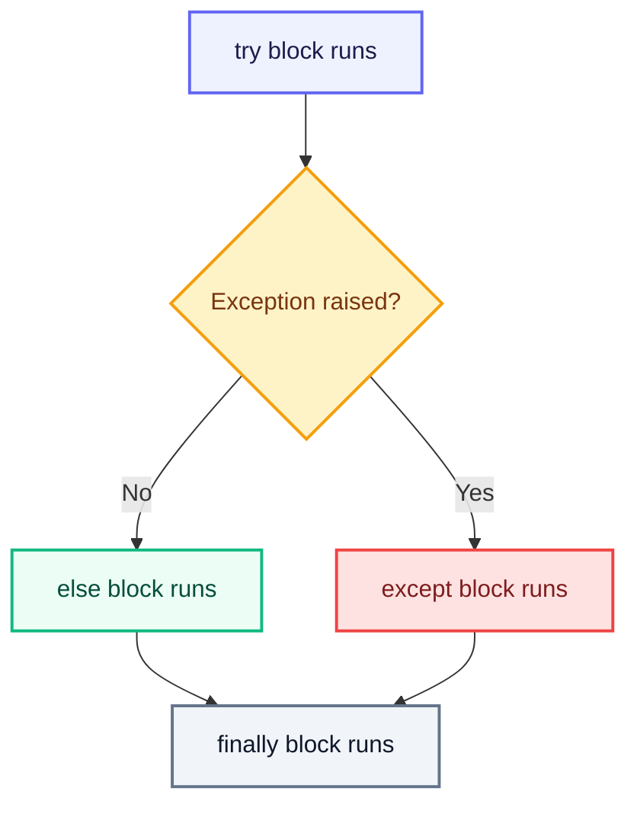

# Exception Handling: Keeping a Program Running When Something Goes Wrong

## Runtime Failure and Abrupt Exit

A program can be written correctly and still fail while it is running. The code passes Python's checks, the program starts, and then one line receives a value it cannot work with. This is a **runtime failure**. Python prints a description of the problem and ends the program immediately, so nothing after the failing line runs. Ending a program this way is called an **abrupt exit**.

The program below finds a student's average marks, which is the total divided by the number of subjects. Here the number of subjects is 0.

```python
total = 450
subjects = 0

print(total / subjects)

print("Done")
```

**Output**

```text
Traceback (most recent call last):
  File "app.py", line 4, in <module>
    print(total / subjects)
          ~~~~~~^~~~~~~~~~
ZeroDivisionError: division by zero
```

Python reached the division, found that `subjects` was 0, and stopped, because division by zero has no answer. `Done` never printed, so the program ended in the middle of its work.

## Errors and Exceptions

Python separates problems into two groups, and the difference decides whether your program can do anything about them while it runs.

An **error** is a problem in the code itself. Python checks the code before running it, so the program never starts. A missing bracket, a missing colon, or a wrong indent gives a `SyntaxError` or an `IndentationError`. There is nothing to handle, so you correct the line Python names and run the program again.

An **exception** appears while the program is running. The code is valid, so Python starts it, and then one line fails because of the value it was given. The division above is valid Python and failed only because `subjects` held 0. With 5 subjects the same line works, which is why an exception can be handled and an error cannot.

## The try and except Blocks

Python gives you two blocks for handling an exception. The `try` block holds the code that might fail, and Python watches for an exception while it runs. The `except` block holds the response, and Python runs it only when the exception named after `except` is raised inside `try`.

Here is the average program with both blocks around the division.

```python
total = 450
subjects = 0

try:
    print(total / subjects)
except ZeroDivisionError:
    print("Number of subjects cannot be zero")

print("Done")
```

**Output**

```text
Number of subjects cannot be zero
Done
```

The division failed exactly as before, but the program did not end. Python left the `try` block at the failing line, ran the `except` block, and continued to the next statement. `Done` printed this time. Had the division succeeded, the `except` block would have been skipped completely.

Always name the exception you expect. A bare `except:` catches every exception, including your own spelling mistakes, and hides them from you.

## Handling More Than One Exception

One piece of code can fail in more than one way, and each failure may deserve a different response. A single `try` block can be followed by several `except` blocks, one for each exception you expect. The program below can fail in two ways: the number of subjects can be 0, and the marks can arrive as text that `int()` cannot convert.

```python
def average(total, subjects):
    try:
        print(int(total) / int(subjects))
    except ZeroDivisionError:
        print("Number of subjects cannot be zero")
    except ValueError:
        print("Marks and subjects must be numbers")


average(450, 5)
average(450, 0)
average("abc", 5)
```

**Output**

```text
90.0
Number of subjects cannot be zero
Marks and subjects must be numbers
```

Three calls gave three outcomes. Zero subjects raised `ZeroDivisionError`, and the text `"abc"` raised `ValueError`, because `int()` cannot turn those letters into a number. Each exception reached the `except` block that names it. Python checks those blocks in order and uses the first one that matches, so write the specific exception before the general one.

## The else and finally Blocks

Two more blocks can follow `except`. The `else` block runs only when the `try` block finished without any exception. It keeps the success path separate from the risky line. The `finally` block runs in every case, whether `try` succeeded or an exception was raised. It is meant for work that must not be skipped, such as cleanup.

```python
def show_average(total, subjects):
    try:
        average = total / subjects
    except ZeroDivisionError:
        print("Number of subjects cannot be zero")
    else:
        print("Average:", average)
    finally:
        print("Calculation finished")


show_average(450, 5)
print()
show_average(450, 0)
```

**Output**

```text
Average: 90.0
Calculation finished

Number of subjects cannot be zero
Calculation finished
```

The first call divided successfully, so Python ran `else` and skipped `except`. The second failed, so Python ran `except` and skipped `else`. `Calculation finished` printed both times, because `finally` runs either way.


```mermaid
flowchart TD
    A["try block runs"] --> B{"Exception raised?"}
    B -->|"No"| C["else block runs"]
    B -->|"Yes"| D["except block runs"]
    C --> E["finally block runs"]
    D --> E

    classDef attempt fill:#EEF2FF,stroke:#6366F1,stroke-width:2px,color:#1E1B4B
    classDef check fill:#FEF3C7,stroke:#F59E0B,stroke-width:2px,color:#78350F
    classDef good fill:#ECFDF5,stroke:#10B981,stroke-width:2px,color:#064E3B
    classDef bad fill:#FEE2E2,stroke:#EF4444,stroke-width:2px,color:#7F1D1D
    classDef always fill:#F1F5F9,stroke:#64748B,stroke-width:2px,color:#0F172A

    class A attempt
    class B check
    class C good
    class D bad
    class E always
```

## Raising an Exception with raise

Every exception so far came from Python, and your own code can raise one as well. The `raise` keyword creates an exception and stops the function at that line. Use it when a function is handed a value it cannot accept and the caller has to be told.

```python
def set_subjects(count):
    if count <= 0:
        raise ValueError("Number of subjects must be at least 1")
    return count


print(set_subjects(5))
print(set_subjects(0))
```

**Output**

```text
5
Traceback (most recent call last):
  File "app.py", line 8, in <module>
    print(set_subjects(0))
          ^^^^^^^^^^^^^^^
  File "app.py", line 3, in set_subjects
    raise ValueError("Number of subjects must be at least 1")
ValueError: Number of subjects must be at least 1
```

`5` passed the check and was returned. `0` failed it, so the function raised a `ValueError` and stopped before reaching `return`. The traceback names both the calling line and the raising line. A `print()` there would only display a message and let the program continue with the bad value.

## Custom Exceptions

`ValueError` is a general name. It is raised by `int()`, by `float()`, and by anything else handed an unusable value. Catching it tells you little about which rule was broken. When your program has a rule of its own, create an exception named after that rule. A custom exception is a class that inherits from `Exception`, and its body can stay empty.

```python
class SubjectCountError(Exception):
    pass


def set_subjects(count):
    if count <= 0:
        raise SubjectCountError(f"{count} is not a valid number of subjects")
    return count


print(set_subjects(5))

try:
    set_subjects(0)
except SubjectCountError as error:
    print("Rejected:", error)
```

**Output**

```text
5
Rejected: 0 is not a valid number of subjects
```

Three lines carry the whole idea. `class SubjectCountError(Exception)` creates the exception type, `raise SubjectCountError(...)` raises that specific exception, and `except SubjectCountError` catches that one and nothing else. Adding `as error` gives you the exception object, so printing it shows the message passed to `raise`.

## Practice

1. **Handle a crash.** Write a program that divides `100` by `0` and then prints `End`, and note that `End` never prints. Now put the division inside a `try` block with an `except ZeroDivisionError` that prints a message, and check that `End` prints.

2. **Add else and finally.** Move the successful print into an `else` block and add a `finally` block that prints `Finished`. Run it once with a valid divisor and once with `0`, and confirm `Finished` prints both times.

3. **Raise your own exception.** Write `class AgeError(Exception): pass` and a function `set_age(age)` that raises `AgeError` when the age is below 13. Call `set_age(10)` inside a `try` block, catch `AgeError as error`, and print the message.

## Resources

- [Python Official Docs — Errors and Exceptions](https://docs.python.org/3/tutorial/errors.html)
- [W3Schools — Python Try Except](https://www.w3schools.com/python/python_try_except.asp)
- [GeeksforGeeks — Python Exception Handling](https://www.geeksforgeeks.org/python/python-exception-handling/)
