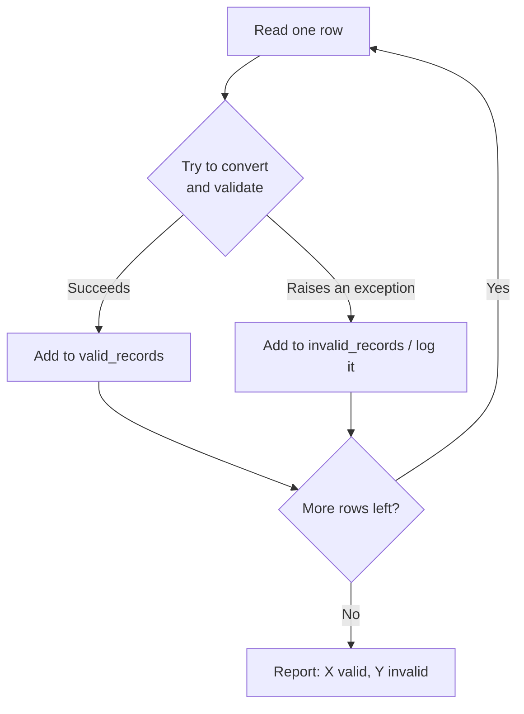

# Case Study — Building a Robust File Reader

---

[← Previous: 5.2 Errors & Exceptions](unit-5-2-errors-exceptions.md) | [Go back to TOC](../../README.md) | [Next: 6.1 Version Control Basics →](../p6-git-github-portfolio/unit-6-1-version-control-basics.md)

## 1. Learning Objectives

By the end of this unit, you will be able to:

- **Explain** what a "robust file reader" means, and why real-world data almost never arrives perfectly clean.
- **Implement** a CSV reader that combines `with open()`, `csv.reader`, and `try`/`except` to process every row it can and skip only the rows it can't.
- **Differentiate** between a fail-fast approach (crash on the first bad row) and a fail-soft, "skip and log," graceful-degradation approach.
- **Apply** the pattern of separating valid records from invalid records into two distinct collections, instead of mixing them together.
- **Debug** a reader that either crashes on the first bad row or silently drops bad rows without a trace — the two most common mistakes in this pattern.
- **Create** a complete, professional-quality program that reads a file, validates each row, logs what it rejects, and reports a clean summary — the exact shape of a real production data-loading step.

---

## 2. Overview

In Unit 5.1, you learned how to open, read, and write different types of files such as text files, CSV files, and JSON files. In Unit 5.2, you learned how to use **try/except** to handle errors so that a program does not crash.

In this unit, you will combine both of these skills to work with **real-world data**.

Real-world data is often messy. For example, a CSV file may have a missing value, a UPI transaction file may contain text instead of a number, or a student marks file may have **"eighty"** written instead of **80**. These kinds of mistakes are common and should be expected.

If a program crashes when it finds the first incorrect row, it stops processing the remaining data. This means that even the correct data after that row will not be processed. Such a program is not reliable.

A better approach is to use **try/except** while reading the file. The program should process all the valid rows, skip the invalid ones, and keep a record of the rows that could not be processed along with the reason for the error. This makes the program more reliable and easier to debug.

In this unit, you will learn how to build such a robust file reader by combining the file handling concepts from Unit 5.1 with the exception handling concepts from Unit 5.2. No new syntax is introduced—only a practical way of using the concepts you already know.

---

## 3. Description

### 3.1 Definition

### Robust File Reader

A **robust file reader** is a program that reads a data file (usually a CSV file) **one row at a time**.

For each row, the program checks whether the data is correct.

- If the row is correct, it is treated as a **valid record** and is processed.
- If the row contains an error (such as a missing value or incorrect data), it is treated as an **invalid record** or **malformed row**. The program skips that row and continues reading the rest of the file.

This means that **one incorrect row does not stop the entire program**. All the remaining valid rows are still processed.

After reading the complete file, the program can also show which rows were skipped and the reason for the error. This makes it easier to find and fix problems in the data.

A robust file reader is **not a new Python feature**. It is simply a good way of writing programs by combining the concepts you already know:

- `with open()` to open files
- `csv.reader` to read CSV files
- `try/except` to handle errors

By using these together, you can build programs that are more reliable and can handle real-world data without crashing.

### 3.2 Why This Concept Exists
A simple file reader assumes that **every row in a file is correct**. It expects the correct number of columns, the correct data type, and valid values.

In real life, data files often contain mistakes such as missing values or incorrect data.

#### Example
Consider the following CSV file:

| Roll No | Name | Marks |
|---------|------|------:|
| 101 | Asha | 85 |
| 102 | Ravi | 92 |
| 103 | Meena | eighty |
| 104 | Kiran | 78 |

If the program tries to convert **"eighty"** into a number, it will crash and stop reading the file. As a result, **Kiran's** correct data is never processed.
A better approach is to use **`try/except`**. The program:
- Processes valid rows.
- Skips rows with errors.
- Continues reading the rest of the file.
- Reports the skipped rows at the end.
This approach is called **graceful degradation**. It allows the program to continue working even when some rows contain errors.

### 3.3 Key Terminology

| Term | Simple Meaning |
|---|---|
| **Valid record** | A row that was read, converted, and validated successfully — safe to use in the rest of the program. |
| **Invalid record** | A row that failed to convert or broke a validation rule — set aside instead of used. |
| **Malformed row** | Another name for an invalid record — a row whose shape or content doesn't match what the program expected. |
| **Logging** | Recording what happened — here, specifically, keeping a permanent, reviewable note of which rows were rejected and why, instead of letting that information disappear. |
| **Graceful degradation** | A program continuing to produce useful, partial results when part of its input is broken, rather than stopping entirely. |
| **Fail-fast** | A design approach where the program stops immediately at the first sign of a problem. |
| **Fail-soft** | A design approach — also called **skip and log** — where the program records the problem and keeps going, only stopping when the entire input has been processed. |
| **Batch** | The full set of rows being processed in one run — here, one whole CSV file. |

### 3.4 Syntax

There is no new syntax in this unit — only a recap of how three pieces you already know fit together, in this exact shape, to build a robust reader:

| Piece | Where it comes from | Its job here |
|---|---|---|
| `with open(path, "r") as file:` | Unit 5.1 | Opens the file safely and guarantees it closes, even if a row inside the loop raises an error. |
| `csv.reader(file)` (or `csv.DictReader(file)`) | Unit 5.1 | Turns each line of the file into a row — a list of strings (or a dictionary of column name to value). |
| `for row in reader:` | Units 2–5.1 | Loops over every row in the file, one at a time, in order. |
| `try:` / `except SomeError:` | Unit 5.2 | Wraps only the *risky* part of processing one row — the conversion or validation — so a failure on this row is caught without stopping the loop. |
| `valid_records.append(...)` / `invalid_records.append(...)` | Units 2–3 (lists) | Sorts each row's outcome into one of two separate collections, instead of mixing results together. |

The shape, put together, always looks like this skeleton:

```python
valid_records = []
invalid_records = []

with open("data.csv", "r", newline="") as file:
    reader = csv.reader(file)
    next(reader)                    # skip header row
    for row in reader:
        try:
            # convert and validate this row
            valid_records.append(...)
        except ValueError:
            invalid_records.append(row)
```

Every line in that skeleton is syntax you already know — file and CSV handling from Unit 5.1, `try`/`except` from Unit 5.2, and the list operations (`[]`, `.append(...)`) from even earlier. What makes it a *robust* reader is placing the `try`/`except` **inside** the `for` loop, wrapping only one row at a time — not around the whole loop, which would still stop everything at the first failure.

**Comparison Table: Fail-Fast vs. Fail-Soft (Graceful Degradation)**

| Aspect | Fail-Fast | Fail-Soft (Skip and Log) |
|---|---|---|
| Behaviour on a bad row | Stops immediately, raises the exception | Logs the bad row, continues to the next one |
| What happens to good rows after the bad one | Never processed | Processed normally |
| Best suited for | A single, critical operation that must not continue with bad data — e.g., validating a single bank transfer before it executes | Batch processing of many independent rows — e.g., loading a CSV of a thousand student records or bookings |
| Risk if used in the wrong place | Loses all remaining good work over one bad record | Could hide a systemic problem if failures are only logged and never actually reviewed |
| What this unit builds | The naive first version in §3.8 | The robust version in §3.8, and the worked example in §5 |

**The Skip-and-Log Flow**



*Every row follows this same loop — a failure on one row (the right-hand path) never prevents the next row (looping back to A) from being read.*

### 3.5 Rules

- The `try`/`except` block must sit **inside** the `for` loop, around the processing of one single row — placing it around the entire loop defeats the purpose, since one failure would then exit the loop entirely.
- Only the code that can actually fail (a conversion like `int(row[1])`, or a validation check) needs to be inside `try`. Code that cannot raise an exception doesn't need protecting.
- Every row must end up in exactly one of the two collections — `valid_records` or `invalid_records` — never both, and never neither.
- The `except` clause must name the **specific** exception you expect (typically `ValueError` for a bad conversion), not a bare `except:` — Unit 5.2 already established why: a bare `except:` also hides genuine bugs in your own code.
- The reader must finish reading the entire file regardless of how many rows fail — a robust reader never exits early because of bad data.

### 3.6 Best Practices

- **Never let one bad row crash the whole batch.** The entire point of this pattern is that a single malformed row is an expected, ordinary event — not a program-ending emergency.
- **Always report what was skipped and why**, even if just to the screen for now — silently discarding a row is just as bad as crashing, because the data disappears either way with no trace it ever existed.
- **Keep valid and invalid results in separate collections** (or separate files) — never merge them, and never run summary calculations (like an average) over a collection that mixes the two.
- **Catch the specific exception you expect**, not everything — this keeps you honest about what "an expected bad row" actually looks like, and still lets a genuine bug in your own code surface as a crash you can fix.
- **Log invalid rows to a real file**, not just a `print()` statement, once this pattern moves from a learning exercise to something a teammate needs to review later.
- **Validate business rules explicitly with `raise`**, for anything Python's own conversion can't catch — a mark of `150` converts to an `int` just fine, but it's still not a valid mark, and only your own check catches that.

### 3.7 Common Mistakes

- **Crashing the whole program on the first bad row** — wrapping the `try`/`except` around the entire `for` loop (or leaving it out entirely) means one bad row anywhere in the file loses every good row that follows it too.
- **Silently dropping bad rows with no log or record** — catching the exception but forgetting to `append()` the bad row anywhere means the program stops crashing, which *feels* like success, but the rejected data has genuinely vanished with no trace.
- **Using a bare `except:`** to "catch everything" — this also swallows real bugs in your own code (a typo in a variable name, for instance) and you never find out.
- **Running summary math (totals, averages) over a collection that mixes valid and invalid rows** — a skipped row that contributed no real number can still silently drag down an average if it's counted in the total.
- **Assuming a row that converts successfully is automatically valid** — `int("150")` succeeds, but 150 may still break a business rule (like a valid marks range of 0–100) that Python has no way of knowing about on its own.

### 3.8 Code Examples

This unit builds one growing example rather than several unrelated ones — starting from a version that crashes, and improving it step by step into a robust reader.

**Step A — the naive version, which crashes on the first bad row.**

Here is `students.csv`, where one row has bad data:

```
Name,Marks
Priya,78
Rohan,eighty
Arjun,91
```

```python
import csv

with open("students.csv", "r", newline="") as file:
    reader = csv.reader(file)
    next(reader)               # skip the header row
    for row in reader:
        name, marks = row[0], int(row[1])
        print(name, marks)
```

*Line-by-line explanation:*
- `import csv` — loads the `csv` module from Unit 5.1, so we can read comma-separated rows properly.
- `with open("students.csv", "r", newline="") as file:` — opens the file for reading, and guarantees it closes automatically even if the code inside crashes (Unit 5.1's `with` statement).
- `reader = csv.reader(file)` — wraps the open file so each line comes back as a list of strings, one row at a time.
- `next(reader)` — reads and discards the header row (`Name,Marks`), so the loop below only ever sees actual data rows.
- `for row in reader:` — loops over every remaining row, one at a time.
- `name, marks = row[0], int(row[1])` — the risky line: it assumes `row[1]` always holds text that `int()` can convert. There is no protection here at all.
- `print(name, marks)` — only reached if the line above succeeded.

Output:

```
Priya 78
ValueError: invalid literal for int() with base 10: 'eighty'
```

Notice what's lost: not just Rohan's bad row, but Arjun's perfectly good row right behind it. The program never even reaches Arjun, because it died on Rohan first.

**Step B — the robust version, applying the pattern from §3.4.**

```python
import csv

valid_records = []
invalid_records = []

with open("students.csv", "r", newline="") as file:
    reader = csv.reader(file)
    next(reader)
    for row in reader:
        name = row[0]
        try:
            marks = int(row[1])
            valid_records.append((name, marks))
        except ValueError:
            invalid_records.append(row)

print("Valid records:", valid_records)
print("Invalid records:", invalid_records)
```

*Line-by-line explanation:*
- `valid_records = []` and `invalid_records = []` — two empty lists created before the loop starts, one for rows that succeed and one for rows that fail. Every row will land in exactly one of these.
- The `with open(...)` and `csv.reader(file)` lines are unchanged from Step A — the file-handling part of this pattern doesn't need to change at all.
- `name = row[0]` — pulled out *before* the `try` block, because reading `row[0]` cannot fail; only the conversion of `row[1]` can.
- `try: marks = int(row[1])` — this is the one risky line, now wrapped. If `row[1]` is a valid number as text, this succeeds.
- `valid_records.append((name, marks))` — only runs if the conversion above succeeded; the row is stored as a tuple of `(name, marks)`.
- `except ValueError: invalid_records.append(row)` — if the conversion fails, the *entire original row* is stored in `invalid_records` instead of the program crashing. The loop then continues to the next row.
- The two `print()` lines at the end show both outcomes once the whole file has been read.

Output:

```
Valid records: [('Priya', 78), ('Arjun', 91)]
Invalid records: [['Rohan', 'eighty']]
```

Same file, same bad row — but now Arjun's record survives, because the `try`/`except` is scoped to one row at a time rather than the whole loop.

**Step C — validating a business rule Python's own conversion can't catch.**

`int("105")` succeeds even though 105 is not a possible exam mark out of 100 — Python has no way to know that on its own. This is where you enforce your own rule using `raise`, exactly as Unit 5.2 taught:

```python
try:
    marks = int(row[1])
    if not (0 <= marks <= 100):
        raise ValueError(f"marks {marks} out of range")
    valid_records.append((name, marks))
except ValueError:
    invalid_records.append(row)
```

*Explanation:* the `if not (0 <= marks <= 100):` check runs only after the conversion already succeeded. If the mark is out of range, `raise ValueError(...)` deliberately triggers the same kind of exception `int()` would have raised on its own — so the very same `except ValueError:` below catches it, whether the failure came from Python's own conversion or from your own business rule. A row like `Meena,150` is now correctly rejected too, even though `int("150")` never fails.

**Step D — logging invalid rows to a real file, not just printing them.**

```python
with open("invalid_rows.csv", "w", newline="") as error_file:
    writer = csv.writer(error_file)
    writer.writerow(["Name", "Marks"])
    writer.writerows(invalid_records)
```

*Explanation:* `csv.writer(error_file)` (Unit 5.1) writes the header row first with `writerow()`, then every rejected row at once with `writerows()`. This turns the rejected data into a permanent, reviewable file — anyone can open `invalid_rows.csv` later and see exactly what was skipped, without needing to re-run the whole program.

#### Try It Yourself

Extend the `students.csv` example from Steps A–D above. Here's a slightly messier version of the file, `students_extended.csv`:

```
Name,Marks
Priya,78
Rohan,eighty
Arjun,91
Kavya,150
Meena,
```

Two new problem rows have been added: `Kavya,150` has marks that convert to a number just fine but are impossible for an exam out of 100, and `Meena,` has a blank marks field entirely.

**Part 1 (Easier):** Write a robust reader — following the Step B/C pattern — that reads `students_extended.csv` and separates it into `valid_records` and `invalid_records`. Marks must convert to an integer **and** fall within 0–100 to count as valid. Print both lists.

**Solution:**

```python
import csv

valid_records = []
invalid_records = []

with open("students_extended.csv", "r", newline="") as file:
    reader = csv.reader(file)
    next(reader)
    for row in reader:
        name = row[0]
        try:
            marks = int(row[1])
            if not (0 <= marks <= 100):
                raise ValueError(f"marks {marks} out of range")
            valid_records.append((name, marks))
        except ValueError:
            invalid_records.append(row)

print("Valid records:", valid_records)
print("Invalid records:", invalid_records)
```

Expected output:

```
Valid records: [('Priya', 78), ('Arjun', 91)]
Invalid records: [['Rohan', 'eighty'], ['Kavya', '150'], ['Meena', '']]
```

`int("")` raises a `ValueError` too, so Meena's blank field is naturally caught by the very same `except` that catches Rohan's text and Kavya's out-of-range rule violation — no extra code needed.

**Part 2 (Medium):** Extend Part 1's program so that, after the loop, it also prints the class average marks — computed **only** over `valid_records`, never over the rejected rows.

**Solution:**

```python
# ... same loop as Part 1, then: ...
if valid_records:
    total_marks = sum(marks for name, marks in valid_records)
    average_marks = total_marks / len(valid_records)
    print(f"Average marks (valid records only): {average_marks:.2f}")
else:
    print("No valid records to average.")
```

Expected output (in addition to Part 1's two lines):

```
Average marks (valid records only): 84.50
```

(78 + 91 = 169, and 169 / 2 = 84.5 — Rohan, Kavya, and Meena are correctly left out of this calculation entirely.)

**Part 3 (Harder):** Combine everything into one complete program: read `students_extended.csv`, separate valid and invalid rows using the 0–100 rule, print a summary count and the average, and — exactly like Step D — log the invalid rows to a real file, `invalid_students.csv`.

**Solution:**

```python
import csv

valid_records = []
invalid_records = []

with open("students_extended.csv", "r", newline="") as file:
    reader = csv.reader(file)
    next(reader)
    for row in reader:
        name = row[0]
        try:
            marks = int(row[1])
            if not (0 <= marks <= 100):
                raise ValueError(f"marks {marks} out of range")
            valid_records.append((name, marks))
        except ValueError:
            invalid_records.append(row)

total_rows = len(valid_records) + len(invalid_records)
print(f"Processed {total_rows} rows: {len(valid_records)} valid, {len(invalid_records)} invalid.")

if valid_records:
    average_marks = sum(marks for name, marks in valid_records) / len(valid_records)
    print(f"Average marks (valid records only): {average_marks:.2f}")

with open("invalid_students.csv", "w", newline="") as error_file:
    writer = csv.writer(error_file)
    writer.writerow(["Name", "Marks"])
    writer.writerows(invalid_records)
```

Expected console output:

```
Processed 5 rows: 2 valid, 3 invalid.
Average marks (valid records only): 84.50
```

And `invalid_students.csv` now exists on disk containing:

```
Name,Marks
Rohan,eighty
Kavya,150
Meena,
```

---

## 4. Real-World Application

This pattern shows up everywhere real systems ingest outside data:

- **Railway booking (IRCTC-style systems):** A bulk upload of ticket bookings processes every row with a valid fare and passenger count, and routes rows with a missing or invalid fare into a rejection report a staff member reviews later — instead of one bad booking blocking the entire batch.
- **Banking & FinTech:** An overnight batch reconciliation job isolates any transaction row that doesn't match the expected format into a review queue, rather than letting one malformed transaction halt the whole night's processing.
- **UPI / Payment systems:** A settlement file with thousands of UPI transactions logs and skips any row with a corrupted or missing amount field, so the remaining valid transactions still settle on time.
- **E-commerce:** A bulk product-catalog upload accepts every well-formed product row and reports the rows with a missing price or invalid category, instead of rejecting the entire catalog file.
- **Healthcare:** A hospital importing patient records from an external lab system logs rows with an invalid date of birth or missing ID, while still importing every record that is complete and correct.
- **Education:** A college's bulk student-record upload tool converts and validates every row — including a business rule like marks staying within 0–100 — and hands back a downloadable error report for the rest.
- **AI/ML:** A model training pipeline reading a large CSV dataset skips malformed or incomplete rows and logs them, rather than halting an entire multi-hour training run because of a handful of corrupted lines.
- **Cloud applications:** A cloud data-ingestion service processing uploaded files at scale applies exactly this pattern per file and per row, since it cannot assume every file uploaded by every customer is perfectly formed.

---

## 5. Worked Example

### Problem Statement

You receive a CSV file, `bookings.csv`, containing railway ticket bookings. Some rows have missing or invalid fares. Build a reader that processes all valid bookings and logs the invalid ones separately, instead of crashing the moment it hits a bad row.

### Step 1: Understand the Problem

Each row should contain a passenger name and a fare. A row is **valid** only if the fare converts to a number and that number is a sensible fare (greater than 0). A row is **invalid** if the fare is missing, isn't a number at all, or is zero/negative. The program must finish reading the entire file regardless of how many rows fail, and it must report both the valid bookings and the invalid ones, along with a short summary.

### Step 2: Plan the Solution

1. Open `bookings.csv` with `with open(...)` and read it using `csv.reader`.
2. Skip the header row with `next(reader)`.
3. Loop over every remaining row.
4. Inside the loop, wrap the fare conversion in `try`/`except ValueError`.
5. Add a business-rule check: if the fare converts but is not greater than 0, `raise ValueError` yourself.
6. Append successful rows to `valid_records`, and failed rows to `invalid_records`.
7. After the loop, print a summary count and both lists.

### Step 3: Write the Python Code

```python
import csv

valid_records = []
invalid_records = []

with open("bookings.csv", "r", newline="") as file:
    reader = csv.reader(file)
    next(reader)                       # skip header row
    for row in reader:
        name = row[0]
        try:
            fare = float(row[1])
            if fare <= 0:
                raise ValueError(f"fare {fare} is not a valid amount")
            valid_records.append((name, fare))
        except ValueError:
            invalid_records.append(row)

total_rows = len(valid_records) + len(invalid_records)

print(f"Processed {total_rows} rows: {len(valid_records)} valid, {len(invalid_records)} invalid.")
print("Valid bookings:", valid_records)
print("Invalid bookings (skipped):", invalid_records)
```

### Step 4: Explain Each Line

- `import csv` — loads the module used to read comma-separated rows correctly (Unit 5.1).
- `valid_records = []` / `invalid_records = []` — two separate lists created up front; every row will end up in exactly one of them.
- `with open("bookings.csv", "r", newline="") as file:` — opens the file safely; `with` guarantees it closes automatically even if a row later raises an error.
- `reader = csv.reader(file)` — turns each line of the file into a row (a list of strings).
- `next(reader)` — reads and discards the header row (`Name,Fare`), so the loop only sees actual booking rows.
- `for row in reader:` — loops over every remaining row, one at a time, continuing all the way to the end of the file no matter what happens to any individual row.
- `name = row[0]` — pulled out before the `try` block, since reading a string from a list position cannot itself raise an exception here.
- `try: fare = float(row[1])` — attempts to convert the fare column to a number. `float` is used instead of `int` because a real fare can have paise (e.g., `745.50`).
- `if fare <= 0: raise ValueError(...)` — a business rule Python's own `float()` conversion cannot check: a fare of `0` or a negative number converts just fine as a number, but it isn't a sensible fare, so this line deliberately raises the same kind of exception `float()` would raise on genuinely bad text.
- `valid_records.append((name, fare))` — only reached if both the conversion and the business-rule check succeeded.
- `except ValueError: invalid_records.append(row)` — catches *either* a failed conversion (bad text) or the deliberately raised rule violation (bad amount), and stores the original row, unmodified, in `invalid_records`. The loop then moves on to the next row.
- `total_rows = len(valid_records) + len(invalid_records)` — computed after the loop finishes, using only counts, not values that need to be "valid" to count correctly.
- The final three `print()` lines report the summary and both collections.

### Step 5: Sample Input

`bookings.csv`:

```
Name,Fare
Priya Nair,745.50
Rohan Verma,
Arjun Mehta,-50
Meena Iyer,1250.00
```

Rohan's row has a blank fare (fails the `float()` conversion itself), and Arjun's row has a fare of `-50` (converts to a number just fine, but fails the business rule that a fare must be greater than 0).

### Step 6: Expected Output

```
Processed 4 rows: 2 valid, 2 invalid.
Valid bookings: [('Priya Nair', 745.5), ('Meena Iyer', 1250.0)]
Invalid bookings (skipped): [['Rohan Verma', ''], ['Arjun Mehta', '-50']]
```

### Step 7: Why the Output Is Produced

Priya's and Meena's rows both convert successfully with `float()` and pass the `fare > 0` check, so both land in `valid_records`. Rohan's row fails at the very first step — `float("")` cannot convert an empty string to a number, so `ValueError` is raised immediately and caught. Arjun's row is different: `float("-50")` succeeds without any error, producing the number `-50.0` — but the very next line, the business-rule check, deliberately raises its own `ValueError` because a negative fare makes no real-world sense. Both failures — one from Python's own conversion, one from your own rule — funnel through the exact same `except ValueError:`, which is why both end up correctly stored in `invalid_records` even though they broke in two completely different ways. Because the `try`/`except` sits inside the loop, the failure on Rohan's row never stops the loop from reaching Arjun's, and the failure on Arjun's row never stops it from reaching Meena's — the program processes all four rows and reports an honest, complete picture of what succeeded and what didn't.

---

### Important Notes (Interview Insights)

- This exact pattern — read a row, try to process it, catch the failure, log it, move to the next row — is often called **"skip and log"** in real data engineering and data science teams. It is one of the most common patterns in real ETL (extract-transform-load) pipelines, and mentioning it by name in an interview signals that you understand production-quality data handling, not just toy scripts.
- A common interview question: *"How would you handle a corrupted or malformed row in a large data file without stopping the whole job?"* The expected answer is exactly this unit's pattern — wrap the per-row processing in `try`/`except`, collect successes and failures separately, and report both, rather than an interviewer being satisfied with just "I'd use try/except somewhere."
- Be ready to explain **why** you'd choose fail-soft over fail-fast in a data pipeline versus a different context (like a financial transaction, where you often *want* fail-fast) — knowing when each approach is appropriate matters more than knowing only one of them.

---

## 6. Key Takeaways

- A **robust file reader** processes every row it can, sets aside every row it can't, and reports both — it never crashes on the first bad row, and it never silently drops bad data either.
- This unit introduces **no new syntax** — it combines `with open()` and `csv.reader` from Unit 5.1 with `try`/`except` and `raise` from Unit 5.2 into one disciplined pattern.
- The key structural rule: place the `try`/`except` **inside** the loop, wrapped around one row at a time — not around the whole loop.
- **Valid records and invalid records** belong in two separate collections (or files), never mixed — and any summary math must run only over the valid ones.
- Not every bad value fails to *convert* — a business rule (like a fare that must be greater than 0, or marks that must stay within 0–100) needs you to `raise` your own exception, which is caught by the same `except` as any error Python raises on its own.
- **Fail-soft ("skip and log")** suits batch processing of many independent rows; **fail-fast** still has its place for single, critical operations that must not proceed on bad data.
- Always catch the **specific** exception you expect, and always log or store what you skip — a bare `except:` or a silently discarded row both hide real problems instead of solving them.
- This "skip and log" pattern is common enough in real data pipelines that it's worth naming explicitly in an interview — it signals production-quality thinking, not just toy-script code.

Coming next: Unit 6.1 — Version Control Basics, the start of Module P6, where you'll learn Git and GitHub — the professional habit of saving and sharing the code you've written throughout this course.

---

## 7. Reference Links

- [Python 3 Documentation — csv: CSV File Reading and Writing](https://docs.python.org/3/library/csv.html)
- [Python 3 Documentation — Errors and Exceptions](https://docs.python.org/3/tutorial/errors.html)
- [Python 3 Documentation — logging: Logging Facility for Python](https://docs.python.org/3/library/logging.html)
- [Real Python — Reading and Writing CSV Files in Python](https://realpython.com/python-csv/)
- [Real Python — Python Exceptions: An Introduction](https://realpython.com/python-exceptions/)
- [W3Schools — Python Try Except](https://www.w3schools.com/python/python_try_except.asp)

[← Previous: 5.2 Errors & Exceptions](unit-5-2-errors-exceptions.md) | [Go back to TOC](../../README.md) | [Next: 6.1 Version Control Basics →](../p6-git-github-portfolio/unit-6-1-version-control-basics.md)

---

*© 2026 Revature · AI Native Engineering — Foundations · Unit 5.3 · Version 2.0*