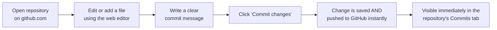
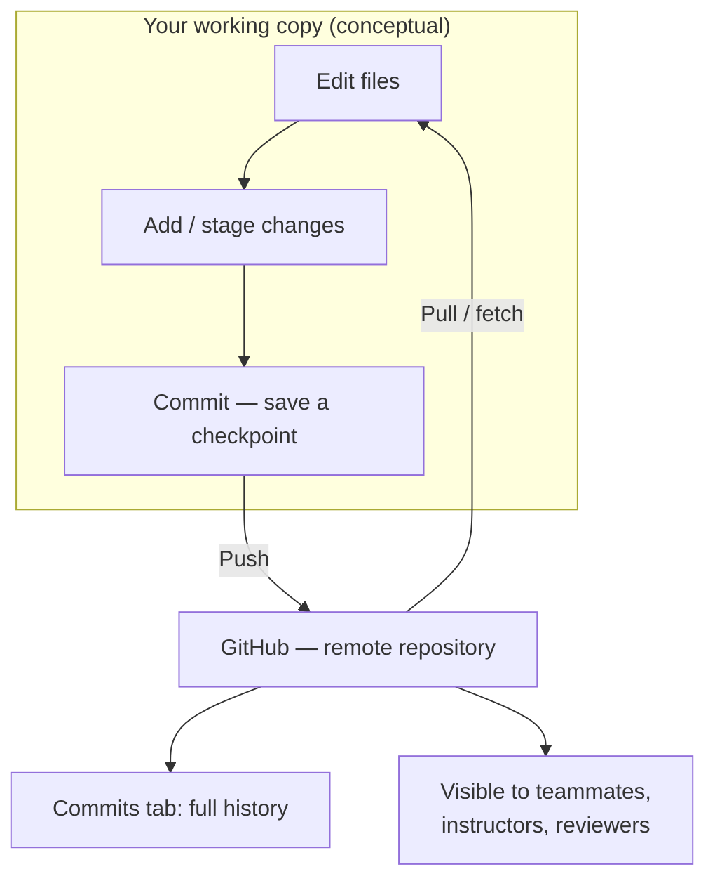

# Version Control Basics

---

[← Previous: 5.3 Case Study](../p5-files-exception-handling/unit-5-3-case-study.md) | [Go back to TOC](../../README.md) | [Next: 6.2 Portfolio & Diagnostic →](unit-6-2-portfolio-diagnostic.md)

## 1. Learning Objectives

By the end of this unit, you will be able to:

- **Explain** what problem version control solves, and why "my code changed and I don't know why" is a career-defining problem for a professional developer.
- **Differentiate** between Git and GitHub — what each one actually is, and how they work together.
- **Describe** the basic Git loop — add, commit, push — conceptually, and how it maps onto the GitHub web interface.
- **Identify** the role of GitHub Classroom in distributing and collecting coursework through private repositories.
- **Apply** good commit habits by writing clear, specific commit messages for small, logical changes.
- **Analyze** a repository's commit history to understand what changed, when, and why.

---

## 2. Overview
Have you ever edited a file, saved it, and later realized that the new changes were wrong? Since you already saved the file, the old version is lost. This can happen to anyone while writing code.

**Version control** is a way to solve this problem. It keeps a history of your project so that you can return to an earlier version whenever needed.

The most popular version control tool is **Git**. It saves snapshots of your project whenever you choose to save your progress. If you make a mistake later, you can go back to an earlier version instead of starting over.

For example, imagine you wrote a Python program that worked correctly. Later, you made some changes, and the program stopped working. Without Git, you may have to rewrite the working code. With Git, you can simply restore the earlier version.

When working in a team, Git also keeps track of **who made each change**, **when the change was made**, and **why it was made**. This makes teamwork much easier.

In this unit, you will learn the basic concepts of **Git** and **GitHub**, how to use **GitHub Classroom** to submit assignments, and the good practices for managing your projects. No command-line knowledge is required—you will learn everything using the GitHub website.

---

## 3. Description

### 3.1 Definition
Imagine you are writing a college assignment.

- On **Monday**, you write the first draft.
- On **Tuesday**, you improve it.
- On **Wednesday**, you accidentally delete an important section and save the file.

Without a backup, the original version is lost.

**Git** solves this problem. It keeps different versions of your project, so you can return to an earlier version whenever you need.

**GitHub** is a website that stores these versions online. This keeps your work safe even if your computer is lost or damaged, and it also makes it easy to share your work with your instructor or classmates.

### Git vs GitHub

| Git | GitHub |
|------|---------|
| A version control tool that tracks changes in your files. | A website that stores and shares Git projects online. |
| Works on your computer, even without the internet. | Requires the internet to access online projects. |
| Helps you save and restore different versions of your project. | Helps you back up, share, and collaborate on projects. |


In this course, you will use the **GitHub website** to manage and submit your projects.

### 3.2 Why This Concept Exists

Version control exists to solve three problems that every real software project eventually runs into:

- **Protecting work.** A single accidental overwrite, a corrupted file, or a lost laptop should never mean a project's history is gone. Git keeps every committed snapshot safe and recoverable.
- **Tracking history.** Real projects change for months or years. Without a recorded history, nobody — not even the original author — can reliably explain why a particular line of code exists or when a bug was introduced.
- **Enabling collaboration.** The moment more than one person touches the same project, someone needs a reliable way to combine everyone's changes without silently overwriting someone else's work. Git and GitHub are built specifically to make that safe.

This is why "learn Git and GitHub" appears in essentially every serious software job description, regardless of the programming language or industry — it is treated as a baseline professional skill, not an optional extra.

### 3.3 Key Terminology

| Term | Simple Meaning |
|---|---|
| **Repository ("repo")** | A project's folder, along with its entire saved history, tracked by Git. |
| **Commit** | One saved checkpoint — a snapshot of the project's files at a specific moment, labeled with a message explaining what changed and why. |
| **Commit message** | The short piece of text attached to a commit, describing what changed and why it changed. |
| **Add / staging** | Conceptually, choosing which changes are ready to be included in the next commit. On the GitHub web interface, this happens automatically when you edit or upload a file. |
| **Push** | Sending your committed checkpoints to GitHub, so the online copy matches your latest work. On the web interface, committing and pushing happen together in a single click. |
| **Pull / fetch** | Bringing changes made elsewhere (by you on another device, or by a teammate) down into the copy you are currently viewing or working on. |
| **Branch** | A separate line of commits that does not affect the main project until it is merged; `main` is normally the stable, always-working line. |
| **GitHub Classroom** | A GitHub tool instructors use to distribute assignments; each student who accepts an assignment gets their own private repository. |
| **Commit history** | The complete, ordered list of every commit ever made to a repository, viewable on GitHub's **Commits** tab. |
| **README** | A file (usually `README.md`) that explains what a repository contains and how to use it — the first thing a visitor sees. |
| **`.gitignore`** | A file listing items Git should never track, most importantly secrets such as passwords or API keys. |

### 3.4 Syntax / Workflow

Because this course works entirely through the GitHub website, "syntax" here means the sequence of actions you take in the browser rather than command-line commands. The conceptual loop — **add, commit, push** — maps onto the web interface as follows:

| Step | Conceptual Git Action | What You Do on github.com |
|---|---|---|
| 1 | Open or create a repository | Accept a GitHub Classroom assignment, or open an existing repository you have access to. |
| 2 | Make a change | Click **Add file** to create or upload a file, or click the pencil (edit) icon on an existing file. |
| 3 | Add (stage) the change | Handled automatically by GitHub when you use the web editor — there is no separate staging step to perform yourself. |
| 4 | Commit the change | Scroll to the commit box at the bottom of the page, write a clear commit message describing what changed, and select **Commit directly to the `main` branch**. |
| 5 | Push the change | Happens automatically the instant you click **Commit changes** — the online repository is updated immediately, with no separate upload step. |
| 6 | Review the history | Open the repository's **Commits** tab to see every checkpoint, in order, with its message, author, and timestamp. |

The key takeaway from this table: on the GitHub web interface, steps 3 through 5 collapse into one click. You do not need to separately "stage," "commit," and "push" the way someone working from a local computer with the git command line would — that distinction becomes relevant later in your career if you move to command-line Git, but is not required for this course.

**The Edit → Commit → Push Loop (Web Interface)**



**Local Work vs GitHub (Conceptual)**



**Comparison Table: Local Repository vs Remote Repository**

| Aspect | Local Repository | Remote Repository (GitHub) |
|---|---|---|
| Where it lives | On the machine or environment where the work happens | Hosted online at github.com |
| Who can see it | Only whoever has access to that machine | Anyone with repository access, from anywhere with internet |
| Survives device loss? | No — a lost or damaged device can mean losing the repository | Yes — the copy on GitHub is independent of any one device |
| How this course uses it | Not used directly — this course works through the browser | Used directly for every action: creating files, committing, reviewing history |
| Typical use later in a career | Where day-to-day editing and committing happens via the git command line | Where work is shared, reviewed, and combined with a team's work |

### 3.5 Rules

- A commit should represent one logical, self-contained change — not an unrelated mix of edits bundled together.
- A commit message must describe **what changed and why**, in a short phrase — not just repeat the file name or say nothing useful (`"update"`, `"changes"`).
- A repository accepted through GitHub Classroom is private by default — only you and your instructor can see it, unless your instructor configures it otherwise.
- Secrets — passwords, API keys, personal access tokens — must never be committed, because a commit history is permanent and, on a public repository, visible to anyone.

### 3.6 Best Practices

- **Commit often, in small logical chunks.** A commit that changes one function or fixes one bug is far easier to review and understand later than one giant commit touching ten unrelated things.
- **Write commit messages for your future self.** Assume the reader (often you, three weeks later) has no memory of writing the code and only has the message to go on.
- **Use the imperative mood.** Write `"Fix rounding error in average calculation"`, not `"Fixed"` or `"Fixing"` — this matches the convention used across the professional Git community.
- **Keep a clear README.** Even a few lines explaining what a project does and how to run it makes a repository usable by someone landing on it with zero context.
- **Never commit secrets.** Keep passwords, tokens, and keys out of every commit — once something is committed, it exists permanently in the history even if you delete it in a later commit.

### 3.7 Common Mistakes

- **Vague commit messages.** Messages like `"update"`, `"fix"`, or `"changes"` tell a reviewer, and future-you, nothing about what actually happened.
- **Forgetting to commit regularly.** Working for hours without a single commit means a mistake can cost hours of unrecoverable progress — commit as soon as a small piece of work is genuinely done.
- **One giant commit with unrelated changes.** Bundling a bug fix, a new feature, and a typo correction into a single commit makes it far harder to find or undo any one of them later.
- **Leaving the default commit message.** GitHub's web editor pre-fills a generic message like `"Update filename.py"` — accepting it without editing it wastes the one part of a commit meant to explain your reasoning.
- **Confusing Git with GitHub.** Assuming GitHub *is* version control, rather than a website that hosts a Git repository, leads to confusion later when working with local, command-line Git.

### 3.8 Examples

**Example — one project's commit history, from vague to professional.**

Follow a single repository, `my-python-project`, containing `average_calculator.py`, through three real commits made in order over a few days.

The first commit is made in a hurry, right after the script first runs successfully:

```
update
```

*Explanation:* This tells a reviewer nothing about what changed. A month later, even the author who wrote it would have to open the commit and read the code just to remember what it was for.

A few days later, a rounding bug is fixed, and this time the commit message is written properly:

```
Fix rounding error in average marks calculation
```

*Explanation:* This says exactly what changed (a rounding error) and where (average marks calculation). Anyone reading the history — including future-you — immediately understands the purpose of this checkpoint without opening a single file.

The next change is bigger, so the commit gets a short summary line plus a body explaining the reasoning:

```
Add input validation for negative marks

Previously, entering a negative number for marks was accepted
without any check, producing an incorrect average. This commit
adds a check that rejects negative values before the average
is calculated.
```

*Explanation:* The first line is a short summary (used as the headline in the Commits tab); the blank line and paragraph beneath it explain the reasoning in more depth. This two-part structure is the professional standard for any commit that needs more explanation than a one-liner can give.

Across these three commits, the repository itself has kept the same simple, professional structure throughout:

```
my-python-project/
├── README.md
├── .gitignore
└── average_calculator.py
```

*Explanation:* `README.md` is the front door explaining what the project does; `.gitignore` keeps files like secrets or temporary files out of the tracked history; `average_calculator.py` is the actual working code. Even a small student project benefits from this same three-piece shape — it is exactly what a reviewer expects to find. Notice how the *messages* improved from commit to commit while the *structure* stayed clean the whole time — both habits matter, and neither replaces the other.

#### Try It Yourself

You are working in the same `my-python-project` repository. For each part below, write the commit message you would use, then check it against the solution.

**Part 1 (Easy).** You just wrote the very first working version of `average_calculator.py` — it reads a list of marks and prints the average. Write a clear commit message for this first commit.

**Solution:**
```
Add initial version of average calculator
```
This names the exact file's purpose and makes clear this is the starting point of the project — far better than a default or vague message like `"first commit"` or `"add file"`.

**Part 2 (Medium).** You notice `average_calculator.py` crashes with a `ZeroDivisionError` whenever it is given an empty list of marks. You fix it by adding a check that returns `0` instead of crashing when the list is empty. Write a commit message for this change.

**Solution:**
```
Handle empty marks list to prevent division-by-zero crash
```
This names both *what* changed (a guard for the empty-list case) and *why* it mattered (preventing a crash) — exactly the "what and why" standard from §3.5, in a single imperative-mood line.

**Part 3 (Harder).** You open the **Commits** tab and see this history, most recent first:

```
fixed it
Handle empty marks list to prevent division-by-zero crash
update
```

Identify which commit message violates the project's commit-message standard, and rewrite it as a professional message. Assume the underlying change was: you discovered the average was printed with 5 decimal places and rounded it to 2 for readability.

**Solution:** The most recent commit, `"fixed it"`, is the violation — like `"update"` before it, it says nothing about what was fixed or why, forcing anyone reading the history to open the code just to understand the checkpoint. A professional rewrite, matching the style of the other two messages in this history:
```
Round average output to two decimal places for readability
```

---

## 4. Real-World Application

Every real engineering team — a five-person startup, a bank's core-banking team, an e-commerce platform's checkout squad, a hospital's patient-records software team — relies on Git and GitHub (or an equivalent) for every single change that reaches production code. Nothing goes live without first being committed, and in almost every serious organization, without first being reviewed through a **pull request** — a proposed change that a teammate reviews and approves before it is merged into the main project.

This is precisely why a group project where one teammate's "fix" quietly breaks someone else's feature is usually solvable in minutes on a real team: open the Commits tab (or the pull request history) and see exactly which checkpoint introduced the regression — a change that breaks something that used to work — who made it, and what they wrote as the reason. In banking and healthcare software especially, this permanent, attributable history is not just convenient — it is often a compliance requirement, since regulators expect a clear record of exactly what changed in production systems and when.

The same logic is why GitHub Classroom, covered next, distributes and collects coursework this way: each student gets a real, private repository, with a real commit history behind their submission — not a zip file with no story behind it. Recruiters and interviewers reviewing a candidate's GitHub profile treat commit history the same way: as evidence of real, dated, incremental work, not just a finished product that appeared all at once.

---

## 5. Worked Example

### Problem Statement

You have just finished a small Python script from your work in Modules P1 to P5 — say, a script that calculates the average of a list of marks. You want to save it safely and share it using GitHub Classroom, following good commit habits, so that both your progress and your reasoning are permanently recorded.

### Step 1: Understand the Problem

You need a place to store this file where it will not be lost, where your instructor can see it, and where the history of how you built and refined it is preserved. A plain file on your own device satisfies none of these — a single accidental deletion or overwrite would destroy it with no way to recover the earlier version.

### Step 2: Plan the Solution

Accept the relevant GitHub Classroom assignment to get your own private repository. Add the Python file to it through the web interface. Make the first version work, commit it with a clear message. Then improve it in a second, separate change, and commit that separately too — so the history shows two distinct, explainable checkpoints rather than one opaque final version.

### Step 3: Walk Through the Steps

1. Click the GitHub Classroom link shared by your instructor.
2. Sign in with your GitHub account, then click **Accept this assignment**. GitHub creates your own private repository and gives you a link to it.
3. Open your repository, click **Add file → Create new file**, and name it `average_calculator.py`.
4. Write the first working version of the script in the web editor.
5. Scroll to the commit box, replace the default message with something specific — `"Add initial version of average calculator"` — and click **Commit changes**.
6. Click the pencil (edit) icon on `average_calculator.py`, and improve the script — for example, add a check that rejects an empty list of marks.
7. Commit this second change separately, with its own clear message — `"Add empty-list check to average calculator"`.
8. Open the **Commits** tab and confirm both checkpoints are listed, each with its own message and timestamp.

### Step 4: Explain Each Step

- Accepting the assignment (steps 1-2) creates a private, permanent home for your work — visible only to you and your instructor, the same way your own save file is never mixed up with anyone else's.
- Creating the file and writing the first version (steps 3-4) is ordinary editing — nothing is saved as a checkpoint yet.
- Committing (step 5) turns that edit into a permanent, labeled snapshot. The message explains *what* this checkpoint represents.
- Editing again (step 6) and committing separately (step 7) deliberately keeps the two changes apart in the history, instead of merging them into one commit that hides two distinct improvements behind a single vague label.
- Reviewing the Commits tab (step 8) proves — to yourself, not just your instructor — that both changes are permanently recorded and independently visible.

### Step 5: Sample Input

The file being added, in its first committed version:

```python
def average(marks):
    return sum(marks) / len(marks)

print(average([80, 75, 90]))
```

### Step 6: Expected Output

After both commits, the repository's **Commits** tab shows:

```
Add empty-list check to average calculator      (most recent)
Add initial version of average calculator       (earlier)
```

Clicking the earlier commit shows `average_calculator.py` exactly as it looked right after step 5 — without the empty-list check — even though the file in the repository today already includes it.

### Step 7: Why This Result Occurs

Each commit is a permanent, independent snapshot — committing again never erases or rewrites an earlier commit, it simply adds a new one on top of the history. Because the two changes were committed separately with distinct messages, the history clearly shows two logical steps in your work rather than one unexplained final state. This is exactly the property that makes it possible, months later, to answer "what did this file look like before the empty-list check was added, and why was that check added at all?"

---

### Important Notes (Interview Insights)

**Q: "How important is Git/GitHub knowledge in developer interviews?"**

Git and GitHub are near-universal expectations for any developer role today, regardless of the company or the stack — expect at least one interview question that assumes you already use them daily.

**Q: "What's the difference between Git and GitHub?"**

Be ready to clearly explain it in your own words — this is one of the most common fresher interview questions in this area, and confusing the two is an immediate red flag to an interviewer.

**Q: "Can you describe your own commit habits?"**

Be ready with a concrete answer — for example, "I commit each time a small, working piece of a feature is done, and I write a message describing what changed and why."

**Q: "What is a pull request?"**

Interviewers sometimes ask this even at fresher level: it is a proposed set of changes on GitHub, submitted for review before being merged into the main project — you will not create one in this unit, but knowing the term is expected.

---

## 6. Key Takeaways

- **Version control** solves a specific, career-wide problem: saving over a file destroys the old version, unless something is keeping labeled snapshots of it over time.
- **Git is the version control system**; **GitHub is a website that hosts Git repositories online** — confusing the two is a common beginner mistake and a red flag in interviews.
- The conceptual loop is **add → commit → push**; on the GitHub web interface, these collapse into a single **Commit changes** click.
- **GitHub Classroom** distributes and collects assignments by giving each student their own private repository.
- A **commit message** should describe what changed and why, in the imperative mood — vague messages like `"update"` are the most common beginner mistake in this area.
- **Commit often, in small logical chunks** — one giant commit mixing unrelated changes is hard to review and hard to undo.
- Never commit **secrets** — passwords, API keys, and tokens must stay out of a repository's permanent history.
- A clear **README** and a thoughtful `.gitignore` are what separate a professional repository from one nobody, including its own author, can make sense of later.

Coming next: Portfolio & Diagnostic, where everything you have built across this course comes together.

---

## 7. Reference Links

- [GitHub Docs — Getting Started with Git](https://docs.github.com/en/get-started)
- [GitHub Docs — Writing on GitHub / About Commits](https://docs.github.com/en/pull-requests/committing-changes-to-your-project/creating-and-editing-commits/about-commits)
- [GitHub Classroom Documentation](https://docs.github.com/en/education/manage-coursework-with-github-classroom)
- [Git Official Documentation](https://git-scm.com/doc)
- [Real Python — Basic Git Commands (Concepts)](https://realpython.com/python-git-github-intro/)

[← Previous: 5.3 Case Study](../p5-files-exception-handling/unit-5-3-case-study.md) | [Go back to TOC](../../README.md) | [Next: 6.2 Portfolio & Diagnostic →](unit-6-2-portfolio-diagnostic.md)

---

*© 2026 Revature · AI Native Engineering — Foundations · Unit 6.1 · Version 2.0*