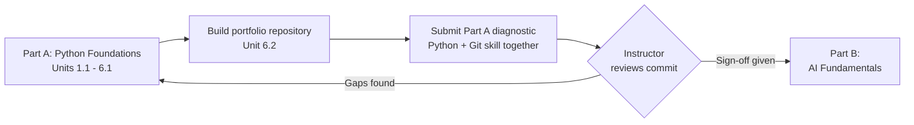
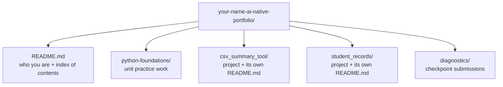

# Portfolio & Diagnostic

---

[← Previous: 6.1 Version Control Basics](unit-6-1-version-control-basics.md) | [Go back to TOC](../../README.md)

## 1. Learning Objectives

By the end of this unit, you will be able to:

- **Explain** what a portfolio repository is and why it is different from the disposable practice repos you created in Unit 6.1.
- **Describe** what the end-of-Part-A diagnostic checks and why it exists as a gate before Part B.
- **Create** a permanent, public GitHub repository to hold your work for the rest of the programme.
- **Implement** a clear folder structure and a README that a stranger can understand in under a minute.
- **Differentiate** between a messy, disorganized repository and a well-organized one, using specific, checkable criteria.
- **Apply** the commit discipline from Unit 6.1 to build a commit history that itself acts as evidence of consistent work.

---

## 2. Overview

Every unit before this one taught you a new Python or Git skill. This unit is different — it does not add a new skill. It asks you to organize and present the skills you already have, in a place someone outside this course can actually see them.

In the Indian IT job market, this matters more than most freshers expect. Recruiters and interviewers at product companies, service companies, and startups alike routinely ask for a GitHub profile link alongside a resume, and many open it before the interview even starts. A resume tells an interviewer what you claim to know; a **portfolio repository** shows them, in your own commits, whether that claim holds up. Two candidates with identical resumes can leave very different impressions purely because one has an empty or disorganized GitHub profile and the other has a clean, well-documented one.

This unit also closes Part A of the programme with the **Part A diagnostic** — a small, deliberately simple task that combines one Python skill and one Git skill, submitted through your portfolio repository. It is not designed to be hard. Its only job is to confirm, before you move into Part B, that your Python and Git foundations are solid enough to build on without re-teaching the basics.

By the end of this unit, you will have a live, public portfolio repository and a clear picture of what the diagnostic checkpoint expects from you.

---

## 3. Description

### 3.1 Definition

A **portfolio repository** is a single, permanent GitHub repository that you create once and keep adding to for as long as you are learning and building software. Unlike a one-off assignment repo, it is not deleted or abandoned after a unit ends — it grows with you, unit after unit, module after module, eventually holding a running record of everything you have built.

A **diagnostic** (also called a **checkpoint assessment**) is a small, focused task used to confirm that a learner has reached a required level of skill before being allowed to move to the next stage. It is not meant to teach anything new or to be difficult — every skill it requires has already been practised earlier. Its only purpose is to verify readiness. The **Part A diagnostic** in this unit is exactly that: one short task combining a Python skill (reading and summarizing data from a file) and a Git skill (committing and pushing that result), reviewed and signed off by your instructor before you begin Part B.

**Part A to Part B Flow**



### 3.2 Why This Concept Exists

Two separate problems make this unit necessary, and both come down to the same idea: skill that nobody can see is skill nobody can act on.

- **Employers cannot interview everyone in depth.** A recruiter screening dozens of fresher applications does not have time to test every candidate's coding ability from scratch. A public, well-organized portfolio does that verification for them — it is evidence they can check in minutes, before ever speaking to you.
- **A programme cannot safely assume readiness without checking it.** Part B of this programme — AI Fundamentals — builds directly on Python and Git skills, assuming you can already read and write Python comfortably and commit your work without being walked through the steps. Without a checkpoint, some learners would move forward with gaps that only surface later, when they are much harder to fix. The diagnostic exists to catch that early, while it is still cheap to address.

### 3.3 Key Terminology

| Term | Simple Meaning |
|---|---|
| **Portfolio repository** | A single, permanent GitHub repository you create once and keep updating for the rest of the programme, showcasing your work. |
| **README** | The `README.md` file shown automatically on a repository's main page — usually the first (and sometimes only) thing a visitor reads. |
| **Project structure** | The way folders and files inside a repository are organized, so their purpose is clear without opening every file. |
| **Diagnostic / checkpoint assessment** | A small, focused task used to confirm a learner has reached a required skill level before advancing further. |
| **Commit history** | The full sequence of commits in a repository, visible to anyone — it acts as a timestamped record of what you did and when. |
| **Sign-off** | An instructor's confirmation, given after reviewing your diagnostic submission, that you are ready to proceed to the next stage. |
| **Public repository** | A repository anyone with the link can view — required for recruiters and instructors to review your work. |

### 3.4 Syntax/Structure

A good portfolio repository does not need to be complex — it needs to be predictable. A reader should be able to guess where something lives from the folder name alone.

| Path | Purpose |
|---|---|
| `README.md` | Top-level overview: who you are, what the repository contains, and where to look for specific work. |
| `python-foundations/` | One folder per module or unit's practice work, e.g. `p1-introduction/`, `p3-control-flow/`. |
| `<project-name>/` | One folder per stand-alone project, named for what it does — e.g. `csv_summary_tool/`, not `week5` or `misc`. |
| `<project-name>/README.md` | A short, project-level README explaining what that specific project does and how to run it. |
| `diagnostics/` | A folder to hold diagnostic or checkpoint submissions as the programme progresses. |

Keep the layout flat rather than deeply nested. A handful of clearly named top-level folders is easier for a visitor to scan than several layers of subfolders they must click through just to find something.

**Comparison Table: Messy vs Well-Organized Portfolio Repository**

| Aspect | Messy Repository | Well-Organized Repository |
|---|---|---|
| README | Missing, or one vague line | Clear title, description, and index of contents |
| Folder names | `misc/`, `week3/`, `stuff/` | `csv_summary_tool/`, `student_records/` |
| Commit history | Few commits, vague messages like `update` | Frequent commits with clear, specific messages |
| File organization | Unrelated files mixed together | One folder per project, related files kept together |
| Visibility | Private, or forgotten after creation | Public and actively maintained |
| Reader's experience | Has to open every file to understand anything | Can predict where something lives from folder/README alone |

**Portfolio Repository Structure**



### 3.5 Rules

The Part A diagnostic itself is intentionally narrow in what it demands — but what it demands, it demands exactly:

- The submission must be **working code**, committed to your portfolio repository, that runs without errors on the sample input provided.
- It must demonstrate **one Python skill** from Part A (such as reading a file and computing a summary) and **one Git skill** from Unit 6.1 (such as committing and pushing that result) — together, not in isolation.
- The commit must be **pushed to a public repository** your instructor can open and review directly on GitHub — a local-only commit or a private repo cannot be reviewed.
- **Sign-off** happens only after your instructor reviews the actual commit — not a description of it, not a screenshot, the real code in the real repository.

### 3.6 Best Practices

- Write a clear, specific top-level **README** — who you are, what this repository collects, and a short index of what is inside. Avoid vague, generic openings that could describe anyone's repository.
- Organize projects **logically**, one folder per project, named for its contents rather than a date or a vague label like `misc` or `week4`.
- Keep your **commit history** meaningful, exactly as you practised in Unit 6.1 — commit messages that say what changed and why, not `update` or `final final v2`.
- Update the portfolio **regularly** as you complete new work, rather than doing one large dump at the end — a steady commit history is itself evidence of consistent effort.
- Keep the repository **public** from the very start. A private repository cannot be reviewed by an instructor or shown to a recruiter later.

### 3.7 Common Mistakes

- **An empty or near-empty repository** — created once and never updated, which tells a reader nothing about your actual ability.
- **No README, or a one-line placeholder README** — leaves a visitor guessing what the repository even contains, so most simply move on.
- **Dumping unrelated files with no explanation** — screenshots, half-finished scripts, and random notes mixed together with no folder structure or context.
- **Vague folder and file names** — `test1.py`, `final.py`, `stuff/` — that force a reader to open every file just to understand what is there.
- **Keeping the repository private "until it's finished"** — a portfolio is never really finished; it is meant to be watched growing, not hidden until perfect.

### 3.8 Examples

**Sample README.md snippet** for a portfolio repository's top level:

```markdown
# Priya Nair's AI-Native Engineering Portfolio

Python projects and exercises from the Python Foundations modules (P1-P6).

## What's Inside
- `csv_summary_tool/` — reads and summarizes transaction CSVs
- `student_records/` — class-based student record manager
- `diagnostics/` — checkpoint submissions reviewed by faculty

## Quick Start
Run the CSV summary tool:
`python csv_summary_tool/summary.py transactions.csv`
Prints row count, skipped/malformed rows, and basic statistics.
```

*Explanation:* The title and first line immediately tell a reader whose repository this is and what it contains — no guessing required. The "What's Inside" section acts as an index, so a visitor can jump straight to the project that interests them instead of opening every folder. The "Quick Start" section gives an exact command to run, which turns a passive reader into someone who can actually try the work themselves.

**Sample folder structure**, shown as a directory listing:

```
priya-ai-native-portfolio/
├── README.md
├── python-foundations/
│   ├── unit-1-2-practice.py
│   └── unit-3-1-practice.py
├── csv_summary_tool/
│   ├── README.md
│   └── summary.py
├── student_records/
│   ├── README.md
│   └── student_records.py
└── diagnostics/
    └── part-a-diagnostic.py
```

*Explanation:* Each project sits in its own clearly named folder, so a reader can predict its contents without opening it. Larger projects (`csv_summary_tool/`, `student_records/`) carry their own short README, giving detail specific to that project without cluttering the top-level one. The `diagnostics/` folder keeps checkpoint submissions separate from regular practice work, so an instructor reviewing sign-off knows exactly where to look.

#### Try It Yourself

**Part 1 — Write a project description.** Imagine you have a new project folder called `grade_calculator/` containing a script that reads a CSV of student marks and prints each student's weighted average grade. Write a one-paragraph "What's Inside" style entry for it, in the same style as Priya's README above, that a stranger could read and immediately understand what the project does and how to run it.

**Solution:**
```markdown
## What's Inside
- `grade_calculator/` — reads student marks from a CSV and prints each student's weighted average grade

## Quick Start
Run the grade calculator:
`python grade_calculator/grades.py marks.csv`
Prints each student's name alongside their computed weighted average.
```

**Part 2 — Spot what's missing.** A classmate shows you their portfolio's folder structure:

```
rahul-portfolio/
├── week2.py
├── week5_final.py
├── stuff/
│   ├── notes.txt
│   └── old_test.py
└── project2/
    └── main.py
```

List at least three specific problems with this structure, referring to the messy-vs-well-organized criteria from §3.4 and the Comparison Table in §3.4.

**Solution:** (1) There is no top-level `README.md`, so a visitor has no index or explanation of what the repository contains. (2) File and folder names are vague and uninformative — `week2.py`, `week5_final.py`, `stuff/`, and `project2/` say nothing about what the code actually does. (3) Unrelated files are dumped together instead of one folder per project — `stuff/` mixes personal notes with a leftover test file, and the two scripts sit loose at the top level instead of inside their own project folders. (4) Neither `project2/` nor the top level has its own README explaining what it does or how to run it.

**Part 3 — Redesign it.** Using your answer to Part 2, rewrite Rahul's structure as a well-organized layout, following the pattern shown in §3.4's structure diagram (one folder per project, a top-level README, a `diagnostics/` folder if needed).

**Solution:**
```
rahul-ai-native-portfolio/
├── README.md
├── python-foundations/
│   └── unit-2-1-practice.py
├── grade_calculator/
│   ├── README.md
│   └── main.py
└── diagnostics/
    └── part-a-diagnostic.py
```
`week2.py` becomes clearly labeled practice work under `python-foundations/`, `week5_final.py` and `project2/main.py` are merged into a single, sensibly named `grade_calculator/` project with its own README, and `stuff/notes.txt` / `old_test.py` are either deleted or moved into the relevant project folder if still useful — nothing is left loose or unexplained at the top level.

---

## 4. Real-World Application

- **Recruitment screening:** At Indian IT services firms, product companies, and startups alike, recruiters and technical interviewers commonly ask for a GitHub link on a fresher's resume, and many open it before the interview begins. A portfolio with clear READMEs and organized projects can generate follow-up questions and genuine interest; an empty or disorganized one rarely does.
- **Banking, e-commerce, and startup hiring:** Banking and e-commerce companies hiring for engineering roles increasingly look for evidence of hands-on coding ability, not just marks or certificates — a well-kept portfolio, alongside personal or open-source contributions, is viewed as a real signal of initiative and consistency. Startups, with leaner hiring processes, often weigh this even more heavily, since they may not have the bandwidth for lengthy technical interviews.
- **Faculty and internal review:** Just as your instructor will review your Part A diagnostic directly on GitHub rather than through a zip file or screenshot, many technical teams review a new hire's or intern's early work the same way — through commits, not descriptions of commits.
- **A living record across the whole programme:** This portfolio repository does not end with Part A. Every later part of the AI Native Engineering programme — AI Fundamentals in Part B, and everything after it — will keep adding to this same repository, so it becomes a continuously growing record of your entire journey, not a one-time exercise.

---

## 5. Worked Example

### Problem Statement

Set up your personal portfolio repository and organize your Python Foundations work so it is ready for review before the Part A diagnostic.

### Step 1: Understand the Problem

You need one permanent, public GitHub repository containing an overview README and your strongest work from Units 1.1 through 6.1, organized so an instructor (or later, a recruiter) can understand it without opening every file. You then need to add one small diagnostic script that proves your Python and Git skills work together, and get it reviewed.

### Step 2: Plan the Solution

Create the repository once, write a specific and honest README, move your best practice work into clearly named project folders one at a time (committing as you go), then add and push the diagnostic script in its own folder, and finally notify your instructor for sign-off.

### Step 3: Walk Through the Concrete Steps

1. On GitHub, click **New repository**. Name it something like `yourname-ai-native-portfolio`.
2. Set visibility to **Public**, exactly as you practised in Unit 6.1 — a private repository cannot be reviewed by an instructor or shown to a recruiter later.
3. Click **Create repository**, then create a `README.md` file directly on GitHub (or clone the repo locally and add it there, using the clone/commit/push workflow from Unit 6.1).
4. Write a first draft of the README with a title, a one-line description, and a short "What's Inside" list.
5. Create one folder per project you want to showcase, named for its contents — `csv_summary_tool/`, not `week5` — and move your strongest Part A work into each, committing after each move rather than in one giant commit.
6. Create a `diagnostics/` folder and add a short script, `part-a-diagnostic.py`, that reads a CSV of sample data and prints a summary (for example, row count and basic statistics), skipping or flagging malformed rows instead of crashing.
7. Commit this with a clear message (e.g. `Add Part A diagnostic - reads marks.csv and prints summary stats`) and push it to GitHub.
8. Share the repository link with your instructor as instructed, so they can review the commit directly and sign off.

### Step 4: Explain Each Step

- Steps 1-3 create the permanent repository and its first, visible entry point — the README — using the exact GitHub workflow from Unit 6.1.
- Step 4 applies the README structure from §3.8: a clear title, a one-line description, and an index of contents, so a visitor understands the repository within seconds.
- Step 5 applies the folder-structure guidance from §3.4 and §3.6 — one project per folder, named for its contents, moved and committed incrementally so the commit history itself shows steady progress.
- Steps 6-7 produce the actual diagnostic submission described in §3.5 — a small script combining a Python skill (reading and summarizing data) with a Git skill (commit and push).
- Step 8 completes the process described in §3.1 and §3.3 — the diagnostic is only considered passed once an instructor reviews the real commit on GitHub and gives sign-off.

### Step 5: Sample Input

A CSV file of sample marks, `marks.csv`, with columns such as `student_name` and `mark`, including at least one deliberately malformed row (for example, a missing or non-numeric mark) to confirm the diagnostic script handles bad data gracefully instead of crashing.

### Step 6: Expected Output

- A public GitHub repository named similarly to `yourname-ai-native-portfolio`, containing a clear top-level README, one folder per showcased project, and a `diagnostics/` folder.
- Console output from running `part-a-diagnostic.py` against `marks.csv`, for example:

```
Rows processed: 42
Malformed rows skipped: 1
Average mark: 74.2
Highest mark: 98
Lowest mark: 31
```

- A pushed commit visible on GitHub, and confirmation from your instructor that sign-off has been given.

### Step 7: Why This Result Matters

This result is the tangible proof that everything taught across Part A — variables, control flow, data structures, functions, classes, file handling, and now Git and GitHub — has come together into something a stranger can actually see and verify. It is also the literal gate into Part B: instructor sign-off on this diagnostic is what confirms your foundation is solid enough for AI Fundamentals to build on directly, without re-teaching Python or Git basics.

---

### Important Notes (Interview Insights)

- Recruiters and interviewers at Indian IT companies — from large service firms to product startups — routinely check a candidate's GitHub profile before or during screening, especially for freshers with limited work history. A clean, well-documented portfolio is one of the few concrete differentiators a fresher can control.
- Be ready to explain, in an interview, *what* is in your portfolio and *why* — an interviewer may click into a project and ask you to walk through it live. A repository you cannot explain is worse than no repository at all.
- Commit history is often checked as evidence of genuine, sustained effort rather than a single last-minute upload — a portfolio built up gradually, over many small commits, reads as more credible than one created in a single sitting the night before an interview.

---

## 6. Key Takeaways

- A **portfolio repository** is created once and grows for the entire programme, unlike the disposable per-assignment repos from Unit 6.1.
- A **README** is usually the first — and sometimes only — thing a reader opens; a specific, well-structured one is far more effective than a generic placeholder.
- **Folder structure** should let a reader predict where something lives from the folder name alone, without opening every file.
- The **Part A diagnostic** combines one Python skill and one Git skill in a small, deliberately easy task — it exists only to confirm readiness, not to teach anything new.
- Sign-off requires your instructor to review the **actual commit on GitHub**, not a description, screenshot, or zip file.
- **Commit history** itself is evidence — frequent, clearly messaged commits show consistent effort; recruiters and interviewers do notice this.
- Keep the repository **public** from day one; a private repository cannot be reviewed by anyone outside your own account.
- A clean, well-documented GitHub portfolio is a genuine differentiator for freshers in the Indian IT job market, where recruiters and interviewers routinely check GitHub profiles before or during screening.

Coming next: Congratulations on completing Python Foundations (Part A) — next comes the Part A diagnostic, followed by Part B of the AI Native Engineering programme.

---

## 7. Reference Links

- [GitHub Docs — About READMEs](https://docs.github.com/en/repositories/managing-your-repositorys-settings-and-features/customizing-your-repository/about-readmes)
- [GitHub Docs — Managing Your Profile README](https://docs.github.com/en/account-and-profile/setting-up-and-managing-your-github-profile/customizing-your-profile/managing-your-profile-readme)
- [Real Python — Build a Python Portfolio Project](https://realpython.com/intermediate-python-project-ideas/)
- [GitHub Docs — About GitHub Classroom](https://docs.github.com/en/education/manage-coursework-with-github-classroom/get-started-with-github-classroom/about-github-classroom)

[← Previous: 6.1 Version Control Basics](unit-6-1-version-control-basics.md) | [Go back to TOC](../../README.md)

---

*© 2026 Revature · AI Native Engineering — Foundations · Unit 6.2 · Version 2.0*
